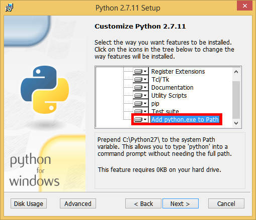
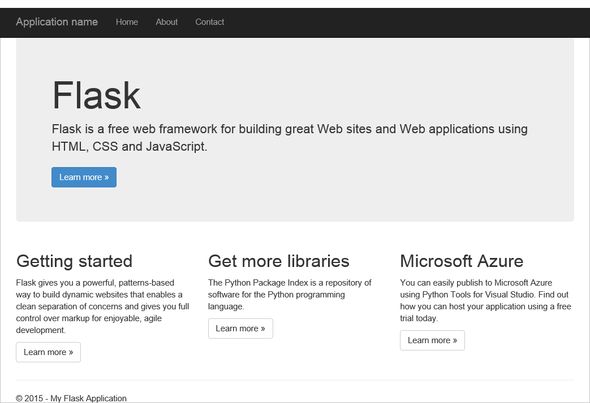
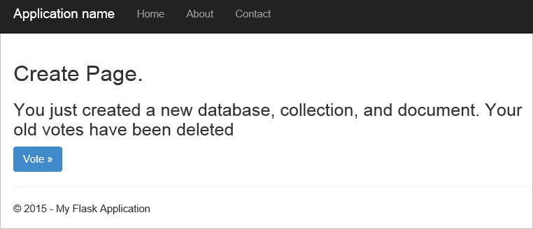

<properties
    pageTitle="Sviluppo di applicazioni Web pallone Python con DocumentDB | Microsoft Azure"
    description="Rivedere un'esercitazione di database in uso DocumentDB per archiviare e accedere ai dati da un'applicazione web Python pallone ospitata in Azure. Trovare le soluzioni di sviluppo di applicazioni." 
    keywords="Sviluppo di applicazioni, esercitazione con database, pallone python, applicazione web python, sviluppo web python, documentdb, azure, Microsoft azure"
    services="documentdb"
    documentationCenter="python"
    authors="syamkmsft"
    manager="jhubbard"
    editor="cgronlun"/>

<tags
    ms.service="documentdb"
    ms.workload="data-management"
    ms.tgt_pltfrm="na"
    ms.devlang="python"
    ms.topic="hero-article"
    ms.date="08/25/2016"
    ms.author="syamk"/>

# <a name="python-flask-web-application-development-with-documentdb"></a>Sviluppo di applicazioni Web pallone Python con DocumentDB

> [AZURE.SELECTOR]
- [.NET](documentdb-dotnet-application.md)
- [Node](documentdb-nodejs-application.md)
- [Java](documentdb-java-application.md)
- [Python](documentdb-python-application.md)

In questa esercitazione viene illustrato come utilizzare DocumentDB Azure per archiviare e dati di access da un Python ospitati in Azure di applicazione web e presuppongono hanno alcuni già esperienza nell'uso Python e siti Web Azure.

È descritta in questa esercitazione database:

1. Creazione e il provisioning di un account DocumentDB.
2. Creazione di un'applicazione MVC Python.
3. Connessione a e l'utilizzo di Azure DocumentDB dall'applicazione web.
4. Distribuzione dell'applicazione web ai siti Web di Azure.

Seguendo questa esercitazione si creerà una semplice applicazione voto che permette di voto per un sondaggio.


## <a name="database-tutorial-prerequisites"></a>Prerequisiti esercitazioni database

Prima di seguire le istruzioni fornite in questo articolo, è necessario verificare che si siano installati i seguenti:

- Un account Azure attivo. Se non si dispone di un account, è possibile creare un account di valutazione gratuito in pochi minuti. Per informazioni dettagliate, vedere [Versione di valutazione gratuita di Azure](https://azure.microsoft.com/pricing/free-trial/).
- [Visual Studio 2013](http://www.visualstudio.com/) o versione successiva, o [Visual Studio Express](), ossia la versione gratuita. Le istruzioni disponibili in questa esercitazione vengono scritti specificamente per Visual Studio 2015. 
- Python Tools per Visual Studio da [GitHub](http://microsoft.github.io/PTVS/). In questa esercitazione utilizza Python strumenti per VS 2015. 
- Azure SDK Python per Visual Studio, 2,4 o versione successiva disponibile da [azure.com](https://azure.microsoft.com/downloads/). È stato usato Microsoft Azure SDK per Python 2.7.
- Python 2.7 da [python.org][2]. È stato usato Python 2.7.11. 

> [AZURE.IMPORTANT] Se si sta installando 2.7 Python per la prima volta, assicurarsi che nella schermata Personalizzazione Python 2.7.11 si seleziona **aggiungere python.exe al percorso**.
> 
>    

- Microsoft Visual C++ compilatore per Python 2.7 dall' [Area Download Microsoft][3].

## <a name="step-1-create-a-documentdb-database-account"></a>Passaggio 1: Creare un account di database DocumentDB

Iniziamo creando un account DocumentDB. Se si dispone già di un account, è possibile passare al [passaggio 2: creare una nuova applicazione web Python pallone](#step-2:-create-a-new-python-flask-web-application).

[AZURE.INCLUDE [documentdb-create-dbaccount](../../includes/documentdb-create-dbaccount.md)]

<br/>
Verrà ora descritto come creare una nuova applicazione web Python pallone da zero alto.

## <a name="step-2-create-a-new-python-flask-web-application"></a>Passaggio 2: Creare una nuova applicazione web pallone Python

1. In Visual Studio, nel menu **File** scegliere **Nuovo**e quindi fare clic su **progetto**.

    Verrà visualizzata la finestra di dialogo **Nuovo progetto** .

2. Nel riquadro a sinistra espandere **modelli** e quindi **Python**e quindi fare clic su **Web**. 

3. Selezionare **Progetto Web da** nel riquadro centrale, quindi in **esercitazione**del tipo di casella il **nome** e quindi fare clic su **OK**. Tenere presente che i nomi di pacchetto Python devono essere interamente in lettere minuscole, come descritto nella [Guida di stile per il codice Python](https://www.python.org/dev/peps/pep-0008/#package-and-module-names).

    Per i nuovi utenti di Python da, è una struttura di sviluppo di applicazioni web che consente di creare applicazioni web in Python più rapidamente.

    

4. Nella finestra di **Python Tools per Visual Studio** , fare clic su **installazione in un ambiente virtuale**. 

    

5. Nella finestra **Aggiungi ambiente virtuale** , è possibile accettare le impostazioni predefinite e utilizzare Python 2.7 dell'ambiente di base perché PyDocumentDB non è attualmente supportato Python 3. x, quindi fare clic su **Crea**. Viene impostata l'ambiente virtuale Python necessario per il progetto.

    

    Nella finestra di output visualizza `Successfully installed Flask-0.10.1 Jinja2-2.8 MarkupSafe-0.23 Werkzeug-0.11.5 itsdangerous-0.24 'requirements.txt' was installed successfully.` quando l'ambiente di installazione.

## <a name="step-3-modify-the-python-flask-web-application"></a>Passaggio 3: Modificare l'applicazione web pallone Python

### <a name="add-the-python-flask-packages-to-your-project"></a>Aggiungere i pacchetti Python pallone al progetto

Dopo aver configurato il progetto, è necessario aggiungere al progetto, inclusi pydocumentdb, il pacchetto di Python per DocumentDB pacchetti pallone necessari.

1. In Esplora risorse, aprire il file denominato **requirements.txt** e sostituire il contenuto con le operazioni seguenti:

        flask==0.9
        flask-mail==0.7.6
        sqlalchemy==0.7.9
        flask-sqlalchemy==0.16
        sqlalchemy-migrate==0.7.2
        flask-whooshalchemy==0.55a
        flask-wtf==0.8.4
        pytz==2013b
        flask-babel==0.8
        flup
        pydocumentdb>=1.0.0

2. Salvare il file **requirements.txt** . 
3. In Esplora soluzioni rapida **env** e fare clic su **Installa da requirements.txt**.

    

    Al termine dell'installazione, la finestra di output visualizza le operazioni seguenti:

        Successfully installed Babel-2.3.2 Tempita-0.5.2 WTForms-2.1 Whoosh-2.7.4 blinker-1.4 decorator-4.0.9 flask-0.9 flask-babel-0.8 flask-mail-0.7.6 flask-sqlalchemy-0.16 flask-whooshalchemy-0.55a0 flask-wtf-0.8.4 flup-1.0.2 pydocumentdb-1.6.1 pytz-2013b0 speaklater-1.3 sqlalchemy-0.7.9 sqlalchemy-migrate-0.7.2

    > [AZURE.NOTE] Talvolta può essere visualizzato un errore nella finestra di output. In questo caso, verificare se l'errore è correlata a pulizia. A volte la pulizia ha esito negativo, ma l'installazione non saranno comunque esito negativo (scorrimento verso l'alto nella finestra di output per verificarlo). È possibile controllare l'installazione, [verificare l'ambiente virtuale](#verify-the-virtual-environment). Se l'installazione non riuscita, ma la verifica ha esito positivo, è possibile continuare.

### <a name="verify-the-virtual-environment"></a>Verificare l'ambiente virtuale

Assicurarsi che tutto sia installato correttamente.

1. Compilare la soluzione premendo **Ctrl**+**MAIUSC**+**B**.
2. Dopo la compilazione ha avuto esito positivo, avviare il sito Web premendo **F5**. Verrà avviato il server di sviluppo pallone e avviato il browser. Verrà visualizzata la pagina seguente.

    

3. Interrompere il debug del sito Web premendo **MAIUSC**+**F5** in Visual Studio.

### <a name="create-database-collection-and-document-definitions"></a>Creare database, raccolte e le definizioni di documento

A questo punto creare l'applicazione voto aggiungendo nuovi file e aggiornamento di altri utenti.

1. In Esplora soluzioni fare clic sul progetto **esercitazione** , fare clic su **Aggiungi**e quindi fare clic su **Nuovo elemento**. Selezionare **File Python vuoto** e assegnare un nome di file **forms.py**.  
2. Aggiungere il codice seguente al file forms.py e quindi salvare il file.

```python
from flask.ext.wtf import Form
from wtforms import RadioField

class VoteForm(Form):
    deploy_preference  = RadioField('Deployment Preference', choices=[
        ('Web Site', 'Web Site'),
        ('Cloud Service', 'Cloud Service'),
        ('Virtual Machine', 'Virtual Machine')], default='Web Site')
```


### <a name="add-the-required-imports-to-viewspy"></a>Aggiungere le importazioni obbligatorie views.py

1. In Esplora soluzioni espandere la cartella **esercitazione** e aprire il file **views.py** . 
2. Aggiungere le seguenti istruzioni import nella parte superiore del file **views.py** , quindi salvare il file. Questi importare PythonSDK del DocumentDB e i pacchetti pallone.

    ```python
    from forms import VoteForm
    import config
    import pydocumentdb.document_client as document_client
    ```


### <a name="create-database-collection-and-document"></a>Creare database, insieme e documenti

- Sempre in **views.py**, aggiungere il codice seguente alla fine del file. Si gestisce la creazione del database utilizzato dal modulo. Non eliminare alcun codice esistente in **views.py**. È sufficiente aggiungere alla fine.

```python
@app.route('/create')
def create():
    """Renders the contact page."""
    client = document_client.DocumentClient(config.DOCUMENTDB_HOST, {'masterKey': config.DOCUMENTDB_KEY})

    # Attempt to delete the database.  This allows this to be used to recreate as well as create
    try:
        db = next((data for data in client.ReadDatabases() if data['id'] == config.DOCUMENTDB_DATABASE))
        client.DeleteDatabase(db['_self'])
    except:
        pass

    # Create database
    db = client.CreateDatabase({ 'id': config.DOCUMENTDB_DATABASE })

    # Create collection
    collection = client.CreateCollection(db['_self'],{ 'id': config.DOCUMENTDB_COLLECTION })

    # Create document
    document = client.CreateDocument(collection['_self'],
        { 'id': config.DOCUMENTDB_DOCUMENT,
          'Web Site': 0,
          'Cloud Service': 0,
          'Virtual Machine': 0,
          'name': config.DOCUMENTDB_DOCUMENT 
        })

    return render_template(
       'create.html',
        title='Create Page',
        year=datetime.now().year,
        message='You just created a new database, collection, and document.  Your old votes have been deleted')
```

> [AZURE.TIP] Il metodo **CreateCollection** accetta un facoltativo **RequestOptions** come terzo parametro. Può essere utilizzato per specificare il tipo di offerta per la raccolta. Se viene specificato alcun valore offerType, la raccolta verrà creata usando il tipo di offerta predefinito. Per ulteriori informazioni sui tipi di offerta DocumentDB, vedere [livelli di prestazioni in DocumentDB](documentdb-performance-levels.md).


### <a name="read-database-collection-document-and-submit-form"></a>Per saperne di database, insieme, il documento e inviare moduli

- Sempre in **views.py**, aggiungere il codice seguente alla fine del file. Questa operazione si occupa dell'impostazione del modulo, leggere il database, insieme e documento. Non eliminare alcun codice esistente in **views.py**. È sufficiente aggiungere alla fine.

```python
@app.route('/vote', methods=['GET', 'POST'])
def vote(): 
    form = VoteForm()
    replaced_document ={}
    if form.validate_on_submit(): # is user submitted vote  
        client = document_client.DocumentClient(config.DOCUMENTDB_HOST, {'masterKey': config.DOCUMENTDB_KEY})

        # Read databases and take first since id should not be duplicated.
        db = next((data for data in client.ReadDatabases() if data['id'] == config.DOCUMENTDB_DATABASE))

        # Read collections and take first since id should not be duplicated.
        coll = next((coll for coll in client.ReadCollections(db['_self']) if coll['id'] == config.DOCUMENTDB_COLLECTION))

        # Read documents and take first since id should not be duplicated.
        doc = next((doc for doc in client.ReadDocuments(coll['_self']) if doc['id'] == config.DOCUMENTDB_DOCUMENT))

        # Take the data from the deploy_preference and increment our database
        doc[form.deploy_preference.data] = doc[form.deploy_preference.data] + 1
        replaced_document = client.ReplaceDocument(doc['_self'], doc)

        # Create a model to pass to results.html
        class VoteObject:
            choices = dict()
            total_votes = 0

        vote_object = VoteObject()
        vote_object.choices = {
            "Web Site" : doc['Web Site'],
            "Cloud Service" : doc['Cloud Service'],
            "Virtual Machine" : doc['Virtual Machine']
        }
        vote_object.total_votes = sum(vote_object.choices.values())

        return render_template(
            'results.html', 
            year=datetime.now().year, 
            vote_object = vote_object)

    else :
        return render_template(
            'vote.html', 
            title = 'Vote',
            year=datetime.now().year,
            form = form)
```


### <a name="create-the-html-files"></a>Creare file HTML

1. In Esplora soluzioni nella cartella **esercitazione** , fare clic con il pulsante destro nella cartella **modelli** , fare clic su **Aggiungi**e quindi fare clic su **Nuovo elemento**. 
2. Selezionare **Pagina HTML**e quindi nella casella Nome digitare **create.html**. 
3. Ripetere i passaggi 1 e 2 per creare altri due file HTML: results.html e vote.html.
4. Aggiungere il codice seguente **create.html** nel `<body>` elemento. Viene visualizzato un messaggio che segnala che viene creato un nuovo database, insieme e documento.

    ```html
    
    
    <h2>{{ title }}.</h2>
    <h3>{{ message }}</h3>
    <p><a href="{{ url_for('vote') }}" class="btn btn-primary btn-large">Vote &raquo;</a></p>
    
    ```

5. Aggiungere il codice seguente **results.html** nel `<body`> elemento. Visualizza i risultati del sondaggio.

    ```html
    
    
    <h2>Results of the vote</h2>
        <br />
        
    
    <div class="row">
        <div class="col-sm-5">{{choice}}</div>
            <div class="col-sm-5">
                <div class="progress">
                    <div class="progress-bar" role="progressbar" aria-valuenow="{{vote_object.choices[choice]}}" aria-valuemin="0" aria-valuemax="{{vote_object.total_votes}}" style="width: {{(vote_object.choices[choice]/vote_object.total_votes)*100}}%;">
                                {{vote_object.choices[choice]}}
                </div>
            </div>
            </div>
    </div>
    
    
    <br />
    <a class="btn btn-primary" href="{{ url_for('vote') }}">Vote again?</a>
    
    ```

6. Aggiungere il codice seguente **vote.html** nel `<body`> elemento. Visualizza il sondaggio e accetta i voti. Su come registrare i voti, il controllo trasmesse a views.py nel punto in cui verrà riconoscere il cast di voto e aggiungere il documento a seconda dei casi.

    ```html
    
    
    <h2>What is your favorite way to host an application on Azure?</h2>
    <form action="" method="post" name="vote">
        {{form.hidden_tag()}}
            {{form.deploy_preference}}
            <button class="btn btn-primary" type="submit">Vote</button>
    </form>
    
    ```

7. Nella cartella **modelli** sostituire il contenuto di **index** con le operazioni seguenti. Funge da della pagina per l'applicazione.
    
    ```html
    
    
    <h2>Python + DocumentDB Voting Application.</h2>
    <h3>This is a sample DocumentDB voting application using PyDocumentDB</h3>
    <p><a href="{{ url_for('create') }}" class="btn btn-primary btn-large">Create/Clear the Voting Database &raquo;</a></p>
    <p><a href="{{ url_for('vote') }}" class="btn btn-primary btn-large">Vote &raquo;</a></p>
    
    ```

### <a name="add-a-configuration-file-and-change-the-initpy"></a>Aggiungere un file di configurazione e modificare il \_ \_inizializzazione\_\_.py

1. In Esplora soluzioni fare clic sul progetto **esercitazione** , fare clic su **Aggiungi**, fare clic su **Nuovo elemento**, selezionare **File Python vuoto**e quindi assegnare un nome di file **config.py**. Il file di configurazione è necessario attraverso moduli in un da. È possibile utilizzare per fornire anche una chiave segreta. Questo tasto non è necessario per questa esercitazione attraverso.

2. Aggiungere il codice seguente a config.py, è necessario modificare i valori di **DOCUMENTDB\_HOST** e **DOCUMENTDB\_chiave** nel passaggio successivo.

    ```python
    CSRF_ENABLED = True
    SECRET_KEY = 'you-will-never-guess'
    
    DOCUMENTDB_HOST = 'https://YOUR_DOCUMENTDB_NAME.documents.azure.com:443/'
    DOCUMENTDB_KEY = 'YOUR_SECRET_KEY_ENDING_IN_=='
    
    DOCUMENTDB_DATABASE = 'voting database'
    DOCUMENTDB_COLLECTION = 'voting collection'
    DOCUMENTDB_DOCUMENT = 'voting document'
    ```

3. Nel [portale di Azure](https://portal.azure.com/), passare a e il **tasti** facendo clic su **Sfoglia**, **DocumentDB account**, fare doppio clic sul nome dell'account da utilizzare e quindi fare clic sul pulsante **tasti** nell'area **Nozioni di base** . In e il **tasti** , copiare il valore **URI** e incollarlo in file **config.py** come valore per il **DOCUMENTDB\_HOST** proprietà. 
4. Indietro nel portale di Azure, in e il **tasti** , copiare il valore di **Chiave primaria** o **Chiave secondaria**e incollarlo in file **config.py** come valore per il **DOCUMENTDB\_chiave** proprietà.
5. Nel ** \_ \_inizializzazione\_\_.py** file, aggiungere la riga seguente. 

        app.config.from_object('config')

    In modo che il contenuto del file è:

    ```python
    from flask import Flask
    app = Flask(__name__)
    app.config.from_object('config')
    import tutorial.views
    ```

6. Dopo aver aggiunto tutti i file, Esplora dovrebbe risultare analoga alla seguente:

    


## <a name="step-4-run-your-web-application-locally"></a>Passaggio 4: Eseguire l'applicazione web localmente

1. Compilare la soluzione premendo **Ctrl**+**MAIUSC**+**B**.
2. Dopo la compilazione ha avuto esito positivo, avviare il sito Web premendo **F5**. Verrà visualizzato quanto segue sullo schermo.

    

3. Fare clic su **Crea o deselezionare il Database di voto** per generare il database.

    

4. Fare clic su **voto** , quindi selezionare l'opzione.

    

5. Per ogni votazione che è eseguire il cast, essa viene incrementato il contatore appropriato.

    

6. Interrompere il debug del progetto, premere MAIUSC + F5.

## <a name="step-5-deploy-the-web-application-to-azure-websites"></a>Passaggio 5: Distribuire l'applicazione web ai siti Web di Azure

Dopo aver creato l'applicazione completa funzioni correttamente contro DocumentDB, verranno per distribuire questo ai siti Web di Azure.

1. Fare clic sul progetto in Esplora soluzioni (assicurarsi che non si è ancora eseguito localmente) e selezionare **pubblica**.  

    

2. Nella finestra **Pubblica sito Web** selezionare **App Web di Microsoft Azure**e quindi fare clic su **Avanti**.

    

3. Nella finestra di **Microsoft Azure Web App finestra** , fare clic su **Nuovo**.

    

4. Nella finestra **Crea sito di Microsoft Azure** , immettere un **nome di applicazione Web**, **piano di servizio App**, **gruppo di risorse**e **Opzioni internazionali**, quindi fare clic su **Crea**.

    

5. Nella finestra **Pubblica sito Web** fare clic su **pubblica**.

    

3. In pochi secondi, verrà completare la pubblicazione dell'applicazione web e avviare un browser in cui è possibile visualizzare il lavoro comodo in esecuzione in Azure!

## <a name="troubleshooting"></a>Risoluzione dei problemi

Se si tratta l'app Python prima che eseguire nel computer in uso, verificare che le cartelle seguenti (o posizioni di installazione equivalente) siano incluse nella variabile di percorso:

    C:\Python27\site-packages;C:\Python27\;C:\Python27\Scripts;

Se viene visualizzato un errore nella pagina di voto e il progetto è denominato un numero diverso da **esercitazione**, assicurarsi che ** \_ \_inizializzazione\_\_.py** fa riferimento il nome del progetto corretto nella riga: `import tutorial.view`.

## <a name="next-steps"></a>Passaggi successivi

Congratulazioni! Appena completano prima Python applicazione web utilizzando DocumentDB Azure e pubblicato su siti Web di Azure.

Abbiamo aggiornare e migliorare in questo argomento spesso in base ai commenti.  Dopo aver completato l'esercitazione, utilizzando i pulsanti di votanti superiore e inferiore della pagina e assicurarsi di includere i commenti e suggerimenti su cosa che si desidera visualizzare migliorate. Se si desidera contattare direttamente, è possibile includere il proprio indirizzo di posta elettronica nei commenti.

Per aggiungere funzionalità aggiuntive per l'applicazione web, esaminare l'API disponibili in [DocumentDB Python SDK](documentdb-sdk-python.md).

Per ulteriori informazioni su Azure, Visual Studio e Python, vedere il [Centro per sviluppatori di Python](https://azure.microsoft.com/develop/python/). 

Per altre esercitazioni pallone Python, vedere [il pallone Mega-esercitazione parte i: Hello, World!](http://blog.miguelgrinberg.com/post/the-flask-mega-tutorial-part-i-hello-world). 

  [Visual Studio Express]: http://www.visualstudio.com/products/visual-studio-express-vs.aspx
  [2]: https://www.python.org/downloads/windows/
  [3]: https://www.microsoft.com/download/details.aspx?id=44266
  [Microsoft Web Platform Installer]: http://www.microsoft.com/web/downloads/platform.aspx
  [Azure portal]: http://portal.azure.com
