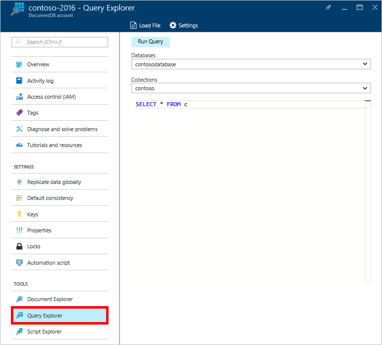
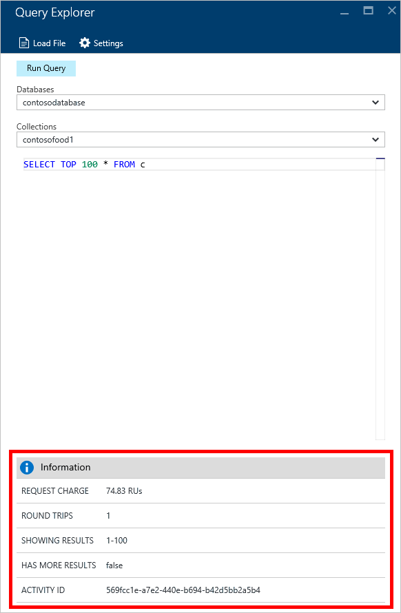

<properties
    pageTitle="Esplora DocumentDB Query: Un editor di query SQL | Microsoft Azure"
    description="Informazioni sulle DocumentDB Query Esplora aree di un editor di query SQL nel portale di Azure per la scrittura di query SQL ed eseguendole rispetto a una raccolta NoSQL DocumentDB."
    keywords="scrivere query sql, editor di query sql"
    services="documentdb"
    authors="kirillg"
    manager="jhubbard"
    editor="monicar"
    documentationCenter=""/>

<tags
    ms.service="documentdb"
    ms.workload="data-services"
    ms.tgt_pltfrm="na"
    ms.devlang="na"
    ms.topic="article"
    ms.date="08/30/2016"
    ms.author="kirillg"/>

# Scrivere, modificare ed eseguire query SQL per DocumentDB usando Esplora Query 

In questo articolo viene fornita una panoramica di [Microsoft Azure DocumentDB](https://azure.microsoft.com/services/documentdb/) Query Esplora aree di uno strumento portale Azure che consente di scrivere, modificare ed eseguire query SQL su un [insieme di DocumentDB](documentdb-create-collection.md).

1. Nel portale di Azure, in Jumpbar, fare clic su **DocumentDB (NoSQL)**. Se **DocumentDB (NoSQL)** non è visibile, fare clic su **Altri servizi** e quindi fare clic su **DocumentDB (NoSQL)**.

2. Nel menu delle risorse, fare clic su **Esplora Query**. 

    

3. In e il **Explorer Query** , selezionare il **database** e **raccolte** per eseguire una query di elenchi a discesa e digitare eseguire la query. 

    Negli elenchi a discesa **database** e **le raccolte** vengono immesse automaticamente in base al contesto in cui si avvia Esplora Query. 

    Una query predefinita di `SELECT TOP 100 * FROM c` viene fornito.  È possibile accettare la query predefinita o creare una query personalizzata mediante il linguaggio di query SQL nelle [query SQL schede di riferimento rapido](documentdb-sql-query-cheat-sheet.md) o l'articolo [query SQL e sintassi SQL](documentdb-sql-query.md) .

    Fare clic su **Esegui query** per visualizzare i risultati.

    

4. E il **risultati** Visualizza l'output della query. 

    

## Lavorare con i risultati

Per impostazione predefinita, Esplora Query restituisce risultati in set di 100.  Se la query restituisce più di 100 risultati, è sufficiente usare i comandi **pagina successiva** e **pagina precedente** per spostarsi all'interno del set di risultati.

Per le query ha esito positivo, il riquadro **informazioni** contiene metriche, ad esempio le spese di richiesta, il numero di round trip eseguita la query, il set di risultati attualmente visualizzata, e se sono presenti più risultati, è possibile accedervi tramite il comando **pagina successiva** , come indicato in precedenza.

## Utilizzare più query

Se si usa più query e si desidera passare rapidamente, è possibile immettere tutte le query nella casella di testo query della stessa e **Query Explorer** quindi evidenziare quello che si desidera eseguire e quindi fare clic su **Esegui query** per visualizzare i risultati.

## Aggiungere le query da un file nell'editor di query SQL

È possibile caricare il contenuto di un file esistente con il comando **Carica File** .

## Risoluzione dei problemi

Se una query viene completata con errori, Explorer Query Visualizza un elenco degli errori che possono agevolare la risoluzione dei problemi di attività.

## Eseguire query nel portale DocumentDB SQL

Esplora aree di Query nel portale di Azure è solo un modo per eseguire query SQL su DocumentDB. È anche possibile eseguire query SQL mediante l' [API REST](https://msdn.microsoft.com/library/azure/dn781481.aspx) o il [client SDK](documentdb-sdk-dotnet.md). Per ulteriori informazioni sull'uso di questi altri metodi, vedere [esecuzione di query](documentdb-sql-query.md#executing-sql-queries)

## Passaggi successivi

Per ulteriori informazioni sulla grammatica DocumentDB SQL supportata in Esplora risorse di Query, vedere l'articolo [query SQL e sintassi SQL](documentdb-sql-query.md) o stampare le [query SQL schede di riferimento rapido](documentdb-sql-query-cheat-sheet.md).
Si può anche divertirsi sperimentare [Di test Query](https://www.documentdb.com/sql/demo) in cui è possibile testare la query online con un set di dati di esempio.
