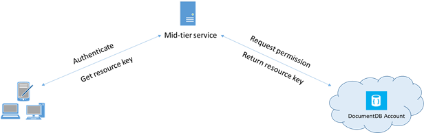

<properties 
    pageTitle="Informazioni su come proteggere l'accesso ai dati in DocumentDB | Microsoft Azure" 
    description="Informazioni sui concetti di controllo di accesso in DocumentDB, incluse le chiavi master, tasti di sola lettura, gli utenti e autorizzazioni." 
    services="documentdb" 
    authors="kiratp" 
    manager="jhubbard" 
    editor="monicar" 
    documentationCenter=""/>

<tags 
    ms.service="documentdb" 
    ms.workload="data-services" 
    ms.tgt_pltfrm="na" 
    ms.devlang="na" 
    ms.topic="article" 
    ms.date="09/19/2016" 
    ms.author="kipandya"/>

# Protezione dell'accesso ai dati DocumentDB

In questo articolo viene fornita una panoramica della protezione dell'accesso ai dati archiviati in [Microsoft Azure DocumentDB](https://azure.microsoft.com/services/documentdb/).

Dopo aver letto in questo argomento, sarà possibile rispondere alle domande seguenti:  

-   Quali sono le chiavi master DocumentDB?
-   Quali sono le chiavi di sola lettura DocumentDB?
-   Quali sono i token delle risorse DocumentDB?
-   Come è possibile usare DocumentDB utenti e autorizzazioni per proteggere l'accesso ai dati DocumentDB?

## Concetti di controllo di accesso DocumentDB

DocumentDB sono riportati i concetti prima classe per controllare l'accesso alle risorse DocumentDB.  Ai fini di questo argomento, DocumentDB risorse sono raggruppate in due categorie:

- Risorse amministrative
    - Account
    - Database
    - Utente
    - Autorizzazione
- Risorse dell'applicazione
    - Raccolta
    - Offerta
    - Documento
    - Allegato
    - Stored procedure
    - Trigger
    - Funzione definita dall'utente

Nel contesto di queste due categorie, DocumentDB supporta tre tipi di utenti tipo di controllo di accesso: account amministratore, l'amministratore di sola lettura e utente del database.  I diritti per ogni tipo di controllo di accesso sono:
 
- Amministratore dell'account: accesso completo alle tutte le risorse (amministrazione e applicazione) all'interno di un account DocumentDB specificato.
- Amministratore di sola lettura: accesso in sola lettura per tutte le risorse (amministrative e dell'applicazione all'interno di un account DocumentDB specificato. 
- Utente del database: DocumentDB l'utente risorsa associata a un determinato set di risorse del database DocumentDB (ad esempio raccolte documenti, gli script).  Può essere uno o più risorse utente associate a un determinato database e ogni risorsa utente dispone delle autorizzazioni necessarie uno o più è associati.

Con le categorie precedentemente e le risorse in considerazione, il modello di controllo di accesso DocumentDB definisce tre tipi di costrutti di accesso:

- Chiavi master: al momento della creazione di un account DocumentDB, vengono create due chiavi di schema (primarie e secondarie).  Questi tasti abilitare l'accesso amministrativo completo a tutte le risorse all'interno di account DocumentDB.

- Tasti di sola lettura: al momento della creazione di un account DocumentDB, vengono create due sola lettura chiavi (primarie e secondarie).  Questi tasti abilitare l'accesso in sola lettura per tutte le risorse account DocumentDB.

- I token delle risorse: un token di risorse è associato a una risorsa di autorizzazione DocumentDB e acquisisce la relazione tra l'utente di un database e l'autorizzazione quest ' ultimo dispone di una risorsa di applicazione DocumentDB specifica (ad esempio raccolta, il documento).

## Utilizzo di chiavi master e di sola lettura DocumentDB

Come detto in precedenza, chiavi master DocumentDB offrono accesso amministrativo completo a tutte le risorse all'interno di un account DocumentDB, mentre i tasti di sola lettura abilitano l'accesso in lettura a tutte le risorse all'interno dell'account.  Frammento di codice riportato di seguito viene illustrato come utilizzare un endpoint account DocumentDB e la chiave master per creare un'istanza di un DocumentClient e creare un nuovo database. 

    //Read the DocumentDB endpointUrl and authorization keys from config.
    //These values are available from the Azure Classic Portal on the DocumentDB Account Blade under "Keys".
    //NB > Keep these values in a safe and secure location. Together they provide Administrative access to your DocDB account.
    
    private static readonly string endpointUrl = ConfigurationManager.AppSettings["EndPointUrl"];
    private static readonly SecureString authorizationKey = ToSecureString(ConfigurationManager.AppSettings["AuthorizationKey"]);
        
    client = new DocumentClient(new Uri(endpointUrl), authorizationKey);
    
    // Create Database
    Database database = await client.CreateDatabaseAsync(
        new Database
        {
            Id = databaseName
        });

## Panoramica di token di risorse DocumentDB

È possibile utilizzare un token di risorse (creando DocumentDB utenti e autorizzazioni) quando si desidera fornire accesso alle risorse nell'account DocumentDB a un client che non può essere attendibile con la chiave master. Le chiavi master DocumentDB includere sia una chiave primaria e secondaria, ognuno dei quali concede l'accesso amministrativo per l'account e tutte le risorse al suo interno. Esposizione di uno delle chiavi master viene aperta l'account per la possibilità di utilizzo dannoso o negligenza. 

Allo stesso modo, le chiavi di sola lettura DocumentDB offrono accesso in lettura a tutte le risorse, ad eccezione di risorse di autorizzazione, naturalmente - all'interno di un account DocumentDB e non possono essere utilizzate per fornire più granulare accesso alle risorse DocumentDB specifiche.

I token delle risorse DocumentDB offrono un metodo alternativo che consente di leggere, scrivere ed eliminare le risorse nell'account DocumentDB secondo le autorizzazioni e senza necessità di uno schema o lettura chiave solo client.

Ecco un modello di progettazione tipico in base al quale i token delle risorse potrebbero essere richiesto, generati e inviati ai client:

1. Un servizio di livello intermedio sia configurato per servire un'applicazione mobile per condividere fotografie degli utenti.
2. Il servizio di livello intermedio possiede la chiave master dell'account DocumentDB.
3. Installazione dell'app foto su dispositivi mobili degli utenti finali. 
4. Accesso, l'app foto stabilisce l'identità dell'utente con il servizio di livello intermedio. Questo meccanismo di stabilimento di identità è semplicemente l'applicazione.
5. Una volta definita l'identità, il servizio di livello intermedio richiede le autorizzazioni in base all'identità.
6. Il servizio di livello intermedio invia un token di risorsa tornare all'app del telefono.
7. L'app telefono è possibile continuare a usare i token delle risorse per accedere direttamente alle risorse DocumentDB con le autorizzazioni definite dal token di risorsa e per l'intervallo consentito dal token di risorsa. 
8. Quando scade il token di risorse, le successive richieste riceverà un'eccezione 401 non autorizzato.  A questo punto, l'app phone stabilisce nuovamente l'identità e le richieste di un nuovo token di risorsa.

## Utilizzo di DocumentDB utenti e autorizzazioni
Un utente DocumentDB risorsa è associato a un database DocumentDB.  Ogni database può contenere zero o più utenti DocumentDB.  Frammento di codice seguente viene illustrato come creare una risorsa di utente DocumentDB.

    //Create a user.
    User docUser = new User
    {
        Id = "mobileuser"
    };

    docUser = await client.CreateUserAsync(UriFactory.CreateDatabaseUri("db"), docUser);

> [AZURE.NOTE] Ogni utente DocumentDB dispone di una proprietà PermissionsLink che può essere utilizzata per recuperare l'elenco delle autorizzazioni associate all'utente.

Una risorsa di autorizzazione DocumentDB è associata a un utente DocumentDB.  Ogni utente può contenere zero o più delle autorizzazioni DocumentDB.  Una risorsa di autorizzazione consente di accedere a un token di sicurezza che l'utente deve essere quando si tenta di accedere a una risorsa applicazione specifica.
Esistono due livelli di accesso disponibili possono essere forniti da una risorsa di autorizzazione:

- Tutti: L'utente dispone di autorizzazioni complete sulla risorsa
- Lettura: L'utente può essere letto solo il contenuto della risorsa ma non è possibile eseguire scrittura, aggiornamento o operazioni di eliminazione sulla risorsa.

> [AZURE.NOTE] Per eseguire DocumentDB stored procedure che l'utente deve disporre dell'autorizzazione tutti nella raccolta in cui verrà eseguita la stored procedure.

Frammento di codice riportato di seguito viene illustrato come creare una risorsa di autorizzazione, il token di risorsa della risorsa dell'autorizzazione di lettura e associare le autorizzazioni utente creato in precedenza.

    // Create a permission.
    Permission docPermission = new Permission
    {
        PermissionMode = PermissionMode.Read,
        ResourceLink = documentCollection.SelfLink,
        Id = "readperm"
    };
            
  docPermission = attesa client. CreatePermissionAsync (UriFactory.CreateUserUri ("db", "utente"), docPermission); WriteLine (docPermission.Id + "token di sono previsti:" + docPermission.Token);
  
Se è stato specificato un tasto partizione per la raccolta e quindi l'autorizzazione per la raccolta, risorse documento e allegato devono includere anche ResourcePartitionKey oltre il ResourceLink.

Per ottenere facilmente tutte le risorse di autorizzazione associate a un utente particolare, DocumentDB rende disponibile un'autorizzazione feed per tutti gli oggetti utente.  Frammento di codice riportato di seguito viene illustrato come recuperare l'autorizzazione associata all'utente creato in precedenza, creare un elenco di autorizzazioni e creare un'istanza di un nuovo DocumentClient per conto dell'utente.

    //Read a permission feed.
    FeedResponse<Permission> permFeed = await client.ReadPermissionFeedAsync(
      UriFactory.CreateUserUri("db", "myUser"));

    List<Permission> permList = new List<Permission>();
      
    foreach (Permission perm in permFeed)
    {
        permList.Add(perm);
    }
            
    DocumentClient userClient = new DocumentClient(new Uri(endpointUrl), permList);

> [AZURE.TIP] I token delle risorse hanno un intervallo di tempo valido predefinito di 1 ora.  Token durata, tuttavia, può essere specificata in modo esplicito, fino a un massimo di 5 ore.

## Passaggi successivi

- Per ulteriori informazioni su DocumentDB, fare clic [qui](http://azure.com/docdb).
- Per informazioni sulla gestione delle chiavi master e di sola lettura, fare clic [qui](documentdb-manage-account.md).
- Per informazioni su come creare i token di autorizzazione DocumentDB, fare clic [qui](https://msdn.microsoft.com/library/azure/dn783368.aspx)
 
