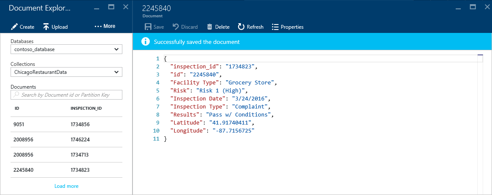
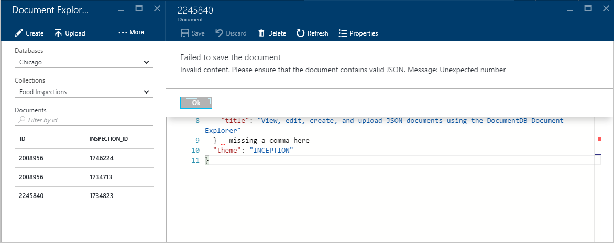

<properties
    pageTitle="DocumentDB Document Explorer per visualizzare JSON | Microsoft Azure"
    description="Informazioni sulle DocumentDB documento Esplora aree di uno strumento di Azure portale per visualizzare JSON, modificare, creare e caricare documenti JSON con DocumentDB, un database di documento NoSQL."
        keywords="visualizzare json"
    services="documentdb"
    authors="kirillg"
    manager="jhubbard"
    editor="monicar"
    documentationCenter=""/>

<tags
    ms.service="documentdb"
    ms.workload="data-services"
    ms.tgt_pltfrm="na"
    ms.devlang="na"
    ms.topic="article"
    ms.date="08/30/2016"
    ms.author="kirillg"/>

# Visualizzare, modificare, creare e caricare documenti JSON utilizzando DocumentDB Document Explorer

In questo articolo viene fornita una panoramica di [Microsoft Azure DocumentDB](https://azure.microsoft.com/services/documentdb/) documento Esplora aree di uno strumento portale Azure che consente di visualizzare, modificare, creare, caricare e filtrare i documenti JSON con DocumentDB. 

Si noti che Document Explorer non è abilitato per gli account DocumentDB con protocollo per MongoDB. Questa pagina verrà aggiornata quando questa funzionalità è attivata.

## Avviare Explorer documento

1. Nel portale di Azure, in Jumpbar, fare clic su **DocumentDB (NoSQL)**. Se **DocumentDB (NoSQL)** non è visibile, fare clic su **Altri servizi** e quindi fare clic su **DocumentDB (NoSQL)**.

2. Selezionare il nome dell'account. 

3. Nel menu delle risorse, fare clic su **Document Explorer**. 
 
    

    In e il **Documento Explorer** negli elenchi a discesa **database** e **le raccolte** vengono pre-popolati in base al contesto in cui è stato avviato Document Explorer. 

## Creare un documento

1. [Avviare Explorer documento](#launch-document-explorer).

2. In e il **Documento Esplora** , fare clic su **Crea documento**. 

    Viene fornito un frammento JSON minimo e il **documento** .

    

2. In e il **documento** , digitare o incollare il contenuto del documento JSON che si desidera creare e quindi fare clic su **Salva** per salvare il documento nel database e insieme specificato e il **Documento Explorer** .

    

    > [AZURE.NOTE] Se non si specifica una proprietà di "id", quindi Document Explorer aggiungere automaticamente una proprietà id e genera un GUID come valore relativo all'id.

    Se si dispone già di file di dati da JSON, MongoDB, SQL Server, file CSV, archiviazione tabelle di Azure, Amazon DynamoDB, HBase, o proveniente da altre raccolte di DocumentDB, è possibile utilizzare del DocumentDB [strumento di migrazione di dati](documentdb-import-data.md) per importare i dati in modo rapido.

## Modificare un documento

1. [Avviare Explorer documento](#launch-document-explorer).

2. Per modificare un documento esistente, selezionarla in e il **Documento Explorer** , modificare il documento e il **documento** e quindi fare clic su **Salva**.

    

    Se si sta modificando un documento e si decide che si desidera annullare la serie corrente di modifiche, è sufficiente fare clic su **Annulla** nella e **documento** , confermare l'operazione di eliminazione e viene nuovamente lo stato precedente del documento.

    

## Eliminare un documento

1. [Avviare Explorer documento](#launch-document-explorer).

2. Selezionare il documento in **Document Explorer**, fare clic su **Elimina**e quindi confermare l'eliminazione. Dopo la conferma, il documento viene immediatamente rimosso dall'elenco di Document Explorer.

    

## Lavorare con documenti JSON

Document Explorer verifica che qualsiasi documento nuova o modificata contenga JSON valido.  È possibile anche visualizzare gli errori di JSON, passare il mouse sopra la sezione non corretta per ottenere informazioni dettagliate sull'errore di convalida.

Inoltre, Document Explorer non è possibile salvare un documento con contenuto JSON non valido.

Infine, Document Explorer consente di visualizzare facilmente le proprietà di sistema del documento attualmente caricato facendo clic sul comando **proprietà** .

> [AZURE.NOTE] La proprietà del timestamp (_ts) internamente viene rappresentata come ora periodo, ma Document Explorer viene visualizzato il valore in un formato leggibile GMT.

## Filtrare i documenti
Document Explorer supporta un numero di opzioni di spostamento e impostazioni avanzate.

Per impostazione predefinita, Document Explorer carica ai primi 100 documenti della raccolta selezionata per la data di creazione dal meno recente a quella più recente.  È possibile caricare documenti complementari (in batch di 100) selezionando l'opzione **Carica più** nella parte inferiore della stessa e Document Explorer. È possibile scegliere i documenti da caricare tramite il comando **filtro** .

1. [Avviare Explorer documento](#launch-document-explorer).

2. Nella parte superiore e il **Documento Esplora** , fare clic su **filtro**.  

    
  
3.  Sotto la barra dei comandi sono visualizzate le impostazioni del filtro. Nelle impostazioni del filtro, fornire una clausola WHERE e/o una clausola ORDER BY e quindi fare clic su **filtro**.

    

    Documento Explorer aggiorna automaticamente i risultati con i documenti che soddisfano la query del filtro. Leggere altre informazioni su grammatica DocumentDB SQL nelle [query SQL e sintassi SQL](documentdb-sql-query.md) articolo o stampare una copia della [query SQL schede di riferimento rapido](documentdb-sql-query-cheat-sheet.md).

    Per passare a una raccolta da cui i documenti sono attualmente visualizzati senza che sia necessario chiudere e riavviare Document Explorer, è possono utilizzare le caselle di riepilogo a discesa **Database** e **insieme** .  

    Document Explorer supporta anche i filtri il set di documenti caricato tramite la relativa proprietà id.  È sufficiente digitare nella casella il filtro di documenti da casella id.

    

    I risultati in Esplora aree di documento elenco vengono filtrati in base ai criteri specificati specificato.

    

    > [AZURE.IMPORTANT] Document Explorer filtro funzionalità unici filtri ***attualmente*** caricato set di documenti e non esegue una query a fronte della raccolta selezionata.

4. Per aggiornare l'elenco dei documenti caricati da Document Explorer, fare clic su **Aggiorna** nella parte superiore e il.

    

## Aggiungi in blocco documenti

Document Explorer supporta l'acquisizione di massa di uno o più JSON documenti esistenti, fino a 100 file JSON per operazione di caricamento.  

1. [Avviare Explorer documento](#launch-document-explorer).

2. Per avviare il processo di caricamento, fare clic su **Carica documento**.

    

    Verrà visualizzata e il **Carica documento** . 

2. Fare clic sul pulsante Sfoglia per aprire una finestra di Esplora file, selezionare uno o più documenti JSON per caricare e quindi fare clic su **Apri**.

    

    > [AZURE.NOTE] Documento Explorer supporta attualmente fino a 100 documenti JSON per singoli upload operazione.

3. Quando si è soddisfatti della selezione, fare clic sul pulsante **Carica** .  I documenti vengono automaticamente aggiunti alla griglia di Document Explorer e i risultati di caricamento vengono visualizzati come all'avanzamento dell'operazione. Per i singoli file vengono segnalati errori di importazione.

    

4. Al termine dell'operazione, è possibile selezionare fino a un altro 100 documenti da caricare.

## Lavorare con documenti JSON esterno al portale

Esplora aree di documento nel portale di Azure è solo uno dei modi per usare i documenti in DocumentDB. È anche possibile utilizzare con i documenti mediante l' [API REST](https://msdn.microsoft.com/library/azure/mt489082.aspx) o il [client SDK](documentdb-sdk-dotnet.md). Ad esempio codice, vedere gli [esempi di documento .NET SDK](documentdb-dotnet-samples.md#document-examples) ed [esempi di documento Node SDK](documentdb-nodejs-samples.md#document-examples).

Se è necessario importare o eseguire la migrazione di file da un'altra origine (JSON file, MongoDB, SQL Server, CSV file, tabella Azure lo spazio di archiviazione, Amazon DynamoDB o HBase), è possibile utilizzare lo [strumento di migrazione di dati](documentdb-import-data.md) di DocumentDB per importare i dati in modo rapido a DocumentDB.

## Risoluzione dei problemi

**Sintomo**: Document Explorer non restituisce **Nessun documento trovato**.

**Soluzione**: verificare di avere selezionato la sottoscrizione corretto, database e raccolta in cui sono stati inseriti i documenti. Inoltre, verificare che si opera all'interno le quote di velocità. Se si opera nella velocità massima Livella e il recupero limitato, ridurre l'utilizzo di applicazione funzionare in quota produttività massima per la raccolta.

**Spiegazione**: il portale è un'applicazione come qualsiasi altro, le chiamate a DocumentDB database e raccolte. Se le richieste sono attualmente viene limitate a causa di chiamate da un'applicazione separata, il portale potrebbe anche essere limitato, causando risorse non vengono visualizzati nel portale. Per risolvere il problema, la causa dell'utilizzo del alta velocità di indirizzi e quindi aggiornare e il portale. Informazioni su come misurare e l'uso di velocità inferiore sono disponibili nella sezione [effettiva](documentdb-performance-tips.md#throughput) dell'articolo [suggerimenti sulle prestazioni](documentdb-performance-tips.md) .

## Passaggi successivi

Per ulteriori informazioni sulla grammatica DocumentDB SQL supportata in Document Explorer, vedere l'articolo [query SQL e sintassi SQL](documentdb-sql-query.md) o stampare le [query SQL schede di riferimento rapido](documentdb-sql-query-cheat-sheet.md).

Il [percorso di apprendimento](https://azure.microsoft.com/documentation/learning-paths/documentdb/) è una risorsa utile come guida mentre si acquisiscono informazioni sul DocumentDB. 
