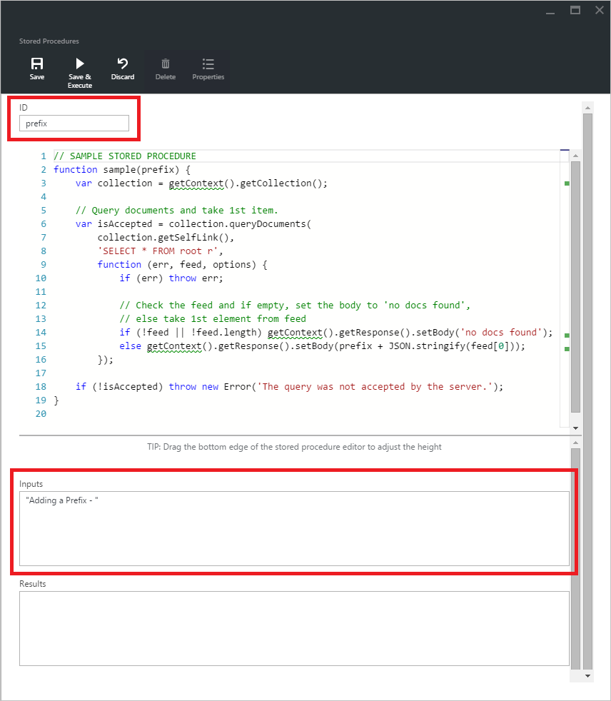

<properties
    pageTitle="Esplora Script DocumentDB, un editor JavaScript | Microsoft Azure"
    description="Informazioni sulle DocumentDB Script Esplora aree di uno strumento di Azure portale per gestire DocumentDB sul lato server programmazione gli elementi inclusi stored procedure, trigger e funzioni definite dall'utente."
    keywords="editor JavaScript"
    services="documentdb"
    authors="kirillg"
    manager="jhubbard"
    editor="monicar"
    documentationCenter=""/>

<tags
    ms.service="documentdb"
    ms.workload="data-services"
    ms.tgt_pltfrm="na"
    ms.devlang="na"
    ms.topic="article"
    ms.date="08/30/2016"
    ms.author="kirillg"/>

# Creare ed eseguire stored procedure, trigger e funzioni definite dall'utente in Esplora risorse Script DocumentDB

In questo articolo viene fornita una panoramica di [Microsoft Azure DocumentDB](https://azure.microsoft.com/services/documentdb/) Script Esplora aree di cui è un editor JavaScript nel portale di Azure che consente di visualizzare ed eseguire DocumentDB sul lato server programmazione gli elementi inclusi stored procedure, trigger e funzioni definite dall'utente. Per ulteriori informazioni sulla programmazione sul lato server DocumentDB nell'articolo [Stored procedure, trigger di database e funzioni definite dall'utente](documentdb-programming.md) .

## Avviare Esplora Script

1. Nel portale di Azure, in Jumpbar, fare clic su **DocumentDB (NoSQL)**. Se **DocumentDB account** non è visibile, fare clic su **Altri servizi** e quindi fare clic su **DocumentDB (NoSQL)**.

2. Nel menu risorse, fare clic su **Esplora Script**.

    
 
    Le caselle di riepilogo a discesa **Database** e **insieme** sono prepopolate in base al contesto in cui si avvia Esplora Script.  Ad esempio, se si avvia da blade database, il database corrente è prepopolato.  Se si avvia da blade insieme, la raccolta corrente è già presenti.

4.  Utilizzare le caselle di riepilogo **Database** e **insieme** di cambiare facilmente la raccolta da cui gli script sono attualmente visualizzati senza che sia necessario chiudere e riavviare Esplora Script.  

5. Esplora script supporta anche i filtri attualmente caricato insieme di script tramite la relativa proprietà id.  È sufficiente digitare nella casella filtro e i risultati nell'elenco Esplora Script vengono filtrati in base ai criteri specificati specificato.

    

    > [AZURE.IMPORTANT] Esplora Script filtrare filtri solo funzionalità da set ***attualmente*** caricato di script e non verranno aggiornati automaticamente la raccolta selezionata.

5. Per aggiornare l'elenco di script caricato da Esplora Script, è sufficiente fare clic sul comando **Aggiorna** nella parte superiore e il.

    

## Creare, visualizzare e modificare stored procedure, trigger e funzioni definite dall'utente

Esplora script consente di eseguire facilmente operazioni CRUD nel DocumentDB gli elementi di programmazione sul lato server.  

- Per creare uno script, è sufficiente fare clic su applicabile creare un comando all'interno di Esplora script, fornire un id, immettere il contenuto dello script e fare clic su **Salva**.

    

- Quando si crea un trigger, è necessario specificare anche l'operazione di tipo e condizione di attivazione di trigger

    

- Per visualizzare uno script, è sufficiente fare clic sullo script in cui si è interessati.

    

- Per modificare uno script, apportare le modifiche desiderate in JavaScript editor e fare clic su **Salva**.

    

- Per annullare le modifiche in sospeso a uno script, è sufficiente fare clic sul comando **Annulla** .

    

- Esplora script consente inoltre di visualizzare facilmente le proprietà di sistema di script attualmente caricato facendo clic sul comando **proprietà** .

    

    > [AZURE.NOTE] La proprietà del timestamp (_ts) internamente viene rappresentata come ora periodo, ma Esplora Script viene visualizzato il valore in un formato leggibile GMT.

- Per eliminare uno script, selezionarla in Esplora Script e fare clic sul comando **Elimina** .

    

- Confermare l'azione di eliminazione, fare clic su **Sì** o annullare l'azione di eliminazione, fare clic su **No**.

    

## Eseguire una stored procedure

> [AZURE.WARNING] Esecuzione di stored procedure in Esplora Script non è ancora supportata per gli insiemi di suddiviso lato server. Per ulteriori informazioni, visitare [partizionamento e proporzioni nella DocumentDB](documentdb-partition-data.md).

Esplora script consente di eseguire sul lato server stored procedure dal portale di Azure.

- Quando si apre una nuova pala procedura crea archiviati, uno script predefinito (*prefisso*) già essere fornito. Per eseguire lo script *prefisso* o uno script personalizzato, aggiungere un *id* e *input*. Per stored procedure che accettano più parametri, tutti gli input devono essere all'interno di una matrice (ad esempio *["foo", "barra"]*).

    

- Per eseguire una stored procedure, è sufficiente fare clic sul comando **Salva ed eseguire** nel riquadro editor dello script.

    > [AZURE.NOTE] Il comando **Salva ed eseguire** salverà stored procedure prima di eseguire, vale a dire che sovrascriverà i versione salvata in precedenza della stored procedure.

- Ha esito negativo esecuzioni delle stored procedure avrà uno stato *salvato correttamente ed eseguito la stored procedure* e i risultati restituiti verrà nel riquadro *risultati* .

    

- Se l'esecuzione rileva un errore, l'errore verrà nel riquadro *risultati* .

    

## Lavorare con gli script nel portale

Esplora aree di Script nel portale di Azure è solo un modo di lavorare con stored procedure, trigger e funzioni definite dall'utente in DocumentDB. È anche possibile collaborare con gli script utilizzando l'API REST e il [client SDK](documentdb-sdk-dotnet.md). La documentazione API REST include esempi per l'utilizzo di [stored procedure utilizzando resto](https://msdn.microsoft.com/library/azure/mt489092.aspx), [con altre funzioni definite dall'utente](https://msdn.microsoft.com/library/azure/dn781481.aspx)e [i trigger di utilizzo del resto](https://msdn.microsoft.com/library/azure/mt489116.aspx). Gli esempi sono anche disponibile che mostra come [lavorare con gli script utilizzando c#](documentdb-dotnet-samples.md#server-side-programming-examples) e [lavorare con gli script utilizzando Node](documentdb-nodejs-samples.md#server-side-programming-examples).

## Passaggi successivi

Ulteriori informazioni sulla programmazione sul lato server DocumentDB nell'articolo [Stored procedure, trigger di database e funzioni definite dall'utente](documentdb-programming.md) .

Il [percorso di apprendimento](https://azure.microsoft.com/documentation/learning-paths/documentdb/) è una risorsa utile come guida mentre si acquisiscono informazioni sul DocumentDB.  
