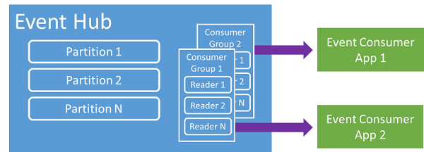

<properties 
    pageTitle="Panoramica dell'evento Azure hub | Microsoft Azure"
    description="Introduzione e panoramica di Azure evento hub."
    services="event-hubs"
    documentationCenter="na"
    authors="sethmanheim"
    manager="timlt"
    editor="" />
<tags 
    ms.service="event-hubs"
    ms.devlang="na"
    ms.topic="get-started-article"
    ms.tgt_pltfrm="na"
    ms.workload="na"
    ms.date="08/16/2016"
    ms.author="sethm" />

# Panoramica di evento hub Azure

Molte soluzioni moderne intende per fornire le esperienze dei clienti adattata o per migliorare i prodotti tramite feedback continuo e telemetria automatica. Tali soluzioni sono affrontare come sicuro e affidabile elaborare grandi quantità di informazioni da molti autori simultanee. Microsoft Azure evento hub è un servizio di piattaforma gestita che fornisce una base per assunzione di dati su larga scala in una vasta gamma di scenari. Esempi di scenari di questo comportamento verifica in App per dispositivi mobili, informazioni sul traffico da web farm degli eventi di gioco giochi console, o ai dati di telemetria acquisite dal computer industriali o connessi veicoli. Il ruolo comune riproducibile hub di evento in architetture delle soluzioni è funge "anteriore porta" per pipeline un evento, spesso denominata un *ingestor evento*. Ingestor un evento è un componente o servizio che si trova tra gli autori di eventi e consumer di eventi per separare produzione di un flusso di eventi dal consumo di tali eventi.

Azure hub di evento è un evento elaborazione servizio che fornisce eventi e telemetry ingresso nel cloud in scala enorme con latenza bassa e affidabilità. Questo servizio usato con altri servizi downstream è particolarmente utile in strumentazione delle applicazioni, elaborazione del flusso di lavoro o esperienza utente e gli scenari Internet di elementi (IoT). Hub di evento fornisce un flusso di messaggio la funzionalità di gestione e anche se un Hub di evento è un'entità simile alle code e argomenti, include caratteristiche che sono molto diverse dai messaggistica aziendale tradizionale. Scenari di messaggistica Enterprise richiedono in genere funzionalità avanzate, ad esempio la sequenza, inattivi lettere, il supporto delle transazioni e garanzie di recapito sicuro, mentre l'interesse principale per assunzione di evento è alta velocità e flessibilità per i flussi di eventi di elaborazione. Pertanto, funzionalità evento hub differiscono dagli argomenti Bus di servizio in fortemente è distorta verso alta velocità e l'evento scenari di elaborazione. Di conseguenza, gli hub di evento non implementare alcune delle funzionalità di messaggistica disponibili per gli argomenti della. Se sono necessarie queste funzionalità, argomenti rimangono la scelta ottimale.

Un Hub di evento viene creato a livello di spazio dei nomi di evento hub, simile a argomenti e code Bus di servizio. Evento hub utilizza AMQP e HTTP come le interfacce API principale. Il diagramma seguente illustra la relazione tra gli hub di eventi e Bus di servizio.

## Informazioni generali

Hub di evento fornisce messaggio streaming tramite un modello consumer partizionata. Code e argomenti utilizzano un modello di [Concorrenti Consumer](https://msdn.microsoft.com/library/dn568101.aspx) in cui ogni consumer tenta di leggere la stessa coda o delle risorse. Questo concorso per le risorse organizzato per complessità e limiti di ridimensionamento per l'elaborazione di applicazioni flusso. Evento hub utilizza un modello consumer partizionata in cui ogni consumer legge solo un sottoinsieme specifico o una partizione, del flusso di messaggi. Questo modello consente di scala orizzontale per l'elaborazione di eventi e fornisce altre caratteristiche incentrati sui flusso che non sono disponibili in code e argomenti.

### Partizioni

Una partizione è una sequenza ordinata di eventi contenute in un Hub di evento. All'arrivo degli eventi più recenti, vengono aggiunti alla fine di questa sequenza. Una partizione possa essere considerata come "log commit".

Le partizioni conservano i dati per un periodo di conservazione configurati impostato a livello di evento Hub. Questa impostazione viene applicata a tutte le partizioni in caso Hub. Scadono di eventi in base alla durata; non è possibile in modo esplicito eliminarli. Un Hub evento contiene più partizioni. Ogni partizione è indipendente e contiene il proprio sequenza di dati. Di conseguenza, spesso partizioni adatta a tassi diversi.

Il numero delle partizioni viene specificato l'ora di creazione evento Hub e deve essere compreso tra 2 e 32 (il valore predefinito è 4). Le partizioni sono un meccanismo di organizzazione dei dati e altri documenti associate al grado di parallelismo downstream necessario in altre applicazioni rispetto alla velocità hub evento. In questo modo la scelta del numero di partizioni in un Hub di evento direttamente correlati al numero di ci si aspetta che gli utenti concorrenti. Dopo la creazione dell'evento Hub, il numero di partizione non è modificabile; è necessario considerare questo numero in termini di scala previsto a lungo termine. È possibile aumentare il limite per 32 partizione contattando il team Bus di servizio.

Mentre le partizioni identificabili e possono essere inviate direttamente al, è consigliabile evitare di inviare dati a partizioni. Se, tuttavia, è possibile utilizzare costrutti di livello superiori introdotti nelle sezioni [autore di eventi](#event-publisher) e [Criteri di Publisher](#capacity-and-security) .

Nel contesto dell'evento hub, i messaggi sono definiti *dati dell'evento*. I dati dell'evento contengono il corpo dell'evento, elenco proprietà e diversi metadati sull'evento, ad esempio il relativo offset definito dall'utente in partizione e il relativo numero nella sequenza di flusso. Le partizioni sono piene di una sequenza di dati dell'evento.

## Autore di eventi

Qualsiasi entità che invia dati o eventi a un Hub di evento deve essere un *autore di eventi*. Gli autori di eventi possono pubblicare eventi mediante HTTPS o AMQP 1.0. Gli autori di eventi utilizzano un token di firma di Access condiviso (SA) identificarsi a un Hub di evento e può avere un'identità univoca o utilizzare un token SA comune, in base ai requisiti dello scenario.

Per ulteriori informazioni sull'uso di SA, vedere [Autenticazione tramite firma accesso condiviso con Bus di servizio](../service-bus-messaging/service-bus-shared-access-signature-authentication.md).

### Attività comuni di publisher

In questa sezione descrive le attività comuni per gli autori di eventi.

#### Acquisire un token SA

Condiviso accesso firma (SA) indica il meccanismo di autenticazione per gli hub di evento. Servizio Bus include criteri SA livello di spazio dei nomi e Hub di evento. Un token SA generato da una chiave SA e un hash SHA di un URL codificato in un formato specifico. Usando il nome della chiave (criteri) e il token, Bus di servizio possibile rigenerare l'hash e pertanto autenticare il mittente. In genere, token SA per gli autori di eventi vengono creati con solo **inviare** i privilegi per un Hub di evento specifico. Questo meccanismo di URL token sa è la base per l'identificazione di publisher introdotto nei criteri di publisher. Per ulteriori informazioni sull'uso di SA, vedere [Autenticazione tramite firma accesso condiviso con Bus di servizio](../service-bus-messaging/service-bus-shared-access-signature-authentication.md).

#### Pubblicazione di un evento

È possibile pubblicare un evento tramite AMQP 1.0 o HTTPS. Servizio Bus fornisce una classe [EventHubClient](https://msdn.microsoft.com/library/microsoft.servicebus.messaging.eventhubclient.aspx) per gli eventi di pubblicazione a un Hub evento dai client .NET. Per altre piattaforme e Runtime, è possibile utilizzare qualsiasi client AMQP 1.0, ad esempio [Apache Qpid](http://qpid.apache.org/). È possibile pubblicare eventi singolarmente o in blocco. Una singola pubblicazione (istanza dei dati dell'evento) ha un limite di 256KB, indipendentemente dal fatto che sia un singolo evento o un batch. Pubblicazione eventi superiori a causando un errore. È buona norma per gli autori per non essere a conoscenza delle partizioni all'interno di Hub evento e specificare solo una *partizione chiave* (introdotta nella sezione seguente) o la propria identità tramite i token SA.

La scelta di utilizzare AMQP o HTTPS è specifica di uno scenario di utilizzo. AMQP richiede la creazione di un socket bidirezionale persistente oltre alle regole di protezione a livello (TLS) o SSL/TLS. Può essere un'operazione costosa in termini di traffico di rete, ma si verifica solo all'inizio di una sessione AMQP. HTTPS ha un carico iniziale inferiore, ma richiede SSL aggiuntive sovraccarico per ogni richiesta. Per gli autori che spesso pubblicano eventi, AMQP offre notevole risparmio di prestazioni, latenza e la velocità di trasmissione.

### Chiave di partizione

Una chiave di partizione è un valore che viene utilizzato per eseguire il mapping di dati di evento in arrivo in partizioni specifiche ai fini di organizzazione dei dati. Chiave di partizione è un valore fornito dal mittente passato a un Hub di evento. Questo viene gestito tramite una funzione di hashing statica, il cui risultato crea l'assegnazione di partizione. Se non si specifica una chiave di partizione durante la pubblicazione di un evento, viene utilizzata un'assegnazione circolari. Quando si utilizzano i tasti di partizione, autore di eventi è solo a conoscenza della chiave partizione, non la partizione a cui sono pubblicati gli eventi. Grazie a questa separazione della chiave e partizione isola il mittente di dover conoscere troppo l'elaborazione downstream e l'archiviazione degli eventi. Chiavi partizione sono importanti per l'organizzazione dei dati per l'elaborazione downstream, ma non sono sostanzialmente correlate alle partizioni stessi. Utilizzare un dispositivo o utente univoco identità costituisce una chiave di partizione valido, ma vengono anche altri attributi, ad esempio geography per raggruppare gli eventi correlati in un'unica partizione. Nella figura seguente mostra i mittenti di eventi utilizzo dei tasti partizione per aggiungerlo alla partizioni.

Hub evento assicura che tutti i eventi condividono lo stesso valore di chiave partizione vengono recapitati in ordine e alla stessa partizione. Importante Se si utilizzano chiavi partizione con i criteri di publisher, descritti nella sezione successiva, quindi l'identità dell'autore e il valore di chiave di partizione deve corrispondere. In caso contrario, si verifica un errore.

### Consumer di eventi

Qualsiasi entità che legge i dati dell'evento da un Hub di evento è un consumer di eventi. Tutti gli utenti di evento lettura del flusso di eventi tramite le partizioni in un gruppo di consumer. Ogni partizione deve avere sola lettura attivi contemporaneamente. Tutti gli utenti di evento hub connettersi tramite la sessione AMQP 1.0, in cui vengono inviati eventi appena saranno disponibili. Non è necessario che il client sondaggio per la disponibilità dei dati.

#### Gruppi di consumatori

Meccanismo di pubblicazione/sottoscrizione dell'evento hub è abilitato tramite gruppi di consumatori. Un gruppo di consumer è una visualizzazione di un intero Hub di evento (stato, posizione o offset). Abilita gruppi consumer più utilizzo di applicazioni per ogni dispone di una visualizzazione distinta del flusso di eventi e per leggere il flusso in modo indipendente in base alle proprie esigenze e con le proprie offset. In un flusso di elaborazione architettura, ogni applicazione downstream corrisponde a un gruppo di consumer. Se si desidera scrivere i dati degli eventi allo spazio di archiviazione a lungo termine, l'applicazione di writer di spazio di archiviazione è un gruppo di consumer. Elaborazione dell'evento complesse viene eseguita dal gruppo consumer un'altra, separato. È possibile accedere solo le partizioni tramite un gruppo di consumer. È sempre un gruppo di consumer predefinito nell'Hub evento ed è possibile creare fino a 20 consumer gruppi per un livello Standard Hub evento.

Di seguito sono esempi di convenzione dell'URI consumer gruppo:

    //<my namespace>.servicebus.windows.net/<event hub name>/<Consumer Group #1>
    //<my namespace>.servicebus.windows.net/<event hub name>/<Consumer Group #2>

Nella figura seguente mostra i consumer di eventi all'interno di gruppi di consumer.

#### Offset di flusso

Offset è la posizione di un evento all'interno di una partizione. È possibile pensare di offset come cursore sul lato client. L'offset è un byte numerazione dell'evento. In questo modo un evento consumer (lettore) specificare un punto nel flusso da cui desiderano iniziare la lettura degli eventi. È possibile specificare l'offset come timestamp o come un valore di offset. Gli utenti sono responsabili per la memorizzazione di valori di offset all'esterno del servizio hub evento.

All'interno di una partizione ogni evento include un offset. Questo offset viene utilizzato per uso domestico per visualizzare la posizione nella sequenza evento per una determinata partizione. Offset possono essere passati all'evento Hub come un numero o un valore timestamp quando si connette un lettore.

#### Arresto

*Arresto* è un processo in base al quale i lettori contrassegnare o eseguire il commit della posizione all'interno di una sequenza di eventi partizione. Arresto responsabilità dell'utente e si verificherà una scala cronologica per partizione all'interno di un gruppo di consumer. Questo errore indica che per ogni gruppo consumer ogni lettore partizione necessario tenere traccia della posizione corrente nel flusso e segnalare il servizio quando il flusso di dati consideri completata. Se un lettore si disconnette da una partizione quando riconnette inizia a leggere in verifica che in precedenza è stato inviato dal lettore ultimo di tale partizione di tale gruppo consumer. Quando si connette il lettore, passa questo offset Hub evento per specificare la posizione in cui si desidera iniziare a leggere. In questo modo, è possibile utilizzare arresto per entrambi gli eventi Segna come "completato" dalle applicazioni downstream e di fornire flessibilità invariato tra i lettori in esecuzione su computer diversi. Poiché i dati dell'evento viene mantenuti per l'intervallo di criteri di conservazione specificato al momento della che creazione di Hub evento, è possibile tornare ai dati nei formati precedenti specificando un offset inferiore da questo processo di arresto. Con questo meccanismo arresto consente failover adattabilità e riprodurla flusso controllato evento.

#### Attività comuni consumer

Questa sezione descrive le attività comuni per consumer evento hub o lettori. Tutti gli utenti di evento hub connettersi tramite AMQP 1.0. AMQP 1.0 è una sessione e canale di comunicazione bidirezionali stato presente. Ogni partizione è una sessione di collegamento AMQP 1.0 che facilita il trasporto di eventi separati dalla partizione.

##### Connettersi a una partizione

Per utilizzare gli eventi da un Hub di evento, consumer necessario connettersi a una partizione. Come detto in precedenza, sempre l'accesso a partizioni tramite un gruppo di consumer. Come parte del modello consumer partizionata, un unico lettore dovrebbe essere attivo su una partizione in qualsiasi momento all'interno di un gruppo di consumer. È pratica comune quando ci si connette direttamente a partizioni di utilizzare un meccanismo leasing per coordinare connessioni lettore a partizioni. In questo modo, è possibile per ogni partizione in un gruppo di consumer di sola lettura attivi. Gestire la posizione nella sequenza di un lettore è un'attività importante che è possibile ottenere tramite arresto. Questa funzionalità è stata semplificata utilizzando la classe [EventProcessorHost](https://msdn.microsoft.com/library/microsoft.servicebus.messaging.eventprocessorhost.aspx) per i client .NET. [EventProcessorHost](https://msdn.microsoft.com/library/microsoft.servicebus.messaging.eventprocessorhost.aspx) è un agente intelligente consumer e descritte nella sezione successiva.

##### Leggere gli eventi

Dopo l'apertura di una sessione di AMQP 1.0 e collegamento per una partizione specifica, gli eventi vengono inviati al client AMQP 1.0 dal servizio hub evento. Questo meccanismo di recapito consente velocità effettiva superiore e inferiore latenza più meccanismi di tipo pull, ad esempio HTTP GET. Come gli eventi vengono inviati al client, ogni istanza di dati di evento contiene importanti metadati, ad esempio il numero di offset e sequenza vengono utilizzate per semplificare l'arresto in sequenza degli eventi.

È responsabilità per gestire l'offset in modo che meglio consente di gestire lo stato di avanzamento di elaborazione del flusso.

## Capacità e sicurezza

Hub di evento è un'architettura in parallelo scalabilità per ingresso flusso. Di conseguenza, sono disponibili diversi aspetti da considerare quando ridimensionamento e il ridimensionamento di una soluzione basata su evento hub. Prima di questi controlli capacità rappresenta la cosiddetta *unità effettiva*, descritto nella sezione seguente.

### Unità di velocità

La capacità di velocità dell'evento hub dipende dalle unità effettiva. Unità di velocità vengono pre-acquistate unità di capacità. Un'unità singola velocità include le operazioni seguenti:

- Ingresso: Fino a 1 MB al secondo o 1000 eventi al secondo.

- Uscita: Fino a 2 MB al secondo.

In ingresso è limitata alla quantità di capacità specificata per il numero di unità di velocità acquistate. Invio di dati sopra il risultato è importo un'eccezione "quota superata". Si tratta di uno dei due MB 1 al secondo o 1000 eventi al secondo, indipendentemente dalle operazioni prima di tutto. Uscita non produce limitazione eccezioni, ma è limitata alla quantità di dati di trasferimento prestati per le unità acquistate velocità: 2 MB al secondo unitario effettiva. Se si ricevono eccezioni tasso pubblicazione o previste uscita superiore controllare il numero di unità effettiva acquistate per lo spazio dei nomi in cui è stato creato l'Hub di evento. Per ottenere più unità di velocità, è possibile modificare l'impostazione della pagina **gli spazi dei nomi** nella scheda **scala** nel [portale classica Azure][]. È anche possibile modificare questa impostazione utilizzando l'API di Azure.

Mentre le partizioni sono un concetto di organizzazione dei dati, unità di velocità sono puramente un concetto di capacità. Unità di velocità effettuata orarie e si è acquistata. Dopo aver acquistato, unità effettiva vengono addebitate per un minimo di un'ora. Tutte le velocità 20 unità possono essere acquistate per uno spazio dei nomi di evento hub e un massimo di account Azure di 20 unità effettiva. Queste unità effettiva condivisi tutti gli hub di evento in un determinato spazio dei nomi.

Unità di velocità viene effettuato il provisioning su base basata migliore e potrebbe non essere sempre disponibile per l'acquisto immediato. Se si richiede una capacità specifica, è consigliabile acquistare le unità di velocità anticipo. Se si richiede più di 20 unità effettiva, è possibile contattare il supporto di Azure per acquistare più unità di velocità su base impegno in blocchi di 20, tutte le unità di 100 velocità prima. Inoltre, è inoltre possibile acquistare blocchi di 100 unità effettiva.

È consigliabile bilanciare attentamente partizioni e unità di velocità per ottenere una scala ottimale con gli hub di evento. Una singola partizione ha una scala massima di unità di una velocità. Il numero di unità di velocità deve essere minore o uguale al numero di partizioni in un Hub di evento.

Per dettagliate informazioni sui prezzi, vedere [l'Evento hub prezzi](https://azure.microsoft.com/pricing/details/event-hubs/).

### Criteri di Publisher

Hub evento Abilita controllo granulare gli autori di eventi tramite i *criteri di publisher*. Criteri di Publisher sono un set di funzionalità in fase di esecuzione progettato per facilitare un numero elevato di autori di eventi indipendente. Con i criteri di publisher, ogni publisher utilizza un identificatore univoco per la pubblicazione di eventi a un Hub di evento, utilizzando il seguente meccanismo:

    //<my namespace>.servicebus.windows.net/<event hub name>/publishers/<my publisher name>

Non è necessario creare i nomi degli autori anticipo, ma devono corrispondere token SA utilizzato per la pubblicazione di un evento, per garantire l'identità di publisher indipendente. Per ulteriori informazioni sulle associazioni di protezione, vedere [Autenticazione tramite firma accesso condiviso con Bus di servizio](../service-bus-messaging/service-bus-shared-access-signature-authentication.md). Quando si usano i criteri di publisher, **PartitionKey** è impostato per il nome dell'autore. Per il corretto funzionamento, tali valori devono corrispondere.

## Riepilogo

Hub evento Azure fornisce un evento hyper scala e telemetria servizio che può essere usato per comuni dell'applicazione e utente flusso di lavoro monitoraggio la scala di elaborazione. La possibilità di fornire pubblicazione sottoscrizione funzionalità con latenza bassa ed enorme scala, hub evento fungere da "rampa Sì" per i dati di grandi dimensioni. Con identità basata su publisher e gli elenchi di revoche di certificati, queste funzionalità sono esteso scenari Internet di elementi comuni. Per ulteriori informazioni sullo sviluppo di applicazioni gli hub di evento, vedere la [Guida alla programmazione hub evento](event-hubs-programming-guide.md).

## Passaggi successivi

Dopo avere appreso sui concetti relativi all'evento hub, è possibile spostare per gli scenari seguenti:

- Guida introduttiva a un [evento hub esercitazione].
- Un' [applicazione di esempio che utilizza evento hub]completa.

[Portale classica Azure]: http://manage.windowsazure.com
[Esercitazione hub di evento]: event-hubs-csharp-ephcs-getstarted.md
[applicazione di esempio che utilizza hub di evento]: https://code.msdn.microsoft.com/windowsazure/Service-Bus-Event-Hub-286fd097
