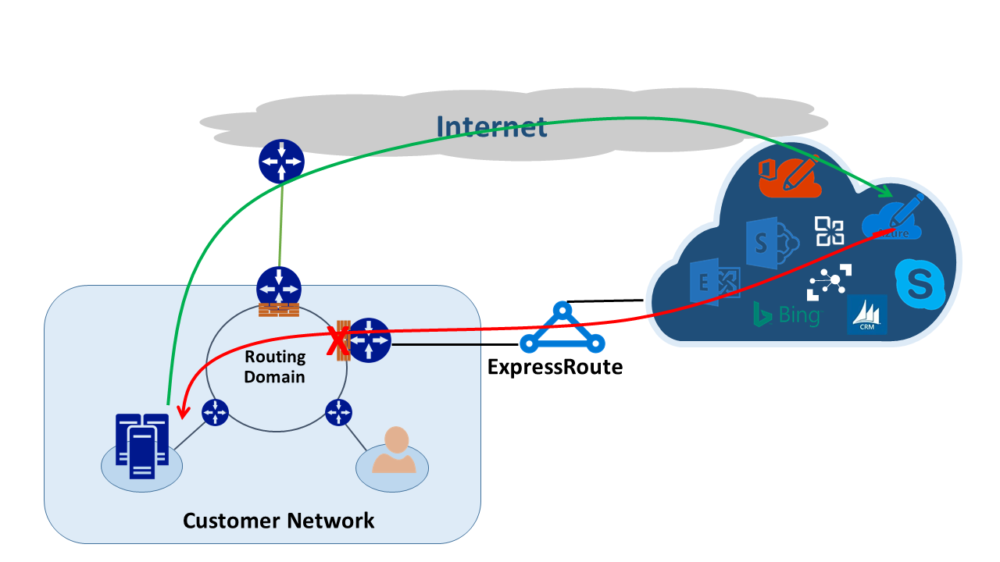

<properties
   pageTitle="Routing asimmetrici | Microsoft Azure"
   description="In questo articolo illustra i problemi di che un cliente potrebbe venire con routing asimmetrici in una rete con collegamenti più di una destinazione."
   documentationCenter="na"
   services="expressroute"
   authors="osamazia"
   manager="carmonm"
   editor=""/>
<tags
   ms.service="expressroute"
   ms.devlang="na"
   ms.topic="get-started-article"
   ms.tgt_pltfrm="na"
   ms.workload="infrastructure-services"
   ms.date="10/10/2016"
   ms.author="osamazia"/>

# Asimmetrici routing con più percorsi di rete

In questo articolo viene spiegato come Avanti e restituire il traffico di rete può richiedere diversi indirizza quando più percorsi sono disponibili tra rete origine e destinazione.

È importante conoscere due concetti per comprendere il routing asimmetrici. È l'effetto di più percorsi di rete. È l'altro come dispositivi, ad esempio un firewall, mantenere lo stato. Questi tipi di dispositivi sono denominati dispositivi informazioni sullo stato. Una combinazione di questi due fattori Crea scenari rete il traffico viene eliminato da un dispositivo informazioni sullo stato perché il dispositivo informazioni sullo stato non rileva che il traffico è stata creata con il dispositivo.

## Più percorsi di rete

Quando una rete aziendale contiene solo un collegamento a Internet tramite il provider di servizi Internet, tutto il traffico da e verso Internet percorre lo stesso percorso. Spesso, società acquistano più circuiti, come percorsi ridondanti, per migliorare i tempi. In questo caso, è possibile che il traffico che consente di spostarsi all'esterno della rete, a Internet, attraversa un collegamento e il traffico di ritorno attraversa un collegamento diverso. Questo è comunemente noto come routing asimmetrici. In routing asimmetrici, cambia il traffico di rete un percorso diverso dal flusso originale.

Anche se si verifica principalmente su Internet, anche il routing asimmetrici si applica alle altre combinazioni di più percorsi. Viene applicata, ad esempio, sia a un percorso Internet e un percorso privato passare alla stessa destinazione e a più percorsi privati che fa riferimento alla stessa destinazione.

Ogni router durante il tragitto dall'origine alla destinazione, calcola il percorso migliore per raggiungere una destinazione. Determinazione del router del percorso possibili migliore dipende da due fattori principali:

-   Routing tra le reti esterne è basato su un protocollo routing bordo Gateway Protocol (BGP). BGP Accetta annunci da altre istanze e li si scorre una serie di passaggi per determinare il percorso migliore alla destinazione prevista. Archivia il percorso migliore nella tabella di routing.
-   La lunghezza di una maschera di subnet associata a una route influenza percorsi di routing. Se un router riceve più annunci per lo stesso indirizzo IP ma con maschere subnet diversa, o al router preferisce annuncio pubblicitario con una maschera subnet più perché è considerata un percorso più specifico.

## Informazioni sullo stato dispositivi

Router osservare l'intestazione IP di un pacchetto per il routing. Alcuni dispositivi esaminare maggiori all'interno del pacchetto. In genere, questi dispositivi esaminare Layer4 (Transmission Control Protocol o TCP; o User Datagram Protocol o UDP), o persino Layer7 intestazioni (applicazione Layer). Questi tipi di dispositivi sono dispositivi di sicurezza o dispositivi di ottimizzazione della larghezza di banda. 

Un firewall è un tipico esempio di un dispositivo informazioni sullo stato. Un firewall accetta o rifiuta un pacchetto per passare tra le interfacce basate sui campi diversi, ad esempio protocollo, porte TCP/UDP e intestazioni di URL. Questo livello di ispezione pacchetti inserisce elevato carico sul dispositivo di elaborazione. Per migliorare le prestazioni, il firewall esamina il pacchetto prima di un flusso. Se è consentito il pacchetto di procedere, mantiene le informazioni di flusso nella tabella di stato. Tutti i pacchetti successivi correlati a questo flusso sono consentiti in base a determinazione iniziale. Un pacchetto che fa parte di un flusso esistente potrebbe arrivare in corrispondenza del firewall. Se il firewall non ha informazioni di stato precedente, il firewall blocca il pacchetto.

## Asimmetrici routing con ExpressRoute

Quando ci si connette a Microsoft tramite Azure ExpressRoute, le modifiche di rete come il seguente:

-   Si dispone di più collegamenti a Microsoft. Un collegamento è la connessione Internet esistente e l'altro consiste nell'utilizzare ExpressRoute. Traffico a Microsoft può accedere tramite Internet ma torni tramite ExpressRoute o viceversa.
-   Si ricevono più specifici indirizzi IP tramite ExpressRoute. In modo che per il traffico di rete a Microsoft per i servizi disponibili tramite ExpressRoute, router preferiscono sempre ExpressRoute.

Per comprendere l'effetto che dispongono di queste due modifiche in una rete, sono illustrati alcuni scenari. Ad esempio, si dispone di un solo circuito a Internet ed è utilizzare tutti i servizi Microsoft tramite Internet. Il traffico di rete in Microsoft e viceversa attraversa lo stesso collegamento Internet e passa attraverso il firewall. Il firewall registra il flusso come rileva del primo pacchetto e pacchetti sono consentiti perché il flusso è presente nella tabella di stato.

Quindi, attivare ExpressRoute e utilizzare i servizi offerti da Microsoft tramite ExpressRoute. Tutti gli altri servizi Microsoft vengono utilizzate tramite Internet. Distribuire un firewall separato il bordo che sia connesso a ExpressRoute. Microsoft annuncia prefissi più specifici per la rete su ExpressRoute per servizi specifici. L'infrastruttura di routing sceglie ExpressRoute come percorso preferito per tali prefissi. Se non si annuncia gli indirizzi IP pubblici a Microsoft tramite ExpressRoute, Microsoft comunica con gli indirizzi IP pubblici tramite Internet. Inoltrare il traffico di rete a Microsoft utilizza ExpressRoute e cambia il traffico da Microsoft Internet. Quando il firewall sul bordo rileva un pacchetto di risposta per un flusso che non viene trovato nella tabella di stato, Elimina il traffico di ritorno.

Se si sceglie di utilizzare lo stesso pool di conversione indirizzi di rete per ExpressRoute e per Internet, si noterà problemi simili con i client della rete sugli indirizzi IP privati. Le richieste di servizi come Windows Update passare tramite Internet, poiché gli indirizzi IP per questi servizi non vengono annunciati tramite ExpressRoute. Tuttavia, il traffico di ritorno torna tramite ExpressRoute. Se Microsoft ha ricevuto un indirizzo IP con lo stesso maschera subnet da Internet ed ExpressRoute, preferisce ExpressRoute via Internet. Se un firewall o un altro dispositivo informazioni sullo stato che si trova nel bordo di rete e affiancate ExpressRoute non contiene precedente informazioni sullo svolgimento, Elimina i pacchetti che appartengono a quel flusso.

## Soluzioni routing asimmetriche

Sono disponibili due opzioni principali per risolvere il problema di routing asimmetrici. Uno consiste nell'usare il routing e l'altro è l'utilizzo in base a origine NAT (SNAT).

### Routing

Assicurarsi che gli indirizzi IP pubblici vengono inseriti a collegamenti rete WAN appropriato. Ad esempio, se si desidera utilizzare Internet per il traffico di autenticazione ed ExpressRoute per il traffico di posta elettronica, non deve annunciare gli indirizzi IP pubblici Active Directory Federation Services (ADFS) su ExpressRoute. Analogamente, assicurarsi di non esporre un locale server ADFS agli indirizzi IP che il router riceve tramite ExpressRoute. Indirizza ricevuti tramite ExpressRoute è più specifiche in modo che siano ExpressRoute percorso preferito per il traffico di autenticazione a Microsoft. In questo modo routing asimmetrici.

Se si desidera utilizzare ExpressRoute per l'autenticazione, assicurarsi che si desidera annunciare indirizzi IP pubblici ADFS su ExpressRoute senza NAT. In questo modo, il traffico che proviene da Microsoft e passa a un locale nel server ADFS supera ExpressRoute. Ripristinare il traffico da cliente Microsoft utilizza ExpressRoute perché la route preferita su Internet.

### Origine base NAT

Un altro modo per la risoluzione dei problemi di routing asimmetrici è utilizzando SNAT. Ad esempio, non hanno annunciato l'indirizzo IP pubblico del server locale Simple Mail Transfer Protocol (SMTP) su ExpressRoute perché si intende utilizzare Internet per questo tipo di comunicazione. Una richiesta che è stata creata con Microsoft e passa al server SMTP locale attraversa Internet. Si SNAT richiesta in arrivo a un indirizzo IP interno. Inversa dal server SMTP del traffico al bordo firewall (che consente NAT) invece che tramite ExpressRoute. Il traffico di ritorno torna tramite Internet.

## Rilevamento di routing asimmetrico

Traceroute è il modo migliore per assicurarsi che il traffico di rete attraversa il percorso del previsto. Se si prevede che il traffico dal server SMTP locale a Microsoft per eseguire il percorso Internet, traceroute previsto viene generato dal server SMTP a Office 365. Il risultato consente di verificare che il traffico in uscita effettivamente da rete verso Internet e non verso ExpressRoute.
