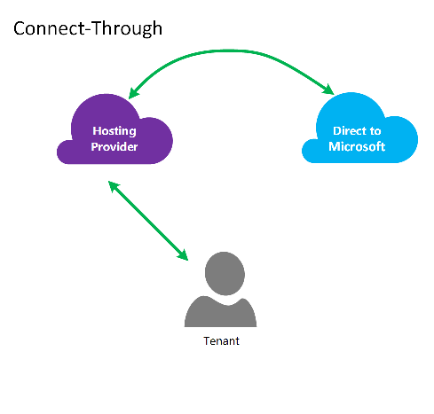

<properties
   pageTitle="Azure ExpressRoute per il provider di soluzioni Cloud | Microsoft Azure"
   description="In questo articolo vengono fornite informazioni per i provider di servizi Cloud che desidera incorporare servizi Azure ed ExpressRoute nelle loro offerte."
   documentationCenter="na"
   services="expressroute"
   authors="richcar"
   manager="carmonm"
   editor=""/>
<tags
   ms.service="expressroute"
   ms.devlang="na"
   ms.topic="get-started-article"
   ms.tgt_pltfrm="na"
   ms.workload="infrastructure-services"
   ms.date="10/10/2016"
   ms.author="richcar"/>

# ExpressRoute per il provider di soluzioni Cloud (CSP)

Microsoft offre servizi di Hyper-scala per rivenditori tradizionali e distributors (CSP) per poter rapidamente il provisioning di nuovi servizi e soluzioni per i clienti senza la necessità di investire in questi nuovi servizi. Per consentire la possibilità di gestire direttamente i nuovi servizi Cloud soluzione Provider (CSP), Microsoft offre API che consentono di CSP gestire le risorse di Microsoft Azure per conto dei clienti e i programmi. Una di queste risorse è ExpressRoute. ExpressRoute consente CSP da risorse per i clienti esistenti di connettersi ai servizi Azure. ExpressRoute è un collegamento di comunicazioni private ad alta velocità per i servizi di Azure. 

ExpresRoute è costituito da una coppia di circuiti disponibilità elevata che sono associati a una singolo cliente sottoscrizioni e non può essere condiviso tra più clienti. Ogni circuito dovrebbe essere terminata in un router diverso per mantenere la disponibilità.

>[AZURE.NOTE] Connessione e della larghezza di banda maiuscoletto presenti ExpressRoute il che significa che implementazioni di grandi dimensioni/complesso richiederà più circuiti ExpressRoute per un singolo cliente.

Microsoft Azure fornisce un numero crescente di servizi che è possibile offrire ai clienti.  Per prendere migliore trarre vantaggio da questi servizi richiederà l'utilizzo connessioni ExpressRoute per fornire ad alta velocità bassa accesso latenza all'ambiente di Microsoft Azure.

## Gestione di Microsoft Azure
Microsoft offre CSP con API per gestire le sottoscrizioni di Azure cliente consentendo a livello di programmazione integrazione con i proprio sistemi di gestione dei servizi. Funzionalità di gestione supportati sono disponibili [qui](https://msdn.microsoft.com/library/partnercenter/dn974944.aspx).

## Gestione risorse di Microsoft Azure
A seconda del tipo di contratto con il cliente determinerà modalità di gestione dell'abbonamento. Il CSP direttamente può gestire la creazione e manutenzione di risorse o il cliente può mantenere il controllo della sottoscrizione Microsoft Azure e creare le risorse Azure secondo necessità. Se il cliente gestisce la creazione di risorse in abbonamento Microsoft Azure utilizzeranno uno dei due modelli: modello "Connetti-Through" o "Diretto a" modello. Nelle sezioni seguenti sono descritti questi modelli.  

### Connettersi tramite modello

  

Nel modello connettersi tramite il CSP crea un collegamento diretto tra la data center e l'abbonamento del cliente Azure. La connessione diretta viene effettuata usando ExpressRoute, la connessione di rete con Azure. Il cliente quindi si connette alla rete. Questo scenario è necessario che il cliente passa attraverso la rete CSP per accedere ai servizi Azure. 

Se il cliente include gli altri abbonamenti Azure non gestiti da si, utilizzerebbero Internet pubblico o connessione privata per connettersi a tali servizi viene completato il provisioning in abbonamento non CSP. 

Per la gestione dei servizi Azure CSP, si presuppone che il CSP dispone di un archivio di identità cliente definito in precedenza che è necessario essere replicato in Azure Active Directory per la gestione della sottoscrizione CSP tramite Administrate-On-Behalf-Of (AOBO). Driver della chiave per questo scenario includere in un determinato partner o il provider di servizi ha una relazione esistente con il cliente, il cliente è servizi provider attualmente o il partner ha desidera fornire una combinazione di provider di hosting e ospitato Azure soluzioni per offrire flessibilità e cliente indirizzo sfide che non possono essere soddisfatti da CSP solo. Questo modello è illustrato nella **Figura**seguente.

### La connessione al modello

Nel modello di connessione a, il provider di servizi crea un collegamento diretto tra Data Center del loro cliente e la sottoscrizione di Azure CSP viene completato il provisioning con ExpressRoute sopra il cliente (cliente) rete.

>[AZURE.NOTE] Per ExpressRoute il cliente sarà necessario creare e gestire il circuito ExpressRoute.  

Questo scenario di integrazione applicativa richiede che il cliente si connette direttamente tramite una rete dei clienti accesso gestite CSP Azure sottoscrizione tramite una connessione di rete diretta che viene creata, proprietà e gestita interamente o parzialmente dal cliente. Per questi utenti di che si presuppone che il provider di servizi non dispone un archivio di identità cliente stabilita e il provider di servizi da fornire l'assistenza nella replica archivio identificare corrente in Azure Active Directory per la gestione della sottoscrizione tramite AOBO. Driver della chiave per questo scenario includere in un determinato partner o il provider di servizi ha una relazione esistente con il cliente, il cliente è servizi provider attualmente o il partner ha desidera fornire servizi che si basano esclusivamente ospitato Azure soluzioni senza la necessità di un Data Center provider esistente o infrastruttura.

La scelta tra queste due opzioni sono in base alle esigenze del cliente e l'esigenza di fornire servizi Azure corrente. Controllano i dettagli di questi modelli e accesso basato sui ruoli associati, rete e modelli di progettazione di identità illustra sono dettagli nei collegamenti seguenti:
-   **Ruolo in base a Access controllo (RBAC)** – RBAC si basa su Azure Active Directory.  Per ulteriori informazioni su Azure RBAC vedere [di seguito](../active-directory/role-based-access-control-configure.md).
-   **Rete** -copre vari argomenti di una rete in Microsoft Azure.
-   **Azure Active Directory (AAD)** -AAD offre la gestione delle identità per Microsoft Azure e 3 ° applicazioni SaaS di terze parti. Per ulteriori informazioni su Azure Active Directory vedere [di seguito](https://azure.microsoft.com/documentation/services/active-directory/).  

## Velocità di rete
ExpressRoute supporta velocità di rete da 50 Mb/s a 10Gb/s. In questo modo i clienti di acquistare la larghezza di banda necessaria per il proprio ambiente univoco.

>[AZURE.NOTE] È possibile aumentare la larghezza di banda di rete in base alle esigenze senza interrompere comunicazioni, ma per ridurre la rete richiede velocità interrompere il circuito e ricreare la velocità di rete.  

ExpressRoute supporta la connessione di più vNets a un singolo circuito ExpressRoute per migliore utilizzo delle connessioni ad alta velocità. Un singolo circuito ExpressRoute può essere condivisi tra più abbonamenti Azure proprietà di un cliente stesso.

## Configurazione ExpressRoute
ExpressRoute può essere configurato per supportare tre tipi di traffico ([domini di routing](#ExpressRoute-routing-domains)) su un singolo circuito ExpressRoute. Il traffico è suddivise in Microsoft peering, peering pubblico Azure e peering privato. È possibile scegliere uno o tutti i tipi di traffico per essere inviati a un singolo circuito ExpressRoute oppure usare più circuiti ExpressRoute a seconda delle dimensioni del circuito ExpressRoute e isolamento necessari affinché un cliente. Alle condizioni di protezione dei clienti potrebbero non consentire il traffico pubblico sia privata per scorrere su stesso circuito.

### Connettersi tramite modello
In una configurazione connettersi tramite il prendersi la responsabilità di tutte le basi social network a cui connettersi risorse del Data Center clienti abbonamenti ospitati in Azure. Ognuno dei clienti che vogliono usare funzionalità di Azure sarà necessario le proprie connessione ExpressRoute, che verrà gestita da l'oggetto. Si utilizzerà gli stessi metodi che cliente da usare per l'acquisizione delle risorse circuito ExpressRoute. È necessario seguire la stessa procedura descritta nell'articolo [ExpressRoute flussi di lavoro](./expressroute-workflows.md) per il provisioning di circuito e circuito uniti. Quindi la si configura indirizza bordo Gateway Protocol (BGP) per controllare il traffico tra la rete locale e vNet Azure.

### La connessione al modello
In una configurazione connessione a un cliente già ha una connessione esistente a Azure o avvia la connessione al provider di servizi internet collegamento ExpressRoute dal centro dati del cliente direttamente a Azure, anziché il Data Center. Per iniziare il processo di provisioning, il cliente verrà seguire i passaggi come descritto in precedenza nel modello a cui connettersi. Dopo il circuito è stato stabilito che il cliente sarà necessario configurare i router locale per essere in grado di accedere alla rete e Azure vNets.

Può facilitare la configurazione della connessione e configurazione di route per consentire le risorse nel datacenter(s) per comunicare con le risorse di client nel centro dati o con le risorse ospitate in Azure.

## Domini di routing ExpressRoute
ExpressRoute offre tre domini routing: pubblico, privato e Microsoft peering. Ognuno dei domini routing sono configurati con router identiche nella configurazione attivo attivo per la disponibilità elevata. Per informazioni dettagliate sul ExpressRoute aspetto domini di routing [qui](./expressroute-circuit-peerings.md).

È possibile definire filtri route personalizzate per consentire solo l'itinerario o itinerari interessati che si desidera consentire o necessario. Per ulteriori informazioni o per informazioni su come apportare queste modifiche vedere l'articolo: [creare e modificare il routing per un circuito ExpressRoute tramite PowerShell](./expressroute-howto-routing-classic.md) per ulteriori informazioni sui filtri routing.

>[AZURE.NOTE] Per Microsoft e Peering pubblico connettività deve essere attraverso un indirizzo IP pubblico dal cliente o CSP di proprietà e deve essere conformi a tutte le regole definite. Per ulteriori informazioni, vedere la pagina [Prerequisiti ExpressRoute](expressroute-prerequisites.md) .  

## Routing
ExpressRoute si connette a reti Azure attraverso il Gateway di rete virtuale di Azure. Gateway Network fornire routing per le reti virtuali Azure.

Creazione di reti virtuali Azure consente di una tabella di routing predefinita per vNet indirizzare il traffico verso/dalle subnet del vNet. Se la tabella di route predefinita è insufficiente per la soluzione personalizzata route possono essere create per indirizzare il traffico in uscita per elettrodomestici personalizzati o per route di blocco per subnet specifiche o reti esterne.

### Predefinito routing
La tabella di route predefinita include indirizza seguenti:

- Il routing all'interno di una subnet
- Subnet in subnet all'interno della rete virtuale
- A Internet
- Rete per virtuale virtuali mediante gateway VPN
- Rete-a-locale virtuali mediante un gateway VPN o ExpressRoute

  

### Routing definite dall'utente (UDR)
Indirizza definite dall'utente consentono al controllo del traffico in uscita dalla subnet assegnate ad altre subnet nella rete virtuale o su una delle altre gateway predefiniti (ExpressRoute; internet o VPN). Tabella di routing sistema predefinito può essere sostituita con una tabella di routing definite dall'utente che sostituisce la tabella di routing predefinito con route personalizzate. Con il routing definite dall'utente, i clienti possono creare route specifiche per elettrodomestici, ad esempio firewall o accessori rilevamento intrusione o bloccare l'accesso alla subnet specifiche dalla subnet hosting route definite dall'utente. Per una panoramica di route definiti dall'utente aspetto [qui](../virtual-network/virtual-networks-udr-overview.md). 

## Sicurezza
A seconda di quale sia il modello in uso, a cui connettersi o connettersi a un cliente consente di definire i criteri di protezione nel loro vNet o fornisce la protezione requisiti dei criteri per il CSP per definire le vNets. I criteri di sicurezza seguenti possono essere definiti:

1.  **Isolamento cliente** , ovvero piattaforma di Azure fornisce un cliente isolamento archiviando ID cliente e vNet le informazioni in un database protetto, che consente di racchiudere il traffico di ogni cliente in un tunnel GRE.
2.  Regole **Gruppo di sicurezza di rete (NSG)** sono per la definizione di traffico consentito e in uscita subnet vNets in Azure. Per impostazione predefinita, la NSG contengono regole di blocco per bloccare il traffico da Internet per il vNet e consentire le regole per il traffico all'interno di un vNet. Per ulteriori informazioni sui gruppi di sicurezza di rete [di seguito](https://azure.microsoft.com/blog/network-security-groups/).
3.  **Forza tunneling** , si tratta di un'opzione per reindirizzare il traffico internet associato originari Azure per reindirizzare sulla connessione ExpressRoute al data center locale attivato. Per ulteriori informazioni sui forzati tunneling [qui](./expressroute-routing.md#advertising-default-routes).  

4.  **La crittografia** , anche se circuiti ExpressRoute sono riservati per un cliente specifico, è possibile che il provider di rete potrebbe essere violazione, consentendo intrusi esaminare il traffico di pacchetti. Per risolvere questo potenziale, un cliente o CSP possibile crittografare il traffico per la connessione definendo attenendosi modalità tunnel per tutto il traffico che scorre tra le risorse locali e Azure risorse (fare riferimento alla modalità di Tunnel facoltativa IPSec per cliente 1 nella figura 5: protezione ExpressRoute, sopra). La seconda opzione, è possibile utilizzare un dispositivo firewall ogni punto finale del circuito ExpressRoute. Sarà necessario aggiuntive parte 3 ° macchine virtuali/accessori deve essere installata in entrambe le estremità per crittografare il traffico in circuito ExpressRoute del firewall.

  

## Passaggi successivi
Il servizio Cloud soluzione Provider offre un modo per aumentare il valore ai clienti senza la necessità di acquisti costosi infrastruttura e funzionalità, mantenendo la posizione come provider di gestione esterna principale. Integrazione con Microsoft Azure può essere eseguita tramite l'API CSP, consentendo l'integrazione di gestione di Microsoft Azure entro il framework di gestione esistenti.  

Per ulteriori informazioni possono visitare i collegamenti seguenti:

[Programma Microsoft Cloud soluzione Provider](https://partner.microsoft.com/en-US/Solutions/cloud-reseller-overview).  
È possibile [preparare eseguire operazioni come un Provider di soluzioni Cloud](https://partner.microsoft.com/en-us/solutions/cloud-reseller-pre-launch).  
[Provider di Microsoft Cloud Esplora risorse](https://partner.microsoft.com/en-us/solutions/cloud-reseller-resources).
