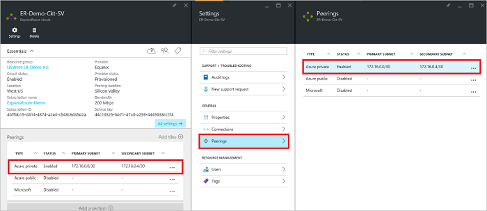
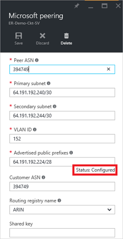
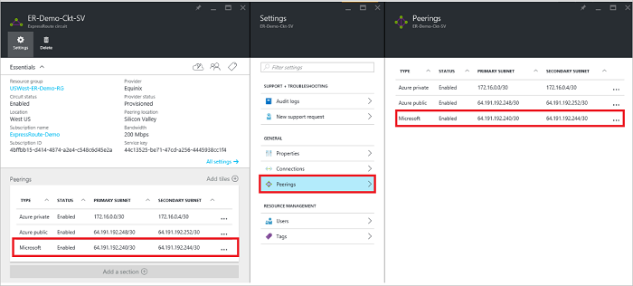
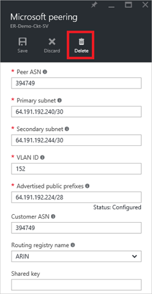

<properties
   pageTitle="Come configurare la distribuzione per un circuito ExpressRoute tramite il portale di Azure | Microsoft Azure"
   description="In questo articolo sono illustrati i passaggi per la creazione e il provisioning privato, pubblico e Microsoft peering di un circuito ExpressRoute. In questo articolo viene inoltre descritto controllare lo stato, aggiornare o eliminare peerings per il circuito."
   documentationCenter="na"
   services="expressroute"
   authors="cherylmc"
   manager="carmonm"
   editor=""
   tags="azure-resource-manager"/>
<tags
   ms.service="expressroute"
   ms.devlang="na"
   ms.topic="hero-article" 
   ms.tgt_pltfrm="na"
   ms.workload="infrastructure-services"
   ms.date="10/10/2016"
   ms.author="cherylmc"/>

# Creare e modificare il routing per un circuito ExpressRoute

> [AZURE.SELECTOR]
[Portale di Azure - Gestione risorse](expressroute-howto-routing-portal-resource-manager.md)
[PowerShell - Gestione risorse](expressroute-howto-routing-arm.md)
[PowerShell - classico](expressroute-howto-routing-classic.md)

In questo articolo sono illustrati i passaggi per creare e gestire la configurazione del routing per un circuito ExpressRoute tramite il portale di Azure e il modello di distribuzione di Manager delle risorse.

**Informazioni sui modelli di distribuzione di Azure**

[AZURE.INCLUDE [vpn-gateway-clasic-rm](../../includes/vpn-gateway-classic-rm-include.md)] 

## Prerequisiti di configurazione

- Assicurarsi che siano state esaminate pagina [Prerequisiti](expressroute-prerequisites.md) , la pagina [routing requisiti](expressroute-routing.md) e la pagina [flussi di lavoro](expressroute-workflows.md) prima di iniziare la configurazione.
- È necessario avere un circuito ExpressRoute attivo. Seguire le istruzioni per [creare un circuito ExpressRoute](expressroute-howto-circuit-arm.md) e disporre circuito abilitato per il proprio provider di integrazione applicativa prima di procedere. Circuito ExpressRoute deve essere in uno stato provisioning e abilitato per poter essere in grado di eseguire i cmdlet descritti di seguito.

Queste istruzioni vengono applicate solo alle circuiti creati con provider di servizi che offre servizi di integrazione applicativa di livello 2. Se si utilizza un provider di servizi che offre servizi di livello 3 gestiti (in genere un IPVPN, ad esempio MPLS), il proprio provider di integrazione applicativa verranno configurare e gestire il routing dell'utente. 

>[AZURE.IMPORTANT] È attualmente non annunciare peerings configurata dal provider di servizi tramite il portale di gestione dei servizi. Stiamo lavorando a breve per consentire questa funzionalità. Rivolgersi al provider del servizio prima di configurare peerings BGP.

È possibile configurare uno, due oppure tre peerings tutti (pubblico privato, Azure Azure e Microsoft) per un circuito ExpressRoute. È possibile configurare peerings nell'ordine desiderato. Tuttavia, è necessario assicurarsi completare la configurazione di ciascuno di essi peering alla volta. 

## Peering privato Azure

In questa sezione fornisce istruzioni su come creare, visualizzare, aggiornare ed eliminare la configurazione di peering privata Azure per un circuito ExpressRoute. 

### Per creare peering privato Azure

1. Configurare il circuito ExpressRoute. Assicurarsi che il circuito è completamente il provisioning dal provider di integrazione applicativa prima di continuare.

    

2. Configurare la peering Azure privata per il circuito. Verificare di disporre gli elementi seguenti prima di procedere con la procedura successiva:

    - Un /30 subnet per il collegamento principale. Questa operazione non deve essere parte di uno spazio indirizzo riservato per le reti virtuali.
    - Un /30 subnet per il collegamento secondario. Questa operazione non deve essere parte di uno spazio indirizzo riservato per le reti virtuali.
    - Un ID VLAN valido per stabilire questo peering su. Assicurarsi che nessun altro peering del circuito utilizzi lo stesso ID di VLAN.
    - COME numero per peering. È possibile usare 2 byte e 4 byte come numeri. È possibile utilizzare una private come numero per questo peering. Assicurarsi che non si utilizza 65515.
    - Hash MD5, se si sceglie di utilizzare uno. **Questa operazione è facoltativa**.

3. Selezionare la riga peering Azure Private, come illustrato di seguito.
    
    
    

4. Configurare peering privato. Nell'immagine seguente è illustrato un esempio di configurazione.

    

    
5. Salvare la configurazione dopo aver specificato tutti i parametri. Dopo la configurazione è stata accettata correttamente, verrà visualizzata sarà simile al seguente esempio.

    
    

### Per visualizzare i dettagli peering privati Azure

È possibile visualizzare le proprietà di peering privato Azure selezionando la peering.

### Per aggiornare Azure configurazione peering privata

È possibile selezionare la riga relativa peering e modificare le proprietà peering. 

### Per eliminare peering privato Azure

È possibile rimuovere la configurazione peering selezionando l'icona di eliminazione, come illustrato di seguito.

## Peering pubblica Azure

In questa sezione fornisce istruzioni su come creare, visualizzare, aggiornare ed eliminare la configurazione di peering pubblica Azure per un circuito ExpressRoute. 

### Per creare peering pubblica Azure

1. Configurare ExpressRoute circuito. Assicurarsi che il circuito è completamente il provisioning dal provider di integrazione applicativa prima di continuare ulteriormente.

    

2. Configurare peering pubblico Azure per il circuito. Verificare di disporre gli elementi seguenti prima di procedere con la procedura successiva:

    - Un /30 subnet per il collegamento principale. 
    - Un /30 subnet per il collegamento secondario. 
    - Tutti gli indirizzi IP utilizzati per installare questo peering devono essere validi indirizzi IPv4 pubblici.
    - Un ID VLAN valido per stabilire questo peering su. Assicurarsi che nessun altro peering del circuito utilizzi lo stesso ID di VLAN.
    - COME numero per peering. È possibile usare 2 byte e 4 byte come numeri.
    - Hash MD5, se si sceglie di utilizzare uno. **Questa operazione è facoltativa**.

3. Selezionare la riga peering pubblica Azure, come illustrato di seguito.
    
    
    

4. Configurare peering pubblico. Nell'immagine seguente è illustrato un esempio di configurazione.

    

    
5. Salvare la configurazione dopo aver specificato tutti i parametri. Dopo la configurazione è stata accettata correttamente, verrà visualizzata sarà simile al seguente esempio.

    
    

### Per visualizzare i dettagli peering pubblici Azure

È possibile visualizzare le proprietà di peering pubblico Azure selezionando la peering.

### Per aggiornare Azure configurazione peering pubblica

È possibile selezionare la riga relativa peering e modificare le proprietà peering. 

### Per eliminare peering pubblica Azure

È possibile rimuovere la configurazione peering selezionando l'icona di eliminazione, come illustrato di seguito.

## Microsoft peering

In questa sezione fornisce istruzioni su come creare, visualizzare, aggiornare ed eliminare la configurazione di peering Microsoft per un circuito ExpressRoute. 

### Per creare Microsoft peering

1. Configurare ExpressRoute circuito. Assicurarsi che il circuito è completamente il provisioning dal provider di integrazione applicativa prima di continuare ulteriormente.

    

2. Configurare Microsoft peering per il circuito. Assicurarsi di avere le informazioni seguenti prima di procedere.

    - Un /30 subnet per il collegamento principale. Deve trattarsi di un pubblico IPv4 prefisso valido di proprietà dell'utente ed è registrato in un RIR / TIR.
    - Un /30 subnet per il collegamento secondario. Deve trattarsi di un pubblico IPv4 prefisso valido di proprietà dell'utente ed è registrato in un RIR / TIR.
    - Un ID VLAN valido per stabilire questo peering su. Assicurarsi che nessun altro peering del circuito utilizzi lo stesso ID di VLAN.
    - COME numero per peering. È possibile usare 2 byte e 4 byte come numeri.
    - **Annunciato prefissi:** È necessario specificare un elenco di tutti i prefissi che si intende per pubblicizzare nella sessione BGP. Solo prefissi indirizzo IP pubblici vengono accettati. Se si intende inviare un set di prefissi, è possibile inviare un elenco di valori separati da virgola. Questi prefissi devono essere registrati per l'utente in un RIR / TIR.
    - **Cliente ASN:** Se si è prefissi relative alla pubblicità che non sono registrati per peering come numero, è possibile specificare il numero di AS a cui sono registrate. **Questa operazione è facoltativa**.
    - **Nome routing del Registro di sistema:** È possibile specificare il RIR / IRR in cui il numero e prefissi registrati. **Questo è facoltativo.**
    - Un MD5 hashing se si sceglie di utilizzare uno. **Questo è facoltativo.**
    
3. È possibile selezionare peering che si desidera configurare come illustrato di seguito. Selezionare la riga peering Microsoft.
    
    
    

4.  Configurare Microsoft peering. Nell'immagine seguente è illustrato un esempio di configurazione.

    

    
5. Salvare la configurazione dopo aver specificato tutti i parametri. 

    Se il circuito autorizzati a una convalida necessari stato (come illustrato di seguito), è necessario aprire un ticket di supporto per visualizzare la verifica della proprietà dei prefissi per il team di supporto.  
    
    

    È possibile aprire un ticket di supporto tecnico direttamente dal portale di come illustrato di seguito   
    
    

6. Dopo la configurazione è stata accettata correttamente, verrà visualizzata sarà simile al seguente esempio.

    
    

### Per visualizzare i dettagli peering Microsoft

È possibile visualizzare le proprietà di peering pubblico Azure selezionando la peering.

### Per aggiornare configurazione peering Microsoft

È possibile selezionare la riga relativa peering e modificare le proprietà peering. 

### Per eliminare peering Microsoft

È possibile rimuovere la configurazione peering selezionando l'icona di eliminazione, come illustrato di seguito.

## Passaggi successivi

Passaggio successivo, [collegamento VNet a un circuito ExpressRoute](expressroute-howto-linkvnet-arm.md).

-  Per ulteriori informazioni sui flussi di lavoro ExpressRoute, vedere [ExpressRoute flussi di lavoro](expressroute-workflows.md).

-  Per ulteriori informazioni su circuito peering, vedere [ExpressRoute circuiti e domini di routing](expressroute-circuit-peerings.md).

-  Per ulteriori informazioni sull'uso di reti virtuali, vedere [Panoramica di rete virtuale](../virtual-network/virtual-networks-overview.md).

