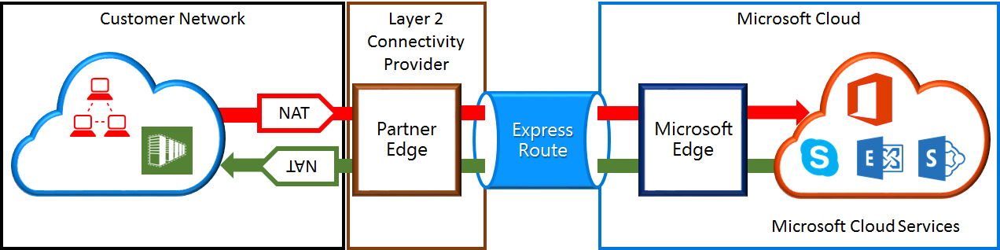

<properties
   pageTitle="Requisiti di NAT per circuiti ExpressRoute | Microsoft Azure"
   description="Questa pagina fornisce informazioni dettagliate sui requisiti per la configurazione e sulla gestione dei NAT per circuiti ExpressRoute."
   documentationCenter="na"
   services="expressroute"
   authors="cherylmc"
   manager="carmonm"
   editor=""/>
<tags
   ms.service="expressroute"
   ms.devlang="na"
   ms.topic="get-started-article"
   ms.tgt_pltfrm="na"
   ms.workload="infrastructure-services"
   ms.date="10/10/2016"
   ms.author="cherylmc"/>

# Requisiti di ExpressRoute NAT

Per connettersi ai servizi cloud Microsoft tramite ExpressRoute, è necessario configurare e gestire NAT. Alcuni provider di integrazione applicativa offrono la configurazione e sulla gestione dei NAT come servizio gestito. Contattare il provider di integrazione applicativa per vedere se offrono tale servizio. In caso contrario, è necessario rispettare i requisiti descritti di seguito. 

Rivedere la pagina [ExpressRoute circuiti e domini di routing](expressroute-circuit-peerings.md) viene presentata una panoramica dei domini di routing diversi. Per soddisfare i requisiti di indirizzo IP pubblici per Azure pubblico e peering Microsoft, è consigliabile impostare NAT tra la rete e Microsoft. In questa sezione fornisce una descrizione dettagliata dell'infrastruttura NAT che è necessario configurare.

## Requisiti di NAT per peering pubblica Azure

Il percorso di peering pubblico Azure consente di connettersi a tutti i servizi ospitati in Azure su indirizzi IP pubblici. Ad esempio servizi elencati in [Domande frequenti su ExpessRoute](expressroute-faqs.md) e uno o più servizi ospitati da indipendenti in Microsoft Azure. Connettività a servizi di Microsoft Azure su peering pubblico sempre viene avviata dalla rete alla rete Microsoft. Traffico destinato a Microsoft Azure su peering pubblico deve essere SNATed agli indirizzi IPv4 pubblici validi prima di accedere alla rete Microsoft. Nella figura seguente offre un'immagine di alto livello di come è possibile impostare fino a NAT soddisfare i requisiti sopra.

 

### Annunci pool e route IP NAT

È necessario assicurarsi che il traffico è immettere un percorso di peering pubblico Azure con indirizzo IPv4 pubblico valido. Microsoft deve essere in grado di convalidare la proprietà del pool di indirizzi IPv4 NAT rispetto a un internazionali routing Internet del Registro di sistema (RIR) o da un registro routing Internet (IRR). Verrà eseguito un controllo in base al numero AS vengano peered con e gli indirizzi IP utilizzati per la NAT. Fare riferimento alla pagina [requisiti routing ExpressRoute](expressroute-routing.md) per informazioni sul routing registri.
 
Non esistono restrizioni per la lunghezza del prefisso IP NAT annunciato tramite questo peering. È necessario eseguire il monitoraggio pool NAT e assicurarsi che non sono esaurite delle sessioni NAT.

>[AZURE.IMPORTANT] Pool IP NAT annunciato a Microsoft non deve essere annunciato a Internet. Questa operazione si interrompe la connettività ad altri servizi Microsoft.

## Requisiti di NAT per Microsoft peering

Il percorso di peering Microsoft consente di connettersi ai servizi cloud Microsoft che non sono supportati aiutano Azure pubblico peering. L'elenco dei servizi include servizi di Office 365, ad esempio Exchange Online, SharePoint Online, Skype for Business e CRM Online. Microsoft prevede di supportare la connettività bidirezionale in di Microsoft peering. Il traffico destinato ai servizi cloud Microsoft deve essere SNATed agli indirizzi IPv4 pubblici validi prima di accedere alla rete Microsoft. Traffico verso la rete dai servizi cloud Microsoft deve essere SNATed prima di accedere alla rete aziendale. Nella figura seguente offre un'immagine di alto livello della modalità NAT dovrebbe essere la configurazione per Microsoft peering.
 
 

#### Traffico proveniente alla rete aziendale destinata a Microsoft

- È necessario assicurarsi che il traffico è immettere il percorso di peering Microsoft con un indirizzo IPv4 pubblico valido. Microsoft deve essere in grado di convalidare il proprietario del pool di indirizzi IPv4 NAT contro internazionali routing internet Registro di sistema (RIR) o da un registro routing internet (IRR). Verrà eseguito un controllo in base al numero AS vengano peered con e gli indirizzi IP utilizzati per la NAT. Fare riferimento alla pagina [requisiti routing ExpressRoute](expressroute-routing.md) per informazioni sul routing registri.

- Indirizzi IP utilizzati per la configurazione di peering pubblica Azure e altri circuiti ExpressRoute devono non annunciati a Microsoft attraverso la sessione BGP. Non esiste nessuna restrizione per la lunghezza del prefisso IP NAT annunciato tramite questo peering.

    >[AZURE.IMPORTANT] Pool IP NAT annunciato a Microsoft non deve essere annunciato a Internet. Questa operazione si interrompe la connettività ad altri servizi Microsoft.

#### Traffico provenienti da Microsoft destinati alla rete

- Alcuni scenari richiedono Microsoft avviare la connettività per gli endpoint del servizio ospitato all'interno della rete. Un tipico esempio dello scenario sarebbe connettività a server ADFS ospitato nella rete da Office 365. In tal caso, si devono una perdita di prefissi appropriati dalla rete in di Microsoft peering. 

- È necessario il traffico SNAT destinato a indirizzi IP all'interno della rete da Microsoft. 

## Passaggi successivi

- Fare riferimento ai requisiti per il [Routing](expressroute-routing.md) e [QoS](expressroute-qos.md).
- Per informazioni flusso di lavoro, vedere [il provisioning di circuito ExpressRoute stati circuito e flussi di lavoro](expressroute-workflows.md).
- Configurare la connessione ExpressRoute.

    - [Creare un circuito ExpressRoute](expressroute-howto-circuit-classic.md)
    - [Configurare la distribuzione](expressroute-howto-routing-classic.md)
    - [Creare un collegamento a un circuito ExpressRoute un VNet](expressroute-howto-linkvnet-classic.md)

