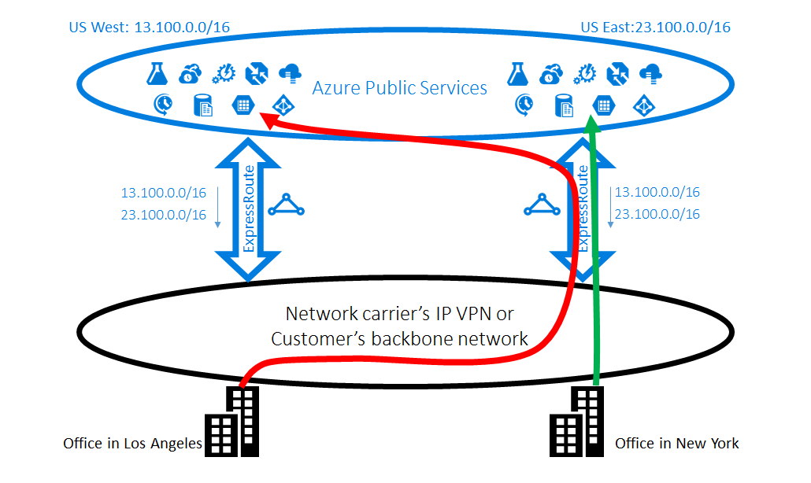

<properties
   pageTitle="Ottimizzare il routing dei ExpressRoute | Microsoft Azure"
   description="Questa pagina vengono fornite informazioni dettagliate su come ottimizzare il routing dei quando un cliente è presenti più circuiti ExpressRoute che eseguono la connessione tra Microsoft e di rete del cliente."
   documentationCenter="na"
   services="expressroute"
   authors="charwen"
   manager="carmonm"
   editor=""/>
<tags
   ms.service="expressroute"
   ms.devlang="na"
   ms.topic="get-started-article"
   ms.tgt_pltfrm="na"
   ms.workload="infrastructure-services"
   ms.date="10/10/2016"
   ms.author="charwen"/>

# Ottimizzare il routing dei ExpressRoute
Quando si dispone di più circuiti ExpressRoute, si dispone di più di un percorso per la connessione a Microsoft. Di conseguenza, non ottimale routing può verificarsi - vale a dire il traffico può richiedere un percorso più raggiunga Microsoft e Microsoft alla rete. Più il percorso di rete, maggiore sarà la latenza. Latenza ha impatto diretto sull'esperienza utente e le prestazioni dell'applicazione. In questo articolo verrà illustrare il problema e viene illustrato come ottimizzare il routing dei utilizzando le tecnologie di routing standard.

## Non ottimale routing maiuscole/minuscole 1
Esaminiamo un Chiudi il problema di routing per un esempio. Si supponga di che avere due uffici negli Stati Uniti, uno Los Angeles e uno in New York. Uffici si è connessi in una rete WAN (Wide Area), che può essere rete dorsale o IP VPN del provider di servizi. Si dispone di due circuiti ExpressRoute, uno in Contattaci ovest e uno in Contattaci Oriente, che sono collegati anche sulla rete WAN. Naturalmente, si dispone di due percorsi per connettersi alla rete Microsoft. A questo punto supponga di disporre di Azure distribuzione (ad esempio Azure App servizio) in Contattaci ovest e Contattaci est. Si intende consiste nel connettere gli utenti Los Angeles a ovest di Azure IT e gli utenti di Reggio Emilia a est di Azure Contattaci perché l'amministratore del servizio annuncia che gli utenti in ogni office accedere ai servizi Azure adiacenti per esperienze ottimali. Purtroppo, il piano avviene anche per gli utenti costa orientale ma non per gli utenti costa occidentale. La causa del problema è il seguente: In ogni circuito ExpressRoute abbiamo annunciare all'utente il prefisso in Azure Contattaci est (23.100.0.0/16) e il prefisso in Azure Contattaci ovest (13.100.0.0/16). Se non si conosce il prefisso è stata inviata da quale area, non sono in grado di gestire in modo leggermente diverso. La rete WAN potrebbe pensare entrambi i prefissi sono supera i Contattaci ovest Contattaci est e pertanto instradare entrambi gli utenti di office a circuito ExpressRoute in Contattaci est. In conclusione, sarà necessario quantità di molti utenti in ufficio di Los Angeles.

### Soluzione: usare BGP community
Per ottimizzare il routing per entrambi gli utenti di office, è necessario sapere quali prefisso è stata inviata da Azure Contattaci ovest e che da est di Azure Contattaci. Queste informazioni sono codificare utilizzando [i valori della Community BGP](expressroute-routing.md). Abbiamo abbiamo assegnato un valore di Community BGP univoco per ogni regione Azure, ad esempio "12076:51004" per Contattaci est, "12076:51006" per Contattaci ovest. Dopo aver scoperto il prefisso è stata inviata da quale area Azure, è possibile configurare quali circuito ExpressRoute deve essere preferito. Poiché si utilizza il BGP per lo scambio di informazioni sul routing del, è possibile utilizzare nelle preferenze locali del BGP per influenzare il routing. In questo esempio, è possibile assegnare un valore superiore nelle preferenze locali per 13.100.0.0/16 in Contattaci ovest rispetto in Contattaci Oriente e allo stesso modo, un valore superiore nelle preferenze locali 23.100.0.0/16 in Contattaci est rispetto in Contattaci ovest. Questa configurazione verrà assicurarsi che, quando entrambi i percorsi a Microsoft sono disponibili, gli utenti Los Angeles avranno circuito ExpressRoute in Contattaci Ovest a cui connettersi ovest di Azure Contattaci che gli utenti di Reggio Emilia adottare il ExpressRoute in Contattaci Oriente a est di Azure Contattaci. Routing ottimizzato su entrambi i lati. 

## Non ottimale routing maiuscole/minuscole 2
Ecco un altro esempio in cui le connessioni da Microsoft richiedono un percorso più lungo di raggiungere la rete. In questo caso, utilizzare i server di Exchange locale ed Exchange Online in un [ambiente ibrido](https://technet.microsoft.com/library/jj200581%28v=exchg.150%29.aspx). Uffici si è connessi a una rete WAN. Si annunciano i prefissi dei server in locale in entrambi gli uffici a Microsoft tramite i due circuiti ExpressRoute. Exchange Online verrà avviata connessioni ai server in locale in casi, ad esempio migrazione delle cassette postali. Purtroppo, la connessione al proprio ufficio Los Angeles viene indirizzata al circuito ExpressRoute in Contattaci est prima di passare sul retro continent intero alla costa occidentale. La causa del problema è simile a quella prima. Senza qualsiasi suggerimento Microsoft network non indicano il prefisso cliente è vicino Contattaci est e qual è la vicino Contattaci ovest. Si verifica per selezionare il percorso errato al proprio ufficio Los Angeles.

### Soluzione: usare come percorso anteponendo
Esistono due soluzioni al problema. Il primo è che si annuncia semplicemente il prefisso locale per Los Angeles ufficio 177.2.0.0/31 sul circuito ExpressRoute in Contattaci ovest e le locale prefisso per New York ufficio 177.2.0.2/31 sul circuito ExpressRoute in Contattaci est. Di conseguenza, esiste solo un percorso per Microsoft per connettersi a ogni ufficio. Non esiste alcun ambiguità e routing ottimizzato. Con questo modello, è necessario considerare la strategia di failover. Nel caso in cui il percorso a Microsoft tramite ExpressRoute è errato, è necessario assicurarsi che Exchange Online può comunque connettersi al server locale. 

La seconda soluzione è che si continua a annunciare entrambi i prefissi su entrambi circuiti ExpressRoute e inoltre che voi un suggerimento sulla quale prefisso vicino quello ufficio. Poiché si supporta anteponendo BGP come percorso, è possibile configurare il percorso di AS per il prefisso per influenzare il routing. In questo esempio, è possibile prolungare il percorso come 172.2.0.0/31 in Contattaci Oriente in modo che si preferisce circuito ExpressRoute in Contattaci ovest per il traffico destinato il prefisso (come la rete considera che il percorso per il prefisso è più breve in ovest). In modo analogo è possibile prolungare il percorso come 172.2.0.2/31 in Contattaci ovest in modo che sarà consigliabile circuito ExpressRoute in Contattaci est. Routing ottimizzato per entrambi gli uffici. Con questo modello, se un circuito ExpressRoute è interrotto, Exchange Online può comunque accedere è tramite un altro circuito ExpressRoute e la WAN. 

>[AZURE.IMPORTANT] Abbiamo rimuovere privato come numeri nel percorso AS per prefissi ricevuti sul Peering Microsoft. È necessario aggiungere pubblica come numeri nel percorso AS per influenzare il routing per Peering Microsoft.

>[AZURE.IMPORTANT] Mentre gli esempi forniti in questa tabella sono per Microsoft e peerings pubblico, è supportato le stesse capacità per peering privato. Inoltre, il percorso come anteponendo funziona all'interno di un ExpressRoute circuito, per influenzare la selezione dei percorsi di primario e secondari.
