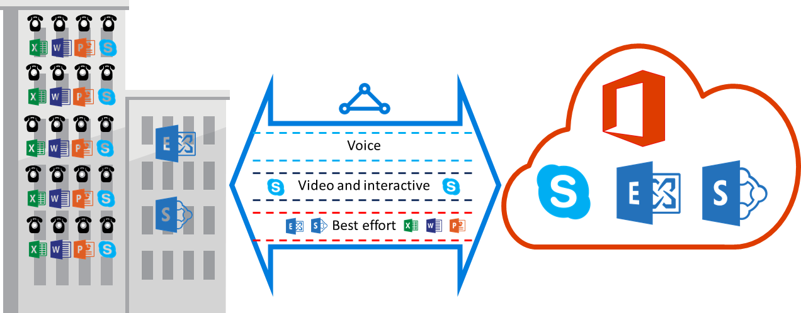

<properties
   pageTitle="Requisiti di qualità per ExpressRoute | Microsoft Azure"
   description="Questa pagina fornisce informazioni dettagliate sui requisiti per la configurazione e sulla gestione dei QoS per circuiti ExpressRoute."
   documentationCenter="na"
   services="expressroute"
   authors="cherylmc"
   manager="carmonm"
   editor=""/>
<tags
   ms.service="expressroute"
   ms.devlang="na"
   ms.topic="get-started-article"
   ms.tgt_pltfrm="na"
   ms.workload="infrastructure-services"
   ms.date="10/10/2016"
   ms.author="cherylmc"/>

# Requisiti di ExpressRoute QoS

Skype for Business ha vari carichi di lavoro che richiedono l'applicazione gestione QoS. Se si prevede di utilizzare i servizi di segreteria tramite ExpressRoute, è necessario rispettare i requisiti descritti di seguito.

>[AZURE.NOTE] Requisiti di qualità del valide per Microsoft peering solo. I valori DSCP il traffico di rete ricevuto peering pubblico Azure e Azure peering privato verranno reimpostati a 0. 

La tabella seguente contiene un elenco di contrassegni DSCP utilizzato da Skype for Business. Per ulteriori informazioni, consultare [Gestione QoS per Skype for Business](https://technet.microsoft.com/library/gg405409.aspx) .

| **Classe di traffico** | **Trattamento (contrassegno DSCP)** | **Skype per Business carichi di lavoro** |
|---|---|---|
| **Segreteria** | EF (46) | Skype / Lync vocale |
| **Interattivo** | AF41 (34) | Video |
|   | AF21 (18) | La condivisione delle applicazioni | 
| **Impostazione predefinita** | AF11 (10) | Trasferimento di file|
|   | CS0 (0) | Qualsiasi altra cosa| 

- È necessario classificare i carichi di lavoro e contrassegnare i valori DSCP corretti. Seguire le indicazioni fornite [di seguito](https://technet.microsoft.com/library/gg405409.aspx) su come impostare i contrassegni DSCP della rete.

- Configurare e supporta più code QoS all'interno della rete. Segreteria deve essere una classe autonoma e ricevere trattamento EF specificato in RFC 3246. 

- È possibile decidere il meccanismo di accodamento, i criteri di rilevamento congestione e allocazione della larghezza di banda per ogni classe di traffico. Tuttavia, il contrassegno per Skype per carichi di lavoro di Business DSCP devono essere mantenuti. Se si usano i contrassegni DSCP non presente nell'elenco precedente, ad esempio AF31 (26), è necessario riscrittura questo valore DSCP 0 prima di inviare il pacchetto a Microsoft. Microsoft invia solo pacchetti contrassegnati con il valore DSCP illustrato nella tabella precedente. 

## Passaggi successivi

- Fare riferimento ai requisiti per il [Routing](expressroute-routing.md) e [NAT](expressroute-nat.md).
- Vedere i collegamenti seguenti per configurare la connessione ExpressRoute.

    - [Creare un circuito ExpressRoute](expressroute-howto-circuit-classic.md)
    - [Configurare la distribuzione](expressroute-howto-routing-classic.md)
    - [Creare un collegamento a un circuito ExpressRoute un VNet](expressroute-howto-linkvnet-classic.md)
