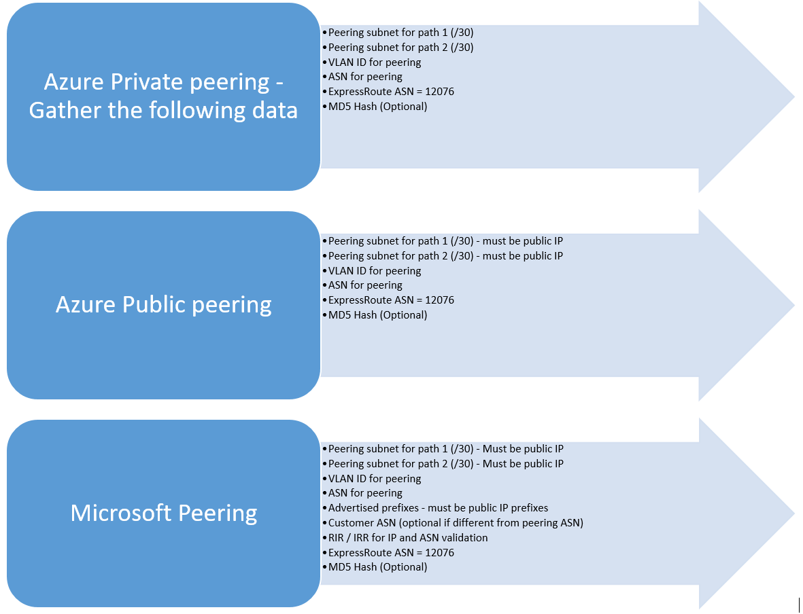

<properties
   pageTitle="Flussi di lavoro per la configurazione di un circuito ExpressRoute | Microsoft Azure"
   description="Questa pagina illustra i flussi di lavoro per la configurazione peerings ed ExpressRoute circuito"
   documentationCenter="na"
   services="expressroute"
   authors="cherylmc"
   manager="carmonm"
   editor="" />
<tags
   ms.service="expressroute"
   ms.devlang="na"
   ms.topic="article" 
   ms.tgt_pltfrm="na"
   ms.workload="infrastructure-services"
   ms.date="10/10/2016"
   ms.author="cherylmc"/>

# Flussi di lavoro ExpressRoute per il provisioning di circuito e circuito stati

Questa pagina illustra il servizio di provisioning e il routing dei flussi di lavoro di configurazione alto livello.

La figura riportata di seguito e nelle procedure descritte le attività da eseguire per disporre di un circuito ExpressRoute viene completato il provisioning-to-end. 

1. Usare PowerShell per configurare un circuito ExpressRoute. Seguire le istruzioni vedere l'articolo [creare ExpressRoute circuiti](expressroute-howto-circuit-classic.md) per altri dettagli.

2. Ordinare la connettività presso il provider di servizi. Questo processo varia. Contattare il provider di integrazione applicativa per ulteriori informazioni su come ordinare la connettività.

3. Assicurarsi che il circuito stato preparato verificando circuito ExpressRoute il provisioning di stato tramite PowerShell. 

4. Configurare domini di routing. Se il proprio provider di integrazione applicativa gestite Layer 3, vengano configurerà il routing per il circuito. Se il provider di integrazione applicativa solo offre servizi di livello 2, è necessario configurare il routing per indicazioni disponibili nelle pagine [routing requisiti](expressroute-routing.md) e [configurazione di routing](expressroute-howto-routing-classic.md) .

    -  Abilitare peering privato Azure, è necessario attivare questa peering per connettersi a macchine virtuali / cloud services distribuito all'interno di reti virtuali.
    -  Abilitare peering pubblico Azure, è necessario attivare Azure pubblico peering se si desidera connettersi ai servizi Azure ospitati in indirizzi IP. Questo è un requisito di accedere alle risorse Azure se si è scelto di abilitare il routing predefinito per Azure peering privato.
    -  Abilitare Microsoft peering - è necessario abilitarlo all'accesso Office 365 e ai servizi online di CRM. 
    
    >[AZURE.IMPORTANT] È necessario assicurarsi che si utilizza un proxy separato / bordo per connettersi a Microsoft di quella utilizzare per Internet. Con il bordo stesso per ExpressRoute e Internet verranno causare routing asimmetrici e causare interruzioni della connettività per la rete.

    

5. Collegamento reti virtuali a circuiti ExpressRoute - è possibile collegare le reti virtuali per il circuito ExpressRoute. Seguire le istruzioni [per creare un collegamento VNets](expressroute-howto-linkvnet-arm.md) il circuito. Questi VNets può consistere nella stessa sottoscrizione di Azure circuito ExpressRoute o può essere una sottoscrizione diversa.

## ExpressRoute circuito provisioning Uniti

Ogni circuito ExpressRoute è due stati:

- Stato di provisioning provider del servizio
- Stato

Stato rappresenta lo stato di provisioning di Microsoft. Questa proprietà è impostata su attivato quando si crea un circuito Expressroute

Lo stato di provisioning provider connettività rappresenta lo stato sul lato del provider del servizio di integrazione applicativa. Può essere *NotProvisioned*, *Provisioning*o *Provisioned*. Circuito ExpressRoute deve essere stato Provisioned di essere in grado di usarlo.

### Stati possibili di un circuito ExpressRoute

In questa sezione sono elencati i possibili stati di un circuito ExpressRoute.

#### Al momento della creazione

Come si esegue il cmdlet di PowerShell per creare il circuito ExpressRoute, si vedrà circuito ExpressRoute nello stato seguente.

    ServiceProviderProvisioningState : NotProvisioned
    Status                           : Enabled

#### Quando il provider di integrazione applicativa è il processo di provisioning circuito

Verrà visualizzato il circuito ExpressRoute nello stato seguente non appena si passa la chiave del servizio per il provider di integrazione applicativa e ha avviato il processo di provisioning.

    ServiceProviderProvisioningState : Provisioning
    Status                           : Enabled

#### Provider di connettività per il completamento il processo di provisioning

Verrà visualizzato il circuito ExpressRoute nello stato seguente non appena il provider di servizi di integrazione applicativa ha completato il processo di provisioning.

    ServiceProviderProvisioningState : Provisioned
    Status                           : Enabled

Viene completato il provisioning e abilitato è che lo stato solo il circuito può essere per poter essere in grado di usarlo. Se si utilizza un provider di livello 2, è possibile configurare il routing per il circuito solo quando è in questo stato.

#### Quando il provider di integrazione applicativa è deprovisioning circuito

Se è richiesto il provider di servizi per il deprovisioning circuito ExpressRoute, verrà visualizzato il circuito impostato sullo stato seguente al termine del processo deprovisioning il provider di servizi.

    ServiceProviderProvisioningState : NotProvisioned
    Status                           : Enabled

È possibile abilitare nuovamente se necessario, oppure eseguire i cmdlet di PowerShell per eliminare il circuito.  

>[AZURE.IMPORTANT] Se si esegue il cmdlet di PowerShell per eliminare il circuito durante il Provisioning della ServiceProviderProvisioningState o Provisioned l'operazione non riesce. Rivolgersi al provider di integrazione applicativa per il deprovisioning circuito ExpressRoute prima di tutto e quindi eliminare il circuito. Microsoft continuerà a distinta circuito finché non viene eseguito il cmdlet di PowerShell per eliminare il circuito.

## Stato di configurazione del routing sessione

BGP il provisioning di stato consente di verificare se la sessione BGP è stata attivata il bordo di Microsoft. Lo stato deve essere abilitato per poter usare il peering.

È importante controllare lo stato della sessione BGP soprattutto per Microsoft peering. Oltre BGP il provisioning di stato, è disponibile un altro stato chiamato *annunciato stato prefissi pubblico*. Lo stato annunciato prefissi pubblico deve essere stato *configurato* , sia per la sessione BGP sia disponibile per il routing per usare-to-end. 

Se lo stato di prefisso pubblico annunciato è impostato su uno stato *necessaria convalida* , la sessione BGP non è abilitata, come i prefissi annunciati non corrisponde a numero AS in uno dei registri routing. 

>[AZURE.IMPORTANT] Se lo stato annunciato prefissi pubblico è in stato di *convalida manuale* , è necessario aprire un ticket di supporto con [supporto Microsoft](https://portal.azure.com/?#blade/Microsoft_Azure_Support/HelpAndSupportBlade) e dimostrare di essere proprietari di indirizzi IP annunciati lungo con il numero di sistema autonomo associato.

## Passaggi successivi

- Configurare la connessione ExpressRoute.

    - [Creare un circuito ExpressRoute](expressroute-howto-circuit-arm.md)
    - [Configurare la distribuzione](expressroute-howto-routing-arm.md)
    - [Creare un collegamento a un circuito ExpressRoute un VNet](expressroute-howto-linkvnet-arm.md)
