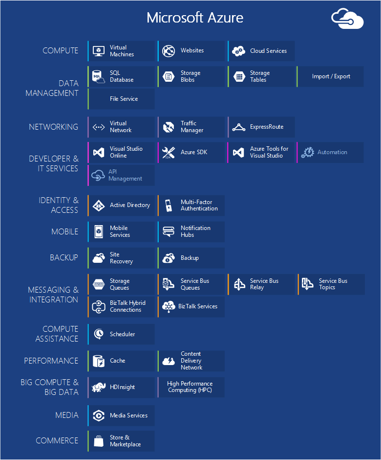
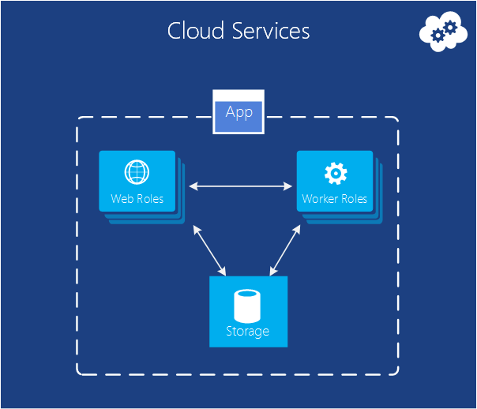
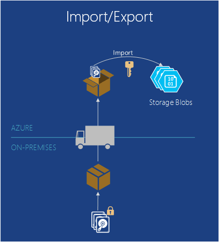
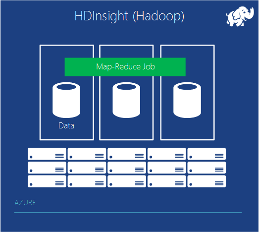
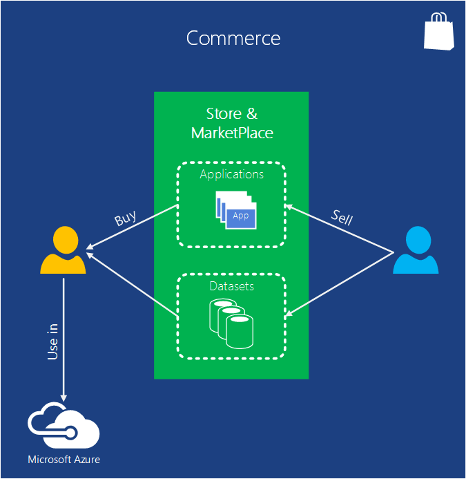

<properties
    pageTitle="Introduzione a Microsoft Azure | Microsoft Azure"
    description="Nuovi utenti di Microsoft Azure? Ottenere una panoramica di base dei servizi che offre con esempi di come sono utili."
    services=" "
    documentationCenter=".net"
    authors="rboucher"
    manager="carolz"
    editor=""/>

<tags
    ms.service="multiple"
    ms.workload="multiple"
    ms.tgt_pltfrm="na"
    ms.devlang="na"
    ms.topic="article"
    ms.date="06/30/2015"  
    ms.author="robb"/>

# Introduzione a Microsoft Azure

Microsoft Azure è applicazione la piattaforma Microsoft per il cloud pubblico.  L'obiettivo di questo articolo è fornire una base per informazioni sulle nozioni fondamentali di Azure, anche se non si conosce qualche cloud computing.

**Come leggere questo articolo**

Azure cresce sempre questa impostazione in modo facile sovraccarico.  Iniziare con i servizi di base, che vengono elencati per primi in questo articolo e quindi passare a servizi aggiuntivi. Che non significa che non è possibile utilizzare solo i servizi aggiuntivi da sole, ma i servizi di base costituiscono la base di un'applicazione in esecuzione in Azure.

**Inviare commenti e suggerimenti**

Il feedback è importante. In questo articolo deve fornire una panoramica efficace di Azure. In caso contrario, inviare commenti e suggerimenti nella sezione commenti nella parte inferiore della pagina. Assegnare alcuni dettagli su quello previsto visualizzare e su come migliorare l'articolo.  

## I componenti di Azure

Azure gruppi servizi in categorie nel portale di gestione e in vari strumenti visivi come [Che cos'è Azure Infographic](https://azure.microsoft.com/documentation/infographics/azure/) . Il portale di gestione è consente di gestire la maggior parte delle (ma non tutti) i servizi di Azure.

In questo articolo utilizzerà un' **altra organizzazione** a cui rivolgersi servizi basati su analoghe e di chiamare i servizi secondari importanti che fanno parte di quelli più grandi.  

   
 *Figura: Azure offre servizi delle applicazioni accessibili da Internet in esecuzione in Azure Data Center.*

## Portale di gestione
Azure ha un'interfaccia web chiamata al [Portale di gestione](http://manage.windowsazure.com) che consente agli amministratori di accedere e gestire più, ma non tutte le funzionalità di Azure.  Microsoft rilascia in genere il portale di interfaccia utente più recente nella versione beta prima di ritirare uno meno recente. La versione più recente denominata ["Azure anteprima portale"](https://portal.azure.com/).

È in genere una sovrapposizione lunga quando entrambi portali sono attivi. Mentre servizi verranno visualizzato in entrambi portali, non tutte le funzionalità potrebbero essere disponibili in entrambe. Servizi più recenti venga visualizzato nei servizi prima e versioni precedenti del portale più recenti e funzionalità può esistere solo in quello precedente.  In questo caso il messaggio è che se non si trova un elemento nel portale di versioni precedenti, controllare la versione più recente e viceversa.

## Calcolare

Una delle operazioni di base che indica una piattaforma cloud è eseguire le applicazioni. Ognuno dei modelli di calcolo Azure ha il proprio ruolo per la riproduzione.

È possibile utilizzare queste tecnologie separatamente o combinarle necessari per la creazione di base appropriata per l'applicazione. Il metodo che scelto dipende quali problemi si sta tentando di risolvere.

### Macchine virtuali di Azure

   
*Figura: Macchine virtuali di Azure offre controllo completo su istanze di macchina virtuale nel cloud.*

La possibilità di creare una macchina virtuale su richiesta, se da un'immagine standard o da una specifica, può essere molto utile. Questo approccio, in genere noto come infrastruttura come servizio (IaaS) è ciò che fornisce macchine virtuali di Azure. Figura 2 mostra una combinazione di modalità di esecuzione di una virtuale macchina e su come creare una da un disco rigido virtuale.  

Per creare una macchina virtuale, specificare il disco rigido virtuale da utilizzare e dimensione della memoria virtuale.  È quindi pagare per il periodo di tempo macchina virtuale è in esecuzione. Pagando tramite il minuto e solo durante l'esecuzione, anche se è presente una spesa minima di spazio di archiviazione per mantenere il disco rigido virtuale disponibile. Azure offre una raccolta di stock dischi rigidi virtuali (denominati "immagini") che contengono un sistema operativo avvio per iniziare. Sono incluse opzioni Microsoft e partner, ad esempio Windows Server e Linux, SQL Server, Oracle e molti altri. Si è gratuito creare dischi rigidi virtuali e le immagini e quindi caricarli manualmente. È anche possibile caricare dischi rigidi virtuali che contengono solo i dati e quindi accedervi da macchine virtuali in esecuzione.

Nel punto in cui il disco rigido virtuale provenga da, è possibile memorizzare in modo permanente le modifiche apportate mentre è in esecuzione una macchina virtuale. La volta successiva che si crea una macchina virtuale da tale disco rigido virtuale, aspetti sollevare in cui ci trovava. Dischi rigidi virtuali che indietro macchine virtuali archiviati nei blob di spazio di archiviazione di Azure, si parla in un secondo momento.  Questo significa che si riceve la ridondanza per assicurarsi che non è possibile non vengono visualizzati nelle macchine virtuali a causa di errori hardware e disco. È anche possibile copiare il disco rigido virtuale modificato fuori Azure, quindi eseguirlo a livello locale.

L'applicazione viene eseguita all'interno di una o più macchine virtuali, a seconda di come è stato creato in precedenza o decidere di crearne uno da zero.

Questo approccio piuttosto generale al cloud computing può essere utilizzato per risolvere diversi problemi.

**Scenari di macchina virtuale**

1.  **Dev/Test** , è possibile usarli per creare una piattaforma di sviluppo e test economica che è possibile arrestare dopo aver usarlo. È anche possibile creare ed eseguire applicazioni che utilizzano le lingue e si è soddisfatti delle raccolte. Queste applicazioni possono utilizzare le opzioni di gestione dei dati che fornisce Azure ed è anche possibile scegliere di utilizzare SQL Server o un altro DBMS in esecuzione in macchine virtuali di uno o più.
2.  **Spostare le applicazioni di Azure (ascensore e MAIUSC)** - "Ascensore e MAIUSC" fa riferimento a spostare l'applicazione molto come utilizzare un carrelli per spostare un oggetto di grandi dimensioni.  Si "solleva" il disco rigido virtuale dal Data Center locale, "Sposta" in Azure ed eseguirlo non esiste.  In genere è necessario eseguire alcune operazioni per rimuovere le dipendenze su altri sistemi. Se sono presenti troppi, è possibile scegliere l'opzione 3 invece.  
3.  **Estendi il Data Center** - macchine virtuali di Azure utilizzo come estensione del centro dati locale, che esegue SharePoint o altre applicazioni. A tale scopo, è possibile creare domini di Windows nel cloud eseguendo Active Directory in macchine virtuali di Azure. È possibile utilizzare virtuali Azure (indicato in un secondo momento) per unire la rete locale e alla rete aziendale in Azure.

### Web App

   
 *Figura: Azure Web Apps viene eseguita un'applicazione del sito Web nel cloud senza dover gestire il server web sottostante.*

Una delle operazioni più comuni che gli utenti nel cloud viene eseguita applicazioni web e siti Web. Macchine virtuali di Azure lo consente, ma comunque lascia si con la responsabilità di amministrazione di uno o più macchine virtuali e i sistemi operativi sottostanti. Ruoli web servizi cloud possono eseguire questa operazione, ma è comunque in attività amministrative la distribuzione e gestirli.  Cosa fare se si vuole semplicemente un sito Web in cui qualcun altro si occupa del lavoro amministrativo dell'utente?

Questo è esattamente ciò che fornisce Web Apps. Questo modello di elaborazione offre un ambiente web gestito tramite il portale di gestione di Azure, nonché API. È possibile spostare un'applicazione di sito Web esistente in Web Apps invariato oppure è possibile creare una nuova direttamente nel cloud. Una volta un sito Web è in esecuzione, è possibile aggiungere o rimuovere le istanze in modo dinamico, che si basa su Azure Web Apps per caricare le richieste di equilibrio tra di loro. App Azure offre un'opzione condivisa, il sito Web in cui viene eseguito in una macchina virtuale con altri siti, e un'opzione standard che consente a un sito per l'esecuzione nella propria macchina virtuale. L'opzione standard è anche possibile aumentare la dimensione (elaborazione) le istanze di, se necessario.

Per lo sviluppo, Web App supporta .NET, PHP, Node, Java e Python e SQL Database MySQL (ClearDB, un partner Microsoft) per l'archiviazione relazionale. Fornisce inoltre supporto incorporato per diverse applicazioni comuni, tra cui WordPress, Joomla e Drupal. L'obiettivo è fornire una piattaforma economico, scalable e ampiamente utile per la creazione di applicazioni web e siti Web nel cloud pubblico.

**Scenari di applicazioni Web**

Web App deve essere utili per le aziende, gli sviluppatori e governativi di progettazione web. Per le aziende, è una soluzione semplice gestire, scalable, la sicurezza e disponibilità per l'esecuzione di siti Web di presenza. Quando è necessario configurare un sito Web, è consigliabile iniziare con Azure Web Apps e procedere ai servizi Cloud dopo aver bisogno di una funzione che non è disponibile. Vedere alla fine della sezione "Elaborazione" per i collegamenti a ulteriori che consentono di scegliere tra le opzioni.

### Servizi cloud
   
*Figura: Azure servizi Cloud in grado di eseguire il codice personalizzato scalabilità su una piattaforma come ambiente servizio PaaS)*

Si supponga di voler creare un'applicazione cloud in grado di supportare molti utenti contemporaneamente, non richiede molto amministrazione e mai spostarsi verso il basso. Potrebbe essere un fornitore di software Fondazione, ad esempio, che ha deciso di accogliere Software come un servizio mediante la creazione di una versione di una delle applicazioni nel cloud. O potrebbe essere un avvio creazione di un'applicazione consumer che si sta aspettando crescerà rapidamente. Se si sta creando in Azure, il modello di esecuzione è necessario utilizzare?

Azure Web Apps consente la creazione di questo tipo di applicazione web, ma esistono alcune limitazioni. Non si dispone di accesso amministrativo, ad esempio, il che significa che non è possibile installare software non autorizzato. Macchine virtuali di Azure offre numerose flessibilità, inclusi i diritti di accesso amministrativo e sicuramente possibile utilizzarla per creare un'applicazione molto scalable, ma è necessario gestire molti aspetti di affidabilità e amministrazione personalmente. Si preferisce è un'opzione che consente il controllo è necessario ma anche gestisce la maggior parte delle operazioni necessarie per l'affidabilità e amministrazione.

Questo è esattamente quali viene fornito da servizi Cloud Windows Azure. Questo è progettata espressamente per supportare scalable, affidabile e amministrazione minimo applicazioni e i dati di un esempio di ciò che viene generalmente denominata piattaforma come servizio (PaaS). Per utilizzarla, si crea un'applicazione utilizzando la tecnologia che si sceglie, ad esempio c#, Java, PHP, Python, Node o un altro elemento. Il codice viene quindi eseguito in macchine virtuali, definite istanze, esegue una versione di Windows Server.

Ma queste macchine virtuali sono diverse da quelle create con macchine virtuali di Azure. Per una cosa, Azure stesso li gestisce, eseguire operazioni come l'installazione delle patch del sistema operativo e automaticamente attuare nuovo corretto, le immagini. Questo significa che l'applicazione non deve gestire lo stato nel web o lavoro istanze del ruolo; Se, tuttavia va in una delle opzioni di gestione dati Azure descritte nella sezione successiva. Azure controlla anche queste macchine virtuali, riavviare qualsiasi interrotti. È possibile impostare servizi cloud per creare automaticamente le istanze di più o meno in risposta alla richiesta. In questo modo è possibile gestire l'uso di maggiore e quindi in modo che non sono pagamento quanto quando è minore utilizzo.

Si dispone di due ruoli tra cui scegliere quando si crea un'istanza, entrambe basate su Windows Server. La differenza tra i due principale è eseguita un'istanza di un ruolo web IIS, mentre non un'istanza di un ruolo di lavoro. Tuttavia, sia gestite nello stesso modo e viene in genere per un'applicazione di utilizzare entrambe. Ad esempio un'istanza di ruolo web potrebbe accettare richieste dagli utenti, quindi li passano a un'istanza del ruolo di lavoro per l'elaborazione. Per ridimensionare l'applicazione verso l'alto o verso il basso, è possibile richiedere che Azure creare più istanze di entrambi i ruoli o arrestare istanze esistenti. E simile a macchine virtuali di Azure, si viene addebitata solo per il tempo che ogni istanza del ruolo web o lavoro sia in esecuzione.

**Scenari di servizi cloud**

Servizi cloud sono ideali supportare enorme scalabilità quando è necessario maggiore controllo sulla piattaforma quelli previsti per Azure Web Apps, ma non è necessario controllare il sistema operativo.

#### Scelta di un modello di calcolo
La pagina [Azure Web Apps, servizi Cloud e macchine virtuali di confronto](./app-service-web/choose-web-site-cloud-service-vm.md) fornisce informazioni più dettagliate su come scegliere un modello di calcolo.

## Gestione dei dati

Applicazioni necessario dati e diversi tipi di applicazioni sia diversi tipi di dati. Per questi motivi, Azure offre diversi modi per archiviare e gestire i dati. Azure offre molte opzioni relative all'archiviazione, ma tutti sono progettati per l'archiviazione molto permanente.  Con una di queste opzioni sono sempre 3 copie dei dati mantenuti sincronizzati tra un Data Center di Azure, 6 se si consentono di Azure come utilizzare la ridondanza geografico per eseguire il backup in un'altra data center almeno 300 miglia fuori sede.     

### In macchine virtuali
La possibilità di eseguire SQL Server o un altro DBMS in una macchina virtuale creata con macchine virtuali di Azure menzionata. Tenere presente che questa opzione non è limitata ai sistemi relazionali; che è anche possibile eseguire Technology NoSQL MongoDB e Cassandra liberamente. L'esecuzione di sistema di database è semplice it replica cosa siamo utilizzati per un Data Center- ma richiede la gestione di amministrazione di tale DBMS.  In altre opzioni, Azure gestisce più o tutti dell'amministrazione dell'utente.

Di nuovo lo stato del disco eventuali dati aggiuntivi si creano o si carica e la macchina virtuale sono supportate da archiviazione blob (che si parla in un secondo momento).  

### Database SQL Azure
   

*Figura: Database di SQL Azure fornisce un servizio di database relazionali gestiti nel cloud.*

Per l'archiviazione relazionale, Azure offre la funzionalità di Database SQL. Non consentire la denominazione attacchi fraudolenti. Questa è diversa da un Database SQL tipico forniti da SQL Server in esecuzione nella parte superiore di Windows Server.  

In passato detti SQL Azure, Database SQL Azure fornisce le caratteristiche chiave di un database relazionale sistema di gestione, incluse le transazioni atomiche, access simultanee dei dati da più utenti con l'integrità dei dati, le query SQL ANSI e un modello di programmazione familiare. Ad esempio SQL Server, Database SQL è possibile accedervi utilizzando il Framework entità, ADO.NET, JDBC e altri dati familiare tecnologie di accesso ai. Supporta anche la maggior parte del linguaggio Transact-SQL, insieme a strumenti di SQL Server, ad esempio SQL Server Management Studio. Per chiunque familiarità con SQL Server (o un altro database relazionale), usare il Database di SQL è un'operazione semplice.

Database SQL non appena un DBMS nel cloud-it di un servizio PaaS. È comunque possibile controllare i dati e chi può accedere, ma si occupa Database SQL di lavoro noioso amministrativo, ad esempio la gestione dell'infrastruttura hardware e automaticamente mantenere aggiornato il software di database e il sistema operativo. Database SQL vengono forniti anche disponibilità, backup automatici, nel momento ripristinare le funzionalità e possibile replicare copie su aree geografiche.  

**Scenari per Database SQL**

Se si sta creando un'applicazione Azure (utilizzare uno dei modelli di calcolo) che deve essere lo spazio di archiviazione relazionale, Database SQL può essere delle opzioni. Applicazioni eseguite all'esterno del cloud è inoltre possono utilizzare questo servizio, tuttavia, in modo che esistono molti altri scenari. Ad esempio, i dati archiviati in Database SQL di accessibili da sistemi diversi client, inclusi desktop, notebook, Tablet e telefoni. E perché offre predefinite disponibilità mediante la replica, usare il Database di SQL consente di ridurre i tempi di inattività.

### Tabelle
  

*Figura: Tabelle Azure consente flat NoSQL per archiviare i dati.*

Questa caratteristica è detta termini diversi come la parte di una caratteristica maggiore denominata "Archiviazione Azure". Se viene visualizzato "tabelle", "Tabelle Azure" o "lo spazio di archiviazione tabelle", è la stessa operazione.  

E non confuso dal nome: questa tecnologia non fornisce archiviazione relazionale. In realtà è un esempio di un approccio NoSQL chiamato un archivio di chiave/valore. Tabelle Azure consentono a un'applicazione di archiviare le proprietà di vario tipo, ad esempio stringhe, date e numeri interi. Un'applicazione può quindi recuperare un gruppo di proprietà grazie a una chiave univoca per tale gruppo. Mentre operazioni complesse come join non sono supportati, tabelle offrono accesso rapido ai dati digitati. Poiché sono molto scalable, con una singola tabella grado di contenere quanto terabyte di dati. E la loro semplicità di corrispondenza, le tabelle sono in genere meno costose da utilizzare rispetto archiviazione relazionale del Database di SQL.

**Scenari per le tabelle**

Si supponga che si desidera creare un'applicazione Azure necessarie per accedere rapidamente alle digitato dati, cercando grandi quantità di essa, ma non è necessario eseguire query SQL complesse su questi dati. Si supponga ad esempio, che si sta creando un'applicazione consumer che è necessario archiviare informazioni del profilo utente per ogni utente. L'app sta per essere molto più comuni, pertanto è necessario consentire per grandi quantità di dati, ma non è molto con i dati oltre la memorizzazione, in modo semplice il recupero dei. Si tratta esattamente al tipo di scenario in senso tabelle Azure.

### BLOB
    
*Figura: BLOB Azure fornisce dati binari non strutturati.*  

BLOB Azure (nuovamente solo a archiviazione BLOB di"" e "Archiviazione Blob" sono la stessa operazione) è progettato per memorizzare dati binari non strutturati. Ad esempio tabelle, BLOB include lo spazio di archiviazione economico e un blob singolo possa essere costituito da 1TB (un terabyte). Applicazioni Azure consente anche unità Azure, che consente a fornire l'archiviazione permanente per un file system di Windows installato in un'istanza di Azure BLOB. L'applicazione considera normali file di Windows, ma il contenuto viene effettivamente archiviato in un blob.

Archiviazione BLOB viene utilizzato da molte altre funzioni Azure (inclusi macchine virtuali), in modo troppo sicuramente che è possibile gestire i carichi di lavoro.

**Scenari per BLOB**

Un'applicazione che archivia file grandi, video o altre informazioni binari può utilizzare BLOB per l'archiviazione semplice e conveniente. BLOB sono in genere utilizzati anche in combinazione con altri servizi come rete CDN, che verrà discusso su in un secondo momento.  

### Importazione / esportazione
  

*Figura: Azure importazione / esportazione offre la possibilità di inviare un disco rigido fisico o comuni per i dati in blocco più rapido e conveniente importare o esportare.*  

Può succedere che si desidera spostare una grande quantità di dati in Azure. Che richiederà molto tempo, ad esempio giorni e usare molte della larghezza di banda. In questi casi, è possibile utilizzare Azure importazione/esportazione, che consente di spedire crittografati con Bitlocker 3,5" unità disco rigido SATA direttamente alle interfacce di dati di Azure, in cui Microsoft verrà trasferire i dati in archiviazione blob dell'utente.  Una volta completato il caricamento, Microsoft incluso unità al mittente.  È anche possibile richiedere che grandi quantità di dati dallo spazio di archiviazione Blob esportazione nelle unità disco rigido e inviata tramite posta elettronica.

**Scenari per l'importazione / esportazione**

- **La migrazione dei dati di grandi dimensioni** - ogni volta che si dispone di grandi quantità di dati (terabyte) che si desidera caricare in Azure, il servizio di importazione/esportazione è spesso molto più rapido e forse conveniente rispetto al trasferimento tramite internet. Dopo aver aggiunto i dati BLOB, è possibile elaborare in altre forme, ad esempio lo spazio di archiviazione tabella o un Database SQL.

- **Il ripristino dei dati archiviati** , è possibile utilizzare importazione/esportazione trasferimento Microsoft grande quantità di dati archiviati in archiviazione Blob Azure a un dispositivo di archiviazione che si inviano e quindi hanno dispositivo recapitato tornare a una posizione desiderata. Perché questo richiederà molto tempo, non è una buona opzione per il ripristino di emergenza. È consigliabile per i dati archiviati che non è necessario accedere rapidamente a.

### Servizio di file
    
*Figura: Servizi di File Azure fornisce piccole e medie imprese \\ \\server\condivisione percorsi per le applicazioni in esecuzione nel cloud.*

In locale, è frequente grandi quantità di spazio di archiviazione file accessibile tramite il protocollo Server Message Block (SMB) utilizzando un \\ \\server\condivisione formato. Azure è ora disponibile un servizio che consente di utilizzare questo protocollo nel cloud. Le applicazioni in esecuzione in Azure è possono usarlo per condividere file tra macchine virtuali mediante familiarità file system API come WriteFile e ReadFile. Inoltre, è possono accedere ai file anche nello stesso momento tramite un'interfaccia resto, che consente di accedere alle condivisioni locali quando si configura anche una rete virtuale. File di Azure si basa sul servizio blob eredita la stessa disponibilità, durata, scalabilità e integrato in archiviazione Azure la ridondanza geografico.

**Scenari per i file di Azure**

- **Migrazione App esistente nel cloud** - il più semplice eseguire la migrazione locale applicazioni nel cloud che consente di condividere dati tra le parti dell'applicazione nelle condivisioni file. Ogni macchina virtuale si connette alla condivisione di file e quindi è possibile leggere e scrivere file nello stesso modo in cui preferisce rispetto a un file locale condividere.

- **Le impostazioni dell'applicazione condivisa** - un modello comune per applicazioni distribuite è per i file di configurazione sono presenti in una posizione centralizzata in cui è possibile accedervi da molte macchine virtuali diversi. Questi file di configurazione possono essere archiviati in una condivisione File di Azure e leggere da tutte le istanze di applicazione. Inoltre, è possibile gestire le impostazioni tramite l'interfaccia resto, che consente l'accesso ai file di configurazione in tutto il mondo.

- **Condividere diagnostica** - è possibile salvare e condividere file diagnostici quali registri metriche e anomalo. In questi file disponibile nell'interfaccia di piccole e medie imprese sia il resto consente alle applicazioni di utilizzare una varietà di strumenti di analisi per l'elaborazione e analizzare i dati di diagnostica.

- **Dev/Test/Debug** - quando gli sviluppatori o amministratori stanno lavorando macchine virtuali nel cloud, è spesso necessario un set di strumenti o utilità. Installazione e la distribuzione di queste utilità in ogni macchina virtuale è molto tempo. Con i file di Azure, uno sviluppatore o un amministratore può archiviare gli strumenti preferiti in una condivisione file e connettersi a tali account da qualsiasi computer virtuale.

## Rete

Azure viene eseguito oggi in molti Data Center distribuiti in tutto il mondo. Quando si esegue un'applicazione o archiviare i dati, è possibile selezionare uno o più di questi centri dati da utilizzare. È anche possibile connettersi a tali Data Center in vari modi tramite i servizi riportata di seguito.

### Rete virtuale
   

*Figura: Reti virtuali fornisce una rete privata nel cloud, in modo diversi servizi possono comunicare con loro o alle risorse locale se si configura una connessione VPN tra locale connessione.*  

Utile per usare una cloud pubblica è possibile considerare come estensione del Data Center.

Perché è possibile creare macchine virtuali su richiesta, quindi rimuoverle (e interrompere il pagamento) quando non è più necessarie, è possibile avere elaborazione solo quando si desidera. E poiché macchine virtuali di Azure consente di creare macchine virtuali in esecuzione SharePoint, Active Directory e altro software familiari in locale, questo approccio è possibile utilizzare con le applicazioni di cui di che si dispone già.

Per rendere molto utile, tuttavia, gli utenti devono essere in grado di gestire queste applicazioni come se viene eseguito in Data Center. Questa opzione consente di Azure virtuali. Utilizzare un dispositivo di gateway VPN, un amministratore può configurare automaticamente una rete privata virtuale (VPN) tra la rete locale e nelle macchine virtuali distribuiti in una rete virtuale in Azure. Perché si assegnano indirizzi v4 IP macchine virtuali nel cloud, vengano visualizzate come in rete. Gli utenti dell'organizzazione possono accedere alle applicazioni tali macchine virtuali contengono come se viene eseguito in locale.

Per ulteriori informazioni sulla pianificazione e creazione di una rete virtuale per cui si lavora, vedere [Virtuali](./virtual-network/virtual-networks-overview.md).

### Strada

   

*Figura: ExpressRoute utilizza una rete virtuale Azure, ma indirizza connessioni tramite più velocemente dedicate linee anziché Internet pubblica.*  

Se è necessario maggiore della larghezza di banda o protezione rispetto a una rete virtuale Azure può fornire connessione, è possibile esaminare il ExpressRoute. In alcuni casi, ExpressRoute inoltre contenere i costi. È comunque necessario virtuali in Azure, ma il collegamento tra Azure e il sito utilizza una connessione dedicata non va tramite Internet. Per utilizzare questo servizio, è necessario disporre di un accordo con un provider di servizi di rete o un provider di exchange.

Impostazione di un ExpressRoute connessione richiede più tempo e pianificazione, pertanto è consigliabile iniziare con una connessione VPN da sito e quindi eseguire la migrazione a una connessione ExpressRoute.

Per ulteriori informazioni su ExpressRoute, vedere [Panoramica tecnica ExpressRoute](./expressroute/expressroute-introduction.md).

### Gestore del traffico

   

*Figura: Gestione di traffico Azure consente di indirizzare il traffico globale del servizio in base alle regole intelligente.*

Se l'applicazione Azure è in esecuzione in più Data Center, è possibile utilizzare gestore del traffico Azure per indirizzare le richieste dagli utenti in maniera intelligente nelle varie istanze dell'applicazione. È inoltre possibile inviare il traffico ai servizi non è in esecuzione in Azure, purché siano accessibili da internet.  

Un'applicazione Azure con gli utenti in solo una singola parte del mondo può essere eseguita in un solo Data Center Azure. Un'applicazione con utenti distribuiti in tutto il mondo, tuttavia, è probabile per l'esecuzione in più Data Center, potrebbe essere anche tutte. In questo caso secondo affrontare un problema: come è in maniera intelligente indicare agli utenti di istanze dell'applicazione? La maggior parte dei casi è ogni utente per accedere a Data Center più vicino al suo conto, dal momento che probabilmente dà Lei l'orario migliore risposta. Ma cosa fare se l'istanza dell'applicazione overload o non è disponibile? In questo caso, sarebbe utile indicare la sua richiesta automaticamente al Data Center di un altro. Questo è esattamente cosa viene eseguita da Azure il traffico Manager.

Il proprietario di un'applicazione consente di definire regole che specificano come dovrà richieste degli utenti con i Data Center, quindi utilizza la gestione del traffico per eseguire queste regole. Ad esempio, gli utenti potrebbero normalmente indirizzati al Data Center di Azure più vicino, ma vengono inviati a un altro quando il tempo di risposta dal relativo Data Center predefinito supera il tempo di risposta da altri centri dati. Per le applicazioni globalmente distribuite con molti utenti, è utile disporre di un servizio incorporato per gestire i problemi di questo tipo.

Gestore del traffico utilizza Directory Name Service (DNS) per instradare gli utenti per gli endpoint del servizio, ma ulteriormente il traffico non va tramite il traffico Manager dopo la connessione. In questo modo il traffico Manager vengano una bottiglia che può determinare un rallentamento delle comunicazioni di servizio.

## Servizi di sviluppo
Azure offre diversi strumenti per gli sviluppatori e professionisti IT creare e gestire applicazioni nel cloud.  

### Azure SDK
Tornare in 2008, la prima versione non definitiva di Azure supportato solo sviluppo .NET. Oggi, tuttavia, è possibile creare applicazioni Azure in pressoché qualsiasi lingua. Microsoft offre attualmente SDK specifiche della lingua per .NET, Java, PHP, Node, trascrizione e Python. È inoltre disponibile un generale Azure SDK che fornisce il supporto di base per qualsiasi lingua, ad esempio C++.  

Questi SDK consentono di creare, distribuire e gestire applicazioni Azure. Vengono resi disponibili da [www.microsoftazure.com](https://azure.microsoft.com/downloads/) o GitHub e possono essere usate con Visual Studio ed Eclisse. Azure offre anche gli strumenti della riga di comando che è possibile utilizzare con un ambiente di sviluppo o editor, inclusi gli strumenti per la distribuzione di applicazioni in Azure da sistemi Linux e Macintosh.

Insieme consentono di creare applicazioni Azure, questi SDK offrono librerie client che consentono di creare software che utilizza servizi Azure. Ad esempio, si potrebbe creare un'applicazione la lettura e scrittura BLOB Azure o creare uno strumento che distribuisce applicazioni Azure tramite l'interfaccia di gestione Azure.

### Servizi di Team Visual Studio

Visual Studio Team Services è un nome di marketing che comprendono un numero che consentono di sviluppo di applicazioni in di Azure.

Per evitare confusione - non fornisce una versione di Visual Studio ospitata o basato sul Web. È comunque necessario la copia locale in esecuzione di Visual Studio. Ma offre molti altri strumenti che possono essere molto utile.

Include un controllo del codice sorgente ospitato chiamato servizio Team Foundation, che offre il controllo delle versioni ed elementi di lavoro.  È anche possibile usare fra il controllo della versione se si preferisce che. E possono variare il controllo del codice sorgente che utilizzare da project. È possibile creare progetti team privato illimitato accessibili da un punto qualsiasi nel mondo.  

Visual Studio Team Services fornisce un servizio di test di carico. È possibile eseguire i test di carico creati in Visual Studio in macchine virtuali nel cloud. Specificare il numero totale di utenti che si desidera caricare test con e Visual Studio Team Services determinerà automaticamente quanti agenti sono necessari, aggiornarsi macchine virtuali richieste ed eseguire i test di carico. Se si è un server di sottoscrizione MSDN, viene visualizzato migliaia di utenti-minuti gratuiti di ogni mese di test.

Visual Studio Team Services offre anche supporto per lo sviluppo agile con caratteristiche come integrazione continua compila, bacheche Kanban e sale riunioni del team virtuale.

**Scenari di Services Team Visual Studio**

Visual Studio Team Services è consigliabile per le aziende che devono collaborare in tutto il mondo e non ha già l'infrastruttura in posizione per farlo. È possibile ottenere il programma di installazione in minuti, scegliere un sistema di controllo di origine e iniziare a scrivere codice e la creazione del giorno corrente.  Gli strumenti di team consentono una posizione di coordinare e la collaborazione e altri strumenti forniscono analisi necessario per testare e regolare rapidamente l'applicazione.

Ma le organizzazioni che hanno già un sistema locale è possono testare i nuovi progetti in Visual Studio Team Services per verificare se è più efficiente.   

### Informazioni dettagliate sui applicazione

  

*Figura: Prestazioni monitor approfondimenti applicazione e l'utilizzo dell'app web o un dispositivo live.*

Quando è stata pubblicata l'app - se viene eseguito su dispositivi mobili, desktop o web browser - applicazione approfondimenti indica alle prestazioni e operazioni con gli utenti. Consente di mantenere un conteggio di anomalo e risposta lenta, avviso se le cifre superare soglie accettabile e consentono di diagnosticare i problemi.

Quando si sviluppa una nuova caratteristica, pianificare misurare la riuscita con gli utenti. Per analizzare i modelli di utilizzo, per comprendere le soluzioni migliori per i clienti e migliorare l'app in ogni ciclo di sviluppo.

Anche se è ospitato in Azure, applicazione approfondimenti funziona per una gamma sempre più ampia delle App sia attivato e disattivato Azure. J2EE e ASP.NET web App rientrano, nonché iOS, Android, OSX e Windows. Telemetria viene inviato da un SDK creato con l'app da analizzare e visualizzare nel servizio di applicazione approfondimenti in Azure.

Se si vuole più specializzate analitica, esportare il flusso di telemetria a un database o in Power BI o altri strumenti.

**Scenari di applicazioni approfondimenti**

Si sviluppa un'app. Potrebbe essere un'app web o a un'app di dispositivo o a un'app per dispositivi con un back-end web.

* Ottimizzare le prestazioni dell'applicazione dopo la pubblicazione o durante il test di carico.  Informazioni dettagliate sui applicazione aggrega telemetria da tutte le istanze installate e si presenta con i grafici di tempi di risposta, richiesta e conteggi eccezione, i tempi di risposta dipendenza e altri indicatori di prestazioni. Questi consentono di ottimizzare le prestazioni dell'applicazione. È possibile inserire codice per segnalare più dati specifici se è necessario.
* Rilevare e diagnosticare i problemi nell'app live. Se gli indicatori di prestazioni superare soglie accettabile, è possibile ottenere gli avvisi tramite posta elettronica. È possibile esaminare le sessioni utente specifico, ad esempio per visualizzare la richiesta che ha causato un'eccezione.
* Tenere traccia dell'utilizzo di valutare il successo di ogni nuova caratteristica. Quando si progetta una nuova storia utente, pianificare misurare quantità viene utilizzato e se gli utenti raggiungere gli obiettivi previsti. Applicazione che consente di dati di utilizzo di base, ad esempio visualizzazioni di una pagina web ed è possibile inserire codice per tenere traccia dell'esperienza utente in modo più dettagliato.

### Automazione
Nessuno ama inutilmente del tempo per eseguire ripetutamente gli stessi processi manuali. Automazione Azure consente di creare, monitorare, gestire e distribuire le risorse nel proprio ambiente Azure.  

Automazione utilizza "runbook", che utilizza flussi di lavoro di Windows PowerShell (rispetto a quelle normali PowerShell) dietro le quinte. Runbook sono progettati per essere eseguita senza interazione dell'utente. I flussi di lavoro di PowerShell consente lo stato di uno script da salvare in punti di controllo lungo il percorso. Quindi se si verifica un errore, non è necessario avviare uno script dall'inizio. È possibile riavviare all'ultima verifica. Questo è un notevole risparmio di lavoro si tenta di effettuare lo script gestire ogni errore possibili.

**Scenari di automazione**

Automazione Azure è un'ottima scelta per automatizzare le attività manuale lunga, errori e frequenti in Azure.

### Gestione dell'API

Creare e pubblicare interfacce (API) su internet è in genere fornire servizi alle applicazioni. Se tali servizi resellable (ad esempio dati meteo), un'organizzazione può consentire altre terze parti accedere a questi stessi servizi a pagamento. Quando si adatta a più partner, è necessario in genere ottimizzare e controllare l'accesso.  Alcuni partner potrebbe essere anche i dati in un formato diverso.

Gestione dell'API Azure semplifica l'individuazione di alle organizzazioni di pubblicare API per i partner, dipendenti e gli sviluppatori di terze parti in modo sicuro e scala. Fornisce un endpoint API diversi e funge da un proxy di chiamare l'endpoint effettivo fornendo servizi come la memorizzazione nella cache, trasformazione, limitazione, il controllo di accesso e aggregazione analitica.

**API Gestione scenari**

Supponiamo che la società ha un set di dispositivi che tutto necessario richiamare in un servizio centrale accesso ai dati, ad esempio una compagnia con dispositivi in ogni Van in viaggio.  Sicuramente la società vuole configurare un sistema per tenere traccia dei propri Van affinché possa in modo affidabile prevedere e aggiornare i tempi di consegna. Può sapere quanti Van ha e pianificare in modo appropriato.  Ogni VAN sarà necessario un dispositivo che richiama a una posizione centrale con la posizione e la velocità dei dati e forse altre.

Un utente della società di navigazione che probabilmente anche trarre vantaggio da questi dati posizionamento Guida.  Il cliente può utilizzarla per sapere quanto prodotti hanno recarsi presso, in cui sono caso di problemi, quantità sono pagamento lungo determinate route (se combinato con essi pagato per spedire). Se la compagnia aggrega già questi dati, molti clienti possono pagare.  Tuttavia, quindi la società di navigazione fornire un modo per offrire ai clienti i dati. Una volta forniscono accesso ai clienti, non possono avere controllo con quale frequenza vengono richiesti i dati. Sarà necessario fornire le regole relative al chi può accedere ai dati. Tutte le seguenti regole avrebbero dovuto essere integrato in loro API esterna. Verrà visualizzata nel punto in cui consente di gestione delle API.  

## Identità e accesso

Utilizzo di identità fa parte della maggior parte delle applicazioni. Sapere chi è un utente consente a un'applicazione di decidere come devono interagire con l'utente. Azure offre servizi per tenere traccia delle identità, nonché l'integrazione con archivi di identità che si stia già utilizzando.

### Active Directory

Ad esempio la maggior parte dei servizi directory, Azure Active Directory archivia informazioni sugli utenti e organizzazioni che a cui appartengono. Consente agli utenti di accedere, quindi fornite con i token che presentano alle applicazioni per provare la propria identità. Inoltre, consente la sincronizzazione delle informazioni utente con Windows Server Active Directory in locale nella rete locale. Mentre i meccanismi e i formati di dati utilizzati da Azure Active Directory non sono identici a quelli utilizzati in Windows Server Active Directory, funzioni che esegue sono molto simili.

È importante tenere presente che Azure Active Directory è destinato principalmente dalle applicazioni cloud. Può essere utilizzato dalle applicazioni in esecuzione in Azure, ad esempio, o in altre piattaforme cloud. Viene usato anche dalle applicazioni cloud di Microsoft, ad esempio quelli in Office 365. Se si vuole estendere il Data Center nel cloud usando macchine virtuali di Azure e Azure virtuali, tuttavia, Azure Active Directory non è la scelta migliore. Se, tuttavia, verrà desiderata per l'esecuzione di Active Directory di Windows Server in macchine virtuali.

Per consentire le applicazioni di accedere alle informazioni, Azure Active Directory fornisce un'API REST denominata Azure Active Directory grafico. Questa API consente alle applicazioni in esecuzione su tutti gli oggetti directory di accesso di piattaforma e le relazioni tra di esse.  Ad esempio, un'applicazione autorizzata può utilizzare questa API per imparare a un utente, i gruppi che a cui appartiene e altre informazioni. Applicazioni è anche possono visualizzare le relazioni tra gli utenti dei social grafico-locazione loro lavorare in maniera più intelligente con le connessioni tra persone.

Un'altra funzionalità di questo servizio, controllo dell'accesso di Azure Active Directory, risulta più facile per un'applicazione accettare le informazioni sull'identità da Facebook, Google, Windows Live ID e altri provider di identità popolari. Invece di richiedere l'applicazione interpretare i dati diversi formati e i protocolli utilizzati da ognuno dei provider elencati, il controllo dell'accesso converte tutti gli elementi in un unico formato comune. Consente inoltre un'applicazione di accettare gli accessi da uno o più domini di Active Directory. Ad esempio un fornitore che offre un'applicazione di SaaS potrebbe utilizzare controllo di accesso di Azure Active Directory per offrire agli utenti in ciascuno dei relativi ai clienti il single sign-on per l'applicazione.

I servizi directory sono un supplementare core computing in locale. Non devono essere sorprendente che fanno anche importanti nel cloud.

### Autenticazione a più fattori
   

*Figura: Autenticazione a più fattori fornisce la funzionalità dell'applicazione di verificare più di un modulo di identificazione*

Sicurezza è sempre più importante. Autenticazione a più fattori (MFA) consente di assicurarsi che solo gli utenti stessi accedere ai propri account. MFA (noto anche come a due fattori autenticazione o "2FA") richiede all'utente fornire due di questi tre metodi la verifica dell'identità per gli accessi utente e le transazioni.

- Alcune informazioni che si conoscenza (in genere una password)
- Un elemento è (dispositivo attendibile non facilmente duplicati, come un telefono)
- Essere qualcosa (biometrica)

Pertanto quando un utente accede, è possibile richiedere loro di verificare anche la propria identità con un'app per dispositivi mobili, una chiamata telefonica o a un messaggio di testo in combinazione con la propria password. Per impostazione predefinita, Azure Active Directory supporta l'utilizzo di password come metodo di autenticazione solo per gli accessi utente. È possibile utilizzare MFA insieme Azure Active Directory o con applicazioni personalizzate e directory tramite SDK MFA. È anche possibile usarlo con applicazioni locale tramite il Server di autenticazione a più fattori.

**Scenari MFA**

Protezione di accesso in account riservati, ad esempio accessi bancario e accedere al codice sorgente in accesso non autorizzato potrebbe avere una proprietà finanziaria o intellettuale elevata costo.   

## Dispositivi mobili

Se si sta creando un'app per dispositivi mobili, Azure consente di archiviare i dati nel cloud, autenticazione degli utenti e inviare le notifiche push senza che sia necessario scrivere una grande quantità di codice personalizzato.

Mentre è possibile creare sicuramente back-end per un'app per dispositivi mobili con macchine virtuali, servizi Cloud o Web Apps, è possibile ridurre le attività molto scrivere i componenti del servizio sottostante tramite servizi di Windows Azure.

### App per dispositivi mobili

*Figura: App per dispositivi mobili consente in genere richiesti dalle applicazioni che costituiscono un'interfaccia con i dispositivi mobili.*

Azure App Mobile offre molte funzioni utili che consentono di risparmiare tempo durante la creazione di un back-end per un'applicazione di dispositivi mobili. Consente di eseguire il provisioning e gestione dei dati memorizzati in un Database SQL semplice. Con codice sul lato server, è possibile utilizzare facilmente opzioni relative all'archiviazione dati aggiuntivi come archiviazione blob o MongoDB. App mobile fornisce supporto per le notifiche, anche se in alcuni casi è possibile utilizzare invece gli hub di notifica come descritto di seguito.  Il servizio è installato anche un API REST che l'applicazione mobile è possibile chiamare per svolgere il lavoro. App Mobile offre la possibilità di eseguire l'autenticazione utenti tramite Active Directory e Microsoft e altri provider di identità noto come Facebook, Twitter e Google.   

È possibile usare altri servizi di Azure ad esempio servizio Bus ruoli e di lavoro e connettersi a sistemi locali. È anche possibile utilizzare 3 ° componenti aggiuntivi di terze parti dall'archivio di Azure (ad esempio SendGrid per la posta elettronica) per fornire funzionalità aggiuntive.

Librerie native client per Android, iOS, HTML/JavaScript, Windows Phone e Windows Store rendono più semplice per lo sviluppo di App in tutte le piattaforme di dispositivi mobili principali. Un API REST consente di usare la funzionalità di dati e l'autenticazione di servizi mobili con App su piattaforme diverse. Un singolo servizio mobile possibile eseguire il backup di più applicazioni client in modo che è possibile fornire un'esperienza uniforme su dispositivi.

Poiché Azure supporta scala enorme già, è possibile gestire il traffico l'app diventa più popolare.  La registrazione e monitoraggio sono supportati per facilitare la risoluzione dei problemi e gestione delle prestazioni.

### Hub di notifica

  

*Figura: Notifica hub offre funzionalità comunemente richiesti dalle applicazioni che costituiscono un'interfaccia con i dispositivi mobili.*

Mentre è possibile scrivere codice per eseguire le notifiche nell'App Mobile Azure, notifica hub ottimizzato per la trasmissione milioni di notifiche push altamente personalizzato in pochi minuti.  Non è necessario preoccuparsi di dettagli come operatore di telefonia mobile o produttore del dispositivo. È possibile assegnare singoli o milioni di utenti con un'unica chiamata API.

Notifica hub è progettato per funzionare con qualsiasi back-end. È possibile utilizzare App Mobile Azure, un back-end personalizzati nel cloud in esecuzione su qualsiasi provider o un back-end locale.

**Scenari di Hub di notifica** Se si scrive un gioco per dispositivi mobili in cui i giocatori ha avuto assume la forma, potrebbe essere necessario notificare giocatore 2 che tale giocatore 1 terminato la sua attiva. Se si vuole semplicemente, è possibile utilizzare solo app Mobile. Ma se si dispone di 100.000 utenti il gioco e si desidera inviare un orario riservato offerta gratuita a tutti gli hub di notifica è la scelta migliore.

È possibile inviare ultime notizie, eventi sportivi e le notifiche di annuncio del prodotto per milioni di utenti con latenza ridotta. Aziende possono comunicare ai dipendenti sulle nuove comunicazioni riservate ora, ad esempio clienti potenziali, in modo che i dipendenti non sono necessario controllare costantemente posta elettronica o altre applicazioni per essere sempre informati. È anche possibile inviare uno per volta con password necessario per l'autenticazione a più fattori.

## Backup
Ogni organizzazione deve eseguire il backup e ripristino dei dati. È possibile utilizzare Azure eseguire il backup e ripristinare l'applicazione nel cloud o locale. Azure offre diverse opzioni per consentire a seconda del tipo di backup.

### Ripristino del sito

Azure il ripristino del sito (in precedenza Hyper-V ripristino Manager) consentono di proteggere le applicazioni importanti per coordinare la replica e ripristino nei vari siti. Il ripristino del sito consente di proteggere le applicazioni basate su Hyper-v, VMWare o SAN al sito secondario, al sito dell'host o su Azure ed evitare la spesa e la complessità della creazione e Gestione località secondario. I dati vengono crittografati Azure e le comunicazioni ed è disponibile l'opzione abilitare la crittografia per dati a riposo troppo.

Esegue il monitoraggio dell'integrità dei servizi continuamente e consente di automatizzare ordinato recupero dei servizi in caso di un'interruzione del sito al Data Center del principale. Macchine virtuali può essere visualizzate in modo orchestrato per aiutare il ripristino del servizio rapidamente, anche per carichi di lavoro di livello più complesse.

Il ripristino del sito funziona con le tecnologie esistenti, ad esempio Replica Hyper-V, System Center e SQL Server sempre attiva. Per altri dettagli, vedere [Panoramica il ripristino del sito di Azure](site-recovery/site-recovery-overview.md) .

### Copia di Backup Azure
  

*Figura: Azure Backup archivia dati dal server di Windows in locale nel cloud.*  

Backup Azure archivia dati dal server locale che eseguono Windows Server nel cloud. È possibile gestire i backup direttamente dagli strumenti di backup in Windows Server 2012, Windows Server 2012 Essentials o System Center 2012 - Data Protection Manager. In alternativa, è possibile utilizzare un agente di backup specializzato.

Dati sono sicuri perché i backup vengono crittografati prima della trasmissione e archiviati crittografati in Azure e protetti da un certificato che si carica. Il servizio utilizza la stessa protezione dei dati ridondanti e disponibilità nell'archiviazione Azure.  È possibile eseguire il backup di file e cartelle a intervalli regolari o immediatamente, in esecuzione completi o incrementali. Dopo il backup dei dati nel cloud, gli utenti autorizzati consente di recuperare facilmente backup in qualsiasi server. Offre anche i criteri di conservazione dati configurabili, la compressione dei dati, trasferimento di dati e la limitazione in modo che è possibile gestire i costi per archiviare e trasferire i dati.

**Scenari per il Backup di Azure**

Se si usa già Windows Server o System Center backup Azure è una soluzione naturale per il backup del server file system, macchine virtuali e database di SQL Server.  Funziona con file crittografati, caricato in memoria bassa e compressi. Esistono alcune limitazioni, è necessario innanzitutto [Selezionare i prerequisiti di Azure Backup](http://technet.microsoft.com/library/dn296608.aspx) .

## Messaggistica e integrazione

Indipendentemente da quanto accade, spesso è necessario interagire con altro codice.  In alcuni casi, tutto ciò che serve è base Accodamento dei messaggi. In altri casi, sono necessari interazioni più complesse. Azure offre diversi modi per risolverli. La figura 5 illustra le opzioni.

### Code

*Figura: Code consentono separate collegamenti tra parti di un'applicazione e facilitano proporzioni dei caratteri.*  

L'accodamento è un'idea semplice: un'applicazione inserisce un messaggio in una coda e il messaggio è alla fine di lettura da un'altra applicazione. Se l'applicazione necessita solo questo servizio semplice, Azure code potrebbe essere la scelta migliore.

A causa del modo che di Azure crescita nel tempo, code di spazio di archiviazione di Azure e servizio Bus servizi simili Accodamento. I motivi per cui si desidera utilizzare una rispetto a altra sono vedere il documento piuttosto tecnico [code Azure e servizio Bus code - Compared e Contrasted](http://msdn.microsoft.com/library/azure/hh767287.aspx).  In molti casi uno funzionerà.

**Scenari di coda**

In genere utilizzato code oggi è per consentire a un'istanza di ruolo web di comunicare con un'istanza del ruolo di lavoro della stessa applicazione di servizi Cloud.

Ad esempio, si supponga di che crea un'applicazione Azure per la condivisione di video. L'applicazione è costituita da codice PHP in esecuzione in un ruolo web che consente di caricare gli utenti e guardare video, insieme a un ruolo di lavoro implementata in c# che converte i video caricato in diversi formati.

Quando un'istanza di ruolo web riceve un nuovo video da un utente, viene memorizzato il video in un blob, quindi inviare un messaggio a un ruolo di lavoro tramite una coda indica dove trovare questo nuovo video. Un lavoro ruolo istanza-it non ha importanza in cui una quindi leggere il messaggio dalla coda ed eseguire le conversioni di video necessarie in background.

Strutturare un'applicazione in questo modo consente asincronia e anche semplifica l'applicazione di scala, poiché il numero di istanze del ruolo web e istanze del ruolo di lavoro può variare in modo indipendente. È anche possibile utilizzare la dimensione della coda come trigger per ridurre il numero di ruoli di lavoro su e giù. Troppo alto, e si aggiungono altri ruoli. Quando ottiene inferiore, è possibile ridurre il numero di esecuzione ruoli per risparmiare.  

Anche se non utilizzano i ruoli web e di lavoro, è possibile utilizzare questo stesso modello tra le diverse parti dell'applicazione.  È possibile ridimensionare le parti su entrambi i lati della coda su e giù come domanda e fase di elaborazione è necessaria.

### Bus di servizio
Se vengono eseguiti nel cloud, in centro dati in un dispositivo mobile o altrove, è necessario interagire le applicazioni. L'obiettivo di Azure servizio Bus è per consentire alle applicazioni in esecuzione pressoché in un punto qualsiasi scambio di dati.

Oltre a descritto in precedenza (-a-uno) code, Service Bus fornisce anche altri metodi di comunicazione.

#### Servizio Bus inoltro

*Figura: Servizio Bus inoltro consente la comunicazione tra applicazioni su lati diversi di un firewall.*

Servizio Bus consente la comunicazione diretta tramite il servizio di inoltro, fornire un modo sicuro per interagire tramite firewall. Inoltro di servizio Bus consentono alle applicazioni di comunicare scambiando messaggi tramite un estremo ospitati nel cloud, anziché a livello locale.

**Scenari di inoltro Bus di servizio**

Le applicazioni di comunicano tramite Bus di servizio potrebbero essere applicazioni Azure o programmi in esecuzione in un'altra piattaforma cloud. Possono essere eseguite all'esterno del cloud, tuttavia le applicazioni. Pensare, ad esempio, di una compagnia aerea l'implementazione di servizi di prenotazione nel computer all'interno il proprio Data Center. Compagnia aerea deve esporre questi servizi a più client, inclusi chioschi di controllo in aeroporti, terminali agente prenotazione e probabilmente telefoni dei clienti. Potrebbe utilizzare Bus di servizio a tale scopo, la creazione di accoppiamento interazioni tra le diverse applicazioni.

#### Le sottoscrizioni e servizio Bus argomenti
   
 *Figura: Servizio Bus argomenti consente a più applicazioni registrare i messaggi e altre applicazioni per l'iscrizione per ricevere i messaggi che soddisfano criteri specifici.*

Servizio Bus fornisce un meccanismo di pubblicazione e sottoscrizione denominato argomenti e le sottoscrizioni. Con publish-subscribe, un'applicazione può inviare messaggi a un argomento, mentre altre applicazioni possono creare gli abbonamenti a questo argomento. In questo modo la comunicazione uno-a-molti tra un insieme di applicazioni, consentendo lo stesso messaggio di essere letto da più destinatari.

**Gli argomenti Bus di servizio e scenari di abbonamenti**

In qualsiasi momento si configurano nel punto in cui sono disponibili molti i messaggi recapitati da importanti, ma vari sistemi downstream sufficiente ascoltare diversi sottoinsiemi di tali comunicazioni servizio Bus argomento e abbonamenti sono delle opzioni.

### Servizi BizTalk
   
 *Figura: Servizi BizTalk consente di trasformare i formati dei messaggi XML nel cloud.*

A volte è necessario connettersi sistemi di comunicano utilizzando messaggistica formati. Vengono in genere per le aziende per database diverso e degli schemi XML messaggistica formati, anche quando uno standard comune è disponibile. Anziché scrivere molto codice personalizzato, è possibile utilizzare BizTalk Server in locale per integrare sistemi diversi.  Azure BizTalk Services fornisce lo stesso tipo di servizio, ma nel cloud. È possibile pagare solo cosa si usa e non preoccuparsi di scala quali è necessario locale.

**Scenari di BizTalk Services**

Interazioni Business-to-Business (B2B) richiedono in genere questo tipo di traduzione.  Ad esempio una società creazione aerei deve ordinare parti del file varie parti fornitori. Avrà molti fornitori di parti.  Gli ordini devono essere automatico per passare direttamente dai sistemi generatori dell'aeroplano nei sistemi di fornitori.  Nessuna azienda desidera cambiarne sistemi core e i formati dei messaggi e molto difficilmente che tali formati sono gli stessi. Servizi BizTalk è possibile eseguire i messaggi e tradurre testi tra i nuovi formati per entrambe le opzioni. Fornitore dell'aeroplano può svolgere il lavoro per tradurre o possono fornitori diversi, a seconda che richiede un maggiore controllo e la quantità di traduzione necessaria.     

## Calcolare assistenza
Azure offre assistenza per i servizi che non è necessario eseguire sempre questa impostazione.  

### Utilità di pianificazione

   
*Figura: Utilità di pianificazione Azure consente di pianificare processi in un momento specifico per una durata specifica.*

In alcuni casi applicazioni sufficiente per l'esecuzione in un determinato momento. In Azure, è possibile salvare denaro con questo tipo di app anziché consentire un'applicazione sono sempre funzionanti in attesa di dati per l'elaborazione di 24 / 7. Utilità di pianificazione Azure consente di pianificare quando un'applicazione deve essere eseguita in base a intervalli di tempo o un calendario. Sono l'affidabilità e consente di verificare che venga eseguito un processo anche se sono presenti errori di centro di rete, al computer e dati. Utilizzare l'API REST utilità di pianificazione per gestire queste azioni.

Quando si verifica un avviso pianificato, utilità di pianificazione Invia messaggi HTTP o HTTPS a uno specifico endpoint o possibile inserire un messaggio in una coda di spazio di archiviazione.  Pertanto è necessario disporre dell'applicazione non dispongono di un estremo accessibile o averla monitorare una coda di spazio di archiviazione. Una volta che riceve il messaggio, quindi è possibile eseguire tutte le azioni viene programmato per.

**Scenari di pianificazione**

- Azioni di applicazione ricorrente: ad esempio, un servizio potrebbe periodicamente recuperare dati da twitter e raccogliere i dati in un feed regolare.
- Manutenzione giornaliera: registro elaborazione o l'eliminazione, esecuzione di backup e altro occasionalmente in pianificare le attività.
- Attività eseguite notte.
- Attività di applicazioni Web, ad esempio eliminazione giornaliera dei registri, esecuzione di backup e altre attività di manutenzione. Un amministratore può scegliere di eseguire il backup la sua database ore 1 ogni giorno per 9 mesi successivi, ad esempio.

API utilità di pianificazione consente di creare, aggiornare, eliminare, visualizzare e gestire raccolte di processo e programmate a livello di programmazione.

## Prestazioni

Prestazioni sempre sono importante per un'applicazione. Le applicazioni di comandi sono particolarmente utili per accedere ripetutamente gli stessi dati. Per migliorare le prestazioni è possibile conservare una copia dei dati più vicino all'applicazione, riducendo al minimo il tempo necessario per recuperarlo. Azure offre diversi servizi per eseguire questa operazione.

### La memorizzazione nella cache Azure

   
 **Figura: Un'applicazione Azure può memorizzare nella cache dei dati in memoria e anche di suddividere il tra molti ruoli di lavoro**

Accesso ai dati archiviati in uno qualsiasi di gestione dei dati di Azure Database SQL di servizi, tabelle o BLOB-è abbastanza veloce. Ancora accesso ai dati archiviati in memoria è ancora più veloce. Per questi motivi, mantenere una copia in memoria dei dati di frequente migliorare le prestazioni dell'applicazione. È possibile utilizzare la caratteristica in memoria cache di Azure per eseguire questa operazione.

Un'applicazione di servizi Cloud possibile archiviare i dati nella cache e recuperare direttamente senza dover accedere all'archiviazione persistente. La cache può essere gestita all'interno macchine virtuali dell'applicazione o essere fornita da macchine virtuali dedicate esclusivamente per la memorizzazione nella cache. In entrambi i casi, può essere distribuita la cache, con i dati che contiene pagine affiancate tra più macchine virtuali in un Data Center di Azure.

Azure dispone di un numero di tecnologie di cache diverso che si è spostato nel tempo. In ordine sono stati introdotti è condivisa, ruolo, gestite e Redis cache. La memorizzazione nella cache condivisa è una tecnologia meno recente e non devono creare nuove implementazioni usarli. La Cache gestito ha le stesse funzionalità della cache dei ruoli In, ma il servizio gestito all'esterno del portale di gestione di Azure. La Cache Redis è in anteprima. L'implementazione di Redis è il numero massimo di caratteristiche e consigliato quando si scrive nuovo codice di memorizzazione nella cache.

**Scenari di Azure Cache**

Un'applicazione che legge ripetutamente un catalogo di prodotti può trarre vantaggio da tramite questo tipo di memorizzazione nella cache, ad esempio, poiché i dati deve sarà disponibile più rapidamente. La tecnologia supporta anche il blocco, consentendo viene utilizzato in lettura/scrittura, nonché i dati di sola lettura. E applicazioni ASP.NET possono utilizzare il servizio di eseguire l'archiviazione con una modifica di configurazione.

### Rete di distribuzione di contenuti
   
 **Figura: Copie di un blob possono essere memorizzati nella cache del mondo.**

Si supponga che è necessario archiviare dati blob accessibili da parte degli utenti in tutto il mondo. Forse si tratta di un video dell'ultima corrispondenza mondiali, ad esempio gli aggiornamenti dei driver o una rubrica elettronica più comune. Archiviazione di una copia dei dati in più Data Center Azure consenta, ma se sono presenti molti degli utenti, è probabile che non sufficiente. Per ottenere prestazioni migliori, è possibile usare la rete CDN di Azure.

La rete CDN è decine di siti nel mondo, in grado di memorizzazione di copie di BLOB Azure. La prima volta che un utente in una parte del mondo accede a un determinato blob, le informazioni contenute viene copiate da un Data Center Azure locale CDN lo spazio di archiviazione in tale area geografica. A questo punto, gli accessi da parte del mondo utilizzerà la copia di blob cache la rete CDN-non sarà necessario passare a Data Center di Azure più vicino. Il risultato è un accesso più rapido ai dati di frequente dagli utenti in un punto qualsiasi nel mondo.

**Scenari CDN**

Vengono in genere usare CDN con i servizi di supporto per distribuire video in tutto il mondo. Video è in genere grande richiede molto della larghezza di banda.  Servizi multimediali di è parlato in un' posizione in questa pagina.

## Dati grandi e grande calcolo

### HDInsight (Hadoop)
   
 **Figura: Consente di HDInsight con l'elaborazione di massa di grandi quantità di dati**

Per molti anni, è stata eseguita la maggior parte dell'analisi dei dati per i dati relazionali archiviati in un data warehouse integrato con un DBMS relazionale. Questo tipo di analitica business è ancora importante e di molto tempo. Ma cosa accade se i dati da analizzare è grande in modo che i database relazionali appena non è possibile gestirlo? E si supponga che i dati non sono relazionali? Potrebbe essere server registra nei Data Center, ad esempio, o dati di eventi cronologici da sensori o un altro elemento. In casi come questo, si dispone di ciò che viene definito un problema di dati. È necessario un altro approccio.

La tecnologia principale oggi per l'analisi dei dati è Hadoop. Un Apache aprire il progetto di origine, questa tecnologia archivia i dati utilizzando Hadoop Distributed File System (HDFS), quindi consente agli sviluppatori di creare processi MapReduce per analizzare i dati. HDFS dati si estende su più server, quindi blocchi viene eseguito il processo di MapReduce in ognuna di esse, consentendo alle dati grandi verrà eseguita in parallelo.

HDInsight è il nome del servizio basato su Apache Hadoop di Azure. HDInsight consente HDFS archiviare dati sul cluster e distribuire tra più macchine virtuali. Inoltre, si estende la logica di un processo MapReduce tra tali macchine virtuali. Proprio come con Hadoop locale, dati sono trasformati in locale di logica e i dati utilizzati in sono nella stessa macchina virtuale- e in parallelo per migliorare le prestazioni. HDInsight possono inoltre archiviare dati Azure lo spazio di archiviazione archivio (consentire), che utilizza BLOB.  Utilizzo di consentire consente di risparmiare perché è possibile eliminare il cluster HDInsight quando non è in uso, ma continuare a mantenere i dati nel cloud.

HDinsight supporta altri componenti dell'ecosistema Hadoop, tra cui Hive e maialino. Microsoft ha creato componenti che rendono più semplice gestire i dati prodotti dalla HDInsight usando gli strumenti di Business Intelligence tradizionali, ad esempio la scheda HiveODBC ed Esplora file di dati compatibili con Excel.

### High-Performance Computing (calcolo grande)

Uno dei modi più interessanti per utilizzare una piattaforma cloud consiste nell'eseguire high performance computing (HPC) e altre applicazioni "Calcolare grande". Esempi di applicazioni ingegneristiche specializzate create per l'utilizzo standard di settore passando MPI (Message Interface), nonché cosiddette applicazioni imbarazzanti parallele, ad esempio modelli finanziari rischio.

Le caratteristiche essenziali di calcolare grande esegue codice su più computer nello stesso momento. In Azure, ciò significa che eseguono molte virtuale computer contemporaneamente, condividendo in parallelo per risolvere un problema. Questa operazione è necessario un modo per risorse e pianificare le applicazioni, ad esempio, distribuire il lavoro in questi casi. Microsoft gratuito HPC Pack e altre soluzioni cluster di elaborazione possono eseguire correttamente in Azure, sfruttando i servizi di calcolo e infrastruttura di Azure ad aggiungere capacità richiesta a un cluster di elaborazione locale o eseguire applicazioni calcolare grande interamente nel cloud.

Azure offre un intervallo macchine Virtuali di dimensioni istanza con diverse configurazioni di CPU Core, memoria, disco e altre caratteristiche per soddisfare i requisiti di diverse applicazioni. Il recente introduzione A8 A9 istanze del lavoro e anche per molti calcolare, in particolare, in modo intensivo carichi di lavoro e applicazioni MPI parallele perché hanno ad alta velocità, CPU multi-core e grandi quantità di memoria. In alcune configurazioni le istanze usufruire di una rete applicazione bassa latenza e ad alta velocità nel cloud che include grazie alla tecnologia di accesso (RDMA) memoria diretto remoto per la massima efficienza delle applicazioni MPI parallele.

Azure offre grande calcolare gli sviluppatori di applicazioni e partner un insieme completo delle capacità di calcolo, servizi, opzioni per l'architettura e gli strumenti di sviluppo. Azure supporta calcolare grande flussi di lavoro personalizzati associate ai flussi di lavoro dati specializzate e mansione e delle attività di pianificazione modelli che è possano ridimensionare a migliaia di calcolare Core.

## Elementi multimediali

   
 **Figura: Servizi multimediali di è una piattaforma per le applicazioni che forniscono video e altri file multimediali ai client nel mondo.**

Video costituisce gran parte del traffico Internet oggi, e la percentuale sarà ancora più grande in futuro. Ancora fornire video sul web non è semplice. Sono disponibili numerose variabili, ad esempio l'algoritmo di codifica e la risoluzione dello schermo dell'utente. Inoltre, video si dispone di picchi della domanda, ad esempio un raccoglitore sabato quando molte persone decidere che desiderano guardare un filmato in linea.

Data sua popolarità, è sicuro di maggiore rilevanza molte nuove applicazioni verranno create che usare il video. Ancora tutti, sarà necessario non risolvere alcuni dei problemi stesso e la creazione di risoluzione dei problemi nella propria rende ognuna di esse pertinenti. Un approccio più efficace consiste nel creare una piattaforma che fornisce soluzioni per molte applicazioni da utilizzare. E la creazione di questa piattaforma nel cloud presenta alcuni vantaggi cancellare. Può essere reso disponibile in scala cronologica, e che è anche possibile gestire variabilità richiesta rivolte spesso applicazioni video.

Servizi multimediali di Azure consente di risolvere il problema. Fornisce un set di componenti cloud che semplificano la vita per le persone creazione e l'esecuzione di applicazioni che utilizzano video e altri file multimediali.

Come illustrato nella figura seguente, servizi multimediali di fornisce un set di componenti per le applicazioni compatibili con video e altri file multimediali. Ad esempio, che include un supporto acquisizione componente per caricare video nei servizi multimediali (in cui è archiviato nei blob Azure), un componente di codifica che supporta diversi formati audio e video, un componente di protezione dei contenuti che fornisce la gestione di diritti digitali, un componente per l'inserimento di annunci in un flusso di video, componenti per il flusso e altre. Partner Microsoft possono anche fornire componenti per la piattaforma, quindi hanno Microsoft distribuire i componenti e la fatturazione per conto suo.

Applicazioni che utilizzano questa piattaforma possono essere eseguite in Azure o in un' posizione. Ad esempio, un'applicazione desktop per una casa di produzione video può consentire agli utenti caricare video su servizi multimediali, quindi elaborarlo in vari modi. In alternativa, un servizio di gestione del contenuto basato sul cloud in esecuzione in Azure potrebbe utilizzare in servizi di supporto per elaborare e distribuire il video. Nel punto viene eseguito e a tutti i valori, ogni applicazione sceglie quali componenti che deve essere utilizzato, ad accedervi tramite le interfacce REST.

Per distribuire che produce, un'applicazione di utilizzare la rete CDN di Azure, un altro CDN, o inviare solo bit direttamente agli utenti. Tuttavia, ottiene sono, video creato tramite servizi multimediali può essere utilizzato da diversi sistemi di client, ad esempio Windows, Macintosh, HTML 5, iOS, Android, Windows Phone, Flash e Silverlight. L'obiettivo è per semplificare la creazione di applicazioni multimediali moderne.

**Riferimenti**

Per una visualizzazione più visiva del funzionamento di servizi multimediali, scaricare il [Poster servizi multimediali di Azure][Azure Media Services Poster].

## E-commerce

Aumento del Software come servizio sta trasformando come si crea applicazioni. Inoltre, la trasformazione come si vendono applicazioni. Poiché un'applicazione di SaaS risiede nel cloud, è opportuno che i clienti potenziali avrà un aspetto per le soluzioni online. E questa modifica si applica anche ai dati alle applicazioni. Perché non devono consentire agli utenti visualizzare nel cloud per set di dati disponibili in commercio? Microsoft risolve entrambi questi problemi con [Azure Marketplace](https://azure.microsoft.com/marketplace/).

   
 **Figura: Azure Marketplace e archiviazione di Azure consentono di trovare e acquistare applicazioni Azure e set di dati commerciali e usarli come parte delle applicazioni Azure.**

La differenza tra i due è Marketplace non rientra il portale di gestione di Azure, ma l'archivio accessibili all'interno del portale. Clienti potenziali possono eseguire ricerche per trovare le applicazioni di Azure le proprie esigenze. I clienti possono cercare commerciale set di dati, inclusi dati, dati finanziari, dati geografici e altro ancora. Quando si trova qualcosa che desiderano, possibilità di accedervi tramite il fornitore direttamente attraverso le posizioni di web Store o Marketplace o in alcuni casi dal portale di gestione. Applicazioni inoltre possono utilizzare l'API di ricerca Bing tramite Marketplace, consentire l'accesso ai risultati di ricerche sul web.

**Scenari di e-commerce**

SendGrid è un'applicazione nell'archivio di Azure che consente di inviare posta elettronica. Offre funzionalità aggiuntive come consegna affidabile e statistiche.  È possibile acquistare questa applicazione e i relativi servizi anziché tenta di creare tale infrastruttura se stessi.  

## Guida introduttiva

Dopo aver creato il quadro, il passaggio successivo è scrivere un'applicazione Azure. Scegliere la lingua, per [ottenere il Software Development Kit appropriato](/downloads/)e passare per renderla. Cloud computing è la nuova impostazione predefinita, ossia inizia ora.

[Azure Media Services Poster]: http://azure.microsoft.com/documentation/infographics/media-services/
