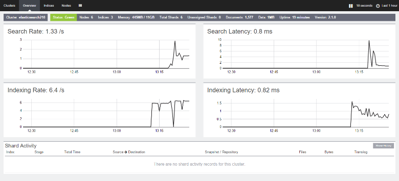

<properties
   pageTitle="La creazione di un ambiente di testing per Elasticsearch | Microsoft Azure"
   description="Informazioni su come configurare un ambiente di testing le prestazioni di un cluster di Elasticsearch."
   services=""
   documentationCenter="na"
   authors="dragon119"
   manager="bennage"
   editor=""
   tags=""/>

<tags
   ms.service="guidance"
   ms.devlang="na"
   ms.topic="article"
   ms.tgt_pltfrm="na"
   ms.workload="na"
   ms.date="09/22/2016"
   ms.author="masashin"/>
   
# <a name="creating-a-performance-testing-environment-for-elasticsearch-on-azure"></a>La creazione di un ambiente di testing per Elasticsearch su Azure

[AZURE.INCLUDE [pnp-header](../../includes/guidance-pnp-header-include.md)]

In questo articolo fa [parte di una serie](guidance-elasticsearch.md). 

Questo documento descrive come configurare un ambiente di testing le prestazioni di un cluster di Elasticsearch. Questa configurazione è stata utilizzata per testare le prestazioni dei dati acquisizione e query carichi di lavoro, come descritto nelle [prestazioni di acquisizione di dati di regolazione per Elasticsearch in Azure][].

Il processo di verifica delle prestazioni utilizzato [Apache JMeter](http://jmeter.apache.org/), con il [set standard](http://jmeter-plugins.org/wiki/StandardSet/) del plug-in installato in una configurazione principale/secondario utilizzando un insieme di macchine virtuali dedicate (non è incluso il cluster Elasticsearch) configurato per lo scopo. 

[Agente di Server PerfMon](http://jmeter-plugins.org/wiki/PerfMonAgent/) è stato installato in ogni nodo Elasticsearch. Nelle sezioni seguenti sono le istruzioni per ricreare l'ambiente di testing che consentono di svolgere il propria test delle prestazioni con JMeter. Queste istruzioni presuppongono che già stato creato un cluster di Elasticsearch con nodi connessi tramite una rete virtuale Azure. 

Si noti che l'ambiente di testing viene eseguita anche come un set di macchine virtuali di Azure gestito con un gruppo di risorse Azure singola.

[Marvel](https://www.elastic.co/products/marvel) inoltre è stato installato e configurato per abilitare gli aspetti interni del cluster Elasticsearch monitorare e analizzare più facilmente. Se le statistiche JMeter una punta o ventre prestazioni, informazioni disponibili tramite Marvel possono essere estremamente utile per determinare la causa delle fluttuazioni.

Nella figura seguente è illustrata la struttura dell'intero sistema. 


Noti quanto segue:

- Lo schema JMeter macchine Virtuali esegue Windows Server per fornire l'ambiente di interfaccia utente della console JMeter. VM JMeter schema fornisce l'interfaccia grafica (applicazione *jmeter* ) per abilitare un tester creare test, eseguire i test e visualizzare i risultati. Questa macchina virtuale coordinate con il server JMeter macchine virtuali che in realtà inviare richieste che costituiscono il test.

- Macchine virtuali subordinate JMeter eseguono Ubuntu Server (Linux), non è necessario grafica per queste macchine virtuali. Il server JMeter macchine virtuali eseguire il software di server JMeter (applicazione *jmeter server* ) per inviare richieste al cluster Elasticsearch.

- I nodi di client dedicato non sono stati utilizzati, anche se sono stati dedicati nodi master.

- Il numero dei nodi di dati del cluster può variare a seconda di scenario da testare.

- Tutti i nodi cluster Elasticsearch eseguire Marvel per osservare le prestazioni in fase di esecuzione e l'agente JMeter per la raccolta di dati di monitoraggio per analisi successive.

- Quando si verifica Elasticsearch 2.0.0 e versioni successive, uno dei nodi di dati viene eseguita anche Kibana. Si tratta necessari per la versione di Marvel che viene eseguita nel Elasticsearch 2.0.0 e versioni successive.

## <a name="creating-an-azure-resource-group-for-the-virtual-machines"></a>Creazione di un gruppo di risorse Azure per macchine virtuali

Lo schema JMeter deve essere in grado di connettersi direttamente a ognuno dei nodi del cluster Elasticsearch per raccogliere dati sulle prestazioni. Se non è distinto dal cluster Elasticsearch VNet JMeter VNet, questo comporta la configurazione di ogni nodo Elasticsearch con un indirizzo IP pubblico. Se un problema con la configurazione di Elasticsearch e quindi si consiglia di implementare macchine virtuali JMeter nella stessa VNet come cluster Elasticsearch utilizzando stesso gruppo di risorse, nel qual caso è possibile omettere questa procedura prima.

Prima di tutto, [creare un gruppo di risorse](../resource-group-template-deploy-portal.md). In questo documento si presuppone che il gruppo di risorse è denominato *JMeterPerformanceTest*. Se si desidera eseguire macchine virtuali JMeter in VNet stesso come cluster Elasticsearch, utilizzare lo stesso gruppo di risorse come tale cluster invece di crearne uno nuovo.

## <a name="creating-the-jmeter-master-virtual-machine"></a>Creazione della macchina virtuale master JMeter

Successiva [creazione di una macchina virtuale di Windows](../virtual-machines/virtual-machines-windows-hero-tutorial.md) tramite l'immagine di *Windows Server 2008 R2 SP1* .  È consigliabile selezionare una dimensione di memoria virtuale con sufficiente core e memoria per eseguire il test. Ideale trattarsi di un computer con almeno 2 core e 3,5 GB di RAM (A2 Standard o più grande).

<!-- TODO add info on why disabling diagnostics is positive --> 

È consigliabile disattivare la diagnostica. Quando si crea la macchina virtuale nel portale, a tale scopo in e *l'Impostazioni* nella sezione *monitoraggio* in *diagnostica*. Lasciare le altre impostazioni valori predefiniti.

Verificare che la macchina virtuale e tutte le risorse associate sono state create, [esaminare il gruppo di risorse](../azure-portal/resource-group-portal.md#manage-resource-groups) nel portale. Le risorse elencate devono essere costituito da una macchina virtuale, un gruppo di sicurezza di rete e un indirizzo IP pubblico tutti con lo stesso nome e account interfaccia e dallo spazio di archiviazione di rete con nomi in base a cui la macchina virtuale.

## <a name="creating-the-jmeter-subordinate-virtual-machines"></a>Creazione di macchine virtuali subordinate JMeter

[Creare una macchina virtuale Linux](../virtual-machines/virtual-machines-linux-quick-create-portal.md) utilizzando l'immagine *Ubuntu Server 14.04 risultati* .  Come con macchine Virtuali a master JMeter selezionare una dimensione macchine Virtuali con sufficiente core e memoria per eseguire il test. Ideale trattarsi di un computer con almeno 2 core e almeno 3,5 GB di RAM (A2 Standard o più grande).

Nuovo, è consigliabile disattivare la diagnostica.

È possibile creare tanti macchine virtuali subordinate nel modo desiderato. 

## <a name="installing-jmeter-server-on-the-jmeter-subordinate-vms"></a>Installazione di JMeter server in macchine virtuali subordinate JMeter

Macchine virtuali subordinate JMeter sono in esecuzione Linux e per impostazione predefinita non è possibile connettersi a tali aprendo una connessione desktop remoto (RDP). Se, tuttavia, è possibile [utilizzare PuTTY per aprire una finestra della riga di comando](../virtual-machines/virtual-machines-linux-mac-create-ssh-keys.md) in ogni macchina virtuale.

Dopo aver connesso a una delle macchine virtuali subordinate, si userà Bash installare JMeter.

Prima di tutto, installa l'ambiente di Runtime del linguaggio necessari per eseguire JMeter.

```bash
sudo add-apt-repository ppa:webupd8team/java
sudo apt-get update
sudo apt-get install oracle-java8-installer
```

A questo punto, scaricare il software JMeter compresso come un file zip.

```bash
wget http://apache.mirror.anlx.net/jmeter/binaries/apache-jmeter-2.13.zip
```

Installare il comando unzip, quindi utilizzare per espandere il software JMeter. Il software viene copiato in una cartella denominata **2.13 di jmeter apache**.

```bash
sudo apt-get install unzip
unzip apache-jmeter-2.13.zip
```

Passare alla directory *bin* tenendo eseguibili JMeter e apportare le applicazioni *server jmeter* e *jmeter* eseguibile.

```bash
cd apache-jmeter-2.13/bin
chmod u+x jmeter-server
chmod u+x jmeter
```

A questo punto, è necessario modificare il file `jmeter.properties` si trova nella cartella corrente (utilizzare l'editor di testo si è più comuni, ad esempio *vi* o *vim*). Individuare le righe seguenti:

```yaml
...
client.rmi.localport=0
...
server.rmi.localport=4000
...
```

Rimuovere il commento (rimuovere l'interlinea \#caratteri #) e modificare le righe, come illustrato di seguito, quindi salvare il file e chiudere l'editor:

```yaml
...
client.rmi.localport=4441
...
server.rmi.localport=4440
```

A questo punto, eseguire i comandi seguenti per aprire la porta 4441 per il traffico TCP in ingresso (questa è la porta *server jmeter* per ascolto appena è stato configurato):

```bash
sudo iptables -A INPUT -m state --state NEW -m tcp -p tcp --dport 4441 -j ACCEPT
```

Scaricare il file zip contenente l'insieme standard di plug-in per JMeter (questi plug-in di fornire contatori monitoraggio delle prestazioni) e quindi decomprimere il file nella cartella **2.13 di jmeter apache** . Decomprimere il file nel percorso seguente inserisce i plug-nella cartella corretta.

Se viene richiesto di sostituire il file di licenza, digitare risposte (per tutti):

```bash
wget http://jmeter-plugins.org/downloads/file/JMeterPlugins-Standard-1.3.0.zip
unzip JMeterPlugins-Standard-1.3.0.zip
```

Usare `nohup` per avviare il server JMeter in background. Devono rispondere visualizzando un ID di processo e un messaggio che indica che ha creato un oggetto remoto e che sia pronto per avviare la ricezione di comandi.  Eseguire il comando seguente nella directory ~/apache-jmeter-2.13/bin. 

```bash
nohup jmeter-server &
```

> [AZURE.NOTE]Se la macchina virtuale arresto il programma di server JMeter è terminato. È necessario connettere la macchina virtuale e riavviare nuovamente manualmente. In alternativa, è possibile configurare il sistema per eseguire il comando *jmeter server* automaticamente all'avvio mediante l'aggiunta di comandi seguenti per la `/etc/rc.local` file (prima il comando *uscire da 0* ):

```bash
sudo -u <username> bash << eoc
cd /home/<username>/apache-jmeter-2.13/bin
nohup ./jmeter-server &
eoc
```

Sostituire `<username>` con il nome di accesso.

Può risultare utile tenere aperta la finestra terminal in modo che è possibile monitorare l'avanzamento del server JMeter durante l'esecuzione di test.

Sarà necessario ripetere questi passaggi per ogni macchina virtuale subordinata a JMeter.

## <a name="installing-the-jmeter-server-agent-on-the-elasticsearch-nodes"></a>Installare l'agente JMeter sui nodi Elasticsearch

Questa procedura si presuppone l'accesso a nodi Elasticsearch. Se è stato creato il cluster utilizzando il modello di Manager delle risorse, è possibile connettersi a ogni nodo tramite la casella ponticello macchine Virtuali, come illustrato nella sezione topologia Elasticsearch di [Elasticsearch in esecuzione in Azure](guidance-elasticsearch-running-on-azure.md). È possibile connettersi alla casella ponticello anche mediante PuTTY. 

A questo punto, è possibile utilizzare il comando *ssh* agli utenti di accedere a tutti i nodi cluster Elasticsearch.

Accedere a uno dei nodi Elasticsearch come amministratore.  Al prompt dei comandi Bash immettere i comandi seguenti per creare una cartella per l'esenzione l'agente JMeter e passare alla cartella:

```bash
mkdir server-agent
cd server-agent
```

Eseguire i comandi seguenti per installare il comando *decomprimere* (se non è già installato), scaricare il software dell'agente Server JMeter e decomprimere:

```bash
sudo apt-get install unzip
wget http://jmeter-plugins.org/downloads/file/ServerAgent-2.2.1.zip
unzip ServerAgent-2.2.1.zip
```
 
Eseguire il comando seguente per configurare il firewall e consentire il traffico TCP pass-through porta 4444 (questa è la porta utilizzata da agente Server JMeter):

```bash
sudo iptables -A INPUT -m state --state NEW -m tcp -p tcp --dport 4444 -j ACCEPT
```

Eseguire il seguente comando per avviare l'agente JMeter in background:

```bash
nohup ./startAgent.sh &
```

L'agente JMeter dovrebbe rispondere con i messaggi che indica che è avviato e ascolto sulla porta 4444.  Premere INVIO per ottenere un prompt dei comandi e quindi eseguire il comando seguente.

```bash
telnet <nodename> 4444
```

Sostituire `<nodename>` con il nome del nodo. (È possibile trovare il nome del nodo eseguendo la `hostname` comando.) Questo comando consente di aprire una connessione telnet alla porta 4444 sul computer locale. È possibile usare la connessione per verificare che l'agente di Server JMeter viene eseguito correttamente.

Se l'agente JMeter non è in esecuzione, si riceverà la risposta 

`*telnet: Unable to connect to remote host: Connection refused*.`

Se l'agente JMeter è in esecuzione e porta 4444 è stata configurata correttamente, è necessario verificare la risposta seguente:


> [AZURE.NOTE] La sessione telnet non ha alcun tipo di richiesta dopo che è connesso.

Nella sessione telnet digitare il comando seguente:

``` 
test
```

Se l'agente JMeter è configurato correttamente in attesa, devono essere indicare ha ricevuto il comando e rispondere al messaggio *Yep*.

> [AZURE.NOTE]È possibile digitare in altri comandi per ottenere prestazioni il monitoraggio dei dati. Ad esempio, il comando `metric-single:cpu:idle` otterranno la percentuale corrente di tempo che la CPU è inattiva (si tratta di uno snapshot). Per un elenco completo di comandi, visitare la pagina [Agente Server PerfMon](http://jmeter-plugins.org/wiki/PerfMonAgent/) . : Al chiamarlo il Perfmon Server agente. >>

Nella sessione telnet digitare il seguente comando per chiudere la sessione e tornare al prompt dei comandi Bash:

``` 
exit
```

> [AZURE.NOTE]Come con il JMeter subordinata macchine virtuali, se si disconnette o se il computer viene arrestato e riavvia l'agente JMeter sarà necessario essere riavviato manualmente utilizzando il `startAgent.sh` comando. Se si desidera l'agente JMeter per l'avvio automatico, aggiungere il comando seguente alla fine della `/etc/rc.local` file prima del comando *uscire da 0* . 
> Sostituire `<username>` con il nome di accesso:

```bash
sudo -u <username> bash << eoc
cd /home/<username>/server-agent
nohup ./startAgent.sh &
eoc
```

Ora possono essere ripetere questa procedura intera per ogni altro nodo del cluster Elasticsearch oppure è possibile utilizzare il `scp` comando per copiare la cartella agente di server e il contenuto in ogni altro nodo e utilizzare la `ssh` comando avviare l'agente JMeter come illustrato di seguito. e sostituisci `<username>` con il proprio nome utente e `<nodename>` con il nome del nodo in cui si desidera copiare ed eseguire il software (verrà chiesto di immettere la password durante l'esecuzione di ogni comando):

```bash
scp -r \~/server-agent <username>@<nodename>:\~
ssh <nodename> sudo iptables -A INPUT -m state --state NEW -m tcp -p tcp --dport 4444 -j ACCEPT
ssh <nodename> -n -f 'nohup \~/server-agent/startAgent.sh'
```

## <a name="installing-and-configuring-jmeter-on-the-jmeter-master-vm"></a>Installare e configurare JMeter su macchina virtuale master JMeter

Nel portale di Azure, fare clic su **gruppi di risorse**. Selezionare il gruppo di risorse contenente lo schema di JMeter e macchine virtuali subordinate e il **gruppi di risorse** .  In e il **gruppo di risorse** , fare clic su **macchine Virtuali master JMeter**. In e il computer virtuale, sulla barra degli strumenti, fare clic su **Connetti**. Aprire il file RDP quando richiesto dal browser. Viene creata una connessione desktop remoto per la macchina virtuale.  Immettere il nome utente e la password per la macchina virtuale quando richiesto.

In macchine Virtuali, tramite Internet Explorer, passare alla pagina di [Download Java per Windows](http://www.java.com/en/download/ie_manual.jsp) . Seguire le istruzioni per scaricare ed eseguire il programma di installazione di linguaggio.

Nel web browser passare alla pagina di [Download JMeter Apache](http://jmeter.apache.org/download_jmeter.cgi) e scaricare il file zip contenente i dati binari più recenti. Salvare il file zip nella posizione desiderata nella macchina virtuale.

Passare al sito [Plug-in JMeter personalizzata](http://jmeter-plugins.org/) e scaricare l'insieme Standard di plug-in. Salvare il file zip nella stessa cartella download JMeter ottenuto nel passaggio precedente.

In Esplora risorse, passare alla cartella contenente il apache-jmeter -*xxx* file zip, dove *xxx* è la versione corrente del JMeter. Estrarre i file nella cartella corrente.

Estrarre i file di JMeterPlugins-Standard -*yyy*file ZIP, dove *yyy* è la versione corrente del plug-in, nell'apache-jmeter*xxx* cartella. I plug-in verrà aggiunto alla cartella corretta per JMeter. In modo sicuro è possibile unire le cartelle della raccolta e sovrascrivere i file di licenza e il file Leggimi, se richiesto.

Passare a di apache-jmeter -*xxx*cartella Bin della cartella e modifica di jmeter.properties file mediante il blocco note.  Nel `jmeter.properties` file, individuare la sezione etichettata *host remoti e configurazione RMI*.  In questa sezione del file, individuare la riga seguente:

```yaml
remote_hosts=127.0.0.1
```

Modificare la riga e sostituire l'elenco di indirizzi 127.0.0.1 con un punto e virgola separati IP di indirizzi IP o nomi di host per ognuno dei server subordinati JMeter. Per esempio:

```yaml
remote_hosts=JMeterSub1,JMeterSub2
```

Trovare la riga seguente e quindi rimuovere il `#` carattere all'inizio della riga corrente e modificare il valore delle impostazioni di client.rmi.localport di:

```yaml
#client.rmi.localport=0
```

A:

```yaml
client.rmi.localport=4440
```

Salvare il file e chiudere il blocco note. 

Sulla barra degli strumenti di Windows, fare clic su **Start**, fare clic su **Strumenti di amministrazione**e quindi fare clic su **Windows Firewall con sicurezza avanzata**.  Nella finestra Windows Firewall con sicurezza avanzata, nel riquadro sinistro, destro **Regole in entrata**e quindi fare clic su **Nuova regola**.

**In ingresso Creazione guidata nuova regola**, nella pagina **Tipo di regola** selezionare **porta**e quindi fare clic su **Avanti**.  Nella pagina porte e protocolli selezionare **TCP**, selezionare **porte locali specifiche**, nella casella di testo digitare `4440-4444`e quindi fare clic su **Avanti**.  Nella pagina di azione, selezionare **Consenti la connessione**e quindi fare clic su **Avanti**. Nella pagina del profilo, lasciare tutte le opzioni selezionate e quindi fare clic su **Avanti**.  Nella pagina nome in **nome** casella di testo digitare *JMeter*e quindi fare clic su **Fine**.  Chiudere la finestra Windows Firewall con sicurezza avanzata.

In Esplora risorse, il apache-jmeter - cartella*xx*bin della cartella, fare doppio clic sul file di batch *jmeter* Windows per avviare l'interfaccia grafica. L'interfaccia utente deve essere visualizzato:


Nella barra dei menu fare clic su **Esegui**, fare clic su **Start remoto**e verificare che siano elencati i due computer subordinate JMeter:


A questo punto si è pronti iniziare la verifica delle prestazioni.

## <a name="installing-and-configuring-marvel"></a>Installazione e configurazione di Marvel

Il modello di Guida introduttiva Elasticsearch per Azure verrà installato e configurato automaticamente la versione appropriata di Marvel se si impostano i parametri MARVEL e KIBANA su true ("Sì") quando creare il cluster:


Se si sta aggiungendo Marvel a un cluster esistente, è necessario eseguire manualmente l'installazione e la procedura è diversa a seconda che si utilizzi Elasticsearch versione 1.7 o 2. x, come descritto nelle procedure riportate di seguito.

### <a name="installing-marvel-with-elasticsearch-173-or-earlier"></a>L'installazione di Marvel con zoom da 1,73 Elasticsearch o versioni precedenti

Se si utilizza Elasticsearch 1.7.3 o versioni precedenti, eseguire la seguente procedura *su ogni nodo* del cluster:

- Accedere al livello di nodo e passare alla home directory Elasticsearch.  Su Linux, tipica home directory è `/usr/share/elasticsearch`.

-  Eseguire il seguente comando per scaricare e installare il plug-in Marvel per Elasticsearch:

```bash
sudo bin/plugin -i elasticsearch/marvel/latest
```

- Arrestare e riavviare Elasticsearch sul nodo:

```bash
sudo service elasticsearch restart
```

- Per verificare che Marvel è stato installato correttamente, aprire un web browser e passare all'URL `http://<server>:9200/_plugin/marvel`. Sostituire `<server>` con il nome o indirizzo IP del server Elasticsearch del cluster.  Verificare che venga visualizzata una pagina simile a quello riportato di seguito:


### <a name="installing-marvel-with-elasticsearch-200-or-later"></a>Installazione di Marvel con Elasticsearch 2.0.0 o versioni successive

Se si utilizza Elasticsearch 2.0.0 o in un secondo momento, eseguire le seguenti attività *in ogni nodo* del cluster:

Accedere al livello di nodo e passare alla home directory Elasticsearch (in genere `/usr/share/elasticsearch`) eseguire i comandi seguenti per scaricare e installare il plug-in Marvel per Elasticsearch:

```bash
sudo bin/plugin install license
sudo bin/plugin install marvel-agent
```

Arrestare e riavviare Elasticsearch sul nodo:

```bash
sudo service elasticsearch restart
```

Nella procedura seguente, sostituire `<kibana-version>` con 4.2.2 se si utilizza Elasticsearch 2.0.0 o Elasticsearch 2.0.1 o con 4.3.1 se si utilizza Elasticsearch 2.1.0 o versione successiva.  Sostituire `<marvel-version>` con 2.0.0 se si utilizza Elasticsearch 2.0.0 o Elasticsearch 2.0.1 o con 2.1.0 se si utilizza Elasticsearch 2.1.0 o versione successiva.  Eseguire le seguenti attività *su un nodo* del cluster:

Accedere al livello di nodo e scaricare la compilazione di Kibana appropriata per la versione di Elasticsearch dal [sito web per il download Elasticsearch](https://www.elastic.co/downloads/past-releases), quindi estrarre il pacchetto:

```bash
wget https://download.elastic.co/kibana/kibana/kibana-<kibana-version>-linux-x64.tar.gz
tar xvzf kibana-<kibana-version>-linux-x64.tar.gz
```

Aprire la porta 5601 per accettare le richieste in arrivo:

```bash
sudo iptables -A INPUT -m state --state NEW -m tcp -p tcp --dport 5601 -j ACCEPT
```

Passare alla cartella di configurazione Kibana (`kibana-<kibana-version>-linux-x64/config`), modificare il `kibana.yml` file e aggiungere la riga seguente. Sostituire `<server>` con il nome o indirizzo IP del server Elasticsearch del cluster:

```yaml
elasticsearch.url: "http://<server>:9200"
```

Passare alla cartella bin Kibana (`kibana-<kibana-version>-linux-x64/bin`), ed eseguire il seguente comando per integrare il plug-in Marvel Kibana:

```bash
sudo ./kibana plugin --install elasticsearch/marvel/<marvel-version>
```

Avviare Kibana:

```bash
sudo nohup ./kibana &
```

Per verificare l'installazione di Marvel, aprire un web browser e passare all'URL `http://<server>:5601/app/marvel`. Sostituire `<server>` con il nome o indirizzo IP del server che esegue Kibana.

Verificare che venga visualizzata una pagina simile a quello riportato di seguito (il nome del cluster sarà diversi rispetto a quello illustrato nell'immagine).


Fare clic sul collegamento corrispondente al cluster (elasticsearch210 nell'immagine precedente). Dovrebbero essere visualizzate una pagina simile a quello riportato di seguito:




[Ottimizzazione delle prestazioni di acquisizione di dati per Elasticsearch su Azure]: guidance-elasticsearch-tuning-data-ingestion-performance.md  