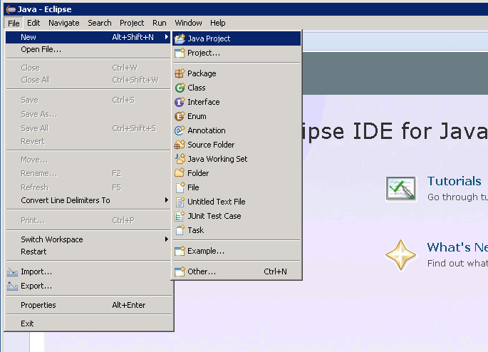
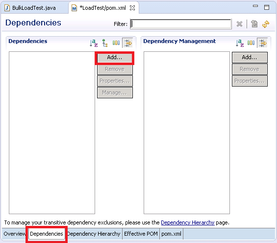
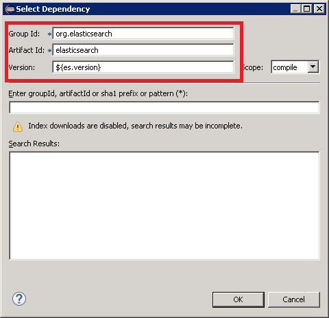

<properties
   pageTitle="Distribuzione di una prova di JMeter JUnit per il test delle prestazioni Elasticsearch | Microsoft Azure"
   description="Informazioni su come usare una prova di JUnit per generare e caricare dati in un cluster di Elasticsearch."
   services=""
   documentationCenter="na"
   authors="dragon119"
   manager="bennage"
   editor=""
   tags=""/>

<tags
   ms.service="guidance"
   ms.devlang="na"
   ms.topic="article"
   ms.tgt_pltfrm="na"
   ms.workload="na"
   ms.date="09/22/2016"
   ms.author="masashin"/>
   
# Distribuzione di una prova di JMeter JUnit per il test delle prestazioni Elasticsearch

[AZURE.INCLUDE [pnp-header](../../includes/guidance-pnp-header-include.md)]

In questo articolo fa [parte di una serie](guidance-elasticsearch.md). 

In questo documento viene illustrato come creare e utilizzare una prova di JUnit che può generare e caricare i dati in un cluster di Elasticsearch come parte di un piano di test JMeter. Questo approccio fornisce un approccio per caricare il test altamente flessibile che consente di generare grandi quantità di dati di test senza a seconda di file di dati esterni.

> [AZURE.NOTE] Il test di carico utilizzato per valutare le prestazioni di acquisizione di dati descritti [ottimizzazione](guidance-elasticsearch-tuning-data-ingestion-performance.md) delle prestazioni di acquisizione dei dati per Elasticsearch sono state create utilizzando questo approccio. I dettagli del codice JUnit sono descritti nel documento.

Per test le prestazioni di acquisizione di dati, il codice JUnit era sviluppare tramite Eclisse (Mars) e le dipendenze sono stati risolti utilizzando Maven. Le procedure seguenti descrivono il processo passo dopo passo per l'installazione di Eclisse, configurare Maven, creazione di un test JUnit e distribuzione di questo test come una prova JUnit richiesta di un test JMeter.

> [AZURE.NOTE] Per informazioni dettagliate sulla struttura e la configurazione dell'ambiente di testing, vedere [creazione di un ambiente di testing delle prestazioni per Elasticsearch in Azure][].

## Prerequisiti di installazione

È necessario l' [Ambiente Runtime Java](http://www.java.com/en/download/ie_manual.jsp) nel computer di sviluppo.
Inoltre, è necessario installare [Eclipse IDE per sviluppatori Java](https://www.eclipse.org/downloads/index.php?show_instructions=TRUE).

> [AZURE.NOTE] Se si utilizza la macchina virtuale master a JMeter descritta in [creazione di un ambiente di testing delle prestazioni per Elasticsearch su Azure][] come ambiente di sviluppo, scaricare la versione di Windows a 32 Bit del programma di installazione Eclisse.

## Creazione di un progetto di test JUnit per Elasticsearch di test

Avviare Eclipse IDE se non è già in esecuzione e quindi chiudere la pagina di **benvenuto** .  Nel menu **File** fare clic su e quindi fare clic su **Progetto Java**.

Nella finestra **Nuovo progetto di linguaggio** , immettere il nome del progetto, selezionare **Usa predefinito JRE**e quindi fare clic su **Fine**.

Nella finestra **Esplora pacchetti** espandere il nodo denominato dopo il progetto. Verificare che siano presenti una cartella denominata **src** e un riferimento a JRE specificato.

Pulsante destro del mouse sulla cartella **src** , fare clic su **Nuovo**e quindi fare clic su **JUnit Test Case**.

Nella finestra **Nuovo JUnit Test Case** , selezionare **nuovo 4 Junit test**, immettere un nome per il pacchetto (questa operazione può essere uguale al nome del progetto, anche se per convenzione dovrebbe iniziare con la lettera minuscola), un nome per la classe di test e selezionare le opzioni che generano il stub necessari per il test. Lasciare vuota la casella di **classe da testare** e quindi fare clic su **Fine**.

Se viene visualizzata la finestra di dialogo **Nuovo JUnit Test Case** seguente, selezionare l'opzione per aggiungere la raccolta di 4 JUnit al percorso di compilazione e quindi fare clic su **OK**. 

Verificare che la struttura del codice per il test JUnit viene generato e visualizzato nella finestra dell'editor di linguaggio.

In **Esplora pacchetti**destro il nodo del progetto, fare clic su **Configura**e quindi fare clic su **Converti Maven progetto**.

> [AZURE.NOTE]Uso consente di Maven di gestire facilmente le relazioni esterne (ad esempio le raccolte di client Elasticsearch Java) un progetto dipende.

Nella finestra di dialogo **Crea nuovo POM** , nell'elenco a discesa **imballaggio** selezionare **vaso**e quindi fare clic su **Fine**.

Riquadro che viene visualizzata sotto l'editor di modello (POM) oggetto progetto potrebbe essere visualizzato l'avviso "percorso di compilazione specifica ambiente di esecuzione J2SE 1.5. Non sono JREs installato nell'area di lavoro strettamente compatibili con questo ambiente", a seconda della versione di Java è installato nel computer di sviluppo. Se si dispone di una versione di linguaggio successiva alla versione 1.5 è possibile ignorare l'avviso.

Nell'editor POM espandere **proprietà** e quindi fare clic su **Crea**.

Nella finestra di dialogo **Aggiungi proprietà** nella casella **nome** digitare *es.version*, nella casella **valore** digitare *1.7.2*e quindi fare clic su **OK**. Questa è la versione della libreria di client Elasticsearch Java usare (questa versione può essere annullata in futuro, e la definizione della versione come proprietà POM e facendo riferimento a questa proprietà in un' posizione all'interno del progetto consente la versione da modificare in modo rapido)

Fare clic sulla scheda **dipendenze** sulla base dell'editor di POM e quindi fare clic su **Aggiungi** accanto all'elenco **dipendenze** .

Nella finestra di dialogo **Selezionare dipendenza** nella casella **Id di gruppo** digitare *org.elasticsearch*digitare nella casella **Id elemento** *elasticsearch*nella casella digitare **versione** * \${es.version}*e quindi fare clic su **OK**. Informazioni sulla raccolta client Java Elasticsearch viene mantenute nel repository centrale Maven online e questa configurazione verrà scaricata automaticamente la raccolta e le dipendenze quando viene compilato il progetto.

Nel menu **File** , fare clic su **Salva tutto**. Questa azione verrà salvare e compilare il progetto, scaricare le dipendenze specificate secondo Maven. Verificare che la cartella dipendenze Maven viene visualizzata in Esplora pacchetti. Espandere la cartella per visualizzare i file di vaso scaricati per supportare la libreria di client Elasticsearch Java.

## Importare un progetto di test JUnit esistente Eclisse

Questa procedura si presuppone che è stato scaricato un progetto Maven creato in precedenza utilizzando Eclisse.

Avviare Eclipse IDE. Nel menu **File** fare clic su **Importa**.

Nella finestra **Selezionare** espandere la cartella **Maven** , fare clic su **Progetti Maven esistenti**e quindi fare clic su **Avanti**.

Nella finestra **Progetti Maven** specificare la cartella contenente il progetto (la cartella che contiene il file pom.xml), fare clic su **Seleziona tutto**e quindi fare clic su **Fine**.

Nella finestra **Esplora pacchetti** espandere il nodo corrispondente al progetto. Verificare che il progetto contiene una cartella denominata **src**. Questa cartella contiene il codice sorgente per il test JUnit. Il progetto può essere compilato e distribuito seguendo le istruzioni riportate di seguito.

## Distribuzione di un test JUnit JMeter

Questa procedura si presuppone sia creato un progetto denominato test di carico contenente una classe di JUnit Test denominata `BulkLoadTest.java` che accetta parametri di configurazione passati come un'unica stringa a un costruttore (si tratta del meccanismo che prevede JMeter).

Nel **Pacchetto Explorer**dell'IDE Eclisse destro il nodo del progetto e quindi fare clic su **Esporta**.

**Esportazione guidata**, nella pagina **Selezionare** espandere il nodo di **linguaggio** , fare clic su **file JAR**e quindi fare clic su **Avanti**.

Nella pagina **JAR specifica del File** nella casella **Selezionare le risorse da esportare** , espandere il progetto deselezionare **.project**e deselezionare **pom.xml**. Nella casella **file JAR** specificare il nome del file e un percorso per VASO (deve essere assegnata l'estensione jar) e quindi fare clic su **Fine**.

Con Esplora risorse, copiare il file VASO appena creato per JVM master JMeter e salvarlo in apache-jmeter-2.13\\raccolta\\junit cartella sotto la cartella in cui è installato JMeter (vedere la procedura "Creare la macchina virtuale master JMeter" per [la creazione di un ambiente di testing delle prestazioni per Elasticsearch su Azure](guidance-elasticsearch-creating-performance-testing-environment.md) per ulteriori informazioni).

Tornare alla Eclisse, espandere la finestra **Esplora pacchetti** e prendere nota di tutti i file di VASO e le posizioni elencate nella cartella Maven dipendenze del progetto. Si noti che i file visualizzati nell'immagine seguente potrebbero variare, a seconda della Elasticsearch versione in uso:

Con Esplora risorse, copiare ogni file VASO cui viene fatto riferimento nella cartella dipendenze Maven apache-jmeter-2.13\\raccolta\\junit cartella nella macchina virtuale master JMeter.

Se la raccolta\\junit cartella già contiene le versioni precedenti di questi file VASO quindi rimuoverli. Se vengono tenuti in posizione test JUnit potrebbe non funzionare come possibile risolvere il problema JAR i riferimenti.

Nello schema di JMeter macchine Virtuali interrompere JMeter se è in esecuzione.  Avviare JMeter.  In JMeter, destro del mouse sul **Piano di Test**, fare clic su **Aggiungi**e quindi fare clic su **Gruppo di Thread** **thread (utenti)**.

Nodo **Piano di Test** destro del mouse sul **Gruppo di Thread**, fare clic su **Aggiungi**, fare clic su **prova**e quindi fare clic su **JUnit richiesta**.

Nella pagina **JUnit richiesta** , selezionare **Cerca annotazioni JUnit4 (anziché JUnit 3)**. Nell'elenco a discesa **NomeClasse** selezionare la classe di test di carico JUnit (tale sconto sarà elencato nel modulo * &lt;pacchetto&gt;.&lt; classe&gt;*), il **Metodo Test** elenco a discesa selezionare il JUnit metodo test (questo metodo è quello che esegue il lavoro associato al test e deve contrassegnato con il *@test* annotazione nel progetto Eclisse) e immettere i valori da passare al costruttore nella casella **Etichetta stringa costruttore** . I dettagli illustrati nell'immagine seguente sono illustrati esempi soltanto; il **NomeClasse** * *Metodo di Test*e * *Etichetta della stringa costruttore** sarà probabilmente diverso da quelli indicati.

Se la classe non viene visualizzato nell'elenco a discesa **NomeClasse** , probabilmente VASO non è stato esportato correttamente oppure non è stato inserito nella raccolta\\junit cartella o alcuni dei dipendenti JAR mancano la raccolta\\junit cartella. In questo caso, esportare il progetto Eclisse nuovamente e assicurarsi di aver selezionato la risorsa **src** , copiare la raccolta VASO\\junit cartella, quindi verificare che siano copiati tutti i dipendenti vasetti da elencati per Maven nella cartella della raccolta.

Chiudere JMeter. Non è necessario salvare il piano di test.  Copiare il file VASO contenente la classe di test JUnit per il /home/&lt;nome utente&gt;/apache-jmeter-2.13/lib/junit cartella del macchine virtuali subordinate JMeter (*&lt;nome utente&gt; * è il nome dell'utente amministratore è specificato al momento della creazione della macchina virtuale, per ulteriori informazioni, vedere la procedura "Creazione di macchine virtuali subordinate JMeter" per [la creazione di un ambiente di testing delle prestazioni per Elasticsearch in Azure](guidance-elasticsearch-creating-performance-testing-environment.md) .)

Copiare i file VASO dipendenti necessari per la classe di test JUnit per il /home/&lt;nome utente&gt;/apache-jmeter-2.13/lib/junit cartella del macchine virtuali subordinate JMeter. Assicurarsi di rimuovere eventuali versioni precedenti di VASO file dalla cartella prima di tutto.

È possibile utilizzare il `pscp` utilità per copiare i file da un computer Windows in Linux.

[La creazione di un ambiente di Testing per Elasticsearch su Azure]: guidance-elasticsearch-creating-performance-testing-environment.md
