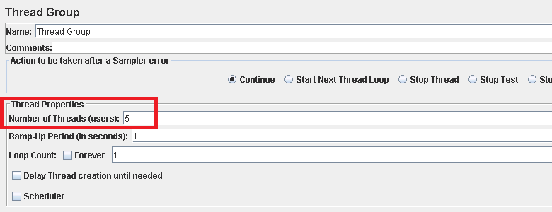

<properties
   pageTitle="Implementazione di un piano di test JMeter per Elasticsearch | Microsoft Azure"
   description="Modalità di esecuzione delle prestazioni di test per Elasticsearch con JMeter."
   services=""
   documentationCenter="na"
   authors="dragon119"
   manager="bennage"
   editor=""
   tags=""/>

<tags
   ms.service="guidance"
   ms.devlang="na"
   ms.topic="article"
   ms.tgt_pltfrm="na"
   ms.workload="na"
   ms.date="09/22/2016"
   ms.author="masashin" />
   
# <a name="implementing-a-jmeter-test-plan-for-elasticsearch"></a>Implementazione di un piano di test JMeter per Elasticsearch

[AZURE.INCLUDE [pnp-header](../../includes/guidance-pnp-header-include.md)]

In questo articolo fa [parte di una serie](guidance-elasticsearch.md). 

I test condotti contro Elasticsearch veniva implementati utilizzando i piani di test JMeter insieme linguaggio codice incorporato come test JUnit per l'esecuzione di attività, ad esempio il caricamento di dati nel cluster. Piani di test e codice JUnit sono descritti in [prestazioni di acquisizione di dati di regolazione per Elasticsearch su Azure][]e [aggregazione di ottimizzazione dei dati e alle prestazioni delle query per Elasticsearch in Azure][].

Lo scopo di questo documento è per riepilogare l'esperienza di chiave ottenute costruzione e rieseguire questi piani di test. La pagina [JMeter procedure consigliate](http://jmeter.apache.org/usermanual/best-practices.html) sul sito Web Apache JMeter contiene più GRG suggerimenti sull'uso di JMeter in modo efficace.

## <a name="implementing-a-jmeter-test-plan"></a>Implementazione di un piano di test JMeter

L'elenco seguente vengono riepilogati gli elementi da valutare durante la creazione di un piano di test JMeter:

- Creare un gruppo di thread separato per ogni test che si desidera eseguire. Un test può contenere più passaggi, inclusi logica controller, timer, pre- e post-processori, insiemi di prova e listener.

- Evitare di creare troppi thread in un gruppo di thread. Un numero eccessivo di thread impedirà JMeter di non riuscire con "Memoria esaurita" eccezioni. È consigliabile aggiungere ulteriori server subordinati JMeter ogni esecuzione di un numero minore di thread superiore a quello tenta di eseguire un numero elevato di thread in un unico server JMeter.



- Per valutare le prestazioni del cluster, incorporare il plug-in [Perfmon metriche Raccoglitore](http://jmeter-plugins.org/wiki/PerfMon/) il piano di test. Verrà visualizzata una comunicare ascoltatore JMeter che è disponibile in uno dei plug-in di JMeter standard. Salvare i dati sulle prestazioni non elaborati in una serie di file in formato con valori delimitati da virgole (CSV) ed elaborazione di una volta completato il test. Si tratta più efficiente e impone minore affaticamento visivo in JMeter rispetto durante l'elaborazione dei dati man mano che acquisito. 


È possibile usare uno strumento come Excel per importare i dati e genera un intervallo di grafici scopi analitici.

Valutare la possibilità di raccogliere tutte le informazioni seguenti:

- Utilizzo della CPU per ogni nodo cluster Elasticsearch.

- Il numero di byte letti al secondo dal disco per tutti i nodi.

- Se possibile, la percentuale di CPU tempo trascorso in attesa per i/o da eseguire in ogni nodo. Questa operazione non è sempre possibile per macchine virtuali di Windows, ma per Linux è possibile creare una metrica personalizzata (un EXEC unità di misura metriche) che viene eseguito il seguente comando shell per richiamare *vmstat* su un nodo:

```Shell
sh:-c:vmstat 1 5 | awk 'BEGIN { line=0;total=0;}{line=line+1;if(line&gt;1){total=total+\$16;}}END{print total/4}'
```

Campo 16 nell'output di *vmstat* contiene il CPU tempo di attesa per i/o. Per ulteriori informazioni sul funzionamento di questa istruzione, vedere il [comando vmstat](http://linuxcommand.org/man_pages/vmstat8.html).

- Il numero di byte inviati e ricevuti in rete a ogni nodo.

- Consente di registrare le prestazioni e la frequenza di esecuzione delle operazioni e non riuscite listener rapporto di aggregazione separati. Acquisire dati esito positivo o negativo a vari file.


- Mantenere ogni test case JMeter costituiti semplicemente da possibili consentire di correlare direttamente le prestazioni con le azioni di test specifico. Per i test case che richiedono logica complessa, valutare la possibilità di incapsulare questa logica di un test JUnit e in prove richiesta JUnit JMeter consente di eseguire il test.

- Consente di eseguire operazioni HTTP, ad esempio GET, POST, inserire o eliminare prove richiesta HTTP. Ad esempio, è possibile eseguire ricerche Elasticsearch mediante l'utilizzo di una query POST e i dettagli della query nella casella *Corpo dati* :


- Per semplificare la ripetibilità e riutilizzo, i parametri per testare i piani di test JMeter. È quindi possibile utilizzare gli script per automatizzare l'esecuzione dei piani di test.

## <a name="implementing-a-junit-test"></a>L'implementazione di un test JUnit

È possibile incorporare codice complesso in un piano di test JMeter mediante la creazione di uno o più test JUnit. È possibile scrivere un test JUnit utilizzando un ambiente di sviluppo integrato (IDE) di linguaggio, ad esempio Eclisse. [Distribuzione di una prova di JMeter JUnit per la verifica delle prestazioni Elasticsearch][] fornisce informazioni su come configurare un ambiente di sviluppo appropriato.

L'elenco seguente vengono riepilogate le procedure consigliate che è necessario seguire quando si scrive il codice per un test JUnit:

- Utilizzare il costruttore di classe di test per passare i parametri di inizializzazione nel test. JMeter possibile utilizzare un costruttore che accetta un solo argomento stringa. Nel costruttore, analizzare questo argomento nei relativi elementi singoli, come illustrato nell'esempio seguente:

```Java
private String hostName = "";
private String indexName = "";
private String typeName = "";
private int port = 0;
private String clusterName = "";
private int itemsPerBatch = 0;

/\* JUnit test class constructor \*/
public ElasticsearchLoadTest2(String params) {
    /* params is a string containing a set of comma separated values for:
        hostName
        indexName
        typeName
        port
        clustername
        itemsPerBatch
    */

    /* Parse the parameter string into an array of string items */
    String delims = "\[ \]\*,\[ \]\*"; // comma surrounded by zero or more spaces
    String\[\] items = params.split(delims);

    /* Note: Parameter validation code omitted */

    /* Use the parameters to populate variables used by the test */
    hostName = items[0];
    indexName = items[1];
    typeName = items[2];
    port = Integer.parseInt(items[3]);
    clusterName = items[4];
    itemsPerBatch = Integer.parseInt(items[5]);

    if(itemsPerBatch == 0)
        itemsPerBatch = 1000;
}
```

- Evitare di operazioni i/o o altre operazioni lunga e laboriosa nel costruttore o classe di test di installazione, poiché vengono eseguite ogni volta che viene eseguito il test JUnit. (Lo stesso test JUnit possa eseguire migliaia di volte per ogni test eseguiti dal JMeter).

- È preferibile iniziali di configurazione per l'inizializzazione costosa maiuscole/minuscole test.

- Se il test richiede un numero elevato di parametri di input, passare il percorso del file al costruttore memorizzare le informazioni sulla configurazione di test in un file di configurazione separato.

- Evitare di codifica percorsi dei file nel codice del test carico. Questi può provocare errori a causa di differenze tra i sistemi operativi, ad esempio Windows e Linux.

- Utilizzare asserzioni per indicare gli errori di JUnit metodi di test in modo che è possibile tenerne traccia con JMeter e usarli come una metriche aziendali. Se possibile, il passaggio delle informazioni relative a causa dell'errore, come illustrato grassetto nell'esempio seguente:

```Java
@Test
public void bulkInsertTest() throws IOException {
    ...
    BulkResponse bulkResponse = bulkRequest.execute().actionGet();
    assertFalse(
        bulkResponse.buildFailureMessage(), bulkResponse.hasFailures());
        ...
}
```


[Running Elasticsearch on Azure]: guidance-elasticsearch-running-on-azure.md
[Ottimizzazione delle prestazioni di acquisizione di dati per Elasticsearch su Azure]: guidance-elasticsearch-tuning-data-ingestion-performance.md
[Distribuzione di una prova di JMeter JUnit per il test delle prestazioni Elasticsearch]: guidance-elasticsearch-deploying-jmeter-junit-sampler.md
[Ottimizzazione aggregazione dei dati e alle prestazioni delle Query per Elasticsearch su Azure]: guidance-elasticsearch-tuning-data-aggregation-and-query-performance.md
