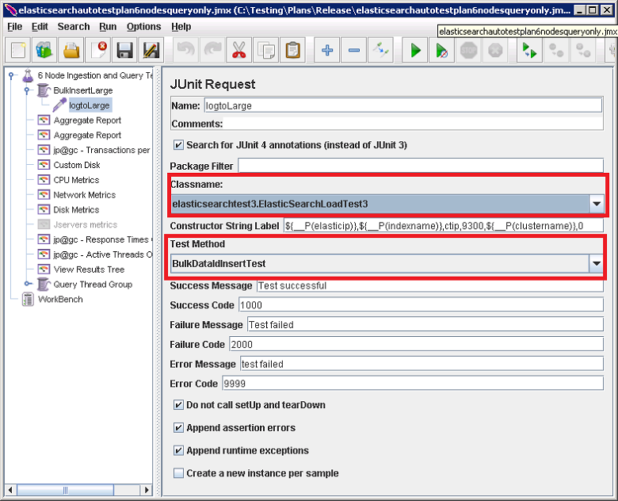

<properties
   pageTitle="Esecuzione di test di prestazioni Elasticsearch automatizzati | Microsoft Azure"
   description="Descrizione di come è possibile eseguire il test nel proprio ambiente."
   services=""
   documentationCenter="na"
   authors="dragon119"
   manager="bennage"
   editor=""
   tags=""/>

<tags
   ms.service="guidance"
   ms.devlang="na"
   ms.topic="article"
   ms.tgt_pltfrm="na"
   ms.workload="na"
   ms.date="09/22/2016"
   ms.author="masashin"/>
   
# <a name="running-the-automated-elasticsearch-performance-tests"></a>Esecuzione di test di prestazioni Elasticsearch automatizzati

[AZURE.INCLUDE [pnp-header](../../includes/guidance-pnp-header-include.md)]

In questo articolo fa [parte di una serie](guidance-elasticsearch.md). 

I documenti [prestazioni di acquisizione di dati di regolazione per Elasticsearch su Azure] e [aggregazione di ottimizzazione dei dati e alle prestazioni delle query per Elasticsearch su Azure] descrivono un numero di test eseguiti su un cluster di Elasticsearch di esempio.

Questi test sono stati eseguiti per consentire loro di eseguire in modo automatico. Questo documento descrive come è possibile ripetere i test nel proprio ambiente.

## <a name="prerequisites"></a>Prerequisiti

Test automatizzati richiedono gli elementi seguenti:

-  Un cluster di Elasticsearch.

- Una configurazione Ambiente JMeter come descritto dal documento [la creazione di un ambiente di testing delle prestazioni per Elasticsearch in Azure].

- [Python 3.5.1](https://www.python.org/downloads/release/python-351/) installato nello schema JMeter macchine Virtuali.


## <a name="how-the-tests-work"></a>Come funzionano i test
Il test vengono eseguiti utilizzando JMeter. Un server master JMeter carica un piano di test e passa a un insieme di server subordinati JMeter che in realtà eseguire i test. Il server master JMeter coordinate server subordinati JMeter e sono indicati i risultati.

Sono disponibili i piani di test seguenti:

* [elasticsearchautotestplan3nodes.jmx](https://github.com/mspnp/azure-guidance/blob/master/ingestion-and-query-tests/templates/elasticsearchautotestplan3nodes.jmx). Il test di acquisizione viene eseguito su un cluster di nodo 3.

* [elasticsearchautotestplan6nodes.jmx](https://github.com/mspnp/azure-guidance/blob/master/ingestion-and-query-tests/templates/elasticsearchautotestplan6nodes.jmx). Il test di acquisizione viene eseguito su un cluster di nodo 6.

* [elasticsearchautotestplan6qnodes.jmx](https://github.com/mspnp/azure-guidance/blob/master/ingestion-and-query-tests/templates/elasticsearchautotestplan6qnodes.jmx). Esegue il test di acquisizione e query su un cluster di nodo 6.

* [elasticsearchautotestplan6nodesqueryonly.jmx](https://github.com/mspnp/azure-guidance/blob/master/ingestion-and-query-tests/templates/elasticsearchautotestplan6nodesqueryonly.jmx). Esegue il test solo query su un cluster di nodo 6.


È possibile utilizzare questi piani di test come base per i proprio scenari se è necessario nodi più o meno.

Piani di test utilizzano una prova di richiesta JUnit per generare e caricare i dati di test. Il piano di test JMeter crea e viene eseguito il campione e monitora ciascuno dei nodi Elasticsearch per dati sulle prestazioni.  

## <a name="building-and-deploying-the-junit-jar-and-dependencies"></a>La creazione e la distribuzione del JUnit JAR e dipendenze
Prima di eseguire i test che è necessario scaricare, compilare e distribuire i test di JUnit che si trova nella cartella delle prestazioni/junitcode. Questi test fa riferimento il piano di test JMeter. Per ulteriori informazioni, vedere la procedura "Importazione di un progetto di test JUnit esistente in Eclisse" nel documento [la distribuzione di una prova di JMeter JUnit per la verifica delle prestazioni Elasticsearch].

Sono disponibili due versioni di test JUnit: 

- [Elasticsearch1.73](https://github.com/mspnp/azure-guidance/tree/master/ingestion-and-query-tests/junitcode/elasticsearch1.73). Utilizzare questo codice per eseguire i test di acquisizione. Questi test utilizzano zoom da 1,73 Elasticsearch.

- [Elasticsearch2](https://github.com/mspnp/azure-guidance/tree/master/ingestion-and-query-tests/junitcode/elasticsearch2). Utilizzare questo codice per l'esecuzione di test query. Questi test utilizzano Elasticsearch 2.1 e versioni successive.

Copiare il file di archivio (VASO) linguaggio appropriato insieme al resto delle dipendenze per i computer JMeter. Viene descritto il processo di [distribuzione di una prova di JMeter JUnit per la verifica delle prestazioni Elasticsearch][]. 

> **Importante** Dopo la distribuzione di un test JUnit, utilizzare JMeter per caricare e configurare il piano di test che fanno riferimento a questo test JUnit e assicurarsi che il gruppo di thread BulkInsertLarge fa riferimento il file VASO corretto, il nome della classe JUnit e testare metodo:
> 
> 
> 
> Salvare il piano di test aggiornato prima di eseguire il test.

## <a name="creating-the-test-indexes"></a>Creazione di indici test
Ogni test esegue acquisizione e/o query in un unico indice specificato quando viene eseguito il test. Creare l'indice tramite gli schemi descritti nelle appendici documenti [prestazioni di acquisizione di dati di regolazione per Elasticsearch su Azure] e [aggregazione di ottimizzazione dei dati e alle prestazioni delle query per Elasticsearch su Azure] e configurarli in base a uno scenario di test (valori doc attivata/disattivazione, più repliche e così via) Si noti che i piani di test presuppongono che l'indice contiene un solo tipo denominato *ctip*.

## <a name="configuring-the-test-script-parameters"></a>Configurare i parametri di script di test
Copiare i file di parametro script test seguenti al computer server JMeter:

* [run.properties](https://github.com/mspnp/azure-guidance/blob/master/ingestion-and-query-tests/run.properties). Questo file specifica il numero di thread di test JMeter da utilizzare, la durata della prova (secondi), l'indirizzo IP di un nodo (o un bilanciamento del carico cluster Elasticsearch) e il nome del cluster:

  ```ini
  nthreads=3
  duration=300
  elasticip=<IP Address or DNS Name Here>
  clustername=<Cluster Name Here>
  ```
  
  Modificare il file e specificare i valori appropriati per il test e cluster.

* [query-configurazione-Win](https://github.com/mspnp/azure-guidance/blob/master/ingestion-and-query-tests/query-config-win.ini) e [query-configurazione-nix.ini](https://github.com/mspnp/azure-guidance/blob/master/ingestion-and-query-tests/query-config-nix.ini). Questi due file contengono le stesse informazioni. file *vincono* sia stato formattato per i percorsi e nomi di file di Windows e il file *nix* formato per i percorsi e nomi di file Linux:

  ```ini
  [DEFAULT]
  debug=true #if true shows console logs.

  [RUN]
  pathreports=C:\Users\administrator1\jmeter\test-results\ #path where tests results are saved.
  jmx=C:\Users\administrator1\testplan.jmx #path to the JMeter test plan.
  machines=10.0.0.1,10.0.0.2,10.0.0.3 #IPs of the Elasticsearch data nodes separated by commas.
  reports=aggr,err,tps,waitio,cpu,network,disk,response,view #Name of the reports separated by commas.
  tests=idx1,idx2 #Elasticsearch index(es) name(s) to test, comma delimited if more than one.
  properties=run.properties #Name of the properties file.
  ```

  Modificare il file per specificare i percorsi dei risultati dei test, il nome del piano di test JMeter da eseguire, gli indirizzi IP dei nodi di dati Elasticsearch si stanno raccogliendo metriche di prestazioni, i report contenente i dati sulle prestazioni non elaborati che verranno generati, e il nome (o delimitato dal separatore di nomi) degli indici in test, se più , test verranno eseguito una dopo l'altra. Se il file run.properties si trova in un'altra cartella o directory, specificare il percorso completo al file.

## <a name="running-the-tests"></a>Eseguire i test

* Copiare il file [test.py query](https://github.com/mspnp/azure-guidance/blob/master/ingestion-and-query-tests/query-test.py) nel computer server JMeter, nella stessa cartella in cui la run.properties e query-configurazione-Win (query-configurazione-nix.ini) file.

* Assicurarsi che siano jmeter.bat (Windows) o jmeter.sh (Linux) nel percorso eseguibile per l'ambiente.

* Eseguire lo script test.py query dalla riga di comando per eseguire il test:

  ```cmd
  py query-test.py
  ```

* Al termine di test, i risultati vengono memorizzati come file (CSV) specificati nel file di query-configurazione-Win (query-configurazione-nix.ini) i valori del set di separati da virgola. È possibile utilizzare Excel per analizzare e conservare questi dati.


[Ottimizzazione delle prestazioni di acquisizione di dati per Elasticsearch su Azure]: guidance-elasticsearch-tuning-data-ingestion-performance.md
[Ottimizzazione aggregazione dei dati e alle prestazioni delle Query per Elasticsearch su Azure]: guidance-elasticsearch-tuning-data-aggregation-and-query-performance.md
[La creazione di un ambiente di Testing per Elasticsearch su Azure]: guidance-elasticsearch-creating-performance-testing-environment.md
[Distribuzione di una prova di JMeter JUnit per il test delle prestazioni Elasticsearch]: guidance-elasticsearch-deploying-jmeter-junit-sampler.md
