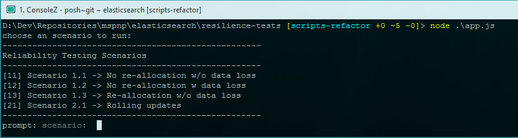

<properties
   pageTitle="Esecuzione di test di adattabilità Elasticsearch automatizzati | Microsoft Azure"
   description="Descrizione di come è possibile eseguire il test sulla resilienza nel proprio ambiente."
   services=""
   documentationCenter="na"
   authors="dragon119"
   manager="bennage"
   editor=""
   tags=""/>

<tags
   ms.service="guidance"
   ms.devlang="na"
   ms.topic="article"
   ms.tgt_pltfrm="na"
   ms.workload="na"
   ms.date="09/22/2016"
   ms.author="masashin"/>

# <a name="running-the-automated-elasticsearch-resiliency-tests"></a>Esecuzione di test di adattabilità Elasticsearch automatizzati

[AZURE.INCLUDE [pnp-header](../../includes/guidance-pnp-header-include.md)]

In questo articolo fa [parte di una serie](guidance-elasticsearch.md).

[Recupero di configurazione]e il ripristino in Elasticsearch in Azure[elasticsearch-resilience-recovery], sono descritti una serie di test eseguiti per un cluster di Elasticsearch di esempio per determinare come anche il sistema ha risposto a alcune forme di errore comuni e come è recuperato. I test sono stati eseguiti per consentire loro di eseguire in modo automatico. Questo documento descrive come è possibile ripetere i test nel proprio ambiente. 

Sono stati testati gli scenari seguenti:

- **Errore di nodo e riavviare il sistema senza perdere dati**. Un nodo dati viene arrestato e riavviato dopo 5 minuti.
Elasticsearch è stato configurato in modo che non per riassegnare shards mancanti nell'intervallo, in modo che non si verifica i/o aggiuntivo con spostamento shards. Quando si riavvia il nodo, il processo di ripristino porta il shards su tale nodo indietro aggiornato.

- **Errore di nodo con una perdita di dati**. Un nodo dati viene interrotta e i dati che contiene viene cancellati per simulare un errore irreversibile del disco. Il nodo viene quindi riavviato (dopo 5 minuti), in modo efficace funge sostituisce il nodo originale. Il processo di ripristino richiede la ricostruzione dati mancanti per il nodo e può comportare riposizionamento shards contenuti in altri nodi.

- **Errore di nodo e riavviare il sistema senza perdita di dati, ma con riassegnazione condiviso**. Un nodo dati viene interrotta e shards che contiene sono riassegnare gli altri nodi. Quindi si riavvia il nodo e altre riassegnazione si verifica per effettuare il cluster.

- **Aggiornamenti senza interruzioni**. Ogni nodo del cluster viene arrestato e riavviato dopo un intervallo breve per simulare macchine riavviate dopo un aggiornamento software. Solo un nodo viene interrotto in qualsiasi momento.
Shards non sono riassegnare mentre è un nodo verso il basso.

## <a name="prerequisites"></a>Prerequisiti

Test automatizzati richiedono gli elementi seguenti:

- Un cluster di Elasticsearch.

- Una configurazione Ambiente JMeter come descritto nella [Guida test delle prestazioni]. 

- Le seguenti aggiunte installate solo i macchine Virtuali nella master JMeter.

    - Runtime del linguaggio 7.

    - Nodejs 4.x.x o versione successiva.

    - Gli strumenti di riga di comando fra.

## <a name="how-the-scripts-work"></a>Come funzionano gli script

Script di test siano in esecuzione su VM JMeter schema. Quando si seleziona un test per l'esecuzione, gli script di eseguono la sequenza delle operazioni seguente:

1.  Avviare un piano di test JMeter passando i parametri specificati.

2.  Copiare uno script che esegue le operazioni necessarie per il test per una macchina virtuale specificato nel cluster. Se dopo aver creato il cluster utilizzando il [modello di Guida introduttiva di Azure Elasticsearch](https://github.com/Azure/azure-quickstart-templates/tree/master/elasticsearch), questa può essere qualsiasi macchina virtuale che contiene un indirizzo IP pubblico o la macchina virtuale *Jumpbox* .

3.  Eseguire lo script in macchine Virtuali (o Jumpbox).

Nella figura seguente è illustrata la struttura dell'ambiente di test e cluster Elasticsearch. Si noti che gli script di test utilizzano sicura shell (SSH) per connettersi a ogni nodo cluster di eseguire varie operazioni Elasticsearch come interrompere o riavviare un nodo.


## <a name="setting-up-the-jmeter-tests"></a>Verifica la configurazione di JMeter

Prima esecuzione la capacità di recupero dei test è necessario compilare e distribuire i test di JUnit nella cartella adattabilità/jmeter/test. Questi test fa riferimento il piano di test JMeter. Per ulteriori informazioni, vedere la procedura "Importazione di un progetto di test JUnit esistente in Eclisse" distribuzione di [una prova di JMeter JUnit per la verifica delle prestazioni Elasticsearch][].

Sono disponibili due versioni di test JUnit contenuti nelle cartelle seguenti:

- **Elasticsearch17.** Il progetto in questa cartella genera il file Elasticsearch17.jar. Utilizzare questo VASO per il test Elasticsearch versioni 1.7

- **Elasticsearch20**. Il progetto in questa cartella genera il file Elasticsearch20.jar. Utilizzare questo VASO per il test Elasticsearch versione 2.0.0 e versioni successive

Copiare il file VASO appropriato insieme al resto delle dipendenze per i computer JMeter. Tramite la procedura "Distribuzione di un test JUnit da JMeter" nella [distribuzione di una prova di JMeter JUnit per prestazioni ottimali Elasticsearch test]viene descritto il processo.

## <a name="configuring-vm-security-for-each-node"></a>Configurazione della protezione macchine Virtuali per ogni nodo

Script di test richiedono l'installazione su ciascun nodo Elasticsearch cluster di un certificato di autenticazione. In questo modo gli script per l'esecuzione automatica senza richiedere il nome utente o password quando si connettono a macchine virtuali diversi.

Avviare accedendo a uno dei nodi cluster Elasticsearch (o VM Jumpbox) e quindi eseguire il seguente comando per generare una chiave di autenticazione:

```Shell
ssh-keygen -t rsa
```

Durante la connessione al nodo Elasticsearch (o Jumpbox), eseguire i comandi seguenti per tutti i nodi in ha Elasticsearch cluster. Sostituire `<username>` con il nome di un utente valido per ogni macchine Virtuali e sostituisci `<nodename>` con il nome DNS o l'indirizzo IP del macchine Virtuali hosting il nodo Elasticsearch.
Si noti che verrà richiesto per la password dell'utente durante l'esecuzione di questi comandi.
Per ulteriori informazioni, vedere [accesso SSH senza password](http://www.linuxproblem.org/art_9.html):

```Shell
ssh <username>@<nodename> mkdir -p .ssh (
cat .ssh/id\_rsa.pub | ssh <username>*@<nodename> 'cat &gt;&gt; .ssh/authorized\_keys'
```

## <a name="downloading-and-configuring-the-test-scripts"></a>Scaricare e configurare gli script di test

Script di test vengono forniti in un archivio di operazioni. Utilizzare la procedura seguente per scaricare e configurare gli script.

Nel computer master JMeter nel punto in cui si eseguiranno i test, aprire una finestra desktop fra (fra Bash) e duplicare l'archivio contenente gli script, come indicato di seguito:

```Shell
git clone https://github.com/mspnp/azure-guidance.git
```

Passare alla cartella test sulla resilienza ed eseguire il comando seguente per installare le dipendenze richieste per eseguire i test:

```Shell
npm install
```

Se lo schema JMeter è in esecuzione in Windows, scaricare [Plink](http://www.chiark.greenend.org.uk/~sgtatham/putty/download.html)un'interfaccia della riga di comando per il client Telnet PuTTY. Copiare Plink eseguibile nella cartella adattabilità-test/raccolta.

Se lo schema JMeter è in esecuzione su Linux, non è necessario scaricare Plink ma è necessario configurare password meno SSH tra lo schema JMeter e il nodo Elasticsearch o Jumpbox utilizzato seguendo i passaggi descritti nella procedura "configurazione macchine Virtuali sicurezza per ogni nodo." 

Modificare i parametri di configurazione seguenti nel `config.js` file in modo che corrispondano l'ambiente di testing e cluster Elasticsearch. Questi parametri sono comuni a tutti i test:

| Nome | Descrizione | Valore predefinito |
| ---- | ----------- | ------------- |
| `jmeterPath` | Percorso locale in cui si trova JMeter. | `C:/apache-jmeter-2.13` |
| `resultsPath` | Directory relativo nel punto in cui lo script trasferisce il risultato. | `results` |
| `verbose` | Indica se l'output dello script è in modalità dettagliata o meno. | `true` |
| `remote` | Indica se il test JMeter eseguito in locale o su server remoti. | `true` |
| `cluster.clusterName` | Il nome del cluster Elasticsearch. | `elasticsearch` |
| `cluster.jumpboxIp`         | L'indirizzo IP del computer Jumpbox.                 |-|
| `cluster.username`          | L'utente di amministratore creato durante la distribuzione del cluster. |-|
| `cluster.password`          | La password per l'utente amministratore.                        |-|
| `cluster.loadBalancer.ip`   | L'indirizzo IP del servizio di bilanciamento del carico Elasticsearch.    |-|
| `cluster.loadBalancer.url`  | URL di base del servizio di bilanciamento del carico.                          |-|

## <a name="running-the-tests"></a>Eseguire i test

Passare alla cartella test sulla resilienza ed eseguire il comando seguente:

```Shell
node app.js
```

Deve essere visualizzato il menu seguente:



Immettere il numero di scenario che si desidera eseguire: `11`, `12`, `13` o `21`. 

Dopo aver selezionato uno scenario, è possibile che il test verrà eseguito automaticamente. I risultati vengono memorizzati come una serie di valori separati da virgola (CSV) file in una cartella creata nella directory dei risultati. Ogni esecuzione ha la propria risultati cartella.
È possibile utilizzare Excel per analizzare e conservare questi dati.

[Running Elasticsearch on Azure]: guidance-elasticsearch-running-on-azure.md
[Tuning Data Ingestion Performance for Elasticsearch on Azure]: guidance-elasticsearch-tuning-data-ingestion-performance.md
[indicazioni per la verifica delle prestazioni]: guidance-elasticsearch-creating-performance-testing-environment.md
[JMeter guidance]: guidance-elasticsearch-implementing-jmeter.md
[Considerations for JMeter]: guidance-elasticsearch-deploying-jmeter-junit-sampler.md
[Query aggregation and performance]: guidance-elasticsearch-query-aggregation-performance.md
[elasticsearch-resilience-recovery]: guidance-elasticsearch-configuring-resilience-and-recovery.md
[Resilience and Recovery Testing]: guidance-elasticsearch-running-automated-resilience-tests.md
[Distribuzione di una prova di JMeter JUnit per il test delle prestazioni Elasticsearch]: guidance-elasticsearch-deploying-jmeter-junit-sampler.md
