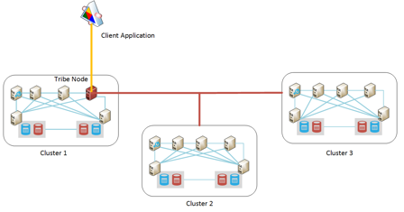

<properties
   pageTitle="Esecuzione Elasticsearch in Azure | Microsoft Azure"
   description="Come installare, configurare ed eseguire Elasticsearch in Azure."
   services=""
   documentationCenter="na"
   authors="dragon119"
   manager="bennage"
   editor=""
   tags=""/>

<tags
   ms.service="guidance"
   ms.devlang="na"
   ms.topic="article"
   ms.tgt_pltfrm="na"
   ms.workload="na"
   ms.date="09/22/2016"
   ms.author="masashin"/>

# <a name="running-elasticsearch-on-azure"></a>Elasticsearch in esecuzione in Azure

[AZURE.INCLUDE [pnp-header](../../includes/guidance-pnp-header-include.md)]

In questo articolo fa [parte di una serie](guidance-elasticsearch.md). 

## <a name="overview"></a>Panoramica

In questo documento fornisce una breve introduzione alla struttura generale del Elasticsearch e viene descritto come è possibile implementare un cluster di Elasticsearch con Azure. Tocca sulle procedure consigliate per la distribuzione di un cluster Elasticsearch che ospitano i vari funzionale prestazioni e i requisiti di gestione del sistema e considerando devono impatto ai propri requisiti di configurazione e topologia selezionata.

> [AZURE.NOTE] Questa guida presuppone familiarità base con [Elasticsearch][].

## <a name="the-structure-of-elasticsearch"></a>La struttura di Elasticsearch 

Elasticsearch è un database di documento ottimizzato per fungere da un motore di ricerca. I documenti vengono serializzati in formato JSON. Dati sono contenuti in indici implementati tramite [Lucene Apache][], anche se i dettagli vengono ricavati dalla visualizzazione e non è necessario conoscere il Lucene per utilizzare Elasticsearch.

### <a name="clusters-nodes-indexes-and-shards"></a>Cluster, nodi, indici e shards

Elasticsearch implementata un'architettura cluster che utilizza sharding per distribuire i dati in più nodi e replica per fornire disponibilità. Documenti archiviati in indici. L'utente può specificare quali campi in un documento vengono utilizzati per identificare in modo univoco all'interno di un indice o il sistema può generare automaticamente un campo chiave e i valori. L'indice è utilizzata per fisica organizzare documenti e il capitale indica che per l'individuazione di documenti. 

L'indice contiene un set di shards. I documenti sono distribuiti uniformemente tra più shards mediante un meccanismo hashing in base a valori di chiave di indice e il numero di shards nell'indice analitico. 

Gli indici possono essere replicati. In questo caso viene copiata ogni condiviso nell'indice analitico. Elasticsearch garantisce che ogni condiviso originale per un indice (denominato "condiviso principale") e la relativa replica sempre trovarsi in nodi diversi. Quando un documento viene aggiunto o modificato, tutti scrivere operazioni vengono eseguite su condiviso principale prima e quindi a ciascun duplicata. 

La figura seguente mostra aspetti essenziali di un cluster di Elasticsearch che contiene tre nodi. È stato creato un indice che è costituito da due shards primaria con due per ogni condiviso (sei shards in tutti).


*Un semplice cluster Elasticsearch contenente due nodi principali e due set di repliche*

In questo cluster condiviso principale 1 e condiviso primaria 2 si trovano su nodi separati per distribuire il carico tra loro. Le repliche sono distribuite in modo analogo. Se un singolo nodo non riesce, i nodi rimanenti avrà informazioni sufficienti per consentire al sistema di continuare a funzionare. Se necessario, Elasticsearch promuove un condiviso duplicata per diventare un condiviso primario se non è disponibile la condiviso principale corrispondente.

### <a name="node-roles"></a>Ruoli nodo

I nodi in un cluster di Elasticsearch possono eseguire i ruoli seguenti:

- **Nodo dati** che può contenere uno o più shards che contengono i dati dell'indice.

- **Nodo client** che non conserva i dati dell'indice, ma che gestisce le richieste in arrivo effettuate dalle applicazioni client per il nodo dati appropriati.
 
- Un **nodo principale** che non conserva i dati dell'indice, ma che esegue le operazioni di gestione di cluster, ad esempio la gestione e la distribuzione di informazioni sul routing all'interno del cluster (l'elenco dei quali nodi contengono quali shards), per determinare quali nodi sono disponibili riposizionamento shards come nodi compaiono e scompaiono e coordinare ripristino dopo un errore del nodo. Più nodi possono essere configurati come master, ma solo uno effettivamente essere scelto per eseguire le funzioni master. Se il nodo non riesce, un'altra scelta entrerà in vigore e uno degli altri nodi master idonei verrà assegnato subentrare.

> [AZURE.NOTE]Il nodo principale selezionato è fondamentale per essere ben del cluster. Gli altri nodi effettuare il ping regolarmente per assicurarsi che sia ancora disponibile. Se il nodo principale selezionato funge anche da un nodo di dati, è una possibilità che il nodo può diventare occupato e fail per rispondere a questi ping. In questo caso, lo schema considerato errato e uno dei nodi master scelto nella relativa posizione. 

 La figura seguente mostra una topologia che contiene una combinazione di schema dedicato, client e nodi di dati in un cluster di Elasticsearch.


*Un cluster di Elasticsearch con diversi tipi di nodi*

### <a name="costs-and-benefits-of-using-client-nodes"></a>I costi e vantaggi derivanti dall'uso nodi client

Quando un'applicazione invia una query a un cluster di Elasticsearch, il nodo a cui si connette l'applicazione è responsabile per indirizzare il processo di query. Il nodo inoltra la richiesta a ogni nodo di dati e raccoglie i risultati vengono restituite le informazioni accumulate all'applicazione. Se una query comporta aggregazioni e gli altri calcoli, il nodo a cui si connette l'applicazione esegue le operazioni necessarie dopo il recupero dei dati provenienti da ognuna delle altri nodi. Questo processo sequenziale/può utilizzare notevole risorse di elaborazione e della memoria.

Utilizzo dei nodi client dedicato per eseguire queste operazioni consente ai nodi di dati per concentrarsi su gestione e la memorizzazione dei dati. Il risultato è che numerosi scenari che comportano aggregazioni e query complesse possono trarre vantaggio da tramite nodi client dedicato. Tuttavia, l'impatto dell'utilizzo nodi client dedicato probabilmente variano in base al scenario, carico di lavoro e la dimensione del cluster. 

> [AZURE.NOTE] Per ulteriori informazioni sul processo di ottimizzazione, fare riferimento [all'ottimizzazione aggregazione dei dati e alle prestazioni delle Query per Elasticsearch in Azure][] .

### <a name="connecting-to-a-cluster"></a>Connessione a un cluster

Elasticsearch espone una serie di API REST per la creazione di applicazioni client e invio di richieste a un cluster. Se si sviluppano applicazioni utilizzando .NET Framework, due livelli superiori API sono disponibili: [Elasticsearch.Net & NIDIFICARE][].

Se si creano applicazioni client utilizzando Java, è possibile utilizzare il [Nodo Client API][] per creare client nodi in modo dinamico e aggiungerli al cluster. Creazione di client nodi in modo dinamico è utile se il sistema utilizza un numero relativamente basso di lunga durate connessioni. Nodi client creati tramite l'API di nodo vengono forniti con il cluster routing eseguire il mapping (i dettagli dei quali nodi contengono quali shards), il nodo principale. Queste informazioni consentono all'applicazione di linguaggio a cui connettersi direttamente i nodi appropriati quando l'indicizzazione o query sui dati, riducendo il numero di hop che potrebbero essere necessari quando si usano altre API.

Il costo di questo approccio è il sovraccarico di registrare il nodo client nel cluster. Se un numero elevato di nodi client visualizzata e non vengono visualizzati rapidamente, l'impatto della manutenzione e distribuire il mapping di routing cluster può diventare significativo.

La figura seguente mostra una configurazione che utilizza un bilanciamento del carico per indirizzare le richieste a un set di nodi client, anche se la stessa strategia può essere usata per connettersi direttamente a nodi di dati se non vengono utilizzati i nodi di client.


*Istanze dell'applicazione client la connessione a un cluster di Elasticsearch tramite il servizio di bilanciamento del carico di Azure*

> [AZURE.NOTE]È possibile utilizzare il [Servizio di bilanciamento del carico Azure][] per esporre i cluster a Internet o se le applicazioni client e cluster si trovano completamente all'interno della stessa rete virtuale privata (VNet), è possibile utilizzare un [servizio di bilanciamento del carico interno][] .

### <a name="node-discovery"></a>Rilevamento nodo

Elasticsearch si basa su comunicazioni peer-to-peer, in modo che gli altri nodi in un cluster l'individuazione sono una parte importante nel ciclo di vita di un nodo. Rilevamento nodo consente nuovi nodi di dati da aggiungere in modo dinamico a un cluster che a sua volta consente al cluster di scalabilità trasparente. Inoltre, se un nodo dati non riesce a rispondere a richieste di comunicazioni da altri nodi, un nodo principale per stabilire che il nodo dati non è riuscita ed eseguire le operazioni necessarie per riassegnare shards che è stata tenendo ad altri nodi di dati operativi.

Rilevamento nodo Elasticsearch viene gestito tramite un modulo di individuazione. Il modulo di individuazione è un plug-in cui può essere cambiato per utilizzare un meccanismo di individuazione diverso. Il modulo di individuazione predefinito ([Zen][]) genera un nodo da emettere richieste ping per trovare altri nodi nella stessa rete. Se gli altri nodi rispondono, si possono per lo scambio di informazioni. Un nodo principale quindi distribuire shards al nuovo nodo (se si tratta di un nodo dati) e ribilanciare cluster. Il modulo di individuazione Zen gestisce anche il processo di scelta master e i protocolli per il rilevamento di errore di nodo.

Inoltre, se si esegue Elasticsearch nodi come Azure macchine (), la messaggistica multicast non è supportata. Per motivi, è necessario configurare Individuazione Zen per usare la messaggistica unicast e ottenere un elenco dei nodi di contatto validi nel file di configurazione elasticsearch.yml.

Se si ospita un cluster di Elasticsearch all'interno di una rete virtuale Azure, è possibile specificare che privato assegnato DHCP indirizzo IP assegnato a ogni macchina virtuale del cluster deve rimanere allocato (statico). È possibile configurare Zen individuazione unicast messaggistica con questi indirizzi IP statici. Se si utilizza macchine virtuali con gli indirizzi IP dinamici, tenere presente che se una macchina virtuale si arresta e si riavvia potrebbe essere assegnata un nuovo indirizzo IP difficile individuazione. Per gestire questo scenario, è possibile sostituire il modulo di individuazione Zen per il [Plug-in Azure Cloud][]. Il plug-in utilizza l'API di Azure per implementare il meccanismo di individuazione, basato su informazioni sull'abbonamento Azure.

> [AZURE.NOTE]La versione corrente del plug-in Azure Cloud è necessario installare il certificato di gestione dell'abbonamento Azure dell'archivio chiavi linguaggio sul nodo Elasticsearch e specificare la posizione e le credenziali per l'accesso dell'archivio chiavi nel file elasticsearch.yml. Il file viene mantenuto nel testo non crittografato, pertanto è importante verificare che il file è accessibile solo dall'account di servizio Elasticsearch. 
> 
> Inoltre, questo approccio potrebbe non essere compatibile con le distribuzioni di Manager delle risorse di Azure. Per questi motivi, è consigliabile utilizzare indirizzi IP statici per i nodi master e utilizzare questi nodi per implementare Zen individuazione unicast messaggistica all'interno del cluster. La configurazione seguente (ottenuto dal file di elasticsearch.yml per un nodo di dati di esempio), gli indirizzi IP host riferimento master nodi del cluster:

```yaml
discovery.zen.ping.multicast.enabled: false  
discovery.zen.ping.unicast.hosts: ["10.0.0.10","10.0.0.11","10.0.0.12"]
```

## <a name="general-system-guidelines"></a>Linee guida generale del sistema

Elasticsearch possono essere eseguiti sui diversi computer, che vanno da un unico computer portatile a un cluster di server high-end. Altre risorse in termini di memoria, computing power e veloce dischi che sono comunque disponibili prestazioni. Nelle sezioni seguenti vengono riepilogano i requisiti hardware e software di base per l'esecuzione di Elasticsearch.

### <a name="memory-requirements"></a>Requisiti di memoria 

Elasticsearch sta tentando di archiviare dati in memoria per velocità. Deve disporre di un server di produzione che ospita un nodo per un'azienda tipica o dimensioni moderato distribuzione commerciale in Azure tra 14 e 28GB di RAM (D3 o macchine virtuali D4). **Distribuire il carico tra più nodi anziché creare nodi con più memoria** (Esperimenti sono mostrato che l'utilizzo di più grandi nodi con più memoria può causare tempi di ripristino esteso in caso di errore.) Tuttavia, sebbene la creazione di cluster con numerosi nodi di piccole dimensioni, è possibile aumentare la disponibilità e la velocità effettiva, anche effettuano l'escalation l'impegno coinvolti nella gestione di tale sistema.

**Allocare 50% della memoria disponibile su un server per heap Elasticsearch**. Se si utilizza Linux imposta la variabile di ambiente ES_HEAP_SIZE prima di eseguire Elasticsearch. In alternativa, se si utilizza Windows o Linux, è possibile specificare la dimensione della memoria nel `Xmx` e `Xms` parametri quando si avvia Elasticseach. Impostare entrambi i parametri per lo stesso valore per evitare la macchina virtuale JVM (Java) ridimensionamento heap in fase di esecuzione. Tuttavia, **non allocare più di 30 GB**. Utilizzare la memoria rimanente per la cache di file di sistema operativo.

> [AZURE.NOTE]Elasticsearch utilizza la libreria di Lucene per creare e gestire gli indici. Strutture Lucene utilizzano un formato basato su disco e la memorizzazione nella cache queste strutture nella cache di sistema del file verrà migliorare le prestazioni.

Si noti che le dimensioni massime heap ottimale per Java in un computer a 64 bit, sopra 30GB. Di sopra il che linguaggio passa all'utilizzo di un meccanismo "Extended" per fare riferimento a oggetti nell'heap, che aumenta i requisiti di memoria per tutti gli oggetti e riduce le prestazioni. 

L'impostazione predefinita linguaggio recuperata (Segna simultanee e organizza) può anche eseguire secondari in modo ottimale se le dimensioni dell'heap sono superiore al 30 GB. Non è attualmente consigliato per passare a un diverso recuperata come Elasticsearch e Lucene solo sono stati testati con il valore predefinito.

Non overcommit memoria come scambio della memoria principale su disco gravemente impatto sulle prestazioni. Se possibile, disattivare la sostituzione completamente (i dettagli variano a seconda del sistema operativo). Se non è possibile attivare l'impostazione *mlockall* nel file di configurazione Elasticsearch (elasticsearch.yml) come indicato di seguito:

```yaml
bootstrap.mlockall: true
```

Questa impostazione determina JVM bloccare la memoria e non consente di che vengono scambiati fuori dal sistema operativo.

### <a name="disk-and-file-system-requirements"></a>Requisiti di sistema del disco e file

Utilizzare dischi di dati supportati da archiviazione premium per l'archiviazione shards. Dischi devono essere ridimensionati per mettere in attesa la maggior quantità di dati previsti i shards, anche se è possibile aggiungere ulteriori dischi in un secondo momento. È possibile estendere un condiviso tra più dischi su un nodo.

> [AZURE.NOTE]Elasticsearch comprime i dati per i campi archiviati utilizzando l'algoritmo LZ4 ed Elasticsearch 2.0 in poi è possibile modificare il tipo di compressione. È possibile passare algoritmo di compressione DEFLATE come per le utilità *zip* e *gzip* . Questa tecnica di compressione può essere risorse più elevato, ma è consigliabile utilizzare per i dati archiviati log. Questo approccio può aiutare a ridurre le dimensioni dell'indice.

Non è essenziale che tutti i nodi in un cluster abbiano lo stesso layout del disco e capacità. Tuttavia, un nodo con una capacità di dimensioni molto grandi disco confrontate con quelle di altri nodi in un cluster verrà attirare altri dati e richiede maggiore potenza di elaborazione per gestire questi dati. Di conseguenza può diventare il nodo "hot" confrontate con quelle di altri nodi e questo può, a sua volta, influire sulle prestazioni.

Se possibile, utilizzare 0 (striping). Altre forme di RAID che implementano uniformità e che rispecchiano non sono necessari come Elasticsearch fornisce le relative soluzioni alta disponibilità sotto forma di repliche.

> [AZURE.NOTE]Prima di Elasticsearch 2.0.0, è anche possibile implementare striping del livello di software specificando più directory in impostazioni di configurazione *Path. Data* . In Elasticsearch 2.0.0 questa forma di striping non è più supportata. Se, tuttavia, shards diversi possono essere assegnati a percorsi diversi, ma tutti i file in una singola condiviso verranno scritti nello stesso percorso. Se si richiede striping, è necessario stripe dati livello di sistema operativo o hardware. 

Per ottimizzare la velocità di spazio di archiviazione, ogni **macchine Virtuali devono avere un account di archiviazione dedicato premium**.

Raccolta Lucene possibile utilizzare un numero elevato di file per archiviare i dati dell'indice ed Elasticsearch possibile aprire un numero elevato di socket per le comunicazioni tra i nodi e clienti. Assicurarsi che il sistema operativo sia configurato per supportare un numero di descrittori Apri file (fino a 64000 se memoria disponibile sia sufficiente). Si noti che la configurazione predefinita per le distribuzioni Linux molti limita il numero di descrittori file aperto a 1024, molto ridotta.

Elasticsearch utilizza una combinazione di memoria associata (mmap) i/o e i/o nuovo linguaggio (NIO) per ottimizzare l'accesso simultaneo ai file di dati e indici. Se si utilizza Linux, è necessario configurare il sistema operativo per assicurarsi che sia disponibile con spazio per aree mappa memoria 256 KB di memoria virtuale sufficiente.

> [AZURE.NOTE]Molti Linux distribuzioni per impostazione predefinita utilizzano l'utilità di pianificazione (CFQ) Accodamento completamente giusto per la disposizione per scrivere i dati su disco. Questa utilità di pianificazione non è ottimizzato per SSDs. Valutare la possibilità di riconfigurare il sistema operativo per usare l'utilità di pianificazione NOOP o l'utilità di pianificazione scadenza, che sono più efficaci per SSDs.

### <a name="cpu-requirements"></a>Requisiti di CPU

Azure macchine virtuali sono disponibili in diverse configurazioni di CPU, supporto tra 1 e 32 Core. Per un nodo di dati, un valido punto di partenza è standard macchine Virtuali di serie DS e selezionare uno dei due il DS3 (4 core) o D4 (8 core) SKU. Il DS3 vengono forniti anche 14GB di RAM, mentre il DS4 include 28GB. 

La serie GS (per l'archiviazione premium) e serie G (per lo spazio di archiviazione standard) utilizzare processori Xeon E5 V3 che possono essere utili per carichi di lavoro sono molto complesse, ad esempio aggregazioni su larga scala. Per informazioni aggiornate, visitare [le dimensioni per macchine virtuali][].

### <a name="network-requirements"></a>Requisiti di rete

Elasticsearch richiede una larghezza di banda di rete di compreso tra 1 e 10Gbps, a seconda della dimensione e volatilità dei cluster implementata. Elasticsearch esegue la migrazione shards tra i nodi con l'aggiunta di più nodi in un cluster. Elasticsearch si presuppone che il tempo di comunicazione tra tutti i nodi equivale approssimativamente e non si considerano le posizioni relative delle shards contenute dei nodi. Inoltre, replica può comportare i/o di rete significativa tra shards. Per questi motivi, **evitare di creare cluster su nodi che sono in diverse aree geografiche**.

### <a name="software-requirements"></a>Requisiti software

È possibile eseguire Elasticsearch in Windows o Linux. Il servizio Elasticsearch viene distribuito come una raccolta di vaso linguaggio e non è le relazioni tra le altre raccolte di linguaggio incluse nel pacchetto Elasticsearch. È necessario installare il linguaggio 7 (aggiornamento 55 o versioni successiva) o linguaggio 8 (aggiornamento 20 o versioni successiva) JVM eseguire Elasticsearch.

> [AZURE.NOTE]Ad eccezione dei parametri di memoria *Xmx* ed *estesa* (specificato nelle opzioni della riga di comando al motore di Elasticsearch, vedere [requisiti di memoria][]) non modificare le impostazioni di configurazione JVM predefinite. Elasticsearch è stata progettata utilizzando i valori predefiniti; convertirli possono causare Elasticsearch diventare detuned ed eseguire in modo non corretto.

### <a name="deploying-elasticsearch-on-azure"></a>Distribuzione Elasticsearch su Azure

Anche se non è difficile distribuire una singola istanza di Elasticsearch, la creazione di un numero di nodi e installare e configurare Elasticsearch su ciascuno di essi può essere un processo di tempo ed errori. Se si prevede di esecuzione Elasticsearch in macchine virtuali di Azure, sono disponibili tre opzioni che possono risultare utili per ridurre le possibilità di errori.

- Usare il Manager delle risorse Azure [modello](https://azure.microsoft.com/marketplace/partners/elastic/elasticsearchelasticsearch/) in Azure marketplace. Questo modello è stato creato da elastici. Consente di aggiungere commerciale miglioramenti come l'icona, Marvel, monitoraggio e così via.

- Usare la Guida introduttiva di Azure [modello](https://github.com/Azure/azure-quickstart-templates/tree/master/elasticsearch) per creare il cluster. Questo modello è possibile creare un cluster basato su Windows Server 2012 o Ubuntu Linux 14.0.4. Consente di utilizzare caratteristiche sperimentazione come spazio di archiviazione File Azure. Questo modello viene usato per la ricerca e attività di test in questo documento.

- Utilizzo di script che possono essere automatizzati o esecuzione automatica. Gli script che è possono creare e distribuire un cluster di Elasticsearch sono disponibili in [GitHub archivio][elasticsearch-scripts]

## <a name="cluster-and-node-sizing-and-scalability"></a>Raggruppamento e scalabilità e ridimensionamento nodo 

Elasticsearch consente a un numero di topologie di distribuzione, progettato per supportare requisiti diversi e livelli di scala. In questa sezione vengono illustrate alcune topologie comuni e considerazioni per l'implementazione di cluster in base a tali topologie.

### <a name="elasticsearch-topologies"></a>Topologie Elasticsearch

La figura seguente illustra un punto di partenza per la progettazione di una topologia Elasticsearch per Azure:


*Suggerite punto di partenza per la creazione di un cluster di Elasticsearch con Azure*

Questa topologia contiene sei nodi di dati con tre client tre master nodi e (sola scelto di nodo principale, gli altri due sono disponibili per scelta avrà esito negativo master selezionate.) Ogni nodo è implementata come una macchina virtuale separata. Le applicazioni web Azure vengono richiesto di nodi client tramite un bilanciamento del carico. 

In questo esempio, tutti i nodi e le applicazioni web si trovano nella stessa rete virtuale che in modo efficace isolarli dall'esterno. Se il cluster deve essere disponibile esternamente (eventualmente come parte di una soluzione ibrida che includa client locale), quindi è possibile utilizzare il servizio di bilanciamento del carico di Azure per fornire un indirizzo IP pubblico, ma è necessario prendere precauzioni rafforzare la sicurezza per impedire l'accesso non autorizzato al cluster. 

"Passare casella facoltativa" è una macchina è disponibile solo agli amministratori. Questa macchina virtuale ha una connessione di rete per la rete virtuale, ma anche una connessione di rete per consentire l'accesso come amministratore da una rete esterna (questo accesso deve essere protetto tramite una password complessa o certificato) verso l'esterno. Un amministratore può accedere alla casella passare e quindi connettersi da tale posizione direttamente uno qualsiasi dei nodi del cluster. 

Approcci sono utilizzando una connessione VPN da sito tra un'organizzazione e la rete virtuale o utilizzo circuiti [ExpressRoute][] per connettersi alla rete virtuale. Questi meccanismi consentono di accesso amministrativo a cluster senza esporre il cluster a internet.

Per mantenere la disponibilità di macchine Virtuali, i nodi di dati sono raggruppati nello stesso set di disponibilità Azure. Analogamente, i nodi di client presenti in un'altra coppia di disponibilità e i nodi master vengono archiviati in un set di disponibilità terzo.

Questa topologia è relativamente facile scalabilità, è sufficiente aggiungere più nodi del tipo appropriato e assicurarsi che siano configurati con lo stesso nome cluster nel file elasticsearch.yml. Nodi client necessario anche aggiungere al pool di back-end per il servizio di bilanciamento del carico Azure.

**Individuazione geografico cluster**

**Non si nodi in un cluster tra le aree come questo può rallentare le prestazioni di comunicazione tra i nodi** (vedere [requisiti di rete][]). Accessibilità in aree diverse dei dati individuazione geografico richiedono la creazione di più cluster. In questo caso, è necessario considerare come (o) per sincronizzare cluster. Le possibili soluzioni includono:

[I nodi tecnici][] sono simili a un nodo client ad eccezione del fatto che sia possibile partecipare più cluster Elasticsearch e visualizzarli tutti come un cluster di grande. Dati verrà comunque gestiti in locale da ogni cluster (aggiornamenti non verranno propagati oltre i confini cluster), ma tutti i dati sono visibili. Un nodo tecnici eseguire una query, creare e gestire i documenti in un cluster. 

Le restrizioni primarie sono un nodo tecnici non può essere usato per creare un nuovo indice che i nomi di indice devono essere univoci in tutti i cluster. Pertanto è importante considerare come verranno denominati indici quando si progettano cluster deve essere eseguito da nodi tecnici.

Utilizzare questo meccanismo, ogni cluster può contenere i dati che in genere possibile accedervi dalle applicazioni client locale, ma questi client possono comunque accedere e modificare dati remoti anche se con i possibili esteso latenza. La figura seguente mostra un esempio di questa topologia. Il nodo tecnici Cluster 1 è evidenziato. altri cluster può essere nodi tecnici Benché questi non vengono visualizzati nel diagramma:



*Un'applicazione client l'accesso a più cluster mediante un nodo tecnici*

In questo esempio, l'applicazione client si connette al livello di nodo tecnici in Cluster 1 (situati nella stessa regione), ma il nodo è configurato per essere in grado di access Cluster 2 e 3 Cluster che può trovarsi in diverse aree geografiche. L'applicazione client può inviare richieste di recupero o modificano dati in un cluster.

> [AZURE.NOTE]I nodi tecnici richiedono multicast individuazione per connettersi a cluster che possono presentare un problema di sicurezza. Vedere la sezione [rilevamento nodo][] per altri dettagli.

- Implementazione della replica geografico tra i gruppi. In questo approccio, le modifiche apportate in ogni cluster vengono propagate in quasi in tempo reale a cluster presenti in altre aree di dati. Plug-in di terze parti sono disponibili per Elasticsearch che supportano questa funzionalità, ad esempio il [Plug-in PubNub modifiche][].

- Utilizzo di [Elasticsearch Snapshot e Ripristina modulo][]. Se i dati sono molto lente e modificati solo da un singolo cluster, è possibile utilizzare istantanee per creare una copia periodica dei dati e quindi ripristinare le istantanee in altri cluster (istantanee possono essere create in archiviazione Blob Azure se è stato installato il [Plug-in Azure Cloud][]). Tuttavia, questa soluzione non funziona anche per modificare rapidamente dati o se è possono modificare dati in più di un cluster.

**Topologie di piccole dimensioni**

Topologie di grandi dimensioni comprendente cluster dei nodi di schema, client e dati dedicati potrebbero non essere appropriate per ogni scenario. Se si sta creando un sistema di sviluppo o produzione di piccole dimensioni, è consigliabile cluster nodo 3 illustrato nella figura seguente.

Applicazioni client si connettono direttamente a qualsiasi nodo dati disponibili in cluster. Il cluster contiene tre shards etichettata P1-P3 (per consentire la crescita) più repliche etichettate r 3 R1. Uso di tre nodi consente Elasticsearch distribuire la shards e repliche in modo che se qualsiasi singolo nodo ha esito negativo dati non andranno persi.


*Un cluster di 3 nodi con 3 shards e replica*

Se si esegue un'installazione di sviluppo in un computer autonomo è possibile configurare un cluster con un singolo nodo che funge da master, client e dati di spazio di archiviazione. In alternativa, è possibile iniziare più nodi in esecuzione come cluster nello stesso computer avviando più istanze di Elasticsearch. Nella figura seguente è illustrato un esempio.


*Una configurazione di sviluppo con più nodi Elasticsearch nello stesso computer*

Si noti che nessuna di queste configurazioni autonoma sono consigliata per un ambiente di produzione dato che possono causare un conflitto a meno che non sono previsti una quantità significativa di memoria e dischi veloci diversi computer di sviluppo. Inoltre, non forniscono che qualsiasi disponibilità garantisce. Se il computer non riesce, tutti i nodi vengono persi.

### <a name="scaling-a-cluster-and-data-nodes"></a>Ridimensionamento di un nodo cluster e dati

Elasticsearch può ridurre in due dimensioni: verticalmente (con più grande, più potenti macchine) e orizzontalmente (diffusione il carico tra computer).

**Ridimensionamento nodi di dati Elasticsearch verticalmente**

Se si ospita un cluster Elasticsearch utilizzando macchine virtuali di Azure, ogni nodo può corrispondere a una macchina virtuale. Il limite di scalabilità verticale per un nodo è ampiamente regolato dai SKU di macchina virtuale e le restrizioni globali applicati agli account di archiviazione singoli e Azure abbonamenti. 

La pagina [sottoscrizione Azure e limiti del servizio, le quote e vincoli](../azure-subscription-service-limits.md) illustra questi limiti in modo dettagliato, ma per quanto riguarda la creazione di un cluster di Elasticsearch è, gli elementi dell'elenco seguente sono più pertinenti. 

- Ogni account di archiviazione è limitato a 20.000 IOPS. Ogni macchina virtuale del cluster deve utilizzare un dedicato (preferenza premium) account di archiviazione.

- Il numero dei nodi di dati in una rete virtuale. Se non si usa la gestione di risorse di Azure, è previsto un limite di 2048 istanze di macchine Virtuali per virtuali. Mentre risulta sufficiente per la maggior parte dei casi, se si dispone di una configurazione di dimensioni molto grande con migliaia di nodi trattarsi di un limite.

- Numero di account di archiviazione per abbonamento per area geografica. È possibile creare fino a 100 account di archiviazione per Azure abbonamento in ogni area. Gli account di archiviazione vengono utilizzati per contenere dischi virtuali e ogni account di archiviazione ha un limite di 500TB di spazio.

- Numero di core per abbonamento. Il limite predefinito è 20 core per sottoscrizione, ma può essere aumentata fino a 10.000 core richiedendo un aumento limite tramite un ticket di supporto. 

- La quantità di memoria per ogni dimensione memoria virtuale. Macchine virtuali di dimensioni più piccole hanno una quantità di memoria disponibile (D1 macchine hanno 3,5 GB e D2 ha 7 GB) limitata. Questi computer potrebbero non essere adatti per scenari che richiedono Elasticsearch memorizzare nella cache grandi quantità di dati per ottenere prestazioni ottimali (aggregazioni di dati o l'analisi di un numero elevato di documenti durante l'acquisizione di dati, ad esempio).

- Numero massimo di dischi per dimensione memoria virtuale. Questa limitazione possa limitare le dimensioni e prestazioni di un cluster. Dischi meno significa che possono essere mantenuti meno dati e le prestazioni possono risultare ridotte mediante la ricezione di un numero minore dischi disponibili per striping.

- Il numero di Aggiorna domini / domini per configurare la disponibilità di errore. Se si creano macchine virtuali tramite Gestione risorse Azure, ogni set di disponibilità può allocare fino a 3 guasto e i domini aggiornamento 20. Questa limitazione può influire sulla capacità di recupero di un cluster di grandi dimensioni è sottoposti a frequenti aggiornamenti in sequenza.

Inoltre, è probabile che non opportuno usare macchine virtuali con più di 64GB di memoria. Come descritto nella sezione [requisiti di memoria][], non deve allocare più di 30 GB di RAM su ogni macchina virtuale per JVM e consentire al sistema operativo per l'utilizzo della memoria rimanente per i/o buffer.

Con queste limitazioni presente, è sempre deve distribuire dischi virtuali per macchine virtuali in un cluster tra gli account di archiviazione per ridurre le possibilità dei / o la limitazione. In un cluster di dimensioni molto grande, potrebbe essere necessario riprogettare infrastruttura logico e dividere in partizioni funzionale distinte. Ad esempio, potrebbe essere necessario suddividere il cluster su sottoscrizioni, anche se questo processo può comportare ulteriori problemi a causa la necessità di connettere reti virtuali.

**Ridimensionamento di un cluster Elasticsearch orizzontalmente**

Internamente all'interno di Elasticsearch, il limite di scalabilità orizzontale è determinato dal numero di shards definito per ogni indice. Inizialmente, shards molti allocare allo stesso nodo in un cluster, ma esigenze aggiuntivo il volume dei dati possono essere aggiunti nodi e shards può essere distribuito in questi nodi. In teoria, solo quando il numero dei nodi raggiunto il numero di shards il sistema prossimamente scalare orizzontalmente.

Come per il ridimensionamento verticale, esistono alcuni problemi che è necessario considerare quanto alle implementazione di ridimensionamento orizzontale, tra cui:

- Numero massimo di macchine virtuali che è possibile connettere in una rete virtuale Azure. Questa operazione possibile limitare la scalabilità orizzontale per un cluster di dimensioni molto grande. È possibile creare un cluster di nodi che si estendono su più di una rete virtuale per ovviare a questo limite, ma questo approccio può influire sulle prestazioni ridotte a causa dell'assenza di località di ogni nodo con i colleghi.

- Il numero di dischi per dimensione memoria virtuale. Supporto numeri diversi di dischi collegati serie diverse e SKU.
Inoltre, è anche possibile utilizzare lo spazio di archiviazione temporanea incluso con la macchina virtuale per fornire un numero limitato di archiviazione dei dati più veloce, sebbene esistano implicazioni sulla resilienza e ripristino che è necessario considerare (vedere [configurazione adattabilità e il ripristino in Elasticsearch in Azure] [ elasticsearch-resilience-recovery] per ulteriori informazioni). La serie D serie DS, Dv2 serie e serie GS delle macchine virtuali utilizzare SSDs per l'archiviazione temporanee.

È possibile utilizzare [Set di scala macchina virtuale] [ vmss] per avviare e arrestare macchine virtuali come richiede stabilisce. Tuttavia, questo approccio potrebbe non essere appropriato per un cluster di Elasticsearch per i motivi seguenti:

- Questo approccio è più adatto per le macchine virtuali senza informazioni sullo stato. Ogni volta che si aggiungono o rimuovere un nodo da un cluster Elasticsearch shards sono riassegnare per distribuire il carico e questo processo può generare notevole volumi di traffico di rete e disco e compromettere seriamente velocità di acquisizione di dati. È necessario valutare se questo sovraccarico è giustificare della trasformazione aggiuntive e risorse di memoria diventano disponibili avviando dinamicamente più macchine virtuali.

- Avvio di macchine Virtuali non avvenire immediatamente e potrebbe richiedere alcuni minuti prima di altre macchine virtuali diventano disponibili o vengono chiuse verso il basso. Il ridimensionamento in questo modo deve essere utilizzato solo per gestire le modifiche velocità della domanda.

- Dopo la scalabilità, realmente necessari valutare la possibilità di ridimensionamento indietro Rimozione di una macchina virtuale da un cluster di Elasticsearch può essere un processo intensivo delle risorse che richiedono che Elasticsearch recupera il shards e repliche che si trovano in quella macchina virtuale e li ricrea su uno o più dei nodi rimanenti. La rimozione di macchine virtuali diverse nello stesso momento potrebbe compromettere l'integrità del cluster difficile ripristino. Inoltre, molte implementazioni Elasticsearch aumentano nel tempo, ma la natura dei dati è in modo che tenda non a ridurre il volume. È possibile eliminare manualmente i documenti e documenti possono anche essere configurati con un valore di TTL (durata) dopo la cui scadenza e vengono rimosse, ma nella maggior parte dei casi che è probabile che lo spazio precedentemente allocato verrà riutilizzato rapidamente i documenti nuovi o modificati. Frammentazione all'interno di un indice che potrebbero verificarsi quando i documenti vengono rimosse o modificati, nel qual caso è possibile utilizzare la Elasticsearch HTTP [Ottimizza][] API (Elasticsearch 2.0.0 e versioni precedenti) oppure la [Forza unire][] API (Elasticsearch 2.1.0 e versioni successive) per eseguire la deframmentazione.

### <a name="determining-the-number-of-shards-for-an-index"></a>Determinazione del numero di shards per un indice

Il numero dei nodi in un cluster può variare nel tempo, ma il numero di shards in un indice viene risolto dopo aver creato l'indice. Per aggiungere o rimuovere shards richiede la reindicizzazione i dati, un processo di creazione di un nuovo indice con il numero richiesto di shards e copiando i dati dell'indice vecchio al nuovo (è possibile utilizzare gli alias per isolare gli utenti dal fatto che i dati sono stati ricostruire – per ulteriori informazioni, vedere [l'aggregazione di ottimizzazione dei dati e alle prestazioni delle query per Elasticsearch in Azure][] ).
È importante stabilire il numero di shards che probabilmente necessario per la creazione dell'indice prima del cluster. È possibile eseguire la procedura seguente per stabilire il numero:

- Creare un cluster di nodo singolo utilizzando la stessa configurazione hardware che si desidera distribuire nell'ambiente di produzione.

- Creare un indice che corrisponde alla struttura che si intende utilizzare in fase di produzione. Assegnare l'indice un singolo condiviso e senza replica.

- Aggiungere una specifica quantità di dati di produzione realistici per l'indice.

- Eseguire query semplici, aggregazioni e altri carichi di lavoro con l'indice e misurare il velocità e tempi di risposta.

- Se il velocità e tempi di risposta entro limiti accettabili, quindi ripetere la procedura dal passaggio 3 (aggiunge altri dati).

- Quando si verrà visualizzati come raggiunge la capacità di condiviso (tempi di risposta e velocità avviare diventando accettabile), prendere nota del volume dei documenti.

- Estrapola dalla capacità di una singola condiviso per il numero previsto di documenti di produzione per calcolare il numero richiesto di shards (è necessario includere un margine di errore in questi calcoli come estrapolazione non è una ricerca di scienze preciso).

> [AZURE.NOTE]Tenere presente che ogni condiviso è implementata come un indice Lucene che utilizza memoria, la potenza della CPU e punti di manipolazione di file. Ulteriori shards sono più di queste risorse saranno necessarie.

Inoltre, la creazione di più shards potrebbero aumentare scalabilità (in base al carichi di lavoro e scenario) e può aumentare la velocità di acquisizione di dati, ma può ridurre l'efficienza delle molte query. Per impostazione predefinita, una query venga esaminate ogni condiviso utilizzato da un indice (è possibile utilizzare [instradamento personalizzato][] per modificare questo comportamento se si è sicuri di quali shards i dati desiderati si trovano in). 

Seguire questa procedura può generare solo una stima del numero di shards e il volume di documenti previsto nella produzione potrebbe non essere nota. In questo caso, è necessario determinare il volume iniziale (vedere sopra) e il tasso di crescita. Creare un numero appropriato di shards in grado di gestire la crescita di dati per il periodo fino a quando non si è disposti per il database. 

Altre strategie utilizzato per gli scenari, ad esempio gestione degli eventi e registrazione includono l'utilizzo degli indici in sequenza.
Creare un nuovo indice per il caricamento di ogni giorno di dati e accedere l'indice attraverso un alias è cambiato giornaliero in modo che puntino all'indice più recente. Questo approccio consente ai dati più facilmente l'età esterna precedenti (è possibile eliminare gli indici contenente le informazioni che non sono più necessarie) e mantiene il volume di dati gestibili.

Tenere presente che il numero dei nodi non deve corrispondere al numero di shards. Ad esempio, se si crea 50 shards, è possibile distribuire loro su 10 nodi inizialmente e quindi aggiungere più nodi per ridimensionare il sistema fuori come il volume di lavoro aumenta. Evitare di creare un eccezionale numerosi shards su un numero limitato di nodi (1000 shards distribuire su 2 nodi, ad esempio). Sebbene il sistema potrebbe teorico scalare a 1000 nodi con questa configurazione, è necessario eseguire 500 shards sui rischi singolo nodo ridurre l'efficacia delle prestazioni del nodo.

> [AZURE.NOTE]Per i sistemi di acquisizione di dati larga, si consiglia di utilizzare un numero primo di shards. Algoritmo predefinito utilizzato per distribuire i documenti a shards produce più allontanare anche in questo caso Elasticsearch.

### <a name="security"></a>Sicurezza

Per impostazione predefinita, Elasticsearch la protezione minima viene implementata e non consente di autenticazione e l'autorizzazione. Questi aspetti richiedono configurazione del sistema operativo e della rete sottostante e utilizzo del plug-in e utilità di terze parti. Esempi [dello schermo][]e [Protezione di ricerca][].

> [AZURE.NOTE]Icona è un plug-in forniti da elastici per l'autenticazione dell'utente, la crittografia dei dati, il controllo dell'accesso basato sui ruoli, filtro indirizzi IP e il controllo. Potrebbe essere necessario configurare il sistema operativo per implementare altre misure di sicurezza, ad esempio la codifica del disco.

In un sistema di produzione, è necessario considerare come:

- Impedire l'accesso non autorizzato al cluster.
- Identificare e autenticazione degli utenti.
- Autorizzare possono essere eseguite le operazioni che gli utenti autenticati.
- Proteggere il cluster da non autorizzati o operazioni dannose.
- Proteggere i dati dall'accesso non autorizzato.
- Requisiti normativi per la protezione dei dati commerciali (se appropriato).

### <a name="securing-access-to-the-cluster"></a>Protezione dell'accesso al cluster

Elasticsearch è un servizio di rete. I nodi in un cluster Elasticsearch ascoltano le richieste in arrivo di client tramite HTTP e comunicano con un'altra usando un canale TCP. Eseguire i passaggi per impedire la possibilità di inviare richieste tramite percorsi HTTP sia TCP client non autorizzati o servizi. Tenere presente quanto segue. 

- Definire gruppi di sicurezza di rete per limitare l'in ingresso e in uscita il traffico di rete per una rete virtuale o macchine Virtuali a solo porte specifiche.

- Modificare le porte predefinito utilizzate per client web access (9200) e accesso alla rete livello di programmazione (9300). Utilizzare un firewall per proteggere ogni nodo dal traffico Internet dannoso.

- A seconda della posizione e la connettività dei client, posizionare il cluster su una subnet privata senza accesso diretto a Internet. Se il cluster deve essere esposto all'esterno della subnet, indirizzare tutte le richieste attraverso un server bastion o un proxy sufficientemente protezione avanzata per proteggere il cluster.

Se è necessario fornire accesso diretto ai nodi, utilizzare un server proxy [nginx](http://nginx.org/en/) configurare e autenticazione HTTPS.

> [AZURE.NOTE]Usa un server proxy, ad esempio nginx, è inoltre possibile limitare l'accesso alle funzionalità. Ad esempio, è possibile configurare nginx per consentire solo le richieste per il \_ricerca estremo Se si ha bisogno impedire l'esecuzione di altre operazioni client.

Se si richiede più completa di accesso di rete, utilizzare i plug-in dello schermo o protezione di ricerca.

### <a name="identifying-and-authenticating-users"></a>Identificazione e autenticazione degli utenti

Tutte le richieste inviate dai client al cluster devono essere autenticate. Inoltre, è preferibile che i nodi non autorizzati di aggiungersi al cluster di come questi può fornire una backdoor nel sistema che consente di ignorare l'autenticazione.

Plug-in Elasticsearch sono disponibili in grado di eseguire diversi tipi di autenticazione, tra cui:

- **Autenticazione di base HTTP**. Nomi utente e password sono inclusi in ogni richiesta. Tutte le richieste devono essere crittografate tramite SSL/TLS o un livello di protezione equivalente.

- **Integrazione LDAP e Active Directory**. Questo approccio è necessario che ai client sono assegnati i ruoli di gruppi di Active Directory o LDAP.

- **Autenticazione nativo**. Usa identità definite all'interno del cluster Elasticsearch stesso.

- **Autenticazione TLS**. Utilizzare l'autenticazione TLS in un cluster per eseguire l'autenticazione di tutti i nodi.

- **Filtro indirizzi IP**. Utilizzare filtri per impedire ai client da subnet non autorizzati di connessione e prevenire anche i nodi da queste subnet che viene aggiunto il cluster IP.

### <a name="authorizing-client-requests"></a>Autorizzare le richieste dei client

Autorizzazione dipende il plug-in Elasticsearch utilizzata per fornire il servizio. Ad esempio, un plug-in che fornisce l'autenticazione di base in genere include funzionalità che definiscono il livello di autenticazione, mentre un plug-in che utilizza LDAP o Active Directory in genere associare client ai ruoli e quindi assegnare diritti di accesso ai ruoli. Quando si usa qualsiasi plug-in, è necessario considerare i seguenti punti:

- È necessario limitare le operazioni che è possibile eseguire un client? Ad esempio, dovrebbe essere possibile monitorare lo stato del cluster, o creare ed eliminare gli indici un client?

- Il cliente deve essere limitato a determinati indici? È utile per un tenant: senza segno meno per guide di stile. >> situazione in cui tenant possono essere assegnati le proprie determinato set di indici e tali indici dovrebbero essere accessibili agli altri tenant.

- Deve client per poter leggere e scrivere dati in un indice? Un client potrebbe essere possibile eseguire ricerche che recuperano dati di utilizzo di un indice ma devono essere impedite l'aggiunta o eliminazione di dati da tale indice, ad esempio.

Attualmente, la maggior parte dei plug-in di sicurezza limitare l'ambito di operazioni a livello cluster o indice e non ai sottoinsiemi di documenti all'interno degli indici. Si tratta per motivi di efficienza. Pertanto non è facile le richieste di documenti specifici all'interno di un indice analitico. Se si richiede al livello di dettaglio, salvare i documenti in indici separati e usare insieme alias indici tale gruppo. 

Ad esempio, in un sistema di personale, se l'utente richiede l'accesso a tutti i documenti che contengono informazioni relative ai dipendenti nel reparto X, l'utente B richiede l'accesso a tutti i documenti che contengono informazioni relative ai dipendenti nel reparto Y e l'utente C richiede l'accesso a tutti i documenti che contengono informazioni relative ai dipendenti in entrambi i reparti, creare due indici (per il reparto X e Y reparto) e un alias che fa riferimento a entrambi gli indici. Concedere l'accesso in lettura di un utente all'indice della prima, concedere l'accesso in lettura utente B all'indice della secondo e concedere l'accesso in lettura utente C entrambi gli indici tramite l'alias. Per ulteriori informazioni, vedere [Indice falsificare per gli utenti che hanno alias][].

### <a name="protecting-the-cluster"></a>Proteggere il cluster

Il cluster può essere soggetto a uso improprio se non è protetto con attenzione. 

**Disabilitare query dinamica gli script in Elasticsearch** una query come può provocare vulnerabilità della protezione. Usare gli script nativi anziché query scripting. uno script nativo è un plug-in di Elasticsearch scritto in linguaggio e compilati in un file di VASO.

Query dinamica scripting ora è disattivata per impostazione predefinita. non riattivarla a meno che non si dispone di un buon motivo per farlo.

**Evitare l'esposizione le ricerche nella stringa di query agli utenti** come questo tipo di ricerca consente agli utenti di eseguire query di risorse liberamente. Le ricerche potrebbero influire negativamente sulle prestazioni del cluster e rendere il sistema aperto, affinché attacchi. Stringa di query ricerca è inoltre possibile esporre informazioni potenzialmente riservate.

**Operazioni Impedisci da utilizzano una grande quantità di memoria** come questi possono causare eccezioni di memoria esaurita risultante Elasticsearch errori in un nodo. Risorsa di esecuzione prolungata operazioni che possono essere utilizzate anche per implementare attacchi. Alcuni esempi:

Evitare le richieste di ricerca che tentano di caricare i campi di dimensioni molto grandi in memoria (se una query di ordinamento, script o facet su questi campi), ad esempio:

- Ricerche con più indici nello stesso momento.

- Ricerche di recupero un numero elevato di campi. Le ricerche utilizzare completamente memoria causando una grande quantità di dati di campo da memorizzare nella cache. Per impostazione predefinita, la cache dei dati di campo è un numero illimitato di dimensioni, ma è possibile impostare la proprietà [indices.fielddata.cache.*](https://www.elastic.co/guide/en/elasticsearch/reference/current/modules-fielddata.html) nel file di configurazione elasticsearch.yml per limitare le risorse disponibili. È inoltre possibile configurare l' [interruttore di campo dati][] per evitare che i dati memorizzati nella cache da un singolo campo dalla memoria esaurire e [interruttore richiesta][] interrompere singole query monopolizzino memoria. Il costo dell'impostazione di questi parametri è maggiore probabilità di alcune query non funziona o timeout.
 
> [AZURE.NOTE]Utilizzando i [Valori di documento][] è possibile ridurre i requisiti di memoria degli indici per il salvataggio dei dati di campo su disco invece di caricamento in memoria. Ciò consente di ridurre le possibilità di esaurimento della memoria in un nodo ma con una riduzione della velocità.

> Elasticsearch presuppone sempre di disporre di memoria insufficiente per eseguire il carico di lavoro corrente. Se il caso non, quindi il servizio Elasticsearch causare un arresto anomalo. Elasticsearch fornisce endpoint che restituisce informazioni sull'utilizzo delle risorse (HTTP [gatto API][]) e monitorare queste informazioni con attenzione.

**In attesa troppo a lungo per svuotare un segmento di memoria in corso**. Si può utilizzare completamente spazio buffer in memoria.
Se necessario, [configurare il translog][] per ridurre le soglie dati deve essere scaricato su disco.

**Creazione di indici con grandi quantità di metadati**. Un indice che contiene i documenti con una variante di grandi dimensioni nei nomi dei campi può utilizzare una quantità elevata di memoria. Per ulteriori informazioni, vedere [Mapping esplosione][].
  
La definizione di un'operazione in modo intensivo di query o di esecuzione prolungata è altamente scenario specifico. Il carico di lavoro previsto in genere da un cluster potrebbe avere un profilo completamente diverso dal carico di lavoro su un'altra. Determinare quali operazioni sono accettabile richiede significative ricerche e verifica delle applicazioni.

Essere preventivo, consente di individuare e arrestare dannosa attività prima che causano danni rilevanti o perdita di dati.
È consigliabile utilizzare un sistema di monitoraggio e la notifica di protezione in grado di rilevare rapidamente insoliti modelli di dati accedere e generano avvisi quando, ad esempio, le richieste di accesso utente esito negativo, nodi imprevisti partecipare o uscire da cluster o operazioni richiedono più tempo del previsto. Strumenti che è possono eseguire queste operazioni includono Elasticearch [analizzatore][].

### <a name="protecting-the-data"></a>Per proteggere i dati

È possibile proteggere i dati inflight tramite SSL/TLS, ma Elasticsearch non fornisce qualsiasi forma predefinita di crittografia dei dati per informazioni memorizzate nel disco. Tenere presente che questa informazione viene mantenuta nei file su disco normali e qualsiasi utente con accesso a tali file potrebbe essere possibile compromettere i dati contengono, ad esempio, copiarli nel proprio cluster. Tenere presente quanto segue:

- Proteggere i file utilizzati da Elasticsearch per mantenere i dati. Non consentire non autorizzato accesso in lettura o scrittura alle identità ad eccezione del servizio Elasticsearch.

- Crittografare i dati in questi file tramite un file system di crittografia.

> [AZURE.NOTE]Azure supporta la crittografia per Linux e macchine virtuali di Windows. Per ulteriori informazioni, vedere [Azure disco crittografia per Windows e Linux IaaS macchine virtuali anteprima][].

### <a name="meeting-regulatory-requirements"></a>Requisiti normativi della riunione

Requisiti normativi sono la verifica operazioni per mantenere una cronologia degli eventi, e garantire la riservatezza di queste operazioni per impedire loro vengono monitorate (e riprodotti) da un'entità esterna. In particolare, è necessario prendere in considerazione come:

- Tenere traccia di tutte le richieste (esito positivo o meno) e tutti i tentativi di accesso al sistema.

- Crittografare le comunicazioni inviate dai client a cluster, nonché le comunicazioni a nodi eseguite dal cluster. È necessario implementare SSL/TLS per tutte le comunicazioni cluster. Elasticsearch supporta cifre collegabili anche se l'organizzazione ha requisiti distinti tra quelli disponibili tramite SSL/TLS.

- Archiviare in modo sicuro tutti i dati di controllo. Il volume di informazioni di controllo può aumentare molto rapidamente e deve essere protetto in modo affidabile per impedire l'alterazione dei informazioni di controllo.

- In modo sicuro archiviare i dati di controllo.

### <a name="monitoring"></a>Monitoraggio

Il monitoraggio è importante al livello del sistema operativo e il livello di Elasticsearch.

È possibile eseguire il monitoraggio a livello del sistema operativo tramite strumenti specifici del sistema operativo. In Windows, inclusi gli elementi, ad esempio Performance Monitor con contatori appropriati, mentre in Linux è possibile utilizzare strumenti, ad esempio *vmstat*, *iostat*e *margine superiore*. Gli elementi chiavi per il monitoraggio a livello del sistema operativo includono utilizzo della CPU, volumi i/o del disco, i tempi di attesa disco e il traffico di rete.
In un cluster Elasticsearch ottimizzato, utilizzo della CPU da parte del processo di Elasticsearch deve essere elevato e disco i/o tempi di attesa deve essere minimo.

Livello di software, è necessario monitorare i tempi di risposta e velocità delle richieste, insieme ai dettagli della richiesta non riuscita. Elasticsearch offre una gamma di API che è possibile utilizzare per esaminare le prestazioni di diversi aspetti di un cluster. Le due API più importanti sono *_cluster/salute* e *_nodes/Stat*. *_Cluster/integrità* API può essere utilizzato per fornire un'istantanea dello stato generale del cluster, nonché per informazioni dettagliate per ogni indice, come illustrato nell'esempio seguente:

`GET _cluster/health?level=indices`

L'output di esempio riportato di seguito è stata generata tramite l'API:

```json
{
    "cluster_name": "elasticsearch",
    "status": "green",
    "timed_out": false,
    "number_of_nodes": 6,
    "number_of_data_nodes": 3,
    "active_primary_shards": 10,
    "active_shards": 20,
    "relocating_shards": 0,
    "initializing_shards": 0,
    "unassigned_shards": 0,
    "delayed_unassigned_shards": 0,
    "number_of_pending_tasks": 0,
    "number_of_in_flight_fetch": 0,
    "indices": {
        "systwo": {
            "status": "green",
            "number_of_shards": 5,
            "number_of_replicas": 1,
            "active_primary_shards": 5,
            "active_shards": 10,
            "relocating_shards": 0,
            "initializing_shards": 0,
            "unassigned_shards": 0
        },
        "sysfour": {
            "status": "green",
            "number_of_shards": 5,
            "number_of_replicas": 1,
            "active_primary_shards": 5,
            "active_shards": 10,
            "relocating_shards": 0,
            "initializing_shards": 0,
            "unassigned_shards": 0
        }
    }
}
```

Questo cluster contiene due indici denominati *systwo* e *sysfour*. Le statistiche principali per verificare la presenza di ogni indice sono stato, active_shards e unassigned_shards. Lo stato deve essere verde e il numero di active_shards deve riflettere le number_of_shards e number_of_replicas unassigned_shards deve essere zero. 

Se lo stato è rosso, parte dell'indice manca o è danneggiato. È possibile verificarlo se l'impostazione *active_shards* è minore di *number_of_shards* - (*number_of_replicas* + 1) e unassigned_shards è diverso da zero. Si noti che lo stato di giallo indica che un indice è in stato di transizione, come il risultato dell'aggiunta di un numero maggiore repliche o shards vengano spostati in altri. Lo stato deve iniziare a verde al termine della transizione. 

Se rimane giallo per un periodo o modifiche in rosso, è necessario controllare per verificare se tutti gli eventi i/o significativi (ad esempio un errore del disco o rete) al livello del sistema operativo.

Il \_nodi/Stat API genera informazioni dettagliate su ciascun nodo del cluster:

`GET _nodes/stats`

L'output generato include dettagli sulle modalità di archiviazione indici su ciascun nodo, inclusi i numeri di documenti e le dimensioni, tempo speso esecuzione indicizzazione, query, la ricerca, l'unione, memorizzazione nella cache, sistema operativo e le informazioni sul processo, insieme alle statistiche sulle JVM (inclusa insieme le prestazioni di garbage) e thread pool. Per ulteriori informazioni, vedere [Monitoraggio singoli nodi][].

Se una parte significativa Elasticsearch richieste è problemi con i messaggi di errore *EsRejectedExecutionException* , Elasticsearch non riesce a tenere il passo con il lavoro inviato modo. In questo caso, è necessario identificare bottiglia che causa Elasticsearch rimanere indietro. Tenere presente quanto segue:

- Se la bottiglia a causa di un vincolo delle risorse, ad esempio memoria insufficiente per JVM causando un numero eccessivo di raccolte garbage, considerare l'idea di assegnazione delle risorse aggiuntive (in questo caso, configurare JVM più memoria, la al 50% dello spazio di archiviazione disponibile sul nodo, vedere [requisiti di memoria][]).

- Se il grafico viene visualizzata grande i/o tempi di attesa e le statistiche di unione raccolte per un indice usando il \_nodo/Stat API contengono valori di grandi dimensioni, quindi l'indice è scrittura Incolla. Rivedere i punti generati in [risorse di ottimizzazione per le operazioni di indicizzazione](guidance-elasticsearch-tuning-data-ingestion-performance.md#optimizing-resources-for-indexing-operations) per ottimizzare le prestazioni di indicizzazione.

- Limitare le applicazioni client che eseguono operazioni di acquisizione di dati e verificare l'effetto che questo ha sulle prestazioni. Se questo approccio Mostra miglioramento significativo, considerare mantenendo la limitazione o scalabilità per la distribuzione carico per gli indici di scrittura Incolla tra più nodi.
Per ulteriori informazioni, vedere [ottimizzazione delle prestazioni di acquisizione dati per Elasticsearch in Azure][].

- Se le statistiche di ricerca per un indice indicano che le query siano impiegando troppo tempo e quindi valutare la possibilità di ottimizzazione delle query. Si noti che è possibile utilizzare i valori *query_time_in_millis* e *query_total* segnalati per le statistiche di ricerca per calcolare una guida approssimativa efficienza delle query; l' equazione *query_time_in_millis* / *query_total* si otterranno un tempo medio per ogni query.

### <a name="tools-for-monitoring-elasticsearch"></a>Strumenti per il monitoraggio Elasticsearch

Una varietà di strumenti disponibili per l'esecuzione di monitoraggio di ogni giorno di Elasticsearch di produzione. Questi strumenti utilizzano in genere APIs Elasticsearch sottostanti per raccogliere informazioni e presentare i dettagli in modo più semplice verificare che i dati non elaborati. Esempi comuni includono [Testa Elasticsearch][], [Bigdesk][], [Kopf][]e [Marvel][].

Elasticsearch testa, Bigdesk e Kopf eseguire come plug-in per il software Elasticsearch. Versioni più recenti di Marvel possono eseguire in modo indipendente, ma richiedono [Kibana][] fornire un ambiente di hosting e acquisizione dei dati. Il vantaggio derivante dall'uso Marvel con Kibana è che è possibile implementare monitoraggio in un ambiente separato da cluster Elasticsearch che consente di esplorare problemi Elasticsearch che potrebbero non essere possibile se gli strumenti di monitoraggio eseguire come parte del software Elasticsearch. Ad esempio, se Elasticsearch ripetutamente ha esito negativo o è molto lento, strumenti che eseguono come plug-in Elasticsearch avrà effetto anche, rendendo più difficile la diagnosi e il monitoraggio.

Livello di sistema operativo, è possibile utilizzare strumenti, ad esempio la funzione Log Analitica di [Azure operazioni Management Suite][] o [Diagnostica Azure con il portale di Azure][] per raccogliere dati sulle prestazioni per macchine virtuali Elasticsearch nodi di hosting. In alternativa è possibile utilizzare [Logstash][] per acquisire le prestazioni e registrare i dati, archiviare queste informazioni in un cluster Elasticsearch distinto (non utilizzare lo stesso cluster che si sta utilizzando o applicazione), quindi utilizzare Kibana per visualizzare i dati. Per ulteriori informazioni, vedere [Microsoft Azure diagnostica con ELK][].

### <a name="tools-for-testing-elasticsearch-performance"></a>Strumenti per testare le prestazioni di Elasticsearch

Altri strumenti sono disponibili se si sta benchmark Elasticsearch o sottoporre un cluster per la verifica delle prestazioni. Questi strumenti devono essere utilizzate in una fase di sviluppo o test ambiente invece di produzione.
Un esempio utilizzate di frequente è [Apache JMeter][].

JMeter è stato utilizzato per eseguire analisi comparativa e altri test di carico descritto in documenti correlati a questa Guida. [Creazione di un ambiente di testing delle prestazioni per Elasticsearch su Azure][] descrive in dettaglio come JMeter è stato configurato e utilizzato.

[Running Elasticsearch on Azure]: guidance-elasticsearch-running-on-azure.md
[Ottimizzazione delle prestazioni di acquisizione di dati per Elasticsearch su Azure]: guidance-elasticsearch-tuning-data-ingestion-performance.md
[La creazione di un ambiente di Testing per Elasticsearch su Azure]: guidance-elasticsearch-creating-performance-testing-environment.md
[Implementing a JMeter Test Plan for Elasticsearch]: guidance-elasticsearch-implementing-jmeter-test-plan.md
[Deploying a JMeter JUnit Sampler for Testing Elasticsearch Performance]: guidance-elasticsearch-deploying-jmeter-junit-sampler.md
[Ottimizzazione aggregazione dei dati e alle prestazioni delle Query per Elasticsearch su Azure]: guidance-elasticsearch-tuning-data-aggregation-and-query-performance.md
[Configuring Resilience and Recovery on Elasticsearch on Azure]: guidance-elasticsearch-configuring-resilience-and-recovery.md
[Running the Automated Elasticsearch Resiliency Tests]: guidance-elasticsearch-configuring-resilience-and-recovery

[Apache JMeter]: http://jmeter.apache.org/
[Apache Lucene]: https://lucene.apache.org/
[Crittografia di Azure disco per Windows o Linux IaaS macchine virtuali anteprima]: ../azure-security-disk-encryption.md
[Bilanciamento del carico Azure]: ../load-balancer/load-balancer-overview.md
[ExpressRoute]: ../expressroute/expressroute-introduction.md
[servizio di bilanciamento del carico interno]:  ../load-balancer/load-balancer-internal-overview.md
[Dimensioni per macchine virtuali]: ../virtual-machines/virtual-machines-linux-sizes.md

[Requisiti di memoria]: #memory-requirements
[Requisiti di rete]: #network-requirements
[Rilevamento nodo]: #node-discovery
[Query Tuning]: #query-tuning

[elasticsearch-scripts]: https://github.com/mspnp/azure-guidance/tree/master/scripts/ps
[A Highly Available Cloud Storage Service with Strong Consistency]: http://blogs.msdn.com/b/windowsazurestorage/archive/2011/11/20/windows-azure-storage-a-highly-available-cloud-storage-service-with-strong-consistency.aspx
[Plug-in di Azure Cloud]: https://www.elastic.co/blog/azure-cloud-plugin-for-elasticsearch
[Diagnostica Windows Azure con il portale di Azure]: https://azure.microsoft.com/blog/windows-azure-virtual-machine-monitoring-with-wad-extension/
[Operazioni Azure Management Suite]: https://www.microsoft.com/server-cloud/operations-management-suite/overview.aspx
[Azure Quickstart Templates]: https://azure.microsoft.com/documentation/templates/
[Bigdesk]: http://bigdesk.org/
[gatto API]: https://www.elastic.co/guide/en/elasticsearch/reference/1.7/cat.html
[configurare il translog]: https://www.elastic.co/guide/en/elasticsearch/reference/current/index-modules-translog.html
[instradamento personalizzato]: https://www.elastic.co/guide/en/elasticsearch/reference/current/mapping-routing-field.html
[Valori di documento]: https://www.elastic.co/guide/en/elasticsearch/guide/current/doc-values.html
[Elasticsearch]: https://www.elastic.co/products/elasticsearch
[Testa Elasticsearch]: https://mobz.github.io/elasticsearch-head/
[Elasticsearch.Net & NIDIFICARE]: http://nest.azurewebsites.net/
[elasticsearch-resilience-recovery]: guidance-elasticsearch-configuring-resilience-and-recovery.md
[Modulo di ripristino ed Elasticsearch Snapshot]: https://www.elastic.co/guide/en/elasticsearch/reference/current/modules-snapshots.html
[Falsificare indice per gli utenti che hanno alias]: https://www.elastic.co/guide/en/elasticsearch/guide/current/faking-it.html
[interruttore dati campo]: https://www.elastic.co/guide/en/elasticsearch/reference/current/circuit-breaker.html#fielddata-circuit-breaker
[Forzare la stampa unione]: https://www.elastic.co/guide/en/elasticsearch/reference/2.1/indices-forcemerge.html
[gossiping]: https://en.wikipedia.org/wiki/Gossip_protocol
[Kibana]: https://www.elastic.co/downloads/kibana
[Kopf]: https://github.com/lmenezes/elasticsearch-kopf
[Logstash]: https://www.elastic.co/products/logstash
[Mapping esplosione]: https://www.elastic.co/blog/found-crash-elasticsearch#mapping-explosion
[Marvel]: https://www.elastic.co/products/marvel
[Diagnostica Microsoft Azure con ELK]: http://aka.ms/AzureDiagnosticsElk
[Controllare i singoli nodi]: https://www.elastic.co/guide/en/elasticsearch/guide/current/_monitoring_individual_nodes.html#_monitoring_individual_nodes
[nginx]: http://nginx.org/en/
[API nodo Client]: https://www.elastic.co/guide/en/elasticsearch/client/java-api/current/client.html
[Ottimizzare]: https://www.elastic.co/guide/en/elasticsearch/reference/1.7/indices-optimize.html
[Plug-in modifiche PubNub]: http://www.pubnub.com/blog/quick-start-realtime-geo-replication-for-elasticsearch/
[interruttore richiesta]: https://www.elastic.co/guide/en/elasticsearch/reference/current/circuit-breaker.html#request-circuit-breaker
[Protezione di ricerca]: https://github.com/floragunncom/search-guard
[Icona]: https://www.elastic.co/products/shield
[Transport Client API]: https://www.elastic.co/guide/en/elasticsearch/client/java-api/current/transport-client.html
[nodi tecnici]: https://www.elastic.co/blog/tribe-node
[vmss]: https://azure.microsoft.com/documentation/services/virtual-machine-scale-sets/
[Analizzatore]: https://www.elastic.co/products/watcher
[Zen]: https://www.elastic.co/guide/en/elasticsearch/reference/current/modules-discovery-zen.html
