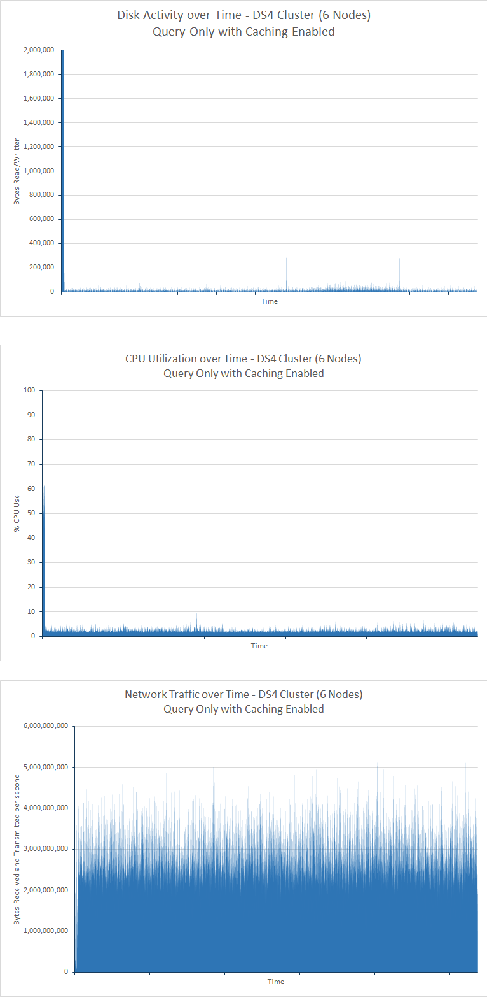

<properties
   pageTitle="Ottimizzazione delle prestazioni di aggregazione e query di dati con Elasticsearch su Azure | Microsoft Azure"
   description="Riepilogo delle considerazioni per l'ottimizzazione delle prestazioni delle query e di ricerca per Elasticsearch."
   services=""
   documentationCenter="na"
   authors="dragon119"
   manager="bennage"
   editor=""
   tags=""/>

<tags
   ms.service="guidance"
   ms.devlang="na"
   ms.topic="article"
   ms.tgt_pltfrm="na"
   ms.workload="na"
   ms.date="09/22/2016"
   ms.author="masashin"/>
   
# <a name="tuning-data-aggregation-and-query-performance-with-elasticsearch-on-azure"></a>Ottimizzazione delle prestazioni di aggregazione e query di dati con Elasticsearch su Azure

[AZURE.INCLUDE [pnp-header](../../includes/guidance-pnp-header-include.md)]

In questo articolo fa [parte di una serie](guidance-elasticsearch.md). 

Un motivo principale per l'uso di Elasticsearch consiste nel supportano le ricerche tra i dati. Gli utenti dovrebbero essere possibile individuare rapidamente le informazioni che stanno cercando. Inoltre, il sistema necessario consentire agli utenti di porre domande dei dati, correlazioni di ricerca e vengono forniti a conclusioni da utilizzare per decisioni aziendali. Questa elaborazione è a differenziare i dati dalle informazioni.

In questo documento sono riepilogate le opzioni che è possibile prendere in considerazione per determinare il modo migliore ottimizzare il sistema per le prestazioni di query e ricerca.

Suggerimenti relativi alle prestazioni tutti dipendono ampiamente gli scenari che si applicano in base alla situazione specifica, il volume di dati che viene eseguita l'indicizzazione e la frequenza con cui le applicazioni e i relativi utenti query sui dati. Verificare con attenzione i risultati di qualsiasi modifica nella configurazione o struttura indicizzazione utilizzando dati e carichi di lavoro per valutare i vantaggi per gli scenari specifici. A tale scopo, in questo documento viene anche un numero di benchmark eseguiti per uno scenario specifico implementato tramite configurazioni diverse. È possibile adattare la strategia adottata per valutare le prestazioni dei propri sistemi. I dettagli di questi test sono descritti nell' [Appendice](#appendix-the-query-and-aggregation-performance-test).

## <a name="index-and-query-performance-considerations"></a>Considerazioni sulle prestazioni di indice e query

In questa sezione descrive alcuni fattori comuni che è consigliabile valutare sulle quando la progettazione indicizza la necessità di supportare velocità di esecuzione di query e la ricerca.

### <a name="storing-multiple-types-in-an-index"></a>La memorizzazione di più tipi di un indice

Un indice Elasticsearch può contenere più tipi di. Può risultare più efficace evitare questo approccio e creare un indice distinto per ogni tipo. Tenere presente quanto segue:

- Diversi tipi possono specificare analisi diversi e non è sempre chiaro quale analizzatore Elasticsearch devono essere utilizzate se viene eseguita una query a livello di indice anziché a livello di tipo. Per informazioni dettagliate, vedere [Come evitare problemi individuati tipo](https://www.elastic.co/guide/en/elasticsearch/guide/current/mapping.html#_avoiding_type_gotchas) .

- Shards per gli indici che contengono più tipi di probabilmente sarà maggiore rispetto a quelle per gli indici che contengono un unico tipo. Più grande al condiviso, più complessa richiesta da Elasticsearch per filtrare i dati durante l'esecuzione di query.

- Se c'è significativa mancata corrispondenza tra i volumi di dati per i tipi di, informazioni per un tipo possono diventare distribuite scarsamente tra molti shards ridurre l'efficienza delle ricerche che recuperano dati.

    

    ***Gli effetti della condivisione di un indice tra tipi*** 

    Nella parte superiore del diagramma, lo stesso indice è condiviso da documenti del tipo A e b. tipo Sono disponibili molti documenti più di digitare un tipo di B. Cerca tipo verrà implicano l'invio di query quattro shards tutti. La parte inferiore del diagramma viene illustrato l'effetto se vengono creati indici distinti per ogni tipo. In questo caso, le ricerche per tipo verrà solo richiedono l'accesso a due shards.

- Piccolo shards può essere più equamente distribuito di shards di grandi dimensioni, semplificando la Elasticsearch distribuire il carico tra nodi.

- Tipi diversi potrebbero avere periodi di memorizzazione differenti. Può essere difficile da archiviare dati obsoleti che condivide shards con dati attivi.


Tuttavia, in alcuni casi la condivisione di un indice per i tipi di può essere efficiente se:

- Ricerche regolarmente comprendere i tipi di contenuti nello stesso indice.

- I tipi di contengono solo un numero limitato di documenti ogni. Se la gestione di un gruppo distinto di shards per ogni tipo può diventare un sovraccarico significativo in questo caso.


### <a name="optimizing-index-types"></a>Ottimizzazione dei tipi di indice

L'indice Elasticsearch contiene una copia dei documenti JSON originali che sono stati utilizzati per inserire al suo interno. Queste informazioni si tiene nel [* \_origine*](https://www.elastic.co/guide/en/elasticsearch/reference/current/mapping-source-field.html#mapping-source-field) campo di ogni elemento indicizzata. Questi dati non sono possibile eseguire la ricerca, ma per impostazione predefinita, viene restituiti dalla richieste *get* e *ricerca* . Tuttavia, questo campo riduzione e occupa spazio di archiviazione, rendere più grande shards e aumentare il volume dei / o eseguita. È possibile disabilitare la * \_origine* campo in base al tipo:

```http
PUT my_index
{
  "mappings": {
    "my_type": {
      "_source": {
        "enabled": false
      }
    }
  }
}
```
La disattivazione di questo campo rimuove anche la possibilità di eseguire le operazioni seguenti:

- L'aggiornamento dei dati nell'indice analitico utilizzando l' *aggiornamento* dell'API.

- Esecuzione di ricerche che restituiscono dati evidenziati.

- La reindicizzazione di un indice Elasticsearch direttamente a un altro.

- Modificare i mapping o le impostazioni di analisi.

- Il debug di query per visualizzare il documento originale.


### <a name="reindexing-data"></a>La reindicizzazione di dati

Il numero di shards disponibili per un indice determinazione della capacità dell'indice. È possibile eseguire un'ipotesi iniziale (e informata) in shards quanti devono avvenire, ma è sempre necessario prendere in considerazione la reindicizzazione strategia di documento. In molti casi, la reindicizzazione può essere un'attività prevista esigenze di dati. Non è consigliabile allocare inizialmente, un numero elevato di shards a un indice per l'ottimizzazione di ricerca, ma allocare nuovo shards come si espande il volume dei dati. In altri casi la reindicizzazione potrebbe essere necessario eseguire ulteriori scala cronologica reporting ad-hoc se le stime sull'aumento volume dei dati è sufficiente rivelino accurati.

> [AZURE.NOTE] La reindicizzazione potrebbe non essere necessaria per i dati che scadono rapidamente. In questo caso, un'applicazione potrebbe creare un nuovo indice per ogni periodo di tempo. Esempi includono registri di prestazioni o di controllo dati che possono essere archiviati in un indice aggiornato ogni giorno.

<!-- -->

La reindicizzazione in modo efficace comporta la creazione di un nuovo indice dai dati di uno precedente e quindi rimuovere l'indice precedente. Se indice è grande, questo processo può richiedere tempo e potrebbe essere necessario accertarsi che i dati rimangono che supportano le ricerche durante questo periodo. Per questo motivo, è necessario creare un [alias per ogni indice](https://www.elastic.co/guide/en/elasticsearch/reference/current/indices-aliases.html)e query devono recuperare dati tramite questi alias. Durante la reindicizzazione, mantenere l'alias che punta in corrispondenza dell'indice precedente e quindi sostituirla per fare riferimento al nuovo indice dopo la reindicizzazione è stata completata. Questo approccio è utile anche per accedere ai dati basate sul tempo che consente di creare un nuovo indice ogni giorno. Per accedere all'oggetto dati utilizzano un alias che attraversa sul nuovo indice come che è stata creata.

### <a name="managing-mappings"></a>Gestione di mapping

Elasticsearch utilizza mapping per determinare come interpretare i dati che si verifica in ogni campo in un documento. Il proprio il mapping, in modo efficace consente di definire uno schema per quel tipo di ogni tipo. Elasticsearch queste informazioni vengono utilizzate per generare invertiti indici per ogni campo nei documenti di un tipo. In qualsiasi documento di ogni campo abbia un tipo di dati (ad esempio, *stringa*, *Data*o *lungo*) e un valore. È possibile specificare i mapping di un indice quando viene creato prima di tutto l'indice o può essere dedotta mediante Elasticsearch quando vengono aggiunti a un tipo di nuovi documenti. Tuttavia, tenere presente quanto segue:

- Mapping generati in modo dinamico può provocare errori a seconda di come interpretare i campi quando i documenti vengono aggiunti a un indice. Ad esempio documento 1 potrebbe contenere un campo contenente un numero e cause Elasticsearch per aggiungere un mapping che specifica che questo campo è un *tempo*. Se viene aggiunto un documento successive A quale campo contiene dati non numerici, quindi avrà esito negativo. In questo caso, campo dovrebbe probabilmente viene interpretata come una stringa quando il primo documento è stato aggiunto. Specifica il mapping durante la creazione dell'indice può aiutare a evitare questi problemi.

- Progettare i documenti per evitare di generare i mapping eccessive come questo può aggiungere significativo sovraccarico durante l'esecuzione di ricerche, utilizzare grandi quantità di memoria e verificherà anche le query per non è possibile trovare dati. Adottare una convenzione di denominazione coerente per i campi nei documenti che condividono lo stesso tipo. Ad esempio, non usare i nomi dei campi, ad esempio "nome", "Nome" e "Cognome" in documenti diversi. Usare lo stesso nome di campo in ogni documento. Inoltre, non provare a usare i valori delle chiavi (questo è un approccio comune nel database di famiglia di colonna, ma possono causare errori ed efficiente con Elasticsearch.) Per ulteriori informazioni, vedere [Mapping esplosione](https://www.elastic.co/blog/found-crash-elasticsearch#mapping-explosion).

- Utilizzare *not_analyzed* per evitare la suddivisione in token quando opportuno. Se, ad esempio, un documento contiene un campo stringa denominato *dati* che contiene il valore "ABC definizione" potrebbe tenta di eseguire una ricerca di tutti i documenti che corrispondono a questo valore come indicato di seguito:

  ```http
  GET /myindex/mydata/_search
  {
    "query" : {
      "filtered" : {
        "filter" : {
          "term" : {
            "data" : "ABC-DEF"
          }
        }
      }
    }
  }
  ```

 Tuttavia, la ricerca avrà esito negativo restituire i risultati previsti a causa del modo in cui la stringa ABC definizione viene suddiviso in token quando verrà indicizzato. Si sarà in modo efficace suddiviso in due token, ABC e la definizione, dal trattino. Questa caratteristica è progettata per il supporto della ricerca full-text, ma se si desidera che la stringa verrà interpretato come un singolo elemento atomico è necessario disattivare la suddivisione in token quando il documento viene aggiunto all'indice. È possibile utilizzare un mapping, ad esempio seguente:

  ```http
  PUT /myindex
  {
    "mappings" : {
      "mydata" : {
        "properties" : {
          "data" : {
            "type" : "string",
            "index" : "not_analyzed"
          }
        }
      }
    }
  }
  ```

  Per ulteriori informazioni, vedere [Ricerca di valori esatti](https://www.elastic.co/guide/en/elasticsearch/guide/current/_finding_exact_values.html#_term_filter_with_text).


### <a name="using-doc-values"></a>Utilizzando i valori di documento

Numero di query e le aggregazioni richiedono che i dati vengono ordinati nell'ambito dell'operazione di ricerca. Ordinamento richiede la possibilità di eseguire il mapping uno o più termini a un elenco dei documenti. Per semplificare il processo, è possibile caricare Elasticsearch tutti i valori di un campo utilizzato come chiave di ordinamento in memoria. Queste informazioni sono noto come *fielddata*. Lo scopo è che la memorizzazione nella cache fielddata in memoria comporta i/o inferiore e potrebbe essere più rapido rispetto legge ripetutamente gli stessi dati da disco. Tuttavia, se dispone di un campo cardinalità elevata quindi archiviare il fielddata in memoria possono utilizzare molto spazio heap, eventualmente impatto la possibilità di eseguire altre operazioni simultanee o persino esaurimento dello spazio di archiviazione causa Elasticsearch l'esito negativo.

In alternativa, Elasticsearch supporta anche *i valori di documento*. Un valore di documento è simile a un elemento di fielddata in memoria, ad eccezione che viene archiviato nel disco rigido e creato quando vengono memorizzati in un indice (fielddata è stato creato in modo dinamico quando viene eseguita una query.) Documento valori non utilizzano spazio heap e pertanto sono utili per le query che ordina o aggregare i dati tra i campi che possono contenere numerosi valori univoci. Inoltre, la pressione ridotta heap può aiutare a offset le differenze di prestazioni tra il recupero dei dati dal disco e la lettura dalla memoria. È un'operazione che si verifichino poco e le altre operazioni concorrenti che utilizzano memoria sono meno probabile che siano effettuate.

Si attiva o disattiva i valori di documento alla scala cronologica in base alle proprietà in un indice analitico utilizzando l'attributo *doc_values* , come illustrato nell'esempio seguente:

```http
PUT /myindex
{
  "mappings" : {
    "mydata" : {
      "properties" : {
        "data" : {
          ...
          "doc_values": true
        }
      }
    }
  }
}
```
> [AZURE.NOTE] I valori di documento sono abilitati per impostazione predefinita con Elasticsearch versione 2.0.0 in poi.

L'esatta impatto dell'utilizzo di valori di documento problema può essere molto specifici per i proprio scenari di utilizzo dei dati e query, è necessario prepararsi a eseguire la verifica delle prestazioni per stabilire la loro utilità. Si noti inoltre che doc valori non funzionano con campi di tipo stringa analizzati. Per ulteriori informazioni, vedere [I valori di documento](https://www.elastic.co/guide/en/elasticsearch/guide/current/doc-values.html#doc-values).

### <a name="using-replicas-to-reduce-query-contention"></a>Utilizzo di repliche per ridurre il conflitto di query

Una strategia per migliorare le prestazioni delle query comune consiste nel creare repliche molti degli indici. Le operazioni di recupero dati possono essere soddisfatti da recuperare i dati da una replica. Tuttavia, questa strategia può notevolmente sulle prestazioni di esecuzione delle operazioni di acquisizione di dati, pertanto deve essere utilizzata con cautela negli scenari che implicano carichi di lavoro misti. Inoltre, questa strategia è solo di vantaggio se repliche distribuite in nodi e non sono in conflitto per le risorse con shards principale che fanno parte dello stesso indice. Tenere presente che è possibile aumentare o ridurre il numero di repliche per un indice in modo dinamico.

### <a name="using-the-shard-request-cache"></a>Utilizzo della cache di richiesta condiviso

Elasticsearch possibile memorizzare i dati locali richiesti dalle query su ogni condiviso in memoria. Questo ricerche consente di recuperare gli stessi dati da eseguire più rapidamente, è possono leggere dati dallo spazio di archiviazione di memoria anziché su disco. La memorizzazione nella cache dei dati in questo modo possono pertanto migliorare le prestazioni di alcune operazioni di ricerca, al costo di ridurre la memoria disponibile per le altre attività vengano eseguite contemporaneamente. È inoltre disponibile il rischio di dati sia served dalla cache non è aggiornato. I dati nella cache sono invalidati solo quando viene aggiornata la condiviso e i dati sono stata modificata. Specificare la frequenza degli aggiornamenti è dettata dal valore dell'impostazione *refresh_interval* dell'indice.

Richiesta di memorizzazione nella cache per un indice è disattivata per impostazione predefinita, ma è possibile abilitare come indicato di seguito:

```http
PUT /myindex/_settings
{
  "index.requests.cache.enable": true
}
```

La cache di richiesta condiviso è più adatta per le informazioni che rimangono relativamente statiche, ad esempio dati cronologici o registrazione.

### <a name="using-client-nodes"></a>Utilizzo dei nodi client

Tutte le query vengono elaborate dal nodo che riceve la richiesta. Il nodo invia ulteriormente richieste per tutti gli altri nodi contenente shards per gli indici sottoposto a query e quindi sono indicati i risultati per restituire la risposta. Se una query a altro comporta l'aggregazione dei dati o l'esecuzione di calcoli complessi, il nodo iniziale è responsabile per l'esecuzione di elaborazione appropriata. Se nel sistema è disponibile per il supporto di un numero relativamente basso di query complesse, considerare la creazione di un pool di client nodi per ridurre il carico dei nodi di dati. Invece il sistema è necessario gestire un numero elevato di query semplici, quindi inviare tali richieste diretto per i nodi di dati e utilizzano un bilanciamento del carico per distribuire le richieste in modo uniforme.

### <a name="tuning-queries"></a>Ottimizzazione delle query

I seguenti punti di riepilogano i suggerimenti per ottimizzare le prestazioni delle query Elasticsearch:

- Evitare di query che includono i caratteri jolly laddove possibile.

- Se lo stesso campo è soggetto a full-text ricerca ed esatta corrispondenza, è possibile archiviare i dati per il campo nei moduli per analizzare e nonanalyzed. Eseguire ricerche full-text il campo analizzato e corrispondenze esatte il campo nonanalyzed.

- Restituire solo i dati necessari. Se si dispone di documenti di grandi dimensioni, ma un'applicazione richiede solo le informazioni contenute in un sottoinsieme dei campi, restituire questo sottoinsieme dalla query piuttosto che interi documenti. Questa strategia è possibile ridurre i requisiti di larghezza di banda di rete del cluster.

- Se possibile, utilizzare i filtri invece di query quando si cercano dati. Un filtro semplicemente determina se un documento corrisponde a un determinato criterio mentre in una query calcola anche come una corrispondenza approssimativa un documento è (punteggio). Internamente, i valori generati da un filtro vengono memorizzati come bitmap che indica di corrispondenza per ogni documento corrispondenza/no e possono essere memorizzati da Elasticsearch. Se il criterio di filtro stesso si verifica successivamente, l'immagine bitmap può essere recuperata dalla cache e utilizzata per recuperare rapidamente i documenti corrispondenti. Per ulteriori informazioni, vedere [Operazione filtro interna](https://www.elastic.co/guide/en/elasticsearch/guide/current/_finding_exact_values.html#_internal_filter_operation).

- Utilizzare filtri *bool* per eseguire confronti statici e solo *e* *o*filtri e *non* per i filtri calcolati in modo dinamico, ad esempio quelli che includono gli script o il *geografico -\* * filtri.

- Se una query combina i filtri *bool* con *e*, *o*, o *meno* con *geografico -* * filtri, posizionare il *e*/*o*/*geografico-* * filtri ultima in modo che opera sul più piccolo possibile di set di dati.

    Analogamente, utilizzare un *post_filter* per eseguire le operazioni di filtro costosa. Questi filtri verranno eseguiti ultimo.

- Utilizzare le aggregazioni anziché facet. Evitare di calcolare le aggregazioni da analizzare o che dispone di molti valori possibili.

    > **Nota**: facet sono state rimosse in Elasticsearch versione 2.0.0.

- Usare l'aggregazione di *cardinalità* anziché l'aggregazione *value_count* a meno che l'applicazione richiede un numero esatto di oggetti corrispondenti. Un numero esatto può diventare rapidamente non aggiornato e molte applicazioni richiedono solo una buona approssimazione.

- Evitare gli script. Script di query e filtri può essere costoso e i risultati non sono memorizzati nella cache. Script di esecuzione prolungata possono utilizzare thread di ricerca tempo indefinito, causando successive richieste da accodare. Se coda si riempie, ulteriormente richieste verranno rifiutate.

## <a name="testing-and-analyzing-aggregation-and-search-performance"></a>Test e analisi delle prestazioni di aggregazione e ricerca

In questa sezione vengono descritti i risultati di una serie di test eseguiti per cluster diversi e configurazioni di indice. Due tipi di test sono stati eseguiti, come indicato di seguito:

- *Progettazione query e * *l'acquisizione* test * *. Il test avviato con un indice non è stato inserito come il test completata eseguendo le operazioni di inserimento in blocco (ogni operazione aggiunto 1000 documenti). Allo stesso tempo un numero di query progettate per cercare documenti aggiunti durante il periodo di 15 minuti precedente e generare aggregazioni sono stato ripetuto 5 intervalli secondi. Questo test è stato in genere è possibile eseguire per 24 ore, per riprodurre gli effetti di un carico di lavoro complesso comprendenti acquisizione di dati su larga scala con accanto alla query in tempo reale.

- **La *query di sola* test**. Questo test è simile al *acquisizione e query* verificare ad eccezione del fatto che viene omesso la parte di acquisizione e l'indice su ciascun nodo viene prepopolato con 100 milioni di documenti. Viene eseguito un insieme di query modificato. i dati a questo punto era statici è stato rimosso l'elemento ora limitazione dei documenti da quelli aggiunti negli ultimi 15 minuti. È stato eseguito il test per 90 minuti, quindi è meno tempo necessario per definire uno schema prestazioni a causa di importo fisso di dati.

---

Ogni documento nell'indice ha lo stesso schema. In questa tabella vengono riepilogati i campi nello schema di:

Nome                          | Tipo         | Note |
  ----------------------------- | ------------ | -------------------------------------------------------- |
  Organizzazione                  | Stringa      | Il test genera 200 organizzazioni univoche. |
  CustomField1 - CustomField5   |Stringa       |Si tratta di cinque campi stringa impostati su una stringa vuota.|
  DateTimeRecievedUtc           |Timestamp    |Data e ora in cui è stato aggiunto il documento.|
  Host                          |Stringa       |In questo campo è impostato su una stringa vuota.|
  HttpMethod                    |Stringa       |In questo campo è impostato su uno dei seguenti valori: "POST", "OTTIENI", "Inserire".|
  HttpReferrer                  |Stringa       |In questo campo è impostato su una stringa vuota.|
  HttpRequest                   |Stringa       |In questo campo viene popolato con testo casuali lunghezza compresa tra 10 e 200 caratteri.|
  HttpUserAgent                 |Stringa       |In questo campo è impostato su una stringa vuota.|
  HttpVersion                   |Stringa       |In questo campo è impostato su una stringa vuota.|
  NomeOrganizzazione              |Stringa       |In questo campo è impostato sullo stesso valore nel campo organizzazione.|
  SourceIp                      |INDIRIZZI IP           |Questo campo contiene un indirizzo IP che indica "origine" dei dati. |
   SourceIpAreaCode              |Lungo         |In questo campo è impostato su 0.|
  SourceIpAsnNr                 |Stringa       |In questo campo è impostato su "AS\#\#\#\#\#".|
  SourceIpBase10                |Lungo         |In questo campo è impostato su 500.|
  SourceIpCountryCode           |Stringa       |Questo campo contiene un codice paese carattere 2. |
  SourceIpCity                  |Stringa       |Questo campo contiene una stringa che identifica una città in un paese. |
  SourceIpLatitude              |Effettuare un doppio       |Questo campo contiene un valore casuale.|
  SourceIpLongitude             |Effettuare un doppio       |Questo campo contiene un valore casuale.|
  SourceIpMetroCode             |Lungo         |In questo campo è impostato su 0.|
  SourceIpPostalCode            |Stringa       |In questo campo è impostato su una stringa vuota.|
  SourceLatLong                 |Punto geografico   |In questo campo è impostato su un punto geografico casuali.|
  PortaOrigine                    |Stringa       |In questo campo viene popolato con la rappresentazione di un numero casuale.|
  TargetIp                      |INDIRIZZI IP           |Questo viene popolato con un indirizzo IP casuale nell'intervallo 0.0.100.100 a 255.9.100.100.|
  SourcedFrom                   |Stringa       |In questo campo è impostato sulla stringa "MonitoringCollector".|
  TargetPort                    |Stringa       |In questo campo viene popolato con la rappresentazione di un numero casuale.|
  Valutazione                        |Stringa       |In questo campo viene popolato con uno dei valori stringa diversi 20 selezionati in modo casuale.|
  UseHumanReadableDateTimes     |Valore booleano      |In questo campo è impostato su false.|
 
Query seguenti sono state eseguite in batch per ogni iterazione di test. Per fare riferimento a queste query nella parte restante di questo documento vengono utilizzati i nomi in corsivo. Si noti che il criterio di tempo (documenti aggiunti negli ultimi 15 minuti) sono stati omessi dalla *query di sola* test:

- Il numero di documenti con ogni valore di *classificazione* è stati immessi negli ultimi 15 minuti (*conteggio dalla valutazione*)? 

- Il numero di documenti è stati aggiunti in ogni intervallo di 5 minuti in 15 minuti (*conteggio nel tempo*)?

- Il numero di documenti di ogni valore di *classificazione* è state aggiunte per ogni paese negli ultimi 15 minuti (*accessi in base al paese*)?

- Le 15 organizzazioni si verificano la maggior parte dei documenti frequentemente in aggiunto negli ultimi 15 minuti (*15 superiore organizzazioni*)?

- Quanti diverse organizzazioni si verificano in documenti aggiunti negli ultimi 15 minuti (*organizzazioni conteggio univoche*)?

- Il numero di documenti è stati aggiunti negli ultimi 15 minuti (*Totale richieste count*)?

- Il numero di valori *SourceIp* diversi si verifica in documenti aggiunti negli ultimi 15 minuti (*conteggio IP univoco*)?


La definizione dell'indice e i dettagli delle query sono strutturati in [Appendice](#appendix-the-query-and-aggregation-performance-test).

I test sono stati progettati per comprendere gli effetti delle variabili seguenti:

- **Tipo di disco**. Test sono stati eseguiti in un cluster di 6 nodi di macchine virtuali D4 spazio di archiviazione standard (dischi rigidi) e vengono ripetuti in un cluster di 6 nodi di macchine virtuali DS4 mediante archiviazione premium (SSDs).

- **Le dimensioni del computer - scalabilità**. Test sono stati eseguiti in un cluster di 6 nodi comprendente macchine virtuali DS3 (designato come *piccolo* cluster), verranno ripetuti in un cluster di macchine virtuali DS4 (cluster *medio* ) e ripetizione in un cluster di computer DS14 (cluster *grande* ). Nella tabella seguente vengono riepilogate le caratteristiche chiave di ogni SKU VM:

 Cluster | SKU MACCHINE VIRTUALI        | Numero di core | Numero di dischi di dati | (GB) DI RAM |
---------|---------------|-----------------|----------------------|----------|
 Piccolo   | DS3 standard  | 4               | 8                    | 14       |
 Media  | DS4 standard  | 8               | 16                   | 28       |
 Grande   | DS14 standard | 16              | 32                   | 112      |

- **Dimensione cluster - scalabilità**. Prove su cluster di macchine virtuali di DS14 contenenti 1, 3 e 6 nodi.

- **Numero di indice repliche**. Test sono stati eseguiti mediante degli indici configurati con 1 e 2.

- **I valori di documento**. Inizialmente le prove sono state eseguite con l'indice impostazione *doc_values* impostato su *true* (valore predefinito). Test selezionati sono stati ripetuti con *doc_values* impostato su *false*.

- **La memorizzazione nella cache**. Test sono stati condotti con la cache di richiesta condiviso attivata per l'indice.

- **Numero di shards**. Test sono stati ripetuti con numeri variabili di shards per stabilire se le query è stato eseguito in modo più efficiente attraverso indici contenente un numero minore di grandi dimensioni shards o shards più di piccole dimensioni.


## <a name="performance-results---disk-type"></a>Risultati delle prestazioni - tipo di disco

Le prestazioni del disco è stata valutata eseguendo il test di *acquisizione e query* cluster nodo 6 di macchine virtuali D4 (con dischi rigidi) e al cluster nodo 6 di macchine virtuali di DS4 (con SSDs). La configurazione di Elasticsearch in entrambi i cluster era lo stesso. I dati è stata distribuiti su 16 dischi su ciascun nodo e ogni nodo aveva 14GB di RAM assegnata a esecuzione Elasticsearch Java virtual machine (JVM), la memoria rimanente (anche 14GB) è stata lasciata per l'utilizzo del sistema operativo. Ogni test è stato eseguito per 24 ore. Per abilitare gli effetti del volume crescente di dati per evidente e per consentire al sistema di stabilizzare è stato selezionato questo periodo. Nella tabella seguente vengono riepilogati i risultati evidenziando i tempi di risposta di varie operazioni che costituiscono il test.

 Cluster | Operazione/query            | Tempo medio di risposta (ms) |
---------|----------------------------|----------------------------|
 D4      | Acquisizione                  | 978                        |
         | Contare in base alla classificazione            | 103                        |
         | Conteggio del tempo            | 134                        |
         | Visite per paese            | 199                        |
         | Primi 15 organizzazioni       | 137                        |
         | Organizzazioni conteggio univoche | 139                        |
         | Conteggio IP univoco            | 510                        |
         | Conteggio di visite totali           | 89                         |
 DS4     | Acquisizione                  | 511                        |
         | Contare in base alla classificazione            | 187                        |
         | Conteggio del tempo            | 411                        |
         | Visite per paese            | 402                        |
         | Primi 15 organizzazioni       | 307                        |
         | Organizzazioni conteggio univoche | 320                        |
         | Conteggio IP univoco            | 841                        |
         | Conteggio di visite totali           | 236                        |

Prima vista apparirà cluster DS4 eseguire query minore rispetto a cluster D4, a volte duplicazione (o peggiore) e il tempo di risposta. Questa operazione non per capire attraverso. La tabella seguente mostra il numero di operazioni di acquisizione eseguite da ogni cluster (ricordare che ogni operazione carica documenti 1000):

 Cluster | Conteggio delle operazioni di acquisizione |
---------|---------------------------|
 D4      | 264769                    |
 DS4     | 503157                    |

Cluster DS4 è stato possibile caricare quasi doppio dei dati rispetto a cluster D4 durante la prova. Di conseguenza, l'analisi dei tempi di risposta per ogni operazione, è necessario prendere in considerazione il numero di documenti ogni query deve eseguire la scansione e vengono restituito il numero di documenti. Si tratta figure dinamiche secondo continuamente e aumenta il volume di documenti nell'indice analitico. Non è possibile dividere semplicemente 264769 503137 (il numero di operazioni di acquisizione eseguite da ogni cluster) e quindi moltiplicare il risultato per il tempo di risposta medio per ogni query eseguita dal cluster D4 per assegnare un comparativi informazioni come che ignora la quantità dei / o viene eseguita contemporaneamente dall'operazione di acquisizione. Se, tuttavia, occorre misurare la quantità di dati su cui scrivere fisica e leggere dal disco durante il test. Il piano di test JMeter acquisisce queste informazioni per ogni nodo. I risultati di riepilogati sono:

 Cluster | Media byte lettura/scrittura da ogni operazione |
---------|----------------------------------------------|
 D4      | 13471557                                     |
 DS4     | 24643470                                     |

Questi dati mostrano che il cluster DS4 stato in grado di sostenere un tasso dei / o circa 1,8 volte che cluster D4. Dato che, ad eccezione di natura dei dischi, tutte le altre risorse sono gli stessi, la differenza deve essere causato dall'utilizzo SSDs invece dischi rigidi.

Per informazioni su come giustificare tale conclusione, i grafici seguenti viene illustrato come i/o è stata eseguita nel tempo da ogni cluster:


<!-- -->

***Attività del disco per i cluster D4 e DS4***

Il grafico per il cluster D4 Mostra variante significativo, in particolare durante la prima metà del test. Si tratta probabilmente a causa di limitazioni per ridurre la velocità dei / o. In fasi iniziali del test, le query in grado di eseguire velocemente di quanto accade piccola dati da analizzare. I dischi in cluster D4 pertanto sono probabilmente operativo Chiudi per le operazioni di ingresso/uscita per seconda capacità (IOPS), anche se ogni operazione i/o potrebbe non restituire quantità di dati. Il cluster DS4 in grado di supportare una velocità IOPS superiore e non può essere lo stesso livello di limitazione, le tariffe i/o più regolare. Per supportare questa teoria, la coppia di grafici successiva mostra come la CPU è stata bloccata dal disco nel tempo (i tempi di attesa disco visualizzati nei grafici sono la percentuale di tempo che la CPU trascorsa in attesa per i/o):


***Disco CPU tempi per i cluster D4 e DS4 di attesa***

È importante tenere presente che esistono due motivi principali per le operazioni dei / o bloccare la CPU:

- Sottosistema i/o impossibile la lettura o la scrittura dei dati in o da disco.

- Impossibile limitato sottosistema i/o dall'ambiente host. Azure dischi implementati tramite dischi rigidi una velocità massima di 500 IOPS e di SSDs avere una velocità massima di 5000 IOPS.


Per cluster D4 la quantità di tempo trascorso in attesa per i/o durante la prima metà correlata test strettamente in modo invertito con il grafico che mostra le tariffe i/o. Periodi dei / o bassa corrispondono ai periodi di tempo CPU per bloccati, significa che i/o viene limitata. Durante la maggiore quantità di dati viene aggiunta al cluster la situazione cambia e nella seconda metà dei picchi test i/o i tempi di attesa corrispondono con picchi della velocità di esecuzione dei / o. A questo punto, la CPU è bloccata durante l'esecuzione dei / o reale. Anche con cluster DS4 il tempo di attesa per i/o è molto più pari. Ogni punta corrisponde a un picco equivalente prestazioni i/o anziché un ventre, ciò significa che si è minima o nessuna limitazione si verifichi.

Esiste un altri fattori da prendere in considerazione. Durante la prova cluster D4 generato 10584 errori di acquisizione e 21 errori di query. Il test cluster DS4 non prodotto errori.

## <a name="performance-results---scaling-up"></a>Risultati delle prestazioni - scalabilità

Scalabilità test è stato eseguito eseguendo test 6 nodi di DS3, DS4 e macchine virtuali DS14. Queste SKU selezionate perché una macchina virtuale DS4 fornisce due volte molti core CPU e memoria come un DS3 e una macchina DS14 Double nuovamente le risorse della CPU fornendo quattro volte la quantità di memoria. Nella tabella seguente contiene un confronto di aspetti di ogni SKU:

 SKU  | \#Core CPU | Memoria (GB) | Disco max IOPS | Larghezza di banda massima (MB/s)|
------|-------------|-------------|---------------|--------------|
 DS3  | 4           | 14          | 12,800| 128 |
 DS4  | 8           | 28          | 25,600| 256 |
 DS14 | 16          | 112         | 50.000| 512 |

Nella tabella seguente vengono riepilogati i risultati dell'esecuzione di test su piccola (DS3), medio (DS4) e cluster di grandi dimensioni (DS14). Ogni macchina virtuale utilizzato SSDs per la memorizzazione dei dati. Ogni test è stato eseguito per 24 ore.

La tabella riporta il numero di richieste completate per ogni tipo di query (errori non vengono inclusi). Il numero di richieste tentate per ogni tipo di query è approssimativamente uguali durante l'esecuzione del test. Ciò avviene perché il piano di test JMeter esegue una singola occorrenza di ogni query (conteggio dalla valutazione, conteggio sopra ora, accessi per paese, Top 15 organizzazioni, univoco alle organizzazioni di conteggio, conteggio IP univoche e accessi totale) insieme in una sola unità nota come una *transazione test* (questa operazione è indipendente dell'attività che esegue l'operazione di acquisizione, viene eseguita da un thread separato). Ogni iterazione del piano di test esegue una transazione singolo test. Il numero delle transazioni di test completate è una misura tempo di risposta della query più lenta in ogni transazione.

| Cluster      | Operazione/query            | Numero di richieste | Tempo medio di risposta (ms) |
|--------------|----------------------------|--------------------|----------------------------|
| Piccolo (DS3)  | Acquisizione                  | 207284             | 3328                       |
|              | Contare in base alla classificazione            | 18444              | 268                        |
|              | Conteggio del tempo            | 18444              | 340                        |
|              | Visite per paese            | 18445              | 404                        |
|              | Primi 15 organizzazioni       | 18439              | 323                        |
|              | Organizzazioni conteggio univoche | 18437              | 338                        |
|              | Conteggio IP univoco            | 18442              | 468                        |
|              | Conteggio di visite totali           | 18428              | 294   
|||||
| Media (DS4) | Acquisizione                  | 503157             | 511                        |
|              | Contare in base alla classificazione            | 6958               | 187                        |
|              | Conteggio del tempo            | 6958               | 411                        |
|              | Visite per paese            | 6958               | 402                        |
|              | Primi 15 organizzazioni       | 6958               | 307                        |
|              | Organizzazioni conteggio univoche | 6956               | 320                        |
|              | Conteggio IP univoco            | 6955               | 841                        |
|              | Conteggio di visite totali           | 6958               | 236                        |
|||||
| Grande (DS14) | Acquisizione                  | 502714             | 511                        |
|              | Contare in base alla classificazione            | 7041               | 201                        |
|              | Conteggio del tempo            | 7040               | 298                        |
|              | Visite per paese            | 7039               | 363                        |
|              | Primi 15 organizzazioni       | 7038               | 244                        |
|              | Organizzazioni conteggio univoche | 7037               | 283                        |
|              | Conteggio IP univoco            | 7037               | 681                        |
|              | Conteggio di visite totali           | 7038               | 200                        |

Questi dati mostrano che, per questo test, le prestazioni del cluster DS4 e DS14 sono state adeguatamente simili. I tempi di risposta per le operazioni di query per il cluster DS3 vengono visualizzate anche per confrontare favorevole inizialmente e il numero di operazioni di query è molto che superano i valori per il cluster DS4 e DS14. Tuttavia, uno opportuno dedicare sicuro avviso della velocità di acquisizione e conseguente numero di documenti viene effettuata la ricerca. Cluster DS3 è molto più vincolato acquisizione e al termine del test il database contenuto solo circa il 40% dei documenti di lettura ognuna delle due cluster. Si tratta di potrebbe dipendere da risorse di elaborazione, rete e disco della larghezza di banda disponibile per una macchina virtuale DS3 rispetto a un DS4 o macchine Virtuali DS14. Dato che una macchina virtuale DS4 ha due volte molte risorse disponibili come una macchina virtuale DS3 e un DS14 presenta due volte (quattro volte per memoria) le risorse di una macchina virtuale DS4, una domanda rimane: perché è la differenza tra i cluster DS4 e DS14 tassi di acquisizione notevolmente inferiore a quello che si verifica tra i gruppi DS3 e DS4? Ciò potrebbe essere dovuto l'utilizzo della rete e limiti di larghezza di banda di macchine virtuali di Azure. Nelle immagini seguenti mostrano questi dati per tutti i tre cluster:


**Utilizzo della rete per i cluster DS3, DS4 e DS14 eseguire il test di acquisizione e query** 

<!-- -->

I limiti della larghezza di banda di rete disponibili con macchine virtuali di Azure non sono pubblicati e possono variare, ma il fatto che attività di rete verrà visualizzato hanno livellata una media di circa 2.75GBps per entrambe le DS4 e DS14 test suggerisce che tale limite è stato raggiunto ed è diventato il fattore principale limitazione effettiva. Nel caso di cluster DS3 l'attività di rete è stato notevolmente inferiore in modo che le prestazioni inferiore ha più probabilità a causa di vincoli di disponibilità di altre risorse.

Per individuare gli effetti delle operazioni di acquisizione e viene illustrato come le prestazioni delle query variano come nodi scalare, un set di test solo query eseguito con gli stessi nodi. Nella tabella seguente vengono riepilogati i risultati ottenuti in ogni cluster:

> [AZURE.NOTE] Non si deve confrontare le prestazioni e il numero di richieste eseguite dalle query la *query di sola* test con quelli eseguire il test di *acquisizione e query* . Ciò avviene perché le query sono state modificate e il volume di documenti correlati è diverso.

| Cluster      | Operazione/query            | Numero di richieste | Calcolare la media di risposta Ttme (ms) |
|--------------|----------------------------|--------------------|----------------------------|
| Piccolo (DS3)  | Contare in base alla classificazione            | 464                | 11758                      |
|              | Conteggio del tempo            | 464                | 14699                      |
|              | Visite per paese            | 463                | 14075                      |
|              | Primi 15 organizzazioni       | 464                | 11856                      |
|              | Organizzazioni conteggio univoche | 462                | 12314                      |
|              | Conteggio IP univoco            | 461                | 19898                      |
|              | Conteggio di visite totali           | 462                | 8882  
|||||
| Media (DS4) | Contare in base alla classificazione            | 1045               | 4489                       |
|              | Conteggio del tempo            | 1045               | 7292                       |
|              | Visite per paese            | 1053               | 7564                       |
|              | Primi 15 organizzazioni       | 1055               | 5066                       |
|              | Organizzazioni conteggio univoche | 1051               | 5231                       |
|              | Conteggio IP univoco            | 1051               | 9228                       |
|              | Conteggio di visite totali           | 1051               | 2180                       |
|||||
| Grande (DS14) | Contare in base alla classificazione            | 1842               | 1927                       |
|              | Conteggio del tempo            | 1839               | 4483                       |
|              | Visite per paese            | 1838               | 4761                       |
|              | Primi 15 organizzazioni       | 1842               | 2117                       |
|              | Organizzazioni conteggio univoche | 1837               | 2393                       |
|              | Conteggio IP univoco            | 1837               | 7159                       |
|              | Conteggio di visite totali           | 1837               | 642                        |

In questo caso, le tendenze nei tempi di risposta medio tra diversi cluster è più chiara. Utilizzo della rete è molto di sotto 2.75GBps richiesti in precedenza da cluster DS4 e DS14 (che probabilmente saturazione della rete i test di acquisizione e query) e 1.5GBps per il cluster DS3. Infatti, è più vicino 200MBps in tutti i casi illustrata nelle immagini seguenti:


***Utilizzo di DS3, rete cluster DS4 e DS14 eseguire il test solo query*** 

Limitazione dei cluster DS3 e DS4 ora sembra utilizzo della CPU, ossia quasi al 100% per la maggior parte dei casi. Nella DS14 l'utilizzo della CPU cluster medie oltre 80%. Elevato, ma chiaramente in evidenza i vantaggi derivanti core CPU disponibili. Nella figura seguente illustra i modelli di utilizzo della CPU per i cluster DS3, DS4 e DS14.


***Utilizzo della CPU per i cluster DS3 e DS14 eseguire il test solo query*** 

## <a name="performance-results---scaling-out"></a>Risultati delle prestazioni - scalabilità

Per illustrare come il sistema scala indietro con il numero dei nodi, test utilizzando cluster DS14 contenenti 1, 3 e 6 nodi. In questo caso, solo le *query di sola* test è stato eseguito utilizzando 100 milioni di documenti e l'esecuzione di 90 minuti:

| Cluster | Operazione/query            | Numero di richieste | Tempo medio di risposta (ms) |
|---------|----------------------------|--------------------|----------------------------|
| 1 nodo  | Contare in base alla classificazione            | 288                | 6216                       |
|         | Conteggio del tempo            | 288                | 28933                      |
|         | Visite per paese            | 288                | 29455                      |
|         | Primi 15 organizzazioni       | 288                | 9058                       |
|         | Organizzazioni conteggio univoche | 287                | 19916                      |
|         | Conteggio IP univoco            | 284                | 54203                      |
|         | Conteggio di visite totali           | 287                | 3333                       |
|||||
| 3 nodi | Contare in base alla classificazione            | 1194               | 3427                       |
|         | Conteggio del tempo            | 1194               | 5381                       |
|         | Visite per paese            | 1191               | 6840                       |
|         | Primi 15 organizzazioni       | 1196               | 3819                       |
|         | Organizzazioni conteggio univoche | 1190               | 2938                       |
|         | Conteggio IP univoco            | 1189               | 12516                      |
|         | Conteggio di visite totali           | 1191               | 1272                       |
|||||
| 6 nodi | Contare in base alla classificazione            | 1842               | 1927                       |
|         | Conteggio del tempo            | 1839               | 4483                       |
|         | Visite per paese            | 1838               | 4761                       |
|         | Primi 15 organizzazioni       | 1842               | 2117                       |
|         | Organizzazioni conteggio univoche | 1837               | 2393                       |
|         | Conteggio IP univoco            | 1837               | 7159                       |
|         | Conteggio di visite totali           | 1837               | 642                        |

Il numero dei nodi rende notevolmente le prestazioni delle query del cluster, anche se in modo non lineare. Cluster 3 nodo completa circa 4 volte lo stesso numero query come cluster singolo nodo, mentre il cluster 6 nodo gestisce 6 ore come molti. Per spiegare questo non linearità, i grafici seguenti mostrano come la CPU è stata utilizzata da tre cluster:


***Utilizzo della CPU per 1, 3 e 6 nodi esecuzione del test solo query***

I cluster singolo nodo e 3 sono associate alla CPU, durante l'utilizzo della CPU è elevato cluster nodo 6 è disponibile la capacità di elaborazione. In questo caso, altri fattori sono probabilmente essere limitando la produttività. Potrebbe essere confermata verificando con nodi 9 e 12, in cui viene probabilmente mostrato ulteriormente la capacità di elaborazione.

I dati nella tabella precedente mostrano anche come possono variare i tempi di risposta medio per le query. Questo è l'elemento a cui è maggiori durante la verifica scalabilità di un sistema per specifici tipi di query. Alcune ricerche risultano chiaramente molto più efficiente che interessano più nodi rispetto ad altri. È possibile che la il rapporto tra il numero dei nodi e il numero di documenti nel cluster crescente, ogni cluster contenuti 100 milioni di documenti. Durante l'esecuzione di ricerche che includono aggregazioni di dati, Elasticsearch verrà elaborare e buffer dati recuperati come parte del processo di aggregazione in memoria in ogni nodo. Se sono presenti più nodi, è minore quantità di dati per recuperare, buffer ed elaborare su ciascun nodo.

## <a name="performance-results---number-of-replicas"></a>Risultati delle prestazioni - numero di repliche

*L'acquisizione e query* test un indice con una singola replica. Il test sono stati ripetuti sui cluster di DS4 e DS14 6 nodo utilizza un indice configurato con due. Tutti i test è stato eseguito per 24 ore. Nella tabella seguente mostra i risultati comparativi per replica "uno" e due:

| Cluster | Operazione/query            | Tempo medio di risposta (ms) - 1 replica | Tempo medio di risposta (ms) - 2 repliche | % discordanza tempi di risposta |
|---------|----------------------------|----------------------------------------|-----------------------------------------|-------------------------------|
| DS4     | Acquisizione                  | 511                                    | 655                                     | + 28%                          |
|         | Contare in base alla classificazione            | 187                                    | 168                                     | -10%                          |
|         | Conteggio del tempo            | 411                                    | 309                                     | -25%                          |
|         | Visite per paese            | 402                                    | 562                                     | + 40%                          |
|         | Primi 15 organizzazioni       | 307                                    | 366                                     | + 19%                          |
|         | Organizzazioni conteggio univoche | 320                                    | 378                                     | + 18%                          |
|         | Conteggio IP univoco            | 841                                    | 987                                     | + 17%                          |
|         | Conteggio di visite totali           | 236                                    | 236                                     | + 0%                           |
||||||
| DS14    | Acquisizione                  | 511                                    | 618                                     | + 21%                          |
|         | Contare in base alla classificazione            | 201                                    | 275                                     | + 37%                          |
|         | Conteggio del tempo            | 298                                    | 466                                     | + 56%                          |
|         | Visite per paese            | 363                                    | 529                                     | + 46%                          |
|         | Primi 15 organizzazioni       | 244                                    | 407                                     | + 67%                          |
|         | Organizzazioni conteggio univoche | 283                                    | 403                                     | + 42%                          |
|         | Conteggio IP univoco            | 681                                    | 823                                     | + 21%                          |
|         | Conteggio di visite totali           | 200                                    | 221                                     | + 11%                          |

Il tasso di acquisizione ridotta come il numero di repliche maggiore. Questa operazione deve essere previsti Elasticsearch scrittura più copie di ogni documento, di generare i/o disco.  Viene visualizzata i grafici per il cluster DS14 per gli indici con 1 e 2 riproduzioni mostrate nell'immagine seguente. Nel caso di indice con 1 replica, la velocità media i/o è stato 16896573 byte/secondo. Per l'indice con 2, la velocità media i/o è stato 33986843 byte/secondo solo su due volte come molti.


***Tariffe disco per i nodi con 1 e 2 eseguire il test di acquisizione e query***

| Cluster | Query                      | Tempo medio di risposta (ms) - 1 replica | Tempo medio di risposta (ms) - 2 repliche |
|---------|----------------------------|----------------------------------------|-----------------------------------------|
| DS4     | Contare in base alla classificazione            | 4489                                   | 4079                                    |
|         | Conteggio del tempo            | 7292                                   | 6697                                    |
|         | Visite per paese            | 7564                                   | 7173                                    |
|         | Primi 15 organizzazioni       | 5066                                   | 4650                                    |
|         | Organizzazioni conteggio univoche | 5231                                   | 4691                                    |
|         | Conteggio IP univoco            | 9228                                   | 8752                                    |
|         | Conteggio di visite totali           | 2180                                   | 1909                                    |
|||||
| DS14    | Contare in base alla classificazione            | 1927                                   | 2330                                    |
|         | Conteggio del tempo            | 4483                                   | 4381                                    |
|         | Visite per paese            | 4761                                   | 5341                                    |
|         | Primi 15 organizzazioni       | 2117                                   | 2560                                    |
|         | Organizzazioni conteggio univoche | 2393                                   | 2546                                    |
|         | Conteggio IP univoco            | 7159                                   | 7048                                    |
|         | Conteggio di visite totali           | 642                                    | 708                                     |

I risultati mostrano un miglioramento nel tempo di risposta medio per il cluster DS4, ma aumenta per il cluster DS14. Per informazioni su come interpretare i risultati, è necessario considerare anche il numero di query eseguite da ogni test:

| Cluster | Query                      | Numero eseguite - 1 replica | Numero eseguite - 2 repliche |
|---------|----------------------------|------------------------------|-------------------------------|
| DS4     | Contare in base alla classificazione            | 1054                         | 1141                          |
|         | Conteggio del tempo            | 1054                         | 1139                          |
|         | Visite per paese            | 1053                         | 1138                          |
|         | Primi 15 organizzazioni       | 1055                         | 1141                          |
|         | Organizzazioni conteggio univoche | 1051                         | 1136                          |
|         | Conteggio IP univoco            | 1051                         | 1135                          |
|         | Conteggio di visite totali           | 1051                         | 1136                          |
|||||
| DS14    | Contare in base alla classificazione            | 1842                         | 1718                          |
|         | Conteggio del tempo            | 1839                         | 1716                          |
|         | Visite per paese            | 1838                         | 1714                          |
|         | Primi 15 organizzazioni       | 1842                         | 1718                          |
|         | Organizzazioni conteggio univoche | 1837                         | 1712                          |
|         | Conteggio IP univoco            | 1837                         | 1712                          |
|         | Conteggio di visite totali           | 1837                         | 1712                          |

Questi dati mostrano che il numero di query eseguite da cluster DS4 aumentato in linea con la riduzione del tempo di risposta medio ma nuovamente il contrario è vero cluster DS14. Un fattore significativo è che l'utilizzo della CPU della DS4 cluster i test di replica 1 e 2 non sono è stato distribuito. Alcuni nodi anomalo vicino utilizzo al 100% mentre gli altri utenti aveva capacità di elaborazione. Miglioramento delle prestazioni è probabilmente a causa di maggiore capacità di distribuire l'elaborazione tra i nodi del cluster. Nella figura seguente mostra la variazione CPU elaborato tra le macchine virtuali usate più scorrere e modo intensivo (nodi 4 e 3):


***Utilizzo della CPU per i nodi utilizzati meno e utilizzati più cluster DS4 eseguire il test solo query***

Per il cluster DS14 in questo caso non è stato. Utilizzo della CPU per entrambi i test inferiore in tutti i nodi, e la disponibilità di una seconda replica minore dei vantaggi e più di un sovraccarico:


***Utilizzo della CPU per i nodi utilizzati meno e utilizzati più cluster DS14 eseguire il test solo query***

I risultati mostrano la necessità di valutare attentamente il sistema prima di decidere se usare più repliche. È necessario disporre almeno una replica di ogni indice (a meno che non si è disposti a rischiare di perdere dati se un nodo ha esito negativo), ma repliche aggiuntive possono imporre un carico di lavoro nel sistema per pochi vantaggi, a seconda del carichi di lavoro e le risorse hardware disponibili per il cluster.

## <a name="performance-results---doc-values"></a>Risultati delle prestazioni - valori di documento

I test di *acquisizione e query* sono stati condotti con valori di documento abilitati, causando Elasticsearch archiviare dati usati per l'ordinamento di campi nel disco. Il test sono stati ripetuti con valori di documento disabilitati, in modo Elasticsearch impostata in modo dinamico fielddata e memorizzati nella cache. Tutti i test è stato eseguito per 24 ore. Nella tabella seguente contiene un confronto i tempi di risposta per test eseguito su cluster di 6 nodi costruiti D4, DS4 e macchine virtuali di DS14 (cluster D4 utilizza dischi rigidi regolari, mentre i cluster DS4 e DS14 utilizzano SSDs).

| Cluster | Operazione/query            | Tempo medio di risposta (ms -) i valori di documento attivati | Tempo medio di risposta (ms -) i valori di documento disabilitati | % discordanza tempi di risposta |
|---------|----------------------------|-------------------------------------------------|--------------------------------------------------|-------------------------------|
| D4      | Acquisizione                  | 978                                             | 835                                              | -15%                          |
|         | Contare in base alla classificazione            | 103                                             | 132                                              | + 28%                          |
|         | Conteggio del tempo            | 134                                             | 189                                              | + 41%                          |
|         | Visite per paese            | 199                                             | 259                                              | + 30%                          |
|         | Primi 15 organizzazioni       | 137                                             | 184                                              | + 34%                          |
|         | Organizzazioni conteggio univoche | 139                                             | 197                                              | + 42%                          |
|         | Conteggio IP univoco            | 510                                             | 604                                              | + 18%                          |
|         | Conteggio di visite totali           | 89                                              | 134                                              | + 51%                          |
||||||
| DS4     | Acquisizione                  | 511                                             | 581                                              | + 14%                          |
|         | Contare in base alla classificazione            | 187                                             | 190                                              | + 2%                           |
|         | Conteggio del tempo            | 411                                             | 409                                              | -0,5%                         |
|         | Visite per paese            | 402                                             | 414                                              | + 3%                           |
|         | Primi 15 organizzazioni       | 307                                             | 284                                              | -7%                           |
|         | Organizzazioni conteggio univoche | 320                                             | 313                                              | -% di 2                           |
|         | Conteggio IP univoco            | 841                                             | 955                                              | + 14%                          |
|         | Conteggio di visite totali           | 236                                             | 281                                              | + 19%                          |
||||||
| DS14    | Acquisizione                  | 511                                             | 571                                              | + 12%                          |
|         | Contare in base alla classificazione            | 201                                             | 232                                              | + 15%                          |
|         | Conteggio del tempo            | 298                                             | 341                                              | + 14%                          |
|         | Visite per paese            | 363                                             | 457                                              | + 26%                          |
|         | Primi 15 organizzazioni       | 244                                             | 338                                              | + 39%                          |
|         | Organizzazioni conteggio univoche | 283                                             | 350                                              | + 24%                          |
|         | Conteggio IP univoco            | 681                                             | 909                                              | + 33%                          |
|         | Conteggio di visite totali           | 200                                             | 245                                              | + 23%                          |

La tabella successiva confronta il numero di operazioni di acquisizione dalle prove:

| Cluster | Conteggio delle operazioni di acquisizione - valori doc abilitati | Conteggio delle operazioni di acquisizione - doc valori disattivato | % discordanza in \number di operazioni di acquisizione |
|---------|----------------------------------------------|-----------------------------------------------|-----------------------------------------|
| D4      | 264769                                       | 408690                                        | + 54%                                    |
| DS4     | 503137                                       | 578237                                        | + 15%                                    |
| DS14    | 502714                                       | 586472                                        | + 17%                                    |

Le tariffe acquisizione migliorata valori che è doc disattivati quanto meno i dati vengono salvati sul disco come vengono inseriti i documenti. Miglioramento delle prestazioni è particolarmente evidente con la macchina virtuale D4 utilizzando dischi rigidi per archiviare i dati. In questo caso, il tempo di risposta per le operazioni di acquisizione anche ridotto di 15% (vedere la tabella prima di questa sezione). Questo potrebbe essere a causa della pressione ridotta sulla dischi rigidi che erano probabili in esecuzione vicino i limiti di IOPS del test con doc valori abilitati, vedere il test di tipo disco per altre informazioni. Nel grafico seguente confronta le prestazioni dei / o le macchine D4 con valori doc abilitati (valori contenuti nel disco) e disabilitato (valori in memoria) i valori del documento:


***Attività del disco per il cluster D4 con valori di documento attivato e disattivato***

Invece i valori di acquisizione per macchine virtuali utilizzando SSDs mostrano un piccolo aumento del numero di documenti, ma anche aumenta il tempo di risposta delle operazioni di acquisizione. Con uno o due eccezioni di piccole dimensioni, i tempi di risposta query sono state anche peggiori. Il SSDs sono meno probabile che sia in esecuzione vicino i limiti di IOPS con valori di documento attivati, in modo che le modifiche in prestazioni più probabilmente a causa per aumentare l'elaborazione di attività e il carico di gestione heap JVM. Si tratta evidente confrontando l'utilizzo della CPU con valori di documento attivato e disattivato. Grafico successivo evidenzia questi dati per il cluster DS4 nel punto in cui la maggior parte dell'utilizzo della CPU sposta dal banda 30-40% con valori di documento attivati, a banda 40-50% con valori di documento disabilitato (cluster DS14 cui sono visualizzati una linea di tendenza simile):


***Utilizzo della CPU per il cluster DS4 con valori di documento attivato e disattivato***

Per distinguere gli effetti dei valori di documento sulle prestazioni di query da acquisizione di dati, coppie di test solo query sono state eseguite per i cluster DS4 e DS14 con valori di documento attivato e disattivato. Nella tabella seguente vengono riepilogati i risultati dei test:

| Cluster | Operazione/query            | Tempo medio di risposta (ms -) i valori di documento attivati | Tempo medio di risposta (ms -) i valori di documento disabilitati | % discordanza tempi di risposta |
|---------|----------------------------|-------------------------------------------------|--------------------------------------------------|-------------------------------|
| DS4     | Contare in base alla classificazione            | 4489                                            | 3736                                             | -16%                          |
|         | Conteggio del tempo            | 7293                                            | 5459                                             | -25%                          |
|         | Visite per paese            | 7564                                            | 5930                                             | -% 22                          |
|         | Primi 15 organizzazioni       | 5066                                            | 3874                                             | -14%                          |
|         | Organizzazioni conteggio univoche | 5231                                            | 4483                                             | -% di 2                           |
|         | Conteggio IP univoco            | 9228                                            | 9474                                             | + 3%                           |
|         | Conteggio di visite totali           | 2180                                            | 1218                                             | -44%                          |
||||||
| DS14    | Contare in base alla classificazione            | 1927                                            | 2144                                             | + 11%                          |
|         | Conteggio del tempo            | 4483                                            | 4337                                             | -3%                           |
|         | Visite per paese            | 4761                                            | 4840                                             | + 2%                           |
|         | Primi 15 organizzazioni       | 2117                                            | 2302                                             | + 9%                           |
|         | Organizzazioni conteggio univoche | 2393                                            | 2497                                             | + 4%                           |
|         | Conteggio IP univoco            | 7159                                            | 7639                                             | + 7%                           |
|         | Conteggio di visite totali           | 642                                             | 633                                              | -% di 1                           |

Tenere presente che, a partire da 2.0 Elasticsearch, i valori di documento sono abilitati per impostazione predefinita. Nelle prove dettagliata relativa agli cluster DS4, la disattivazione di valori di documento sembra hanno un effetto positivo complessivo, mentre il contrario è in genere true per il cluster DS14 (due casi in cui le prestazioni sono migliori con valori di documento disabilitati sono molto marginali).

Per cluster DS4 utilizzo della CPU in entrambi i casi non è quasi al 100% per la durata della entrambi i test per indicare che il cluster è associata alla CPU. Tuttavia, il numero di query elaborate ridotto da 7369 5894 (20%). Tenere presente che se i valori di documento sono disabilitati Elasticsearch verrà generato in modo dinamico fielddata in memoria e si utilizza la potenza della CPU. Questa configurazione è ridotto il tasso di disco ma maggiore sottolineare sulle CPU già in esecuzione vicino le capacità di massime, pertanto in questo caso query sono più veloci con valori di documento disabilitati ma sono presenti meno di esse.

Nelle prove DS14 con e senza valori doc CPU attività è stato elevato, ma non 100%. Il numero di query eseguita è leggermente più alto (circa 4%) nelle prove con valori di documento attivati:

| Cluster | Query                      | Numero eseguite - valori doc abilitati | Numero eseguito - doc valori disattivato |
|---------|----------------------------|---------------------------------------|----------------------------------------|
| DS4     | Contare in base alla classificazione            | 1054                                  | 845                                    |
|         | Conteggio del tempo            | 1054                                  | 844                                    |
|         | Visite per paese            | 1053                                  | 842                                    |
|         | Primi 15 organizzazioni       | 1055                                  | 846                                    |
|         | Organizzazioni conteggio univoche | 1051                                  | 839                                    |
|         | Conteggio IP univoco            | 1051                                  | 839                                    |
|         | Conteggio di visite totali           | 1051                                  | 839  
|||||                                  |
| DS14    | Contare in base alla classificazione            | 1772                                  | 1842                                   |
|         | Conteggio del tempo            | 1772                                  | 1839                                   |
|         | Visite per paese            | 1770                                  | 1838                                   |
|         | Primi 15 organizzazioni       | 1773                                  | 1842                                   |
|         | Organizzazioni conteggio univoche | 1769                                  | 1837                                   |
|         | Conteggio IP univoco            | 1768                                  | 1837                                   |
|         | Conteggio di visite totali           | 1769                                  | 1837                                   |

## <a name="performance-results---shard-request-cache"></a>Risultati delle prestazioni - cache richiesta condiviso

Per dimostrare come il memorizzazione nella cache indicizzare i dati in memoria di ciascun nodo possono influire sulle prestazioni, test *query e acquisizione* è stato eseguito su un DS4 e un cluster di 6 nodo DS14 con la cache di indice attivato: vedere la sezione [utilizzo della cache di richiesta condiviso](#using-the-shard-request-cache) per altre informazioni. I risultati sono stati confrontati con quelli generati per i test precedenti con lo stesso indice ma con indice di memorizzazione nella cache disabilitata. Nella tabella seguente vengono riepilogati i risultati. Si noti che i dati sono stati abbreviati per coprire solo i primi 90 minuti del test, a questo punto la tendenza comparativa era evidente e continuare il test avrebbe probabilmente non prodotto le eventuali informazioni supplementari:

| Cluster | Operazione/query            | Tempo di risposta (ms) medio - indicizzare cache disattivata | Tempo medio di risposta (ms) - cache dell'indice abilitato | % discordanza tempi di risposta |
|---------|----------------------------|---------------------------------------------------|--------------------------------------------------|-------------------------------|
| DS4     | Acquisizione                  | 504                                               | 3260                                             | + 547%                         |
|         | Contare in base alla classificazione            | 218                                               | 273                                              | + 25%                          |
|         | Conteggio del tempo            | 450                                               | 314                                              | -30%                          |
|         | Visite per paese            | 447                                               | 397                                              | -11%                          |
|         | Primi 15 organizzazioni       | 342                                               | 317                                              | -7%                           |
|         | Organizzazioni conteggio univoche | 370                                               | 324                                              | -12% %                         |
|         | Conteggio IP univoco            | 760                                               | 355                                              | -53%                          |
|         | Conteggio di visite totali           | 258                                               | 291                                              | + 12%                          |
||||||
| DS14    | Acquisizione                  | 503                                               | 3365                                             | + 569%                         |
|         | Contare in base alla classificazione            | 234                                               | 262                                              | + 12%                          |
|         | Conteggio del tempo            | 357                                               | 298                                              | -17%                          |
|         | Visite per paese            | 416                                               | 383                                              | -8%                           |
|         | Primi 15 organizzazioni       | 272                                               | 324                                              | -7%                           |
|         | Organizzazioni conteggio univoche | 330                                               | 321                                              | -3%                           |
|         | Conteggio IP univoco            | 674                                               | 352                                              | -48%                          |
|         | Conteggio di visite totali           | 227                                               | 292                                              | + 29%                          |

Questi dati mostrano due punti di interesse:

-  Velocità di acquisizione di dati sembra essere notevolmente ridotta abilitando la memorizzazione nella cache di indice.

-  La memorizzazione nella cache di indice non necessariamente migliorare i tempi di risposta di tutti i tipi di query e può avere un effetto negativo su alcune operazioni di aggregazione, ad esempio quelle eseguite mediante le query conteggio dalla valutazione e accessi totale.
 

Per comprendere perché il sistema mostra questo comportamento, è necessario prendere in considerazione il numero di query eseguita in ogni caso durante l'esecuzione del test. Nella tabella seguente vengono riepilogati i dati:

| Cluster | Operazione/query            | Operazioni/query count - cache dell'indice disabilitata | Operazioni/query count - cache dell'indice abilitata |
|---------|----------------------------|-------------------------------------------------|------------------------------------------------|
| DS4     | Acquisizione                  | 38611                                           | 13232                                          |
|         | Contare in base alla classificazione            | 524                                             | 18704                                          |
|         | Conteggio del tempo            | 523                                             | 18703                                          |
|         | Visite per paese            | 522                                             | 18702                                          |
|         | Primi 15 organizzazioni       | 521                                             | 18706                                          |
|         | Organizzazioni conteggio univoche | 521                                             | 18700                                          |
|         | Conteggio IP univoco            | 521                                             | 18699                                          |
|         | Conteggio di visite totali           | 521                                             | 18701                                          |
||||                                        |
| DS14    | Acquisizione                  | 38769                                           | 12835                                          |
|         | Contare in base alla classificazione            | 528                                             | 19239                                          |
|         | Conteggio del tempo            | 528                                             | 19239                                          |
|         | Visite per paese            | 528                                             | 19238                                          |
|         | Primi 15 organizzazioni       | 527                                             | 19240                                          |
|         | Organizzazioni conteggio univoche | 524                                             | 19234                                          |
|         | Conteggio IP univoco            | 524                                             | 19234                                          |
|         | Conteggio di visite totali           | 527                                             | 19236                                          |

È possibile vedere che, mentre il tasso di acquisizione quando è stata attivata la memorizzazione nella cache circa 1/3 di tale quando è stata disattivata la memorizzazione nella cache, il numero di query eseguita aumentato per un fattore di 34. Query non è soggetta a quante disco e non è necessario sono in conflitto per le risorse disco. Viene visualizzata i grafici nella figura seguente che mettono a confronto le attività per tutti e quattro i casi:


***Attività di disco per il test di acquisizione e query con la cache di indice disattivata e attivata***

Riduzione del disco significato anche la CPU trascorsa meno tempo per i/o completare. Questo viene evidenziato in figura riportata di seguito:


***CPU tempo di attesa per disco da completare per il test di acquisizione e query con la cache di indice disattivata e attivata***

La riduzione del disco che consente di gestire i/o che Elasticsearch Impossibile trascorrono proporzioni molto superiori a parte del tempo di esecuzione delle query di dati contenuto in memoria. Questa maggiore utilizzo della CPU, che risulta evidente se si osserva l'utilizzo della CPU per tutti e quattro i casi. Nelle immagini seguenti mostrano come utilizzo della CPU è stata più subito con cache abilitata:


***Utilizzo della CPU per la query e l'acquisizione di test con indice di memorizzazione nella cache disattivata e attivata***

Il volume di rete i/o in entrambi gli scenari per la durata di test è stato simile. Test senza memorizzazione nella cache di cui sono visualizzati una riduzione del graduale durante il periodo di prova, ma lungo, 24 ore viene eseguito di questi test è stati che questa statistica livellata in circa 2.75GBps. L'immagine riportata di seguito illustra questi dati per i cluster DS4 (i dati per i cluster DS14 sono molto simili):


***Traffico di rete per il test di acquisizione e query con la cache di indice disattivata e attivata***

Come descritto nel test di [scalabilità](#performance-results-scaling-up) , le limitazioni per la larghezza di banda con macchine virtuali di Azure non sono pubblicate e possono variare, ma i livelli moderati dell'attività CPU e disco suggerisce che dell'utilizzo della rete può essere il fattore di limitazione in questo scenario.

La memorizzazione nella cache è più naturale adatta a scenari in cui dati vengono modificati raramente. Per evidenziare l'impatto di memorizzazione nella cache in questo scenario, la *query di sola* prove con cache abilitata. I risultati vengono visualizzati sotto (questi test è stato eseguito per minuto 90 e gli indici sotto test contenuti 100 milioni di documenti):

| Cluster | Query                      | Tempo medio di risposta (ms) | Numero di query eseguita |
|---------|----------------------------|----------------------------|-------------------------|
|         |                            | **Memorizzazione nella cache disattivata**         | **Cache attivata**       |
| DS4     | Contare in base alla classificazione            | 4489                       | 210                     |
|         | Conteggio del tempo            | 7292                       | 211                     |
|         | Visite per paese            | 7564                       | 231                     |
|         | Primi 15 organizzazioni       | 5066                       | 211                     |
|         | Organizzazioni conteggio univoche | 5231                       | 211                     |
|         | Conteggio IP univoco            | 9228                       | 218                     |
|         | Conteggio di visite totali           | 2180                       | 210                     |
|         |                            |                            |                         |
| DS14    | Contare in base alla classificazione            | 1927                       | 211                     |
|         | Conteggio del tempo            | 4483                       | 219                     |
|         | Visite per paese            | 4761                       | 236                     |
|         | Primi 15 organizzazioni       | 2117                       | 212                     |
|         | Organizzazioni conteggio univoche | 2393                       | 212                     |
|         | Conteggio IP univoco            | 7159                       | 220                     |
|         | Conteggio di visite totali           | 642                        | 211                     |

La varianza nelle prestazioni di test forward corrisponde a causa della differenza tra la DS4 e macchine virtuali DS14 risorse disponibili. In entrambi i casi di test memorizzati nella cache recupero tempo di risposta medio eliminato in modo significativo come dati direttamente dalla memoria. È anche importante notare che i tempi di risposta per DS4 memorizzati nella cache e verifica cluster DS14 è molto simili nonostante la differenza con i risultati forward. Inoltre, è molto piccolo differenza tra i tempi di risposta per ogni query all'interno di ogni test, verranno tutti richiedere circa 220ms. Le tariffe disco e utilizzo della CPU per entrambi i cluster erano molto bassi una sola volta tutti i dati sono in memoria piccola/o o elaborazione è necessaria. Il tasso di rete i/o è stato simile a quella di test non memorizzate nella cache, per confermare che la larghezza di banda di rete può essere un criterio di limitazione in questo test. I grafici seguenti presentano queste informazioni per il cluster DS4. Il profilo del cluster DS14 è molto simile:



***Disco, utilizzo della CPU e utilizzo della rete per verificare solo query con indice cache abilitata***

È possibile suggerire che utilizzando l'architettura DS14 mostra pochi vantaggi rispetto all'uso di DS4 le cifre nella tabella precedente. Infatti, il numero di campioni generati da cluster DS14 era circa 5% inferiore a quello del cluster DS4, ma ciò potrebbe essere anche a causa di limitazioni di rete che possono variare leggermente nel tempo.

## <a name="performance-results---number-of-shards"></a>Risultati delle prestazioni - numero di shards

Lo scopo di questo test è stato per determinare se il numero di shards creato un indice ha incidere sulle prestazioni di query dell'indice.

Prove separate in cui sono visualizzati che la configurazione di condiviso di un indice può influire sul tasso di acquisizione di dati. I test condotti per determinare le prestazioni delle query seguita una metodologia simile, ma sono state limitate a un cluster di 6 nodo in esecuzione su DS14 hardware. Questo approccio consente di ridurre il numero di variabili, in modo che tutte le differenze nelle prestazioni devono essere nel volume di shards.

La *query di sola* test è stato eseguito sulle copie dello stesso indice configurati con 7, 13, 23, 37 e 61 shards principale. L'indice contenuto 100 milioni di documenti e ha una singola replica raddoppiare il numero di shards all'interno del cluster. Ogni test è stato eseguito per 90 minuti. Nella tabella seguente vengono riepilogati i risultati. Tempo di risposta medio illustrato il tempo di risposta dell'operazione di test JMeter che include l'insieme completo di query eseguito da ogni iterazione del test. Vedere la nota nella sezione [risultati delle prestazioni - scalabilità](#performance-results-scaling-up) per ulteriori informazioni:

| Numero di shards          | Layout condiviso (shards per ogni nodo, tra cui repliche) | Numero di query eseguita | Tempo medio di risposta (ms) |
|---------------------------|----------------------------------------------------|-----------------------------|------------------------|
| 7 (14 inclusi repliche) | 3-2-2-2-2-3                                        | 7461                        | 40524                  |
| 13 (26)                   | 5-4-5-4-4-4                                        | 7369                        | 41055                  |
| 23 (46)                   | 7-8-8-7-8-8                                        | 14193                       | 21283                  |
| 37 (74)                   | 13-12-12-13-12-12                                  | 13399                       | 22506                  |
| 61 (122)                  | 20-21-20-20-21-20                                  | 14743                       | 20445                  |

Questi risultati indicano che non esiste una differenza significativa nelle prestazioni tra il cluster condiviso 13(26) e il cluster di condiviso 23,(46), velocità raddoppia quasi metà i tempi di risposta. Si tratta probabilmente la configurazione di macchine virtuali e le strutture utilizzate Elasticsearch per elaborare le richieste di ricerca. Richieste di ricerca vengono accodate e ogni richiesta di ricerca viene gestita da un thread singola ricerca. Il numero di thread di ricerca creato da un nodo Elasticsearch è una funzione del numero di processori disponibili nel computer in cui risiede il nodo. I risultati è possibile suggerire che con solo 4 o 5 shards su un nodo, le risorse di elaborazione non pienamente utilizzate. Questo è supportato controllando l'utilizzo della CPU durante l'esecuzione di test. Nella figura seguente è uno snapshot acquisito da Marvel durante l'esecuzione di test condiviso 13(26):


***Utilizzo della CPU per il test solo query cluster condiviso 7(14)***

Confronto tra tali cifre con quelli del test 23(46) condiviso:


***Utilizzo della CPU per il test solo query cluster condiviso 23(46)***

Test condiviso 23(46), utilizzo della CPU è superiore. Ogni nodo contiene shards 7 o 8. L'architettura DS14 fornisce 16 processori ed Elasticsearch è più possibile sfruttare questo numero di core con shards aggiuntive. Aumento del numero di shards oltre a questo punto potrebbe migliorare le prestazioni leggermente, ma è consigliabile offset tali cifre a fronte sovraccarico di mantenere una quantità elevata di shards è possibile suggerire le cifre nella tabella precedente. Questi test implicano che il numero ottimale di shards per nodo sia metà del numero di core disponibili in ogni nodo. Tuttavia, tenere presente che questi risultati è sono eseguiti durante l'esecuzione solo le query. Se il sistema di importazione di dati, è consigliabile anche come sharding può influire sulle prestazioni di esecuzione delle operazioni di acquisizione di dati. 

## <a name="summary"></a>Riepilogo

Elasticsearch offre molte opzioni che è possibile utilizzare per strutturare gli indici e ottimizzare le loro per supportare le operazioni di query su larga scala. Questo documento è riepilogate alcune comuni configurazioni e le tecniche che è possibile utilizzare per ottimizzare i database ai fini della query. Tuttavia, è necessario riconoscere che è presente un compromesso tra ottimizzazione di un database per supportare il recupero veloce anziché l'acquisizione di dati di volumi elevati di supporto. In alcuni casi che cos'è utile per la ricerca può avere un impatto negativo le operazioni di inserimento e viceversa. In un sistema esposto a misti carichi di lavoro, è necessario valutare nel punto in cui si trova il saldo e modificare i parametri di sistema di conseguenza.

Inoltre, l'applicabilità di diverse configurazioni e tecniche può variare a seconda della struttura dei dati e le limitazioni (o meno) dell'hardware il sistema sia impostato su. Molti test visualizzati in questo documento viene illustrato come la selezione della piattaforma hardware può influire sulla velocità, nonché come alcune strategie possono essere utile in alcuni casi ma dannoso in altri utenti. Il punto importante è per conoscere le opzioni disponibili e quindi eseguire benchmark accurata utilizzando i propri dati per determinare la combinazione ottimale.

Infine, tenere presente che un database di Elasticsearch non necessariamente un elemento statico. Si aspetta nel tempo e strategie utilizzate per strutturare i dati potrebbero essere necessario rivedere periodicamente. Ad esempio, potrebbe essere necessario ridimensionare, scalabilità oppure reindicizzare dati con altri shards. Se il sistema aumenta dimensioni e complessità, sarà necessario continuamente test delle prestazioni per garantire che le esigenze ancora eventuali contratti di servizio garantiti ai clienti.

## <a name="appendix-the-query-and-aggregation-performance-test"></a>Appendice: la query e le aggregazioni test delle prestazioni

Viene descritto il test per il cluster Elasticsearch effettuato. Il test utilizzando JMeter in esecuzione in un gruppo distinto di macchine virtuali. Dettagli la configurazione dell'ambiente di testing, vedere [creazione di una test ambiente per Elasticsearch su Azure delle prestazioni](guidance-elasticsearch-creating-performance-testing-environment.md). Per eseguire il proprio test, è possibile creare il proprio piano di test JMeter manualmente seguendo le indicazioni viene oppure è possibile utilizzare gli script di test automatizzato disponibili separatamente. Per ulteriori informazioni, vedere [esecuzione di test di prestazioni Elasticsearch automatizzati](guidance-elasticsearch-running-automated-performance-tests.md).

Il carico di lavoro dati query eseguita l'insieme di query descritto di seguito durante l'esecuzione di un caricamento di documenti su larga scala nello stesso momento. Lo scopo di questo carico di lavoro è stato per simulare un ambiente di produzione nel punto in cui vengono aggiunti nuovi dati costantemente vengano durante le ricerche vengono eseguite. Le query sono state strutturate per recuperare solo i dati più recenti da documenti aggiunti negli ultimi 15 minuti.

Ogni documento archiviato in un unico indice denominato *idx*e aveva digitare *doc*. È possibile utilizzare la richiesta HTTP seguente per creare l'indice. Le impostazioni di *number_of_replicas* e *number_of_shards* diversi da valori riportati di seguito in molti dei test. Inoltre, per i test utilizzati fielddata anziché i valori di documento, ogni proprietà è stato aggiunto l'attributo *"doc_values": false*.

**Importante**: l'indice è stato eliminato e ricreato prima di ciascun test. 

``` http
PUT /idx
{  
    "settings" : {
        "number_of_replicas": 1,
        "refresh_interval": "30s",
        "number_of_shards": "5",
        "index.translog.durability": "async"    
    },
    "doc": {
        "mappings": {
            "event": {
                "_all": {
                    "enabled": false
                },
                "_timestamp": {
                    "enabled": true,
                    "store": true,
                    "format": "date_time"
                },
                "properties": {
                    "Organization": {
                        "type": "string",
                        "index": "not_analyzed"
                    },
                    "CustomField1": {
                        "type": "string",
                        "index": "not_analyzed"
                    },
                    "CustomField2": {
                        "type": "string",
                        "index": "not_analyzed"
                    },
                    "CustomField3": {
                        "type": "string",
                        "index": "not_analyzed"
                    },
                    "CustomField4": {
                        "type": "string",
                        "index": "not_analyzed"
                    },
                    "CustomField5": {
                        "type": "string",
                        "index": "not_analyzed"
                    },
                    "DateTimeReceivedUtc": {
                        "type": "date",
                        "format": "dateOptionalTime"
                    },
                    "Host": {
                        "type": "string",
                        "index": "not_analyzed"
                    },
                    "HttpMethod": {
                        "type": "string",
                        "index": "not_analyzed"
                    },
                    "HttpReferrer": {
                        "type": "string",
                        "index": "not_analyzed"
                    },
                    "HttpRequest": {
                        "type": "string",
                        "index": "not_analyzed"
                    },
                    "HttpUserAgent": {
                        "type": "string",
                        "index": "not_analyzed"
                    },
                    "HttpVersion": {
                        "type": "string",
                        "index": "not_analyzed"
                    },
                    "OrganizationName": {
                        "type": "string",
                        "index": "not_analyzed"
                    },
                    "SourceIp": {
                        "type": "ip"
                    },
                    "SourceIpAreaCode": {
                        "type": "long"
                    },
                    "SourceIpAsnNr": {
                        "type": "string",
                        "index": "not_analyzed"
                    },
                    "SourceIpBase10": {
                        "type": "long"
                    },
                    "SourceIpCity": {
                        "type": "string",
                        "index": "not_analyzed"
                    },
                    "SourceIpCountryCode": {
                        "type": "string",
                        "index": "not_analyzed"
                    },
                    "SourceIpLatitude": {
                        "type": "double"
                    },
                    "SourceIpLongitude": {
                        "type": "double"
                    },
                    "SourceIpMetroCode": {
                        "type": "long"
                    },
                    "SourceIpPostalCode": {
                        "type": "string",
                        "index": "not_analyzed"
                    },
                    "SourceIpRegion": {
                        "type": "string",
                        "index": "not_analyzed"
                    },
                    "SourceLatLong": {
                        "type": "geo_point",
                        "doc_values": true,
                        "lat_lon": true,
                        "geohash": true
                    },
                    "SourcePort": {
                        "type": "string",
                        "index": "not_analyzed"
                    },
                    "SourcedFrom": {
                        "type": "string",
                        "index": "not_analyzed"
                    },
                    "TargetIp": {
                        "type": "ip"
                    },
                    "TargetPort": {
                        "type": "string",
                        "index": "not_analyzed"
                    },
                    "Rating": {
                        "type": "string",
                        "index": "not_analyzed"
                    },
                    "UseHumanReadableDateTimes": {
                        "type": "boolean"
                    }
                }
            }
        }
    }
}
```

Query seguenti sono state eseguite tramite il test:
* Il numero di documenti con ogni valore di classificazione è stati immessi negli ultimi 15 minuti?

  ```http
  GET /idx/doc/_search
  {
    "query": {
      "bool": {
        "must": [
          {
            "range": {
              "DateTimeReceivedUtc": {
                "gte": "now-15m",
                "lte": "now"
              }
            }
          }
        ],
        "must_not": [],
        "should": []
      }
    },
    "from": 0,
    "size": 0,
    "aggs": {
      "2": {
        "terms": {
          "field": "Rating",
          "size": 5,
          "order": {
            "_count": "desc"
          }
        }
      }
    }
  }
  ```

* Il numero di documenti è stati aggiunti in ogni intervallo di 5 minuti durante l'ultimi 15 minuti?

  ```http
  GET /idx/doc/_search
  {
    "query": {
      "bool": {
        "must": [
          {
            "range": {
              "DateTimeReceivedUtc": {
                "gte": "now-15m",
                "lte": "now"
              }
            }
          }
        ],
        "must_not": [],
        "should": []
      }
    },
    "from": 0,
    "size": 0,
    "sort": [],
    "aggs": {
      "2": {
        "date_histogram": {
          "field": "DateTimeReceivedUtc",
          "interval": "5m",
          "time_zone": "America/Los_Angeles",
          "min_doc_count": 1,
          "extended_bounds": {
            "min": "now-15m",
            "max": "now"
          }
        }
      }
    }
  }
  ```

* Il numero di documenti di ogni valore di classificazione è state aggiunte per ogni paese negli ultimi 15 minuti?

  ```HTTP
  GET /idx/doc/_search
  {
    "query": {
      "filtered": {
        "query": {
          "query_string": {
            "query": "*",
            "analyze_wildcard": true
          }
        },
        "filter": {
          "bool": {
            "must": [
              {
                "query": {
                  "query_string": {
                    "query": "*",
                    "analyze_wildcard": true
                  }
                }
              },
              {
                "range": {
                  "DateTimeReceivedUtc": {
                    "gte": "now-15m",
                    "lte": "now"
                  }
                }
              }
            ],
            "must_not": []
          }
        }
      }
    },
    "size": 0,
    "aggs": {
      "2": {
        "terms": {
          "field": "Rating",
          "size": 5,
          "order": {
            "_count": "desc"
          }
        },
        "aggs": {
          "3": {
            "terms": {
              "field": "SourceIpCountryCode",
              "size": 15,
              "order": {
                "_count": "desc"
              }
            }
          }
        }
      }
    }
  }
  ```

* Le 15 organizzazioni si verificano più di frequente nei documenti aggiunti negli ultimi 15 minuti?

  ```http
  GET /idx/doc/_search
  {
    "query": {
      "filtered": {
        "query": {
          "query_string": {
            "query": "*",
            "analyze_wildcard": true
          }
        },
        "filter": {
          "bool": {
            "must": [
              {
                "query": {
                  "query_string": {
                    "query": "*",
                    "analyze_wildcard": true
                  }
                }
              },
              {
                "range": {
                  "DateTimeReceivedUtc": {
                    "gte": "now-15m",
                    "lte": "now"
                  }
                }
              }
            ],
            "must_not": []
          }
        }
      }
    },
    "size": 0,
    "aggs": {
      "2": {
        "terms": {
          "field": "Organization",
          "size": 15,
          "order": {
            "_count": "desc"
          }
        }
      }
    }
  }
  ```

* Quanti diverse organizzazioni si verificano in documenti aggiunti negli ultimi 15 minuti?

  ```http
  GET /idx/doc/_search
  {
    "query": {
      "filtered": {
        "query": {
          "query_string": {
            "query": "*",
            "analyze_wildcard": true
          }
        },
        "filter": {
          "bool": {
            "must": [
              {
                "query": {
                  "query_string": {
                    "query": "*",
                    "analyze_wildcard": true
                  }
                }
              },
              {
                "range": {
                  "DateTimeReceivedUtc": {
                    "gte": "now-15m",
                    "lte": "now"
                  }
                }
              }
            ],
            "must_not": []
          }
        }
      }
    },
    "size": 0,
    "aggs": {
      "2": {
        "cardinality": {
          "field": "Organization"
        }
      }
    }
  }
  ```

* Il numero di documenti è stati aggiunti negli ultimi 15 minuti?

  ```http
  GET /idx/doc/_search
  {
    "query": {
      "filtered": {
        "query": {
          "query_string": {
            "query": "*",
            "analyze_wildcard": true
          }
        },
        "filter": {
          "bool": {
            "must": [
              {
                "query": {
                  "query_string": {
                    "analyze_wildcard": true,
                    "query": "*"
                  }
                }
              },
              {
                "range": {
                  "DateTimeReceivedUtc": {
                    "gte": "now-15m",
                    "lte": "now"
                  }
                }
              }
            ],
            "must_not": []
          }
        }
      }
    },
    "size": 0,
    "aggs": {}
  }
  ```

* Il numero di valori SourceIp diversi si verifica in documenti aggiunti negli ultimi 15 minuti?

  ```http
  GET /idx/doc/_search
  {
    "query": {
      "filtered": {
        "query": {
          "query_string": {
            "query": "*",
            "analyze_wildcard": true
          }
        },
        "filter": {
          "bool": {
            "must": [
              {
                "query": {
                  "query_string": {
                    "query": "*",
                    "analyze_wildcard": true
                  }
                }
              },
              {
                "range": {
                  "DateTimeReceivedUtc": {
                    "gte": "now-15m",
                    "lte": "now"
                  }
                }
              }
            ],
            "must_not": []
          }
        }
      }
    },
    "size": 0,
    "aggs": {
      "2": {
        "cardinality": {
          "field": "SourceIp"
        }
      }
    }
  }
  ```
