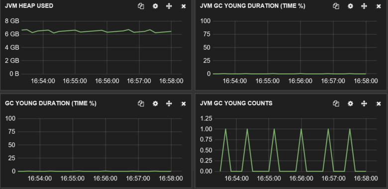
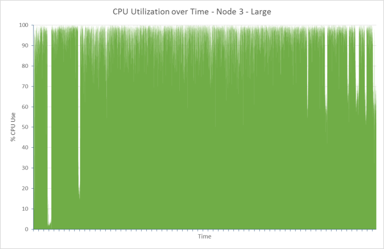

<properties
   pageTitle="Ottimizzazione delle prestazioni di acquisizione di dati per Elasticsearch su Azure | Microsoft Azure"
   description="Informazioni su come ottimizzare le prestazioni di acquisizione di dati con Elasticsearch in Azure."
   services=""
   documentationCenter="na"
   authors="dragon119"
   manager="bennage"
   editor=""
   tags=""/>

<tags
   ms.service="guidance"
   ms.devlang="na"
   ms.topic="article"
   ms.tgt_pltfrm="na"
   ms.workload="na"
   ms.date="09/22/2016"
   ms.author="masashin"/>

# <a name="tuning-data-ingestion-performance-for-elasticsearch-on-azure"></a>Ottimizzazione delle prestazioni di acquisizione di dati per Elasticsearch su Azure

[AZURE.INCLUDE [pnp-header](../../includes/guidance-pnp-header-include.md)]

In questo articolo fa [parte di una serie](guidance-elasticsearch.md). 

## <a name="overview"></a>Panoramica

Importante quando si crea un database di ricerca per determinare il modo migliore per strutturare il sistema per acquisire i dati che supportano le ricerche veloce ed efficiente. Considerazioni adiacente questo requisito riguardano non solo la scelta di infrastruttura in cui l'implementazione di sistema, ma anche diverse ottimizzazioni che è possibile utilizzare per garantire che il sistema possibile per mantenersi previste di massiccio dati. 

In questo documento sono illustrate le opzioni di distribuzione e la configurazione è necessario prendere in considerazione per l'implementazione di un cluster di Elasticsearch che prevede un valore elevato di acquisizione di dati. Per fornire dati a tinta unita esemplificativo, questo documento Mostra anche i risultati di benchmark varie configurazioni utilizzando un carico di lavoro di acquisizione di dati di volumi elevati semplice. I dettagli del carico di lavoro sono descritti nell' [Appendice](#appendix-the-bulk-load-data-ingestion-performance-test) alla fine di questo documento.

Lo scopo dei minimi di riferimento è stato non per generare le prestazioni assoluto cifre per l'esecuzione di Elasticsearch o persino consigliare una determinata topologia, ma piuttosto per illustrare i metodi che è possibile utilizzare per valutare le prestazioni, il ridimensionamento nodi di dati e implementazione di cluster che soddisfano i propri requisiti di prestazioni. 

Quando il ridimensionamento sistemi personalizzati, è importante verificare prestazioni accuratamente in base alla propria carichi di lavoro. Raccogliere telemetria che consente di ottenere informazioni sulla configurazione hardware ottimale da usare e i fattori di ridimensionamento orizzontali che è necessario prendere in considerazione. In particolare, è necessario:

- Considerare le dimensioni totali del payload inviato e non solo il numero di elementi in ogni blocco consente di inserire richiesta. Un numero minore di elementi di grandi dimensioni in blocco in ogni richiesta potrebbe essere più efficiente rispetto a un numero più grande, a seconda delle risorse disponibili per l'elaborazione di ogni richiesta.

È possibile monitorare gli effetti della variabile la richiesta di inserimento in blocco tramite [Marvel](https://www.elastic.co/products/marvel), utilizzando *readbytes*/i/o*writebytes* contatori con [JMeter](https://jmeter.apache.org/)e degli strumenti del sistema operativo, ad esempio *iostat* e *vmstat* su Ubuntu. 

- Eseguire la verifica delle prestazioni e raccogliere telemetria elaborazione misura CPU i/o i tempi di attesa, latenza del disco, velocità e tempi di risposta. Queste informazioni consentono di identificare i potenziali problemi relativi e valutare i costi e vantaggi derivanti dall'uso archiviazione premium. Tenere presente che utilizzo della CPU e disco potrebbe non essere anche in tutti i nodi a seconda il modo in cui shards e repliche sono distribuiti in cluster (alcuni nodi possono contenere più shards rispetto ad altri).

- Valutare la possibilità di come il numero di richieste simultanee per il carico di lavoro verrà distribuito all'interno del cluster e valuta l'impatto dell'utilizzo di numeri diversi di nodi per gestire il carico di lavoro.

- Valutare la possibilità di come potrebbe Ingrandisci carichi di lavoro con l'espansione dell'azienda. Valutare l'impatto di questa crescita sui costi delle macchine virtuali e lo spazio di archiviazione utilizzati dai nodi.

- Riconoscere che usa un cluster con un numero maggiore di nodi con dischi regolari potrebbe essere più economico se lo scenario richiede un numero elevato di richieste e infrastruttura disco mantiene velocità che soddisfa i contratti di servizio (contratti di servizio). Tuttavia, l'aumento del numero dei nodi può comportare il sovraccarico sotto forma di sincronizzazione e le comunicazioni tra i nodi aggiuntive.

- Comprendere che un numero elevato di core per nodo può generare più il traffico disco durante l'elaborazione di più documenti. In questo caso, misurare l'utilizzo del disco per verificare se sottosistema i/o può diventare un bottiglia e determinare i vantaggi dell'utilizzo dello spazio di archiviazione premium.

- Verificare e analizzare compromessi con un numero elevato di nodi con meno core e meno i nodi con più core. Tenere presente che l'aumento del numero di repliche effettuano l'escalation richieste sul cluster e potrebbe essere necessario aggiungere nodi.

- Valutare la possibilità di utilizzo di dischi temporanee potrebbe richiedere che gli indici devono essere recuperati più di frequente.

- Utilizzo di volume misura lo spazio di archiviazione per valutare le capacità e in utilizzo di spazio di archiviazione. Ad esempio, in questo scenario è archiviato miliardi di 1,5 documenti GB 350 di archiviazione.

- Misurare la velocità di trasferimento per i carichi di lavoro e prendere in considerazione la distanza, è probabile che ottenere i limiti di trasferimento di velocità i/o totale per tutti gli account assegnato lo spazio di archiviazione in cui è stato creato dischi virtuali.

## <a name="node-and-index-design"></a>Struttura di nodo e indice

In un sistema che deve supportare l'acquisizione di dati di grandi dimensioni, è possibile porre domande seguenti:

- **Sono i dati relativamente statici o rapido movimento?** Più dinamico dei dati, maggiore la manutenzione sovraccarico per Elasticsearch. Se i dati vengono replicati, ciascun duplicata viene mantenuta in modo sincrono. Dati rapido movimento che include solo un ciclo di vita limitato o che possono essere facilmente ricostruzione possono trarre vantaggio da disattivare completamente la replica. Questa opzione è illustrata nella sezione [ottimizzazione di acquisizione di dati su larga scala.](#tuning-large-scale-data-ingestion)

- **Di aggiornamento sono richieste dati individuati cercando?** Per ottenere prestazioni, Elasticsearch buffer tutti i dati in memoria possibile. Questo significa che non tutte le modifiche sono immediatamente disponibili per le richieste di ricerca. Viene descritto il processo che elasticsearch utilizzate per apportare modifiche permanenti e renderli visibili in [Apportare modifiche permanenti](https://www.elastic.co/guide/en/elasticsearch/guide/current/translog.html#translog). 

    I dati di frequenza diventano visibili è disciplinata dal *aggiornare\_intervallo* impostazione dell'indice pertinenti. Per impostazione predefinita, questo intervallo è impostato su 1 secondo. Tuttavia, non tutte le situazioni richiedono gli aggiornamenti per questo presentano rapidamente. Gli indici dati del Registro di registrazione, ad esempio, potrebbero essere necessario affrontare un rapido e continuo afflusso di informazioni che devono essere caricamento rapidamente, ma non richiedono le informazioni per essere immediatamente disponibili per la ricerca. In questo caso, provare a ridurre la frequenza degli aggiornamenti. Questa funzionalità viene inoltre descritto nella sezione [ottimizzazione di acquisizione di dati su larga scala.](#tuning-large-scale-data-ingestion)

- **La velocità è probabili espansione i dati?** Capacità di indice è il numero di shards specificato al momento della creazione dell'indice. Per consentire la crescita, specificare un numero di shards (il valore predefinito è 5). Se l'indice della creazione di un unico nodo, cinque shards tutti si troverà su tale nodo, ma esigenze aggiuntivo il volume dei dati possono essere aggiunti nodi ed Elasticsearch verrà distribuito in modo dinamico shards tra nodi. Tuttavia, ogni condiviso ha un sovraccarico. Tutte le ricerche in un indice richiederà tutti shards, in modo che la creazione di un numero elevato di shards per una piccola quantità di dati può rallentare il recupero di dati (evitare lo scenario [Kagillion shards](https://www.elastic.co/guide/en/elasticsearch/guide/current/kagillion-shards.html) ).

    Alcuni carichi di lavoro (ad esempio registrazione) potrebbe creare un nuovo indice ogni giorno e se si osservano che il numero di shards è sufficiente per il volume dei dati, è necessario modificare prima di creare l'indice successivo (indici esistenti non sono interessati). Se è necessario distribuire i dati esistenti tra più shards, quindi un'opzione possibile consiste da indicizzare le informazioni. Creare un nuovo indice con la configurazione appropriata e copiare i dati. Questo processo può essere reso trasparente alle applicazioni mediante [alias di indice](https://www.elastic.co/guide/en/elasticsearch/reference/current/indices-aliases.html).

- **Dati necessario suddiviso tra gli utenti in uno scenario "multitenancy"?** È possibile creare indici distinti per ogni utente, ma può essere costosa se ogni utente contiene solo una moderato quantità di dati. Se, tuttavia, considerare la creazione di [indici condivisi](https://www.elastic.co/guide/en/elasticsearch/guide/current/shared-index.html) e utilizzare [alias in base a filtri](https://www.elastic.co/guide/en/elasticsearch/guide/current/faking-it.html) per indirizzare le richieste ai dati per ogni utente. Per mantenere i dati per un utente insieme nella stessa condiviso, ignorare la configurazione di routing predefinita per i dati di indice e la distribuzione in base a alcuni attributi di identificazione dell'utente.

- **Sono i dati breve o lunghi?** Se si utilizza un set di macchine virtuali di Azure per implementare un cluster di Elasticsearch, è possibile archiviare dati temporanee su un disco di sistema di risorse locale piuttosto che un'unità collegata.
Usa uno SKU VM che utilizza un SSD per il disco di risorse, è possibile migliorare le prestazioni dei / o. Tuttavia, le informazioni contenute nel disco risorse sono temporanee e potrebbero essere perse se si riavvia la macchina virtuale (vedere la sezione quando verrà i dati in un temporaneo unità essere perse in [informazioni sulle unità temporanea in macchine virtuali di Microsoft Azure](http://blogs.msdn.com/b/mast/archive/2013/12/07/understanding-the-temporary-drive-on-windows-azure-virtual-machines.aspx) per altri dettagli). Se è necessario conservare i dati tra un riavvio, creare dischi di dati per contenere le informazioni e collegarli a macchina virtuale.

- **Livelli di attività sono i dati?** Azure dischi rigidi virtuali sono soggetti a limitazione se la quantità di attività di lettura/scrittura supera i parametri specificati (attualmente 500/operazioni di input output al secondo (IOPS) per un disco collegato a un livello di macchine Virtuali di Standard e 5000 IOPS per un disco di archiviazione Premium). 

    Per ridurre le possibilità di limitazione e migliorare le prestazioni dei / o, considerare la creazione di più dischi di dati per ogni macchina virtuale e configurare Elasticsearch per distribuire i dati su questi dischi come descritto nel [disco rigido e file requisiti di sistema](guidance-elasticsearch-running-on-azure.md#disk-and-file-system-requirements).

    Selezionare una configurazione hardware che consente di ridurre il numero di disco operazioni di lettura per verificare che sia sufficiente memoria disponibile per i dati nella cache si accede di frequente. Come descritto nella sezione dei [requisiti di memoria](guidance-elasticsearch-running-on-azure.md#memory-requirements) del Elasticsearch in esecuzione in Azure.

- **Quali tipi di carico di lavoro sarà necessario per supportare ogni nodo?** Elasticsearch dispongono dei vantaggi di memoria per memorizzare dati nella cache (in forma di cache del file system) e per l'heap JVM come descritto nella sezione dei [requisiti di memoria](guidance-elasticsearch-running-on-azure.md#memory-requirements) del Elasticsearch in esecuzione in Azure. 

    La quantità di memoria, numero di CPU Core e quantità di dischi disponibili sono impostate da SKU della macchina virtuale. Per ulteriori informazioni, vedere [Macchine virtuali di prezzi](http://azure.microsoft.com/pricing/details/virtual-machines/) nel sito Web di Azure.

### <a name="virtual-machine-options"></a>Opzioni di macchina virtuale

È possibile eseguire il provisioning di macchine virtuali di Azure utilizzando un numero di SKU diverso. Le risorse disponibili per una macchina virtuale Azure dipendono SKU selezionata. Ogni SKU offre tipi diversi di core, memoria e spazio di archiviazione. È necessario selezionare una dimensione appropriata di macchine Virtuali che gestirà il carico di lavoro previsto, ma anche che risulta conveniente.
Iniziare con una configurazione che soddisfi i requisiti correnti (eseguire benchmark per testare, come descritto più avanti in questo documento). È possibile ridimensionare un cluster in un secondo momento mediante l'aggiunta di più macchine virtuali in esecuzione nodi Elasticsearch.

[Dimensioni per macchine virtuali](../virtual-machines/virtual-machines-linux-sizes.md) nel sito Web di Azure vengono illustrate le diverse opzioni e SKU disponibili per macchine virtuali.

Fare corrispondere la dimensione e risorse di una macchina virtuale al ruolo che verranno eseguita automaticamente nodi che eseguono la macchina virtuale.

Per un nodo dati:

- Allocare fino a 30 GB o 50% della memoria RAM disponibile per il linguaggio heap, è il più basso. Lasciare il resto del sistema operativo da utilizzare per la memorizzazione nella cache file. Se si utilizza Linux, è possibile specificare la quantità di memoria da allocare heap Java impostando il ES\_HEAP\_variabile di ambiente dimensioni prima di eseguire Elasticsearch. In alternativa, se si utilizza Windows o Linux, è possibile stabilire dimensione della memoria con i parametri *Xmx* ed *estesa* quando si avvia Elasticsearch.

    A seconda di carico di lavoro, meno macchine virtuali di grandi dimensioni potrebbero non essere altrettanto efficace per prestazioni ottimali con un numero maggiore di medie macchine virtuali. È necessario eseguire i test di cui possono essere compromessi tra il traffico di rete aggiuntive e la manutenzione coinvolti rispetto ai costi di aumentare il numero di core a disposizione e i conflitti di riduzione del disco su ciascun nodo.

- Utilizzare l'archiviazione premium per l'archiviazione dei dati Elasticsearch. Questo è descritto in modo più dettagliato nella sezione [Opzioni di archiviazione](#storage-options) .

- Utilizzare più dischi degli stessi dati di dimensioni e strisce tra questi dischi. SKU delle proprie macchine virtuali determinerà il numero massimo di dischi di dati che è possibile allegare. Per ulteriori informazioni, vedere [requisiti di sistema disco e il file](guidance-elasticsearch-running-on-azure.md#disk-and-file-system-requirements).

- Utilizzare uno SKU di CPU multi-core con almeno 2 core, preferenza 4 o più. 

Per un nodo client:

- Non allocare spazio su disco per i dati Elasticsearch, dedicata ai client non archiviare dati su disco.

- Assicurarsi che sia disponibile per gestire carichi di lavoro di memoria sufficiente. Lettura di richieste di inserimento in blocco in memoria prima di dati da inviare a diversi nodi di dati e i risultati della query e le aggregazioni sono accumulati in memoria prima di essere restituito all'applicazione client. Valutare i proprio carichi di lavoro e monitorare l'utilizzo della memoria utilizzando uno strumento, ad esempio Marvel o le [informazioni di JVM](https://www.elastic.co/guide/en/elasticsearch/guide/current/_monitoring_individual_nodes.html#_jvm_section) restituito utilizzando il *nodo/Stat* API (`GET _nodes/stats`) per valutare i requisiti di ottimali.  In particolare, controllare il *heap\_utilizzato\_%* metriche per ogni nodo e obiettivo per mantenere la dimensione heap sotto il 75% di spazio disponibile.

- Assicurarsi che siano disponibili per ricevere ed elaborare il volume previsto di richieste core CPU sufficienti.
Le richieste vengono accodate come vengono ricevuti prima di elaborazione e il volume degli elementi che è possibile accodare è una funzione del numero di core CPU su ciascun nodo. È possibile monitorare le lunghezze di coda utilizzando i dati nelle [informazioni del pool](https://www.elastic.co/guide/en/elasticsearch/guide/current/_monitoring_individual_nodes.html#_threadpool_section) restituito utilizzando il nodo/Stat API. 

    Se il conteggio *rifiutato* per una coda indica che sono state rifiutate richieste, significa che il cluster è iniziare a creare colli di bottiglia. Questo potrebbe dipendere da larghezza di banda, ma può anche dipendere da altri fattori, ad esempio mancanza di memoria o un rallentamento delle prestazioni i/o, quindi usare queste informazioni in combinazione con altre statistiche per determinare la causa principale.

    Client possono essere o non può essere necessario, a seconda del carichi di lavoro. Carichi di lavoro di acquisizione dati tendenza a non trarre vantaggio dall'utilizzo dedicato client, mentre alcune ricerche e le aggregazioni possono eseguire più rapidamente. Prepararsi a benchmark propri scenari.

    I nodi di client sono particolarmente utili per applicazioni che utilizzano l'API del Client di trasporto per connettersi al cluster. È anche possibile utilizzare l'API del Client di nodo, che consente di creare in modo dinamico un client dedicato per l'applicazione, utilizzando le risorse dell'ambiente host dell'applicazione. Se le applicazioni utilizzano l'API del Client di nodo, quindi potrebbe non essere necessaria per il cluster contenere nodi di client dedicato preconfigurato. 
    
    Tuttavia, tenere presente che un nodo creato tramite l'API di nodo Client è un importante membro del cluster e pertanto partecipa chatter rete con gli altri nodi. Avviare e arrestare nodi client spesso di creare rumore non necessarie per l'intero cluster.

Per un nodo principale:

- Non allocare spazio su disco per i dati Elasticsearch, nodi master dedicati non archiviare dati su disco.

- Requisiti di CPU dovrebbero essere minimi.

- Requisiti di memoria dipendono dalle dimensioni del cluster. Informazioni sullo stato del cluster viene mantenute in memoria. Per piccoli gruppi è minima la quantità di memoria necessaria, ma per un cluster di grandi dimensioni, estremamente attivo nel punto in cui vengono creati indici frequentemente e shards gli spostamenti la quantità di informazioni sullo stato espandibile in modo significativo. Monitorare le dimensioni di heap JVM per determinare se è necessario aggiungere memoria.

> [AZURE.NOTE]Per l'affidabilità cluster, sempre più nodi master per creare e configurare i nodi rimanenti per evitare la possibilità di divisione cervello che si verifichi un. Se possibile, deve essere un numero dispari dei nodi master. In questo argomento viene descritta in modo più dettagliato in [configurazione adattabilità e il ripristino in Elasticsearch in Azure][].

### <a name="storage-options"></a>Opzioni relative all'archiviazione

Sono disponibili numerose opzioni di archiviazione in macchine virtuali di Azure con diversi compromessi che interessano costo; prestazioni, disponibilità e ripristino che è necessario considerare con attenzione.

Si noti che archiviare dati Elasticsearch in dischi dati dedicato.  In questo modo per ridurre il conflitto con il sistema operativo e assicurarsi che non sono in competizione con le funzioni di sistema operativo per le risorse i/o di volumi elevati dei / o Elasticsearch.

Azure dischi sono soggette ai vincoli di prestazioni. Se si trovano che un cluster subisce periodici picchi di attività possono limitate delle richieste. Per evitare questo, regolare la struttura per bilanciare le dimensioni del documento in Elasticsearch contro il volume di richieste probabile vengano ricevuti da ogni disco.

Dischi in base a standard dello spazio di archiviazione supportano una velocità massima delle richieste di 500 IOPS mentre dischi in base allo spazio di memorizzazione premium di lavorare al IOPS fino a 5.000, a seconda delle dimensioni dei dischi di dati. Dischi di archiviazione Premium sono disponibili solo per le serie di macchine virtuali DS e GS. Per trovare sul disco rigido massimo IOPS dal dimensione memoria virtuale, vedere [dimensioni per macchine virtuali in Azure](../virtual-machines/virtual-machines-linux-sizes.md). Le prestazioni di archiviazione premium viene determinata in base alle dimensioni di macchine Virtuali insieme allocazione di dimensioni del disco. Per ulteriori informazioni, vedere [archiviazione Premium: High-Performance lo spazio di archiviazione per carichi di lavoro di Azure macchina virtuale](../storage/storage-premium-storage.md).

**Dischi dati permanenti**

Dati permanenti dischi sono dischi rigidi virtuali supportati dagli archiviazione Azure. Se la macchina virtuale deve essere ricreata dopo un errore principale, dischi rigidi virtuali esistenti possono essere collegati facilmente alla nuova macchina virtuale. Dischi rigidi virtuali possono essere creati in base a standard dello spazio di archiviazione (che gira media) o spazio di archiviazione premium (SSDs). Se si desidera utilizzare SSDs è necessario creare macchine virtuali utilizzando la serie DS o migliore. Computer DS costo diverso da quello di macchine virtuali di serie D equivalente, ma vengono addebitati aggiuntivi per l'uso di spazio di archiviazione premium.

Nei casi in cui la velocità di trasferimento massima per disco insufficiente per supportare il carico di lavoro previsto, è consigliabile uno creare più dischi di dati e consentire Elasticsearch per [distribuire i dati su questi dischi](guidance-elasticsearch-running-on-azure.md#disk-and-file-system-requirements)o implementare livello sistema [RAID 0 striping utilizzando dischi virtuali](../virtual-machines/virtual-machines-linux-configure-raid.md).

> [AZURE.NOTE]L'esperienza all'interno di Microsoft dimostra che utilizza RAID 0 è particolarmente utile per gli effetti i/o di smorzamento *spiky* carichi di lavoro che generano frequenti picchi di attività.

Premium usare localmente ridondanti (o locale ridondanti per fascia bassa o carichi di lavoro di domande e risposte) dello spazio di archiviazione per l'account di archiviazione tenendo dischi; la replica in più aree geografiche e le aree non sono necessaria per Elasticsearch disponibilità. 

**Dischi temporanee**

Utilizzo di dischi persistenti in base a SSDs richiede la creazione di macchine virtuali che supportano l'archiviazione premium. In questo modo implicazioni un prezzo. Utilizzo del disco locale temporaneo per contenere dati Elasticsearch può essere una soluzione conveniente per medie nodi richiedere fino a 800 GB di spazio di archiviazione. In serie D Standard delle macchine virtuali, dischi temporanee implementati utilizzando SSDs che offrono maggiori prestazioni e latenza molto più comune dischi bassi

Quando si utilizza Elasticsearch, le prestazioni possono essere equivale a utilizzare lo spazio di archiviazione premium senza incorrere nei costi, vedere la sezione [problemi latenza del disco indirizzi](#addressing-disk-latency-issues) per altre informazioni.

Le dimensioni della macchina virtuale limitano la quantità di spazio disponibile nello spazio di memorizzazione temporaneo come descritto nel post di blog [Le prestazioni di serie D](https://azure.microsoft.com/blog/d-series-performance-expectations/).

Ad esempio, uno Standard di\_macchine Virtuali D1 fornisce 50GB di spazio di archiviazione temporanea, uno Standard di\_macchina virtuale D2 è 100GB di spazio di archiviazione temporanea e uno Standard di\_macchine Virtuali D14 fornisce 800GB di spazio temporaneo. Per i cluster in nodi richiedono solo la quantità di spazio, può essere conveniente utilizza una macchina virtuale D serie con archiviazione temporanee.

È necessario bilanciare le aumentare la velocità effettiva disponibile con lo spazio di archiviazione temporanea rispetto al tempo e costi consente di recuperare i dati dopo il riavvio di un computer. Il contenuto del disco temporaneo viene perso se la macchina virtuale viene spostata in un server host diverso, se l'host viene aggiornato oppure se l'host si verifica un errore hardware. Se i dati sono un ciclo di vita limitato la perdita di dati può essere ai. Per i dati più durevole, potrebbe essere possibile ricreare un indice o ripristinare le informazioni mancanti da un backup. È possibile ridurre a icona la possibilità di perdita utilizzando repliche contenute in altri macchine virtuali.

> [AZURE.NOTE]Non utilizzare **singola** macchina virtuale per contenere dati di produzione critiche. Se il nodo non riesce, tutti i dati non è disponibile. Per informazioni riservate, assicurarsi che i dati vengono replicati su almeno un altro nodo.

**File di Azure**

Il [Servizio di File di Azure](http://blogs.msdn.com/b/windowsazurestorage/archive/2014/05/12/introducing-microsoft-azure-file-service.aspx) consente di accedere file condiviso con lo spazio di archiviazione di Azure. È possibile creare condivisioni file che è quindi possibile installare in macchine virtuali di Azure. Macchine virtuali più possono installare la stessa condivisione di file, che consente di accedere agli stessi dati.

Per motivi di prestazioni, non è consigliabile che si utilizzano condivisioni file per l'esenzione Elasticsearch dati che non devono essere condivisi tra nodi, dischi dati regolari sono più adatti allo scopo. Per la creazione di Elasticsearch [indici di replica di ombreggiatura](https://www.elastic.co/guide/en/elasticsearch/reference/current/indices-shadow-replicas.html), è possono utilizzare nelle condivisioni file. Tuttavia, questa funzionalità è attualmente sperimentazione e non può essere implementata in questa fase in un ambiente di produzione. Per questo motivo, gli indici di ombreggiatura non sono considerati più avanti in questa Guida.

**Opzioni di rete**

Azure implementata una combinazione di rete condivisa. Macchine virtuali che utilizzano lo stesso hardware rack sono in conflitto per le risorse di rete. Di conseguenza della larghezza di banda di rete disponibili può variare in base all'ora del giorno e ogni giorno ciclo di lavoro in esecuzione in macchine virtuali condivisione la stessa infrastruttura di rete. È possibile controllare questi fattori. È importante tenere presente che le prestazioni di rete sono probabile che variare nel tempo e quindi impostare di conseguenza aspettative degli utenti.

## <a name="scaling-up-nodes-to-support-large-scale-data-ingestion"></a>Scalabilità nodi per il supporto di acquisizione di dati su larga scala

È possibile creare cluster Elasticsearch mediante hardware adeguatamente moderato e quindi scalare o scalabilità come aumenta il volume dei dati e aumenta il numero di richieste. Con Azure, scalabilità eseguendo in macchine virtuali di dimensioni maggiori e più costose oppure è possibile scalabilità con altre macchine virtuali di dimensioni inferiori e conveniente. 

È anche possibile eseguire una combinazione di entrambi strategie. Non esiste nessuna soluzione adatta per tutti gli scenari, valutare l'approccio ottimale per qualsiasi tipo dato situazione che è necessario essere pronti a effettuare una delle prestazioni di una serie di test.

In questa sezione è interessata con l'approccio scalabilità, scalabilità orizzontale è illustrata nella sezione [scala fuori: conclusioni](#scaling-out-conclusions).
In questa sezione vengono descritti i risultati di una serie di benchmark eseguiti per una serie di cluster Elasticsearch contenente macchine virtuali di varie dimensioni. I cluster sono stati designati come piccole, medie e grandi dimensioni. Nella tabella seguente sono riepilogate le risorse assegnate alle macchine virtuali di ogni cluster.

| Cluster | SKU MACCHINE VIRTUALI      | Numero di core | Numero di dischi di dati | RAM  |
|---------|-------------|-----------------|----------------------|------|
| Piccolo   | D2 standard | 2               | 4                    | 7GB  |
| Media  | D3 standard | 4               | 8                    | 14GB |
| Grande   | D4 standard | 8               | 16                   | 28GB |

Ogni cluster Elasticsearch contenuti 3 nodi di dati. Questi nodi di dati gestite le richieste dei client, nonché elaborazione di gestione dati. Nodi client separate non sono stati utilizzati in quanto ha fornito pochi vantaggi per lo scenario di acquisizione di dati utilizzato dai test. Il cluster contenuti anche tre nodi master, uno dei quali è stato scelto da Elasticsearch per coordinare il cluster.

I test sono stati eseguiti mediante Elasticsearch 1.7.3. I test inizialmente sono stati eseguiti in cluster che eseguono Ubuntu Linux 14.0.4 e quindi ripetute mediante Windows Server 2012. I dettagli del carico di lavoro svolto dalle prove sono descritti nell' [Appendice](#appendix-the-bulk-load-data-ingestion-performance-test).

### <a name="data-ingestion-performance--ubuntu-linux-1404"></a>Prestazioni di acquisizione di dati: Ubuntu Linux 14.0.4

Nella tabella seguente vengono riepilogati i risultati globali dell'esecuzione di test per due ore per ogni configurazione:

| Configurazione | Numero del campione | Tempo medio di risposta (ms) | Velocità (operazioni/s) |
|---------------|--------------|----------------------------|---------------------------|
| Piccolo         | 67057        | 636                        | 9.3                       |
| Media        | 123482       | 692                        | 17.2                      |
| Grande         | 197085       | 839                        | 27.4                      |

La velocità e alcuni esempi di elaborazione per le tre configurazioni sono in rapporto approssimativo 1:2:3. Tuttavia, le risorse disponibili in termini di memoria, core CPU e dischi hanno rapporto 1:2:4. È stato considerato essere utile esaminare i dettagli di prestazioni ridotte dei nodi in un cluster di valutare il motivo per cui è possibile le maiuscole/minuscole. Queste informazioni consentono di determinare se esistono limiti alla scalabilità e quando può essere opportuno valutare la possibilità di scalabilità. 

### <a name="determining-limiting-factors-network-utilization"></a>Determinazione limitazione dei fattori: utilizzo della rete

Elasticsearch si basa sulla disponibilità di larghezza di banda sufficiente per supportare l'afflusso di richieste, nonché le informazioni di sincronizzazione tra nodi del cluster. Come mostrato in precedenza, è limitato controllare la disponibilità della larghezza di banda, che dipende dal numero di variabili, ad esempio Data Center in uso e il carico di rete corrente delle altre macchine virtuali condivisione la stessa infrastruttura di rete. Tuttavia, è comunque consigliabile esaminare l'attività di rete per ogni cluster verificare che il volume del traffico non è eccessivo. Il grafico seguente mostra un confronto tra il traffico di rete ricevuto dal nodo 2 in ognuna delle cluster (volumi per gli altri nodi in ogni cluster è molto simile).


Media byte ricevuti al secondo per il nodo 2 in ciascuna configurazione cluster durante il periodo di due ore sono riportate di seguito:

| Configurazione | Numero medio di byte ricevuti/sec |
|---------------|--------------------------------------|
| Piccolo         | 3993640.3                            |
| Media        | 7311689.9                            |
| Grande         | 11893874.2                           |

Le prove sono state effettuate mentre il sistema è stato eseguito in **stabile**. Nelle situazioni in cui indicizzare riequilibrare o nodo ripristino in corso, le trasmissioni di dati tra i nodi tenendo principale e shards replica generare il traffico di rete significativa. Gli effetti di questo processo sono descritti più nel documento [adattabilità configurazione e il ripristino in Elasticsearch in Azure][].

### <a name="determining-limiting-factors-cpu-utilization"></a>Determinazione limitazione dei fattori: utilizzo della CPU

Il tasso di gestione delle richieste è determinato almeno parzialmente dalla capacità di elaborazione disponibili. Elasticsearch accetta richieste di inserimento in blocco in blocco inserire coda. Ogni nodo dispone di un set di massa inserire code varia a seconda del numero di processori disponibili. Per impostazione predefinita, non esiste una coda per ogni processore e ogni coda può contenere fino a 50 richieste in attesa prima di avviare il rifiuto. 

Applicazioni per l'invio di richieste di un tasso che non causano code a overspill. Il numero di elementi in ciascuna coda in qualsiasi momento agirà da una funzione della frequenza di richieste inviate dalle applicazioni client e il queste richieste recupero ed elaborate da Elasticsearch. Per questo motivo, una statistica importante acquisite preoccupazioni la frequenza degli errori riepilogati nella tabella seguente.

| Configurazione | Esempi di totali | Numero di errori  | Tasso di errori |
|---------------|---------------|--------------|------------|
| Piccolo         | 67057         | 0            | 0,00%      |
| Media        | 123483        | 1            | 0.0008%    |
| Grande         | 200702        | 3617         | 1,8%      |

Ciascuno di questi errori è dovuto a eccezione Java seguente:

```
org.elasticsearch.action.support.replication.TransportShardReplicationOperationAction$PrimaryPhase$1@75a30c1b]; ]
[219]: index [systembase], type [logs], id [AVEAioKb2TRSNcPa_8YG], message [RemoteTransportException[[esdatavm2][inet[/10.0.1.5:9300]][indices:data/write/bulk[s]]]; nested: EsRejectedExecutionException[rejected execution (queue capacity 50)
```

Aumentare il numero di code e/o la lunghezza di ciascuna coda potrebbe ridurre il numero di errori, ma questo approccio solo può gestire picchi di breve durata. Questa operazione durante l'esecuzione di una serie di velocità delle attività di acquisizione di dati è sufficiente intervallo di quale il punto in cui iniziare che si verificano errori. Inoltre, questa modifica non miglioreranno la velocità e sarà probabilmente danneggiare il tempo di risposta delle applicazioni client come richieste vengono accodate per più prima dell'elaborazione.

Struttura di indice predefinita di 5 shards con 1 replica (10 shards in tutti), un squilibrio limitato carico tra i nodi in un cluster, due nodi conterrà tre shards mentre l'altro nodo conterrà quattro. Il nodo più occupato è probabilmente l'elemento che limita l'effettiva il massimo, perché questo nodo è stato selezionato in ogni caso. 

Set di grafici di seguito viene illustrato l'utilizzo della CPU del nodo più occupata in ogni cluster.


Per small, medium e cluster di grandi dimensioni, l'utilizzo della CPU medio per questi nodi è stata 75.01%, 64.93% e 64.64%. Raramente utilizzo effettivamente raggiunto 100% e utilizzo inserisce come delle dimensioni dei nodi e aumenta il disponibile CPU power disponibile. Potenza della CPU è pertanto difficilmente un fattore di limitare le prestazioni del cluster di grandi dimensioni.

### <a name="determining-limiting-factors-memory"></a>Determinazione limitazione dei fattori: memoria

Utilizzo della memoria è un altro aspetto importante che può influenzare le prestazioni. Per i test Elasticsearch allocata 50% della memoria disponibile. Si tratta in linea con il [descritte consigli](https://www.elastic.co/guide/en/elasticsearch/guide/current/heap-sizing.html#_give_half_your_memory_to_lucene). Durante l'esecuzione di test sono stati JVM stato verificare la presenza di attività di raccolta garbage in eccesso (un'indicazione di memoria heap). In tutti i casi, le dimensioni dell'heap sono stabile e JVM si è verificato l'attività di raccolta garbage bassa. Nella schermata seguente mostra uno snapshot della Marvel, evidenziare il tasto statistiche JVM per un breve periodo durante l'esecuzione di test nel cluster di grandi dimensioni.



***JVM memoria e garbage attività di raccolta nel cluster di grandi dimensioni.***

### <a name="determining-limiting-factors-disk-io-rrates"></a>Determinazione limitazione dei fattori: disco rRates i/o

La caratteristica fisica rimanente sul lato server che potrebbe limitare le prestazioni la lentezza delle prestazioni del disco sottosistema i/o. Nel grafico seguente contiene un confronto di attività del disco in termini di byte scritti dei nodi più occupata in ogni cluster.

 

Nella tabella seguente mostra il Media byte scritti al secondo per il nodo 2 in ciascuna configurazione cluster durante il periodo di due ore:

| Configurazione | Numero medio di byte scritti/sec |
|---------------|-------------------------------------|
| Piccolo         | 25502361.94                         |
| Media        | 48856124.5                          |
| Grande         | 88137675.46                         |

Aumenta il volume di dati scritti con il numero di richieste da un cluster di elaborazione, ma le tariffe i/o sono entro i limiti di spazio di archiviazione Azure (dischi creati con lo spazio di archiviazione Azure supportino un tariffe sostenuto 10s a 100s di MB/s, a seconda che venga utilizzato lo spazio di archiviazione Standard o Premium). Esaminare la quantità di tempo trascorso in attesa del disco consente per spiegare il motivo anche sotto il massimo teorico velocità effettiva del disco. I grafici e la tabella seguente mostra le statistiche per gli stessi tre nodi:

> [AZURE.NOTE]Il tempo di attesa disco viene misurato controllando la percentuale di CPU tempo durante il quale processori vengono bloccati in attesa di operazioni i/o completare.


| Configurazione | Disco medio di attesa CPU (%) |
|---------------|--------------------------------|
| Piccolo         | 21.04                          |
| Media        | 14.48                          |
| Grande         | 15.84                          |

Questi dati indicano che una parte significativa del tempo CPU (tra quasi 16% e % 21) di spesa in attesa del disco completare. Questo è limitare le possibilità di Elasticsearch per elaborare le richieste e archiviare i dati.

Durante l'esecuzione di test, grande cluster inserito superiore a **cinque 100 milioni di documenti**. Consentire la continuazione del test è stato che i tempi di attesa aumentata in modo significativo quando il database contenuto oltre sei 100 milioni di documenti. Motivi per cui il problema non sono stati esaminati completamente, ma a causa di disco frammentazione causano latenza maggiore del disco. 

Aumentare le dimensioni del cluster ulteriori nodi potrebbe essere utile per ridurre gli effetti di questo comportamento. In casi potrebbe essere necessario deframmentare un disco che viene visualizzato un numero eccessivo i/o volte. Tuttavia, deframmentazione un disco di grandi dimensioni potrebbe richiedere molto tempo (eventualmente più di 48 ore per un'unità disco rigido virtuale di 2TB) e semplicemente riformattazione l'unità e consentire Elasticsearch recuperare i dati mancanti dalla shards replica può essere un approccio più economico.

### <a name="addressing-disk-latency-issues"></a>Risoluzione dei problemi di latenza disco

I test inizialmente sono stati eseguiti mediante macchine virtuali configurate con dischi standard. Un disco standard basato su che gira media e di conseguenza è soggetto a latenza rotazione e altri bottiglia che possa limitare le tariffe i/o. Azure consente inoltre l'archiviazione premium dischi vengono creati con dispositivi SSD. Questi dispositivi non hanno rotazione latenza e pertanto devono fornire migliorato i/o velocità. 

Nella tabella seguente vengono confrontati i risultati di sostituzione dischi standard con dischi premium del cluster di grandi dimensioni (macchine virtuali D4 Standard del cluster di grandi dimensioni sono state sostituite con macchine virtuali DS4 Standard, mentre il numero di core, memoria e dischi era lo stesso in entrambi i casi, l'unica differenza che le macchine virtuali DS4 utilizzato SSDs).

| Configurazione    | Numero del campione | Tempo medio di risposta (ms) | Velocità (operazioni/s) |
|------------------|--------------|----------------------------|---------------------------|
| Grande - Standard | 197085       | 839                        | 27.4                      |
| Grande - Premium  | 255985       | 581                        | 35,6                      |

Tempi di risposta sono state notevolmente migliori risultante in una velocità media molto simile a 4 x che cluster ridotta. Si tratta più in linea con le risorse disponibili su una macchina virtuale DS4 Standard. Media utilizzo della CPU del nodo più occupata cluster (nodo 1 in questo caso) aumentato come essa spese meno tempo per i/o completare:


La riduzione del tempo di attesa disco diventa evidente quando è prendere in considerazione nel grafico seguente, che indica che per il nodo più occupato la statistica rilasciato a circa 1% in Media:


Esiste un prezzo da pagare per il miglioramento, tuttavia. Il numero di errori di acquisizione aumentato per un fattore di 10 per 35797 (12.3%). Di nuovo la maggior parte di questi errori sono stati il risultato di in blocco inserire coda overflow. Dato che l'hardware è ora presente sia in esecuzione vicino capacità, potrebbe essere necessario aggiungere più nodi o velocità indietro di inserimenti in blocco per ridurre il volume degli errori. Vengono descritti più avanti in questo documento.

### <a name="testing-with-ephemeral-storage"></a>Test con lo spazio di archiviazione temporanea

Gli stessi test sono stati ripetuti in un cluster di spazio di archiviazione temporanee macchine virtuali di D4. In macchine virtuali D4, lo spazio di archiviazione temporanea è implementata come una singola 400GB SSD. Il numero di esempi di elaborazione, tempi di risposta e velocità è molto simile a figure segnalate per il cluster in base a macchine virtuali DS14 con lo spazio di archiviazione premium.

| Configurazione                     | Numero del campione | Tempo medio di risposta (ms) | Velocità (operazioni/s) |
|-----------------------------------|--------------|----------------------------|---------------------------|
| Grande - Premium                   | 255985       | 581                        | 35,6                      |
| Grande-Standard (disco temporaneo) | 255626       | 585                        | 35.5                      |

Il tasso di errore è stato inoltre simili (33862 errori fuori 289488 richieste di tipo in totale: 11,7%).

I grafici seguenti mostrano l'utilizzo della CPU e disco attendere statistiche per il nodo più occupata cluster (nodo 2 questa volta):


! [] (media/guidance-elasticsearch/data-ingestion-image13.png

In questo caso, in termini di prestazioni da solo, usando lo spazio di archiviazione temporanea potrebbe essere considerata una soluzione più rispetto all'utilizzo di spazio di archiviazione premium.

### <a name="data-ingestion-performance--windows-server-2012"></a>Prestazioni di acquisizione di dati: Windows Server 2012

Gli stessi test sono stati ripetuti con una serie di cluster Elasticsearch nodi che eseguono Windows Server 2012. Lo scopo di questi test è stato per stabilire quali effetti, se presenti, la scelta del sistema operativo potrebbe essere sulle prestazioni del cluster.

Per illustrare la scalabilità del Elasticsearch in Windows, la tabella seguente mostra i tempi di risposta e velocità ottenuti small, medium e configurazioni cluster di grandi dimensioni. Si noti che questi test sono stati eseguiti con Elasticsearch configurato per l'utilizzo SSD temporanea lo spazio di archiviazione, come i test con Ubuntu ha mostrato che latenza del disco è stata probabilmente un fattore critico per ottenere le massime prestazioni:

| Configurazione | Numero del campione | Tempo medio di risposta (ms) | Velocità (operazioni/s) |
|---------------|--------------|----------------------------|---------------------------|
| Piccolo         | 90295        | 476                        | 12.5                      |
| Media        | 169243       | 508                        | 23,5                      |
| Grande         | 257115       | 613                        | 35,6                      |

Questi risultati indicano come Elasticsearch scale con dimensione memoria virtuale e le risorse disponibili in Windows.

Nelle tabelle seguenti vengono confrontati i risultati per il cluster di grandi dimensioni in Ubuntu e Windows:

| Sistema operativo | Numero del campione | Tempo medio di risposta (ms) | Velocità (operazioni/s) | Tasso di errore (%) |
|------------------|--------------|----------------------------|---------------------------|----------------|
| Ubuntu           | 255626       | 585                        | 35.5                      | 11.7           |
| Windows          | 257115       | 613                        | 35,6                      | 7.2            |

La velocità è stato coerenza con quello per il cluster Ubuntu di grandi dimensioni, anche se il tempo di risposta è leggermente più alto. Questo potrebbe essere conteggiato in base al tasso errore inferiore (gli errori vengono segnalati più rapidamente le operazioni riuscite, pertanto avere un tempo di risposta inferiore).

L'utilizzo della CPU segnalato dagli strumenti di monitoraggio di Windows è stato leggermente superiore rispetto a quelle Ubuntu. Tuttavia, è necessario considerare confronti diretti dell'unità di misura, ad esempio questi tra i sistemi operativi con attenzione perché le sistemi operativi diversi report queste statistiche. Inoltre, informazioni sulla latenza del disco in termini di CPU tempo di attesa per i/o non sono disponibile nello stesso modo, come nel caso di Ubuntu. Il punto importante è che utilizzo della CPU è elevato, che indica che tempo di attesa speso per i/o è stato basso:



### <a name="scaling-up-conclusions"></a>Scalabilità: conclusioni

Prestazioni Elasticsearch per un cluster ottimizzato sono probabile che sia equivalente in Windows e Ubuntu e che esso scale-up in un modello simile in entrambi i sistemi operativi. Per ottenere prestazioni ottimali, **usare lo spazio di archiviazione premium per l'esenzione Elasticsearch dati**.

## <a name="scaling-out-clusters-to-support-large-scale-data-ingestion"></a>Scalabilità cluster per supportare l'acquisizione di dati su larga scala

Scalabilità è l'approccio gratuito per scalabilità analizzato nella sezione precedente. Un'importante funzionalità Elasticsearch è la scalabilità orizzontale inerente incorporata nel software. Aumento delle dimensioni di un cluster è sufficiente aggiungere altri nodi. Non è necessario eseguire alcuna operazione manuale per ridistribuire indici o shards come queste attività vengono gestiti automaticamente, anche se sono disponibili numerose opzioni di configurazione disponibili che è possibile utilizzare per influenzare questo processo. 

Aggiunta di più nodi consente di migliorare le prestazioni distribuendo il carico tra più macchinari. Mentre si aggiungono più nodi, è anche necessario prendere in considerazione la reindicizzazione di dati per aumentare il numero di shards disponibili. È possibile superano questo processo in una certa misura mediante la creazione di indici che dispone di più shards maggiore del numero di nodi disponibili inizialmente. Quando ulteriormente verranno aggiunti nodi, è possibile distribuire il shards.

Oltre a trarre vantaggio da scalabilità orizzontale di Elasticsearch, esistono altri motivi per l'implementazione di indici che dispone di più shards più nodi. Ogni condiviso è i proprio meccanismi interni per mantenere la coerenza e la gestione della concorrenza implementato come una struttura di dati distinto (un indice [Lucene](https://lucene.apache.org/) ). Creazione di più shards è utile per aumentare il parallelismo all'interno di un nodo e migliorare le prestazioni. 

Tuttavia, gestione delle prestazioni durante il ridimensionamento è un compromesso. Più nodi e shards che un cluster contiene più complessa è necessario sincronizzare il lavoro eseguito dal cluster, che consente di ridurre la velocità di trasmissione. Per un determinato carico di lavoro è una configurazione ottimale da ottimizzare le prestazioni di acquisizione riducendo il sovraccarico di manutenzione. Questa configurazione è dipende molto dalla natura il carico di lavoro e cluster. in particolare, il volume degli scambi, dimensioni e il contenuto dei documenti, la frequenza con cui si verifica l'acquisizione e l'hardware sul quale viene eseguito il sistema.  

In questa sezione vengono riepilogati i risultati di ricerche nelle dimensioni dei cluster deve supportare il carico di lavoro utilizzato per il test descritto in precedenza. Lo stesso test è stato eseguito su cluster con macchine virtuali in base all'esecuzione di (D4 Standard con 8 core CPU, dischi 16 dati e 28GB di RAM) di grandi dimensioni macchine Virtuali dimensioni Ubuntu Linux 14.0.4, ma è configurato con numeri diversi di nodi e shards. I risultati non deve essere definitivo che si applicano solo a uno scenario specifico, ma che possano agire come un valido punto di partenza per analizzare la scalabilità orizzontale dei cluster e generare i numeri per il rapporto ottimale di shards a nodi che meglio soddisfano le proprie esigenze.

### <a name="baseline-results--3-nodes"></a>Risultati previsto-3 nodi

Per ottenere una figura previsto, il test acquisizione dati è stato eseguito su un cluster di 3 nodi a 5 shards e 1 replica. Questa è la configurazione predefinita di un indice Elasticsearch. In questa configurazione Elasticsearch distribuisce 2 shards principale a 2 dei nodi e il rimanente condiviso primaria archiviata nel terzo nodo. Nella tabella seguente vengono riepilogate la velocità in termini di operazioni di acquisizione di massa al secondo e il numero di documenti archiviati correttamente per il test.

> [AZURE.NOTE] Nelle tabelle che seguono in questa sezione, la distribuzione di shards primaria viene presentata come un numero per ogni nodo separata da linee tratteggiate. Ad esempio, il layout di 3 nodi 5 condiviso viene descritto come 2-2-1. Il layout di shards replica non è incluso. Seguiranno uno schema simile a shards principale.

| Configurazione | Numero di documenti | Velocità (operazioni/s)   | Layout condiviso |
|---------------|----------------|-----------------------------|--------------|
| 5 shards      | 200560412      | 27.86                       | 2-2-1        |

### <a name="6-node-results"></a>6-nodo risultati

Il test è stato ripetuto in un cluster di 6 nodo. Lo scopo di questi test è stato per tentare di determinare con maggiore precisione gli effetti dell'archiviazione più condiviso in un nodo.

| Configurazione | Numero di documenti | Velocità (operazioni/s)   | Layout condiviso |
|---------------|----------------|-----------------------------|--------------|
| 4 shards      | 227360412      | 31.58                       | 1-1-0-1-1-0  |
| 7 shards      | 268013252      | 37.22                       | 2-1-1-1-1-1  |
| 10 shards     | 258065854      | 35,84                       | 1-2-2-2-1-2  |
| 11 shards     | 279788157      | 38.86                       | 2-2-2-1-2-2  |
| 12 shards     | 257628504      | 35.78                       | 2-2-2-2-2-2  |
| 13 shards     | 300126822      | 41.68                       | 2-2-2-2-2-3  |

Questi risultati per indicare le tendenze seguenti:

* Ulteriori shards per nodo migliora la velocità di trasmissione. Con numero limitato di shards per nodo creato per questi test, questo fenomeno previsto, per motivi descritti in precedenza.

* Un numero dispari di shards offre prestazioni migliori rispetto a un numero pari. I motivi per questo sono meno chiaro, ma *può* essere che l'algoritmo di routing che utilizza Elasticsearch meglio in grado di distribuire i dati in shards in questo caso, causando un carico più uniforme per nodo.

Per verificare le ipotesi, diverse nuove prove sono state eseguite con un numero maggiore di shards. Su Consiglio di Elasticsearch, si è deciso di usare un numero primo di shards per ogni test come questi inviare una distribuzione accettabile di numeri dispari per l'intervallo in questione.

| Configurazione | Numero di documenti | Velocità (operazioni/s)   | Layout condiviso      |
|---------------|----------------|-----------------------------|-------------------|
| 23 shards     | 312844185      | 43,45                       | 4-4-4-3-4-4       |
| 31 shards     | 309930777      | 43.05                       | 5-5-5-5-6-5       |
| 43 shards     | 316357076      | 43.94                       | 8-7-7-7-7-7       |
| 61 shards     | 305072556      | 42.37                       | 10-11-10-10-10-10 |
| 91 shards     | 291073519      | 40.43                       | 15-15-16-15-15-15 |
| 119 shards    | 273596325      | 38.00                       | 20-20-20-20-20-19 |

Questi risultati suggeriti che è stato raggiunto raggiunto il punto in circa 23 shards. Successivo a questo punto, aumentando il numero di shards causato una piccola riduzione delle prestazioni (la velocità per 43 shards è probabilmente un'anomalia).

### <a name="9-node-results"></a>risultati del nodo di 9

Il test sono stati ripetuti utilizzando un cluster di 9 nodi, usando un numero primo di shards.

| Configurazione | Numero di documenti | Velocità (operazioni/s)   | Layout condiviso               |
|---------------|----------------|-----------------------------|----------------------------|
| 17 shards     | 325165364      | 45.16                       | 2-2-2-2-2-2-2-2-1          |
| 19 shards     | 331272619      | 46.01                       | 2-2-2-2-2-2-2-2-3          |
| 29 shards     | 349682551      | 48.57                       | 3-3-3-4-3-3-3-4-3          |
| 37 shards     | 352764546      | 49,00                       | 4-4-4-4-4-4-4-4-5          |
| 47 shards     | 343684074      | 47.73                       | 5-5-5-6-5-5-5-6-5          |
| 89 shards     | 336248667      | 46.70                       | 10-10-10-10-10-10-10-10-9  |
| 181 shards    | 297919131      | 41.38                       | 20-20-20-20-20-20-20-20-21 |

Questi risultati hanno evidenziato un modello simile, con raggiunto il punto di circa 37 shards.

### <a name="scaling-out-conclusions"></a>Scalabilità orizzontale: conclusioni

Utilizzando un'estrapolazione essenziale, i risultati dei test nodo 6 e 9 indicato che, per questo scenario specifico, il numero ideale di shards per ottimizzare le prestazioni è stata 4n + /-1, dove n è il numero dei nodi. Questo *può* essere una funzione del numero di thread di inserimento in blocco disponibili, che a sua volta dipende il numero di core CPU, spiegazione vengano come indicato di seguito (per informazioni dettagliate, vedere [Motivi multiplo](https://www.elastic.co/guide/en/elasticsearch/guide/current/distrib-multi-doc.html#distrib-multi-doc) ):

- Ogni richiesta di inserimento in blocco inviato dall'applicazione client viene ricevuta da un nodo di dati single.

- Il nodo dati consente di creare una nuova richiesta di inserimento in blocco per ogni condiviso primaria incidono la convocazione originale e li inoltra agli altri nodi, in parallelo.

- Per ogni condiviso principale è scritta, un'altra richiesta viene inviata a ogni replica per tale condiviso. Per la richiesta inviata alla replica per completare prima di completare che venga condiviso principale.

Per impostazione predefinita, Elasticsearch crea un thread di inserimento in blocco per ogni core CPU disponibile in una macchina virtuale. In caso di macchine virtuali D4 utilizzato da questo test, ogni CPU contenuto 8 core, per consentire l'inserimento di massa 8 thread sono stati creati. Indice utilizzato occupate 4 (in un caso 5) shards primaria su ciascun nodo, ma si sono inoltre 4 (5) repliche su ciascun nodo. Inserimento di dati in questi shards e repliche potrebbe utilizzare fino a 8 thread in ogni nodo per ogni richiesta, corrispondente al numero disponibile. Aumentare o ridurre il numero di shards potrebbe causare efficiente thread come thread eventualmente rimangono occupati o le richieste vengono accodate. Tuttavia, senza ulteriore sperimentazione tratta te e non è possibile essere definitivo.

I test illustrati anche un altro punto importante. In questo scenario, aumentando il numero dei nodi può migliorare produttività di acquisizione di dati, ma i risultati non necessariamente proporzionali. Prove ulteriormente con i cluster nodo 12 e 15 Impossibile visualizzare il punto in cui scalabilità porta pochi vantaggi aggiuntivi. Se il numero dei nodi consente di spazio di archiviazione insufficiente, potrebbe essere necessario tornare al scalabilità strategia e iniziare a usare dischi altro o composto in base allo spazio di memorizzazione premium.

> [AZURE.IMPORTANT] Non hanno 4n rapporto + /-1 come una particolare formula che funziona sempre per ogni cluster. Se si dispone di più o meno core CPU disponibili, la configurazione ottimale condiviso potrebbe essere diversa. I risultati sono state in base a un carico di lavoro specifico che solo l'acquisizione di dati. Per carichi di lavoro che includono anche una combinazione di query e le aggregazioni i risultati potrebbero essere molto diversi.

> Inoltre, il carico di lavoro di acquisizione di dati utilizzato un indice analitico. Nella maggior parte dei casi, i dati sono soggetto a essere distribuiti in più indici iniziali per diversi motivi o Uso risorse.

> Lo scopo di questo importante è il metodo utilizzato anziché i risultati ottenuti. È necessario essere pronti a eseguire le valutazioni scalabilità in base a proprio carichi di lavoro per ottenere informazioni più applicabile al proprio scenario.

## <a name="tuning-large-scale-data-ingestion"></a>Ottimizzazione di acquisizione di dati su larga scala

Elasticsearch è configurabile, con molti parametri e le impostazioni che è possibile utilizzare per ottimizzare le prestazioni per casi di utilizzo specifici e gli scenari. In questa sezione vengono illustrati alcuni esempi comuni. Tenere presente che la flessibilità Elasticsearch fornisce a questo proposito viene fornito con un avviso, è molto semplice detune Elasticsearch e apportare le prestazioni peggiori. L'ottimizzazione, solo apportare una modifica alla volta e sempre misurare gli effetti delle modifiche per garantire che non siano dannosi al sistema di.

### <a name="optimizing-resources-for-indexing-operations"></a>Ottimizzazione delle risorse per le operazioni di indicizzazione

L'elenco seguente vengono illustrati alcuni punti da considerare quando ottimizzazione un cluster di Elasticsearch per supportare l'acquisizione di dati su larga scala. I primi due elementi sono più probabili avere un impatto sulle prestazioni immediatamente evidente il resto più marginale, a seconda del carico di lavoro:

*  I nuovi documenti aggiunti a un indice diventano visibili alle ricerche solo quando viene aggiornato l'indice. L'aggiornamento di un indice è un'operazione costosa, in modo che viene eseguita solo periodicamente piuttosto che in ogni documento viene creato. Intervallo di aggiornamento predefinito è 1 secondo. Se si siano eseguendo le operazioni di massa, è consigliabile disattivare temporaneamente Aggiorna indice. Impostare l'indice *aggiornare\_intervallo* su -1.

    ```http
    PUT /my_busy_index
    {
        "settings" : {
            "refresh_interval": -1
        }
    }
    ```

    Attivare manualmente un aggiornamento utilizzando il [* \_aggiornamento*](https://www.elastic.co/guide/en/elasticsearch/reference/current/indices-refresh.html) API al termine dell'operazione per rendere visibili i dati. Per ulteriori informazioni, vedere [Utilizzo di indicizzazione in blocco](https://www.elastic.co/guide/en/elasticsearch/reference/current/indices-update-settings.html#bulk) . Ulteriori informazioni sull' [impatto della modifica l'intervallo di aggiornamento in acquisizione di dati](#the-impact-of-changing-the-index-refresh-interval-on-data-ingestion-performance) sono descritti in seguito.

* Se indice è replicato, ognuna l'operazione di indicizzazione (documento creare, aggiornare o eliminare) ripetuta su shards replica come non siano presenti nei condiviso principale. È consigliabile disabilitare la replica durante le operazioni di importazione in blocco e quindi riattivarla una volta completato l'importazione:

    ```http
    PUT /my_busy_index
    {
        "settings" : {
            "number_of_replicas": 0
        }
    }
    ```

    Quando si riattivare la replica, Elasticsearch esegue un trasferimento di rete byte per byte dei dati dall'indice a ogni replica. Si tratta più efficiente non ripetere il processo di indicizzazione dal documento su ciascun nodo. Il rischio è che può verificarsi una perdita di non viene completata il nodo principale quando si esegue l'importazione in blocco, ma ripristino semplicemente potrebbe essere necessario avviare nuovamente l'importazione. [Impatto della replica sulle prestazioni di acquisizione dei dati](#the-impact-of-replicas-on-data-ingestion-performance) è descritto in modo più dettagliato in un secondo momento.

* Elasticsearch tenta di bilanciare le risorse disponibili tra quelli necessari per eseguire la query e quelli necessari per il caricamento di dati. Di conseguenza, potrebbero limitare le prestazioni di acquisizione di dati (limitazioni eventi sono registrati nel log delle Elasticsearch). Questa limitazione viene usata per evitare che un numero elevato di segmenti di indice vengano create contemporaneamente che richiedono l'unione e il salvataggio su disco, un processo che venga monopolizzato risorse. Se il sistema attualmente non esegue le query, è possibile disattivare la limitazione di acquisizione di dati. In questo modo l'indicizzazione ottimizzare le prestazioni. È possibile disattivare la limitazione per un intero cluster come indicato di seguito:

    ```http
    PUT /_cluster/settings
    {
        "transient" : {
            "indices.store.throttle.type": "none"
        }
    }
    ```

    Impostare il tipo di limitazione del cluster al *"unione"* quando acquisizione è stata completata. Si noti che la disattivazione limitazione che potrebbe rimandare a instabilità cluster, assicurarsi anche in modo avere inserito le procedure di che consente di recuperare il cluster se necessario.

* Elasticsearch riserva una percentuale della memoria heap per operazioni di indicizzazione, il resto viene utilizzato soprattutto query e le ricerche. Lo scopo di questi buffer è ridurre il numero di operazioni dei / o su disco, allo scopo di esecuzione di un numero minore di grandi dimensioni scrive più scrive più di piccole dimensioni. La percentuale predefinita di memoria heap è 10%. Se si indicizza una grande quantità di dati questo valore potrebbe essere insufficiente. Per i sistemi che supportano l'acquisizione di dati di volumi elevati, è consigliabile consentire fino a 512MB di memoria per ogni condiviso attivo nel nodo. Ad esempio, se si esegue Elasticsearch sulla D4 macchine virtuali (28GB di RAM) e non sono assegnate 50% della memoria disponibile agli JVM (14GB), quindi 1,4 GB sarà disponibile per l'utilizzo per le operazioni di indicizzazione. Se un nodo contiene 3 shards attivo, questa configurazione è probabile che sia sufficiente. Tuttavia, se un nodo contiene più shards questo limite, è consigliabile aumentare il valore della *indices.memory.index\_buffer\_dimensioni* parametro nel file di configurazione elasticsearch.yml. Per ulteriori informazioni, vedere [Le considerazioni sulle prestazioni Elasticsearch indicizzazione](https://www.elastic.co/blog/performance-considerations-elasticsearch-indexing).

    Allocazione più di 512MB per active condiviso è probabile che non miglioreranno indicizzazione e potrebbero essere dannoso come meno memoria è disponibile per l'esecuzione di altre attività. Tenere inoltre presente che allocazione più spazio heap per i buffer indice rimuove la memoria per altre operazioni, ad esempio la ricerca e aggregazioni di dati e può rallentare le prestazioni di operazioni di query.

* Elasticsearch limita il numero di thread (il valore predefinito è 8) che può contemporaneamente eseguire le operazioni di indicizzazione in un condiviso. Se un nodo contiene solo un numero limitato di shards, quindi aumentare la *indice\_concorrenza* l'impostazione di un indice è soggetto a un volume elevato di operazioni di indicizzazione che rappresenta la destinazione di inserimento di massa, come indicato di seguito:

    ```http
    PUT /my_busy_index
    {
        "settings" : {
            "index_concurrency": 20
        }
    }
    ```

* Se si esegue un numero elevato di operazioni di indicizzazione e in blocco per un breve periodo di tempo, è possibile aumentare il numero di thread di *indice* e *massa* disponibili nel pool di thread e aumentare le dimensioni della coda di *inserimento di massa* per ogni nodo di dati. In questo modo sarà più richieste da accodare invece di essere eliminato. Per ulteriori informazioni, vedere [Thread Pool](https://www.elastic.co/guide/en/elasticsearch/reference/current/modules-threadpool.html). Se si siano eseguendo sostenuti elevati livelli di acquisizione di dati, non è consigliabile l'aumento del numero di thread in blocco. Utilizzare sharding per distribuire il carico indicizzazione tra questi nodi invece creare nodi aggiuntivi. In alternativa, valutare la possibilità di inviare in blocco Inserisci batch seriale anziché in parallelo come si avrà come meccanismo di limitazione naturale che consente di ridurre le possibilità di errori a causa di un blocco inserire coda overflow.

### <a name="the-impact-of-changing-the-index-refresh-interval-on-data-ingestion-performance"></a>L'impatto della modifica l'indice di intervallo sulle prestazioni di acquisizione dei dati di aggiornamento

L'intervallo di aggiornamento determina la frequenza con cui diventano visibili per le query e aggregazioni dati acquisiti, ma aggiornamenti frequenti possono influire sulle prestazioni di esecuzione delle operazioni di acquisizione di dati. Intervallo di aggiornamento predefinito è 1 secondo. È possibile disattivare completamente l'aggiornamento, ma potrebbe non essere appropriato per il carico di lavoro. È possibile provare intervalli diversi e stabilire l'ideale per bilanciare le prestazioni di acquisizione e la necessità di presentare informazioni aggiornate.

Ad esempio l'impatto, il test di acquisizione dei dati è stato ripetuto in un cluster di Elasticsearch composta da 7 shards distribuiti in nodi di 3 dati. L'indice ha una singola replica. Ogni nodo data stato in base a una macchina virtuale D4 (28GB di RAM, 8 core) utilizzando sottoposti a SSD temporanea dello spazio di archiviazione per la memorizzazione dei dati. Ogni test è stato eseguito per 1 ora.

In questo test, la frequenza di aggiornamento è stata impostata sul valore predefinito di 1 secondo. Nella tabella seguente mostra i tempi di risposta e velocità per questo test confrontate con quelle di una sequenza separata in cui la frequenza di aggiornamento è stato ridotto a ogni 30 secondi.

| Frequenza di aggiornamento | Numero del campione | Tempo di risposta medio-operazioni riuscite (ms) | Produttività – operazioni riuscite (operazioni/s) |
|--------------|--------------|----------------------------------------------------|---------------------------------------------------|
| 1 secondo     | 93755        | 460                                                | 26.0                                              |
| 30 secondi   | 117758       | 365                                                | 32.7                                              |

In questo test, eliminare la frequenza di aggiornamento ha generato un miglioramento 18% della velocità di esecuzione e riduzione 21% tempo medio di risposta. I grafici seguenti generati utilizzando Marvel illustrano il motivo principale per questa differenza. Figure riportata di seguito mostrano l'attività di unione indice che si sono verificati con l'intervallo di aggiornamento impostato su 1 secondo e 30 secondi. 

Unioni indice vengono eseguite per evitare che il numero di indice in memoria segmenti diventino troppo numerose. 1 secondo intervallo di aggiornamento genera un numero elevato di piccoli segmenti che hanno da unire frequentemente, mentre l'intervallo di aggiornamento di un secondo 30 genera meno segmenti di grandi dimensioni che possono essere unite in modo ottimale.


***Attività di unione di indice per un tasso di Aggiorna indice di 1 secondo***


***Attività di unione di indice per un'indice frequenza di aggiornamento 30 secondi***

### <a name="the-impact-of-replicas-on-data-ingestion-performance"></a>Impatto delle repliche sulle prestazioni di acquisizione dei dati

Le repliche sono una caratteristica essenziale di qualsiasi cluster flessibili e senza averli rischiare di perdere informazioni se un nodo non riesce. Tuttavia, repliche aumentano la quantità di disco e di rete i/o viene eseguita e possono essere dannose per la frequenza con cui vengono acquisiti i dati. Per motivi di descritto in precedenza, può essere utile disattivare temporaneamente le repliche per la durata di operazioni di caricamento di dati su larga scala.

Test acquisizione dati sono stati ripetuti con tre configurazioni:

* Utilizzo di un cluster con nessuna.

* Utilizzo di un cluster con 1 replica.

* Utilizzo di un cluster con 2.

In ogni caso, il cluster contenuti 7 shards distribuiti in 3 nodi ed eseguito in macchine virtuali configurate come descritto nella serie di test precedente. L'indice di test utilizzato un intervallo di aggiornamento di 30 secondi.

Nella tabella seguente vengono riepilogati i tempi di risposta e velocità di ogni test per il confronto:

| Configurazione | Numero del campione | Tempo di risposta medio-operazioni riuscite (ms) | Produttività – operazioni riuscite (operazioni/s) | Errori di acquisizione di dati |
|---------------|--------------|----------------------------------------------------|---------------------------------------------------|--------------------------|
| 0 repliche    | 215451       | 200                                                | 59.8                                              | 0                        |
| 1 replica     | 117758       | 365                                                | 32.7                                              | 0                        |
| 2 repliche    | 94218        | 453                                                | 26.1                                              | 194262                   |


Rifiuta prestazioni come il numero di repliche aumenta è deselezionata, ma è anche possibile notare volume elevato di errori di acquisizione di dati nella terza prova. I messaggi generati da questi errori indicato che sono state a causa di coda di inserimento in blocco overflow causando richieste respinta. Questi rifiuti si è verificato molto rapidamente, ovvero il motivo per cui il numero è di grandi dimensioni.

> [AZURE.NOTE] I risultati della terza prova evidenziare l'importanza di utilizzare una strategia Riprova intelligente quando si verificano errori temporanei, ad esempio seguente, ovvero disattivata per un breve periodo consentire la coda di Inserisci in blocco svuotare prima di eseguire nuovamente da ripetere in blocco inserire operazione.

Successivo set di grafici di confronto tra i tempi di risposta durante le prove. In ogni caso che il primo grafico mostra i tempi di risposta complessiva, mentre la seconda grafico ingrandisce i tempi di risposta per le operazioni più veloce (si noti che la scala del primo grafico dieci volte che il secondo). È possibile vedere come il profilo dei tempi di risposta varia tra i tre test.

Con nessuna, la maggior parte delle operazioni intercorre tra 75ms e 750ms, con la risposta più veloce volte circa 25 ms:


Con 1 replica è stato il tempo di risposta operativa più popolato nell'intervallo 125ms a 1250ms. Le risposte più veloce hanno circa 75ms, anche se si sono verificati meno delle risposte rapide rispetto nel caso repliche 0. Si sono verificati anche le risposte più che ha molto più il maggior parte dei casi, che superano 1250ms:


Con 2, l'intervallo di tempo di risposta più popolato era 200 ms per 1500ms, ma si sono verificati meno risultati sotto l'intervallo minimo di test 1 duplicata. Tuttavia, il modello dei risultati superano il limite massimo sono molto simili a quelle di test 1 duplicata. Si tratta probabilmente gli effetti della coda Inserisci blocco overflow (superiore a una coda di 50 richieste). Ulteriori operazioni necessarie per mantenere 2 repliche modo la coda di overflow più spesso, impedendo le operazioni di acquisizione di evitare tempi di risposta eccessivo. Operazioni sono rifiutate rapidamente anziché accettare un lungo periodo di tempo, potrebbe causare eccezioni di timeout o impatto i tempi di risposta delle applicazioni client (questo è lo scopo del meccanismo di massa Inserisci coda):


Usa Marvel, è possibile visualizzare l'effetto del numero di repliche nella coda di indice in blocco. La figura seguente mostra i dati da Marvel che descrive come la maggior parte inserire coda piena durante la prova. La lunghezza media della stato intorno a 40 richieste, ma burst periodici causati overflow e le richieste rifiutate restituirebbe il risultato:


***In blocco indice coda dimensioni e il numero di richieste rifiutate con 2.***

È necessario confrontare questa con la figura seguente che mostra i risultati per una singola replica. Il motore Elasticsearch è stato possibile elaborare le richieste di velocità sufficiente per mantenere la lunghezza media della circa 25 e in nessun punto non è stata la lunghezza della coda superiore 50 richieste in modo che nessun lavoro è stato rifiutato.


***In blocco indice coda dimensioni e il numero di richieste rifiutate con 1 replica.***

## <a name="best-practices-for-clients-sending-data-to-elasticsearch"></a>Procedure consigliate per client che inviano dati a Elasticsearch

Molti aspetti delle prestazioni riguardano non solo internamente all'interno del sistema ma con come il sistema viene usato dalle applicazioni client. Elasticsearch include numerose caratteristiche che possono essere utilizzate per il processo di acquisizione di dati. generazione di identificatori univoci per i documenti, eseguire l'analisi dei documenti e anche usando gli script per trasformare i dati in cui è memorizzato sono riportati alcuni esempi. Tuttavia, queste funzioni che tutti aggiungere il carico su modulo Elasticsearch e in molti casi possono essere eseguite in modo più efficiente dalle applicazioni client prima della trasmissione. 

> [AZURE.NOTE] In questo elenco di suggerimenti principalmente riguarda il caricamento di nuovi dati anziché la modifica dei dati esistenti già archiviati nell'indice. Carichi di lavoro di acquisizione vengono eseguite come accodare operazioni da Elasticsearch, mentre come Elimina/accodare operazioni vengono eseguite le modifiche dei dati. In questo modo la modifica di un documento implica sostituendo l'intero documento con una nuova versione sono modificabili, documenti in un indice. È possibile eseguire una richiesta HTTP inserire per sovrascrivere un documento esistente oppure è possibile utilizzare il Elasticsearch *aggiornare* API che estrae una query per recuperare un documento esistente, unisce le modifiche e quindi esegue un caricamento per archiviare il nuovo documento.

Inoltre, si consiglia di implementare consigliate seguenti eventualmente:

* Disabilitare l'analisi del testo per i campi di indice che non è necessario analizzare. Analisi comporta token testo per abilitare le query che è possono cercare termini specifici. Tuttavia, può essere un'attività che richiede significative attività CPU, prestare selettiva. Se si utilizza Elasticsearch per archiviare i dati di log, potrebbe essere utile per rappresentare i messaggi di log dettagliato per consentire ricerche complesse. Altri campi, ad esempio quelli contenenti i codici di errore o gli identificatori devono potrebbe non essere suddividere in token (frequenza sono è probabile che dovranno richiedere i dettagli di tutti i messaggi la cui codice di errore contiene "3", per example?) il codice seguente Disattiva analisi per i campi *nome* e *hostip* nel tipo di *log* dell'indice *systembase* .

    ```http
    PUT /systembase
    {
        "settings" : {
            ...
        },
        "logs" : {
            ...
            "name": {
                "type": "string",
                "index" : "not_analyzed"
            },
            "hostip": {
                "type": "string",
                "index" : "not_analyzed"
            },
            ...
        }
    }
    ```

* Disattivare il campo *All* di un indice se non è necessario. Il * \_tutti* campo concatena i valori dei campi del documento per l'analisi e indicizzazione. È utile per l'esecuzione di query che possono corrispondenza con qualsiasi campo in un documento. Se i clienti a trovare una corrispondenza con campi denominati, abilitazione * \_tutti* semplicemente una riduzione delle CPU e lo spazio di archiviazione. Nell'esempio seguente viene illustrato come disabilitare il * \_tutti* campo per il tipo di *registri* nell'indice *systembase* .

    ```http
    PUT /systembase
    {
        "settings" : {
            ...
        },
        "logs" : {
            "_all": {
                "enabled" : false
            },
            ...,
        ...
        }
    }
    ```

    Si noti che è possibile creare una versione selettiva di * \_tutti* che contiene solo le informazioni provenienti da campi specifici. Per ulteriori informazioni, vedere [disabilitazione di \_campo tutti](https://www.elastic.co/guide/en/elasticsearch/reference/current/mapping-all-field.html#disabling-all-field).

* Evitare il mapping dinamico degli indici. Mapping dinamico è una funzionalità potente, ma l'aggiunta di nuovi campi in un indice esistente è necessario coordinare le modifiche apportate alla struttura di indice per i nodi e può causare temporaneamente l'indice da bloccare. Mapping dinamico possono causare un'esplosione il numero di campi e il volume conseguente di metadati dell'indice in caso contrario, utilizzata con cautela. A sua volta, il risultato requisiti di maggiore spazio di archiviazione e i/o, per il caricamento di dati sia durante l'esecuzione di query. Entrambi i problemi impatto sulle prestazioni. È consigliabile disabilitare mapping dinamico e definire le strutture di indice in modo esplicito. Per ulteriori informazioni, vedere [Mapping dei campi dinamico](https://www.elastic.co/guide/en/elasticsearch/reference/current/dynamic-field-mapping.html#dynamic-field-mapping).

* Imparare a bilanciare il carico di lavoro per soddisfare i requisiti in conflitto. È sempre necessario prendere in considerazione che acquisizione di dati può avere un impatto significativo sulle prestazioni di altre operazioni simultanee, ad esempio utenti che eseguono query. Acquisizione di dati può essere soggetto a picchi inaspettate e se il sistema tenta di utilizzare tutti i dati in arrivo immediatamente l'afflusso potrebbe causare tariffe query rallentare per una frequenza. Elasticsearch tenta di impedire questa situazione mediante il tasso di cui elaborerà le richieste di acquisizione tramite la maggior parte inserire coda (fare riferimento alla sezione [individuazione fattori: utilizzo della CPU](#determining-limiting-factors-cpu-utilization) per ulteriori informazioni), ma questo meccanismo realmente deve essere considerato estrema. Se il codice dell'applicazione non è pronto per la gestione ha rifiutato le richieste che è il rischio di perdere dati. Se, tuttavia, è preferibile scegliere un modello, ad esempio [basato su code Levelling carico](https://msdn.microsoft.com/library/dn589783.aspx) per controllare la frequenza con cui i dati vengono passati a Elasticsearch.

* Assicurarsi che il cluster ha risorse sufficienti per gestire il carico di lavoro, in particolare se gli indici sono configurati con più.

* Utilizzare la maggior parte inserire API per caricare grandi quantità di moduli di documenti. Blocco di dimensioni richiede in modo appropriato. A volte superiori batch non sono utili per le prestazioni e possono causare Elasticsearch thread e altre risorse per il sovraccarico ritardare le altre operazioni concorrenti. I documenti in un batch di inserimento in blocco vengono mantenuti in memoria in corrispondenza del nodo coordinatore mentre viene eseguita l'operazione. La dimensione fisica di ciascun lotto è più importante del numero di documenti. Non esiste alcun regola assoluta da cosa si intende la dimensione del batch ideale, sebbene Elasticsearch documentazione consiglia tra 5 e 15 MB come inizio punto per il proprio indagini. Eseguire il test per stabilire le dimensioni di batch ottimale per gli scenari e combinazione di carico di lavoro delle prestazioni.

* Assicurarsi che le richieste di inserimento in blocco sono distribuite in nodi anziché indirizzate a un singolo nodo. Indirizza tutte le richieste a un singolo nodo può causare esaurimento della memoria come ogni richiesta di inserimento in blocco in fase di elaborazione viene memorizzato nel nodo. Inoltre possibile aumentare la latenza di rete come indicate di richieste di altri nodi.

* Elasticsearch utilizza una base composta da della maggior parte dei nodi principale e replica la scrittura di dati. Un'operazione di scrittura non viene completata fino a quando la base segnala esito positivo. Consente di questo approccio per garantire che dati non venga scritto se la maggior parte dei nodi sono disponibili a causa di un evento di partizione (errore) di rete. Con una base può rallentare le prestazioni di operazioni di scrittura. È possibile disabilitare la scrittura basate su base impostando il parametro *coerenza* *a un* durante la scrittura dei dati. Nell'esempio seguente viene aggiunto un nuovo documento ma completa come scrivere condiviso principale è stata completata.

    ```http
    PUT /my_index/my_data/104?consistency=one
    {
        "name": "Bert",
        "age": 23
    }
    ```

    Nota che come con replica asincrona, la disattivazione di scrittura basate su base può comportare incoerenze tra condiviso principale e ogni replica.

* Quando si usa quorum, Elasticsearch di attesa se nodi insufficienti sono disponibili prima di determinare che deve essere annullata un'operazione di scrittura perché non è possibile raggiungere un base. In questo periodo di attesa è determinato dal parametro di query timeout (il valore predefinito è 1 minuto). È possibile modificare questa impostazione utilizzando il parametro di query timeout. Nell'esempio seguente viene creato un nuovo documento e che venga per un massimo di 5 secondi per la base di rispondere prima dell'annullamento:

    ```http
    PUT /my_index/my_data/104?timeout=5s
    {
        "name": "Sid",
        "age": 27
    }
    ```

    Elasticsearch è anche possibile usare il proprio i numeri di versione [generati esternamente](https://www.elastic.co/guide/en/elasticsearch/reference/current/docs-index_.html#_version_types).

* È consigliabile disabilitare la * \_origine* campo di un indice. In questo campo contiene una copia del documento originale JSON utilizzato quando un documento memorizzato. Salvataggio di questo campo comporta costi di spazio di archiviazione aggiuntivo e disco. Tuttavia, questi costi possono essere marginali a seconda della struttura del documento e anche da tenere presente che la disattivazione la * \_origine* campo impedisce un client eseguire le operazioni seguenti:

    * Uso dell'API di aggiornamento per modificare un documento.
    * Esecuzione di sull'evidenziazione entrata veloce durante l'esecuzione di query.
    * La reindicizzazione di dati.
    * Il debug di query e le aggregazioni da visualizzare il documento originale.

    Nell'esempio seguente disattiva il * \_origine* campo per il tipo di *registri* nell'indice *systembase* .

  ```http
  PUT /systembase
  {
        "settings" : {
            ...
        },
        "logs" : {
            "_source": {
                "enabled": false
            },
            ...,
        ...
        }
  }
  ```

## <a name="general-guidelines-for-conducting-data-ingestion-performance-testing-with-elasticsearch"></a>Indicazioni generali per l'esecuzione di test con Elasticsearch delle prestazioni acquisizione di dati

Di seguito sono illustrati alcuni degli elementi che è consigliabile quando le prestazioni di esecuzione di test con Elasticsearch e analisi dei risultati.

* Verifica delle prestazioni è necessariamente tempi e costi. Almeno, raccogliere statistiche che misurano velocità di trasferimento su disco e rete, utilizzo della CPU, i tempi di attesa CPU e latenza del disco (se possibile). Questa operazione possibile che vengano commenti e suggerimenti rapidi sull'attività di test con un buon ritorno dell'investimento.

* Sfruttare le funzionalità di scripting fornite da strumento di test per raccogliere le metriche che potrebbero non essere in caso contrario disponibili. Ad esempio Linux svariate statistiche relative alle prestazioni affidabile che è possibile raccogliere utilizzando le utilità, ad esempio *vmstat* e *iostat*. È possibile utilizzare gli script con JMeter per acquisire i dati come parte di un piano di test.

* Progettazione di prestazioni è prevalentemente sull'analisi statistiche in base a dati attendibili e ripetibili. Non termina metriche di alto livello che non provocano approfondimenti necessarie. Tenersi informati con i dati e verificare le prestazioni ingegneria un processo di operazioni dev con un ciclo di commenti e suggerimenti rapidi. Osservare sempre le statistiche del confronto tra le tendenze e risultati/configurazioni passate. In questo modo regolarmente che verranno generati i dati che comprensibile, sia ripetibile con i carichi di lavoro e con cui sarà possibile valutare gli effetti delle modifiche apportate in configurazione e distribuzione.

* Utilizzare uno strumento, ad esempio Marvel monitoraggio delle prestazioni cluster e nodo durante la verifica per ottenere informazioni approfondite aggiuntive. JMeter può essere efficace per l'acquisizione di dati non elaborati per analisi successive, ma tramite Marvel può fornire mostrato un esempio in tempo reale per la modalità di faring di prestazioni e le possibili cause anomalie e rallentare a discesa. Inoltre, molti strumenti di test di carico non forniscono visibilità a metriche interne di Elasticsearch. Utilizzare e confrontare velocità di indicizzazione, unione segmento conteggi, statistiche recuperata (catalogo globale) e limitazione orari disponibili in statistiche dell'indice. Ripetere l'analisi a intervalli regolari.

* Confrontare le statistiche di strumento test di carico con le statistiche di nodo in Marvel (su disco e rete il traffico, utilizzo della CPU, memoria e thread pool utilizzo) per comprendere il modello di correlazione tra le cifre svolto dell'infrastruttura e statistiche Elasticsearch specifici.

* In generale considerati *condiviso di un nodo una* linea di base per la verifica delle prestazioni e valutare i costi di applicazione aggiungendo nodi. Tuttavia, non dipendono completamente applicare le prestazioni in base a un numero limitato di nodi e shards. I costi di comunicazione e la sincronizzazione del cluster possono avere effetti imprevisti il più elevati il numero dei nodi e shards.

* Esaminare l'allocazione condiviso tra i nodi per confrontare le statistiche. Alcuni nodi avrà meno repliche e shards in modo da creare uno squilibrio utilizzo delle risorse.

* Se si esegue il test di carico, aumentare il numero di thread utilizzati lo strumento test di inviare lavoro al cluster finché non si verificano errori. Per i test di velocità effettiva sostenibile, è consigliabile mantenere il livello di test sotto il carico di picco previsto. Se la frequenza degli errori supera il limite, gli errori comporta costi delle risorse back-end a causa di recupero. In questi casi, velocità si inevitabile ridurrà con.

* Per simulare come il sistema reagisce a un burst di grandi dimensioni in modo imprevisto dell'attività, è consigliabile eseguire test che generano un tasso di errore che supera il carico di picco previsto. Fornirà figure velocità non solo in termini di capacità ma anche il costo di recupero.

* Utilizzare un numero di documenti per valutare il profilo di prestazioni e Cestino documenti seguito i modelli di carico di lavoro. Tenere presente che, quando vengono aggiunti più documenti, potrebbero essere modificati il profilo di prestazioni.

* Tenere presente i contratti di servizio per secondo e trasferimento limiti di tariffe per l'archiviazione in uso. I tipi di archiviazione diversa (SSD, che gira media) hanno diversi trasferimento.

* Tenere presente che le prestazioni della CPU possono eliminare non solo a causa di attività del disco e di rete, ma poiché le applicazioni di back-end possono utilizzare meccanismi di blocco e la comunicazione con l'elaborazione distribuito che possono causare un sottoutilizzo del processore.

* Eseguire test per almeno due ore (non pochi minuti). L'indicizzazione può influire sulle prestazioni in diversi modi che potrebbero non essere immediatamente visibili. Ad esempio JVM garbage insieme statistiche e indicizzazione unisce possibile modificare il profilo delle prestazioni nel tempo.

* È consigliabile come Aggiorna indice potrebbe trasmissione di acquisizione di grande impatto dati e limitazione con un cluster.

## <a name="summary"></a>Riepilogo

È importante sapere come ridurre la soluzione come grandi quantità di dati e il numero di richieste aumenta. Elasticsearch in esecuzione in Azure consente di ridimensionamento verticale e orizzontale. È possibile eseguire in macchine virtuali più grande con altre risorse e distribuire un cluster di Elasticsearch in una rete di macchine virtuali. La gamma di opzioni può essere confusione. È conveniente per implementare un cluster in un numero elevato di macchine virtuali di piccole dimensioni, in un cluster con un numero limitato di macchine virtuali di grandi dimensioni o in un punto qualsiasi nella parte centrale? Inoltre, shards quanti deve contenere ogni indice e informazioni sui compromessi in materia di acquisizione di dati e alle prestazioni delle query? Il modo in cui vengono distribuite shards tra nodi può avere un impatto sulla velocità di acquisizione di dati. Utilizzando shards più possibile ridurre la quantità di conflitto interno che all'interno di un condiviso, ma è necessario bilanciare benefit con il sovraccarico con molti shards possibile imporre in un cluster. Per rispondere a queste domande in modo efficiente, è necessario essere pronti per testare il sistema per determinare la strategia più appropriata.

Per carichi di lavoro di acquisizione dei dati, le prestazioni del disco sottosistema i/o sono un fattore critico. Utilizzando SSDs è possibile migliorare produttività riducendo la latenza del disco operazioni di scrittura. Se non è necessario grandi quantità di spazio su disco su un nodo, è preferibile macchine virtuali standard con lo spazio di archiviazione temporanea al posto di più costose macchine virtuali che supportano l'archiviazione premium.

## <a name="appendix-the-bulk-load-data-ingestion-performance-test"></a>Appendice: il blocco carico dati acquisizione test

Viene descritto il test per il cluster Elasticsearch effettuato. Il test utilizzando JMeter in esecuzione in un gruppo distinto di macchine virtuali. Dettagli la configurazione dell'ambiente di testing, vedere [creazione di una test ambiente per Elasticsearch su Azure delle prestazioni][]. Per eseguire il proprio test, è possibile creare manualmente il proprio piano di test JMeter oppure è possibile utilizzare gli script di test automatizzato disponibili separatamente. Per ulteriori informazioni, vedere [esecuzione di test di prestazioni Elasticsearch automatizzati][] .

Il carico di lavoro di acquisizione di dati eseguito il caricamento di un su larga scala dei documenti tramite l'API di inserimento in blocco. Lo scopo di questo indice è stato per simulare un archivio di ricezione di dati di registro rappresentano gli eventi di sistema per l'analisi e ricerca successiva. Ogni documento archiviato in un unico indice denominato *systembase*e ha i *registri*di tipo. Tutti i documenti ha lo stesso schema fisso descritto nella tabella seguente:

| Campo         | Tipo di dati            | Esempio                           |
|---------------|---------------------|-----------------------------------|
| @timestamp    | DateTime            | 2013-12-11T08:01:45.000Z          |
| nome          | stringa              | Checkout.Payment                  |
| Messaggio       | stringa              | Messaggio di richiesta in arrivo          |
| severityCode  | numero intero             | 1                                 |
| gravità      | stringa              | Info                              |
| nome host      | stringa              | sixshot                           |
| hostip        | stringa (indirizzo ip) | 10.0.0.4                          |
| PID           | int                 | 123                               |
| TID           | int                 | 4325                              |
| appId         | stringa (uuid)       | {00000000 0000-0000 000000000000} |
| NomeApplicazione       | stringa              | mytestapp                         |
| appVersion    | stringa              | 0.1.0.1234                        |
| tipo          | int                 | 5                                 |
| sottotipo       | int                 | 1                                 |
| correlationId | GUID                | {00000000 0000-0000 000000000000} |
| sistema operativo            | stringa              | Linux                             |
| osVersion     | stringa              | 4.1.1                             |
| parametri    | [ ]                | {chiave: valore, chiave: valore}             |

È possibile utilizzare la richiesta seguente per creare l'indice. Il *numero\_di\_repliche*, *aggiornare\_intervallo*, e *numero\_di\_shards* impostazioni variavano da valori riportati di seguito in molti dei test.

> [AZURE.IMPORTANT] L'indice è stato eliminato e ricreato precedente a ogni esecuzione di test.

```http
PUT /systembase
{
    "settings" : {
        "number_of_replicas": 1,
        "refresh_interval": "30s",
        "number_of_shards": "5"
    },
    "logs" : {
        "properties" : {
            "@timestamp": {
            "type": "date",
            "index" : "not_analyzed"
            },
            "name": {
                "type": "string",
                "index" : "not_analyzed"
            },
            "message": {
                "type": "string",
                "index" : "not_analyzed"
            },
            "severityCode": {
                "type": "integer",
                "index" : "not_analyzed"
            },
            "severity": {
                "type": "string",
                "index" : "not_analyzed"
            },
            "hostname": {
                "type": "string",
                "index" : "not_analyzed"
            },
            "hostip": {
                "type": "string",
                "index" : "not_analyzed"
            },
            "pid": {
                "type": "integer",
                "index" : "not_analyzed"
            },
            "tid": {
                "type": "integer",
                "index" : "not_analyzed"
            },
            "appId": {
                "type": "string",
                "index" : "not_analyzed"
            },
            "appName": {
                "type": "string",
                "index" : "not_analyzed"
            },
            "appVersion": {
                "type": "integer",
                "index" : "not_analyzed"
            },
            "type": {
                "type": "integer",
                "index" : "not_analyzed"
            },
            "subtype": {
                "type": "integer",
                "index" : "not_analyzed"
            },
            "correlationId": {
                "type": "string",
                "index" : "not_analyzed"
            },
            "os": {
                "type": "string",
                "index" : "not_analyzed"
            },
            "osVersion": {
                "type": "string",
                "index" : "not_analyzed"
            },
            "parameters": {
                "type": "string",     
                "index" : "not_analyzed"
            }
        }
    }
}
```

Ogni batch Inserisci blocco contenuto 1000 documenti. Ogni documento è stato generato in base a una combinazione di valori casuali per *severityCode*, *hostname*, *hostip*, *pid*, *tid*, *NomeApplicazione*, *appVersion*, campi *tipo*, *sottotipo*e *correlationId* e una selezione di testo da un set di termini per i campi *nome*, *messaggio*, *gravità*, *os*, *osVersion*, *parametri*, *data1*e *data2* fisso casuale. Il numero di istanze dell'applicazione client usato per caricare dati è stato selezionato con attenzione per aumentare il volume di ingresso esito negativo. Test è stato eseguito per due ore abilitare il cluster di liquidazione e ridurre l'influenza di qualsiasi temporanee anomalie nei risultati complessivi. In questo caso, alcuni test caricati quasi 1,5 miliardi documenti.

I dati è stati generati dinamicamente tramite una prova di richiesta JUnit personalizzata che è stato aggiunto a un gruppo di thread in un piano di test JMeter. Il codice JUnit è stato creato utilizzando il modello di prova JUnit in Eclipse IDE.

> [AZURE.NOTE] Per informazioni su come creare un test JUnit per JMeter, vedere [distribuzione di una prova di JMeter JUnit per la verifica delle prestazioni Elasticsearch][].

Il frammento di codice seguente viene visualizzato il codice di linguaggio per il testing Elasticsearch 1.7.3. Si noti che la classe di test JUnit in questo esempio è denominata *ElasticsearchLoadTest2*:

```java
/* Java */
package elasticsearchtest2;

    import static org.junit.Assert.*;

    import org.junit.*;

    import java.util.*;

    import java.io.*;

    import org.elasticsearch.action.bulk.*;
    import org.elasticsearch.common.transport.*;
    import org.elasticsearch.client.transport.*;
    import org.elasticsearch.common.settings.*;
    import org.elasticsearch.common.xcontent.*;

    public class ElasticsearchLoadTest2 {

        private String [] names={"checkout","order","search","payment"};
        private String [] messages={"Incoming request from code","incoming operation succeeded with code","Operation completed time","transaction performed"};
        private String [] severity={"info","warning","transaction","verbose"};
        private String [] apps={"4D24BD62-20BF-4D74-B6DC-31313ABADB82","5D24BD62-20BF-4D74-B6DC-31313ABADB82","6D24BD62-20BF-4D74-B6DC-31313ABADB82","7D24BD62-20BF-4D74-B6DC-31313ABADB82"};

        private String hostname = "";
        private String indexstr = "";
        private String typestr = "";
        private int port = 0;
        private int itemsPerInsert = 0;
        private String clustername = "";
        private static Random rand=new Random();

        @Before
        public void setUp() throws Exception {
        }

        public ElasticsearchLoadTest2(String paras) {
        \* Paras is a string containing a set of comma separated values for:
            hostname
            indexstr
            typestr
            port
            clustername
            node
            itemsPerInsert
        */

            // Note: No checking/validation is performed

            String delims = "[ ]*,[ ]*"; // comma surrounded by zero or more spaces
            String[] items = paras.split(delims);

            hostname = items[0];
            indexstr = items[1];
            typestr = items[2];
            port = Integer.parseInt(items[3]);
            clustername = items[4];
            itemsPerInsert = Integer.parseInt(items[5]);

            if (itemsPerInsert == 0)
                itemsPerInsert = 1000;
            }

        @After
        public void tearDown() throws Exception {
        }

        @Test
        public void BulkBigInsertTest() throws IOException {

            Settings settings = ImmutableSettings.settingsBuilder().put("cluster.name", clustername).build();

            TransportClient client;
            client = new TransportClient(settings);

            try {
                client.addTransportAddress(new InetSocketTransportAddress(hostname, port));
                BulkRequestBuilder bulkRequest = client.prepareBulk();
                Random random = new Random();
                char[] exmarks = new char[12000];
                Arrays.fill(exmarks, 'x');
                String dataString = new String(exmarks);

                for(int i=1; i &lt; itemsPerInsert; i++){
                    random.nextInt(10);
                    int host=random.nextInt(20);

                    bulkRequest.add(client.prepareIndex(indexstr, typestr).setSource(XContentFactory.jsonBuilder().startObject()
                        .field("@timestamp", new Date())
                        .field("name", names[random.nextInt(names.length)])
                        .field("message", messages[random.nextInt(messages.length)])
                        .field("severityCode", random.nextInt(10))
                        .field("severity", severity[random.nextInt(severity.length)])
                        .field("hostname", "Hostname"+host)
                        .field("hostip", "10.1.0."+host)
                        .field("pid",random.nextInt(10))
                        .field("tid",random.nextInt(10))
                        .field("appId", apps[random.nextInt(apps.length)])
                        .field("appName", "application" + host)
                        .field("appVersion", random.nextInt(5))
                        .field("type", random.nextInt(6))
                        .field("subtype", random.nextInt(6))
                        .field("correlationId", UUID.randomUUID().toString())
                        .field("os", "linux")
                        .field("osVersion", "14.1.5")
                        .field("parameters", "{key:value,key:value}")
                        .field("data1",dataString)
                        .field("data2",dataString)
                    .endObject()));
                }

                BulkResponse bulkResponse = bulkRequest.execute().actionGet();
                assertFalse(bulkResponse.hasFailures());
            }
            finally {
                client.close();
            }
        }

        @Test
        public void BulkDataInsertTest() throws IOException {
            Settings settings = ImmutableSettings.settingsBuilder().put("cluster.name", clustername).build();

            TransportClient client;
            client = new TransportClient(settings);

            try {
                client.addTransportAddress(new InetSocketTransportAddress(hostname, port));
                BulkRequestBuilder bulkRequest = client.prepareBulk();

                for(int i=1; i&lt; itemsPerInsert; i++){
                    rand.nextInt(10);
                    int host=rand.nextInt(20);

                    bulkRequest.add(client.prepareIndex(indexstr, typestr).setSource(XContentFactory.jsonBuilder().startObject()
                        .field("@timestamp", new Date())
                        .field("name", names[rand.nextInt(names.length)])
                        .field("message", messages[rand.nextInt(messages.length)])
                        .field("severityCode", rand.nextInt(10))
                        .field("severity", severity[rand.nextInt(severity.length)])
                        .field("hostname", "Hostname" + host)
                        .field("hostip", "10.1.0."+host)
                        .field("pid",rand.nextInt(10))
                        .field("tid",rand.nextInt(10))
                        .field("appId", apps[rand.nextInt(apps.length)])
                        .field("appName", "application"+host)
                        .field("appVersion", rand.nextInt(5))
                        .field("type", rand.nextInt(6))
                        .field("subtype", rand.nextInt(6))
                        .field("correlationId", UUID.randomUUID().toString())
                        .field("os", "linux")
                        .field("osVersion", "14.1.5")
                        .field("parameters", "{key:value,key:value}")
                    .endObject()));
                }

                BulkResponse bulkResponse = bulkRequest.execute().actionGet();
                assertFalse(bulkResponse.hasFailures());
            }
            finally {
                client.close();
            }
        }
    }
```

Privato *stringa* matrici *nomi*, *messaggi*, *gravità*e *App* contengono un piccolo gruppo di valori che sono selezionati da in modo casuale. Gli altri dati per ogni documento vengono generati in fase di esecuzione.

Il costruttore che accetta il parametro *stringa* viene richiamato dal JMeter e i valori passati nella stringa vengono specificati come parte della configurazione di prova JUnit richiesta. Per questo test JUnit, il parametro *stringa* dovrebbe contenere le informazioni seguenti:

* **Nome host**. Questo è il nome o indirizzo IP del servizio di bilanciamento del carico Azure. Bilanciamento del carico tenta di distribuire la richiesta tra i nodi di dati del cluster. Se non si usa un bilanciamento del carico è possibile specificare l'indirizzo di un nodo del cluster, ma tutte le richieste verranno indirizzate al che nodo e che può comportare al suo interno più ottimale.

* **Indexstr**. Questo è il nome dell'indice che i dati generati dal test JUnit viene aggiunto alla. Se è stato creato l'indice come descritto in precedenza, questo valore deve essere *systembase*.

* **Typestr**. Si tratta del tipo nell'indice analitico nel punto in cui i dati vengono archiviati. Se è stato creato l'indice come descritto in precedenza, questo valore deve essere *registri*.

* **Porta**. Questa è la porta a cui connettersi nell'host. Nella maggior parte dei casi impostare questa proprietà a 9300 (la porta utilizzata da Elasticsearch ascoltare le richieste dei client API, porta 9200 viene utilizzato solo per le richieste HTTP).

* **Nome cluster**. Questo è il nome del cluster Elasticsearch contenente l'indice.

* **ItemsPerInsert**. Si tratta di un parametro numerico che indica il numero di documenti da aggiungere in ogni blocco di inserimento in blocco. Le dimensioni del batch predefinito sono 1000.

Specificare i dati per la stringa costruttore nella pagina richiesta JUnit utilizzata per configurare prove JUnit in JMeter. Nella figura seguente mostra un esempio:


I metodi *BulkInsertTest* e *BigBulkInsertTest* eseguono il lavoro effettivo di generazione ed durante il caricamento dei dati. Entrambi i metodi sono molto simili. Utenti che connettersi al cluster Elasticsearch e quindi creare un batch di documenti (come definito dal parametro stringa costruttore *ItemsPerInsert* ). I documenti vengono aggiunti all'indice tramite l'API di massa Elasticsearch. La differenza tra i due metodi è che i campi di stringa *data1* e *data2* in tutti i documenti sono state omesse dal caricamento del metodo *BulkInsertTest* , ma vengono riempiti con stringhe di 12000 caratteri nel metodo *BigBulkInsertTest* . Nota Selezionare quale dei seguenti metodi per l'esecuzione tramite la casella *Metodo di Test* nella pagina richiesta JUnit JMeter (evidenziato nella figura precedente).

> [AZURE.NOTE] Il codice di esempio qui presentato utilizza la libreria di trasporto Client Elasticsearch 1.7.3. Se si utilizza Elasticsearch 2.0.0 o in un secondo momento, è necessario utilizzare la libreria appropriata per la versione selezionata. Per ulteriori informazioni sulla raccolta di trasporto Client Elasticsearch 2.0.0, vedere la pagina di [Trasporto Client](https://www.elastic.co/guide/en/elasticsearch/client/java-api/2.0/transport-client.html) nel sito Web Elasticsearch.

[La configurazione adattabilità e ripristino su Elasticsearch su Azure]: guidance-elasticsearch-configuring-resilience-and-recovery.md
[La creazione di un ambiente di Testing per Elasticsearch su Azure]: guidance-elasticsearch-creating-performance-testing-environment.md
[Esecuzione di test Elasticsearch automatica]: guidance-elasticsearch-running-automated-performance-tests.md
[Distribuzione di una prova di JMeter JUnit per il test delle prestazioni Elasticsearch]: guidance-elasticsearch-deploying-jmeter-junit-sampler.md
