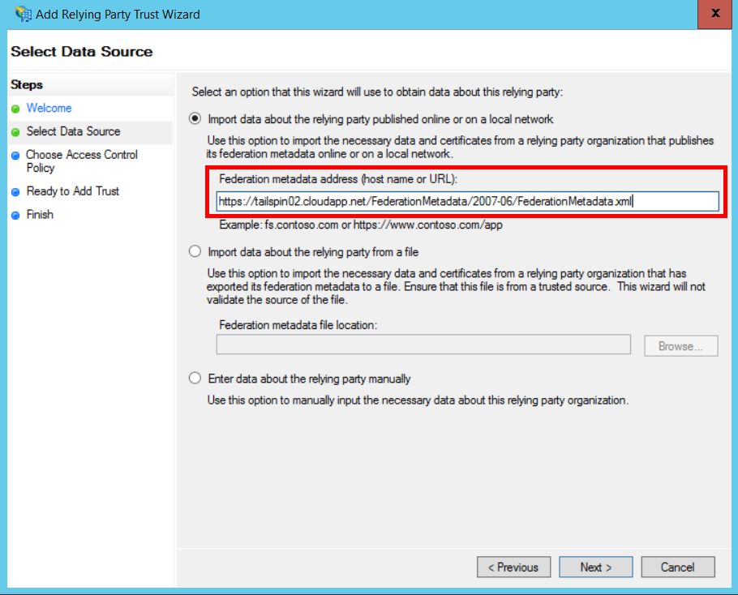
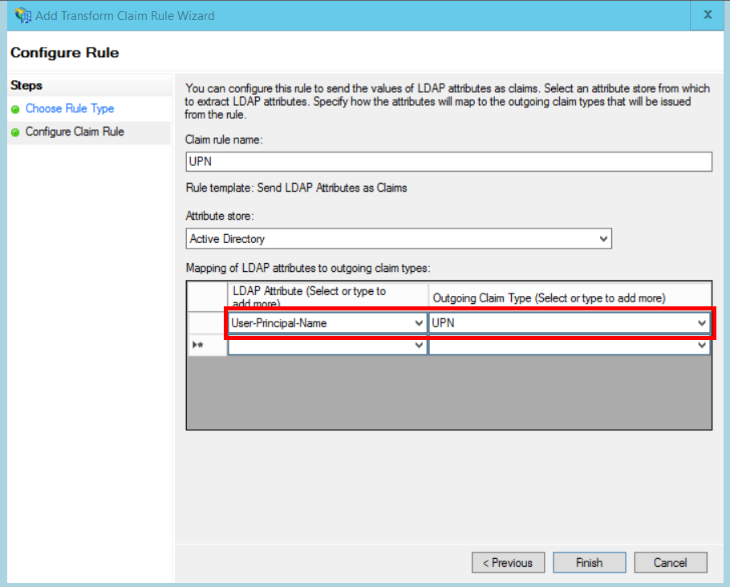

<properties
   pageTitle="La federazione con ADFS del cliente | Microsoft Azure"
   description="Come per federate con un cliente 's ADFS in un'applicazione multi-tenant"
   services=""
   documentationCenter="na"
   authors="JohnPWSharp"
   manager="roshar"
   editor=""
   tags=""/>

<tags
   ms.service="guidance"
   ms.devlang="dotnet"
   ms.topic="article"
   ms.tgt_pltfrm="na"
   ms.workload="na"
   ms.date="06/02/2016"
   ms.author="v-josha"/>

# <a name="federating-with-a-customers-ad-fs-for-multitenant-apps-in-azure"></a>La federazione con ADFS del cliente per le app multi-tenant in Azure

[AZURE.INCLUDE [pnp-header](../../includes/guidance-pnp-header-include.md)]

In questo articolo fa [parte di una serie]. È inoltre disponibile un' [applicazione di esempio] completa relativa a questa serie.

Questo articolo descrive come un'applicazione di SaaS multi-tenant può supportare l'autenticazione tramite Active Directory Federation Services (ADFS), per la federazione con ADFS del cliente.

## <a name="overview"></a>Panoramica

Azure Active Directory (Azure Active Directory) semplifica l'accesso degli utenti da tenant di Azure Active Directory, tra cui i clienti di Office 365 e Dynamics CRM Online. Ma per quanto riguarda i clienti che utilizzano locale Active Directory in una rete intranet aziendale?

Un'opzione possibile consiste per questi utenti per la sincronizzazione di Active Directory loro locali con Azure Active Directory, utilizzando [Azure AD Connect]. Tuttavia, alcuni clienti potrebbero essere Impossibile utilizzare questo approccio, a causa di criteri aziendali IT o altri motivi. In tal caso, un'altra opzione consiste nel creare una federazione Active Directory Federation Services (ADFS).

Per abilitare questo scenario:

-   Il cliente deve disporre di una farm di ADFS esposto a Internet.
-   Il provider di SaaS distribuisce le proprie farm ADFS.
-   Il cliente e il provider di SaaS necessario impostare [protezione federazione]. Si tratta di un processo manuale.

Esistono tre ruoli principali della relazione di attendibilità:

-   ADFS del cliente è il [partner account], responsabile per l'autenticazione degli utenti da parte del cliente di Active Directory e la creazione di token di sicurezza con sulle attestazioni utente.
-   ADFS del provider di SaaS è il [partner risorse], che considera attendibile il partner account e riceve le richieste di utente.
-   L'applicazione è configurata come un componente di applicazione (RP) in ADFS del provider SaaS.

    

> [AZURE.NOTE] In questo articolo si presuppone che utilizza OpenID connettersi come protocollo di autenticazione. È inoltre possibile utilizzare la federazione WS.

> Per connettere OpenID, il provider di SaaS deve utilizzare AD FS 4.0 in esecuzione in Windows Server 2016 è attualmente in Technical Preview. ADFS 3.0 non supporta la connessione OpenID.

> Principali ASP.NET 1.0 non include il supporto della casella per la federazione WS.

Per un esempio dell'uso WS federazione con ASP.NET 4, vedere l' [esempio attivo-directory-dotnet-Web App-wsfederation][active-directory-dotnet-webapp-wsfederation].

## <a name="authentication-flow"></a>Flusso di autenticazione

1.  Quando l'utente fa clic su "effettuarlo", l'applicazione reindirizza all'endpoint OpenID connessione di ADFS del provider SaaS.
2.  L'utente immette il proprio nome utente dell'organizzazione ("`alice@corp.contoso.com`"). ADFS utilizza l'individuazione dell'area di autenticazione per il reindirizzamento a ADFS del cliente, in cui l'utente immette le proprie credenziali.
3.  ADFS del cliente invierà attestazioni utente per ADFS del provider SaaS, utilizzando la federazione WF (o SAML).
4.  Reclami flusso dalla ADFS app, con OpenID connessione. Questa operazione richiede una transizione di protocollo da WS-Federation.

## <a name="limitations"></a>Limitazioni

Al momento della loro l'applicazione riceve un numero limitato di sulle attestazioni in id_token OpenID come indicato nella tabella riportata di seguito. ADFS 4.0 è ancora anteprima, in modo che il valore impostato potrebbero essere modificati. Non è attualmente è possibile definire sulle attestazioni aggiuntive:

Richiesta di rimborso   | Descrizione
------|-------------
AUD | Gruppo di destinatari. L'applicazione per il quale i crediti rilasciati.
AuthenticationInstant   | [Autenticazione immediata]. Si è verificato il momento in cui l'autenticazione.
c_hash  | Valore hash codice. Si tratta hashing del token contenuto.
EXP | [Data di scadenza]. Tempo trascorso il quale i token non è più essere accettati.
IAT | [Rilasciato a]. Ora di emissione token.
ISS | Autorità di certificazione. Il valore dell'attestazione è sempre ADFS del partner risorse.
nome    | Nome utente. Esempio: `john@corp.fabrikam.com`.
NameIdentifier | [Identificatore nome]. Identificatore per il nome dell'entità per il quale è stato rilasciato il token.
nonce   | Nonce sessione. Valore univoco generato da ADFS al fine di evitare attacchi di riproduzione.
UPN | Nome dell'entità utente (UPN). Esempio:john@corp.fabrikam.com
pwd_exp | Periodo di scadenza della password. Il numero di secondi finché la password dell'utente o un segreto autenticazione simili, ad esempio un PIN. scadenza.

> [AZURE.NOTE] "iss" richiedere contiene ADFS del partner (in genere, la richiesta verrà identificare il provider di SaaS come autorità). Non identifica ADFS del cliente. È possibile trovare il dominio del cliente come parte dell'UPN.

Il resto di questo articolo viene descritto come configurare la relazione di attendibilità tra RP (app) e il partner account (il cliente).

## <a name="ad-fs-deployment"></a>Distribuzione di ADFS Active Directory

Il provider di SaaS distribuire ADFS locale o su macchine virtuali di Azure. Per la sicurezza e la disponibilità, le linee guida seguenti sono importanti:

-   Distribuire almeno due server ADFS e due server proxy ADFS per ottenere la migliore disponibilità del servizio di ADFS.
-   Controller di dominio e server ADFS non devono essere mai esposti direttamente a Internet e deve essere in una rete virtuale con accesso diretto agli stessi.
-   I proxy delle applicazioni Web (in precedenza proxy ADFS) deve essere utilizzato per pubblicare server ADFS a Internet.

Per configurare una topologia simile in Azure richiede l'uso di reti virtuali, del NSG, azure macchine Virtuali e set di disponibilità. Per ulteriori informazioni, vedere [linee guida per la distribuzione di Active Directory di Windows Server in macchine virtuali di Azure][active-directory-on-azure].

## <a name="configure-openid-connect-authentication-with-ad-fs"></a>Configurare l'autenticazione OpenID connettersi con ADFS

Il provider di SaaS necessario abilitare OpenID la connessione tra l'applicazione e ADFS. A tale scopo, aggiungere un gruppo di applicazioni in ADFS.  È possibile trovare istruzioni dettagliate in questo [post di blog], in "La configurazione di un Web App per connettersi OpenId effettuarlo ADFS." 

Configurare quindi middleware OpenID connettersi. L'endpoint metadati `https://domain/adfs/.well-known/openid-configuration`, dove dominio è dominio di ADFS del provider di SaaS.

In genere è possibile combinare con gli altri endpoint OpenID connettersi (ad esempio AAD). È necessario due diversi accesso pulsanti o un altro modo per distinguerli, in modo che l'utente viene inviato all'endpoint autenticazione corretto.

## <a name="configure-the-ad-fs-resource-partner"></a>Configura il Partner di ADFS risorse Active Directory

Il provider di SaaS deve eseguire le operazioni seguenti per ogni cliente da connettere tramite ADFS:

1.  Aggiungere un trust provider reclami.
2.  Aggiungere regole di reclami.
3.  Attivare il rilevamento home page dell'area di autenticazione.

Ecco la procedura descritta in modo più dettagliato.

### <a name="add-the-claims-provider-trust"></a>Aggiungere la protezione di provider sulle attestazioni

1.  In Server Manager, fare clic su **Strumenti**e quindi selezionare **AD FS Management**.
2.  Nella struttura della console, in **ADFS**destro del mouse fare clic **Sulle attestazioni Provider trust**. Selezionare **Aggiungi sulle attestazioni Provider protezione**.
3.  Fare clic su **Avvia** per avviare la procedura guidata.
4.  Selezionare l'opzione "Importa dati relativi al provider di attestazioni pubblicato online o in una rete locale". Immettere l'URI dell'endpoint metadati federazione del cliente. (Esempio: `https://contoso.com/FederationMetadata/2007-06/FederationMetadata.xml`.) È necessario ottenere questo dal cliente.
5.  Completare la procedura guidata utilizzando le opzioni predefinite.

### <a name="edit-claims-rules"></a>Modificare le regole sulle attestazioni

1.  Rapida protezione di provider attestazioni appena aggiunto e selezionare **Modifica regole reclami**.
2.  Fare clic su **Aggiungi regola**.
3.  Selezionare "Passano attraverso o filtro di attestazione in ingresso" e fare clic su **Avanti**.
    
4.  Immettere un nome per la regola.
5.  In "Posta in arrivo Richiedi tipo", selezionare **UPN**.
6.  Selezionare "Pass-through tutti i valori attestazione".
  
7.  Fare clic su **Fine**.
8.  Ripetere i passaggi da 2 a 7 e specificare **Il tipo di richiedere ancoraggio** per il tipo di domanda posta in arrivo.
9.  Fare clic su **OK** per completare la procedura guidata.

### <a name="enable-home-realm-discovery"></a>Attivare il rilevamento home page dell'area di autenticazione
Eseguire il seguente script di PowerShell:

```
Set-ADFSClaimsProviderTrust -TargetName "name" -OrganizationalAccountSuffix @("suffix")
```

dove "nome" è il nome descrittivo dell'attendibilità di provider sulle attestazioni e "suffisso" è il suffisso UPN per il cliente 's Active Directory (ad esempio, "corp.fabrikam.com").

Con questa configurazione, gli utenti finali possibile digitare il proprio account aziendale e ADFS seleziona automaticamente il provider di attestazioni corrispondente. Vedere [personalizzare le pagine di accesso in ADFS Active Directory], nella sezione "Provider di identità Configura per utilizzare un determinato suffisso di posta elettronica".

## <a name="configure-the-ad-fs-account-partner"></a>Configura il Partner di ADFS Account Active Directory

Il cliente deve eseguire le operazioni seguenti:

1.  Aggiungere un componente trust di terze parti (RP).
2.  Aggiunge le regole di reclami.

### <a name="add-the-rp-trust"></a>Aggiungere la protezione RP

1.  In Server Manager, fare clic su **Strumenti**e quindi selezionare **AD FS Management**.
2.  Nella struttura della console, in **ADFS**, fare clic destro **Attendibilità componente**. Selezionare **Aggiungi attendibilità componente**.
3.  Selezionare **Grado di riconoscere attestazioni** e fare clic su **Start**.
4.  Nella pagina **Seleziona origine dati** selezionare l'opzione "Importa dati relativi al provider di attestazioni pubblicato online o in una rete locale". Immettere l'URI dell'endpoint metadati federazione del provider SaaS.
  
5.  Nella pagina **Specificare il nome visualizzazione** immettere un nome.
6.  Nella pagina **Scegliere Criteri di controllo di accesso** , scegliere un criterio. Si può consentire a tutti gli utenti nell'organizzazione o scegliere un gruppo di sicurezza specifico.
  
7.  Immettere i parametri necessari nella casella **criterio** .
8.  Fare clic su **Avanti** per completare la procedura guidata.

### <a name="add-claims-rules"></a>Aggiungere regole sulle attestazioni

1.  Selezionare **Criterio di rilascio Richiedi modifica**rapida la protezione di terze parti componente appena aggiunto.
2.  Fare clic su **Aggiungi regola**.
3.  Selezionare "Inviare attributi LDAP come attestazioni" e fare clic su **Avanti**.
4.  Immettere un nome per la regola, ad esempio "UPN".
5.  In **memorizzare attributo**, selezionare **Active Directory**.
  
6.  Nella sezione **attributi Mapping di LDAP** :
  - In **Attributo LDAP**, selezionare il **Nome di identità utente**.
  - In **Tipo di attestazione in uscita**, selezionare **UPN**.
  
7.  Fare clic su **Fine**.
8.  Fare di nuovo clic su **Aggiungi regola** .
9.  Selezionare "Invia sulle attestazioni tramite una regola personalizzata" e fare clic su **Avanti**.
10. Immettere un nome per la regola, ad esempio "Tipo di ancoraggio attestazione".
11. In **regole personalizzate**, immettere quanto segue:

    ```
    EXISTS([Type == "http://schemas.microsoft.com/ws/2014/01/identity/claims/anchorclaimtype"])=>
      issue (Type = "http://schemas.microsoft.com/ws/2014/01/identity/claims/anchorclaimtype",
             Value = "http://schemas.xmlsoap.org/ws/2005/05/identity/claims/upn");
    ```

    Questa regola invia una richiesta di tipo `anchorclaimtype`. La domanda indica il componente di applicazione da utilizzare UPN come l'ID non modificabile. dell'utente

12. Fare clic su **Fine**.
13. Fare clic su **OK** per completare la procedura guidata.

## <a name="next-steps"></a>Passaggi successivi

- Articolo successivo in questa serie: [uso asserzione client per ottenere i token di accesso da Azure Active Directory][client assertion]

<!-- Links -->
[parte di una serie]: guidance-multitenant-identity.md
[Azure AD Connect]: ../active-directory/active-directory-aadconnect.md
[protezione federazione]: https://technet.microsoft.com/library/cc770993(v=ws.11).aspx
[partner account]: https://technet.microsoft.com/library/cc731141(v=ws.11).aspx
[partner risorse]: https://technet.microsoft.com/library/cc731141(v=ws.11).aspx
[Autenticazione immediata]: https://msdn.microsoft.com/library/system.security.claims.claimtypes.authenticationinstant%28v=vs.110%29.aspx
[Data di scadenza]: http://tools.ietf.org/html/draft-ietf-oauth-json-web-token-25#section-4.1.4
[Rilasciato a]: http://tools.ietf.org/html/draft-ietf-oauth-json-web-token-25#section-4.1.6
[Identificatore nome]: https://msdn.microsoft.com/library/system.security.claims.claimtypes.nameidentifier(v=vs.110).aspx
[active-directory-on-azure]: https://msdn.microsoft.com/library/azure/jj156090.aspx
[post di blog]: http://www.cloudidentity.com/blog/2015/08/21/OPENID-CONNECT-WEB-SIGN-ON-WITH-ADFS-IN-WINDOWS-SERVER-2016-TP3/
[Personalizzare le pagine di accesso in ADFS Active Directory]: https://technet.microsoft.com/library/dn280950.aspx
[applicazione di esempio]: https://github.com/Azure-Samples/guidance-identity-management-for-multitenant-apps
[client assertion]: guidance-multitenant-identity-client-assertion.md
[active-directory-dotnet-webapp-wsfederation]: https://github.com/Azure-Samples/active-directory-dotnet-webapp-wsfederation
