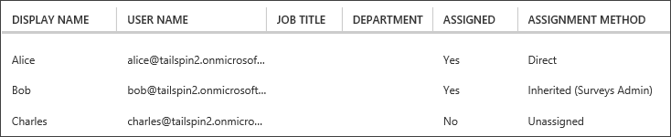

<properties
   pageTitle="Ruoli applicazione | Microsoft Azure"
   description="Come eseguire l'autorizzazione utilizzando i ruoli applicazione"
   services=""
   documentationCenter="na"
   authors="MikeWasson"
   manager="roshar"
   editor=""
   tags=""/>

<tags
   ms.service="guidance"
   ms.devlang="dotnet"
   ms.topic="article"
   ms.tgt_pltfrm="na"
   ms.workload="na"
   ms.date="02/16/2016"
   ms.author="mwasson"/>

#  <a name="application-roles-in-multitenant-applications"></a>Ruoli di applicazione nelle applicazioni multi-tenant

[AZURE.INCLUDE [pnp-header](../../includes/guidance-pnp-header-include.md)]

In questo articolo fa [parte di una serie]. È inoltre disponibile un' [applicazione di esempio] completa relativa a questa serie.

Ruoli applicazione vengono utilizzati per assegnare autorizzazioni agli utenti. Ad esempio, i [Sondaggi Tailspin] [ Tailspin] applicazione definisce i ruoli seguenti:

- Amministratore. Possono eseguire tutte le operazioni CRUD su qualsiasi sondaggio appartenente a tenant.
- Autore. Creare nuovi sondaggi.
- Utilità per la lettura. Leggere indagini che appartengono al tenant.

È possibile vedere che ruoli infine essere convertiti in autorizzazioni, durante [l'autorizzazione]. Ma la prima domanda come assegnare e gestire i ruoli. Abbiamo identificato tre opzioni principali:

-   [Azure Active Directory App ruoli](#roles-using-azure-ad-app-roles)
-   [Gruppi di sicurezza di Azure Active Directory](#roles-using-azure-ad-security-groups)
-   [Gestione ruoli applicazione](#roles-using-an-application-role-manager).

## <a name="roles-using-azure-ad-app-roles"></a>Ruoli utilizzando i ruoli di Azure Active Directory App

Questo è l'approccio che è stato usato nell'app Tailspin sondaggi.

Questo approccio, SaaS il provider definisce i ruoli dell'applicazione aggiungendoli al manifesto dell'applicazione. Dopo che un cliente si iscrive, un amministratore per directory Active Directory del cliente assegna gli utenti ai ruoli. Quando un utente accede, ruoli assegnati dell'utente vengono inviati come attestazioni.

> [AZURE.NOTE] Se si dispone della Premium di Azure Active Directory, l'amministratore può assegnare un gruppo di sicurezza a un ruolo e i membri del gruppo ereditano il ruolo di app. In questo modo utile per gestire i ruoli, il proprietario del gruppo non è necessario essere un amministratore di Active Directory.

Vantaggi di questo approccio:

-   Semplice modello di programmazione.
-   Ruoli sono specifici dell'applicazione. Le richieste di ruolo per un'applicazione non vengono inviate a un'altra applicazione.
-   Se il cliente rimuove l'applicazione dal tenant di Active Directory, i ruoli di accedere al computer.
-   L'applicazione non richiede le autorizzazioni Active Directory aggiuntive, ad eccezione del profilo utente di lettura.

Svantaggi:

- Clienti senza Azure Active Directory Premium non è possibile assegnare i gruppi di sicurezza ai ruoli. In questi casi, tutte le assegnazioni utente devono essere eseguite da un amministratore di Active Directory.
- Se si dispone di un web back-end API, che è distinto dal web app, assegnazioni di ruolo per il web app non applicano all'API web. Per ulteriori informazioni in questo punto, vedere [proteggere un back-end web API].

### <a name="implementation"></a>Implementazione

**Definire i ruoli.** Il provider di SaaS dichiara ruoli app [manifesto dell'applicazione]. Ecco, ad esempio, la voce manifesto per l'app sondaggi:

```
"appRoles": [
  {
    "allowedMemberTypes": [
      "User"
    ],
    "description": "Creators can create Surveys",
    "displayName": "SurveyCreator",
    "id": "1b4f816e-5eaf-48b9-8613-7923830595ad",
    "isEnabled": true,
    "value": "SurveyCreator"
  },
  {
    "allowedMemberTypes": [
      "User"
    ],
    "description": "Administrators can manage the Surveys in their tenant",
    "displayName": "SurveyAdmin",
    "id": "c20e145e-5459-4a6c-a074-b942bbd4cfe1",
    "isEnabled": true,
    "value": "SurveyAdmin"
  }
],
```

Il `value` proprietà sia visualizzata la richiesta di ruolo. Il `id` proprietà è l'identificatore univoco per il ruolo definito. Sempre generare un nuovo valore GUID per `id`.

**Assegnare agli utenti**. Quando si iscrive un nuovo cliente, l'applicazione viene registrata nel tenant di Active Directory del cliente. A questo punto, un amministratore di Active Directory per tenant possibile assegnare utenti ai ruoli.

> [AZURE.NOTE] Come indicato in precedenza, i clienti con Azure Active Directory Premium inoltre possono assegnare i gruppi di sicurezza ai ruoli.

Dal portale di Azure nella schermata seguente mostra tre utenti. Alice è stata assegnata direttamente a un ruolo. Davide ereditate un ruolo come membro del gruppo di sicurezza denominato "Sondaggi amministratore", che viene assegnata a un ruolo. Charles non è assegnato a qualsiasi ruolo.



> [AZURE.NOTE] In alternativa, l'applicazione possibile assegnare i ruoli a livello di programmazione, tramite l'API di Azure Active Directory grafico.  Tuttavia, è necessario all'applicazione di ottenere le autorizzazioni di scrittura per directory Active Directory del cliente. Un'applicazione con le autorizzazioni necessarie può eseguire numerose danni &mdash; il cliente è considerare attendibile l'app in modo che non danneggiare la propria directory. Molti clienti potrebbero essere Impossibile concedere questo livello di accesso.

È possibile **ottenere delle attestazioni ruolo**. Quando un utente accede, l'applicazione riceve ruoli assegnati dell'utente di reclami tipo `http://schemas.microsoft.com/ws/2008/06/identity/claims/role`.  

Un utente può contenere più ruoli o alcun ruolo. Nel codice autorizzazione non presuppongono che l'utente ha esattamente un ruolo richiedere. Se, tuttavia, scrivere codice per verificare se è presente un valore specifico Richiedi:

```csharp
if (context.User.HasClaim(ClaimTypes.Role, "Admin")) { ... }
```

## <a name="roles-using-azure-ad-security-groups"></a>Ruoli con i gruppi di sicurezza di Azure Active Directory

In questo caso i ruoli sono rappresentati come gruppi di sicurezza di Active Directory. L'applicazione assegna autorizzazioni agli utenti in base alle appartenenze ai gruppi di sicurezza.

Vantaggi:

-   Per i clienti che non dispongono di Azure Active Directory Premium, in questo modo il cliente utilizzare i gruppi di sicurezza per gestire le assegnazioni di ruolo.

Svantaggi:

- Complessità. In quanto ogni tenant invia sulle attestazioni gruppo diverso, l'app è necessario tenere traccia di gruppi di sicurezza corrispondenti a determinati ruoli applicazione per ogni tenant.
- Se il cliente rimuove l'applicazione dal tenant di Active Directory, i gruppi di sicurezza vengono lasciati nella directory di Active Directory.

### <a name="implementation"></a>Implementazione

Manifesto dell'applicazione, impostare il `groupMembershipClaims` la proprietà "SecurityGroup". È necessario per ottenere delle attestazioni appartenenza al gruppo da AAD.

```
{
   // ...
   "groupMembershipClaims": "SecurityGroup",
}
```

Quando si iscrive un nuovo cliente, l'applicazione indica il cliente per creare gruppi di sicurezza per i ruoli necessari per l'applicazione. Il cliente, quindi è necessario immettere l'ID dell'oggetto gruppo nell'applicazione. L'applicazione archivia questi elementi in una tabella che esegue il mapping di ID di gruppo di ruoli di applicazione, per ogni tenant.

> [AZURE.NOTE] In alternativa, l'applicazione può creare i gruppi a livello di programmazione, tramite l'API di Azure Active Directory grafico.  Dovrebbe essere meno errori. Tuttavia, richiede l'esecuzione di un'applicazione di ottenere "leggere e scrivere tutti i gruppi" autorizzazioni per Active directory il cliente. Molti clienti potrebbero essere Impossibile concedere questo livello di accesso.

Quando un utente accede:

1.  L'applicazione riceve i gruppi dell'utente come attestazioni. Il valore di ciascuna richiesta di indennizzo è l'ID di oggetto di un gruppo.
2.  Azure Active Directory limita il numero di gruppi inviati nel token. Se il numero di gruppi supera questo limite, Azure Active Directory invia domanda "elaborazione" speciale. Se la domanda è presenta, è necessario eseguire l'applicazione query l'API di Azure Active Directory grafico per visualizzare tutti i gruppi a cui appartiene l'utente. Per informazioni dettagliate, vedere [autorizzazione nelle applicazioni Cloud con i gruppi di Active Directory], sotto la sezione intitolata "Gruppi di richiedere eccesso di dosaggio".
3.  L'applicazione cerca gli ID oggetto in un database, per trovare i ruoli di applicazione corrispondente da assegnare all'utente.
4.  L'applicazione aggiunge un valore attestazione personalizzata per l'identità utente che indica il ruolo di applicazione. Ad esempio: `survey_role` = "SurveyAdmin".

Criteri di autorizzazione è necessario utilizzare Richiedi ruolo personalizzato richiedere non al gruppo.

## <a name="roles-using-an-application-role-manager"></a>Ruoli gestione un ruolo applicazione

Con questo approccio, ruoli applicazione non vengono memorizzati in Azure Active Directory tutto. Se, tuttavia, l'applicazione archivia le assegnazioni di ruolo per ogni utente nella propria DB &mdash; , ad esempio, utilizzando la classe **RoleManager** identità ASP.NET.

Vantaggi:

-   L'app ha il controllo completo sui ruoli e le assegnazioni utente.

Svantaggi:

- Più complesse, più difficili da gestire.
- Non è possibile utilizzare i gruppi di sicurezza Active Directory per gestire le assegnazioni di ruolo.
- Memorizzare le informazioni utente nel database dell'applicazione, in cui accessibile sincronizzato con directory Active Directory del tenant, come gli utenti vengono aggiunti o rimossi.   

Sono disponibili molti esempi esistenti per questo approccio. Ad esempio, vedere [creare un'app di MVC ASP.NET con auth e DB SQL e distribuire al servizio App Azure].

## <a name="next-steps"></a>Passaggi successivi

- Articolo successivo in questa serie: [autorizzazione basato sui ruoli e basate sulle risorse nelle applicazioni multi-tenant][autorizzazione]

<!-- Links -->
[Tailspin]: guidance-multitenant-identity-tailspin.md
[parte di una serie]: guidance-multitenant-identity.md
[autorizzazione]: guidance-multitenant-identity-authorize.md
[Proteggere dell'API web back-end]: guidance-multitenant-identity-web-api.md
[Creare un'applicazione MVC ASP.NET con auth e DB SQL e distribuire al servizio App Azure]: ../app-service-web/web-sites-dotnet-deploy-aspnet-mvc-app-membership-oauth-sql-database.md
[manifesto dell'applicazione]: ../active-directory/active-directory-application-manifest.md
[applicazione di esempio]: https://github.com/Azure-Samples/guidance-identity-management-for-multitenant-apps
