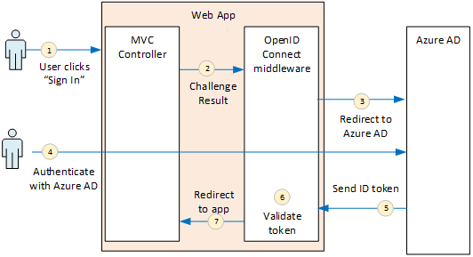
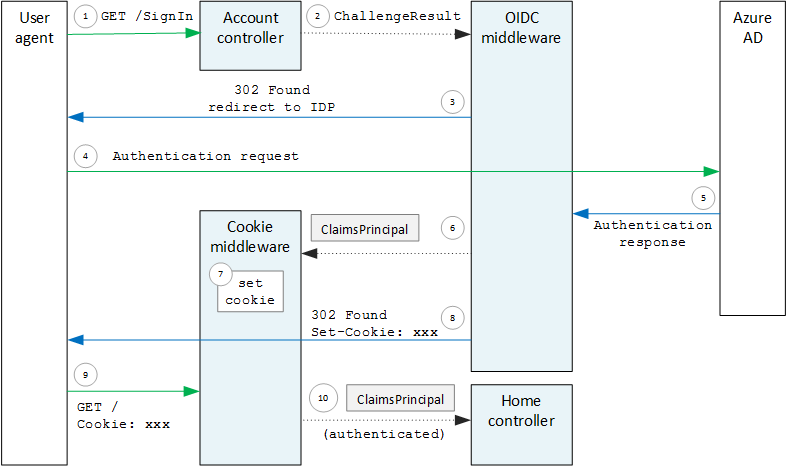

<properties
   pageTitle="Autenticazione in applicazioni multi-tenant | Microsoft Azure"
   description="Come un'applicazione multi-tenant possibile autenticare gli utenti da Azure Active Directory"
   services=""
   documentationCenter="na"
   authors="MikeWasson"
   manager="roshar"
   editor=""
   tags=""/>

<tags
   ms.service="guidance"
   ms.devlang="dotnet"
   ms.topic="article"
   ms.tgt_pltfrm="na"
   ms.workload="na"
   ms.date="05/23/2016"
   ms.author="mwasson"/>

# <a name="authentication-in-multitenant-apps-using-azure-ad-and-openid-connect"></a>Autenticazione nelle App multi-tenant, utilizzando Azure Active Directory e connettere OpenID

[AZURE.INCLUDE [pnp-header](../../includes/guidance-pnp-header-include.md)]

In questo articolo fa [parte di una serie](guidance-multitenant-identity.md). È inoltre disponibile un' [applicazione di esempio] completa relativa a questa serie.

Questo articolo descrive come un'applicazione multi-tenant possibile autenticare gli utenti da Azure Active Directory (Azure Active Directory), utilizzando OpenID connettersi (OIDC) per eseguire l'autenticazione.

## <a name="overview"></a>Panoramica

L' [implementazione di riferimento](guidance-multitenant-identity-tailspin.md) è un'applicazione ASP.NET Core 1.0. L'applicazione utilizza middleware OpenID connettersi incorporato per eseguire il flusso di autenticazione OIDC. Nel diagramma seguente mostra cosa accade quando l'utente è accede a un livello elevato.



1.  L'utente fa clic sul pulsante "effettuarlo" nell'app. Questa azione viene gestita da un controller MVC.
2.  Controller MVC restituisce un'azione **ChallengeResult** .
3.  Middleware intercetta **ChallengeResult** e crea una risposta 302 che reindirizza l'utente alla pagina di accesso di Azure Active Directory.
4.  L'utente viene autenticato con Azure Active Directory.
5.  Azure Active Directory invia un token di ID dell'applicazione.
6.  Middleware convalida token ID. A questo punto, l'utente viene autenticato ora all'interno dell'applicazione.
7.  Middleware reindirizza l'utente all'applicazione.

## <a name="register-the-app-with-azure-ad"></a>Registrare l'app di Azure Active Directory

Per attivare la connessione OpenID, il provider di SaaS registra l'applicazione all'interno delle proprie tenant di Azure Active Directory.

Per registrare l'applicazione, seguire la procedura descritta in [Applicazioni integrazione con Azure Active Directory](../active-directory/active-directory-integrating-applications.md), nella sezione [aggiunta di un'applicazione](../active-directory/active-directory-integrating-applications.md#adding-an-application).

Nella pagina **Configura** :

-   Si noti l'ID client.
-   In **applicazione è multi-Tenant**, selezionare **Sì**.
-   Impostare **l'URL di risposta** su un URL in Azure Active Directory invierà la risposta di autenticazione. È possibile utilizzare l'URL di base dell'app.
  - Nota: Il percorso URL può essere qualsiasi elemento, come il nome host corrisponde l'app distribuita.
  - È possibile impostare più URL di risposta. Fase di sviluppo, è possibile utilizzare una `localhost` indirizzo, per eseguire l'app in locale.
-   Generare un segreto client: in **tasti**, fare clic su nell'elenco a discesa che informa che **Selezionare durata** e selezionare 1 o 2 anni. Il tasto sarà visibile quando si fa clic su **Salva**. Assicurarsi di copiare il valore, poiché non viene visualizzato nuovamente quando si ricarica la pagina di configurazione.

## <a name="configure-the-auth-middleware"></a>Configurare middleware auth

In questa sezione viene descritto come configurare middleware l'autenticazione in ASP.NET 1.0 principali per l'autenticazione multi-tenant con OpenID connettersi.

In una classe di avvio, aggiungere middleware OpenID connettersi:

```csharp
app.UseOpenIdConnectAuthentication(options =>
{
    options.AutomaticAuthenticate = true;
    options.AutomaticChallenge = true;
    options.ClientId = [client ID];
    options.Authority = "https://login.microsoftonline.com/common/";
    options.CallbackPath = [callback path];
    options.PostLogoutRedirectUri = [application URI];
    options.SignInScheme = CookieAuthenticationDefaults.AuthenticationScheme;
    options.TokenValidationParameters = new TokenValidationParameters
    {
        ValidateIssuer = false
    };
    options.Events = [event callbacks];
});
```

> [AZURE.NOTE] Vedere [Startup.cs](https://github.com/Azure-Samples/guidance-identity-management-for-multitenant-apps/blob/master/src/Tailspin.Surveys.Web/Startup.cs).

Per ulteriori informazioni sulla classe di avvio, vedere [Avvio dell'applicazione](https://docs.asp.net/en/latest/fundamentals/startup.html) nella documentazione di ASP.NET Core 1.0.

Impostare le opzioni di middleware seguenti:

- **ClientId**. ID client dell'applicazione, ottenuto al momento della registrazione dell'applicazione in Azure Active Directory.
- **Autorità**. Per un'applicazione multi-tenant, impostare `https://login.microsoftonline.com/common/`. Questo è l'URL per l'endpoint comune di Azure Active Directory, che consente agli utenti da un tenant di Azure AD effettuare l'accesso. Per ulteriori informazioni sull'endpoint comuni, vedere [questo post di blog](http://www.cloudidentity.com/blog/2014/08/26/the-common-endpoint-walks-like-a-tenant-talks-like-a-tenant-but-is-not-a-tenant/).
- In **TokenValidationParameters**, impostare **ValidateIssuer** su false. Che indica che l'app prendersi la responsabilità per convalidare il valore di emittente nel token di ID. (Middleware convalida ancora token stesso.) Per ulteriori informazioni sulle autorità di convalida, vedere [convalida emittente](guidance-multitenant-identity-claims.md#issuer-validation).
- **CallbackPath**. Impostare il percorso nell'URL di risposta registrate in Azure Active Directory. Ad esempio, se l'URL di risposta `http://contoso.com/aadsignin`, deve essere **CallbackPath** `aadsignin`. Se non si imposta questa opzione, il valore predefinito è `signin-oidc`.
- **PostLogoutRedirectUri**. Specificare un URL per reindirizzare gli utenti dopo la disconnessione. Deve trattarsi di una pagina che consente le richieste di anonime &mdash; in genere la home page.
- **SignInScheme**. Impostare questa proprietà su `CookieAuthenticationDefaults.AuthenticationScheme`. Ciò significa che dopo l'utente autenticato, attestazioni utente vengono archiviate in locale in un cookie. Questo cookie è come l'utente rimane connesso durante la sessione del browser.
- **Eventi.** Callback degli eventi; vedere [gli eventi di autenticazione](#authentication-events).

Aggiungere anche middleware Cookie autenticazione per la pipeline. Questo middleware è responsabile per la scrittura attestazioni utente per un cookie e quindi la lettura del cookie durante il caricamento di pagina successiva.

```csharp
app.UseCookieAuthentication(options =>
{
    options.AutomaticAuthenticate = true;
    options.AutomaticChallenge = true;
    options.AccessDeniedPath = "/Home/Forbidden";
});
```

## <a name="initiate-the-authentication-flow"></a>Avviare il flusso di autenticazione

Per avviare il flusso di autenticazione in ASP.NET MVC, restituire un **ChallengeResult** dal controller:

```csharp
[AllowAnonymous]
public IActionResult SignIn()
{
    return new ChallengeResult(
        OpenIdConnectDefaults.AuthenticationScheme,
        new AuthenticationProperties
        {
            IsPersistent = true,
            RedirectUri = Url.Action("SignInCallback", "Account")
        });
}
```

In questo modo middleware restituire una risposta (trovato) 302 che reindirizza l'endpoint di autenticazione.

## <a name="user-login-sessions"></a>Sessioni di accesso utente

Come detto, quando l'utente accede prima di tutto, middleware autenticazione Cookie scrive attestazioni utente per un cookie. In seguito, le richieste HTTP vengono autenticate, leggere il cookie.

Per impostazione predefinita, middleware cookie scrive un [cookie sessione][session-cookie], che ottiene una volta eliminati l'utente chiude il browser. La volta successiva che l'utente visita nuovamente il sito, è necessario accedere di nuovo. Tuttavia, se **IsPersistent** è impostato su true in **ChallengeResult**, middleware scrive un cookie persistente, in modo che l'utente resti connesso dopo la chiusura del browser. È possibile configurare la scadenza del cookie; vedere [le opzioni dei cookie controllo][cookie-options]. I cookie permanenti sono più utili per l'utente, ma potrebbero non essere appropriati per alcune applicazioni (ad esempio, un'applicazione bancaria) in cui si vuole che l'utente ad accedere ogni volta.

## <a name="about-the-openid-connect-middleware"></a>Sulle middleware OpenID connettersi

Middleware OpenID connettersi ASP.NET nasconde la maggior parte dei dettagli protocollo. In questa sezione sono alcune note sull'implementazione, che può essere utile per la comprensione del flusso di protocollo.

Prima di tutto, esaminiamo il flusso di autenticazione in termini di ASP.NET (ignorando i dettagli del flusso di protocollo OIDC tra le app e Azure Active Directory). Nel diagramma seguente viene illustrato il processo.



Nel diagramma, sono disponibili due controller MVC. Account controller gestisce le richieste di accesso e controller Home serve la home page.

Ecco il processo di autenticazione:

1. L'utente fa clic sul pulsante "Accedi" e il browser invia una richiesta GET. Ad esempio: `GET /Account/SignIn/`.
2. Restituisce il controller account un `ChallengeResult`.
3. Middleware OIDC restituisce una risposta HTTP 302 reindirizzare su Azure Active Directory.
4. Il browser invia la richiesta di autenticazione Azure Active Directory
5. L'utente accede a Azure Active Directory e Azure Active Directory invia una risposta di autenticazione.
6. Middleware OIDC crea un'entità crediti e passa al middleware autenticazione Cookie.
7. Middleware cookie serializza capitale crediti e imposta un cookie.
8. Middleware OIDC reindirizza all'URL di callback dell'applicazione.
10. Il browser viene reindirizzato, inviare i cookie nella richiesta.
11. Middleware cookie deserializza cookie da delle attestazioni principale e imposta `HttpContext.User` uguale a capitale reclami. La richiesta viene instradata a un controller MVC.

### <a name="authentication-ticket"></a>Ticket di autenticazione

Se l'autenticazione ha avuto esito positivo, middleware OIDC crea un ticket di autenticazione, che contiene un'entità sulle attestazioni contenente delle attestazioni dell'utente. È possibile accedere ticket all'interno di evento **AuthenticationValidated** o **TicketReceived** .

> [AZURE.NOTE] Completare il flusso di autenticazione intera, `HttpContext.User` un anonimo principale, _non_ contiene ancora l'utente autenticato. Capitale anonimo dispone di un insieme di attestazioni vuoto. Dopo il completamento dell'autenticazione e reindirizzamenti app middleware cookie deserializza i cookie di autenticazione e i set `HttpContext.User` a un'identità di reclami che rappresenta l'utente autenticato.

### <a name="authentication-events"></a>Eventi di autenticazione

Durante il processo di autenticazione middleware OpenID connettersi genera una serie di eventi:

- **RedirectToAuthenticationEndpoint**. Chiamare direttamente prima middleware reindirizza l'endpoint di autenticazione. È possibile utilizzare questo evento per modificare l'URL di reindirizzamento; ad esempio, per aggiungere i parametri della richiesta. Per un esempio, vedere [aggiunta di consenso amministratore](guidance-multitenant-identity-signup.md#adding-the-admin-consent-prompt) .

- **AuthorizationResponseReceived**. Chiamato dopo il middleware riceve la risposta di autenticazione dal provider di identità (IDP), ma prima middleware convalidato la risposta.  

- **AuthorizationCodeReceived**. Chiamata con il codice di autorizzazione.

- **TokenResponseReceived**. Chiamato dopo middleware Ottiene token di accesso dal IDP. Si applica solo al flusso di codice di autorizzazione.

- **AuthenticationValidated**. Chiamato dopo il middleware convalidato il token di ID. A questo punto, l'applicazione ha una serie di attestazioni convalidate sull'utente. Per eseguire la convalida altre domande o per trasformare sulle attestazioni, è possibile utilizzare questo evento. Vedere [uso di reclami](guidance-multitenant-identity-claims.md).

- **UserInformationReceived**. Chiamato se middleware Ottiene il profilo utente dal punto finale di informazioni utente. Si applica solo a flusso del codice di autorizzazione e solo quando `GetClaimsFromUserInfoEndpoint = true` nelle opzioni di middleware.

- **TicketReceived**. Chiama una volta completata l'autenticazione. Questo è l'ultimo evento, presupponendo che l'autenticazione ha avuto esito positivo. Dopo l'evento viene gestito, l'utente è connesso all'app.

- **AuthenticationFailed**. Chiamata se si verifica un errore di autenticazione. Utilizzare questo evento per gestire gli errori di autenticazione &mdash; , ad esempio, per il reindirizzamento a una pagina di errore.

Per fornire callback per questi eventi, impostare l'opzione di **eventi** sul middleware. Esistono diversi modi per dichiarare gestori: in linea con le espressioni lambda o in una classe che deriva da **OpenIdConnectEvents**.

In linea con le espressioni lambda:

```csharp
app.UseOpenIdConnectAuthentication(options =>
{
    // Other options not shown.

    options.Events = new OpenIdConnectEvents
    {
        OnTicketReceived = (context) =>
        {
             // Handle event
             return Task.FromResult(0);
        },
        // other events
    }
});
```

Derivazione **OpenIdConnectEvents**:

```csharp
public class SurveyAuthenticationEvents : OpenIdConnectEvents
{
    public override Task TicketReceived(TicketReceivedContext context)
    {
        // Handle event
        return base.TicketReceived(context);
    }
    // other events
}

// In Startup.cs:
app.UseOpenIdConnectAuthentication(options =>
{
    // Other options not shown.

    options.Events = new SurveyAuthenticationEvents();
});
```

Il secondo approccio è consigliato se il callback degli eventi hanno una logica sostanziale, in modo che non messaggi secondari la classe di avvio. Questo approccio; viene utilizzato l'implementazione di riferimento vedere [SurveyAuthenticationEvents.cs](https://github.com/Azure-Samples/guidance-identity-management-for-multitenant-apps/blob/master/src/Tailspin.Surveys.Web/Security/SurveyAuthenticationEvents.cs).

### <a name="openid-connect-endpoints"></a>OpenID connettere i punti finali

Azure Active Directory supporta l' [Individuazione di connettersi OpenID](https://openid.net/specs/openid-connect-discovery-1_0.html), in cui il provider di identità (IDP) restituisce un documento di metadati JSON da un [endpoint noto](https://openid.net/specs/openid-connect-discovery-1_0.html#ProviderConfig). Il documento di metadati contiene informazioni come:

-   URL dell'endpoint di autorizzazione. Verrà visualizzata nel punto in cui l'app reindirizza all'autenticazione dell'utente.
-   URL dell'endpoint "terminare sessione", in cui l'app verrà collocata la disconnessione l'utente.
-   L'URL per ottenere le chiavi firma, che viene utilizzato il client per convalidare i token OIDC che ottiene dal IDP.

Per impostazione predefinita, middleware OIDC sa come recuperare i metadati. Impostare l'opzione **autorità** in middleware e middleware costrutti l'URL per i metadati. (È possibile ignorare l'URL dei metadati impostando l'opzione **MetadataAddress** ).

### <a name="openid-connect-flows"></a>OpenID connettere flussi

Per impostazione predefinita, middleware OIDC Usa flusso ibrido con la modalità di risposta post modulo.

-   _Flusso ibrido_ indica che il client può accedere token ID e un codice di autorizzazione di round trip stesso nel server di autorizzazione.
-   _Modulo di registrazione in modalità di risposta_ indica che il server di autorizzazione utilizza una richiesta HTTP POST per inviare il codice ID token e l'autorizzazione all'app. I valori vengono codifica URL modulo (tipo di contenuto = "applicazione/x-www-form-urlencoded").

Quando il middleware OIDC reindirizza per l'endpoint di autorizzazione, l'URL di reindirizzamento include tutti i parametri di stringa di query necessari per OIDC. Per il flusso di ibrido:

-   client_id. Questo valore viene impostato nell'opzione di **ClientId**
-   ambito = "openid profilo", ovvero si tratta di una richiesta OIDC e si vuole che il profilo dell'utente.
-   response_type = "codice id_token". Specifica del flusso di distribuzione ibrida.
-   response_mode = "form_post". Modulo di risposta post specifica.

Per specificare un flusso diverso, impostare la proprietà **ResponseType** nell'elenco Opzioni. Per esempio:

```csharp
app.UseOpenIdConnectAuthentication(options =>
{
    options.ResponseType = "code"; // Authorization code flow

    // Other options
}
```

## <a name="next-steps"></a>Passaggi successivi

- Articolo successivo in questa serie: [utilizzo delle identità basata sulle attestazioni nelle applicazioni multi-tenant][claims]


[claims]: guidance-multitenant-identity-claims.md
[cookie-options]: https://docs.asp.net/en/latest/security/authentication/cookie.html#controlling-cookie-options
[session-cookie]: https://en.wikipedia.org/wiki/HTTP_cookie#Session_cookie
[applicazione di esempio]: https://github.com/Azure-Samples/guidance-identity-management-for-multitenant-apps
