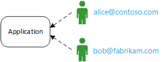

<properties
   pageTitle="Gestione delle identità per le applicazioni multi-tenant | Microsoft Azure"
   description="Introduzione alla gestione delle identità nelle applicazioni multi-tenant"
   services=""
   documentationCenter="na"
   authors="MikeWasson"
   manager="roshar"
   editor=""
   tags=""/>

<tags
   ms.service="guidance"
   ms.devlang="dotnet"
   ms.topic="article"
   ms.tgt_pltfrm="na"
   ms.workload="na"
   ms.date="06/02/2016"
   ms.author="mwasson"/>

# Introduzione alla gestione delle identità per le applicazioni multi-tenant in Microsoft Azure

[AZURE.INCLUDE [pnp-header](../../includes/guidance-pnp-header-include.md)]

In questo articolo fa [parte di una serie]. È inoltre disponibile un' [applicazione di esempio] completa relativa a questa serie.

Supponiamo che si sta scrivendo un'azienda SaaS applicazione da ospitare nel cloud. Naturalmente, l'applicazione avrà utenti:

Ma tali utenti appartengono a organizzazioni:

Esempio: Tailspin vende gli abbonamenti a relativa applicazione SaaS. Contoso e Fabrikam iscriversi per l'app. Quando Alice (`alice@contoso`) segni in, l'applicazione di sapere che Alice fa parte di Contoso.

- Alice _deve_ avere accesso ai dati di Contoso.
- Alice _non deve_ avere accesso ai dati di Fabrikam.

Questa guida illustra come gestire le identità degli utenti in un'applicazione multi-tenant, con [Azure Active Directory] [ AzureAD] (Azure Active Directory) per gestire l'accesso e l'autenticazione.

## Che cos'è "multitenancy"?

Un _tenant_ è un gruppo di utenti. In un'applicazione di SaaS, quest'ultimo è sottoscrittore o un cliente dell'applicazione. _Rappresentato_ è un'architettura in più tenant di condividere la stessa istanza fisica dell'app. Sebbene tenant di condividono le risorse fisiche (ad esempio macchine virtuali o lo spazio di archiviazione), ogni tenant Ottiene la propria istanza logico dell'app.

In genere dati dell'applicazione vengono condivise tra gli utenti all'interno di un tenant, ma non con altri tenant.

Confronto di questa architettura con un'architettura singola tenant, in cui ogni tenant è un'istanza di fisica dedicata. In un'architettura singola tenant, per aggiungere i tenant, utilizzare nuove istanze dell'app.

### Ridimensionamento "multitenancy" e orizzontale

Per ottenere una scala nel cloud, in genere aggiunte istanze fisica più complessa. Tale valore è noto come _scalabilità orizzontale_ o _in orizzontale_. Valutare la possibilità di un'app web. Per gestire più traffico, è possibile aggiungere ulteriori server macchine virtuali e renderli disponibili dietro un bilanciamento del carico. Ogni macchina virtuale viene eseguita un'istanza di fisica separata di web app.

Qualsiasi richiesta può essere indirizzata a qualsiasi istanza. Il sistema funziona insieme, come una singola istanza logica. È possibile chiudere una macchina virtuale o ruotare una macchina virtuale nuovo senza modificare gli utenti. In questa architettura, ogni istanza fisica è multi-tenant e scalare mediante l'aggiunta di più istanze. Se si blocca una sola istanza, non deve alcun effetto qualsiasi tenant.

## Identità in un'app multi-tenant

In un'app multi-tenant, è necessario considerare gli utenti nel contesto di tenant.

**Autenticazione**

- Utenti di accedere all'app con le proprie credenziali di organizzazione. Non devono creare nuovi profili utente per l'app.
- Gli utenti all'interno dell'organizzazione stessa fanno parte di stesso tenant.
- Quando un utente accede, all'applicazione di sapere quali tenant appartiene l'utente.

**Autorizzazione**

- Durante l'autorizzazione azioni dell'utente (ad esempio la visualizzazione di una risorsa), l'app è necessario tenere conto tenant dell'utente.
- Gli utenti è possibile assegnare ruoli all'interno dell'applicazione, ad esempio "Amministratore" o "Utente Standard". Assegnazione di ruolo devono essere gestiti dal cliente, non dal provider di SaaS.

**Esempio.** Alice, un dipendente Contoso, consente di accedere all'applicazione nel proprio browser e fare clic sul pulsante "Accesso". Anna viene reindirizzata a una schermata di accesso in cui immette la sua credenziali aziendale (nome utente e password). A questo punto, Anna ha eseguito l'accesso all'App come `alice@contoso.com`. L'applicazione anche sa che Alice è un utente di amministratore per questa applicazione. Perché è un amministratore, è possibile visualizzare un elenco di tutte le risorse che appartengono a Contoso. Tuttavia, Anna non è possibile visualizzare le risorse Fabrikam, perché è un amministratore solo all'interno di proprio tenant.

In questa guida vengono illustrate in particolare con Azure Active Directory per la gestione delle identità.

- Si suppone che il cliente archivia i profili utente in Azure Active Directory (inclusi i tenant di Office 365 e Dynamics CRM)
- I clienti con locale Active Directory (AD) possono utilizzare [Azure AD Connect] [ ADConnect] per la sincronizzazione di Active Directory loro locali con Azure Active Directory.

Se un cliente con Active Directory locale non è possibile usare Azure AD Connect (a causa di criteri aziendali IT o altri motivi), SaaS provider possibile attuare una federazione con il cliente della Active Directory tra Active Directory Federation Services (ADFS). Questa opzione viene descritta in [federazione con ADFS del cliente].

Questa Guida non considera altri aspetti della rappresentato come partizione di dati, configurazione per tenant e così via.

## Passaggi successivi

- Articolo successivo in questa serie: [applicazione sulle Tailspin sondaggi][tailpin]

<!-- Links -->
[ADConnect]: ../active-directory/active-directory-aadconnect.md
[AzureAD]: https://azure.microsoft.com/documentation/services/active-directory/
[parte di una serie]: guidance-multitenant-identity.md
[La federazione con ADFS del cliente]: guidance-multitenant-identity-adfs.md
[applicazione di esempio]: https://github.com/Azure-Samples/guidance-identity-management-for-multitenant-apps
[tailpin]: guidance-multitenant-identity-tailspin.md
