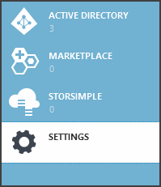
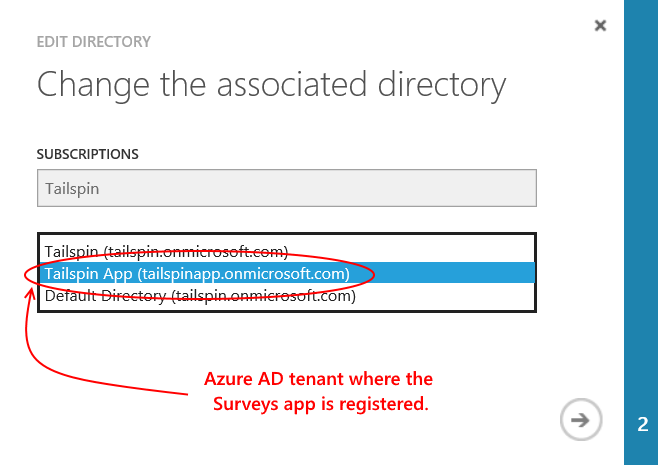

<properties
   pageTitle="Utilizzo archivio chiave per proteggere le informazioni riservate applicazione | Microsoft Azure"
   description="Come utilizzare il servizio di archivio di chiave per memorizzare informazioni riservate applicazione"
   services=""
   documentationCenter="na"
   authors="MikeWasson"
   manager="roshar"
   editor=""
   tags=""/>

<tags
   ms.service="guidance"
   ms.devlang="dotnet"
   ms.topic="article"
   ms.tgt_pltfrm="na"
   ms.workload="na"
   ms.date="02/16/2016"
   ms.author="mwasson"/>

# <a name="using-azure-key-vault-to-protect-application-secrets"></a>Utilizzo di Azure chiave archivio per proteggere le informazioni riservate applicazione

[AZURE.INCLUDE [pnp-header](../../includes/guidance-pnp-header-include.md)]

In questo articolo fa [parte di una serie]. È inoltre disponibile un' [applicazione di esempio] completa relativa a questa serie.

## <a name="overview"></a>Panoramica

Si tratta le impostazioni dell'applicazione sono riservate che devono essere protetti, ad esempio:

- Stringhe di connessione di database
- Password
- Chiavi di crittografia

Per garantire la migliore protezione, non memorizzare mai queste informazioni riservate nel controllo origine. È troppo facile perdita &mdash; anche se il repository di codice sorgente è privato. E sono non praticamente protezione delle informazioni riservate da generale pubblico. In progetti di grandi dimensioni, è consigliabile limitare gli sviluppatori e operatori di accedere a informazioni riservate di produzione. (Impostazioni per gli ambienti di sviluppo o di test sono diverse).

Più sicuro consiste nel memorizzare le informazioni riservate in [Azure chiave archivio][KeyVault]. Archivio di chiave è un servizio cloud ospitato per la gestione delle chiavi di crittografia e altre informazioni riservate. In questo articolo viene illustrato come utilizzare chiave archivio per archiviare le impostazioni di configurazione per si app.

[Sondaggi Tailspin] [ Surveys] applicazione, le impostazioni seguenti sono segrete:

- Stringa di connessione di database.
- Stringa di connessione Redis.
- Segreto del client per l'applicazione web.

Per memorizzare informazioni riservate configurazione nell'archivio di chiave, l'applicazione di sondaggi implementato un provider di configurazione personalizzata, in ASP.NET Core 1.0 [sistema di configurazione][configuration]. Il provider personalizzato legge le impostazioni di configurazione dall'archivio chiave all'avvio.

L'applicazione di sondaggi carica le impostazioni di configurazione da posizioni seguenti:

- Il file appsettings.json
- [Archiviare informazioni riservate dell'utente] [ user-secrets] (ambiente di sviluppo solo; per il testing)
- Ambiente host (impostazioni di app nelle App web Azure)
- Archivio di chiave

Ognuna di queste override quello precedente, in modo che le impostazioni memorizzate nell'archivio chiave hanno la precedenza.

> [AZURE.NOTE] Per impostazione predefinita, il provider di configurazione di archivio di chiave viene disabilitato. Non è necessaria per l'esecuzione dell'applicazione in locale. È necessario attivarlo in un ambiente di produzione.

> Il provider di archivio di chiave non è attualmente supportato per Core .NET, perché è necessario [Microsoft.Azure.KeyVault] [ Microsoft.Azure.KeyVault] pacchetto.

All'avvio, l'applicazione legge impostazioni ogni provider di configurazione registrata e li usa per popolare un oggetto fortemente opzioni. (Per ulteriori informazioni, vedere [oggetti di configurazione e utilizzo delle opzioni di][options].)

## <a name="implementation"></a>Implementazione

[KeyVaultConfigurationProvider] [ KeyVaultConfigurationProvider] classe è un provider di configurazione collegata di ASP.NET Core 1.0 [sistema di configurazione][configuration].

Usare la `KeyVaultConfigurationProvider`, chiamare il `AddKeyVaultSecrets` metodo di estensione della classe di avvio:

```csharp
    var builder = new ConfigurationBuilder()
        .SetBasePath(appEnv.ApplicationBasePath)
        .AddJsonFile("appsettings.json");

    if (env.IsDevelopment())
    {
        builder.AddUserSecrets();
    }
    builder.AddEnvironmentVariables();
    var config = builder.Build();

    // Add key vault configuration:
    builder.AddKeyVaultSecrets(config["AzureAd:ClientId"],
        config["KeyVault:Name"],
        config["AzureAd:Asymmetric:CertificateThumbprint"],
        Convert.ToBoolean(config["AzureAd:Asymmetric:ValidationRequired"]),
        loggerFactory);
```

Si noti che `KeyVaultConfigurationProvider` richiede alcune impostazioni di configurazione, che devono essere archiviati in una delle altre origini di configurazione.

All'avvio dell'applicazione, `KeyVaultConfigurationProvider` Elenca tutte le informazioni riservate nell'archivio di chiave. Per ogni segreto, la ricerca di un contrassegno denominato 'ConfigKey'. Il valore del tag è il nome dell'impostazione di configurazione.

> [AZURE.NOTE] [Tag] [ key-tags] vengono archiviati con una chiave di metadati facoltativi. Tag vengono utilizzati qui perché i nomi delle chiavi non possono contenere caratteri di due punti (:).

```csharp
var kvClient = new KeyVaultClient(GetTokenAsync);
var secretsResponseList = await kvClient.GetSecretsAsync(_vault, MaxSecrets, token);
foreach (var secretItem in secretsResponseList.Value)
{
    //The actual config key is stored in a tag with the Key "ConfigKey"
    // because ':' is not supported in a shared secret name by Key Vault.
    if (secretItem.Tags != null && secretItem.Tags.ContainsKey(ConfigKey))
    {
        var secret = await kvClient.GetSecretAsync(secretItem.Id, token);
        Data.Add(secret.Tags[ConfigKey], secret.Value);
    }
}
```

> [AZURE.NOTE] Vedere [KeyVaultConfigurationProvider.cs].

## <a name="setting-up-key-vault-in-the-surveys-app"></a>La configurazione di archivio di chiave nell'app sondaggi

Prerequisiti:

- Installare i [Cmdlet per la gestione risorse Azure][azure-rm-cmdlets].
- Configurare l'applicazione di sondaggi, come descritto in [esecuzione dell'applicazione di sondaggi][readme].

Passaggi di alto livello:

1. Configurare un utente di amministratore tenant.
2. Configurare un certificato client.
3. Creare un archivio di chiave.
4. Aggiungere le impostazioni di configurazione per l'archivio chiave.
5. Rimuovere il commento per il codice che consente di archivio di chiave.
6. Aggiornare informazioni riservate dell'utente dell'applicazione.

### <a name="set-up-an-admin-user"></a>Configurare un utente di amministratore

> [AZURE.NOTE] Per creare un archivio di chiave, è necessario usare un account in cui è possibile gestire l'abbonamento Azure. Inoltre, qualsiasi applicazione autorizzati a leggere dall'archivio di chiave deve registrata nello stesso tenant quell'account.

In questo passaggio verrà assicurarsi che è possibile creare un archivio chiave mentre effettuato l'accesso come utente del tenant di dove è stato registrato app sondaggi.

Prima di tutto, passare alla directory associata all'abbonamento Azure.

1. Accedere al [portale di gestione di Azure][azure-management-portal]

2. Fare clic su **Impostazioni**.

    

3. Selezionare l'abbonamento Azure.

4. Fare clic su **Modifica Directory** nella parte inferiore del portale.

    

5. In "Cambiare la directory associata", selezionare il tenant di Azure Active Directory in cui è registrato l'applicazione di sondaggi,

    

6. Fare clic sulla freccia e completare la finestra di dialogo.

Creare un utente di amministratore nel tenant di Azure Active Directory in cui l'applicazione di sondaggi registrata.

1. Accedere al [portale di gestione Azure][azure-management-portal].

2. Selezionare il tenant di Azure Active Directory in cui l'applicazione registrata.

3. Fare clic su **utenti** > **Aggiungi utente**.

4. Nella finestra di dialogo **Aggiungi utente** , assegnare all'utente al ruolo amministratore globale.

Aggiungere l'utente amministratore come amministratore condivisa per la sottoscrizione di Azure.

1. Accedere al [portale di gestione Azure][azure-management-portal].

2. Fare clic su **Impostazioni** e selezionare l'abbonamento Azure.

3. Fare clic su **amministratori**

4. Fare clic su **Aggiungi** nella parte inferiore del portale.

5. Immettere il messaggio di posta elettronica dell'utente amministratore che è stato creato in precedenza.

6. Selezionare la casella di controllo per la sottoscrizione.

7. Fare clic sul pulsante di segno di spunta per completare la finestra di dialogo.


### <a name="set-up-a-client-certificate"></a>Configurare un certificato client

1. Esecuzione di script di PowerShell [/Scripts/Setup-KeyVault.ps1] [ Setup-KeyVault] come indicato di seguito:
    ```
    .\Setup-KeyVault.ps1 -Subject <<subject>>
    ```
    Per la `Subject` parametro, immettere un nome di qualsiasi tipo, ad esempio "surveysapp". Lo script genera un certificato autofirmato e archiviati nell'archivio certificati "utente corrente/personale".

2. L'output dello script è un frammento JSON. Aggiungere questo manifesto dell'applicazione di web app, come indicato di seguito:

    1. Accedere al [portale di gestione Azure] [ azure-management-portal] e passare alla directory Azure Active Directory.

    2. Fare clic su **applicazioni**.

    3. Selezionare l'applicazione di sondaggi.

    4.  Fare clic su **Gestisci manifesto** e scegliere **Scarica manifesto**.

    5.  Aprire il file JSON manifesto in un editor di testo. Incollare l'output di script nel `keyCredentials` proprietà. Dovrebbe essere simile al seguente:
    ```
            "keyCredentials": [
                {
                  "type": "AsymmetricX509Cert",
                  "usage": "Verify",
                  "keyId": "29d4f7db-0539-455e-b708-....",
                  "customKeyIdentifier": "ZEPpP/+KJe2fVDBNaPNOTDoJMac=",
                  "value": "MIIDAjCCAeqgAwIBAgIQFxeRiU59eL.....
                }
              ],
    ```          
    6.  Salvare le modifiche al file JSON.

    7.  Tornare al portale. Fare clic su **Gestisci manifesto** > **Caricare manifesto** e caricare il file JSON.

3. Aggiungere il frammento JSON stesso manifesto dell'applicazione del web API (Surveys.WebAPI).

4. Eseguire il seguente comando per ottenere l'identificazione del certificato digitale.
    ```
    certutil -store -user my [subject]
    ```
    dove `[subject]` è il valore specificato per oggetto dello script di PowerShell. L'identificazione personale viene elencato in "Certificato Hash(sha1)". Rimuovere gli spazi tra i numeri esadecimali.

Utilizzare l'identificazione personale in un secondo momento.

### <a name="create-a-key-vault"></a>Creare un archivio di chiave

1. Esecuzione di script di PowerShell [/Scripts/Setup-KeyVault.ps1] [ Setup-KeyVault] come indicato di seguito:

    ```
    .\Setup-KeyVault.ps1 -KeyVaultName <<key vault name>> -ResourceGroupName <<resource group name>> -Location <<location>>
    ```

    Quando richiesto per le credenziali, accedere con l'utente di Azure Active Directory creato in precedenza. Lo script crea un nuovo gruppo di risorse e un insieme di credenziali di nuovo all'interno del gruppo di risorse.

    Nota: per il percorso parametro-, è possibile utilizzare il comando PowerShell seguente per ottenere un elenco delle aree valide:

    ```
    Get-AzureRmResourceProvider -ProviderNamespace "microsoft.keyvault" | Where-Object { $_.ResourceTypes.ResourceTypeName -eq "vaults" } | Select-Object -ExpandProperty Locations
    ```

2. Rieseguire SetupKeyVault.ps, con i parametri seguenti:

    ```
    .\Setup-KeyVault.ps1 -KeyVaultName <<key vault name>> -ApplicationIds @("<<web app client ID>>", "<<web API client ID>>")
    ```

    dove

    - Nome archivio chiave = il nome assegnato archivio chiave nel passaggio precedente.
    - ID acquirente app Web = ID client per l'applicazione web sondaggi.
    - ID client api Web = ID client per l'applicazione Surveys.WebAPI.

    Esempio:
    ```
    .\Setup-KeyVault.ps1 -KeyVaultName tailspinkv -ApplicationIds @("f84df9d1-91cc-4603-b662-302db51f1031", "8871a4c2-2a23-4650-8b46-0625ff3928a6")
    ```

    > [AZURE.NOTE] È possibile ottenere il client ID dal [portale di gestione Azure][azure-management-portal]. Selezionare il tenant di Azure Active Directory, selezionare l'applicazione e fare clic su **Configura**.

    Questo script autorizza il web app e API web per recuperare informazioni riservate dall'archivio chiave. Vedere [Guida introduttiva di Azure chiave archivio] [ authorize-app] per ulteriori informazioni.

### <a name="add-configuration-settings-to-your-key-vault"></a>Aggiungere le impostazioni di configurazione per l'archivio di chiave

1. Eseguire SetupKeyVault.ps come segue:

    ```
    .\Setup-KeyVault.ps1 -KeyVaultName <<key vault name> -KeyName RedisCache -KeyValue "<<Redis DNS name>>.redis.cache.windows.net,password=<<Redis access key>>,ssl=true" -ConfigName "Redis:Configuration"
    ```
    dove

    - Nome archivio chiave = il nome assegnato archivio chiave nel passaggio precedente.
    - Redis nome DNS = il nome del DNS dell'istanza Redis cache.
    - Tasto di scelta rapida redis = il tasto di scelta per l'istanza di cache Redis.

    Questo comando aggiunge un segreto per l'archivio chiave. Il segreto è una coppia nome/valore più un tag:

    -   Il nome della chiave deve essere univoco all'interno di archivio di chiave non viene utilizzato dall'applicazione.
    -   Il valore è il valore dell'opzione di configurazione, in questo caso la stringa di connessione Redis.
    -   il contrassegno "ConfigKey" contiene il nome della chiave di configurazione.

2. A questo punto, è consigliabile verificare se è archiviato correttamente informazioni riservate in archivio chiave. Eseguire il comando PowerShell seguente:

    ```
    Get-AzureKeyVaultSecret <<key vault name>> RedisCache | Select-Object *
    ```
    L'output deve essere visualizzata valore segreto più alcuni metadati:

    

3. Eseguire SetupKeyVault.ps nuovamente per aggiungere la stringa di connessione di database:

    ```
    .\Setup-KeyVault.ps1 -KeyVaultName <<key vault name> -KeyName ConnectionString -KeyValue <<DB connection string>> -ConfigName "Data:SurveysConnectionString"
    ```

    dove `<<DB connection string>>` è il valore della stringa di connessione di database.

    Per verificare con il database locale, copiare la stringa di connessione dal file Tailspin.Surveys.Web/appsettings.json. In questo caso, assicurarsi di modificare due barre rovesciate ('\\\\') in una barra rovesciata singola. Due barre rovesciate sono un carattere di escape nel file JSON.

    Esempio:

    ```
    .\Setup-KeyVault.ps1 -KeyVaultName mykeyvault -KeyName ConnectionString -KeyValue "Server=(localdb)\MSSQLLocalDB;Database=Tailspin.SurveysDB;Trusted_Connection=True;MultipleActiveResultSets=true" -ConfigName "Data:SurveysConnectionString"
    ```

### <a name="uncomment-the-code-that-enables-key-vault"></a>Rimuovere il commento per il codice che consente di archivio di chiave

1. Aprire la soluzione Tailspin.Surveys.

2. In [Tailspin.Surveys.Web/Startup.cs][web-startup], individuare il blocco di codice seguenti e rimuovere il commento.

    ```csharp
    //#if DNX451
    //            _configuration = builder.Build();
    //            builder.AddKeyVaultSecrets(_configuration["AzureAd:ClientId"],
    //                _configuration["KeyVault:Name"],
    //                _configuration["AzureAd:Asymmetric:CertificateThumbprint"],
    //                Convert.ToBoolean(_configuration["AzureAd:Asymmetric:ValidationRequired"]),
    //                loggerFactory);
    //#endif
    ```

3. In [Tailspin.Surveys.WebAPI/Startup.cs][web-api-startup], individuare il blocco di codice seguenti e rimuovere il commento.

    ```csharp
    //#if DNX451
    //            var config = builder.Build();
    //            builder.AddKeyVaultSecrets(config["AzureAd:ClientId"],
    //                config["KeyVault:Name"],
    //                config["AzureAd:Asymmetric:CertificateThumbprint"],
    //                Convert.ToBoolean(config["AzureAd:Asymmetric:ValidationRequired"]),
    //                loggerFactory);
    //#endif
    ```

4. In [Tailspin.Surveys.Web/Startup.cs][web-startup], individuare il codice che registra il `ICredentialService`. Rimuovere il commento che utilizza `CertificateCredentialService`e commento la riga che utilizza `ClientCredentialService`:

    ```csharp
    // Uncomment this:
    services.AddSingleton<ICredentialService, CertificateCredentialService>();
    // Comment out this:
    //services.AddSingleton<ICredentialService, ClientCredentialService>();
    ```

    Questa modifica consente l'applicazione web da usare [asserzione Client] [ client-assertion] per ottenere i token di accesso OAuth. Con asserzione client, non è necessario un segreto del client OAuth. In alternativa, è possibile memorizzare il segreto client nell'archivio di chiave. Tuttavia, archivio chiave asserzione client che utilizzano un client di certificati e, se si abilita archivio chiave, è consigliabile attivare anche asserzione client.

### <a name="update-the-user-secrets"></a>Aggiornare le informazioni riservate dell'utente

In Esplora soluzioni fare clic sul progetto Tailspin.Surveys.Web e selezionare **Gestione delle informazioni riservate dell'utente**. Nel file secrets.json eliminare JSON esistente e incollare le informazioni seguenti:

    ```
    {
      "AzureAd": {
        "ClientId": "[Surveys web app client ID]",
        "PostLogoutRedirectUri": "https://localhost:44300/",
        "WebApiResourceId": "[App ID URI of your Surveys.WebAPI application]",
        "Asymmetric": {
          "CertificateThumbprint": "[certificate thumbprint. Example: 105b2ff3bc842c53582661716db1b7cdc6b43ec9]",
          "StoreName": "My",
          "StoreLocation": "CurrentUser",
          "ValidationRequired": "false"
        }
      },
      "KeyVault": {
        "Name": "[key vault name]"
      }
    }
    ```

Sostituire le voci [racchiusa tra parentesi quadre] con i valori corretti.

- `AzureAd:ClientId`: L'ID client dell'app sondaggi.
- `AzureAd:WebApiResourceId`: App ID URI specificato al momento della creazione dell'applicazione Surveys.WebAPI in Azure Active Directory.
- `Asymmetric:CertificateThumbprint`: Identificazione personale il certificato ottenuto in precedenza, quando è stato creato il certificato client.
- `KeyVault:Name`: Il nome dell'archivio chiave.

> [AZURE.NOTE] `Asymmetric:ValidationRequired`è false perché il certificato creato in precedenza non è stata firmata da un'autorità di certificazione (CA) radice. In produzione, usare un certificato firmato da una CA principale e impostare `ValidationRequired` su true.

Salvare il file aggiornato secrets.json.

Successivamente, in Esplora soluzioni fare clic sul progetto Tailspin.Surveys.WebApi e selezionare **Gestione delle informazioni riservate dell'utente**. Eliminare JSON esistente e incollare le informazioni seguenti:

```
{
  "AzureAd": {
    "ClientId": "[Surveys.WebAPI client ID]",
    "WebApiResourceId": "https://tailspin5.onmicrosoft.com/surveys.webapi",
    "Asymmetric": {
      "CertificateThumbprint": "[certificate thumbprint]",
      "StoreName": "My",
      "StoreLocation": "CurrentUser",
      "ValidationRequired": "false"
    }
  },
  "KeyVault": {
    "Name": "[key vault name]"
  }
}
```

Sostituire le voci [racchiusa tra parentesi quadre] e salvare il file secrets.json.

> [AZURE.NOTE] Per il web API, assicurarsi di usare l'ID client per l'applicazione di Surveys.WebAPI, non la sondaggi.


<!-- Links -->
[authorize-app]: ../key-vault/key-vault-get-started.md/#authorize
[azure-management-portal]: https://manage.windowsazure.com/
[azure-rm-cmdlets]: https://msdn.microsoft.com/library/mt125356.aspx
[client-assertion]: guidance-multitenant-identity-client-assertion.md
[configuration]: https://docs.asp.net/en/latest/fundamentals/configuration.html
[KeyVault]: https://azure.microsoft.com/services/key-vault/
[KeyVaultConfigurationProvider]: https://github.com/Azure-Samples/guidance-identity-management-for-multitenant-apps/blob/master/src/Tailspin.Surveys.Configuration.KeyVault/KeyVaultConfigurationProvider.cs
[key-tags]: https://msdn.microsoft.com/library/azure/dn903623.aspx#BKMK_Keytags
[Microsoft.Azure.KeyVault]: https://www.nuget.org/packages/Microsoft.Azure.KeyVault/
[options]: https://docs.asp.net/en/latest/fundamentals/configuration.html#using-options-and-configuration-objects
[readme]: https://github.com/Azure-Samples/guidance-identity-management-for-multitenant-apps/blob/master/docs/running-the-app.md
[Setup-KeyVault]: https://github.com/Azure-Samples/guidance-identity-management-for-multitenant-apps/blob/master/scripts/Setup-KeyVault.ps1
[Surveys]: guidance-multitenant-identity-tailspin.md
[user-secrets]: http://go.microsoft.com/fwlink/?LinkID=532709
[web-startup]: https://github.com/Azure-Samples/guidance-identity-management-for-multitenant-apps/blob/master/src/Tailspin.Surveys.Web/Startup.cs
[web-api-startup]: https://github.com/Azure-Samples/guidance-identity-management-for-multitenant-apps/blob/master/src/Tailspin.Surveys.WebAPI/Startup.cs
[parte di una serie]: guidance-multitenant-identity.md
[KeyVaultConfigurationProvider.cs]: https://github.com/Azure-Samples/guidance-identity-management-for-multitenant-apps/blob/master/src/Tailspin.Surveys.Configuration.KeyVault/KeyVaultConfigurationProvider.cs
[applicazione di esempio]: https://github.com/Azure-Samples/guidance-identity-management-for-multitenant-apps
