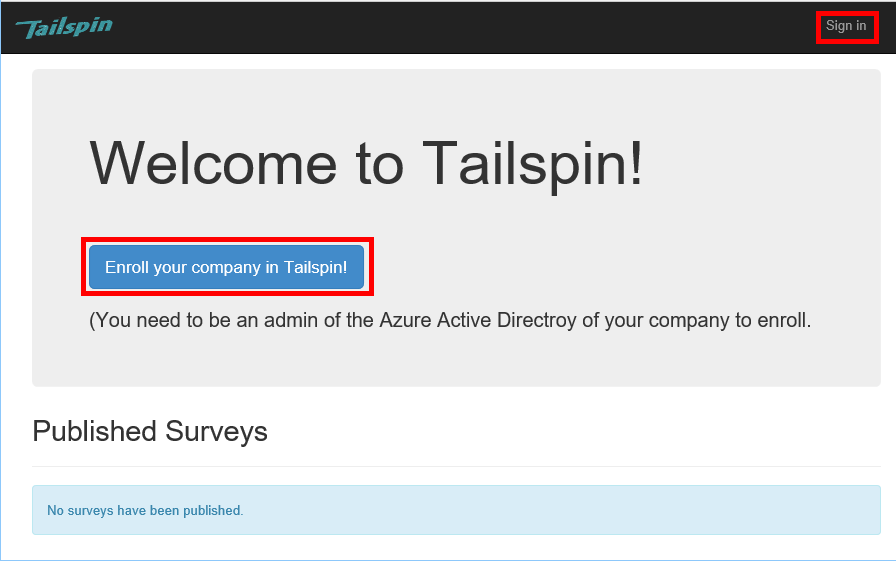

<properties
   pageTitle="Per l'abbonamento e onboarding nelle applicazioni multi-tenant del tenant | Microsoft Azure"
   description="Come tenant incorporato in un'applicazione multi-tenant"
   services=""
   documentationCenter="na"
   authors="MikeWasson"
   manager="roshar"
   editor=""
   tags=""/>

<tags
   ms.service="guidance"
   ms.devlang="dotnet"
   ms.topic="article"
   ms.tgt_pltfrm="na"
   ms.workload="na"
   ms.date="05/23/2016"
   ms.author="mwasson"/>

# <a name="sign-up-and-tenant-onboarding-in-a-multitenant-application"></a>Per l'abbonamento e onboarding in un'applicazione multi-tenant del tenant

[AZURE.INCLUDE [pnp-header](../../includes/guidance-pnp-header-include.md)]

In questo articolo fa [parte di una serie]. È inoltre disponibile un' [applicazione di esempio] completa relativa a questa serie.

In questo articolo viene descritto come implementare un _abbonamento_ processo in un'applicazione multi-tenant, che consente al cliente di effettuare l'iscrizione dell'organizzazione per l'applicazione.
Esistono diversi motivi per implementare un processo di iscrizione:

-   Consentire a un amministratore di Active Directory per consenso per tutta l'organizzazione del cliente a utilizzare l'applicazione.
-   Raccogliere pagamento con carta di credito o altri tipi di informazioni.
-   Eseguire alcuna impostazione tenant monouso necessari per l'applicazione.

## <a name="admin-consent-and-azure-ad-permissions"></a>Autorizzazione di amministratore e autorizzazioni di Azure Active Directory

Per l'autenticazione con Azure Active Directory, un'applicazione richiede l'accesso alla directory dell'utente. Minimo, l'applicazione richiede autorizzazioni di modifica del profilo utente. La prima volta che un utente accede, Azure Active Directory Mostra una pagina di consenso dell'utente che vengono elencate le autorizzazioni richieste. Facendo clic su **accetta**, l'utente concede l'autorizzazione per l'applicazione.

Per impostazione predefinita, dell'autorizzazione per un singolo utente. Ogni utente che accede vede la pagina di consenso dell'utente. Tuttavia, Azure Active Directory supporta anche _consenso dell'utente amministratore_, che consente agli amministratori di Active Directory di consenso per un'intera organizzazione.

Quando viene utilizzato il flusso di consenso dell'utente di amministratore, pagina di consenso indica che l'amministratore di Active Directory è concessione dell'autorizzazione per conto di all'intero tenant:


Dopo l'amministratore di fa clic su **accetta**, possano accedere agli altri utenti interni stesso tenant e Azure Active Directory ignorerà la schermata di consenso dell'utente.

Solo un amministratore di Active Directory può concedere autorizzazione di amministratore, in quanto concede l'autorizzazione per conto dell'intera organizzazione. Se non amministratore tenta di eseguire l'autenticazione con il flusso di consenso dell'utente di amministratore, Azure Active Directory verrà visualizzato un messaggio di errore:


Se l'applicazione richiede autorizzazioni aggiuntive in un secondo momento, il cliente sarà necessario iscriversi nuovamente e consenso per le autorizzazioni aggiornate.  

## <a name="implementing-tenant-sign-up"></a>Implementazione tenant per l'abbonamento

Per [Sondaggi Tailspin] [ Tailspin] dell'applicazione è stata definita alcuni requisiti per il processo di iscrizione:

-   Prima che gli utenti possano accedere un tenant necessario iscriversi.
-   Per l'abbonamento viene utilizzato il flusso di consenso dell'utente di amministratore.
-   Iscrizione aggiunge tenant dell'utente al database dell'applicazione.
-   Dopo aver iscrive un tenant, l'applicazione mostra una pagina di selezione.

In questa sezione verrà esaminato l'implementazione del processo di iscrizione.
È importante conoscere tale "iscrizione" e "Accedi" è un concetto di applicazione. Durante il flusso di autenticazione Azure Active Directory non progettato per sapere se l'utente è in corso di iscrizione. Dipende da un'applicazione di tenere traccia di contesto.

Quando un utente anonimo visita l'applicazione di sondaggi, l'utente è visualizzati due pulsanti, uno per accedere e uno per "la registrazione della società" (iscriversi).



Questi pulsanti richiamano azioni in classe [AccountController] .

Il `SignIn` azione restituisce un **ChallegeResult**, causando middleware OpenID connettersi reindirizzare l'endpoint di autenticazione. Questa è la modalità predefinita per l'autenticazione di trigger in ASP.NET Core 1.0.  

```csharp
[AllowAnonymous]
public IActionResult SignIn()
{
    return new ChallengeResult(
        OpenIdConnectDefaults.AuthenticationScheme,
        new AuthenticationProperties
        {
            IsPersistent = true,
            RedirectUri = Url.Action("SignInCallback", "Account")
        });
}
```

Ora confrontare il `SignUp` azione:

```csharp
[AllowAnonymous]
public IActionResult SignUp()
{
    // Workaround for https://github.com/aspnet/Security/issues/546
    HttpContext.Items.Add("signup", "true");

    var state = new Dictionary<string, string> { { "signup", "true" }};
    return new ChallengeResult(
        OpenIdConnectDefaults.AuthenticationScheme,
        new AuthenticationProperties(state)
        {
            RedirectUri = Url.Action(nameof(SignUpCallback), "Account")
        });
}
```

Ad esempio `SignIn`, il `SignUp` azione inversa restituisce inoltre una `ChallengeResult`. Ma questa volta abbiamo aggiungere una parte di informazioni relative allo stato di `AuthenticationProperties` nel `ChallengeResult`:

-   l'iscrizione: un contrassegno Boolean che indica che l'utente ha avviato il processo di iscrizione.

Le informazioni sullo stato `AuthenticationProperties` viene aggiunto al parametro [stato] OpenID connettersi andata e ritorno durante il flusso di autenticazione.


Dopo l'utente viene autenticato in Azure Active Directory e venga reindirizzata all'applicazione, ticket di autenticazione contiene lo stato. Si utilizza il fatto per assicurarsi che il valore di "abbonamento" viene mantenuto attraverso il flusso di autenticazione intera.

## <a name="adding-the-admin-consent-prompt"></a>Aggiunta di consenso amministratore

In Azure Active Directory, il flusso di consenso amministratore viene attivato mediante l'aggiunta di un parametro "prompt" alla stringa di query nella richiesta di autenticazione:

```
/authorize?prompt=admin_consent&...
```

L'applicazione di sondaggi aggiunge prompt dei comandi durante la `RedirectToAuthenticationEndpoint` evento. Questo evento è chiamato destra prima middleware reindirizza l'endpoint di autenticazione.

```csharp
public override Task RedirectToAuthenticationEndpoint(RedirectContext context)
{
    if (context.IsSigningUp())
    {
        context.ProtocolMessage.Prompt = "admin_consent";
    }

    _logger.RedirectToIdentityProvider();
    return Task.FromResult(0);
}
```

> [AZURE.NOTE] Vedere [SurveyAuthenticationEvents.cs].

Impostazione` ProtocolMessage.Prompt` indica middleware per aggiungere il parametro "prompt" alla richiesta di autenticazione.

Si noti che il messaggio è necessario solo durante l'iscrizione. Accessohttp regolare non deve includere essa. Per distinguere tra di esse, la ricerca di `signup` valore in stato di autenticazione. Questa condizione di verifica il metodo di estensione seguenti:

```csharp
internal static bool IsSigningUp(this BaseControlContext context)
{
    Guard.ArgumentNotNull(context, nameof(context));

    string signupValue;
    object obj;
    // Check the HTTP context and convert to string
    if (context.HttpContext.Items.TryGetValue("signup", out obj))
    {
        signupValue = (string)obj;
    }
    else
    {
        // It's not in the HTTP context, so check the authentication ticket.  If it's not there, we aren't signing up.
        if ((context.AuthenticationTicket == null) ||
            (!context.AuthenticationTicket.Properties.Items.TryGetValue("signup", out signupValue)))
        {
            return false;
        }
    }

    // We have found the value, so see if it's valid
    bool isSigningUp;
    if (!bool.TryParse(signupValue, out isSigningUp))
    {
        // The value for signup is not a valid boolean, throw                
        throw new InvalidOperationException($"'{signupValue}' is an invalid boolean value");
    }

    return isSigningUp;
}
```

> [AZURE.NOTE] Vedere [BaseControlContextExtensions.cs].

> [AZURE.NOTE] Nota: Questo codice include una possibile soluzione per un errore noto ASP.NET Core 1.0 RC1. Nel `RedirectToAuthenticationEndpoint` evento, non è possibile ottenere le proprietà di autenticazione che contiene lo stato "abbonamento". In alternativa, il `AccountController.SignUp` metodo inserisce anche lo stato "abbonamento" nella `HttpContext`. Questo metodo funziona perché `RedirectToAuthenticationEndpoint` si verifica prima il reindirizzamento in modo che sono ancora disponibili lo stesso `HttpContext`.

## <a name="registering-a-tenant"></a>Registrazione di un Tenant

L'applicazione di sondaggi archivia le informazioni sull'ogni tenant e utente nel database dell'applicazione.


Nella tabella Tenant IssuerValue è il valore del credito emittente per il tenant. Per Azure Active Directory, si tratta `https://sts.windows.net/<tentantID>` e restituisce un valore univoco per ogni tenant.

Quando un nuovo tenant si iscrive, l'applicazione di sondaggi scrive un record tenant al database. Si verifica questo evento all'interno di `AuthenticationValidated` evento. (Non farlo prima di questo evento, in quanto il token ID non convalidato ancora, in modo che non attendibile i valori di richiesta di rimborso. Vedere [l'autenticazione].

Ecco il codice corrispondente dall'applicazione sondaggi:

```csharp
public override async Task AuthenticationValidated(AuthenticationValidatedContext context)
{
    var principal = context.AuthenticationTicket.Principal;
    var userId = principal.GetObjectIdentifierValue();
    var tenantManager = context.HttpContext.RequestServices.GetService<TenantManager>();
    var userManager = context.HttpContext.RequestServices.GetService<UserManager>();
    var issuerValue = principal.GetIssuerValue();
    _logger.AuthenticationValidated(userId, issuerValue);

    // Normalize the claims first.
    NormalizeClaims(principal);
    var tenant = await tenantManager.FindByIssuerValueAsync(issuerValue)
        .ConfigureAwait(false);

    if (context.IsSigningUp())
    {
        // Originally, we were checking to see if the tenant was non-null, however, this would not allow
        // permission changes to the application in AAD since a re-consent may be required.  Now we just don't
        // try to recreate the tenant.
        if (tenant == null)
        {
            tenant = await SignUpTenantAsync(context, tenantManager)
                .ConfigureAwait(false);
        }

        // In this case, we need to go ahead and set up the user signing us up.
        await CreateOrUpdateUserAsync(context.AuthenticationTicket, userManager, tenant)
            .ConfigureAwait(false);
    }
    else
    {
        if (tenant == null)
        {
            _logger.UnregisteredUserSignInAttempted(userId, issuerValue);
            throw new SecurityTokenValidationException($"Tenant {issuerValue} is not registered");
        }

        await CreateOrUpdateUserAsync(context.AuthenticationTicket, userManager, tenant)
            .ConfigureAwait(false);
    }
}
```

> [AZURE.NOTE] Vedere [SurveyAuthenticationEvents.cs].

Questo codice esegue le operazioni seguenti:

1.  Verificare se il valore di emittente del tenant è già presente nel database. Se il tenant non è iscritta, `FindByIssuerValueAsync` restituisce null.
2.  Se l'utente esegue l'abbonamento:
  1.    Aggiungere il tenant al database (`SignUpTenantAsync`).
  2.    Aggiungere l'utente autenticato al database (`CreateOrUpdateUserAsync`).
3.  In caso contrario completare il normale flusso:
  1.    Se emittente del tenant non è stato trovato nel database, significa che non è registrato il tenant e il cliente deve eseguire l'iscrizione. In questo caso, che venga generata un'eccezione per determinare l'autenticazione di.
  2.    In caso contrario, creare un record di database per questo utente, se non è presente una già (`CreateOrUpdateUserAsync`).

Ecco il metodo [SignUpTenantAsync] che aggiunge il tenant al database.

```csharp
private async Task<Tenant> SignUpTenantAsync(BaseControlContext context, TenantManager tenantManager)
{
    Guard.ArgumentNotNull(context, nameof(context));
    Guard.ArgumentNotNull(tenantManager, nameof(tenantManager));

    var principal = context.AuthenticationTicket.Principal;
    var issuerValue = principal.GetIssuerValue();
    var tenant = new Tenant
    {
        IssuerValue = issuerValue,
        Created = DateTimeOffset.UtcNow
    };

    try
    {
        await tenantManager.CreateAsync(tenant)
            .ConfigureAwait(false);
    }
    catch(Exception ex)
    {
        _logger.SignUpTenantFailed(principal.GetObjectIdentifierValue(), issuerValue, ex);
        throw;
    }

    return tenant;
}
```

Di seguito è riportato un riepilogo del flusso di iscrizione intero nell'applicazione di sondaggi:

1.  L'utente fa clic sul pulsante **Sottoscrivi** .
2.  Il `AccountController.SignUp` azione restituisce un risultato challege.  Lo stato di autenticazione include il valore di "abbonamento".
3.  Nel `RedirectToAuthenticationEndpoint` evento, aggiungere il `admin_consent` prompt dei comandi.
4.  Middleware OpenID connettersi reindirizza di Azure Active Directory e di autenticazione dell'utente.
5.  Nel `AuthenticationValidated` evento, cercare lo stato "abbonamento".
6.  Aggiungere il tenant al database.

## <a name="next-steps"></a>Passaggi successivi

- Articolo successivo in questa serie: [ruoli applicazione nelle applicazioni multi-tenant][app roles]


<!-- Links -->
[app roles]: guidance-multitenant-identity-app-roles.md
[Tailspin]: guidance-multitenant-identity-tailspin.md
[parte di una serie]: guidance-multitenant-identity.md
[AccountController]: https://github.com/Azure-Samples/guidance-identity-management-for-multitenant-apps/blob/master/src/Tailspin.Surveys.Web/Controllers/AccountController.cs
[stato]: http://openid.net/specs/openid-connect-core-1_0.html#AuthRequest
[SurveyAuthenticationEvents.cs]: https://github.com/Azure-Samples/guidance-identity-management-for-multitenant-apps/blob/master/src/Tailspin.Surveys.Web/Security/SurveyAuthenticationEvents.cs
[BaseControlContextExtensions.cs]: https://github.com/Azure-Samples/guidance-identity-management-for-multitenant-apps/blob/master/src/Tailspin.Surveys.Web/Security/BaseControlContextExtensions.cs
[Autenticazione]: guidance-multitenant-identity-authenticate.md
[SignUpTenantAsync]: https://github.com/Azure-Samples/guidance-identity-management-for-multitenant-apps/blob/master/src/Tailspin.Surveys.Web/Security/SurveyAuthenticationEvents.cs
[applicazione di esempio]: https://github.com/Azure-Samples/guidance-identity-management-for-multitenant-apps
