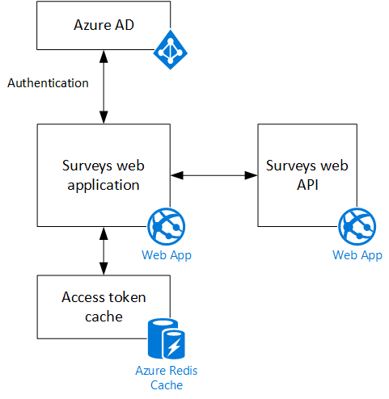

<properties
   pageTitle="Informazioni sull'applicazione di sondaggi Tailspin | Microsoft Azure"
   description="Cenni preliminari sulle applicazioni di sondaggi Tailspin"
   services=""
   documentationCenter="na"
   authors="MikeWasson"
   manager="roshar"
   editor=""
   tags=""/>

<tags
   ms.service="guidance"
   ms.devlang="dotnet"
   ms.topic="article"
   ms.tgt_pltfrm="na"
   ms.workload="na"
   ms.date="05/23/2016"
   ms.author="mwasson"/>

# Informazioni sull'applicazione Tailspin sondaggi

[AZURE.INCLUDE [pnp-header](../../includes/guidance-pnp-header-include.md)]

In questo articolo fa [parte di una serie]. È inoltre disponibile un' [applicazione di esempio] completa relativa a questa serie.

Tailspin è un'azienda fittizia che sviluppa un'applicazione di SaaS denominata sondaggi. Questa applicazione consente alle organizzazioni di creare e pubblicare sondaggi in linea.

- Un'organizzazione possa iscriversi per l'applicazione.
- Dopo l'organizzazione è iscritta, gli utenti possano accedere all'interno dell'applicazione con le credenziali dell'organizzazione.
- Gli utenti possono creare, modificare e pubblicare sondaggi.

> [AZURE.NOTE] Per iniziare a utilizzare l'applicazione, vedere [eseguire l'applicazione di sondaggi].

## Gli utenti possono creare, modificare e visualizzare sondaggi

Un utente autenticato può visualizzare tutti i sondaggi che lui ha creato o che dispone dei diritti di collaboratore per e creare nuovi sondaggi. Si noti che l'utente è l'accesso con il suo identità organizzativa `bob@contoso.com`.

Questa schermata mostra la pagina Modifica sondaggio:

Gli utenti possono anche visualizzare qualsiasi sondaggi creati da altri utenti nel tenant di stessa.

## I proprietari di un sondaggio invitare collaboratori

Quando si crea un sondaggio, lui possibile invitare altre persone a designare come collaboratori su sondaggio. Collaboratori di modificare il sondaggio, ma non è possibile eliminare o pubblicarlo.  

Un utente può aggiungere collaboratori da altri tenant, che consente tra tenant la condivisione delle risorse. In questa schermata, Roberto (`bob@contoso.com`) consiste nell'aggiungere Alice (`alice@fabrikam.com`) come collaboratore a un sondaggio Roberto creato.

Quando si connette Alice, vede il sondaggio elencato in "è contribuiscono a sondaggi".

Si noti che Alice accede a proprio tenant, non come guest del tenant Contoso. Alice ha le autorizzazioni di collaborazione solo per le risposte al sondaggio &mdash; Anna non è possibile visualizzare altre indagini del tenant di Contoso.

## Architettura

L'applicazione di sondaggi è costituita da un web front-end e back-end dell'API web. Entrambe sono implementate utilizzando [ASP.NET Core 1.0].

L'applicazione web utilizza Azure Active Directory (Azure Active Directory) per eseguire l'autenticazione degli utenti. L'applicazione web chiama anche Azure Active Directory per ottenere i token di accesso OAuth 2 per l'API Web. Token di accesso vengono memorizzati nella Cache Redis Azure. La cache consente a più istanze di condividere la stessa cache token (ad esempio, in una server farm).

## Passaggi successivi

- Articolo successivo in questa serie: [autenticazione nelle App multi-tenant, utilizzo di Azure Active Directory e connettere OpenID][authentication]

<!-- Links -->

[authentication]: guidance-multitenant-identity-authenticate.md
[parte di una serie]: guidance-multitenant-identity.md
[Eseguire l'applicazione di sondaggi]: https://github.com/Azure-Samples/guidance-identity-management-for-multitenant-apps/blob/master/docs/running-the-app.md
[Principali ASP.NET 1.0]: https://docs.asp.net/en/latest/
[applicazione di esempio]: https://github.com/Azure-Samples/guidance-identity-management-for-multitenant-apps
