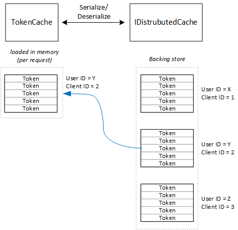

<properties
   pageTitle="La memorizzazione nella cache i token di accesso in un'applicazione multi-tenant | Microsoft Azure"
   description="Memorizzazione nella cache token di accesso utilizzato per richiamare un back-end API Web"
   services=""
   documentationCenter="na"
   authors="MikeWasson"
   manager="roshar"
   editor=""
   tags=""/>

<tags
   ms.service="guidance"
   ms.devlang="dotnet"
   ms.topic="article"
   ms.tgt_pltfrm="na"
   ms.workload="na"
   ms.date="02/16/2016"
   ms.author="mwasson"/>


# <a name="caching-access-tokens-in-a-multitenant-application"></a>Memorizzazione nella cache token di accesso in un'applicazione multi-tenant

[AZURE.INCLUDE [pnp-header](../../includes/guidance-pnp-header-include.md)]

In questo articolo fa [parte di una serie]. È inoltre disponibile un' [applicazione di esempio] completa relativa a questa serie.

È relativamente costosa ottenere un accesso OAuth token, perché è necessaria una richiesta HTTP all'endpoint del token. Di conseguenza, è consigliabile token cache laddove possibile. [Azure Active Directory Authentication Library] [ ADAL] (ADAL) memorizza automaticamente i token ottenuti da Azure Active Directory, inclusi i token di aggiornamento.

ADAL fornisce un'implementazione della cache dei token predefinita. Tuttavia, questa cache token è destinata App native client e _non_ adatta per le applicazioni web:

-   È un'istanza statica e non thread-safe.
-   Non è adatta per un numero elevato di utenti, in quanto i token di tutti gli utenti nel dizionario stesso.
-   Non può essere condiviso tra server web in una farm.

Se, tuttavia, è necessario implementare una cache token personalizzata che deriva da di ADAL `TokenCache` classe, ma è adatto per un ambiente di server e offre il livello di isolamento tra i token per diversi utenti appropriato.

Il `TokenCache` classe memorizza un dizionario di token indicizzato emittente, delle risorse, ID client e utente. Della cache dei token personalizzato deve scrivere un archivio di backup, ad esempio una cache Redis di questo dizionario.

Nell'applicazione Tailspin sondaggi il `DistributedTokenCache` implementa la cache dei token. Questa implementazione utilizza [IDistributedCache] [ distributed-cache] astrazione ASP.NET Core 1.0. In questo modo, qualsiasi `IDistributedCache` implementazione può essere utilizzata come archivio di backup.

-   Per impostazione predefinita, l'app sondaggi utilizza una cache Redis.
-   Per un server web singola istanza, è possibile utilizzare ASP.NET Core 1.0 [nella cache][in-memory-cache]. (Questo è una buona opzione per l'esecuzione dell'app in locale in fase di sviluppo.)

> [AZURE.NOTE] Attualmente la cache di Redis non è supportata per .NET Core.

`DistributedTokenCache`Archivia i dati della cache come coppie chiave/valore nell'archivio di backup. La chiave è l'ID utente e ID client, in modo che l'archivio di backup contiene i dati nella cache distinta per ogni combinazione univoca di utente/client.



Archivio di backup è suddiviso dall'utente. Per ogni richiesta HTTP, i token di tale utente vengono letto dall'archivio di backup e caricati la `TokenCache` dizionario. Se Redis viene utilizzato come archivio di backup, lettura/scrittura di tutte le istanze di server in una server farm per la stessa cache e scale di questo approccio a più utenti.

## <a name="encrypting-cached-tokens"></a>La crittografia token memorizzati nella cache

I token sono dati riservati, perché sono concedere l'accesso alle risorse dell'utente. (Inoltre, a differenza di una password utente, è possibile solo archiviare hashing del token.) È fondamentale per proteggere i token da violazione. La cache a Redis è protetto da password, ma se un utente ottiene la password, potrebbe essere tutti i token di accesso memorizzate nella cache. Per questo motivo, il `DistributedTokenCache` crittografa tutto ciò che scrive all'archivio di backup. È stata completata la crittografia utilizzando la [protezione dei dati] di ASP.NET Core 1.0[ data-protection] API.

> [AZURE.NOTE] Se si distribuisce ai siti Web di Azure, le chiavi di crittografia backup allo spazio di archiviazione di rete e sincronizzate in tutti i computer (vedere [Gestione delle chiavi][key-management]). Per impostazione predefinita, le chiavi non vengono crittografate durante l'esecuzione di siti Web di Azure, ma è possibile [abilitare la crittografia utilizzando un certificato x. 509][x509-cert-encryption].


## <a name="distributedtokencache-implementation"></a>Implementazione DistributedTokenCache

[DistributedTokenCache] [ DistributedTokenCache] classe deriva da ADAL [TokenCache] [ tokencache-class] classe.

Nel costruttore, il `DistributedTokenCache` classe crea una chiave per l'utente corrente e carica la cache dall'archivio di backup:

```csharp
public DistributedTokenCache(
    ClaimsPrincipal claimsPrincipal,
    IDistributedCache distributedCache,
    ILoggerFactory loggerFactory,
    IDataProtectionProvider dataProtectionProvider)
    : base()
{
    _claimsPrincipal = claimsPrincipal;
    _cacheKey = BuildCacheKey(_claimsPrincipal);
    _distributedCache = distributedCache;
    _logger = loggerFactory.CreateLogger<DistributedTokenCache>();
    _protector = dataProtectionProvider.CreateProtector(typeof(DistributedTokenCache).FullName);
    AfterAccess = AfterAccessNotification;
    LoadFromCache();
}
```

Il tasto viene creato concatenando l'ID utente e ID client. Entrambe le provengono da crediti trovare l'utente `ClaimsPrincipal`:

```csharp
private static string BuildCacheKey(ClaimsPrincipal claimsPrincipal)
{
    string clientId = claimsPrincipal.FindFirstValue("aud", true);
    return string.Format(
        "UserId:{0}::ClientId:{1}",
        claimsPrincipal.GetObjectIdentifierValue(),
        clientId);
}
```

Per caricare i dati della cache, leggere blob serializzato dall'archivio di backup e chiamata `TokenCache.Deserialize` per convertire il blob in dati nella cache.

```csharp
private void LoadFromCache()
{
    byte[] cacheData = _distributedCache.Get(_cacheKey);
    if (cacheData != null)
    {
        this.Deserialize(_protector.Unprotect(cacheData));
    }
}
```

Ogni volta che ADAL accedere alla cache, viene generato un `AfterAccess` evento. Se sono stati modificati i dati della cache, la `HasStateChanged` è true. In questo caso, aggiornare l'archivio di backup per riflettere la modifica e quindi impostare `HasStateChanged` su false.

```csharp
public void AfterAccessNotification(TokenCacheNotificationArgs args)
{
    if (this.HasStateChanged)
    {
        try
        {
            if (this.Count > 0)
            {
                _distributedCache.Set(_cacheKey, _protector.Protect(this.Serialize()));
            }
            else
            {
                // There are no tokens for this user/client, so remove the item from the cache.
                _distributedCache.Remove(_cacheKey);
            }
            this.HasStateChanged = false;
        }
        catch (Exception exp)
        {
            _logger.WriteToCacheFailed(exp);
            throw;
        }
    }
}
```

TokenCache invia due altri eventi:

- `BeforeWrite`. Chiamato immediatamente prima che ADAL scrive nella cache. È possibile usare questa per implementare una strategia di concorrenza
- `BeforeAccess`. Chiamato immediatamente prima che ADAL legge dalla cache. Qui è possibile ricaricare la cache per ottenere la versione più recente.

In questo caso, abbiamo scelto di non gestire questi due eventi.

- Per la concorrenza, dell'ultima scrittura wins. Va bene, in quanto i token sono archiviati in modo indipendente per ogni utente + client, in modo che un conflitto accadrebbe solo se l'utente stesso ha due sessioni simultanee login.
- Per la lettura, si carica la cache a ogni richiesta. Le richieste sono temporanei. Se la cache viene modificata in un'ora specifica, la richiesta successiva preleverà il nuovo valore.

## <a name="next-steps"></a>Passaggi successivi

- Articolo successivo in questa serie: [federazione con ADFS del cliente per le app multi-tenant in Azure][adfs]

<!-- links -->
[ADAL]: https://msdn.microsoft.com/library/azure/jj573266.aspx
[adfs]: guidance-multitenant-identity-adfs.md
[data-protection]: https://docs.asp.net/en/latest/security/data-protection/index.html
[distributed-cache]: https://docs.asp.net/en/latest/fundamentals/distributed-cache.html
[DistributedTokenCache]: https://github.com/Azure-Samples/guidance-identity-management-for-multitenant-apps/blob/master/src/Tailspin.Surveys.TokenStorage/DistributedTokenCache.cs
[key-management]: https://docs.asp.net/en/latest/security/data-protection/configuration/default-settings.html
[in-memory-cache]: https://docs.asp.net/en/latest/fundamentals/caching.html
[tokencache-class]: https://msdn.microsoft.com/library/azure/microsoft.identitymodel.clients.activedirectory.tokencache.aspx
[x509-cert-encryption]: https://docs.asp.net/en/latest/security/data-protection/implementation/key-encryption-at-rest.html#x-509-certificate
[parte di una serie]: guidance-multitenant-identity.md
[applicazione di esempio]: https://github.com/Azure-Samples/guidance-identity-management-for-multitenant-apps
