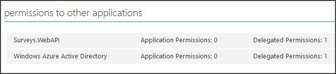

<properties
   pageTitle="Protezione di un web back-end API in un'applicazione multi-tenant | Microsoft Azure"
   description="Come proteggere dell'API web back-end"
   services=""
   documentationCenter="na"
   authors="MikeWasson"
   manager="roshar"
   editor=""
   tags=""/>

<tags
   ms.service="guidance"
   ms.devlang="dotnet"
   ms.topic="article"
   ms.tgt_pltfrm="na"
   ms.workload="na"
   ms.date="06/02/2016"
   ms.author="mwasson"/>

# <a name="securing-a-backend-web-api-in-a-multitenant-application"></a>Protezione di un web back-end API in un'applicazione multi-tenant

[AZURE.INCLUDE [pnp-header](../../includes/guidance-pnp-header-include.md)]

In questo articolo fa [parte di una serie]. È inoltre disponibile un' [applicazione di esempio] completa relativa a questa serie.

L'applicazione [Tailspin sondaggi] utilizza dell'API web back-end per gestire le operazioni CRUD su sondaggi. Ad esempio quando un utente fa clic su "Sondaggi personali", l'applicazione web invia una richiesta HTTP sul Web API:

```
GET /users/{userId}/surveys
```

API web restituisce un oggetto JSON:

```
{
  "Published":[],
  "Own":[
    {"Id":1,"Title":"Survey 1"},
    {"Id":3,"Title":"Survey 3"},
    ],
  "Contribute": [{"Id":8,"Title":"My survey"}]
}
```

API web non anonime richieste, in modo che l'applicazione web deve autenticarsi utilizzando i token del titolare OAuth 2.

> [AZURE.NOTE] Si tratta di uno scenario al server. L'applicazione non effettuare chiamate AJAX all'API dal client del browser.

Esistono due approcci principali che è possibile eseguire:

- Identità dell'utente delegato. L'applicazione web autentica con l'identità dell'utente.
- Identità dell'applicazione. L'applicazione web autentica con l'ID client, utilizzando il flusso di credenziali client OAuth2.

L'applicazione Tailspin implementata identità utente delegato. Ecco le principali differenze:

**Identità utente delegato**

- Il token del titolare inviato al web API contiene l'identità dell'utente.
- API web rende decisioni relative alle autorizzazioni in base all'identità utente.
- L'applicazione web è necessario gestire 403 (accesso negato) gli errori dal web API, se l'utente non è autorizzato a eseguire un'azione.
- In genere, l'applicazione web ancora effettua alcune decisioni relative alle autorizzazioni che influiscono su interfaccia utente, ad esempio mostrando o nascondendo elementi dell'interfaccia utente).
- API web potenzialmente possono essere usata dal client non attendibile, ad esempio un'applicazione di JavaScript o un'applicazione client nativi.

**Identità dell'applicazione**

- API web non ricevere informazioni relative all'utente.
- API web non è possibile eseguire l'autorizzazione in base all'identità utente. Tutte le decisioni relative alle autorizzazioni sono stati progettati per l'applicazione web.  
- API web non è possibile usare un client non attendibile (JavaScript o applicazione client nativo).
- Questo approccio potrebbe essere leggermente più semplice implementare, perché nell'API Web non è presente alcuna logica di autorizzazione.

In entrambi i casi, l'applicazione web necessario ottenere un token di accesso, le credenziali necessarie per chiamare API web.

- Per identità utente delegato, il token deve provenire da IDP, in grado di rilasciare un token per conto dell'utente.

- Le credenziali di client, un'applicazione potrebbe ottenere il token dal IDP o ospitare il proprio server token. (Ma non scrivere un server token da zero, usare una struttura verificata come [IdentityServer3].) Se effettua l'autenticazione con Azure Active Directory, è consigliabile per ottenere il token di accesso da Azure Active Directory, neanche a fronte di flusso di credenziali client.

Il resto di questo articolo si presuppone che l'applicazione è autenticazione con Azure Active Directory.


## <a name="register-the-web-api-in-azure-ad"></a>Eseguire la registrazione web API in Azure Active Directory

Affinché Azure Active Directory di rilasciare il token del titolare per API web, è necessario configurare alcuni aspetti da Azure Active Directory.

1. [Eseguire la registrazione web API di Azure Active Directory].

2. Aggiungere l'ID client dell'applicazione web al manifesto dell'applicazione web API di `knownClientApplications` proprietà. Vedere [aggiornare i manifesti dell'applicazione].

3. [Assegnare l'autorizzazione di applicazione web di chiamare l'API web].

  Nel portale di gestione di Azure, è possibile impostare due tipi di autorizzazioni: "Applicazione autorizzazioni" per le identità dell'applicazione (client credenziali flusso) o "Delegato autorizzazioni" per identità utente delegato.

  

## <a name="getting-an-access-token"></a>Ottenere un token di accesso

Prima di chiamare l'API web, l'applicazione web Ottiene un accesso token da Azure Active Directory. In un'applicazione .NET utilizzare [Azure Active Directory autenticazione raccolta (ADAL) per .NET][ADAL].

Nel flusso di codice di autorizzazione OAuth 2, l'applicazione scambia un codice di autorizzazione per un token di accesso. Il codice seguente utilizza ADAL per ottenere il token di accesso. Questo codice viene chiamato durante la `AuthorizationCodeReceived` evento.

```csharp
// The OpenID Connect middleware sends this event when it gets the authorization code.   
public override async Task AuthorizationCodeReceived(AuthorizationCodeReceivedContext context)
{
    string authorizationCode = context.ProtocolMessage.Code;
    string authority = "https://login.microsoftonline.com/" + tenantID
    string resourceID = "https://tailspin.onmicrosoft.com/surveys.webapi" // App ID URI
    ClientCredential credential = new ClientCredential(clientId, clientSecret);

    AuthenticationContext authContext = new AuthenticationContext(authority, tokenCache);
    AuthenticationResult authResult = await authContext.AcquireTokenByAuthorizationCodeAsync(
        authorizationCode, new Uri(redirectUri), credential, resourceID);

    // If successful, the token is in authResult.AccessToken
}
```

Ecco i vari parametri sono necessari:

- `authority`. Derivate dai ID tenant dell'utente l'accesso al. (Non l'ID tenant del provider di SaaS)  
- `authorizationCode`. il codice di autenticazione che ottenuto il IDP.
- `clientId`. ID client. dell'applicazione web
- `clientSecret`. Segreto del client dell'applicazione web.
- `redirectUri`. Reindirizza URI impostato per OpenID connessione. Verrà visualizzata nel punto in cui il IDP richiama con il token.
- `resourceID`. L'URI ID App del web API, che è stato creato al momento della registrazione web API in Azure Active Directory
- `tokenCache`. Un oggetto in cui sono memorizzati i token di accesso. Vedere [Token memorizzazione nella cache].

Se `AcquireTokenByAuthorizationCodeAsync` ha avuto esito positivo, ADAL memorizza il token. In un secondo momento, è possibile ottenere il token dalla cache chiamando AcquireTokenSilentAsync:

```csharp
AuthenticationContext authContext = new AuthenticationContext(authority, tokenCache);
var result = await authContext.AcquireTokenSilentAsync(resourceID, credential, new UserIdentifier(userId, UserIdentifierType.UniqueId));
```

dove `userId` è l'ID dell'utente oggetto, che si trova nel `http://schemas.microsoft.com/identity/claims/objectidentifier` richiedere.

## <a name="using-the-access-token-to-call-the-web-api"></a>Utilizzando il token di accesso di chiamare l'API web

Dopo avere creato il token, inviarlo nell'intestazione di autorizzazione richieste HTTP sul Web API.

```
Authorization: Bearer xxxxxxxxxx
```

Il metodo di estensione seguenti dall'applicazione sondaggi imposta l'intestazione di autorizzazione in una richiesta HTTP utilizzando la classe **HttpClient** .

```csharp
public static async Task<HttpResponseMessage> SendRequestWithBearerTokenAsync(this HttpClient httpClient, HttpMethod method, string path, object requestBody, string accessToken, CancellationToken ct)
{
    var request = new HttpRequestMessage(method, path);
    if (requestBody != null)
    {
        var json = JsonConvert.SerializeObject(requestBody, Formatting.None);
        var content = new StringContent(json, Encoding.UTF8, "application/json");
        request.Content = content;
    }

    request.Headers.Authorization = new AuthenticationHeaderValue("Bearer", accessToken);
    request.Headers.Accept.Add(new MediaTypeWithQualityHeaderValue("application/json"));

    var response = await httpClient.SendAsync(request, ct);
    return response;
}
```

> [AZURE.NOTE] Vedere [HttpClientExtensions.cs].

## <a name="authenticating-in-the-web-api"></a>Autenticazione del Web API

API web deve eseguire l'autenticazione del token del titolare. In ASP.NET Core 1.0, è possibile utilizzare [Microsoft.AspNet.Authentication.JwtBearer] [ JwtBearer] pacchetto. Questo pacchetto fornisce middleware che consente di ricevere i token del titolare OpenID connettere l'applicazione.

Registrare il middleware del Web API `Startup` classe.

```csharp
app.UseJwtBearerAuthentication(options =>
{
    options.Audience = "[app ID URI]";
    options.Authority = "https://login.microsoftonline.com/common/";
    options.TokenValidationParameters = new TokenValidationParameters
    {
        //Instead of validating against a fixed set of known issuers, we perform custom multi-tenant validation logic
        ValidateIssuer = false,
    };
    options.Events = new SurveysJwtBearerEvents();
});
```

> [AZURE.NOTE] Vedere [Startup.cs].

- **Gruppo di destinatari**. Impostare questa opzione per l'URL di ID App per il web API, che è stato creato al momento della registrazione web API con Azure Active Directory.
- **Autorità**. Per un'applicazione multi-tenant, impostare `https://login.microsoftonline.com/common/`.
- **TokenValidationParameters**. Per un'applicazione multi-tenant, impostare **ValidateIssuer** su false. Questo significa che l'applicazione convalida autorità.
- **Eventi** è una classe che deriva da **JwtBearerEvents**.

### <a name="issuer-validation"></a>Convalida emittente

Convalidare autorità token nell'evento **JwtBearerEvents.ValidatedToken** . Autorità viene inviata la richiesta di "iss".

Nell'applicazione sondaggi web API non gestisce [tenant per l'abbonamento]. Di conseguenza, verifica solo se autorità è già nel database dell'applicazione. In caso contrario, viene generata un'eccezione che causa la mancata autenticazione.

```csharp
public override async Task ValidatedToken(ValidatedTokenContext context)
{
    var principal = context.AuthenticationTicket.Principal;
    var tenantManager = context.HttpContext.RequestServices.GetService<TenantManager>();
    var userManager = context.HttpContext.RequestServices.GetService<UserManager>();
    var issuerValue = principal.GetIssuerValue();
    var tenant = await tenantManager.FindByIssuerValueAsync(issuerValue);

    if (tenant == null)
    {
        // the caller was not from a trusted issuer - throw to block the authentication flow
        throw new SecurityTokenValidationException();
    }
}
```

> [AZURE.NOTE] Vedere [SurveysJwtBearerEvents.cs].

È anche possibile utilizzare l'evento **ValidatedToken** eseguire [trasformazione delle attestazioni]. Tenere presente che le attestazioni provengano direttamente da Azure Active Directory, in modo se l'applicazione web ha tutte le trasformazioni delle attestazioni, quelli non risulteranno disponibili nel token del titolare che riceve l'API web.

## <a name="authorization"></a>Autorizzazione

Per informazioni generali sull'autorizzazione, vedere [autorizzazione basato sui ruoli e basate sulle risorse][Authorization]. 

Middleware JwtBearer gestisce le risposte di autorizzazione. Ad esempio, per limitare un'azione controller agli utenti autenticati, utilizzare atrribute **[autorizzazione]** e specificare **JwtBearerDefaults.AuthenticationScheme** come lo schema di autenticazione:

```csharp
[Authorize(ActiveAuthenticationSchemes = JwtBearerDefaults.AuthenticationScheme)]
```

Restituisce un codice di 401 stato se l'utente non autenticato.

Per limitare un'azione controller dai criteri di authorizaton, specificare il nome del criterio nell'attributo **[autorizzazione]** :

```csharp
[Authorize(Policy = PolicyNames.RequireSurveyCreator)]
```

Restituisce un codice di 401 stato se l'utente non è autenticato e 403 se l'utente viene autenticato ma non autorizzato. Registrare i criteri all'avvio:

```csharp
public void ConfigureServices(IServiceCollection services)
{
    services.AddAuthorization(options =>
    {
        options.AddPolicy(PolicyNames.RequireSurveyCreator,
            policy =>
            {
                policy.AddRequirements(new SurveyCreatorRequirement());
                policy.AddAuthenticationSchemes(JwtBearerDefaults.AuthenticationScheme);
            });
    });
}
```

## <a name="next-steps"></a>Passaggi successivi

- Articolo successivo in questa serie: [token di accesso di memorizzazione nella cache in un'applicazione multi-tenant][token cache]

<!-- links -->
[ADAL]: https://msdn.microsoft.com/library/azure/jj573266.aspx
[JwtBearer]: https://www.nuget.org/packages/Microsoft.AspNet.Authentication.JwtBearer
[parte di una serie]: guidance-multitenant-identity.md
[Tailspin sondaggi]: guidance-multitenant-identity-tailspin.md
[IdentityServer3]: https://github.com/IdentityServer/IdentityServer3
[Eseguire la registrazione web API in Azure Active Directory]: https://github.com/Azure-Samples/guidance-identity-management-for-multitenant-apps/blob/master/docs/running-the-app.md#register-the-surveys-web-api
[Aggiornare i manifesti dell'applicazione]: https://github.com/Azure-Samples/guidance-identity-management-for-multitenant-apps/blob/master/docs/running-the-app.md#update-the-application-manifests
[Assegnare l'autorizzazione di applicazione web di chiamare l'API web]: https://github.com/Azure-Samples/guidance-identity-management-for-multitenant-apps/blob/master/docs/running-the-app.md#give-the-web-app-permissions-to-call-the-web-api
[La memorizzazione nella cache token]: guidance-multitenant-identity-token-cache.md
[HttpClientExtensions.cs]: https://github.com/Azure-Samples/guidance-identity-management-for-multitenant-apps/blob/master/src/Tailspin.Surveys.Common/HttpClientExtensions.cs
[Startup.cs]: https://github.com/Azure-Samples/guidance-identity-management-for-multitenant-apps/blob/master/src/Tailspin.Surveys.WebAPI/Startup.cs
[tenant per l'abbonamento]: guidance-multitenant-identity-signup.md
[SurveysJwtBearerEvents.cs]: https://github.com/Azure-Samples/guidance-identity-management-for-multitenant-apps/blob/master/src/Tailspin.Surveys.WebAPI/SurveyJwtBearerEvents.cs
[trasformazione delle attestazioni]: guidance-multitenant-identity-claims.md#claims-transformations
[Authorization]: guidance-multitenant-identity-authorize.md
[applicazione di esempio]: https://github.com/Azure-Samples/guidance-identity-management-for-multitenant-apps
[token cache]: guidance-multitenant-identity-token-cache.md
