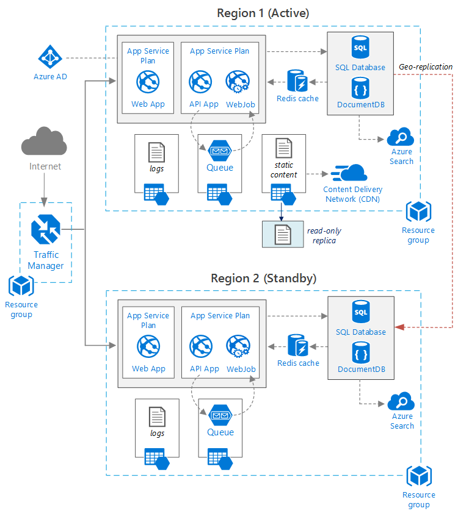

<properties
   pageTitle="Applicazione Web con disponibilità | Architettura di riferimento Azure | Microsoft Azure"
   description="Architettura consigliato per l'applicazione web con disponibilità, in esecuzione in Microsoft Azure."
   services="app-service,app-service\web,sql-database" 
   documentationCenter="na"
   authors="MikeWasson"
   manager="roshar"
   editor=""
   tags=""/>

<tags
   ms.service="guidance"
   ms.devlang="na"
   ms.topic="article"
   ms.tgt_pltfrm="na"
   ms.workload="na"
   ms.date="06/27/2016"
   ms.author="mwasson"/>

# <a name="azure-reference-architecture-web-application-with-high-availability"></a>Architettura di riferimento Azure: applicazione Web con disponibilità

[AZURE.INCLUDE [pnp-RA-branding](../../includes/guidance-pnp-header-include.md)]

In questo articolo mostra un'architettura consigliata per un'applicazione web con disponibilità, in esecuzione in Microsoft Azure. L'architettura si basa su [architettura di riferimento Azure: migliorare la scalabilità in un'applicazione web][guidance-web-apps-scalability].

## <a name="architecture-diagram"></a>Diagramma dell'architettura



Questa architettura si basa su quello illustrato di seguito in [miglioramento scalabilità in un'applicazione web][guidance-web-apps-scalability]. Sono le principali differenze:

- **Aree principali e secondarie**. Questa architettura due aree vengono utilizzate per raggiungere una maggiore disponibilità. L'applicazione viene distribuito in ciascuna delle aree geografiche. Durante il normale funzionamento, il traffico di rete è indirizzato all'area principale. Ma se che non è disponibile, il traffico viene instradato all'area secondario. Per informazioni dettagliate sul failover, vedere [Gestione failover](#managing-failover-and-failback).

- **Gestore del traffico azure**. [Gestore del traffico] [ traffic-manager] indirizza le richieste in arrivo per l'area principale. Se l'applicazione in esecuzione quell'area è disponibile, il traffico Manager ha esito negativo all'area secondario. 

- **Geografico replica** di Database SQL e DocumentDB.

## <a name="recommendations"></a>Consigli

### <a name="regional-pairing"></a>Associazione internazionali

Ogni area Azure è associata a un'altra area geography stesso. In generale, scegliere aree la stessa coppia internazionali (ad esempio, USA orientale 2 e centrale USA). Vantaggi dell'operazione:

- Se c'è un'ampia interruzione, ripristino di almeno un'area fuori ciascuna coppia ha la priorità.
- Aggiornamenti di sistemi di Azure pianificate sono distribuiti alle aree accoppiate in sequenza, per ridurre al minimo il tempo di inattività possibili.
- Nella maggior parte dei casi, coppie di parole risiedono geography stesso, per soddisfare requisiti di residenza dei dati.

Tuttavia, assicurarsi che entrambe aree geografiche supportano tutti i servizi Azure necessari per l'applicazione. Vedere [servizi per area geografica][services-by-region]. Per ulteriori informazioni sulle coppie internazionali, vedere [Business continuità e ripristino di emergenza (BCDR): aree accoppiati Azure][regional-pairs].

### <a name="resource-groups"></a>Gruppi di risorse

Valutare la possibilità di inserire l'area principale, secondario area geografica e gestore del traffico in diversi [gruppi di risorse][resource groups]. Consente di gestire le risorse distribuite in ogni area come un'unica raccolta &mdash; distribuirle separatamente, eliminare la distribuzione e così via. 

### <a name="traffic-manager"></a>Gestore del traffico

**Routing.** Gestore del traffico supporta diversi [algoritmi di routing][tm-routing]. Per lo scenario descritto in questo articolo, utilizzare _la priorità_ routing (noto in precedenza come _failover_ routing). Con questa impostazione, il traffico Manager invia tutte le richieste all'area principale, a meno che l'endpoint di tale area assume la forma non è raggiungibile. A questo punto, automaticamente ha esito negativo all'area secondario. Vedere [configurare Failover routing metodo][tm-configure-failover].

**Verifica dell'integrità.** Gestore del traffico utilizza una verifica HTTP (o HTTPS) per controllare la disponibilità di ogni endpoint. La ricerca fornisce il traffico Manager un test di esito positivo o negativo per il ripristino nel paese secondario. Funziona mediante l'invio di una richiesta di un percorso URL specificato. Se Ottiene una risposta non 200 all'interno di un periodo di timeout, la ricerca. Dopo quattro riuscite, il traffico Manager contrassegna l'endpoint come ridotto e non sull'altra estremità. Per informazioni dettagliate, vedere [il traffico Manager endpoint monitoraggio e failover][tm-monitoring].

Come ottimale, creare un endpoint di verifica dell'integrità che segnala l'integrità generale dell'applicazione e utilizzare l'endpoint per la verifica dell'integrità. L'endpoint verificare critiche dipendenze quali le applicazioni di servizio App, coda di spazio di archiviazione e Database SQL. In caso contrario, il sondaggio potrebbe segnalare un endpoint "Integro" errore critiche parti dell'applicazione sono effettivamente. 

Mano, non utilizzare la verifica dell'integrità per verificare i servizi con priorità basso. Ad esempio, se si blocca un servizio di posta elettronica, l'applicazione può passare a una seconda provider o sufficiente inviare messaggi di posta elettronica in un secondo momento. L'applicazione non deve probabilmente non su in tale situazione. Per ulteriori informazioni, vedere [Integrità Endpoint monitoraggio motivo][health-endpoint-monitoring-pattern].
  
### <a name="sql-database"></a>Database SQL

Utilizzare [La replica di geografico Active] [ sql-replication] per creare leggibile secondaria in un'area diversa. È possibile impostare fino a quattro dei secondari leggibili. Se il database principale non riesce, o semplicemente necessario impostare la modalità offline, è possibile failover a un database secondari. La replica di geografico Active può essere configurata per un database di qualsiasi pool di database flessibile.

### <a name="documentdb"></a>DocumentDB

DocumentDB supporta geografico replica aree geografiche. Un'area come modificabile, e gli altri replica di sola lettura. 

Se c'è un'interruzione internazionali, può avere esito negativo consegna la selezione di un'altra area per l'area di scrittura. Il client DocumentDB SDK invia automaticamente richieste di scrittura per l'area di scrittura corrente, in modo che non è necessario aggiornare la configurazione di client dopo caso di errore. Per ulteriori informazioni, vedere [dati Distribuisci globalmente con DocumentDB][docdb-geo]. 

> [AZURE.NOTE] Tutti replica appartengono al gruppo di risorse stesso.

### <a name="storage"></a>Spazio di archiviazione

Per l'archiviazione di Azure, utilizzare [l'accesso in lettura geografico ridondanti archiviazione] [ ra-grs] (RA GRS). Con lo spazio di archiviazione RA GRS, viene replicati i dati su un'area secondaria. Si dispone dell'accesso di sola lettura per i dati presenti nell'area secondario, tramite un endpoint separato. Se c'è un'interruzione internazionali o danno, il team di archiviazione Azure potrebbe determinare eseguire geografico-caso di errore all'area secondario. Non è necessaria per questa failover alcuna azione cliente.

Per l'archiviazione di coda, creare una coda backup nell'area secondario. Durante il failover, l'app consentono coda di backup, fino a quando l'area principale nuovamente disponibile. In questo modo, l'applicazione può comunque elaborare nuove convocazioni. 

## <a name="availability-considerations"></a>Considerazioni sulla disponibilità

Un'architettura più aree può fornire maggiore disponibilità della distribuzione a una singola regione. Se un'interruzione internazionali interessa l'area principale, può eseguire il all'area secondario. Questa architettura consente anche se si verifica un errore di un singolo sottosistema dell'applicazione.  
     
Vi sono diversi approcci per ottenere una disponibilità elevata fra centri dati:      
- Attiva/passiva con standby attivo. Traffico in un'area, mentre altri attesa in standby. L'applicazione è distribuito e in esecuzione nell'area secondario. Può iniziare con un conteggio delle istanze più piccolo nell'interfaccia di dati secondaria e quindi scalabilità in base alle esigenze. 

- Attiva/passiva con standby fredda. Lo stesso, ma applicazione non viene distribuito fino a quando non necessarie per failover. Questo approccio costa meno per l'esecuzione, ma in genere avrà più in basso di tempo in caso di errore. 

- Attivo/attivo. Entrambe aree geografiche sono attive e le richieste sono il bilanciamento del carico tra di esse. Se non è disponibile un centro dati, viene accettata dalla rotazione. 

In questo articolo è incentrata su attivo/passivo con standby attivo, [il traffico] di Azure gestione[ traffic-manager] per instradare il traffico all'area. 

### <a name="traffic-manager"></a>Gestore del traffico

Gestore del traffico non riesce su automaticamente se l'area principale non è più disponibile. Quando il traffico Manager ha esito negativo su, non esiste un periodo di tempo quando i client non riesce a raggiungere l'applicazione, che può essere diversi minuti. Due fattori la durata totale:

- Verifica dell'integrità deve rilevare che il centro dati principale è diventato non è raggiungibile.

- I server DNS è necessario aggiornare i record DNS memorizzati nella cache per l'indirizzo IP, che dipende il DNS time to live (TTL). Il valore TTL predefinito è 300 secondi (5 minuti), ma è possibile configurare questo valore quando si crea il profilo di gestore del traffico.

Per informazioni dettagliate, vedere [Su Monitoraggio gestore del traffico][tm-monitoring]. 

Gestore del traffico è un punto di errore possibili nel sistema. Se il servizio non riesce, i client non è possibile accedere all'applicazione durante il periodo di inattività. Rivedere il [Contratto di servizio di gestione di traffico][tm-sla]e determinare se con il traffico Manager solo soddisfa esigenze aziendali per la disponibilità elevata. In caso contrario, è possibile aggiungere un'altra soluzione di gestione di traffico un failback. Se il servizio di gestione di traffico Azure non riesce, modificare i record CNAME in DNS in modo che puntino a di altro servizio di gestione di traffico. (Questa operazione deve essere eseguita manualmente, e l'applicazione non sarà disponibile fino a quando non vengono distribuite le modifiche DNS) 

### <a name="sql-database"></a>Database SQL

L'obiettivo di punto di ripristino (rilasciato) e il tempo di recupero stimato (Inserisci) per Database SQL sono descritti [di seguito][sql-rpo]. 

### <a name="storage"></a>Spazio di archiviazione

Memorizzazione RA GRS consente l'archiviazione permanente, ma è importante tenere presente che può verificarsi durante un periodo di inattività: 

- Se si verifica un'interruzione di spazio di archiviazione, si verificherà un periodo di tempo quando non si ha accesso scrittura ai dati. È comunque possibile leggere dall'endpoint secondario durante il periodo di inattività.

- Se non è possibile ripristinare i dati sono un'interruzione internazionali o danno viene applicata la posizione principale, il team di archiviazione Azure potrebbe determinare eseguire geografico-caso di errore all'area secondario. 

- La replica dei dati all'area secondario viene eseguita in modo asincrono. Pertanto, se viene eseguita geografico-caso di errore, perdita di dati è possibile se i dati non possono essere recuperati dall'area principale.

- Errori temporanei, ad esempio un'interruzione di rete non vengono attivato lo spazio di archiviazione caso di errore. Progettare l'applicazione sia adattabile alle errori temporanei. Possibili soluzioni di attenuazione:

    - Leggere il secondario.

    - Passare temporaneamente a un altro account di archiviazione per le nuove operazioni di scrittura (ad esempio, di accodare i messaggi). 

    - Copiare dati secondaria a un altro account di archiviazione.

    - Fornire funzionalità ridotte fino a quando il sistema non indietro.

Per ulteriori informazioni, vedere [cosa fare se si verifica un'interruzione di archiviazione Azure][storage-outage].

## <a name="managing-failover-and-failback"></a>Gestione failover e failback

### <a name="traffic-manager"></a>Gestore del traffico

Gestore del traffico non riesce su automaticamente se l'area principale non è più disponibile. Per impostazione predefinita, automaticamente anche non riuscirà indietro, dopo l'area principale nuovamente disponibile.

Tuttavia, è consigliabile eseguire failback manuale, anziché automaticamente non funziona indietro. Prima dell'errore indietro, verificare che tutti i sottosistemi applicazione siano corretti. In caso contrario, è possibile creare una situazione in cui l'applicazione capovolge avanti e indietro tra data center. 

Per evitare che questa opzione, ridurre manualmente la priorità dell'area principale dopo un evento di failover. Si supponga ad esempio, l'area principale è priorità 1 e secondaria priorità 2. Dopo aver caso di errore, impostare l'area principale a livello di priorità 3, per evitare che questa opzione. Quando si è pronti tornare alla modalità, ripristinare la priorità 1.

I comandi seguenti aggiornare la priorità.

**PowerShell** 

```bat
$endpoint = Get-AzureRmTrafficManagerEndpoint -Name <endpoint> -ProfileName <profile> -ResourceGroupName <resource-group> -Type AzureEndpoints
$endpoint.Priority = 3
Set-AzureRmTrafficManagerEndpoint -TrafficManagerEndpoint $endpoint
```

Per ulteriori informazioni, vedere [Cmdlet per la gestione del traffico Azure][tm-ps].

**CLI Azure**

```bat
azure network traffic-manager endpoint set --name <endpoint> --profile-name <profile> --resource-group <resource-group> --type AzureEndpoints --priority 3
```    

### <a name="sql-database"></a>Database SQL

Se il database primario non riesce, eseguire manuale caso di errore al database secondario. Vedere [ripristinare un Database SQL Azure o il controllo a secondario][sql-failover]. Fino a quando non si riesce sopra, il database secondario rimane di sola lettura. 


<!-- links -->

[azure-sql-db]: https://azure.microsoft.com/en-us/documentation/services/sql-database/
[docdb-geo]: ../documentdb/documentdb-distribute-data-globally.md
[guidance-web-apps-scalability]: guidance-web-apps-scalability.md
[health-endpoint-monitoring-pattern]: https://msdn.microsoft.com/library/dn589789.aspx
[ra-grs]: ../storage/storage-redundancy.md#read-access-geo-redundant-storage
[regional-pairs]: ../best-practices-availability-paired-regions.md
[resource groups]: ../resource-group-overview.md
[services-by-region]: https://azure.microsoft.com/en-us/regions/#services
[sql-failover]: ../sql-database/sql-database-disaster-recovery.md
[sql-replication]: ../sql-database/sql-database-geo-replication-overview.md
[sql-rpo]: ../sql-database/sql-database-business-continuity.md#sql-database-business-continuity-features
[storage-outage]: ../storage/storage-disaster-recovery-guidance.md
[tm-configure-failover]: ../traffic-manager/traffic-manager-configure-failover-routing-method.md
[tm-monitoring]: ../traffic-manager/traffic-manager-monitoring.md
[tm-ps]: https://msdn.microsoft.com/en-us/library/mt125941.aspx
[tm-routing]: ../traffic-manager/traffic-manager-routing-methods.md
[tm-sla]: https://azure.microsoft.com/en-us/support/legal/sla/traffic-manager/v1_0/
[traffic-manager]: https://azure.microsoft.com/en-us/services/traffic-manager/
