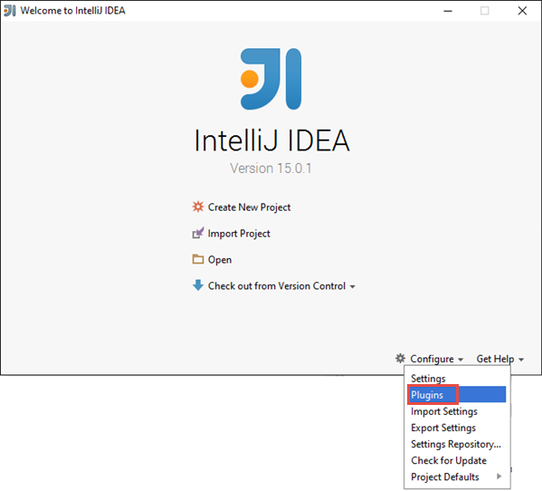
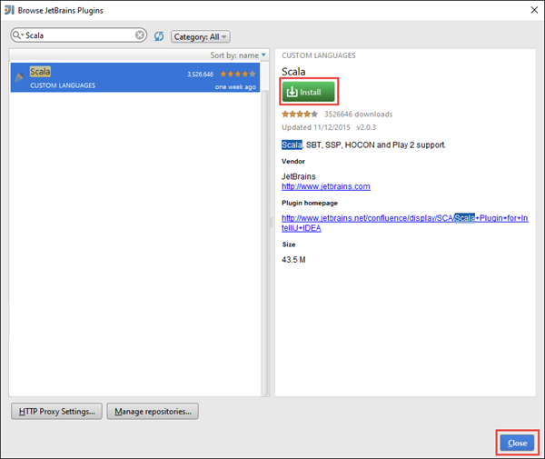
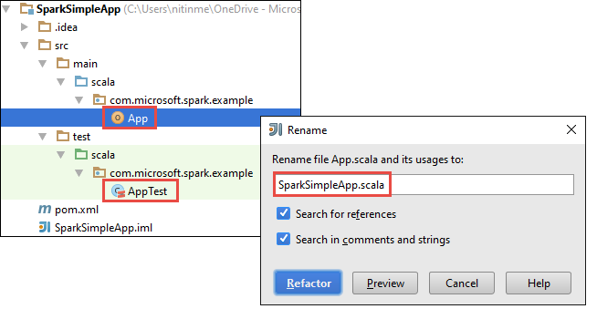

<properties
    pageTitle="Creazione di applicazioni di scala da eseguire sui cluster HDInsight Spark autonoma | Microsoft Azure"
    description="Informazioni su come creare un'applicazione di motori per l'esecuzione su cluster HDInsight Spark autonoma."
    services="hdinsight"
    documentationCenter=""
    authors="nitinme"
    manager="jhubbard"
    editor="cgronlun"
    tags="azure-portal"/>

<tags
    ms.service="hdinsight"
    ms.workload="big-data"
    ms.tgt_pltfrm="na"
    ms.devlang="na"
    ms.topic="article"
    ms.date="10/28/2016"
    ms.author="nitinme"/>

# Creare un'applicazione di Scala da eseguire in Apache i cluster su HDInsight Linux autonoma

In questo articolo vengono fornite istruzioni dettagliate sullo sviluppo di applicazioni ad autonoma scritte in Scala con Maven IDEA IntelliJ. L'articolo utilizza Apache Maven come il sistema di compilazione e inizia con un sistema per Maven esistente per Scala fornito dall'IDEA IntelliJ.  A livello generale, la creazione di una Scala dell'applicazione in IntelliJ IDEA prevede i passaggi seguenti:

* Utilizzare Maven come il sistema di compilazione.
* Aggiornare il file di progetto oggetto modello (POM) per risolvere le dipendenze modulo motori.
* Scrivere un'applicazione in Scala.
* Generare un file di vaso che può essere inviato a HDInsight Spark cluster.
* Eseguire l'applicazione in uso inserire il cluster di motori.

>[AZURE.NOTE] HDInsight vengono forniti anche uno strumento plug-in IntelliJ IDEA per semplificare il processo di creazione e invio di applicazioni a un cluster HDInsight Spark su Linux. Per ulteriori informazioni, vedere [Plug-in strumenti di HDInsight di utilizzo per IDEA IntelliJ creare e inviare le applicazioni di motori](hdinsight-apache-spark-intellij-tool-plugin.md).

**Prerequisiti**

* Un abbonamento Azure. Vedere [ottenere Azure versione di valutazione gratuita](https://azure.microsoft.com/documentation/videos/get-azure-free-trial-for-testing-hadoop-in-hdinsight/).
* Un cluster ad Apache su HDInsight Linux. Per ulteriori informazioni, vedere [creare Apache i cluster in Azure HDInsight](hdinsight-apache-spark-jupyter-spark-sql.md).
* Kit di sviluppo di linguaggio Oracle. È possibile installarlo da [qui](http://www.oracle.com/technetwork/java/javase/downloads/jdk8-downloads-2133151.html).
* Un linguaggio IDE. In questo articolo utilizza IDEA IntelliJ 15.0.1. È possibile installarlo da [qui](https://www.jetbrains.com/idea/download/).

## Installare plug-in Scala per IDEA IntelliJ

Se l'installazione di IntelliJ IDEA non è stato non richiesta per l'attivazione di plug-in Scala, avviare IntelliJ IDEA e ripetere i passaggi seguenti per installare il plug-in:

1. Avviare IDEA IntelliJ e dalla schermata iniziale fare clic su **Configura** e quindi fare clic su **plug-in**.

    

2. Nella schermata successiva fare clic su **plug-in di JetBrains installare** da nell'angolo inferiore sinistro. Nella finestra di dialogo **Sfoglia plug-in di JetBrains** che si apre, cercare Scala e quindi fare clic su **Installa**.

    

3. Dopo aver installato correttamente il plug-in, fare clic sul **pulsante riavviare IDEA IntelliJ** per riavviare l'IDE.

## Creare un progetto di Scala autonomo

1. Avviare IntelliJ IDEA e creare un nuovo progetto. Nella nuova finestra di dialogo progetto, selezionare le opzioni seguenti e quindi fare clic su **Avanti**.

    

    * Selezionare **Maven** come tipo di progetto.
    * Specificare un **progetto SDK**. Fare clic su Nuovo e passare alla directory di installazione di linguaggio, in genere `C:\Program Files\Java\jdk1.8.0_66`.
    * Selezionare l'opzione **Crea da sistema per** .
    * Nell'elenco di archetipi, selezionare **org.scala tools.archetypes:scala-sistema per semplice**. Verrà creare la struttura di directory corretta e scaricare le dipendenze predefiniti necessari per scrivere Scala programma.

2. Fornire i valori pertinenti per **ID gruppo**, **un ArtifactId**e **versione**. Fare clic su **Avanti**.

3. Nella finestra di dialogo successiva, in cui si specifica Maven home directory e altre impostazioni, accettare le impostazioni predefinite e fare clic su **Avanti**.

4. Nell'ultima finestra di dialogo, specificare un nome del progetto e un percorso e quindi fare clic su **Fine**.

5. Eliminare il file **MySpec.Scala** al **src\test\scala\com\microsoft\spark\example**. Non è necessario questo per l'applicazione.

6. Se necessario, rinominare i file di origine e di test predefinito. Nel riquadro sinistro l'IDEA di IntelliJ, passare a **src\main\scala\com.microsoft.spark.example**. Rapida **App.scala** **refactoring**, fare clic su Rinomina file e nella finestra di dialogo specificare il nuovo nome per l'applicazione e quindi scegliere **refactoring**.

      

7. Nei passaggi successivi, si aggiornerà pom.xml per definire le dipendenze per l'applicazione di motori Scala. Per tali dipendenze scaricati e risolvere automaticamente, è necessario configurare Maven conseguenza.

    

    1. Dal menu **File** fare clic su **Impostazioni**.
    2. Nella finestra di dialogo **Impostazioni** , passare alla **creazione, esecuzione, distribuzione** > **Gli strumenti di generazione** > **Maven** > **importazione**.
    3. Selezionare l'opzione per **l'importazione Maven progetti automaticamente**.
    4. Fare clic su **Applica**e quindi fare clic su **OK**.

8. Aggiornare il file di origine Scala per includere il codice dell'applicazione. Aprire e sostituire il codice di esempio esistente con il codice seguente e salvare le modifiche. Questo codice legge i dati da HVAC.csv (disponibile in tutti i cluster HDInsight Spark) consente di recuperare le righe che contengono solo una cifra nella colonna sesta e scrivere output **/HVACOut** all'interno del contenitore di spazio di archiviazione predefinito per il cluster.

        package com.microsoft.spark.example

        import org.apache.spark.SparkConf
        import org.apache.spark.SparkContext

        /**
          * Test IO to wasb
          */
        object WasbIOTest {
          def main (arg: Array[String]): Unit = {
            val conf = new SparkConf().setAppName("WASBIOTest")
            val sc = new SparkContext(conf)

            val rdd = sc.textFile("wasbs:///HdiSamples/HdiSamples/SensorSampleData/hvac/HVAC.csv")

            //find the rows which have only one digit in the 7th column in the CSV
            val rdd1 = rdd.filter(s => s.split(",")(6).length() == 1)

            rdd1.saveAsTextFile("wasbs:///HVACout")
          }
        }

9. Aggiornare il pom.xml.

    1.  All'interno di `<project>\<properties>` aggiungere quanto segue:

            <scala.version>2.10.4</scala.version>
            <scala.compat.version>2.10.4</scala.compat.version>
            <scala.binary.version>2.10</scala.binary.version>

    2. All'interno di `<project>\<dependencies>` aggiungere quanto segue:

            <dependency>
              <groupId>org.apache.spark</groupId>
              <artifactId>spark-core_${scala.binary.version}</artifactId>
              <version>1.4.1</version>
            </dependency>

    Salvare le modifiche pom.xml.

10. Creare il file JAR. IntelliJ IDEA consente la creazione di VASO come un elemento di un progetto. Eseguire la procedura seguente.

    1. Dal menu **File** fare clic su **Struttura del progetto**.
    2. Nella finestra di dialogo **Struttura del progetto** , fare clic su **elementi** e quindi fare clic sul segno. Nella finestra di dialogo a comparsa fare clic su **JAR**e quindi fare clic su **da moduli e le dipendenze**.

        

    3. Nella finestra di dialogo **Crea JAR da moduli** fare clic sui puntini di sospensione ( ) a fronte della **Classe principale**.

    4. Nella finestra di dialogo **Selezionare classe principale** , selezionare la classe viene visualizzato per impostazione predefinita e quindi fare clic su **OK**.

        

    5. Nella finestra di dialogo **Crea JAR da moduli** assicurarsi che sia selezionata l'opzione per **l'estrazione di destinazione VASO** e quindi fare clic su **OK**. Verrà creata una singola VASO con tutte le dipendenze.

        

    6. La scheda layout di output elenca tutti vasetti da cui sono inclusi come parte del progetto Maven. È possibile selezionare ed eliminare quelli in cui l'applicazione Scala non dispone di alcun dipendenza diretta. Per l'applicazione viene creata in questo caso, è possibile rimuovere tutti tranne l'ultimo uno (**SparkSimpleApp compilare output**). Selezionare vasetti da eliminare e quindi fare clic sull'icona **Elimina** .

        

        Verificare che sia selezionata la **compilazione sulla creazione** , che assicura che vaso sia creato ogni volta che il progetto viene creato o aggiornato. Fare clic su **Applica** e quindi su **OK**.

    7. Dalla barra dei menu fare clic su **Genera**e quindi fare clic su **Crea progetto**. È anche possibile fare clic su **Creare elementi** per creare vaso. Vaso output viene creata in **\out\artifacts**.

        

## Eseguire l'applicazione in cluster motori

Per eseguire l'applicazione nel cluster, è necessario eseguire le operazioni seguenti:

* **Copiare vaso applicazione a quello di archiviazione Azure** associato al cluster. È possibile utilizzare [**AzCopy**](../storage/storage-use-azcopy.md), un'utilità della riga di comando per farlo. Sono disponibili numerose anche altri client, che è possibile utilizzare per caricare i dati. È possibile trovare ulteriori informazioni sulle loro al [caricamento dei dati per i processi di Hadoop in HDInsight](hdinsight-upload-data.md).

* **Inserire il utilizzare per inviare un processo di applicazione in modalità remota** al cluster motori. Motori cluster su HDInsight include inserire il esposti endpoint resto per inviare in remoto i processi di motori. Per ulteriori informazioni, vedere [inviare i processi in modalità remota utilizzando inserire il nei cluster di motori in HDInsight](hdinsight-apache-spark-livy-rest-interface.md).

## Vedere anche

* [Panoramica: Apache motori su Azure HDInsight](hdinsight-apache-spark-overview.md)

### Scenari

* [Motori con BI: eseguire l'analisi dei dati interattive tramite motori in HDInsight con strumenti di Business Intelligence](hdinsight-apache-spark-use-bi-tools.md)

* [Motori di apprendimento: usare i in HDInsight per l'analisi temperatura predefiniti utilizzando dati HVAC](hdinsight-apache-spark-ipython-notebook-machine-learning.md)

* [Motori di apprendimento: usare i in HDInsight per prevedere i risultati del controllo alimentari](hdinsight-apache-spark-machine-learning-mllib-ipython.md)

* [Motori Streaming: Usare motori in HDInsight per la creazione di applicazioni di trasmissione in tempo reale](hdinsight-apache-spark-eventhub-streaming.md)

* [Analisi dei log sito Web tramite motori in HDInsight](hdinsight-apache-spark-custom-library-website-log-analysis.md)

### Creare ed eseguire applicazioni

* [Eseguire processi in modalità remota in un cluster di motori tramite inserire il](hdinsight-apache-spark-livy-rest-interface.md)

### Strumenti ed estensioni

* [Plug-in strumenti di HDInsight per IntelliJ IDEA consente di creare e inviare Scala ad applicazioni](hdinsight-apache-spark-intellij-tool-plugin.md)

* [Utilizzare plug-in strumenti di HDInsight per IntelliJ IDEA il debug delle applicazioni di motori in modalità remota](hdinsight-apache-spark-intellij-tool-plugin-debug-jobs-remotely.md)

* [Usare i blocchi appunti Zeppelin con un cluster di motori su HDInsight](hdinsight-apache-spark-use-zeppelin-notebook.md)

* [Disponibile per blocco appunti Jupyter cluster motori per HDInsight. x](hdinsight-apache-spark-jupyter-notebook-kernels.md)

* [Utilizzare i pacchetti esterni con i blocchi appunti Jupyter](hdinsight-apache-spark-jupyter-notebook-use-external-packages.md)

* [Installare Jupyter nel computer e connettersi a un cluster HDInsight Spark](hdinsight-apache-spark-jupyter-notebook-install-locally.md)

### Gestire le risorse

* [Gestire le risorse per cluster ad Apache in Azure HDInsight](hdinsight-apache-spark-resource-manager.md)

* [Tenere traccia e debug processi in esecuzione in un cluster di motori di Apache in HDInsight](hdinsight-apache-spark-job-debugging.md)
