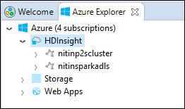
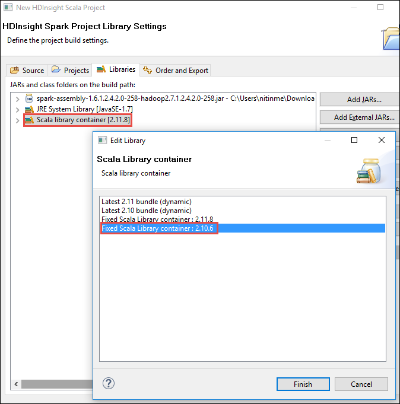

 <properties
    pageTitle="Creare applicazioni ad Scala usando gli strumenti di HDInsight in Azure Toolkit per Eclisse | Microsoft Azure"
    description="Informazioni su come creare un'applicazione di motori per l'esecuzione su cluster HDInsight Spark autonoma."
    services="hdinsight"
    documentationCenter=""
    authors="nitinme"
    manager="jhubbard"
    editor="cgronlun"
    tags="azure-portal"/>

<tags
    ms.service="hdinsight"
    ms.workload="big-data"
    ms.tgt_pltfrm="na"
    ms.devlang="na"
    ms.topic="article"
    ms.date="08/30/2016"
    ms.author="nitinme"/>

# Utilizzare gli strumenti di HDInsight Toolkit di Azure per Eclisse per creare ad applicazioni per cluster Linux ad HDInsight

In questo articolo vengono fornite istruzioni dettagliate sullo sviluppo di applicazioni ad scritte in Scala e l'invio di essa per una HDInsight Spark cluster usando gli strumenti di HDInsight in Azure Toolkit per Eclisse. È possibile utilizzare gli strumenti in vari modi:

* Per sviluppare e inviare una richiesta di Scala Spark in un cluster HDInsight Spark
* Per accedere alle risorse cluster di motori di Azure HDInsight
* Sviluppare ed eseguire un'applicazione di Scala Spark localmente

>[AZURE.IMPORTANT] Questo strumento può essere utilizzato per creare e inviare applicazioni solo per un cluster HDInsight Spark su Linux.

##Prerequisiti

* Un abbonamento Azure. Vedere [ottenere Azure versione di valutazione gratuita](https://azure.microsoft.com/documentation/videos/get-azure-free-trial-for-testing-hadoop-in-hdinsight/).

* Un cluster ad Apache su HDInsight Linux. Per ulteriori informazioni, vedere [creare Apache i cluster in Azure HDInsight](hdinsight-apache-spark-jupyter-spark-sql.md).

* Oracle Java Development kit versione 7 e 8. 
    * **Linguaggio SDK 7** viene utilizzato per la compilazione di progetti di motori come cluster HDInsight supporta Java versione 7. È possibile scaricare Java SDK 7 da [qui](http://www.oracle.com/technetwork/java/javase/downloads/jdk7-downloads-1880260.html).
    * **Linguaggio SDK 8** viene usato per Eclipse IDE runtime. È possibile scaricarlo da [qui](http://www.oracle.com/technetwork/java/javase/downloads/jdk8-downloads-2133151.html).

* Eclipse IDE. In questo articolo utilizza Eclisse Neon. È possibile installarlo da [qui](https://www.eclipse.org/downloads/).

* Scala IDE per Eclisse. 
    * **Se hai Eclipse IDE installato**, è possibile aggiungere il plug-in Scala IDE facendo clic su **Guida** -> **Installare nuovo SoftWare**e aggiungere [http://download.scala-ide.org/sdk/lithium/e44/scala211/stable/site](http://download.scala-ide.org/sdk/lithium/e44/scala211/stable/site) come origine per il download Scala Plugin per Eclisse. 
    * **Se non si dispone Eclipse IDE installato**, è possibile installare Scala IDE da [qui](http://scala-ide.org/download/sdk.html). È possibile scaricare il file con estensione ZIP da questo collegamento, estrarlo, passare alla cartella **/eclipse** e quindi eseguire **eclipse.exe** file da tale posizione.
    
    >[AZURE.NOTE] La procedura descritta in questo documento si basa sull'utilizzo di Eclipse IDE con plug-in Scala installato.

* Motori SDK. È possibile scaricarlo da [qui](http://go.microsoft.com/fwlink/?LinkID=723585&clcid=0x409).

* Installare e (fx) clipse da [https://www.eclipse.org/efxclipse/install.html](https://www.eclipse.org/efxclipse/install.html).

## Installare gli strumenti di HDInsight in Azure Toolkit per Eclisse

HDInsight degli strumenti per Eclisse è disponibile come parte del Toolkit di Azure per Eclisse. Per istruzioni su come installare il Toolkit di Azure, vedere [installare il Toolkit di Azure per Eclisse](../azure-toolkit-for-eclipse-installation.md).

## Accedere all'abbonamento Azure

1. Avviare Eclipse IDE e aprire Esplora aree di Azure. Dal menu **finestra** IDE, fare clic su **Mostra visualizzazione** e quindi fare clic su **altro**. Nella finestra di dialogo visualizzata, espandere **Azure**, fare clic su **Esplora Azure**e quindi fare clic su **OK**.

    

2. Destro nodo **Azure** in **Esplora risorse Azure**e quindi fare clic su **Gestione delle sottoscrizioni**.

3. Nella finestra di dialogo **Gestione delle sottoscrizioni** fare clic su **Accedi** e immettere le credenziali di Azure.

    

4. Dopo avere eseguito, nella finestra di dialogo **Gestione delle sottoscrizioni** Elenca tutte le sottoscrizioni Azure associate alle credenziali. Fare clic su **Chiudi** nella finestra di dialogo.

5. Nella scheda Esplora Azure espandere **HDInsight** per visualizzare i cluster HDInsight Spark in abbonamento.

    

6. È possibile espandere ulteriormente un nodo nome per vedere le risorse (ad esempio gli account di archiviazione) associate al cluster.

    

## Configurare un progetto Scala motori per un cluster di HDInsight Spark

1. Dall'area di lavoro Eclipse IDE, fare clic su **File**, fare clic su **Nuovo**e quindi fare clic su **progetto**. 

2. In Creazione guidata **Nuovo progetto** espandere **HDInsight**, selezionare **motori in HDInsight (Scala)**e quindi fare clic su **Avanti**.

    

3. Nella finestra di dialogo **Nuovo progetto Scala HDInsight** immettere o selezionare valori come illustrato nell'immagine seguente e quindi fare clic su **Avanti**.

    

    * Immettere un nome per il progetto.
    * Nella finestra di **JRE** , assicurarsi che **utilizzare un ambiente di esecuzione JRE** è impostato su **JavaSE 1.7**.
    * Verificare che i SDK è impostato su percorso in cui è stato scaricato il SDK. Il collegamento al percorso di download è incluso nei [Prerequisiti](#prerequisites) in precedenza in questo argomento. È anche possibile scaricare SDK dal collegamento incluso in questa finestra di dialogo come illustrato nell'immagine precedente.    

4. Nella finestra di dialogo successiva, fare clic sulla scheda **raccolte** e fare doppio clic su **Libreria di sistema JRE [JavaSE 1.7]**.

    

5. Nella finestra di dialogo **Modifica catalogo** assicurarsi che **l'Ambiente di esecuzione** è impostato su **JavaSE-1.7(jdk1.7.0_79)**. Se non è disponibile come opzione, seguire la procedura seguente.

    1. Selezionare l'opzione **JRE alternativo** e verificare se **JavaSE-1.7(jdk1.7.0_79)** è disponibile.
    2. In caso contrario, fare clic sul pulsante **JREs installato** .

          

    3. Nella finestra di dialogo **JREs installati** fare clic su **Aggiungi**.

            

    4. Nella finestra di dialogo **Tipo di JRE** selezionare **Macchine Virtuali Standard**e quindi fare clic su **Avanti**

            

    5. Nella finestra di dialogo **Definizione JRE** fare clic su Directory, quindi passare al percorso per l'installazione di JDK 7 e selezionare la cartella principale per **jdk1.7.0_79**.

            

    6. Fare clic su **Fine**. Nella finestra di dialogo **Installato JREs** selezionare JRE appena aggiunto e quindi fare clic su **OK**.

           

    7. JRE appena aggiunto dovrebbe essere elencati per **l'Ambiente di esecuzione**. Fare clic su **Fine**.

           

6. Tornando nella scheda **raccolte** , fare doppio clic su **Scala raccolta contenitore [2.11.8]**. Nella finestra di dialogo **Modifica raccolta** selezionare **raccolta Scala fisso contenitore: 2.10.6**. 

    

    Fino a chiudere la finestra di dialogo delle impostazioni del progetto, fare clic su **Fine** .

## Creare un'applicazione di Scala per cluster HDInsight Spark

1. Nell'IDE Eclisse già aperta, da **Esplora pacchetti**, espandere il progetto creato in precedenza, rapida **src**, scegliere **Nuovo**e quindi fare clic su **altro**.

2. Nella finestra di dialogo **Selezionare una procedura guidata** espandere **Le procedure guidate Scala**, fare clic su **Scala oggetto**e quindi fare clic su **Avanti**.

    

3. Nella finestra di dialogo **Crea nuovo File** immettere un nome per l'oggetto e quindi fare clic su **Fine**.

    

4. Incollare il codice seguente nell'editor di testo.

        import org.apache.spark.SparkConf
        import org.apache.spark.SparkContext
    
        object MyClusterApp{
          def main (arg: Array[String]): Unit = {
            val conf = new SparkConf().setAppName("MyClusterApp")
            val sc = new SparkContext(conf)
        
            val rdd = sc.textFile("wasbs:///HdiSamples/HdiSamples/SensorSampleData/hvac/HVAC.csv")
        
            //find the rows which have only one digit in the 7th column in the CSV
            val rdd1 =  rdd.filter(s => s.split(",")(6).length() == 1)
        
            rdd1.saveAsTextFile("wasbs:///HVACOut")
          }     
        }

5. Eseguire l'applicazione in un cluster HDInsight Spark.

    1. Da **Esplora pacchetti**destro del mouse sul nome del progetto e quindi selezionare **Invia ad un'applicazione di HDInsight**.      

    2. Nella finestra di dialogo **Invio ad** fornire i valori seguenti.

        * Per **Nome Cluster**, selezionare il cluster HDInsight Spark in cui si vuole eseguire l'applicazione.

        * È necessario selezionare un elemento dal progetto Eclipse, oppure selezionarne uno sul disco rigido.

        * Con la casella di testo **nome della classe principale** , immettere il nome dell'oggetto specificato nel codice (vedere l'immagine riportata di seguito).

            

        * Poiché il codice dell'applicazione in questo esempio non richiede gli argomenti della riga di comando o riferimento a contenitori o file, è possibile lasciare vuoto rimanenti caselle di testo.

        * Fare clic su **Invia**.

    3. Scheda **Presentazione ad** dovrebbe iniziare la visualizzazione dello stato di avanzamento. È possibile interrompere l'applicazione fare clic sul pulsante rosso nella finestra "Motori invio". È anche possibile visualizzare i log dell'applicazione specifica eseguire facendo clic sull'icona del globo (contrassegnato con il riquadro blu nell'immagine).

        

    Nella sezione successiva si imparerà a accedere al processo di output usando gli strumenti di HDInsight in Azure Toolkit per Eclisse.

## Accedere e gestire i cluster HDInsight Spark usando gli strumenti di HDInsight in Azure Toolkit per Eclisse

È possibile eseguire diverse operazioni con gli strumenti di HDInsight.

### Accedere al contenitore di spazio di archiviazione per il cluster

1. In Esplora aree di Azure, espandere **HDInsight** nodo principale per visualizzare un elenco di cluster HDInsight Spark disponibili.

3. Espandere il nome del grafico per visualizzare l'account di archiviazione e il contenitore di spazio di archiviazione predefinito per il cluster.

    

4. Scegliere il nome del contenitore di spazio di archiviazione associato al cluster. Nel riquadro destro, verrà visualizzato una cartella denominata **HVACOut**. Fare doppio clic per aprire la cartella e si vedranno **parte -*** file. Aprire uno dei file per visualizzare l'output dell'applicazione.

### Accedere al Server di cronologia motori

1. Da **Esplora Azure**, destro del mouse sul proprio nome di cluster motori e quindi selezionare **Apri dell'interfaccia utente della cronologia motori**. Quando richiesto, immettere le credenziali di amministratore per il cluster. È necessario specificare questi durante il provisioning del cluster.

2. Nel dashboard motori cronologia Server, è possibile cercare l'applicazione è sufficiente termine in esecuzione con il nome dell'applicazione. Nel codice, impostare il nome dell'applicazione utilizzando `val conf = new SparkConf().setAppName("MyClusterApp")`. Di conseguenza, il nome dell'applicazione di motori è stato **MyClusterApp**.

### Avviare il portale Ambari

Da **Esplora Azure**, destro del mouse sul proprio nome di cluster motori e quindi selezionare **Apri portale di gestione di Cluster (Ambari)**. Quando richiesto, immettere le credenziali di amministratore per il cluster. È necessario specificare questi durante il provisioning del cluster.

### Gestire le sottoscrizioni di Azure

Per impostazione predefinita, gli strumenti di HDInsight di Azure Toolkit per Eclisse Elenca i cluster di motori da tutte le sottoscrizioni Azure. Se necessario, è possibile specificare le sottoscrizioni per il quale si desidera accedere al cluster. Da **Esplora Azure**, destro il nodo principale di **Azure** e quindi fare clic su **Gestione delle sottoscrizioni**. Nella finestra di dialogo deselezionare le caselle di controllo con l'abbonamento a cui non si desidera accedere e quindi fare clic su **Chiudi**. È possibile anche fare clic su **Disconnetti** se si vuole disconnettersi dall'abbonamento Azure.

## Eseguire un'applicazione di motori Scala localmente

È possibile utilizzare gli strumenti di HDInsight in Azure Toolkit per Eclisse eseguire Scala ad applicazioni in locale nella workstation. In genere, tali applicazioni non necessario l'accesso alle risorse cluster, ad esempio contenitore dello spazio di archiviazione e possono essere eseguite e testate in locale.

### Prerequisito

Durante l'esecuzione dell'applicazione ad Scala locale in un computer Windows, potrebbe essere visualizzato un'eccezione, come illustrato in [motori 2356](https://issues.apache.org/jira/browse/SPARK-2356) che si verifica a causa di un mancanti **WinUtils.exe** nel sistema operativo Windows. Per risolvere questo errore, è necessario [scaricare il file eseguibile da questa posizione](http://public-repo-1.hortonworks.com/hdp-win-alpha/winutils.exe) in un percorso ad esempio **C:\WinUtils\bin**. È quindi necessario aggiungere una variabile di ambiente **HADOOP_HOME** e impostare il valore della variabile **C\WinUtils**.

### Eseguire un'applicazione di motori Scala locale  

1. Avviare Eclisse e creare un nuovo progetto. Nella nuova finestra di dialogo progetto, selezionare le opzioni seguenti e quindi fare clic su **Avanti**.

    

    * Nel riquadro sinistro selezionare **HDInsight**.
    * Nel riquadro destro selezionare **motori HDInsight locale eseguire campione (Scala)**.
    * Fare clic su **Avanti**.

2. Per fornire i dettagli del progetto, seguire i passaggi da 3 a 6 come illustrato nella sezione precedente [impostazione di un progetto di applicazione Scala motori per un cluster di motori HDInsight](#set-up-a-spark-scala-application-project-for-an-hdinsight-spark cluster).

3. Il modello aggiunge un codice di esempio (**LogQuery**) nella cartella **src** che è possibile eseguire nel computer in uso.

    

4.  Fare clic con il pulsante destro sull'applicazione **LogQuery** , scegliere **Esegui come**e quindi fare clic su **applicazione Scala 1**. Verrà visualizzato un risultato simile nella scheda **Console** nella parte inferiore.

    

## Problemi noti e commenti e suggerimenti

Attualmente visualizzati ad restituisce direttamente non è supportata e stiamo lavorando a cui.

Se si dispone dei suggerimenti o commenti e suggerimenti o in caso di problemi quando si usa questo strumento, è possibile eliminare Contattaci tramite posta elettronica in hdivstool in microsoft punto com.

## Vedere anche

* [Panoramica: Apache motori su Azure HDInsight](hdinsight-apache-spark-overview.md)

### Scenari

* [Motori con BI: eseguire l'analisi dei dati interattive tramite motori in HDInsight con strumenti di Business Intelligence](hdinsight-apache-spark-use-bi-tools.md)

* [Motori di apprendimento: usare i in HDInsight per l'analisi temperatura predefiniti utilizzando dati HVAC](hdinsight-apache-spark-ipython-notebook-machine-learning.md)

* [Motori di apprendimento: usare i in HDInsight per prevedere i risultati del controllo alimentari](hdinsight-apache-spark-machine-learning-mllib-ipython.md)

* [Motori Streaming: Usare motori in HDInsight per la creazione di applicazioni di trasmissione in tempo reale](hdinsight-apache-spark-eventhub-streaming.md)

* [Analisi dei log sito Web tramite motori in HDInsight](hdinsight-apache-spark-custom-library-website-log-analysis.md)

### Creare ed eseguire applicazioni

* [Creare un'applicazione autonoma utilizza Scala](hdinsight-apache-spark-create-standalone-application.md)

* [Eseguire processi in modalità remota in un cluster di motori tramite inserire il](hdinsight-apache-spark-livy-rest-interface.md)

### Strumenti ed estensioni

* [Utilizzare gli strumenti di HDInsight Toolkit di Azure per IntelliJ per creare e inviare Scala ad applicazioni](hdinsight-apache-spark-intellij-tool-plugin.md)

* [Usare gli strumenti HDInsight Toolkit di Azure per IntelliJ eseguire il debug riguardo applicazioni in modalità remota](hdinsight-apache-spark-intellij-tool-plugin-debug-jobs-remotely.md)

* [Usare i blocchi appunti Zeppelin con un cluster di motori su HDInsight](hdinsight-apache-spark-use-zeppelin-notebook.md)

* [Disponibile per blocco appunti Jupyter cluster motori per HDInsight. x](hdinsight-apache-spark-jupyter-notebook-kernels.md)

* [Utilizzare i pacchetti esterni con i blocchi appunti Jupyter](hdinsight-apache-spark-jupyter-notebook-use-external-packages.md)

* [Installare Jupyter nel computer e connettersi a un cluster HDInsight Spark](hdinsight-apache-spark-jupyter-notebook-install-locally.md)

### Gestire le risorse

* [Gestire le risorse per cluster ad Apache in Azure HDInsight](hdinsight-apache-spark-resource-manager.md)

* [Tenere traccia e debug processi in esecuzione in un cluster di motori di Apache in HDInsight](hdinsight-apache-spark-job-debugging.md)
