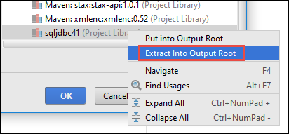

<properties 
    pageTitle="Utilizzare Azure evento hub con i Apache in HDInsight per elaborare dati flussi | Microsoft Azure" 
    description="Istruzioni dettagliate su come inviare un dati flusso Azure evento Hub e ricevano gli eventi in motori utilizzando un'applicazione di scala" 
    services="hdinsight" 
    documentationCenter="" 
    authors="nitinme" 
    manager="jhubbard" 
    editor="cgronlun"
    tags="azure-portal"/>

<tags 
    ms.service="hdinsight" 
    ms.workload="big-data" 
    ms.tgt_pltfrm="na" 
    ms.devlang="na" 
    ms.topic="article" 
    ms.date="09/30/2016" 
    ms.author="nitinme"/>

# Motori Streaming: Elaborare gli eventi da Azure evento hub con cluster ad Apache su HDInsight Linux

I flussi estende l'API di motori di compilazione di applicazioni per l'elaborazione flusso scalable ad alta velocità, tolleranza principale. Dati possono essere acquisiti da molte origini. In questo articolo vengono utilizzati Azure evento hub per il caricamento di dati. Hub di evento è un sistema di acquisizione scalabilità tale assunzione può milioni di eventi al secondo. 

In questa esercitazione viene spiegato come creare un Hub di eventi di Azure, come l'acquisizione di messaggi a un Hub di eventi mediante un'applicazione console Java e recuperarli in parallelo utilizzando un'applicazione di motori scritta in Scala. Questa applicazione fruisce dei dati in streaming tramite hub di eventi e indirizza a diversi output (Azure lo spazio di archiviazione Blob, tabella Hive e una tabella SQL).

> [AZURE.NOTE] Per seguire le istruzioni fornite in questo articolo, è necessario utilizzare entrambe le versioni del portale di Azure. Per creare un Hub evento occorre usare il [portale di Azure classica](https://manage.windowsazure.com). Per lavorare con i cluster HDInsight Spark, occorre usare il [Portale di Azure](https://portal.azure.com/).  

**Prerequisiti:**

È necessario disporre le operazioni seguenti:

- Un abbonamento Azure. Vedere [ottenere Azure versione di valutazione gratuita](https://azure.microsoft.com/documentation/videos/get-azure-free-trial-for-testing-hadoop-in-hdinsight/).
- Un cluster di motori di Apache. Per ulteriori informazioni, vedere [creare Apache i cluster in Azure HDInsight](hdinsight-apache-spark-jupyter-spark-sql.md).
- Kit di sviluppo di linguaggio Oracle. È possibile installarlo da [qui](http://www.oracle.com/technetwork/java/javase/downloads/jdk8-downloads-2133151.html).
- Un linguaggio IDE. In questo articolo utilizza IDEA IntelliJ 15.0.1. È possibile installarlo da [qui](https://www.jetbrains.com/idea/download/).
- Driver JDBC di Microsoft per SQL Server 4.1 o versione successiva. È necessario per inserire i dati di evento in un database SQL Server. È possibile installarlo da [qui](https://msdn.microsoft.com/sqlserver/aa937724.aspx).
- Un database di SQL Azure. Per ulteriori informazioni, vedere [creare un database SQL in minuti](../sql-database/sql-database-get-started.md).

## Qual è la soluzione?

Si tratta in modalità di scorrimento della soluzione di flusso:

1. Creare un Hub di evento Azure che riceverà un flusso di eventi.

2. Eseguire un'applicazione autonoma locale genera eventi e lo inserisce Hub evento Azure. L'applicazione di esempio che esegue questa operazione viene pubblicato in [https://github.com/hdinsight/spark-streaming-data-persistence-examples](https://github.com/hdinsight/spark-streaming-data-persistence-examples).

2. Eseguire un'applicazione di flusso in modalità remota in un cluster di motori che legge flusso gli eventi da Azure evento Hub e lo inserisce in posizioni diverse (Blob Azure, tabella Hive e tabella di database SQL). 

## Creare eventi Azure Hub

1. Scegliere **Nuovo**dal [Portale di Azure](https://manage.windowsazure.com), > **Bus di servizio** > **Evento Hub** > **Creare personalizzata**.

2. Nella schermata **Aggiungi un nuovo evento Hub** immettere il **Nome dell'evento Hub**, selezionare l' **area geografica** per creare l'hub e creare un nuovo spazio dei nomi o selezionarne uno esistente. Fare clic sulla **freccia** per continuare.

    ![pagina della procedura guidata 1] (./media/hdinsight-apache-spark-eventhub-streaming/hdispark.streaming.create.event.hub.png "Creare un Hub evento Azure")

    > [AZURE.NOTE] È consigliabile selezionare nella stessa **posizione** come il cluster ad Apache in HDInsight per ridurre i costi e latenza.

3. Nella schermata **Configura Hub evento** immettere i valori di **conteggio partizione** e la **Conservazione dei messaggi** e quindi fare clic sul segno di spunta. In questo esempio, utilizzare un conteggio partizione di 10 e la conservazione di un messaggio di 1. Nota il numero totale di partizione perché è necessario questo valore in un secondo momento.

    ![pagina della procedura guidata 2] (./media/hdinsight-apache-spark-eventhub-streaming/hdispark.streaming.create.event.hub2.png "Specificare partizione dimensioni e la conservazione dei giorni Hub di evento")

4. Fare clic su Hub evento creato, fare clic su **Configura**e quindi creare due criteri di accesso per l'hub di evento.

    <table>
    <tr><th>Nome</th><th>Autorizzazioni</th></tr>
    <tr><td>mysendpolicy</td><td>Invia</td></tr>
    <tr><td>myreceivepolicy</td><td>Ascolto</td></tr>
    </table>

    Dopo aver creato le autorizzazioni, selezionare l'icona **Salva** nella parte inferiore della pagina. Consente di creare i criteri di accesso condiviso che verranno utilizzati per inviare (**mysendpolicy**) e ascoltare (**myreceivepolicy**) Hub questo evento.

    ![criteri] (./media/hdinsight-apache-spark-eventhub-streaming/hdispark.streaming.event.hub.policies.png "Creare eventi Hub criteri")

    
5. Nella stessa pagina, annotare di chiavi dei criteri per i criteri di due generato. Salvare questi tasti poiché verrà utilizzate in un secondo momento.

    ![chiavi dei criteri] (./media/hdinsight-apache-spark-eventhub-streaming/hdispark.streaming.event.hub.policy.keys.png "Salvare chiavi dei criteri")

6. Nella pagina del **Dashboard** , fare clic su **Informazioni di connessione** dal basso per recuperare e salvare le stringhe di connessione per l'Hub di evento utilizzando due criteri.

    ![chiavi dei criteri] (./media/hdinsight-apache-spark-eventhub-streaming/hdispark.streaming.event.hub.policy.connection.strings.png "Salvare le stringhe di connessione dei criteri")

## Utilizzare un'applicazione di Scala per inviare messaggi all'evento Hub

In questa sezione è utilizzare un'applicazione Scala locale autonoma per inviare un flusso di eventi a Hub di evento Azure creato nel passaggio precedente. Questa applicazione è disponibile in GitHub in [https://github.com/hdinsight/eventhubs-sample-event-producer](https://github.com/hdinsight/eventhubs-sample-event-producer). Questi passaggi presuppongono che hanno già duplicata questo repository GitHub.

1. Aprire l'applicazione, **EventhubsSampleEventProducer**in IntelliJ IDEA.
    
2. Compilare il progetto. Dal menu **Compila** fare clic su **Crea progetto**. Vaso output viene creata in **\out\artifacts**.

>[AZURE.TIP] Utilizzare un'opzione disponibile in IntelliJ IDEA creare direttamente il progetto da un repository GitHub. Per informazioni su come utilizzare questo approccio, utilizzare le istruzioni nella sezione successiva per indicazioni. Si noti che molte alla procedura descritta nella sezione successiva non saranno applicabili per l'applicazione di Scala creati in questo passaggio. Per esempio:

> * Non è necessario aggiornare POM per includere la versione di motori. Che non è presente alcuna dipendenza in motori per la creazione dell'applicazione
> * Non è necessario aggiungere alcuni JAR dipendenza alla libreria di project. Ciò avviene perché tali JAR non sono necessari per il progetto.

## Aggiornare la Scala dell'applicazione per ricevere gli eventi di flusso

Esempio Scala a un'applicazione ricevano l'evento e inviarlo a diverse destinazioni è disponibile in [https://github.com/hdinsight/spark-streaming-data-persistence-examples](https://github.com/hdinsight/spark-streaming-data-persistence-examples). Seguire la procedura seguente per aggiornare l'applicazione e creare vaso output.

1. IntelliJ IDEA di avvio e dalla schermata di avvio selezionare **Estrai dal controllo delle versioni** e quindi fare clic su **fra**.
        
    

2. Nella finestra di dialogo **Archivio duplicato** , fornire l'URL all'archivio fra per duplicare da, specificare la directory da duplicare a e quindi fare clic su **duplicato**.

    

    
3. Seguire le istruzioni fino a quando il progetto viene completamente duplicato. Premere **Alt + 1** per aprire la **Visualizzazione del progetto**. Sarà simile al seguente.

    
    
4. Verificare che il codice dell'applicazione viene compilato con Java8. A tale scopo, fare clic su **File**, fare clic su **Struttura del progetto**e nella scheda **progetto** , verificare che il livello del linguaggio di progetto è impostato su **8 - lambda, annotazioni di tipo e così via**.

    

5. Aprire **pom.xml** e assicurarsi che la versione di motori sia corretta. In <properties> nodo, cercare il frammento di codice seguente e verificare la versione di motori.

        <scala.version>2.10.4</scala.version>
        <scala.compat.version>2.10.4</scala.compat.version>
        <scala.binary.version>2.10</scala.binary.version>
        <spark.version>1.6.2</spark.version>
    
5. L'applicazione richiede due vasetti da dipendenza:

    * **Vaso ricevitore EventHub**. Questa operazione è necessaria motori di ricevere i messaggi dall'Hub evento. Per utilizzare questa vaso, aggiornare **pom.xml** per aggiungere quanto segue per `<dependencies>`.

            <dependency>
              <groupId>com.microsoft.azure</groupId>
              <artifactId>spark-streaming-eventhubs_2.10</artifactId>
              <version>1.6.0</version>
            </dependency> 

    * **Vaso driver JDBC**. È necessario per scrivere i messaggi ricevuti da Hub di evento in un database di SQL Azure. È possibile scaricare 4.1 o versione successiva del file vaso da [qui](https://msdn.microsoft.com/sqlserver/aa937724.aspx). Aggiungere un riferimento a questo vaso nella libreria del progetto. Eseguire i passaggi seguenti:

        1. Dalla finestra IDEA IntelliJ nel punto in cui si dispone dell'applicazione aprire, fare clic su **File**, fare clic su **Struttura del progetto**e quindi fare clic su **raccolte**. 
        
        2. Fare clic sull'icona Aggiungi (), fare clic su **linguaggio**e quindi passare al percorso in cui è stato scaricato vaso driver JDBC. Seguire le istruzioni per aggiungere il file vaso alla libreria di project.

            ![aggiungere relazioni mancanti] (./media/hdinsight-apache-spark-eventhub-streaming/add-missing-dependency-jars.png "Aggiungi mancanti vasetti da di dipendenza")

        3. Fare clic su **Applica**.

6. Creare il file di output vaso. Eseguire la procedura seguente.
    1. Nella finestra di dialogo **Struttura del progetto** , fare clic su **elementi** e quindi fare clic sul segno. Nella finestra di dialogo a comparsa fare clic su **JAR**e quindi fare clic su **da moduli e le dipendenze**.

        

    1. Nella finestra di dialogo **Crea JAR da moduli** fare clic sui puntini di sospensione () a fronte della **Classe principale**.

    1. Nella finestra di dialogo **Selezionare classe principale** , selezionare le classi disponibili e quindi fare clic su **OK**.

        

    1. Nella finestra di dialogo **Crea JAR da moduli** assicurarsi che sia selezionata l'opzione per **l'estrazione di destinazione VASO** e quindi fare clic su **OK**. Verrà creata una singola VASO con tutte le dipendenze.

        

    1. Nella scheda **Layout di Output** sono elencati tutti vasetti da cui sono inclusi come parte del progetto Maven. È possibile selezionare ed eliminare quelli in cui l'applicazione Scala non dispone di alcun dipendenza diretta. Per l'applicazione viene creata in questo caso, è possibile rimuovere tutti tranne l'ultimo uno (**microsoft-i-streaming-esempi compilare output**). Selezionare vasetti da eliminare e quindi fare clic sull'icona **Elimina** ().

        

        Verificare che sia selezionata la **compilazione sulla creazione** , che assicura che vaso sia creato ogni volta che il progetto viene creato o aggiornato. Fare clic su **Applica** e quindi su **OK**.

    1. Nella scheda **Layout di Output** destra nella parte inferiore della casella **Elementi disponibili** , è possibile vaso SQL JDBC aggiunto in precedenza alla libreria di project. È necessario aggiungere l'alla scheda **Layout di Output** . Fare clic sul file vaso e quindi fare clic su **Estrai in Output principale**.

          

        Scheda **Layout di Output** dovrebbe ora simile al seguente.

             

        Nella finestra di dialogo **Struttura del progetto** , fare clic su **Applica** e quindi fare clic su **OK**. 

    1. Dalla barra dei menu fare clic su **Genera**e quindi fare clic su **Crea progetto**. È anche possibile fare clic su **Creare elementi** per creare vaso. Vaso output viene creata in **\out\artifacts**.

        

## Eseguire le applicazioni quando in modalità remota in un cluster di motori tramite inserire il

Inserire il verrà usata per eseguire l'applicazione di flusso in modalità remota in un cluster di motori. Per informazioni dettagliate sull'uso di inserire il con cluster HDInsight Spark, vedere [invio di processi in modalità remota a un cluster ad Apache su Azure HDInsight](hdinsight-apache-spark-livy-rest-interface.md). Prima di iniziare l'esecuzione di processi remoti agli eventi di flusso con motori sono sono un paio di operazioni che è necessario eseguire:

1. Avviare l'applicazione autonoma locale per generare eventi e inviate agli eventi Hub. Usare il comando seguente per eseguire questa operazione:

        java -cp EventhubsSampleEventProducer.jar com.microsoft.eventhubs.client.example.EventhubsClientDriver --eventhubs-namespace "mysbnamespace" --eventhubs-name "myeventhub" --policy-name "mysendpolicy" --policy-key "<policy key>" --message-length 32 --thread-count 32 --message-count -1

2. Copiare lo spazio di archiviazione Blob Azure associato al cluster vaso streaming (**microsoft-i-streaming-examples.jar**). In questo modo accessibile per inserire il vaso. È possibile utilizzare [**AzCopy**](../storage/storage-use-azcopy.md), un'utilità della riga di comando per farlo. Sono disponibili molti altri client, che è possibile utilizzare per caricare i dati. È possibile trovare ulteriori informazioni sulle loro al [caricamento dei dati per i processi di Hadoop in HDInsight](hdinsight-upload-data.md).

3. Installare curvatura nel computer in cui si eseguono queste applicazioni da. CURVATURA vengono utilizzati per richiamare l'endpoint di inserire il per eseguire i processi in modalità remota.

### Eseguire le applicazioni per ricevere gli eventi in un Blob di spazio di archiviazione Azure come testo

Aprire un prompt dei comandi, passare alla cartella in cui è installato curvatura ed eseguire il comando seguente (Sostituisci nome utente/password e cluster nome):

    curl -k --user "admin:mypassword1!" -v -H "Content-Type: application/json" -X POST --data @C:\Temp\inputBlob.txt "https://mysparkcluster.azurehdinsight.net/livy/batches"

I parametri nel file **inputBlob.txt** sono i seguenti:

    { "file":"wasbs:///example/jars/microsoft-spark-streaming-examples.jar", "className":"com.microsoft.spark.streaming.examples.workloads.EventhubsEventCount", "args":["--eventhubs-namespace", "mysbnamespace", "--eventhubs-name", "myeventhub", "--policy-name", "myreceivepolicy", "--policy-key", "<put-your-key-here>", "--consumer-group", "$default", "--partition-count", 10, "--batch-interval-in-seconds", 20, "--checkpoint-directory", "/EventCheckpoint", "--event-count-folder", "/EventCount/EventCount10"], "numExecutors":20, "executorMemory":"1G", "executorCores":1, "driverMemory":"2G" }

Possiamo comprendere i parametri nel file di input:

* **file** è il percorso del file vaso dell'applicazione nella pagina account di archiviazione Azure associato al cluster.
* **NomeClasse** è il nome della classe nel vaso.
* **argomenti** è l'elenco di argomenti necessari per la classe
* **numExecutors** è il numero di core utilizzati da motori per eseguire l'applicazione di flusso. Deve sempre essere almeno due volte il numero di eventi Hub partizioni.
* **executorMemory**, **executorCores** **driverMemory** sono parametri utilizzati per assegnare risorse necessarie all'applicazione di flusso.

>[AZURE.NOTE] Non è necessario creare le cartelle di output (EventCheckpoint, EventCount/EventCount10) utilizzati come parametri. L'applicazione flusso verranno creati automaticamente.
    
Quando si esegue il comando, viene visualizzato un output simile al seguente:

    < HTTP/1.1 201 Created
    < Content-Type: application/json; charset=UTF-8
    < Location: /18
    < Server: Microsoft-IIS/8.5
    < X-Powered-By: ARR/2.5
    < X-Powered-By: ASP.NET
    < Date: Tue, 01 Dec 2015 05:39:10 GMT
    < Content-Length: 37
    <
    {"id":1,"state":"starting","log":[]}* Connection #0 to host mysparkcluster.azurehdinsight.net left intact

Prendere nota dell'ID batch nell'ultima riga di output (in questo esempio è "1"). Per verificare che l'applicazione viene eseguita correttamente, è possibile visualizzare l'account di archiviazione Azure associato al cluster e verrà visualizzato nella cartella **/EventCount/EventCount10** creata. Questa cartella deve contenere blob che acquisisce il numero di eventi elaborati durante il periodo di tempo specificato per il parametro **batch intervallo in secondi**.

L'applicazione rimarrà attivo finché non si elimina. Per eseguire questa operazione, utilizzare il comando seguente:

    curl -k --user "admin:mypassword1!" -v -X DELETE "https://mysparkcluster.azurehdinsight.net/livy/batches/1"

### Eseguire le applicazioni per ricevere gli eventi in un Blob di spazio di archiviazione Azure come JSON

Aprire un prompt dei comandi, passare alla cartella in cui è installato curvatura ed eseguire il comando seguente (Sostituisci nome utente/password e cluster nome):

    curl -k --user "admin:mypassword1!" -v -H "Content-Type: application/json" -X POST --data @C:\Temp\inputJSON.txt "https://mysparkcluster.azurehdinsight.net/livy/batches"

I parametri nel file **inputJSON.txt** sono i seguenti:

    { "file":"wasbs:///example/jars/microsoft-spark-streaming-examples.jar", "className":"com.microsoft.spark.streaming.examples.workloads.EventhubsToAzureBlobAsJSON", "args":["--eventhubs-namespace", "mysbnamespace", "--eventhubs-name", "myeventhub", "--policy-name", "myreceivepolicy", "--policy-key", "<put-your-key-here>", "--consumer-group", "$default", "--partition-count", 10, "--batch-interval-in-seconds", 20, "--checkpoint-directory", "/EventCheckpoint", "--event-count-folder", "/EventCount/EventCount10", "--event-store-folder", "/EventStore10"], "numExecutors":20, "executorMemory":"1G", "executorCores":1, "driverMemory":"2G" }

I parametri sono simili a quanto specificato per l'output di testo, nel passaggio precedente. Nuovo, non è necessario creare le cartelle di output (EventCheckpoint, EventCount/EventCount10) utilizzati come parametri. L'applicazione flusso verranno creati automaticamente.

 Dopo aver eseguito il comando, è possibile visualizzare l'account di archiviazione Azure associato al cluster e verrà visualizzato nella cartella **/EventStore10** creata. Aprire qualsiasi file preceduto da **parte** che si dovrebbe essere visualizzata eventi elaborati in un formato JSON.

### Eseguire le applicazioni per ricevere gli eventi in una tabella Hive

Per eseguire l'applicazione che trasmette gli eventi in una tabella Hive è necessario alcuni componenti aggiuntivi. Di seguito sono:

* api di datanucleus-3.2.6.jar di jdo
* 3.2.9.jar di rdbms datanucleus
* 3.2.10.jar di base datanucleus
* hive site.xml

I file **JAR** sono disponibili sul cluster HDInsight Spark in `/usr/hdp/current/spark-client/lib`. **Hive site.xml** è disponibile in `/usr/hdp/current/spark-client/conf`.

È possibile utilizzare [WinScp](http://winscp.net/eng/download.php) per copiare questi file dal cluster al computer locale. È quindi possibile utilizzare gli strumenti per copiare questi file al proprio account di archiviazione associato al cluster. Per ulteriori informazioni su come caricare file in account di archiviazione, vedere [caricare dati per i processi di Hadoop in HDInsight](hdinsight-upload-data.md).

Dopo avere copiato i file al proprio account Azure dello spazio di archiviazione, aprire un prompt dei comandi, passare alla cartella in cui è installato curvatura ed eseguire il comando seguente (Sostituisci nome utente/password e cluster nome):

    curl -k --user "admin:mypassword1!" -v -H "Content-Type: application/json" -X POST --data @C:\Temp\inputHive.txt "https://mysparkcluster.azurehdinsight.net/livy/batches"

I parametri nel file **inputHive.txt** sono i seguenti:

    { "file":"wasbs:///example/jars/microsoft-spark-streaming-examples.jar", "className":"com.microsoft.spark.streaming.examples.workloads.EventhubsToHiveTable", "args":["--eventhubs-namespace", "mysbnamespace", "--eventhubs-name", "myeventhub", "--policy-name", "myreceivepolicy", "--policy-key", "<put-your-key-here>", "--consumer-group", "$default", "--partition-count", 10, "--batch-interval-in-seconds", 20, "--checkpoint-directory", "/EventCheckpoint", "--event-count-folder", "/EventCount/EventCount10", "--event-hive-table", "EventHiveTable10" ], "jars":["wasbs:///example/jars/datanucleus-api-jdo-3.2.6.jar", "wasbs:///example/jars/datanucleus-rdbms-3.2.9.jar", "wasbs:///example/jars/datanucleus-core-3.2.10.jar"], "files":["wasbs:///example/jars/hive-site.xml"], "numExecutors":20, "executorMemory":"1G", "executorCores":1, "driverMemory":"2G" }

I parametri sono simili a quanto specificato per l'output di testo, in precedenza. Nuovo, non è necessaria creare le cartelle di output (EventCheckpoint, EventCount/EventCount10) o l'output della tabella Hive (EventHiveTable10) vengono utilizzati come parametri. L'applicazione flusso verranno creati automaticamente. Si noti che l'opzione **JAR** e **file** include percorsi dei file JAR e hive-site.xml copiato su account di archiviazione.

Per verificare che la tabella hive è stata creata correttamente, è possibile SSH in cluster e di esecuzione query Hive. Per ulteriori informazioni, vedere [Usare Hive con Hadoop in HDInsight con SSH](hdinsight-hadoop-use-hive-ssh.md). Una volta che si è connessi mediante SSH, è possibile eseguire il seguente comando per verificare che la tabella Hive, **EventHiveTable10**, viene creata.

    show tables;

Verrà visualizzato un output simile al seguente:

    OK
    eventhivetable10
    hivesampletable

È anche possibile eseguire una query di selezione per visualizzare il contenuto della tabella.

    SELECT * FROM eventhivetable10 LIMIT 10;

Verrà visualizzato un output simile al seguente:

    ZN90apUSQODDTx7n6Toh6jDbuPngqT4c
    sor2M7xsFwmaRW8W8NDwMneFNMrOVkW1
    o2HcsU735ejSi2bGEcbUSB4btCFmI1lW
    TLuibq4rbj0T9st9eEzIWJwNGtMWYoYS
    HKCpPlWFWAJILwR69MAq863nCWYzDEw6
    Mvx0GQOPYvPR7ezBEpIHYKTKiEhYammQ
    85dRppSBSbZgThLr1s0GMgKqynDUqudr
    5LAWkNqorLj3ZN9a2mfWr9rZqeXKN4pF
    ulf9wSFNjD7BZXCyunozecov9QpEIYmJ
    vWzM3nvOja8DhYcwn0n5eTfOItZ966pa
    Time taken: 4.434 seconds, Fetched: 10 row(s)

### Eseguire le applicazioni per ricevere gli eventi in una tabella di database SQL Azure

Prima di eseguire questo passaggio, verificare che si dispone di un database di SQL Azure creato. È necessario valori per il nome del database, nome del server di database e le credenziali di amministratore di database come parametri. Non è necessario creare anche se la tabella di database. L'applicazione flusso crea che dell'utente.

Aprire un prompt dei comandi, passare alla cartella in cui è installato curvatura ed eseguire il comando seguente:

    curl -k --user "admin:mypassword1!" -v -H "Content-Type: application/json" -X POST --data @C:\Temp\inputSQL.txt "https://mysparkcluster.azurehdinsight.net/livy/batches"

I parametri nel file **inputSQL.txt** sono i seguenti:

    { "file":"wasbs:///example/jars/microsoft-spark-streaming-examples.jar", "className":"com.microsoft.spark.streaming.examples.workloads.EventhubsToAzureSQLTable", "args":["--eventhubs-namespace", "mysbnamespace", "--eventhubs-name", "myeventhub", "--policy-name", "myreceivepolicy", "--policy-key", "<put-your-key-here>", "--consumer-group", "$default", "--partition-count", 10, "--batch-interval-in-seconds", 20, "--checkpoint-directory", "/EventCheckpoint", "--event-count-folder", "/EventCount/EventCount10", "--sql-server-fqdn", "<database-server-name>.database.windows.net", "--sql-database-name", "mysparkdatabase", "--database-username", "sparkdbadmin", "--database-password", "<put-password-here>", "--event-sql-table", "EventContent" ], "numExecutors":20, "executorMemory":"1G", "executorCores":1, "driverMemory":"2G" }

Per verificare che l'applicazione viene eseguita correttamente, è possibile connettersi al database SQL Azure con SQL Server Management Studio. Per istruzioni su come eseguire questa operazione, vedere [connettersi al Database SQL di SQL Server Management Studio](../sql-database/sql-database-connect-query-ssms.md). Una volta che si è connessi al database, è possibile passare alla tabella **EventContent** creata dall'applicazione di flusso. È possibile eseguire una query rapida per l'accesso ai dati della tabella. Eseguire la query seguente:

    SELECT * FROM EventCount

È necessario vedere output simile al seguente:

    00046b0f-2552-4980-9c3f-8bba5647c8ee
    000b7530-12f9-4081-8e19-90acd26f9c0c
    000bc521-9c1b-4a42-ab08-dc1893b83f3b
    00123a2a-e00d-496a-9104-108920955718
    0017c68f-7a4e-452d-97ad-5cb1fe5ba81b
    001KsmqL2gfu5ZcuQuTqTxQvVyGCqPp9
    001vIZgOStka4DXtud0e3tX7XbfMnZrN
    00220586-3e1a-4d2d-a89b-05c5892e541a
    0029e309-9e54-4e1b-84be-cd04e6fce5ec
    003333cf-874f-4045-9da3-9f98c2b4ea49
    0043c07e-8d73-420a-9af7-1fcb94575356
    004a11a9-0c2c-4bc0-a7d5-2e0ebd947ab9

    
## Vedere anche

* [Panoramica: Apache motori su Azure HDInsight](hdinsight-apache-spark-overview.md)

### Scenari

* [Motori con BI: eseguire l'analisi dei dati interattive tramite motori in HDInsight con strumenti di Business Intelligence](hdinsight-apache-spark-use-bi-tools.md)

* [Motori di apprendimento: usare i in HDInsight per l'analisi temperatura predefiniti utilizzando dati HVAC](hdinsight-apache-spark-ipython-notebook-machine-learning.md)

* [Motori di apprendimento: usare i in HDInsight per prevedere i risultati del controllo alimentari](hdinsight-apache-spark-machine-learning-mllib-ipython.md)

* [Analisi dei log sito Web tramite motori in HDInsight](hdinsight-apache-spark-custom-library-website-log-analysis.md)

### Creare ed eseguire applicazioni

* [Creare un'applicazione autonoma utilizza Scala](hdinsight-apache-spark-create-standalone-application.md)

* [Eseguire processi in modalità remota in un cluster di motori tramite inserire il](hdinsight-apache-spark-livy-rest-interface.md)

### Strumenti ed estensioni

* [Plug-in strumenti di HDInsight per IntelliJ IDEA consente di creare e inviare Scala ad applicazioni](hdinsight-apache-spark-intellij-tool-plugin.md)

* [Utilizzare plug-in strumenti di HDInsight per IntelliJ IDEA il debug delle applicazioni di motori in modalità remota](hdinsight-apache-spark-intellij-tool-plugin-debug-jobs-remotely.md)

* [Usare i blocchi appunti Zeppelin con un cluster di motori su HDInsight](hdinsight-apache-spark-use-zeppelin-notebook.md)

* [Disponibile per blocco appunti Jupyter cluster motori per HDInsight. x](hdinsight-apache-spark-jupyter-notebook-kernels.md)

* [Utilizzare i pacchetti esterni con i blocchi appunti Jupyter](hdinsight-apache-spark-jupyter-notebook-use-external-packages.md)

* [Installare Jupyter nel computer e connettersi a un cluster HDInsight Spark](hdinsight-apache-spark-jupyter-notebook-install-locally.md)

### Gestire le risorse

* [Gestire le risorse per cluster ad Apache in Azure HDInsight](hdinsight-apache-spark-resource-manager.md)

* [Tenere traccia e debug processi in esecuzione in un cluster di motori di Apache in HDInsight](hdinsight-apache-spark-job-debugging.md)

[hdinsight-versions]: hdinsight-component-versioning.md
[hdinsight-upload-data]: hdinsight-upload-data.md
[hdinsight-storage]: hdinsight-hadoop-use-blob-storage.md

[azure-purchase-options]: http://azure.microsoft.com/pricing/purchase-options/
[azure-member-offers]: http://azure.microsoft.com/pricing/member-offers/
[azure-free-trial]: http://azure.microsoft.com/pricing/free-trial/
[azure-management-portal]: https://manage.windowsazure.com/
[azure-create-storageaccount]: ../storage-create-storage-account/ 
