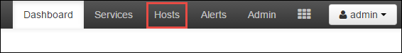
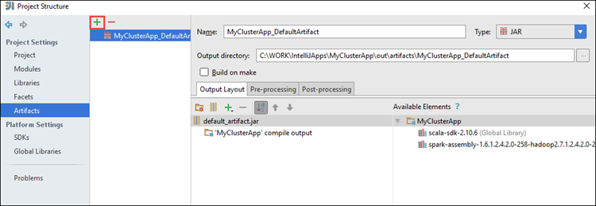
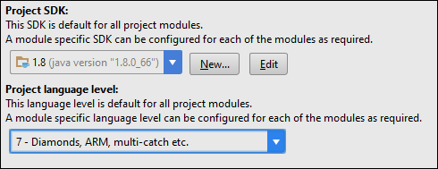
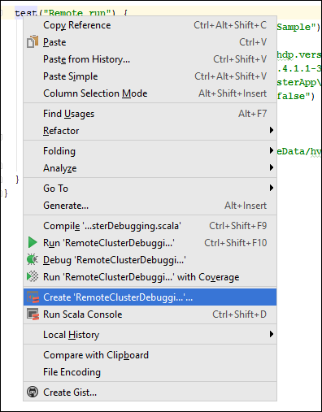
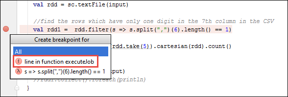
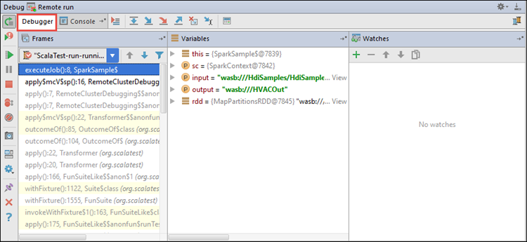

 <properties
    pageTitle="Utilizzare gli strumenti di HDInsight Toolkit di Azure per IntelliJ per il debug remoto delle applicazioni in esecuzione su cluster HDInsight Spark | Microsoft Azure"
    description="Informazioni su come utilizzare gli strumenti di HDInsight Toolkit di Azure per IntelliJ per il debug remoto delle applicazioni in esecuzione su cluster HDInsight Spark."
    services="hdinsight"
    documentationCenter=""
    authors="nitinme"
    manager="jhubbard"
    editor="cgronlun"
    tags="azure-portal"/>

<tags
    ms.service="hdinsight"
    ms.workload="big-data"
    ms.tgt_pltfrm="na"
    ms.devlang="na"
    ms.topic="article"
    ms.date="09/09/2016"
    ms.author="nitinme"/>

# Utilizzare gli strumenti di HDInsight Toolkit di Azure per IntelliJ per il debug delle applicazioni di motori in remoto cluster Linux ad HDInsight

In questo articolo vengono fornite istruzioni dettagliate su come usare gli strumenti di HDInsight di Azure Toolkit per IntelliJ per inviare un processo di motori cluster HDInsight Spark e quindi eseguire il debug in modalità remota dal computer desktop. A tale scopo, è necessario eseguire le operazioni seguenti:

1. Creare una rete virtuale Azure da sito o un punto al sito. La procedura descritta in questo documento presuppone che si utilizza una rete da sito.

2. Creare un cluster di motori di Azure HDInsight che fa parte della rete virtuale Azure da sito.

3. Verificare la connessione tra headnode cluster e il desktop.

4. Creare un'applicazione di Scala in IntelliJ IDEA e configurarlo per il debug remoto.

5. Esecuzione e il debug dell'applicazione.

##Prerequisiti

* Un abbonamento Azure. Vedere [ottenere Azure versione di valutazione gratuita](https://azure.microsoft.com/documentation/videos/get-azure-free-trial-for-testing-hadoop-in-hdinsight/).

* Un cluster ad Apache su HDInsight Linux. Per ulteriori informazioni, vedere [creare Apache i cluster in Azure HDInsight](hdinsight-apache-spark-jupyter-spark-sql.md).
 
* Kit di sviluppo di linguaggio Oracle. È possibile installarlo da [qui](http://www.oracle.com/technetwork/java/javase/downloads/jdk8-downloads-2133151.html).
 
* IntelliJ IDEA. In questo articolo utilizza versione 15.0.1. È possibile installarlo da [qui](https://www.jetbrains.com/idea/download/).
 
* Strumenti di HDInsight in Azure Toolkit per IntelliJ. Sono disponibili strumenti HDInsight per IntelliJ come parte del Toolkit di Azure per IntelliJ. Per istruzioni su come installare il Toolkit di Azure, vedere [installare il Toolkit di Azure per IntelliJ](../azure-toolkit-for-intellij-installation.md).

* Accedere a informazioni sull'abbonamento Azure dall'IntelliJ IDEA. Seguire le istruzioni riportate [di seguito](hdinsight-apache-spark-intellij-tool-plugin.md#log-into-your-azure-subscription).
 
* Durante l'esecuzione dell'applicazione Scala motori per il debug remoto in un computer Windows, potrebbe essere visualizzato un'eccezione, come illustrato in [motori 2356](https://issues.apache.org/jira/browse/SPARK-2356) che si verifica a causa di un WinUtils.exe mancanti in Windows. Per risolvere questo errore, è necessario [scaricare il file eseguibile da questa posizione](http://public-repo-1.hortonworks.com/hdp-win-alpha/winutils.exe) in un percorso ad esempio **C:\WinUtils\bin**. È quindi necessario aggiungere una variabile di ambiente **HADOOP_HOME** e impostare il valore della variabile **C\WinUtils**.

## Passaggio 1: Creare una rete virtuale Azure

Seguire le istruzioni dai collegamenti seguenti per creare una rete virtuale Azure e quindi verificare la connessione tra il desktop e virtuali Azure.

* [Creare un VNet con una connessione VPN da sito portale di Azure](../vpn-gateway/vpn-gateway-howto-site-to-site-resource-manager-portal.md)
* [Creare un VNet con una connessione VPN da sito tramite PowerShell](../vpn-gateway/vpn-gateway-create-site-to-site-rm-powershell.md)
* [Configurare una connessione punto a sito a una rete virtuale tramite PowerShell](../vpn-gateway/vpn-gateway-howto-point-to-site-rm-ps.md)

## Passaggio 2: Creare un cluster HDInsight Spark

È necessario creare anche un cluster ad Apache su Azure HDInsight che fa parte della rete virtuale Azure creato. Usare le informazioni disponibili in [cluster basati su Linux creare in HDInsight](hdinsight-hadoop-provision-linux-clusters.md). Nell'ambito della configurazione facoltativa, selezionare la rete virtuale Azure creata nel passaggio precedente.

## Passaggio 3: Verificare la connessione tra headnode cluster e il desktop

1. È possibile ottenere l'indirizzo IP della headnode. Aprire Ambari UI per il cluster. Da e il grafico, fare clic su **Dashboard**.

    

2. UI Ambari, dall'angolo superiore destro fare clic su **host**.

    

3. Verrà visualizzato un elenco dei nodi zookeeper headnodes e nodi di lavoro. Il headnodes hanno **hn*** prefisso. Fare clic su headnode prima.

    

4. Nella parte inferiore della pagina che si apre, dalla casella di **Riepilogo** , copiare l'indirizzo IP della headnode e il nome host.

    

5. Includere l'indirizzo IP e il nome host della headnode al file **hosts** nel computer da cui si desidera esecuzione e il debug in remoto i processi di motori. In questo modo sarà possibile comunicare con headnode utilizzando l'indirizzo IP, nonché il nome host.

    1. Aprire un blocco note con autorizzazioni elevate. Dal menu file fare clic su **Apri** e quindi passare al percorso del file hosts. In un computer Windows è `C:\Windows\System32\Drivers\etc\hosts`.

    2. Aggiungere quanto segue al file **hosts** .

            # For headnode0
            192.xxx.xx.xx hn0-nitinp
            192.xxx.xx.xx hn0-nitinp.lhwwghjkpqejawpqbwcdyp3.gx.internal.cloudapp.net

            # For headnode1
            192.xxx.xx.xx hn1-nitinp
            192.xxx.xx.xx hn1-nitinp.lhwwghjkpqejawpqbwcdyp3.gx.internal.cloudapp.net

5. Dal computer in cui è connessi alla rete virtuale Azure utilizzato dal cluster HDInsight, verificare che è possibile effettuare il ping entrambe le headnodes utilizzando l'indirizzo IP, nonché il nome host.

6. SSH in headnode cluster usando le istruzioni nella pagina [connessione a un cluster di HDInsight utilizzando SSH](hdinsight-hadoop-linux-use-ssh-windows.md#connect-to-a-linux-based-hdinsight-cluster). Da headnode cluster il ping dell'indirizzo IP del computer desktop. È consigliabile verificare la connettività a entrambi gli indirizzi IP assegnati al computer, uno per la connessione di rete e l'altra per la rete virtuale Azure che il computer sia connesso a.

7. Ripetere i passaggi per le altre headnode anche. 

## Passaggio 4: Creare un'applicazione di motori Scala usando gli strumenti di HDInsight in Azure Toolkit per IntelliJ e configurarlo per il debug remoto

1. Avviare IntelliJ IDEA e creare un nuovo progetto. Nella nuova finestra di dialogo progetto, selezionare le opzioni seguenti e quindi fare clic su **Avanti**.

    

    * Nel riquadro sinistro selezionare **HDInsight**.
    * Nel riquadro destro selezionare **motori in HDInsight (Scala)**.
    * Fare clic su **Avanti**.

2. Nella finestra successiva, immettere i dettagli del progetto.

    * Specificare il nome del progetto e il percorso di progetto.
    * Per **Project SDK**, assicurarsi di specificare una versione di linguaggio maggiore di 7.
    * Per **Scala SDK**, fare clic su **Crea**, fare clic su **Scarica**e quindi selezionare la versione di Scala da utilizzare. **Assicurarsi che non si utilizza versione 2.11.x**. In questo esempio Usa la versione **2.10.6**.

        

    * Per **I SDK**, scaricare e usare il SDK da [qui](http://go.microsoft.com/fwlink/?LinkID=723585&clcid=0x409). È possibile ignorare l'avviso e utilizzare [i Maven archivio](http://mvnrepository.com/search?q=spark) , tuttavia, assicurarsi di avere repository maven destra installato per lo sviluppo di applicazioni ad. (Ad esempio, è necessario assicurarsi che sia parte ad Streaming installata se si usano i flusso; Inoltre, verificare che l'archivio contrassegnato come Scala 2.10 - non utilizzare l'archivio contrassegnato come Scala 2.11.)

        

    * Fare clic su **Fine**.

3. Il progetto ad crea automaticamente un elemento dell'utente. Per visualizzare l'elemento, seguire questa procedura.

    1. Dal menu **File** fare clic su **Struttura del progetto**.
    2. Nella finestra di dialogo **Struttura del progetto** , fare clic su **elementi** per visualizzare l'elemento predefinito creato.

        

    È anche possibile creare il proprio elemento bly facendo clic sulla **+** divieto evidenziato nell'immagine precedente.

4. Nella finestra di dialogo **Struttura del progetto** , fare clic su **progetto**. Se **Project SDK** è impostata su 1.8, verificare che il **livello del linguaggio di progetto** è impostato su **7 - rombi, e così via più catture, ARM,**.

    

4. Aggiungere librerie al progetto. Per aggiungere una raccolta, destro del mouse sul nome del progetto nella struttura del progetto e quindi fare clic su **Apri le impostazioni del modulo**. Nella finestra di dialogo **Struttura del progetto** dal riquadro di sinistra, fare clic su **raccolte**, fare clic sul segno più (+) simbolo e quindi fare clic su **Da Maven**. 

     

    Nella finestra di dialogo **Download Library dal Repository Maven** cercare e aggiungere librerie seguenti.

    * `org.scalatest:scalatest_2.10:2.2.1`
    * `org.apache.hadoop:hadoop-azure:2.7.1`

5. Copia `yarn-site.xml` e `core-site.xml` da headnode cluster e aggiungerlo al progetto. Utilizzare i comandi seguenti per copiare i file. È possibile utilizzare [Cygwin](https://cygwin.com/install.html) per eseguire le operazioni seguenti `scp` comandi per copiare i file da headnodes cluster.

        scp <ssh user name>@<headnode IP address or host name>://etc/hadoop/conf/core-site.xml .

    Perché è già stato aggiunto l'indirizzo IP di cluster headnode e nomi host fo host file sul desktop, è possibile utilizzare i comandi **scp** nel modo seguente.

        scp sshuser@hn0-nitinp:/etc/hadoop/conf/core-site.xml .
        scp sshuser@hn0-nitinp:/etc/hadoop/conf/yarn-site.xml .

    Aggiungere questi file al progetto, copiarli nella cartella **/src** nella struttura del progetto, ad esempio `<your project directory>\src`.

6. Aggiornamento di `core-site.xml` per apportare le modifiche seguenti.

    1. `core-site.xml`include la chiave crittografata all'account di archiviazione associato al cluster. Nel `core-site.xml` aggiunti al progetto, sostituire la chiave crittografata con la chiave di spazio di archiviazione effettivo associati all'account di archiviazione predefinito. Vedere [gestire i tasti di scelta dello spazio di archiviazione](../storage/storage-create-storage-account.md#manage-your-storage-account).

            <property>
                <name>fs.azure.account.key.hdistoragecentral.blob.core.windows.net</name>
                <value>access-key-associated-with-the-account</value>
            </property>

    2. Rimuovere le voci seguenti dal `core-site.xml`.

            <property>
                <name>fs.azure.account.keyprovider.hdistoragecentral.blob.core.windows.net</name>
                <value>org.apache.hadoop.fs.azure.ShellDecryptionKeyProvider</value>
            </property>

            <property>
                <name>fs.azure.shellkeyprovider.script</name>
                <value>/usr/lib/python2.7/dist-packages/hdinsight_common/decrypt.sh</value>
            </property>

            <property>
                <name>net.topology.script.file.name</name>
                <value>/etc/hadoop/conf/topology_script.py</value>
            </property>

    3. Salvare il file.

7. Aggiungere la classe principale per l'applicazione. Da **Gestione progetti**, rapida **src**, scegliere **Nuovo**e quindi fare clic su **Scala classe**.

    

8. Nella finestra di dialogo **Crea nuova Scala classe** specificare un nome per **tipo** selezionare **oggetto**e quindi fare clic su **OK**.

    

9. Nel `MyClusterAppMain.scala` file, incollare il codice seguente. Questo codice crea i motori contesto e il lancio di un `executeJob` dei metodi di `SparkSample` oggetto.

        import org.apache.spark.{SparkConf, SparkContext}

        object SparkSampleMain {
          def main (arg: Array[String]): Unit = {
            val conf = new SparkConf().setAppName("SparkSample")
                                      .set("spark.hadoop.validateOutputSpecs", "false")
            val sc = new SparkContext(conf)
        
            SparkSample.executeJob(sc,
                                   "wasbs:///HdiSamples/HdiSamples/SensorSampleData/hvac/HVAC.csv",
                                   "wasbs:///HVACOut")
          }
        }

10. Ripetere i passaggi 8 e 9 per aggiungere un nuovo oggetto Scala denominato `SparkSample`. Per questa classe aggiungere il codice riportato di seguito. Questo codice legge i dati da HVAC.csv (disponibile in tutti i cluster HDInsight Spark) consente di recuperare le righe che contengono solo una cifra presente nella colonna settima nel file CSV e scrivere output **/HVACOut** all'interno del contenitore di spazio di archiviazione predefinito per il cluster.

        import org.apache.spark.SparkContext
    
        object SparkSample {
          def executeJob (sc: SparkContext, input: String, output: String): Unit = {
            val rdd = sc.textFile(input)
        
            //find the rows which have only one digit in the 7th column in the CSV
            val rdd1 =  rdd.filter(s => s.split(",")(6).length() == 1)
        
            val s = sc.parallelize(rdd.take(5)).cartesian(rdd).count()
            println(s)
        
            rdd1.saveAsTextFile(output)
            //rdd1.collect().foreach(println)
          }
        
        }

11. Ripetere classe passaggi 8 e 9 per aggiungere un nuovo denominata `RemoteClusterDebugging`. Questa classe implementata il framework di test ad utilizzato per il debug di applicazioni. Aggiungere il codice seguente per il `RemoteClusterDebugging` classe.

        import org.apache.spark.{SparkConf, SparkContext}
        import org.scalatest.FunSuite
        
        class RemoteClusterDebugging extends FunSuite {
        
          test("Remote run") {
            val conf = new SparkConf().setAppName("SparkSample")
                                      .setMaster("yarn-client")
                                      .set("spark.yarn.am.extraJavaOptions", "-Dhdp.version=2.4")
                                      .set("spark.yarn.jar", "wasbs:///hdp/apps/2.4.2.0-258/spark-assembly-1.6.1.2.4.2.0-258-hadoop2.7.1.2.4.2.0-258.jar")
                                      .setJars(Seq("""C:\WORK\IntelliJApps\MyClusterApp\out\artifacts\MyClusterApp_DefaultArtifact\default_artifact.jar"""))
                                      .set("spark.hadoop.validateOutputSpecs", "false")
            val sc = new SparkContext(conf)
        
            SparkSample.executeJob(sc,
              "wasbs:///HdiSamples/HdiSamples/SensorSampleData/hvac/HVAC.csv",
              "wasbs:///HVACOut")
          }
        }

    Alcuni aspetti importanti da tenere presente qui:
    
    * Per `.set("spark.yarn.jar", "wasbs:///hdp/apps/2.4.2.0-258/spark-assembly-1.6.1.2.4.2.0-258-hadoop2.7.1.2.4.2.0-258.jar")`, assicurarsi che l'assembly ad VASO è disponibile nell'archivio cluster nel percorso specificato.
    * Per `setJars`, specificare la posizione in cui verrà creato vaso elemento. In genere è `<Your IntelliJ project directory>\out\<project name>_DefaultArtifact\default_artifact.jar`. 

11. Nel `RemoteClusterDebugging` classe destro del mouse su di `test` parole chiave e selezionare **Crea configurazione RemoteClusterDebugging**.

    

12. Nella finestra di dialogo specificare un nome per la configurazione e selezionare il **tipo di Test** come **nome del Test**. Uscire da tutti gli altri valori come predefinito, fare clic su **Applica**e quindi fare clic su **OK**.

    

13. Verrà visualizzata una configurazione **Eseguire Remote** elenco a discesa nella barra dei menu. 

    

## Passaggio 5: Eseguire l'applicazione in modalità di debug

1. Nel progetto IntelliJ IDEA aprire `SparkSample.scala` e creare un punto di interruzione accanto a 'val rdd1'. Nel menu a comparsa per la creazione di un punto di interruzione, selezionare **riga nella funzione executeJob**.

    

2. Fare clic sul pulsante **Debug eseguire** accanto alla configurazione **Eseguire Remote** elenco a discesa per avviare l'applicazione.

    

3. Quando l'esecuzione del programma raggiunge il punto di interruzione, è necessario visualizzare una scheda **Debugger** nel riquadro inferiore.

    

4. Fare clic sui (**+**) sull'icona per aggiungere un controllo, come illustrato nell'immagine seguente. 

    

    In questo caso, poiché l'applicazione si è interrotta prima la variabile `rdd1` è stato creato, usando questo corso è possibile vedere quali sono le prime 5 righe nella variabile `rdd`. Premere **INVIO**.

    

    Viene visualizzato nell'immagine precedente è in fase di esecuzione è possibile eseguire una query terrabytes dei dati e debug come l'avanzamento dell'applicazione. Ad esempio, in output mostrato nell'immagine precedente, è possibile vedere che la prima riga di output è un'intestazione. In base a questa operazione, è possibile modificare il codice dell'applicazione per ignorare la riga di intestazione, se necessario.

5. È ora possibile fare clic sull'icona del **Programma di curriculum** per procedere con eseguire l'applicazione.

    

6. Se l'applicazione viene completata correttamente, verrà visualizzato un output simile al seguente.

    

 

## Vedere anche

* [Panoramica: Apache motori su Azure HDInsight](hdinsight-apache-spark-overview.md)

### Scenari

* [Motori con BI: eseguire l'analisi dei dati interattive tramite motori in HDInsight con strumenti di Business Intelligence](hdinsight-apache-spark-use-bi-tools.md)

* [Motori di apprendimento: usare i in HDInsight per l'analisi temperatura predefiniti utilizzando dati HVAC](hdinsight-apache-spark-ipython-notebook-machine-learning.md)

* [Motori di apprendimento: usare i in HDInsight per prevedere i risultati del controllo alimentari](hdinsight-apache-spark-machine-learning-mllib-ipython.md)

* [Motori Streaming: Usare motori in HDInsight per la creazione di applicazioni di trasmissione in tempo reale](hdinsight-apache-spark-eventhub-streaming.md)

* [Analisi dei log sito Web tramite motori in HDInsight](hdinsight-apache-spark-custom-library-website-log-analysis.md)

### Creare ed eseguire applicazioni

* [Creare un'applicazione autonoma utilizza Scala](hdinsight-apache-spark-create-standalone-application.md)

* [Eseguire processi in modalità remota in un cluster di motori tramite inserire il](hdinsight-apache-spark-livy-rest-interface.md)

### Strumenti ed estensioni

* [Utilizzare gli strumenti di HDInsight Toolkit di Azure per IntelliJ per creare e inviare Scala ad applicazioni](hdinsight-apache-spark-intellij-tool-plugin.md)

* [Utilizzare gli strumenti di HDInsight Toolkit di Azure per Eclisse per creare ad applicazioni](hdinsight-apache-spark-eclipse-tool-plugin.md)

* [Usare i blocchi appunti Zeppelin con un cluster di motori su HDInsight](hdinsight-apache-spark-use-zeppelin-notebook.md)

* [Disponibile per blocco appunti Jupyter cluster motori per HDInsight. x](hdinsight-apache-spark-jupyter-notebook-kernels.md)

* [Utilizzare i pacchetti esterni con i blocchi appunti Jupyter](hdinsight-apache-spark-jupyter-notebook-use-external-packages.md)

* [Installare Jupyter nel computer e connettersi a un cluster HDInsight Spark](hdinsight-apache-spark-jupyter-notebook-install-locally.md)

### Gestire le risorse

* [Gestire le risorse per cluster ad Apache in Azure HDInsight](hdinsight-apache-spark-resource-manager.md)

* [Tenere traccia e debug processi in esecuzione in un cluster di motori di Apache in HDInsight](hdinsight-apache-spark-job-debugging.md)
