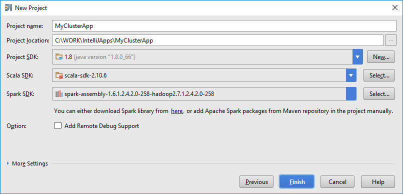
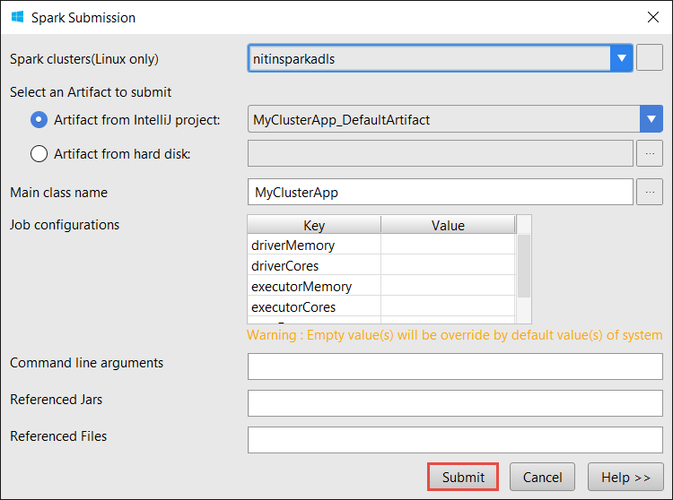
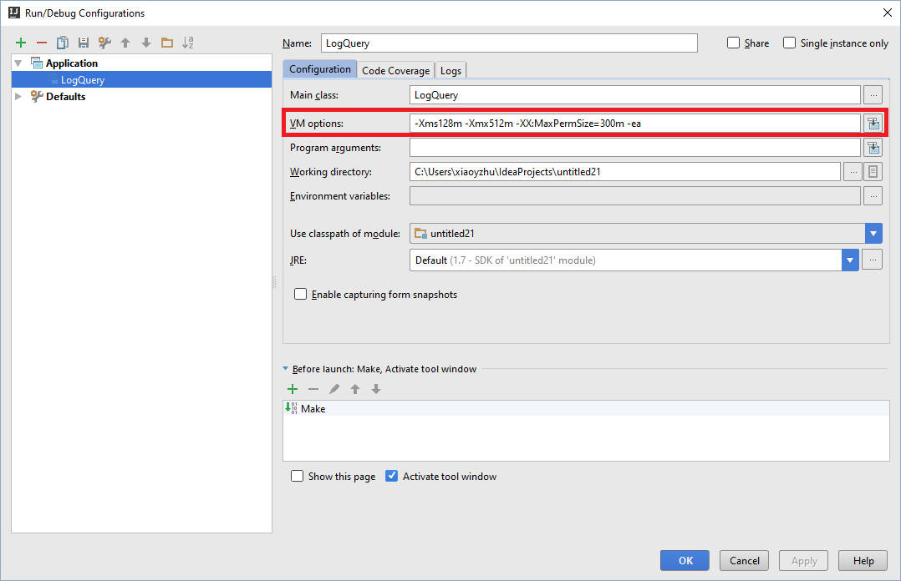

 <properties
    pageTitle="Creare applicazioni ad Scala usando gli strumenti di HDInsight in Azure Toolkit per IntelliJ | Microsoft Azure"
    description="Informazioni su come creare un'applicazione di motori per l'esecuzione su cluster HDInsight Spark autonoma."
    services="hdinsight"
    documentationCenter=""
    authors="nitinme"
    manager="jhubbard"
    editor="cgronlun"
    tags="azure-portal"/>

<tags
    ms.service="hdinsight"
    ms.workload="big-data"
    ms.tgt_pltfrm="na"
    ms.devlang="na"
    ms.topic="article"
    ms.date="09/09/2016"
    ms.author="nitinme"/>

# Utilizzare gli strumenti di HDInsight Toolkit di Azure per IntelliJ per creare ad applicazioni per cluster Linux ad HDInsight

In questo articolo vengono fornite istruzioni dettagliate sullo sviluppo di applicazioni ad scritte in Scala e l'invio di essa per una HDInsight Spark cluster usando gli strumenti di HDInsight in Azure Toolkit per IntelliJ.  È possibile utilizzare gli strumenti in vari modi:

* Per sviluppare e inviare una richiesta di Scala Spark in un cluster HDInsight Spark
* Per accedere alle risorse cluster di motori di Azure HDInsight
* Sviluppare ed eseguire un'applicazione di Scala Spark localmente

È inoltre possibile seguire un video [di seguito](https://mix.office.com/watch/1nqkqjt5xonza) per iniziare.

>[AZURE.IMPORTANT] Questo strumento può essere utilizzato per creare e inviare applicazioni solo per un cluster HDInsight Spark su Linux.

##Prerequisiti

* Un abbonamento Azure. Vedere [ottenere Azure versione di valutazione gratuita](https://azure.microsoft.com/documentation/videos/get-azure-free-trial-for-testing-hadoop-in-hdinsight/).

* Un cluster ad Apache su HDInsight Linux. Per ulteriori informazioni, vedere [creare Apache i cluster in Azure HDInsight](hdinsight-apache-spark-jupyter-spark-sql.md).

* Kit di sviluppo di linguaggio Oracle. È possibile installarlo da [qui](http://www.oracle.com/technetwork/java/javase/downloads/jdk8-downloads-2133151.html).

* IntelliJ IDEA. In questo articolo utilizza versione 15.0.1. È possibile installarlo da [qui](https://www.jetbrains.com/idea/download/).

## Installare gli strumenti di HDInsight in Azure Toolkit per IntelliJ

HDInsight degli strumenti per IntelliJ è disponibile come parte del Toolkit di Azure per IntelliJ. Per istruzioni su come installare il Toolkit di Azure, vedere [installare il Toolkit di Azure per IntelliJ](../azure-toolkit-for-intellij-installation.md).

## Accedere all'abbonamento Azure

1. Avviare l'IDE IntelliJ e aprire Esplora aree di Azure. Dal menu **Visualizza** nell'IDE, fare clic su **Finestre** e quindi fare clic su **Esplora Azure**.

    

2. Destro nodo **Azure** in **Esplora risorse Azure**e quindi fare clic su **Gestione delle sottoscrizioni**.

3. Nella finestra di dialogo **Gestione delle sottoscrizioni** fare clic su **Accedi** e immettere le credenziali di Azure.

    

4. Dopo avere eseguito, nella finestra di dialogo **Gestione delle sottoscrizioni** Elenca tutte le sottoscrizioni Azure associate alle credenziali. Fare clic su **Chiudi** nella finestra di dialogo.

5. Nella scheda **Esplora Azure** espandere **HDInsight** per visualizzare i cluster HDInsight Spark in abbonamento.

    

6. È possibile espandere ulteriormente un nodo nome per vedere le risorse (ad esempio gli account di archiviazione) associate al cluster.

    

## Eseguire un'applicazione di motori Scala in un cluster HDInsight Spark

1. Avviare IntelliJ IDEA e creare un nuovo progetto. Nella nuova finestra di dialogo progetto, selezionare le opzioni seguenti e quindi fare clic su **Avanti**.

    

    * Nel riquadro sinistro selezionare **HDInsight**.
    * Nel riquadro destro selezionare **motori in HDInsight (Scala)**.
    * Fare clic su **Avanti**.

2. Nella finestra successiva, immettere i dettagli del progetto.

    * Specificare il nome del progetto e il percorso di progetto.
    * Per **Project SDK**, assicurarsi di specificare una versione di linguaggio maggiore di 7.
    * Per **Scala SDK**, fare clic su **Crea**, fare clic su **Scarica**e quindi selezionare la versione di Scala da utilizzare. **Assicurarsi che non si utilizza versione 2.11.x**. In questo esempio Usa la versione **2.10.6**.

        

    * Per **I SDK**, scaricare e usare il SDK da [qui](http://go.microsoft.com/fwlink/?LinkID=723585&clcid=0x409). È possibile ignorare l'avviso e utilizzare [i Maven archivio](http://mvnrepository.com/search?q=spark) , tuttavia, assicurarsi di avere repository maven destra installato per lo sviluppo di applicazioni ad. (Ad esempio, è necessario assicurarsi che sia parte ad Streaming installata se si usano i flusso; Inoltre, verificare che l'archivio contrassegnato come Scala 2.10 - non utilizzare l'archivio contrassegnato come Scala 2.11.)

        

    * Fare clic su **Fine**.

3. Il progetto ad crea automaticamente un elemento dell'utente. Per visualizzare l'elemento, seguire questa procedura.

    1. Dal menu **File** fare clic su **Struttura del progetto**.
    2. Nella finestra di dialogo **Struttura del progetto** , fare clic su **elementi** per visualizzare l'elemento predefinito creato.

        

    È anche possibile creare il proprio elemento bly facendo clic sulla **+** divieto evidenziato nell'immagine precedente.

4. Nella finestra di dialogo **Struttura del progetto** , fare clic su **progetto**. Se **Project SDK** è impostata su 1.8, verificare che il **livello del linguaggio di progetto** è impostato su **7 - rombi, e così via più catture, ARM,**.

    

5. Aggiungere codice sorgente dell'applicazione.

    1. Da **Gestione progetti**, rapida **src**, scegliere **Nuovo**e quindi fare clic su **Scala classe**.

        

    2. Nella finestra di dialogo **Crea nuova Scala classe** specificare un nome per **tipo** selezionare **oggetto**e quindi fare clic su **OK**.

        

    3. Incollare il codice seguente nel file **MyClusterApp.scala** . Questo codice legge i dati da HVAC.csv (disponibile in tutti i cluster HDInsight Spark) consente di recuperare le righe che contengono solo una cifra presente nella colonna dodicesima nel file CSV e scrivere output **/HVACOut** all'interno del contenitore di spazio di archiviazione predefinito per il cluster.

            import org.apache.spark.SparkConf
            import org.apache.spark.SparkContext

            object MyClusterApp{
              def main (arg: Array[String]): Unit = {
                val conf = new SparkConf().setAppName("MyClusterApp")
                val sc = new SparkContext(conf)

                val rdd = sc.textFile("wasbs:///HdiSamples/HdiSamples/SensorSampleData/hvac/HVAC.csv")

                //find the rows which have only one digit in the 7th column in the CSV
                val rdd1 =  rdd.filter(s => s.split(",")(6).length() == 1)

                rdd1.saveAsTextFile("wasbs:///HVACOut")
              }

            }

5. Eseguire l'applicazione in un cluster HDInsight Spark.

    1. Da **Gestione progetti**, destro del mouse sul nome del progetto e quindi selezionare **Invia ad un'applicazione di HDInsight**.

        

    2. Verrà richiesto di immettere le credenziali di Azure abbonamento. Nella finestra di dialogo **Invio ad** fornire i valori seguenti.

        * Per i **cluster di motori (solo Linux)**, selezionare il cluster HDInsight Spark in cui si vuole eseguire l'applicazione.

        * È necessario selezionare un elemento dal progetto IntelliJ o selezionarne uno sul disco rigido.

        * Con la casella di testo **nome della classe principale** , fare clic sui puntini di sospensione ( ), selezionare la classe principale nel codice sorgente dell'applicazione e quindi fare clic su **OK**.

            

        * Poiché il codice dell'applicazione in questo esempio non richiede gli argomenti della riga di comando o riferimento a contenitori o file, è possibile lasciare vuoto rimanenti caselle di testo.

        * Dopo avere fornito tutti gli input, nella finestra di dialogo sarà simile al seguente.

            

        * Fare clic su **Invia**.

    3. Scheda **Presentazione motori** nella parte inferiore della finestra deve iniziare la visualizzazione dello stato di avanzamento. È anche possibile interrompere l'applicazione fare clic sul pulsante rosso nella finestra "Motori invio".

        

    Nella sezione successiva si imparerà a accedere al processo di output usando gli strumenti di HDInsight in Azure Toolkit per IntelliJ.

## Accedere e gestire i cluster HDInsight Spark usando gli strumenti di HDInsight in Azure Toolkit per IntelliJ

È possibile eseguire diverse operazioni con gli strumenti di HDInsight che fanno parte di Azure Toolkit per IntelliJ.

### Accedere alla visualizzazione di processo direttamente dagli strumenti HDInsight

1. Da **Esplora Azure**, espandere **HDInsight**, espandere il nome di cluster motori e quindi fare clic su **processi**.

2. Nel riquadro destro della scheda **Visualizza processo motori** consente di visualizzare tutte le applicazioni eseguite nel cluster. Fare clic sul nome di applicazione per la quale si desidera visualizzare ulteriori dettagli.

    

3. Le caselle di **Messaggio di errore**, **Output processo**, **Inserire il processo registri**e **I Driver registri** vengono inserite in base all'applicazione che si seleziona.

4. Facendo clic sui pulsanti rispettivi nella parte superiore dello schermo, è possibile aprire l' **Interfaccia utente di cronologia motori** e **Dell'interfaccia utente filati** (a livello di applicazione).

### Accedere al Server di cronologia motori

1. Da **Esplora Azure**, espandere **HDInsight**, destro del mouse sul proprio nome di cluster motori e quindi selezionare **Apri dell'interfaccia utente della cronologia motori**. Quando richiesto, immettere le credenziali di amministratore per il cluster. È necessario specificare questi durante il provisioning del cluster.

2. Nel dashboard motori cronologia Server, è possibile cercare l'applicazione è sufficiente termine in esecuzione con il nome dell'applicazione. Nel codice, impostare il nome dell'applicazione utilizzando `val conf = new SparkConf().setAppName("MyClusterApp")`. Di conseguenza, il nome dell'applicazione di motori è stato **MyClusterApp**.

### Avviare il portale Ambari

Da **Esplora Azure**, espandere **HDInsight**, destro del mouse sul proprio nome di cluster motori e quindi selezionare **Apri portale di gestione di Cluster (Ambari)**. Quando richiesto, immettere le credenziali di amministratore per il cluster. È necessario specificare questi durante il provisioning del cluster.

### Gestire le sottoscrizioni di Azure

Per impostazione predefinita, gli strumenti di HDInsight sono elencati i cluster di motori da tutte le sottoscrizioni Azure. Se necessario, è possibile specificare le sottoscrizioni per il quale si desidera accedere al cluster. Da **Esplora Azure**, destro il nodo principale di **Azure** e quindi fare clic su **Gestione delle sottoscrizioni**. Nella finestra di dialogo deselezionare le caselle di controllo con l'abbonamento a cui non si desidera accedere e quindi fare clic su **Chiudi**. È possibile anche fare clic su **Disconnetti** se si vuole disconnettersi dall'abbonamento Azure.

## Eseguire un'applicazione di motori Scala localmente

È possibile utilizzare gli strumenti di HDInsight in Azure Toolkit per IntelliJ per eseguire le applicazioni di motori Scala localmente sulla workstation. In genere, tali applicazioni non necessario l'accesso alle risorse cluster, ad esempio contenitore dello spazio di archiviazione e possono essere eseguite e testate in locale.

### Prerequisito

Durante l'esecuzione dell'applicazione ad Scala locale in un computer Windows, potrebbe essere visualizzato un'eccezione, come illustrato in [motori 2356](https://issues.apache.org/jira/browse/SPARK-2356) che si verifica a causa di un WinUtils.exe mancanti in Windows. Per risolvere questo errore, è necessario [scaricare il file eseguibile da questa posizione](http://public-repo-1.hortonworks.com/hdp-win-alpha/winutils.exe) in un percorso ad esempio **C:\WinUtils\bin**. È quindi necessario aggiungere una variabile di ambiente **HADOOP_HOME** e impostare il valore della variabile **C\WinUtils**.

### Eseguire un'applicazione di motori Scala locale  

1. Avviare IntelliJ IDEA e creare un nuovo progetto. Nella nuova finestra di dialogo progetto, selezionare le opzioni seguenti e quindi fare clic su **Avanti**.

    

    * Nel riquadro sinistro selezionare **HDInsight**.
    * Nel riquadro destro selezionare **motori HDInsight locale eseguire campione (Scala)**.
    * Fare clic su **Avanti**.

2. Nella finestra successiva, immettere i dettagli del progetto.

    * Specificare il nome del progetto e il percorso di progetto.
    * Per **Project SDK**, assicurarsi di specificare una versione di linguaggio maggiore di 7.
    * Per **Scala SDK**, fare clic su **Crea**, fare clic su **Scarica**e quindi selezionare la versione di Scala da utilizzare. **Assicurarsi che non si utilizza versione 2.11.x**. In questo esempio Usa la versione **2.10.6**.

        

    * Per **I SDK**, scaricare e usare il SDK da [qui](http://go.microsoft.com/fwlink/?LinkID=723585&clcid=0x409). È possibile ignorare l'avviso e utilizzare [i Maven archivio](http://mvnrepository.com/search?q=spark) , tuttavia, assicurarsi di avere repository maven destra installato per lo sviluppo di applicazioni ad. (Ad esempio, è necessario assicurarsi che sia parte ad Streaming installata se si usano i flusso; Inoltre, verificare che l'archivio contrassegnato come Scala 2.10 - non utilizzare l'archivio contrassegnato come Scala 2.11.)

        

    * Fare clic su **Fine**.

3. Il modello aggiunge un codice di esempio (**LogQuery**) nella cartella **src** che è possibile eseguire nel computer in uso.

    

4.  Fare clic con il pulsante destro sull'applicazione **LogQuery** e quindi fare clic su **"Esegui 'LogQuery'"**. Verrà visualizzato un risultato simile nella scheda **eseguire** nella parte inferiore.

    

## Convertire le applicazioni esistenti IntelliJ IDEA usare gli strumenti di HDInsight in Azure Toolkit per IntelliJ

È inoltre possibile convertire le applicazioni di motori Scala esistenti create in IDEA IntelliJ incompatibile con gli strumenti di HDInsight di Azure Toolkit per IntelliJ. In questo modo sarà possibile usare lo strumento per inviare le applicazioni a un cluster HDInsight Spark. È possibile farlo eseguendo la procedura seguente:

1. Per una Scala di motori esistente viene creata utilizzando IDEA IntelliJ, aprire il file .iml associato.
2. Al livello radice, verrà visualizzato un elemento di **modulo** alla seguente:

        <module org.jetbrains.idea.maven.project.MavenProjectsManager.isMavenModule="true" type="JAVA_MODULE" version="4">

3. Modificare l'elemento da aggiungere `UniqueKey="HDInsightTool"` in modo che l'elemento **modulo** simile al seguente:

        <module org.jetbrains.idea.maven.project.MavenProjectsManager.isMavenModule="true" type="JAVA_MODULE" version="4" UniqueKey="HDInsightTool">

4. Salvare le modifiche. L'applicazione dovrebbe ora essere compatibile con gli strumenti di HDInsight di Azure Toolkit per IntelliJ. È possibile verificarlo facendo clic sul nome del progetto in Esplora aree di progetto. Menu a comparsa ora deve avere la possibilità di **Inviare ad un'applicazione di HDInsight**.

## Risoluzione dei problemi

### Errore "Utilizzare una dimensione maggiore per heap" in esecuzione locale

Motori 1.6, se si utilizza un SDK Java versione a 32 bit durante l'esecuzione locale, è possibile riscontrare errori seguenti:

    Exception in thread "main" java.lang.IllegalArgumentException: System memory 259522560 must be at least 4.718592E8. Please use a larger heap size.
        at org.apache.spark.memory.UnifiedMemoryManager$.getMaxMemory(UnifiedMemoryManager.scala:193)
        at org.apache.spark.memory.UnifiedMemoryManager$.apply(UnifiedMemoryManager.scala:175)
        at org.apache.spark.SparkEnv$.create(SparkEnv.scala:354)
        at org.apache.spark.SparkEnv$.createDriverEnv(SparkEnv.scala:193)
        at org.apache.spark.SparkContext.createSparkEnv(SparkContext.scala:288)
        at org.apache.spark.SparkContext.<init>(SparkContext.scala:457)
        at LogQuery$.main(LogQuery.scala:53)
        at LogQuery.main(LogQuery.scala)
        at sun.reflect.NativeMethodAccessorImpl.invoke0(Native Method)
        at sun.reflect.NativeMethodAccessorImpl.invoke(NativeMethodAccessorImpl.java:57)
        at sun.reflect.DelegatingMethodAccessorImpl.invoke(DelegatingMethodAccessorImpl.java:43)
        at java.lang.reflect.Method.invoke(Method.java:606)
        at com.intellij.rt.execution.application.AppMain.main(AppMain.java:144)

In questo modo la dimensione dell'heap non è sufficiente per motori per l'esecuzione, poiché ad richiede almeno 471MB (è possibile ottenere ulteriori dettagli da [motori 12081](https://issues.apache.org/jira/browse/SPARK-12081) se si vuole). Una soluzione semplice consiste nell'usare un linguaggio SDK a 64 bit. È anche possibile modificare le impostazioni della JVM IntelliJ aggiungendo le opzioni seguenti:

    -Xms128m -Xmx512m -XX:MaxPermSize=300m -ea

## Problemi noti e commenti e suggerimenti

Attualmente visualizzati ad restituisce direttamente non è supportata e stiamo lavorando a cui.

Se si dispone dei suggerimenti o feedback o in caso di problemi quando si usa questo strumento, è possibile eliminare Contattaci tramite posta elettronica in hdivstool in microsoft punto com.

## Vedere anche

* [Panoramica: Apache motori su Azure HDInsight](hdinsight-apache-spark-overview.md)

### Scenari

* [Motori con BI: eseguire l'analisi dei dati interattive tramite motori in HDInsight con strumenti di Business Intelligence](hdinsight-apache-spark-use-bi-tools.md)

* [Motori di apprendimento: usare i in HDInsight per l'analisi temperatura predefiniti utilizzando dati HVAC](hdinsight-apache-spark-ipython-notebook-machine-learning.md)

* [Motori di apprendimento: usare i in HDInsight per prevedere i risultati del controllo alimentari](hdinsight-apache-spark-machine-learning-mllib-ipython.md)

* [Motori Streaming: Usare motori in HDInsight per la creazione di applicazioni di trasmissione in tempo reale](hdinsight-apache-spark-eventhub-streaming.md)

* [Analisi dei log sito Web tramite motori in HDInsight](hdinsight-apache-spark-custom-library-website-log-analysis.md)

### Creare ed eseguire applicazioni

* [Creare un'applicazione autonoma utilizza Scala](hdinsight-apache-spark-create-standalone-application.md)

* [Eseguire processi in modalità remota in un cluster di motori tramite inserire il](hdinsight-apache-spark-livy-rest-interface.md)

### Strumenti ed estensioni

* [Usare gli strumenti HDInsight Toolkit di Azure per IntelliJ eseguire il debug riguardo applicazioni in modalità remota](hdinsight-apache-spark-intellij-tool-plugin-debug-jobs-remotely.md)

* [Utilizzare gli strumenti di HDInsight Toolkit di Azure per Eclisse per creare ad applicazioni](hdinsight-apache-spark-eclipse-tool-plugin.md)

* [Usare i blocchi appunti Zeppelin con un cluster di motori su HDInsight](hdinsight-apache-spark-use-zeppelin-notebook.md)

* [Disponibile per blocco appunti Jupyter cluster motori per HDInsight. x](hdinsight-apache-spark-jupyter-notebook-kernels.md)

* [Utilizzare i pacchetti esterni con i blocchi appunti Jupyter](hdinsight-apache-spark-jupyter-notebook-use-external-packages.md)

* [Installare Jupyter nel computer e connettersi a un cluster HDInsight Spark](hdinsight-apache-spark-jupyter-notebook-install-locally.md)

### Gestire le risorse

* [Gestire le risorse per cluster ad Apache in Azure HDInsight](hdinsight-apache-spark-resource-manager.md)

* [Tenere traccia e debug processi in esecuzione in un cluster di motori di Apache in HDInsight](hdinsight-apache-spark-job-debugging.md)
