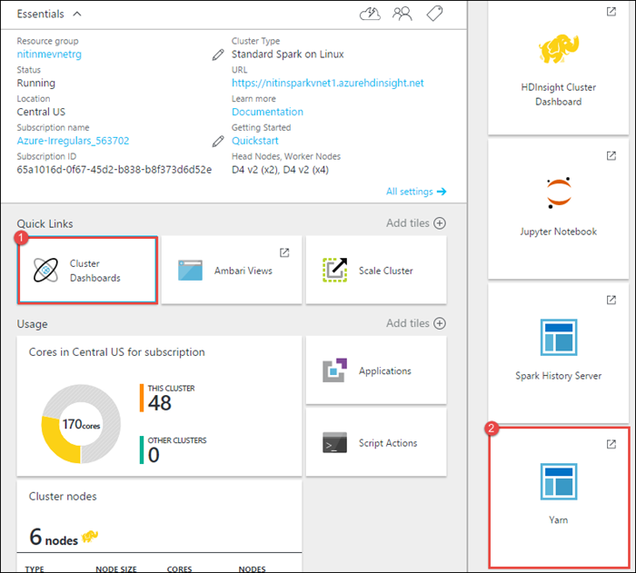
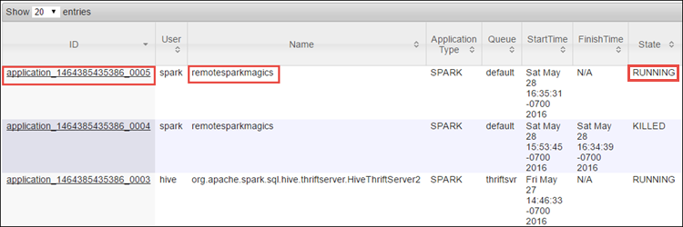
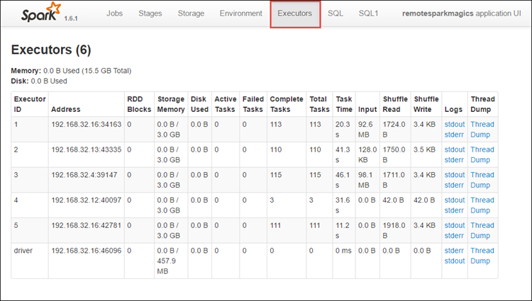
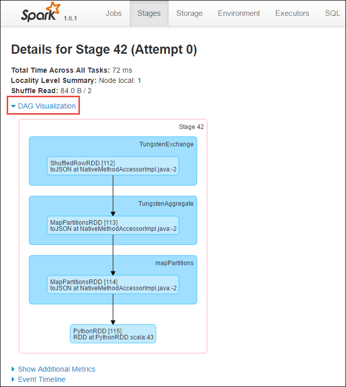

<properties 
    pageTitle="Rilevamento e debug processi in esecuzione in Apache i cluster in HDInsight | Microsoft Azure" 
    description="Usare filati dell'interfaccia utente, ad dell'interfaccia utente e cronologia i server per rilevare ed eseguire il debug di processi in esecuzione in un cluster di motori di Azure HDInsight" 
    services="hdinsight" 
    documentationCenter="" 
    authors="nitinme" 
    manager="jhubbard" 
    editor="cgronlun"
    tags="azure-portal"/>

<tags 
    ms.service="hdinsight" 
    ms.workload="big-data" 
    ms.tgt_pltfrm="na" 
    ms.devlang="na" 
    ms.topic="article" 
    ms.date="08/25/2016" 
    ms.author="nitinme"/>

# Tenere traccia e debug processi in esecuzione in Apache i cluster in HDInsight Linux

In questo articolo si imparerà a tenere traccia ed eseguire il debug processi motori utilizzando l'interfaccia utente filati, motori dell'interfaccia utente e il Server di cronologia motori. In questo articolo, iniziare un processo di motori utilizzando un blocco appunti disponibile con cluster ad **lavorare apprendimento: stima analisi dati di ispezione alimentari usando MLLib**. È possibile utilizzare la procedura seguente per tenere traccia di un'applicazione che inviato tramite qualsiasi altro approccio, ad esempio, **inviare i**.

##Prerequisiti

È necessario disporre le operazioni seguenti:

- Un abbonamento Azure. Vedere [ottenere Azure versione di valutazione gratuita](https://azure.microsoft.com/documentation/videos/get-azure-free-trial-for-testing-hadoop-in-hdinsight/).
- Un cluster ad Apache su HDInsight Linux. Per ulteriori informazioni, vedere [creare Apache i cluster in Azure HDInsight](hdinsight-apache-spark-jupyter-spark-sql.md).
- Si devono ha avviato il blocco appunti, **[lavorare apprendimento: stima analisi dati di ispezione alimentari usando MLLib](hdinsight-apache-spark-machine-learning-mllib-ipython.md)**. Per istruzioni su come eseguire il blocco appunti, eseguire il collegamento.  

## Tenere traccia di un'applicazione nell'interfaccia utente di filati

1. Avviare l'interfaccia utente filati. Da e il cluster, fare clic su **Dashboard Cluster**e quindi fare clic su **filati**.

    

    >[AZURE.TIP] In alternativa, è anche possibile avviare l'interfaccia utente filati dal UI Ambari. Per avviare UI Ambari, da e il grafico, fare clic su **Dashboard Cluster**e quindi fare clic su **Dashboard Cluster HDInsight**. Da UI Ambari fare clic su **filati**, fare clic su **Collegamenti rapidi**, fare clic su Gestione risorse attivo e quindi fare clic su **ResourceManager dell'interfaccia utente**.  

3. Perché è stato avviato il processo di motori utilizzando i blocchi appunti Jupyter, l'applicazione ha il nome **remotesparkmagics** (si tratta del nome per tutte le applicazioni che vengono avviate dai blocchi appunti). Fare clic su ID dell'applicazione in base al nome dell'applicazione per ottenere ulteriori informazioni sul processo. Verrà avviata la visualizzazione dell'applicazione.

    

    Per tali applicazioni avviate dai blocchi appunti Jupyter, lo stato è sempre **in esecuzione** finché non viene chiuso il blocco appunti.

4. Dalla visualizzazione dell'applicazione è possibile eseguire il drill down per scoprire i contenitori associato con l'applicazione e i log (stdout/stderr). È anche possibile avviare l'interfaccia utente ad facendo clic sul collegamento corrispondente all' **URL di verifica**, come illustrato di seguito. 

    

## Tenere traccia di un'applicazione nell'interfaccia utente di motori

Nell'interfaccia utente ad è possibile drill-down i processi di motori generate dall'applicazione iniziato in precedenza.

1. Per avviare l'interfaccia utente ad, dalla visualizzazione dell'applicazione, fare clic sul collegamento in base all' **URL di verifica**, come illustrato nella schermata sopra. È possibile vedere tutti i processi di motori che vengono avviati dall'applicazione in esecuzione nel blocco appunti Jupyter.

    

2. Fare clic sulla scheda **esecutori** per visualizzare informazioni di spazio di archiviazione e dell'elaborazione di ogni esecutore. È anche possibile recuperare dello stack facendo clic sul collegamento **Thread Scarica** .

    
 
3. Fare clic sulla scheda **fasi** per visualizzare le fasi associate all'applicazione.

    

    Ogni fase può avere più attività per il quale è possibile visualizzare le statistiche di esecuzione, come illustrato di seguito.

     

4. Nella pagina dettagli secondario, è possibile avviare DAG visualizzazione. Espandere il collegamento **Visualizzazione DAG** nella parte superiore della pagina, come illustrato di seguito.

    

    DAG o un grafico Aclyic diretta rappresenta le diverse fasi dell'applicazione. Ogni casella blu nel grafico rappresenta un'operazione di motori richiamata dall'applicazione.

5. Nella pagina dettagli secondario, è anche possibile avviare la visualizzazione sequenza temporale dell'applicazione. Espandere il collegamento **Evento sequenza temporale** nella parte superiore della pagina, come illustrato di seguito.

    

    Consente di visualizzare gli eventi ad sotto forma di una sequenza temporale. La visualizzazione sequenza temporale è disponibile in tre livelli, in processi all'interno di un processo e all'interno di una fase. Immagine precedente acquisisce la visualizzazione sequenza temporale per una determinata fase.

    >[AZURE.TIP] Se si seleziona la casella di controllo **Abilita zoom** , è possibile scorrere a sinistra e a destra nella visualizzazione sequenza temporale.

6. Altre schede nell'interfaccia utente ad informazioni utili sulle anche l'istanza di motori.

    * Scheda archiviazione - se l'applicazione crea un RDDs, sono disponibili informazioni su quelle nella scheda archiviazione.
    * Scheda ambiente - questa scheda offre molte informazioni utili sull'istanza di motori ad esempio il 
        * Versione di scala
        * Registro eventi directory associato al cluster
        * Numero di core esecutore per l'applicazione
        * E così via.

## Trovare informazioni sui processi completate utilizzando il Server di cronologia motori

Al termine di un processo, le informazioni sul processo di viene mantenute nel Server cronologia motori.

1. Per avviare il Server di cronologia motori da e il cluster, fare clic su **Dashboard Cluster**e quindi fare clic su **Motori cronologia Server**.

    

    >[AZURE.TIP] In alternativa, è anche possibile avviare l'interfaccia utente Server cronologia di motori da UI Ambari. Per avviare UI Ambari, da e il grafico, fare clic su **Dashboard Cluster**e quindi fare clic su **Dashboard Cluster HDInsight**. Da UI Ambari fare clic su **motori**e quindi fare clic su **Interfaccia utente di Server cronologia i** **Collegamenti rapidi**.

2. Si vedranno tutte le applicazioni completate elencate. Fare clic su un ID applicazione di eseguire il drill-in un'applicazione per altre informazioni.

    
    

## Vedere anche

* [Panoramica: Apache motori su Azure HDInsight](hdinsight-apache-spark-overview.md)

### Scenari

* [Motori con BI: eseguire l'analisi dei dati interattive tramite motori in HDInsight con strumenti di Business Intelligence](hdinsight-apache-spark-use-bi-tools.md)

* [Motori di apprendimento: usare i in HDInsight per l'analisi temperatura predefiniti utilizzando dati HVAC](hdinsight-apache-spark-ipython-notebook-machine-learning.md)

* [Motori di apprendimento: usare i in HDInsight per prevedere i risultati del controllo alimentari](hdinsight-apache-spark-machine-learning-mllib-ipython.md)

* [Motori Streaming: Usare motori in HDInsight per la creazione di applicazioni di trasmissione in tempo reale](hdinsight-apache-spark-eventhub-streaming.md)

* [Analisi dei log sito Web tramite motori in HDInsight](hdinsight-apache-spark-custom-library-website-log-analysis.md)

### Creare ed eseguire applicazioni

* [Creare un'applicazione autonoma utilizza Scala](hdinsight-apache-spark-create-standalone-application.md)

* [Eseguire processi in modalità remota in un cluster di motori tramite inserire il](hdinsight-apache-spark-livy-rest-interface.md)

### Strumenti ed estensioni

* [Plug-in strumenti di HDInsight per IntelliJ IDEA consente di creare e inviare Scala ad applicazioni](hdinsight-apache-spark-intellij-tool-plugin.md)

* [Utilizzare plug-in strumenti di HDInsight per IntelliJ IDEA il debug delle applicazioni di motori in modalità remota](hdinsight-apache-spark-intellij-tool-plugin-debug-jobs-remotely.md)

* [Usare i blocchi appunti Zeppelin con un cluster di motori su HDInsight](hdinsight-apache-spark-use-zeppelin-notebook.md)

* [Disponibile per blocco appunti Jupyter cluster motori per HDInsight. x](hdinsight-apache-spark-jupyter-notebook-kernels.md)

* [Utilizzare i pacchetti esterni con i blocchi appunti Jupyter](hdinsight-apache-spark-jupyter-notebook-use-external-packages.md)

* [Installare Jupyter nel computer e connettersi a un cluster HDInsight Spark](hdinsight-apache-spark-jupyter-notebook-install-locally.md)

### Gestire le risorse

* [Gestire le risorse per cluster ad Apache in Azure HDInsight](hdinsight-apache-spark-resource-manager.md)
