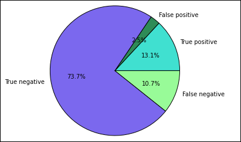

<properties 
    pageTitle="Applicazioni di apprendimento computer su HDInsight mediante ad Apache | Microsoft Azure" 
    description="Istruzioni dettagliate su come utilizzare i blocchi appunti con i Apache risorse computer delle applicazioni" 
    services="hdinsight" 
    documentationCenter="" 
    authors="nitinme" 
    manager="jhubbard" 
    editor="cgronlun"
    tags="azure-portal"/>

<tags 
    ms.service="hdinsight" 
    ms.workload="big-data" 
    ms.tgt_pltfrm="na" 
    ms.devlang="na" 
    ms.topic="article" 
    ms.date="10/05/2016" 
    ms.author="nitinme"/>

# Lavorare apprendimento: stima analisi ispezione alimentari dati utilizzando MLlib con Apache i cluster su HDInsight Linux

> [AZURE.TIP] In questa esercitazione è disponibile anche come un blocco appunti Jupyter in un cluster di motori (Linux) creati in HDInsight. L'esperienza di blocco appunti consente di eseguire i frammenti di Python dal blocco appunti. Per eseguire l'esercitazione all'interno di un blocco appunti, creare un cluster di motori, avviare un blocco appunti Jupyter (`https://CLUSTERNAME.azurehdinsight.net/jupyter`), quindi eseguire al blocco appunti **ad apprendimento - analisi di stima sui dati di ispezione alimentari MLLib.ipynb** nella cartella **Python** .

In questo articolo viene illustrato come utilizzare **MLLib**, predefinito apprendimento di motori raccolte, per eseguire un'analisi previsione semplice in un set di dati aperto. MLLib è una raccolta di motori di base che fornisce diverse utilità sono utili per attività di apprendimento computer, comprese le utilità adatti per:

* Classificazione

* Regressione

* Cluster

* Modellazione argomento

* Scomposizione valore singolare (SVD) e analisi dei componenti dell'entità (PCA)

* Ipotesi test e il calcolo delle statistiche di esempio

In questo articolo viene presentato un approccio semplice alla *classificazione* mediante regressione logistica.

## Cosa sono la classificazione e regressione logistica?

*Classificazione*, un'attività, molto comune di apprendimento è il processo di ordinamento dei dati di input in categorie. È il processo di un algoritmo di classificazione per determinare la modalità di assegnazione "etichette" di immettere dati che forniscono. Ad esempio, si potrebbe pensare di un algoritmo di apprendimento computer che accetta le informazioni come input e per dividere le scorte in due categorie: scorte che deve vendere e che è necessario mantenere.

Regressione logistica è l'algoritmo utilizzato per la classificazione. Regressione logistica del motori API è utile per *classificazione binaria*o la classificazione di dati di input in uno dei due gruppi. Per ulteriori informazioni su regressione logistiche, vedere [Wikipedia](https://en.wikipedia.org/wiki/Logistic_regression).

In conclusione, il processo di regressione logistica genera una *funzione logistic* che può essere utilizzato per stimare la probabilità che un vettore di input appartiene in un gruppo o l'altro.  

## Ciò che si sta tentando di eseguire in questo articolo?

Utilizzare motori per eseguire un'analisi stima sui dati di ispezione alimentari (**Food_Inspections1.csv**) che è stati acquistati tramite il [portale di dati Città di Chicago](https://data.cityofchicago.org/). Questo set di dati contiene informazioni sui controlli alimentari che sono stati condotti a Chicago, incluse informazioni su ciascuno di essi alimentari che è stato verificato, violazioni rilevate (se presente) e i risultati del controllo. Il file di dati CSV è già disponibile nell'account di archiviazione associato al **/HdiSamples/HdiSamples/FoodInspectionData/Food_Inspections1.csv**cluster.

Nella procedura seguente si sviluppa un modello per visualizzare ciò che serve per positivo o negativo un'ispezione alimentari. 

## Iniziare a creare un'applicazione di apprendimento computer utilizzando i MLlib

1. Dal [Portale di Azure](https://portal.azure.com/), da startboard, fare clic sul riquadro per il cluster motori (se è bloccato il startboard). È inoltre possibile passare al cluster in **Esplora tutto** > **Cluster HDInsight**.   

2. Fare clic su **Dashboard Cluster**e il cluster motori e quindi fare clic su **Blocco appunti Jupyter**. Se richiesto, immettere le credenziali di amministratore per il cluster.

    > [AZURE.NOTE] Si può anche raggiungere il blocco appunti Jupyter per il cluster aprendo l'URL seguente nel browser. Sostituire __nome cluster__ con il nome del cluster:
    >
    > `https://CLUSTERNAME.azurehdinsight.net/jupyter`

2. Creare un nuovo blocco appunti. Fare clic su **Nuovo**e quindi fare clic su **PySpark**.

    ![Creare un nuovo blocco appunti Jupyter] (./media/hdinsight-apache-spark-machine-learning-mllib-ipython/hdispark.note.jupyter.createnotebook.png "Creare un nuovo blocco appunti Jupyter")

3. Un nuovo blocco appunti viene creato e aperto con il nome Untitled.pynb. Fare clic sul nome del blocco appunti nella parte superiore e immettere un nome descrittivo.

    ![Specifica un nome per il blocco appunti] (./media/hdinsight-apache-spark-machine-learning-mllib-ipython/hdispark.note.jupyter.notebook.name.png "Specifica un nome per il blocco appunti")

3. Perché è stato creato un blocco appunti usando kernel PySpark, non è necessario creare in modo esplicito qualsiasi contesti. Contesti vivacità ed Hive verranno creati automaticamente automaticamente quando si esegue la prima cella di codice. È possibile iniziare a creare l'applicazione di apprendimento automatico importando i tipi di necessari per questo scenario. A tale scopo, posizionare il cursore nella cella e premere **MAIUSC + INVIO**.

        from pyspark.ml import Pipeline
        from pyspark.ml.classification import LogisticRegression
        from pyspark.ml.feature import HashingTF, Tokenizer
        from pyspark.sql import Row
        from pyspark.sql.functions import UserDefinedFunction
        from pyspark.sql.types import *

## Creare un input dataframe

È possibile utilizzare `sqlContext` per eseguire trasformazioni sui dati strutturati. La prima attività consiste nel caricare i dati di esempio ((**Food_Inspections1.csv**)) in un SQL ad *dataframe*. 

1. Poiché i dati non elaborati sono in formato CSV, è necessario utilizzare il contesto di motori per effettuare il pull ogni riga del file in memoria come testo non strutturato; è quindi possibile utilizzare una raccolta CSV del Python per analizzare ogni riga singolarmente. 

        def csvParse(s):
            import csv
            from StringIO import StringIO
            sio = StringIO(s)
            value = csv.reader(sio).next()
            sio.close()
            return value
        
        inspections = sc.textFile('wasbs:///HdiSamples/HdiSamples/FoodInspectionData/Food_Inspections1.csv')\
                        .map(csvParse)

2. È ora disponibile il file CSV come un RDD. Recuperare automatica un'unica riga da RDD conoscere lo schema dei dati.

        inspections.take(1)

    Verrà visualizzato un output simile al seguente:

        # -----------------
        # THIS IS AN OUTPUT
        # -----------------

        [['413707',
          'LUNA PARK INC',
          'LUNA PARK  DAY CARE',
          '2049789',
          "Children's Services Facility",
          'Risk 1 (High)',
          '3250 W FOSTER AVE ',
          'CHICAGO',
          'IL',
          '60625',
          '09/21/2010',
          'License-Task Force',
          'Fail',
          '24. DISH WASHING FACILITIES: PROPERLY DESIGNED, CONSTRUCTED, MAINTAINED, INSTALLED, LOCATED AND OPERATED - Comments: All dishwashing machines must be of a type that complies with all requirements of the plumbing section of the Municipal Code of Chicago and Rules and Regulation of the Board of Health. OBSEVERD THE 3 COMPARTMENT SINK BACKING UP INTO THE 1ST AND 2ND COMPARTMENT WITH CLEAR WATER AND SLOWLY DRAINING OUT. INST NEED HAVE IT REPAIR. CITATION ISSUED, SERIOUS VIOLATION 7-38-030 H000062369-10 COURT DATE 10-28-10 TIME 1 P.M. ROOM 107 400 W. SURPERIOR. | 36. LIGHTING: REQUIRED MINIMUM FOOT-CANDLES OF LIGHT PROVIDED, FIXTURES SHIELDED - Comments: Shielding to protect against broken glass falling into food shall be provided for all artificial lighting sources in preparation, service, and display facilities. LIGHT SHIELD ARE MISSING UNDER HOOD OF  COOKING EQUIPMENT AND NEED TO REPLACE LIGHT UNDER UNIT. 4 LIGHTS ARE OUT IN THE REAR CHILDREN AREA,IN THE KINDERGARDEN CLASS ROOM. 2 LIGHT ARE OUT EAST REAR, LIGHT FRONT WEST ROOM. NEED TO REPLACE ALL LIGHT THAT ARE NOT WORKING. | 35. WALLS, CEILINGS, ATTACHED EQUIPMENT CONSTRUCTED PER CODE: GOOD REPAIR, SURFACES CLEAN AND DUST-LESS CLEANING METHODS - Comments: The walls and ceilings shall be in good repair and easily cleaned. MISSING CEILING TILES WITH STAINS IN WEST,EAST, IN FRONT AREA WEST, AND BY THE 15MOS AREA. NEED TO BE REPLACED. | 32. FOOD AND NON-FOOD CONTACT SURFACES PROPERLY DESIGNED, CONSTRUCTED AND MAINTAINED - Comments: All food and non-food contact equipment and utensils shall be smooth, easily cleanable, and durable, and shall be in good repair. SPLASH GUARDED ARE NEEDED BY THE EXPOSED HAND SINK IN THE KITCHEN AREA | 34. FLOORS: CONSTRUCTED PER CODE, CLEANED, GOOD REPAIR, COVING INSTALLED, DUST-LESS CLEANING METHODS USED - Comments: The floors shall be constructed per code, be smooth and easily cleaned, and be kept clean and in good repair. INST NEED TO ELEVATE ALL FOOD ITEMS 6INCH OFF THE FLOOR 6 INCH AWAY FORM WALL.  ',
          '41.97583445690982',
          '-87.7107455232781',
          '(41.97583445690982, -87.7107455232781)']]

3. L'output sopra offre un'idea dello schema dei file di input. il file include il nome di ogni stabilimento, il tipo di stabilimento, l'indirizzo, i dati di controlli e il percorso tra l'altro. Se si seleziona alcune colonne che saranno utili per l'analisi di stima e raggruppare i risultati in un dataframe, quindi utilizzato per creare una tabella temporanea.

        schema = StructType([
        StructField("id", IntegerType(), False), 
        StructField("name", StringType(), False), 
        StructField("results", StringType(), False), 
        StructField("violations", StringType(), True)])

        df = sqlContext.createDataFrame(inspections.map(lambda l: (int(l[0]), l[1], l[12], l[13])) , schema)
        df.registerTempTable('CountResults')

4. Avere un *dataframe* `df` in cui possiamo eseguire un'analisi. È anche disponibile una tabella temporanea chiamare **CountResults**. Abbiamo incluso 4 colonne di interesse nel dataframe: **id**, **nome**, **i risultati**e **violazioni**. 
    
    Vediamo come configurare un piccolo esempio dei dati:

        df.show(5)

    Verrà visualizzato un output simile al seguente:

        # -----------------
        # THIS IS AN OUTPUT
        # -----------------

        +------+--------------------+-------+--------------------+
        |    id|                name|results|          violations|
        +------+--------------------+-------+--------------------+
        |413707|       LUNA PARK INC|   Fail|24. DISH WASHING ...|
        |391234|       CAFE SELMARIE|   Fail|2. FACILITIES TO ...|
        |413751|          MANCHU WOK|   Pass|33. FOOD AND NON-...|
        |413708|BENCHMARK HOSPITA...|   Pass|                    |
        |413722|           JJ BURGER|   Pass|                    |
        +------+--------------------+-------+--------------------+

## Comprendere i dati

1. Iniziare l'esercitazione avere un'idea di cosa contiene il set di dati. Ad esempio, quali sono i diversi valori nella colonna **risultati** ?

        df.select('results').distinct().show()

    
    Verrà visualizzato un output simile al seguente:

        # -----------------
        # THIS IS AN OUTPUT
        # -----------------
    
        +--------------------+
        |             results|
        +--------------------+
        |                Fail|
        |Business Not Located|
        |                Pass|
        |  Pass w/ Conditions|
        |     Out of Business|
        +--------------------+
    
2. Visualizzazione rapida risultano particolarmente utili per motivo sulla distribuzione di questi risultati. Si ha già i dati in una tabella temporanea **CountResults**. È possibile eseguire la query SQL seguente in base alla tabella per comprendere meglio la modalità di distribuzione i risultati.

        %%sql -o countResultsdf
        SELECT results, COUNT(results) AS cnt FROM CountResults GROUP BY results

    Il `%%sql` speciale seguita da `-o countResultsdf` assicura che l'output della query viene mantenuto in locale nel server Jupyter (in genere l'headnode del cluster). L'output viene mantenuto come un dataframe [Pandas](http://pandas.pydata.org/) con il nome specificato **countResultsdf**.
    
    Verrà visualizzato un output simile al seguente:
    
    ![Output della query SQL] (./media/hdinsight-apache-spark-machine-learning-mllib-ipython/query.output.png "Output della query SQL")

    Per ulteriori informazioni sul `%%sql` speciale, nonché altri magics disponibile con kernel PySpark vedere [disponibile nei blocchi appunti Jupyter con i cluster ad HDInsight. X](hdinsight-apache-spark-jupyter-notebook-kernels.md#why-should-i-use-the-new-kernels).

3. È anche possibile utilizzare Matplotlib, una raccolta utilizzata per creare la visualizzazione dei dati, per creare un grafico. Poiché il tracciato deve essere creato da dataframe localmente persistente **countResultsdf** , il frammento di codice deve iniziare con la `%%local` speciale. In questo modo che il codice viene eseguito in locale nel server Jupyter.

        %%local
        %matplotlib inline
        import matplotlib.pyplot as plt
        
        
        labels = countResultsdf['results']
        sizes = countResultsdf['cnt']
        colors = ['turquoise', 'seagreen', 'mediumslateblue', 'palegreen', 'coral']
        plt.pie(sizes, labels=labels, autopct='%1.1f%%', colors=colors)
        plt.axis('equal')

    Verrà visualizzato un output simile al seguente:

    

4. È possibile visualizzare sono presenti 5 risultati distinti che dispone di un controllo:
    
    * Non si trova Business 
    * Esito negativo
    * Passare
    * Supporto tecnico con condizioni e
    * Disconnettersi da Business 

    Possiamo sviluppare un modello che può immaginare il risultato di un esame alimentari assegnato le violazioni. Poiché regressione logistica è un metodo di classificazione binario, è opportuno raggruppare i dati in due categorie: **esito negativo** e **passare**. Un "passare con condizioni" è ancora un passaggio, in modo che quando si formazione il modello, si verranno preso in considerazione i risultati delle due equivalenti. Dati con i risultati ("Business non disponibile", "fuori Business") non sono utili, pertanto abbiamo verranno rimossi dall'insieme di formazione. Dovrebbe essere corretto poiché queste due categorie costituiscono una piccola percentuale dei risultati comunque.

5. Possiamo procedere e convertire il nostro dataframe esistente (`df`) in un nuovo dataframe nel punto in cui ogni ispezione viene rappresentato come una coppia di violazioni di etichetta. In questo caso, un'etichetta di `0.0` rappresenta un errore, un'etichetta di `1.0` rappresenta un esito positivo e un'etichetta di `-1.0` rappresenta alcuni risultati oltre a questi due. Si verranno escludere tali altri risultati durante il nuovo intervallo di dati.

        def labelForResults(s):
            if s == 'Fail':
                return 0.0
            elif s == 'Pass w/ Conditions' or s == 'Pass':
                return 1.0
            else:
                return -1.0
        label = UserDefinedFunction(labelForResults, DoubleType())
        labeledData = df.select(label(df.results).alias('label'), df.violations).where('label >= 0')

    Di seguito recuperare una riga dai dati di etichetta per visualizzare l'aspetto.

        labeledData.take(1)

    Verrà visualizzato un output simile al seguente:
    
        # -----------------
        # THIS IS AN OUTPUT
        # -----------------
    
        [Row(label=0.0, violations=u"41. PREMISES MAINTAINED FREE OF LITTER, UNNECESSARY ARTICLES, CLEANING  EQUIPMENT PROPERLY STORED - Comments: All parts of the food establishment and all parts of the property used in connection with the operation of the establishment shall be kept neat and clean and should not produce any offensive odors.  REMOVE MATTRESS FROM SMALL DUMPSTER. | 35. WALLS, CEILINGS, ATTACHED EQUIPMENT CONSTRUCTED PER CODE: GOOD REPAIR, SURFACES CLEAN AND DUST-LESS CLEANING METHODS - Comments: The walls and ceilings shall be in good repair and easily cleaned.  REPAIR MISALIGNED DOORS AND DOOR NEAR ELEVATOR.  DETAIL CLEAN BLACK MOLD LIKE SUBSTANCE FROM WALLS BY BOTH DISH MACHINES.  REPAIR OR REMOVE BASEBOARD UNDER DISH MACHINE (LEFT REAR KITCHEN). SEAL ALL GAPS.  REPLACE MILK CRATES USED IN WALK IN COOLERS AND STORAGE AREAS WITH PROPER SHELVING AT LEAST 6' OFF THE FLOOR.  | 38. VENTILATION: ROOMS AND EQUIPMENT VENTED AS REQUIRED: PLUMBING: INSTALLED AND MAINTAINED - Comments: The flow of air discharged from kitchen fans shall always be through a duct to a point above the roofline.  REPAIR BROKEN VENTILATION IN MEN'S AND WOMEN'S WASHROOMS NEXT TO DINING AREA. | 32. FOOD AND NON-FOOD CONTACT SURFACES PROPERLY DESIGNED, CONSTRUCTED AND MAINTAINED - Comments: All food and non-food contact equipment and utensils shall be smooth, easily cleanable, and durable, and shall be in good repair.  REPAIR DAMAGED PLUG ON LEFT SIDE OF 2 COMPARTMENT SINK.  REPAIR SELF CLOSER ON BOTTOM LEFT DOOR OF 4 DOOR PREP UNIT NEXT TO OFFICE.")]

## Creare un modello di regressione logistica da dataframe input

Il nostro finale, è necessario convertire i dati con etichettati in un formato che può essere analizzato da regressione logistica. L'input a un algoritmo di regressione logistica dovrebbe essere un set di *coppie di parole vettore della funzione di etichette*, in cui "vettore caratteristica" vettore di numeri che rappresenta il punto di input in modo. Pertanto, è necessario un modo per convertire la colonna "violazioni" semistrutturati e contiene una quantità elevata di commenti in testo libero, in una matrice di numeri reali che una macchina facilmente comprensibile. 

Un computer standard approccio per l'elaborazione di linguaggio naturale di apprendimento è assegnare ogni parola distinct "indice" e quindi passare vettore per l'apprendimento automatico algoritmo in modo che il valore dell'indice ogni contiene la frequenza relativa parola nella stringa di testo. 

MLLib offre un modo semplice per eseguire questa operazione. Prima di tutto, è necessario "rappresentare" ogni stringa violazioni per ottenere le singole parole in ogni stringa e quindi si userà un `HashingTF` per convertire ogni set di token in un vettore di funzionalità che è quindi possibile passare all'algoritmo di regressione logistica per creare un modello. È necessario condurre tutti i passaggi in sequenza utilizzando una pipeline di"".

    tokenizer = Tokenizer(inputCol="violations", outputCol="words")
    hashingTF = HashingTF(inputCol=tokenizer.getOutputCol(), outputCol="features")
    lr = LogisticRegression(maxIter=10, regParam=0.01)
    pipeline = Pipeline(stages=[tokenizer, hashingTF, lr])
    
    model = pipeline.fit(labeledData)

## Valutare il modello in un set di dati di prova separato

È possibile utilizzare il modello creato in precedenza per *prevedere* quali i risultati di nuovi controlli sarà, in base a violazioni che sono stata rilevate. Abbiamo qualificato questo modello nel set di dati **Food_Inspections1.csv**. Possiamo usare per *valutare* la forza della funzione di questo modello su nuovi dati di un secondo set di dati, **Food_Inspections2.csv**. Il secondo set di dati (**Food_Inspections2.csv**) deve essere già state nel contenitore di spazio di archiviazione predefinito associato al cluster.

1. Il frammento di codice seguente viene creato un nuovo dataframe, **predictionsDf** che contiene la stima generata dal modello. Il frammento di codice crea anche una tabella temporanea **che le stime** in base alla dataframe.

        testData = sc.textFile('wasbs:///HdiSamples/HdiSamples/FoodInspectionData/Food_Inspections2.csv')\
                 .map(csvParse) \
                 .map(lambda l: (int(l[0]), l[1], l[12], l[13]))
        testDf = sqlContext.createDataFrame(testData, schema).where("results = 'Fail' OR results = 'Pass' OR results = 'Pass w/ Conditions'")
        predictionsDf = model.transform(testDf)
        predictionsDf.registerTempTable('Predictions')
        predictionsDf.columns

    Verrà visualizzato un output simile al seguente:
    
        # -----------------
        # THIS IS AN OUTPUT
        # -----------------
        
        ['id',
         'name',
         'results',
         'violations',
         'words',
         'features',
         'rawPrediction',
         'probability',
         'prediction']

2. Esaminare una le stime. Eseguire il frammento di:

        predictionsDf.take(1)

    Verrà visualizzata la stima per la prima voce nel set di dati di test.

3. Il `model.transform()` metodo verrà applicata la stessa trasformazione a tutti i nuovi dati con lo stesso schema e ottenere una stima della come classificare i dati. È possibile eseguire alcune semplici statistiche per avere un'idea di come l'accuratezza il nostro le stime delle:

        numSuccesses = predictionsDf.where("""(prediction = 0 AND results = 'Fail') OR 
                                              (prediction = 1 AND (results = 'Pass' OR 
                                                                   results = 'Pass w/ Conditions'))""").count()
        numInspections = predictionsDf.count()
        
        print "There were", numInspections, "inspections and there were", numSuccesses, "successful predictions"
        print "This is a", str((float(numSuccesses) / float(numInspections)) * 100) + "%", "success rate"

    L'output è simile alla seguente:
    
        # -----------------
        # THIS IS AN OUTPUT
        # -----------------
    
        There were 9315 inspections and there were 8087 successful predictions
        This is a 86.8169618894% success rate

    Uso di regressione logistica con motori offre un esatti del modello di relazione tra le descrizioni violazioni in lingua inglese e indica se un'azienda sarebbe positivo o negativo un'ispezione alimentari. 

## Creare una rappresentazione visiva della previsione

È ora possibile costruire una visualizzazione finale per contribuire al motivo relative ai risultati del test. 

1. Iniziamo tramite l'estrazione i risultati e le stime diverse dalla tabella temporanea **le stime** creata in precedenza. Query seguenti sono separate da output come *true_positive*, *false_positive*, *true_negative*e *false_negative*. Nelle query riportata di seguito, è disattivare la visualizzazione tramite `-q` e anche salvare l'output (tramite `-o`) come dataframes che può essere utilizzato quindi con la `%%local` speciale. 

        %%sql -q -o true_positive
        SELECT count(*) AS cnt FROM Predictions WHERE prediction = 0 AND results = 'Fail'

        %%sql -q -o false_positive
        SELECT count(*) AS cnt FROM Predictions WHERE prediction = 0 AND (results = 'Pass' OR results = 'Pass w/ Conditions')

        %%sql -q -o true_negative
        SELECT count(*) AS cnt FROM Predictions WHERE prediction = 1 AND results = 'Fail'

        %%sql -q -o false_negative
        SELECT count(*) AS cnt FROM Predictions WHERE prediction = 1 AND (results = 'Pass' OR results = 'Pass w/ Conditions') 

2. Infine, utilizzare il frammento di codice seguente per generare il tracciato utilizzando **Matplotlib**.

        %%local
        %matplotlib inline
        import matplotlib.pyplot as plt
        
        labels = ['True positive', 'False positive', 'True negative', 'False negative']
        sizes = [true_positive['cnt'], false_positive['cnt'], false_negative['cnt'], true_negative['cnt']]
        colors = ['turquoise', 'seagreen', 'mediumslateblue', 'palegreen', 'coral']
        plt.pie(sizes, labels=labels, autopct='%1.1f%%', colors=colors)
        plt.axis('equal')
    
    Verrà visualizzato il seguente output.
    
    

    In questo grafico "positivo" fa riferimento a ispezione alimenti non riuscito, mentre un risultato negativo si riferisce a un controllo passato.

## Arrestare il blocco appunti

Al termine dell'esecuzione dell'applicazione, è necessario arrestare il blocco appunti per liberare le risorse. A tale scopo, dal menu **File** nel blocco appunti, fare clic su **Chiudi e interrompere**. Questo verrà arrestato e chiudere il blocco appunti.

## Vedere anche

* [Panoramica: Apache motori su Azure HDInsight](hdinsight-apache-spark-overview.md)

### Scenari

* [Motori con BI: eseguire l'analisi dei dati interattive tramite motori in HDInsight con strumenti di Business Intelligence](hdinsight-apache-spark-use-bi-tools.md)

* [Motori di apprendimento: usare i in HDInsight per l'analisi temperatura predefiniti utilizzando dati HVAC](hdinsight-apache-spark-ipython-notebook-machine-learning.md)

* [Motori Streaming: Usare motori in HDInsight per la creazione di applicazioni di trasmissione in tempo reale](hdinsight-apache-spark-eventhub-streaming.md)

* [Analisi dei log sito Web tramite motori in HDInsight](hdinsight-apache-spark-custom-library-website-log-analysis.md)

### Creare ed eseguire applicazioni

* [Creare un'applicazione autonoma utilizza Scala](hdinsight-apache-spark-create-standalone-application.md)

* [Eseguire processi in modalità remota in un cluster di motori tramite inserire il](hdinsight-apache-spark-livy-rest-interface.md)

### Strumenti ed estensioni

* [Plug-in strumenti di HDInsight per IntelliJ IDEA consente di creare e inviare Scala ad applicazioni](hdinsight-apache-spark-intellij-tool-plugin.md)

* [Utilizzare plug-in strumenti di HDInsight per IntelliJ IDEA il debug delle applicazioni di motori in modalità remota](hdinsight-apache-spark-intellij-tool-plugin-debug-jobs-remotely.md)

* [Usare i blocchi appunti Zeppelin con un cluster di motori su HDInsight](hdinsight-apache-spark-use-zeppelin-notebook.md)

* [Disponibile per blocco appunti Jupyter cluster motori per HDInsight. x](hdinsight-apache-spark-jupyter-notebook-kernels.md)

* [Utilizzare i pacchetti esterni con i blocchi appunti Jupyter](hdinsight-apache-spark-jupyter-notebook-use-external-packages.md)

* [Installare Jupyter nel computer e connettersi a un cluster HDInsight Spark](hdinsight-apache-spark-jupyter-notebook-install-locally.md)

### Gestire le risorse

* [Gestire le risorse per cluster ad Apache in Azure HDInsight](hdinsight-apache-spark-resource-manager.md)

* [Tenere traccia e debug processi in esecuzione in un cluster di motori di Apache in HDInsight](hdinsight-apache-spark-job-debugging.md)
