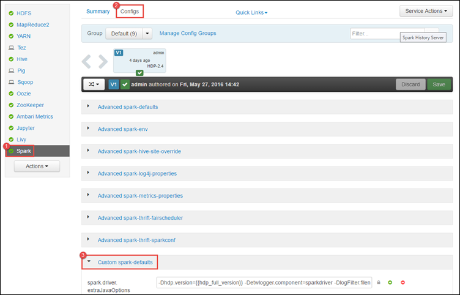
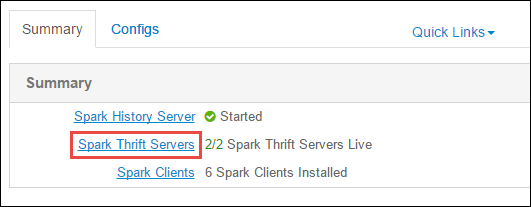
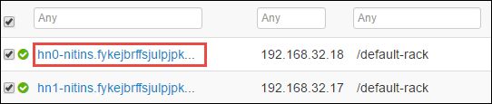

<properties 
    pageTitle="Utilizzare Gestione risorse per assegnare risorse a cluster ad Apache in HDInsight | Microsoft Azure" 
    description="Informazioni su come utilizzare Gestione risorse per cluster ad su HDInsight per migliorare le prestazioni." 
    services="hdinsight" 
    documentationCenter="" 
    authors="nitinme" 
    manager="jhubbard" 
    editor="cgronlun"
    tags="azure-portal"/>

<tags 
    ms.service="hdinsight" 
    ms.workload="big-data" 
    ms.tgt_pltfrm="na" 
    ms.devlang="na" 
    ms.topic="article" 
    ms.date="08/25/2016" 
    ms.author="nitinme"/>

# Gestire le risorse per cluster ad Apache su HDInsight Linux

In questo articolo viene spiegato accedere alle interfacce di come Ambari UI, interfaccia utente di filati, e il Server di cronologia ad associato il cluster motori. Vengono fornite informazioni sulla procedura per ottimizzare la configurazione del cluster per ottenere prestazioni ottimali.

**Prerequisiti:**

È necessario disporre le operazioni seguenti:

- Un abbonamento Azure. Vedere [ottenere Azure versione di valutazione gratuita](https://azure.microsoft.com/documentation/videos/get-azure-free-trial-for-testing-hadoop-in-hdinsight/).
- Un cluster ad Apache su HDInsight Linux. Per ulteriori informazioni, vedere [creare Apache i cluster in Azure HDInsight](hdinsight-apache-spark-jupyter-spark-sql.md).

## Modalità di avvio di interfaccia utente Web Ambari

1. Dal [Portale di Azure](https://portal.azure.com/), da startboard, fare clic sul riquadro per il cluster motori (se è bloccato il startboard). È inoltre possibile passare al cluster in **Esplora tutto** > **Cluster HDInsight**. 
 
2. Da e il cluster ad fare clic su **Dashboard**. Quando richiesto, immettere le credenziali di amministratore per il cluster motori.

    ![Barra di avvio Ambari] (./media/hdinsight-apache-spark-resource-manager/hdispark.cluster.launch.dashboard.png "Avviare Gestione risorse")

3. Questa operazione deve essere avviato dell'interfaccia utente Web Ambari, come illustrato di seguito.

    ![Interfaccia utente Web Ambari] (./media/hdinsight-apache-spark-resource-manager/ambari-web-ui.png "Interfaccia utente Web Ambari")   

## Modalità di avvio del Server di cronologia motori

1. Dal [Portale di Azure](https://portal.azure.com/), da startboard, fare clic sul riquadro per il cluster motori (se è bloccato il startboard).

2. Da e il cluster **Collegamenti rapidi**, fare clic su **Dashboard Cluster**. In e il **Cluster Dashboard** , fare clic su **Motori cronologia Server**.

    ![Motori cronologia Server] (./media/hdinsight-apache-spark-resource-manager/launch-history-server.png "Motori cronologia Server")

    Quando richiesto, immettere le credenziali di amministratore per il cluster motori.

## Modalità di avvio dell'interfaccia utente filati

È possibile utilizzare l'interfaccia utente filati per eseguire il monitoraggio delle applicazioni attualmente in esecuzione su cluster ad. 

1. Da e il cluster, fare clic su **Dashboard Cluster**e quindi fare clic su **filati**.

    

    >[AZURE.TIP] In alternativa, è anche possibile avviare l'interfaccia utente filati dal UI Ambari. Per avviare UI Ambari, da e il grafico, fare clic su **Dashboard Cluster**e quindi fare clic su **Dashboard Cluster HDInsight**. Da UI Ambari fare clic su **filati**, fare clic su **Collegamenti rapidi**, fare clic su Gestione risorse attivo e quindi fare clic su **ResourceManager dell'interfaccia utente**.

## Qual è la configurazione di cluster ottimale per eseguire ad applicazioni?

I tre parametri di chiave che possono essere usati per la configurazione di motori in base ai requisiti dell'applicazione sono `spark.executor.instances`, `spark.executor.cores`, e `spark.executor.memory`. Un esecutore è un processo avviato per un'applicazione di motori. Viene eseguito sul nodo lavoro e consente di svolgere le attività per l'applicazione. Il numero predefinito di esecutori e le dimensioni di esecutore per ogni cluster viene calcolato in base al numero dei nodi di lavoro e la dimensione del nodo di lavoro. Questi sono archiviati in `spark-defaults.conf` nei nodi testa cluster. 

I parametri di tre configurazione possono essere configurati livello cluster (per tutte le applicazioni eseguite nel cluster) o possono essere specificati per ogni singola applicazione.

### Modificare i parametri utilizzando Ambari UI

1. Da UI Ambari fare clic su **motori**, fare clic su **configurazioni**e quindi espandere **personalizzato i valori predefiniti**.

    

2. I valori predefiniti sono ideali per 4 ad applicazioni eseguire contemporaneamente nel cluster. È possibile, le modifiche questi valori dall'interfaccia utente, come illustrato di seguito.

    

3. Fare clic su **Salva** per salvare le modifiche di configurazione. Nella parte superiore della pagina, verrà richiesto di riavviare tutti i servizi interessati. Fare clic su **Riavvia**.

    

### Modificare i parametri di un'applicazione in esecuzione nel blocco appunti Jupyter

Per le applicazioni in esecuzione nel blocco appunti Jupyter, è possibile utilizzare il `%%configure` speciale per apportare le modifiche di configurazione. Se possibile, è necessario effettuare tali modifiche all'inizio dell'applicazione, prima di eseguire la prima cella di codice. In questo modo che la configurazione viene applicata alla sessione di inserire il, quando viene creato. Se si desidera modificare la configurazione in una fase successiva nell'applicazione, è necessario utilizzare la `-f` parametro. Tuttavia, by così tutti lo stato di avanzamento nell'applicazione andranno persa.

Il frammento di codice seguente viene illustrato come cambiare la configurazione di un'applicazione in esecuzione in Jupyter.

    %%configure 
    {"executorMemory": "3072M", "executorCores": 4, “numExecutors”:10}

Parametri di configurazione devono essere passati come una stringa JSON e devono essere sulla riga successiva dopo la chiave, come illustrato nell'esempio la colonna. 

### Modificare i parametri per un'applicazione inviato tramite motori-submit

Comando è illustrata la procedura per cambiare i parametri di configurazione per un'applicazione di batch che viene inviato tramite `spark-submit`.

    spark-submit --class <the application class to execute> --executor-memory 3072M --executor-cores 4 –-num-executors 10 <location of application jar file> <application parameters>

### Modificare i parametri per un'applicazione inviato tramite curvatura

Comando è un esempio di come modificare i parametri di configurazione per un'applicazione di batch che viene inviato tramite utilizzando latino.

    curl -k -v -H 'Content-Type: application/json' -X POST -d '{"file":"<location of application jar file>", "className":"<the application class to execute>", "args":[<application parameters>], "numExecutors":10, "executorMemory":"2G", "executorCores":5' localhost:8998/batches

### Come è possibile modificare i parametri in un Server di Thrift ad?

Motori Thrift Server consente di accedere JDBC/ODBC in un cluster di motori e utilizzato per le query SQL di motori di servizio. Strumenti, ad esempio di Power BI, Tableau e così via. Consente di comunicare con i Thrift Server per eseguire query SQL ad come applicazione motori protocollo ODBC. Quando viene creato un cluster di motori, sono in esecuzione due istanze del Server Thrift motori, uno in ogni nodo principale. Ogni Server Thrift motori è visibile come applicazione motori nell'interfaccia utente di filati. 

Motori Thrift Server utilizza l'allocazione di esecutore dinamico motori e quindi la `spark.executor.instances` non viene utilizzata. Utilizza invece i Thrift Server `spark.dynamicAllocation.minExecutors` e `spark.dynamicAllocation.maxExecutors` per specificare il numero di esecutore. I parametri di configurazione `spark.executor.cores` e `spark.executor.memory` viene utilizzata per modificare le dimensioni di esecutore. È possibile modificare i parametri come illustrato di seguito.

* Espandere la categoria **Avanzate motori-thrift-sparkconf** per aggiornare i parametri `spark.dynamicAllocation.minExecutors`, `spark.dynamicAllocation.maxExecutors`, e `spark.executor.memory`.

     

* Espandere la categoria **personalizzata ad-thrift-sparkconf** per aggiornare il parametro `spark.executor.cores`.

    

### Come è possibile modificare la memoria del Server Thrift motori?

Memoria ad Thrift Server è configurato al 25% della dimensione di RAM nodo principale, purché che la dimensione di RAM totale del nodo principale è maggiore di 14GB. È possibile utilizzare UI Ambari per modificare la configurazione di memoria driver, come illustrato di seguito.

* Da UI Ambari fare clic su **motori**, fare clic su **configurazioni**, espandere **avanzata env motori**e quindi specificare il valore per **spark_thrift_cmd_opts**.

    

## Non si utilizza BI con cluster ad. Come riprendere il le risorse?

Poiché si usi l'allocazione dinamica motori, solo le risorse utilizzate dal server thrift sono le risorse per gli schemi di due applicazione. Per recuperare queste risorse è necessario interrompere i servizi di Thrift Server in esecuzione nel cluster.

1. UI Ambari, nel riquadro sinistro fare clic su **motori**.

2. Nella pagina successiva, fare clic su **I Thrift server**.

    

3. Verrà visualizzato due headnodes in cui viene eseguito il Server di Thrift i. Fare clic su uno del headnodes.

    

4. Nella pagina successiva Elenca tutti i servizi in esecuzione su tale headnode. Nell'elenco fare clic sul pulsante elenco a discesa accanto ad Thrift Server e quindi fare clic su **Interrompi**.

    

5. Ripetere i passaggi indicati nelle altre headnode anche.

## I blocchi appunti Jupyter non sono in esecuzione come previsto. Come è possibile riavviare il servizio?

1. Avviare l'interfaccia utente Web Ambari come illustrato sopra. Dal riquadro di spostamento sinistra, fare clic su **Jupyter**, fare clic su **Servizio di azioni**e quindi **Riavviare tutti**. Verrà avviato il servizio Jupyter in tutte le headnodes.

    ![Riavviare Jupyter] (./media/hdinsight-apache-spark-resource-manager/restart-jupyter.png "Riavviare Jupyter")

    

## Vedere anche

* [Panoramica: Apache motori su Azure HDInsight](hdinsight-apache-spark-overview.md)

### Scenari

* [Motori con BI: eseguire l'analisi dei dati interattive tramite motori in HDInsight con strumenti di Business Intelligence](hdinsight-apache-spark-use-bi-tools.md)

* [Motori di apprendimento: usare i in HDInsight per l'analisi temperatura predefiniti utilizzando dati HVAC](hdinsight-apache-spark-ipython-notebook-machine-learning.md)

* [Motori di apprendimento: usare i in HDInsight per prevedere i risultati del controllo alimentari](hdinsight-apache-spark-machine-learning-mllib-ipython.md)

* [Motori Streaming: Usare motori in HDInsight per la creazione di applicazioni di trasmissione in tempo reale](hdinsight-apache-spark-eventhub-streaming.md)

* [Analisi dei log sito Web tramite motori in HDInsight](hdinsight-apache-spark-custom-library-website-log-analysis.md)

### Creare ed eseguire applicazioni

* [Creare un'applicazione autonoma utilizza Scala](hdinsight-apache-spark-create-standalone-application.md)

* [Eseguire processi in modalità remota in un cluster di motori tramite inserire il](hdinsight-apache-spark-livy-rest-interface.md)

### Strumenti ed estensioni

* [Plug-in strumenti di HDInsight per IntelliJ IDEA consente di creare e inviare Scala ad applicazioni](hdinsight-apache-spark-intellij-tool-plugin.md)

* [Utilizzare plug-in strumenti di HDInsight per IntelliJ IDEA il debug delle applicazioni di motori in modalità remota](hdinsight-apache-spark-intellij-tool-plugin-debug-jobs-remotely.md)

* [Usare i blocchi appunti Zeppelin con un cluster di motori su HDInsight](hdinsight-apache-spark-use-zeppelin-notebook.md)

* [Disponibile per blocco appunti Jupyter cluster motori per HDInsight. x](hdinsight-apache-spark-jupyter-notebook-kernels.md)

* [Utilizzare i pacchetti esterni con i blocchi appunti Jupyter](hdinsight-apache-spark-jupyter-notebook-use-external-packages.md)

* [Installare Jupyter nel computer e connettersi a un cluster HDInsight Spark](hdinsight-apache-spark-jupyter-notebook-install-locally.md)

### Gestire le risorse

* [Tenere traccia e debug processi in esecuzione in un cluster di motori di Apache in HDInsight](hdinsight-apache-spark-job-debugging.md)

[hdinsight-versions]: hdinsight-component-versioning.md
[hdinsight-upload-data]: hdinsight-upload-data.md
[hdinsight-storage]: hdinsight-hadoop-use-blob-storage.md

[azure-purchase-options]: http://azure.microsoft.com/pricing/purchase-options/
[azure-member-offers]: http://azure.microsoft.com/pricing/member-offers/
[azure-free-trial]: http://azure.microsoft.com/pricing/free-trial/
[azure-management-portal]: https://manage.windowsazure.com/
[azure-create-storageaccount]: storage-create-storage-account.md 
