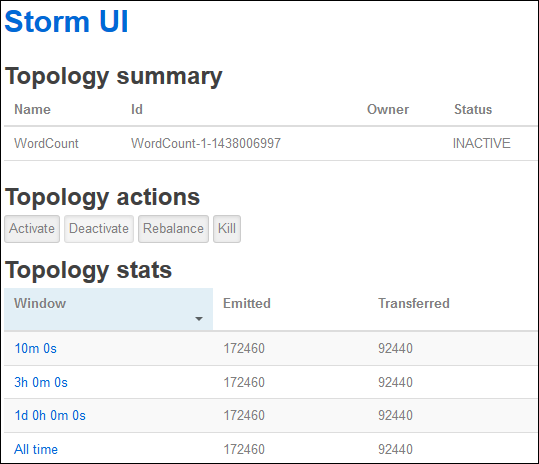

<properties
    pageTitle="Esercitazione Apache eccesso: Guida introduttiva a basati su Linux eccesso nella HDInsight | Microsoft Azure"
    description="Guida introduttiva a analitica di dati in eccesso Apache e gli esempi Starter eccesso HDInsight basati su Linux. Informazioni su come usare eccesso per elaborare i dati in tempo reale."
    keywords="eccesso Apache, esercitazione eccesso apache, analitica dati grande, starter eccesso"
    services="hdinsight"
    documentationCenter=""
    authors="Blackmist"
    manager="jhubbard"
    editor="cgronlun"/>

<tags
   ms.service="hdinsight"
   ms.devlang="java"
   ms.topic="get-started-article"
   ms.tgt_pltfrm="na"
   ms.workload="big-data"
   ms.date="10/12/2016"
   ms.author="larryfr"/>

# Esercitazione Apache eccesso: Introduzione a esempi eccesso Starter per analitica dati su HDInsight

Apache eccesso è un sistema di calcolo scalable, tolleranza, distribuito, in tempo reale per l'elaborazione di flussi di dati. Con eccesso su Azure HDInsight, è possibile creare un cluster di eccesso basato su cloud che esegue analitica di dati in tempo reale.

> [AZURE.NOTE] La procedura descritta in questo articolo crea un cluster basati su Linux HDInsight. Per istruzioni dettagliate creare un eccesso basato su Windows cluster HDInsight, vedere [esercitazione Apache eccesso: iniziare a utilizzare l'esempio Starter eccesso utilizzando analitica dati su HDInsight](hdinsight-apache-storm-tutorial-get-started.md)

## Prerequisiti

[AZURE.INCLUDE [delete-cluster-warning](../../includes/hdinsight-delete-cluster-warning.md)]

È necessario disporre le operazioni seguenti per completare correttamente questa esercitazione in eccesso Apache:

- **Azure un abbonamento**. Vedere [ottenere Azure versione di valutazione gratuita](https://azure.microsoft.com/documentation/videos/get-azure-free-trial-for-testing-hadoop-in-hdinsight/).

- **Familiarità con SSH e SCP**. Per ulteriori informazioni sull'utilizzo di SSH e SCP con HDInsight, vedere le operazioni seguenti:

    - **Client Linux, Unix o OS X**: vedere [Usare SSH con basati su Linux Hadoop in HDInsight da Linux, OS X o Unix](hdinsight-hadoop-linux-use-ssh-unix.md)

    - **Client Windows**: vedere [Usare SSH con basati su Linux Hadoop in HDInsight da Windows](hdinsight-hadoop-linux-use-ssh-windows.md)

### Requisiti di controllo accesso

[AZURE.INCLUDE [access-control](../../includes/hdinsight-access-control-requirements.md)]

## Creare un cluster di eccesso

In questa sezione, si crea un cluster di versione 3.2 HDInsight (eccesso versione 0.9.3) utilizzando un modello di gestione di risorse Azure. Per informazioni sulle versioni HDInsight e i contratti di servizio, vedere [il controllo delle versioni componente HDInsight](hdinsight-component-versioning.md). Per altri metodi di creazione cluster, vedere [creare HDInsight cluster](hdinsight-hadoop-provision-linux-clusters.md).

1. Fare clic sull'immagine seguente per aprire il modello nel portale di Azure.         

    
    
    Il modello si trova in un contenitore di blob pubblica, *https://hditutorialdata.blob.core.windows.net/armtemplates/create-linux-based-storm-cluster-in-hdinsight.json*. 
   
2. Da e il parametri immettere quanto segue:

    - **Nome cluster**: immettere un nome per il cluster Hadoop che verrà creato.
    - **Nome di accesso cluster e la password**: il nome di accesso predefinito è amministratore.
    - **Nome utente SSH e password**.
    
    Prendere nota questi valori.  Saranno necessari in un secondo momento nell'esercitazione.

    > [AZURE.NOTE] SSH viene utilizzato per accedere al cluster HDInsight utilizzando una riga di comando. Il nome utente e la password utilizzati in questo campo viene utilizzato quando ci si connette al cluster tramite SSH. Inoltre, il nome dell'utente SSH deve essere univoco, durante la creazione di un account utente in tutti i nodi di cluster HDInsight. Le operazioni seguenti sono riportati alcuni dei nomi di account riservati a servizi del cluster e non può essere utilizzati come nome utente SSH:
    >
    > radice, hdiuser, eccesso, hbase, ubuntu, zookeeper, hdfs, filati, mapred, hbase, hive, oozie, falcon, sqoop, amministratore, tez, hcat, zookeeper hdinsight.

    > Per ulteriori informazioni sull'utilizzo di SSH con HDInsight, vedere uno degli articoli seguenti:

    > * [Usare SSH con basati su Linux Hadoop in HDInsight da Linux, Unix o OS X](hdinsight-hadoop-linux-use-ssh-unix.md)
    > * [Usare SSH con basati su Linux Hadoop in HDInsight da Windows](hdinsight-hadoop-linux-use-ssh-windows.md)

    
3. fare clic su **OK** per salvare i parametri.

4 e il **distribuzione personalizzata** , fare clic su casella di **gruppo di risorse** a discesa e quindi fare clic su **Nuovo** per creare un nuovo gruppo di risorse. Gruppo di risorse è un contenitore che raggruppa cluster, l'account di archiviazione dipendenti e altre risorse collegate.

5 fare clic su **note legali**e quindi fare clic su **Crea**.

6. fare clic su **Crea**. Verrà visualizzato un nuovo riquadro intitolato Submitting distribuzione per la distribuzione dei modelli. Richiede circa circa il 20 minuti per creare il cluster e il database SQL.

##Eseguire un campione eccesso Starter su HDInsight

Gli esempi [starter eccesso](https://github.com/apache/storm/tree/master/examples/storm-starter) sono incluse nel cluster HDInsight. Nei passaggi seguenti, si eseguirà l'esempio WordCount.

1. Connettersi a cluster HDInsight utilizzando SSH:

        ssh USERNAME@CLUSTERNAME-ssh.azurehdinsight.net
        
    Se è stata usata una password per proteggere il proprio account utente SSH, verrà richiesto di immetterla. Se è stata utilizzata una chiave pubblica, è necessario utilizzare la `-i` parametro per specificare la chiave privata corrispondente. Ad esempio `ssh -i ~/.ssh/id_rsa USERNAME@CLUSTERNAME-ssh.azurehdinsight.net`.
        
    Per ulteriori informazioni sull'utilizzo di SSH con basati su Linux HDInsight, vedere gli articoli seguenti:
    
    * [Usare SSH con basati su Linux Hadoop in HDInsight da Linux, Unix o OS X](hdinsight-hadoop-linux-use-ssh-unix.md)

    * [Usare SSH con basati su Linux Hadoop in HDInsight da Windows](hdinsight-hadoop-linux-use-ssh-windows)

2. Utilizzare il comando seguente per avviare una topologia di esempio:

        storm jar /usr/hdp/current/storm-client/contrib/storm-starter/storm-starter-topologies-*.jar storm.starter.WordCountTopology wordcount
        
    > [AZURE.NOTE] Il `*` parte del nome del file viene utilizzato per associare il numero di versione, le modifiche come HDInsight viene aggiornato.

    Verrà avviata la topologia di esempio WordCount in cluster, con un nome descrittivo del 'wordcount'. Verrà in modo casuale generare frasi e contare le occorrenze di ogni parola le frasi.

    > [AZURE.NOTE] Quando si inviano topologia al cluster, è prima necessario copiare il file di vaso che include il cluster prima di utilizzare il `storm` comando. Questo risultato può essere ottenuto utilizzando il `scp` comando dal client in cui è presente il file. Per esempio`scp FILENAME.jar USERNAME@CLUSTERNAME-ssh.azurehdinsight.net:FILENAME.jar`
    >
    > Nell'esempio WordCount e altri esempi di starter eccesso sono già inclusi nel cluster in `/usr/hdp/current/storm-client/contrib/storm-starter/`.

##Controllare la topologia

L'interfaccia utente eccesso offre un'interfaccia web per l'utilizzo di esecuzione topologie e viene fornito con il cluster HDInsight.

Per controllare la topologia tramite l'interfaccia utente eccesso, procedere come segue:

1. Aprire un web browser per https://CLUSTERNAME.azurehdinsight.net/stormui, dove __nome cluster__ è il nome del cluster. Verrà aperto l'interfaccia utente eccesso.

    > [AZURE.NOTE] Se viene chiesto di specificare un nome utente e password, immettere l'amministratore del cluster (amministratori) e la password utilizzati quando creare il cluster.

2. Selezionare la voce **wordcount** **topologia di riepilogo**, nella colonna **nome** . Verranno visualizzati ulteriori informazioni sulla topologia.

    

    In questa pagina vengono le informazioni seguenti:

    * **Stat topologia** - informazioni di base sulle prestazioni della topologia organizzati in intervalli di tempo.

        > [AZURE.NOTE] Se si seleziona un intervallo di tempo specifico modificata l'intervallo di tempo per le informazioni visualizzate in altre sezioni della pagina.

    * **Spouts** - informazioni di base su spouts, incluso l'ultimo errore restituito da ogni beccuccio.

    * **Bulloni** - informazioni di base su bulloni.

    * **Configurazione della topologia** : informazioni dettagliate sulla configurazione della topologia.

    Questa pagina vengono forniti anche azioni eseguite sulla topologia di:

    * **Attiva** - elaborazione di curriculum di una topologia disattivata.

    * **Disattiva** - sospende una topologia in esecuzione.

    * **Ribilanciare** - regola parallelismo della topologia. Dopo avere modificato il numero dei nodi del cluster, si devono ribilanciare topologie in esecuzione. In questo modo la topologia regolare parallelismo a compensa il numero di aumentare o diminuire dei nodi del cluster. Per ulteriori informazioni, vedere [informazioni sul parallelismo di una topologia eccesso](http://storm.apache.org/documentation/Understanding-the-parallelism-of-a-Storm-topology.html).

    * **Interrompere** - e termina con una topologia eccesso il timeout specificato.

3. Da questa pagina, selezionare la voce nella sezione **Spouts** o **bulloni** . Informazioni sul componente selezionato verrà visualizzato.

    

    Questa pagina vengono visualizzate le informazioni seguenti:

    * **Stat beccuccio/bulloni** - informazioni di base sulle prestazioni componente organizzati in intervalli di tempo.

        > [AZURE.NOTE] Se si seleziona un intervallo di tempo specifico modificata l'intervallo di tempo per le informazioni visualizzate in altre sezioni della pagina.

    * **Statistiche di input** (bullone solo) - informazioni sui componenti che generano dati consumati dai bulloni.

    * **Statistiche di output** - informazioni sui dati emessi da questo bulloni.

    * **Esecutori** - informazioni sulle istanze di questo componente.

    * **Errori** - errori generati da questo componente.

4. Quando si visualizzano i dettagli di un beccuccio o bulloni, selezionare una voce dalla colonna **porta** nella sezione **esecutori** per visualizzare i dettagli per una specifica istanza del componente.

        2015-01-27 14:18:02 b.s.d.task [INFO] Emitting: split default ["with"]
        2015-01-27 14:18:02 b.s.d.task [INFO] Emitting: split default ["nature"]
        2015-01-27 14:18:02 b.s.d.executor [INFO] Processing received message source: split:21, stream: default, id: {}, [snow]
        2015-01-27 14:18:02 b.s.d.task [INFO] Emitting: count default [snow, 747293]
        2015-01-27 14:18:02 b.s.d.executor [INFO] Processing received message source: split:21, stream: default, id: {}, [white]
        2015-01-27 14:18:02 b.s.d.task [INFO] Emitting: count default [white, 747293]
        2015-01-27 14:18:02 b.s.d.executor [INFO] Processing received message source: split:21, stream: default, id: {}, [seven]
        2015-01-27 14:18:02 b.s.d.task [INFO] Emitting: count default [seven, 1493957]

    Da questo tipo di dati è possibile vedere che **sette** word verificato 1493957 volte. Questo è il numero di volte è stato rilevato poiché è stata avviata questa topologia.

##Interrompere la topologia

Tornare alla pagina di **Riepilogo della topologia** per la topologia di conteggio di parole e quindi selezionare il pulsante di **interruzione** nella sezione **azioni della topologia** . Quando richiesto, immettere 10 per i secondi di attesa prima dell'interruzione della topologia. Dopo il timeout, la topologia non verrà più visualizzato quando si visita la sezione **Dell'interfaccia utente eccesso** del dashboard.

##Eliminare il cluster

[AZURE.INCLUDE [delete-cluster-warning](../../includes/hdinsight-delete-cluster-warning.md)]

##Passaggi successivi

In questa esercitazione Apache eccesso si usava Starter eccesso per imparare a creare un eccesso cluster HDInsight e utilizzare il Dashboard eccesso per distribuire, monitorare e gestire topologie eccesso. Per ulteriori informazioni sulla [topologie basato su Java sviluppare utilizzando Maven](hdinsight-storm-develop-java-topology.md).

Se si ha già familiarità con topologie sviluppare basato su Java e si desidera distribuire una topologia esistente a HDInsight, vedere [Distribuisci e gestire topologie Apache eccesso su HDInsight](hdinsight-storm-deploy-monitor-topology-linux.md).

Se si è uno sviluppatore .NET, è possibile creare c# o ibrido c# / topologie Java utilizzando Visual Studio. Per ulteriori informazioni, vedere [c# sviluppare topologie per eccesso Apache in HDInsight mediante Hadoop tools per Visual Studio](hdinsight-storm-develop-csharp-visual-studio-topology.md).

Ad esempio topologie che possono essere usate con eccesso su HDInsight, vedere gli esempi seguenti:

    * [Esempi di topologie per eccesso in HDInsight](hdinsight-storm-example-topology.md)

[apachestorm]: https://storm.incubator.apache.org
[stormdocs]: http://storm.incubator.apache.org/documentation/Documentation.html
[stormstarter]: https://github.com/apache/storm/tree/master/examples/storm-starter
[stormjavadocs]: https://storm.incubator.apache.org/apidocs/
[azureportal]: https://manage.windowsazure.com/
[hdinsight-provision]: hdinsight-provision-clusters.md
[preview-portal]: https://portal.azure.com/
