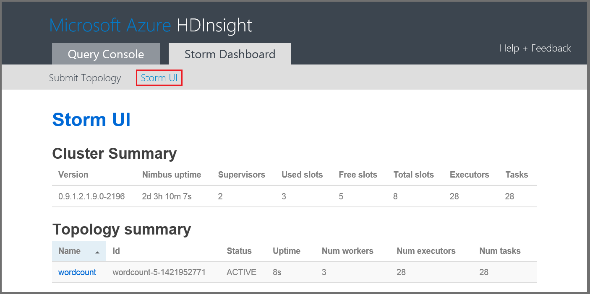

<properties
    pageTitle="Esercitazione Apache eccesso: Guida introduttiva a eccesso | Microsoft Azure"
    description="Guida introduttiva a analitica di dati in eccesso Apache e gli esempi Starter eccesso HDInsight. Informazioni su come usare eccesso per elaborare i dati in tempo reale."
    keywords="eccesso Apache, esercitazione eccesso apache, analitica dati grande, starter eccesso"
    services="hdinsight"
    documentationCenter=""
    authors="Blackmist"
    manager="jhubbard"
    editor="cgronlun"
    tags="azure-portal"/>

<tags
   ms.service="hdinsight"
   ms.devlang="java"
   ms.topic="article"
   ms.tgt_pltfrm="na"
   ms.workload="big-data"
   ms.date="09/07/2016"
   ms.author="larryfr"/>

# Esercitazione Apache eccesso: Introduzione a esempi eccesso Starter per analitica dati su HDInsight

Apache eccesso è un sistema di calcolo scalable, tolleranza, distribuito, in tempo reale per l'elaborazione di flussi di dati. Con eccesso in Microsoft Azure HDInsight, è possibile creare un cluster di eccesso basato su cloud che esegue analitica di dati in tempo reale. 

> [AZURE.NOTE] La procedura descritta in questo articolo crea un cluster basato su Windows HDInsight. Per istruzioni dettagliate creare un eccesso basati su Linux cluster HDInsight, vedere [esercitazione Apache eccesso: iniziare a utilizzare l'esempio Starter eccesso utilizzando analitica dati su HDInsight](hdinsight-apache-storm-tutorial-get-started-linux.md)

## Prerequisiti

[AZURE.INCLUDE [delete-cluster-warning](../../includes/hdinsight-delete-cluster-warning.md)]

È necessario disporre le operazioni seguenti per completare correttamente questa esercitazione in eccesso Apache:

- **Azure un abbonamento**. Vedere [ottenere Azure versione di valutazione gratuita](https://azure.microsoft.com/documentation/videos/get-azure-free-trial-for-testing-hadoop-in-hdinsight/).

### Requisiti di controllo accesso

[AZURE.INCLUDE [access-control](../../includes/hdinsight-access-control-requirements.md)]

## Creare un cluster di eccesso

Eccesso nella HDInsight utilizza archiviazione Blob Azure per l'archiviazione dei file di log e topologie inviate al cluster. Per creare un account Azure dello spazio di archiviazione per l'utilizzo con i cluster, procedere come segue:

1. Accedere al [portale di Azure][preview-portal].

2. Selezionare **Nuovo**, selezionare __Analitica dati__e quindi selezionare __HDInsight__.

    

3. Immettere un __nome Cluster__. Un segno di spunta verde viene visualizzata accanto al __Nome del Cluster__ se è disponibile.

4. Se si dispone di più di una sottoscrizione, selezionare la voce della __sottoscrizione__ a selezionare l'abbonamento Azure che verrà utilizzato per il cluster.

5.  Consente di selezionare un cluster di __eccesso__ __Selezione tipo di grafico__ . Per il __sistema operativo__, selezionare finestre. Per __Livello di Cluster__, selezionare STANDARD. Infine, utilizzare il pulsante di selezione per salvare le impostazioni.

    

5. Per __Gruppo di risorse__, è possibile utilizzare per visualizzare un elenco di gruppi di risorse esistenti e quindi selezionare l'opzione per creare il cluster nell'elenco a discesa. Oppure selezionare __Nuovo__ e quindi immettere il nome del nuovo gruppo di risorse. Viene visualizzato un segno di spunta verde per indicare se il nome del nuovo gruppo è disponibile.

6. Selezionare __le credenziali__e quindi immettere un __Nome utente accesso Cluster__ e la __Password di accesso al Cluster__. Infine, consente di __Selezionare__ per impostare le credenziali. Desktop remoto non essere utilizzato in questo documento, in modo che è possibile lasciarla disattivata.

    

6. Per l' __Origine dati__, selezionare la voce per scegliere un'origine dati esistente o crearne uno nuovo.

    

    Attualmente è possibile selezionare un account di archiviazione Azure come origine dati per un cluster di HDInsight. Utilizzare le operazioni seguenti per comprendere le voci nel e __Origine dati__ .

    - __Metodo di selezione__: impostare __da tutte le sottoscrizioni__ per consentire l'esplorazione di account di archiviazione alle proprie sottoscrizioni. Impostare su __Tasto di scelta rapida__ se si desidera immettere il __Nome di spazio di archiviazione__ e un __Tasto di scelta rapida__ di un account di archiviazione esistente.

    - __Creare una nuova__: consente di creare un nuovo account di archiviazione. Utilizzare il campo che compare, per immettere il nome dell'account di archiviazione. Un segno di spunta verde viene visualizzato se il nome è disponibile.

    - __Scegliere contenitore predefinito__: consente di immettere il nome del contenitore predefinito da usare per il raggruppamento. È possibile immettere un nome di seguito, è consigliabile utilizzare lo stesso nome del cluster in modo che sia facilmente riconoscibile che viene utilizzato il contenitore per il cluster specifico.

    - __Posizione__: l'area geografica che l'account di archiviazione in o verrà creato.

        > [AZURE.IMPORTANT] Anche selezionando il percorso per l'origine dati predefinita imposta la posizione del cluster HDInsight. L'origine di dati predefiniti e cluster deve trovarsi nella stessa regione.

    - __Selezionare__: consente di salvare la configurazione dell'origine dati.

7. Selezionare __Nodo prezzi livelli__ da visualizzare informazioni su nodi che verranno creati per questo cluster. Per impostazione predefinita, il numero dei nodi di lavoro è impostato su __4__. Impostare questa opzione __1__, in quanto è sufficiente per questa esercitazione e ridurre i costi del cluster. Nella parte inferiore della stessa questo e viene visualizzato il costo previsto del cluster.

    

    Consente di __Selezionare__ salvare le informazioni di __Nodo prezzi livelli__ .

8. Selezionare __configurazione facoltativa__. Questo blade consente di selezionare la versione cluster, come configurare altre impostazioni facoltativi, ad esempio partecipare a una __Rete virtuale__.

    

9. Assicurarsi che sia selezionato __Aggiungi a Startboard__ e quindi selezionare __Crea__. Verrà creato il cluster e si aggiunge un riquadro per renderla Startboard del portale Azure. L'icona indica che il provisioning di cluster e le modifiche apportate a icona a forma di HDInsight il provisioning di una volta completata.

  	| Durante il provisioning | Il provisioning di completamento |
  	| ------------------ | --------------------- |
  	|  |  |

    > [AZURE.NOTE] Alcuni tempo per il cluster da creare, in genere circa 15 minuti. Utilizzare il riquadro la Startboard o la voce di __notifiche__ sul lato sinistro della pagina, per verificare se il processo di provisioning.

## Eseguire un campione eccesso Starter su HDInsight

In questa esercitazione Apache eccesso viene presentato analitica dati utilizzo degli esempi eccesso Starter su GitHub.

Ogni eccesso cluster HDInsight viene fornito con il Dashboard eccesso, che possono essere utilizzati per caricare ed eseguire topologie eccesso nel cluster. Ogni cluster include anche topologie di esempio che possono essere eseguite direttamente dal Dashboard eccesso.

### Connettersi a dashboard

Dashboard di cui si trova in **https://&lt;nome cluster >.azurehdinsight.net//**, dove **nome cluster** è il nome del cluster. È inoltre disponibile un collegamento al dashboard selezionandolo cluster di Startboard e selezionando il collegamento al __Dashboard__ nella parte superiore e il.

> [AZURE.NOTE] Quando ci si connette al dashboard, viene chiesto di immettere un nome utente e la password. Questo è il nome dell'amministratore (**amministratore**) e la password utilizzata per la creazione del cluster.

Dopo aver caricato Dashboard eccesso, verrà visualizzato il modulo di **Invio della topologia** .

Il modulo **Inviare topologia** è utilizzabile per caricare ed eseguire il file JAR contenenti topologie eccesso. Include inoltre diversi esempi di base in cui vengono forniti con il cluster.

### Eseguire l'esempio Conteggio parole dal progetto di partenza eccesso in GitHub

Gli esempi forniti con i cluster includono diverse varianti di una topologia conteggio di word. In questi esempi includono un **spout** che genera in modo casuale frasi e **bulloni** che scomporre ogni frase in singole parole, quindi Contare quante volte si è verificato ogni parola. In questi esempi sono compresi gli [esempi Starter eccesso](https://github.com/apache/storm/tree/master/examples/storm-starter), che fanno parte di Apache eccesso.

Per eseguire un campione Starter eccesso, procedere come segue:

1. Selezionare **StormStarter - WordCount** dall'elenco a discesa **File Jar** . Consente di compilare i campi **Nome della classe** e **Altri parametri** con i parametri di questo esempio.

    

    * **Nome della classe** - classe nel file JAR per l'invio della topologia.
    * **Altri parametri** - parametri necessari affinché la topologia. In questo esempio, il campo viene utilizzato per fornire un nome descrittivo per la topologia inviato.

2. Fare clic su **Invia**. Dopo alcuni istanti, il campo **risultato** viene visualizzato il comando utilizzato per inviare il processo, nonché i risultati del comando. Campo **errore** sono visualizzati gli eventuali errori invio della topologia.

    

    > [AZURE.NOTE] I risultati non indicare che la topologia terminata - **un'eccesso topologia, una volta avviata, verrà eseguito finché non si interrompe tale** La topologia di conteggio parole genera frasi casuale e mantiene un conteggio del numero di volte in cui viene rilevato ogni parola finché non si interrompe.

### Controllare la topologia

L'interfaccia utente eccesso è utilizzabile per eseguire il monitoraggio della topologia.

1. Selezionare **Il dell'interfaccia utente** nella parte superiore del Dashboard eccesso. Consente di visualizzare informazioni di riepilogo per il cluster e tutte le topologie in esecuzione.

    

    Dalla pagina, è possibile visualizzare l'ora che la topologia è stato attiva, come il numero di colleghi, esecutori e attività in uso.

    > [AZURE.NOTE] Nella colonna **nome** contiene il nome descrittivo fornito in precedenza mediante il campo **Altri parametri** .

4. Selezionare la voce **wordcount** **topologia di riepilogo**, nella colonna **nome** . Consente di visualizzare ulteriori informazioni sulla topologia.

    

    In questa pagina vengono le informazioni seguenti:

    * **Stat topologia** - informazioni di base sulle prestazioni della topologia organizzati in intervalli di tempo.

        > [AZURE.NOTE] Se si seleziona un intervallo di tempo specifico modificata l'intervallo di tempo per le informazioni visualizzate in altre sezioni della pagina.

    * **Spouts** - informazioni di base su spouts, incluso l'ultimo errore restituito da ogni beccuccio.

    * **Bulloni** - informazioni di base su bulloni.

    * **Configurazione della topologia** : informazioni dettagliate sulla configurazione della topologia.

    Questa pagina vengono forniti anche azioni eseguite sulla topologia di:

    * **Attiva** - elaborazione di curriculum di una topologia disattivata.

    * **Disattiva** - sospende una topologia in esecuzione.

    * **Ribilanciare** - regola parallelismo della topologia. Dopo avere modificato il numero dei nodi del cluster, si devono ribilanciare topologie in esecuzione. In questo modo la topologia regolare parallelismo a compensa il numero di aumentare o diminuire dei nodi del cluster. Per ulteriori informazioni, vedere [informazioni sul parallelismo di una topologia eccesso](http://storm.apache.org/documentation/Understanding-the-parallelism-of-a-Storm-topology.html).

    * **Interrompere** - e termina con una topologia eccesso il timeout specificato.

5. Da questa pagina, selezionare la voce nella sezione **Spouts** o **bulloni** . Consente di visualizzare informazioni sul componente selezionato.

    

    Questa pagina vengono visualizzate le informazioni seguenti:

    * **Stat beccuccio/bulloni** - informazioni di base sulle prestazioni componente organizzati in intervalli di tempo.

        > [AZURE.NOTE] Se si seleziona un intervallo di tempo specifico modificata l'intervallo di tempo per le informazioni visualizzate in altre sezioni della pagina.

    * **Statistiche di input** (bullone solo) - informazioni sui componenti che generano dati consumati dai bulloni.

    * **Statistiche di output** - informazioni sui dati emessi da questo bulloni.

    * **Esecutori** - informazioni sulle istanze di questo componente.

    * **Errori** - errori generati da questo componente.

5. Quando si visualizzano i dettagli di un beccuccio o bulloni, selezionare una voce dalla colonna **porta** nella sezione **esecutori** per visualizzare i dettagli per una specifica istanza del componente.

        2015-01-27 14:18:02 b.s.d.task [INFO] Emitting: split default ["with"]
        2015-01-27 14:18:02 b.s.d.task [INFO] Emitting: split default ["nature"]
        2015-01-27 14:18:02 b.s.d.executor [INFO] Processing received message source: split:21, stream: default, id: {}, [snow]
        2015-01-27 14:18:02 b.s.d.task [INFO] Emitting: count default [snow, 747293]
        2015-01-27 14:18:02 b.s.d.executor [INFO] Processing received message source: split:21, stream: default, id: {}, [white]
        2015-01-27 14:18:02 b.s.d.task [INFO] Emitting: count default [white, 747293]
        2015-01-27 14:18:02 b.s.d.executor [INFO] Processing received message source: split:21, stream: default, id: {}, [seven]
        2015-01-27 14:18:02 b.s.d.task [INFO] Emitting: count default [seven, 1493957]

    Da questo tipo di dati, è possibile vedere che **sette** word verificato 1,493,957 volte. Questo è il numero di volte è stato rilevato poiché è stata avviata questa topologia.

### Interrompere la topologia

Tornare alla pagina di **Riepilogo della topologia** per la topologia di conteggio di parole e quindi selezionare **eliminare** nella sezione **azioni della topologia** . Quando richiesto, immettere 10 per i secondi di attesa prima dell'interruzione della topologia. Dopo il timeout, la topologia non è più viene visualizzata quando si visita la sezione **Dell'interfaccia utente eccesso** del dashboard.

##Eliminare il cluster

[AZURE.INCLUDE [delete-cluster-warning](../../includes/hdinsight-delete-cluster-warning.md)]

## Riepilogo

In questa esercitazione Apache eccesso si usava Starter eccesso per imparare a creare un eccesso cluster HDInsight e utilizzare il Dashboard eccesso per distribuire, monitorare e gestire topologie eccesso.

## Passaggi successivi

* **HDInsight Tools per Visual Studio** - strumenti HDInsight consente di utilizzare Visual Studio per inviare, monitorare e gestire topologie eccesso simile al Dashboard di eccesso indicato in precedenza. HDInsight strumenti inoltre offre la possibilità di creare topologie c# eccesso e include topologie di esempio che è possibile distribuire ed eseguire il cluster.

    Per ulteriori informazioni, vedere [iniziare a utilizzare gli strumenti di HDInsight per Visual Studio](hdinsight-hadoop-visual-studio-tools-get-started.md).

* **File di esempio** - cluster di eccesso HDInsight fornisce diversi esempi nella directory **%STORM_HOME%\contrib** . Ogni esempio deve contenere le operazioni seguenti:

    * Il codice sorgente - ad esempio eccesso-starter-0.9.1.2.1.5.0-2057-sources.jar

    * I documenti di linguaggio - ad esempio eccesso-starter-0.9.1.2.1.5.0-2057-javadoc.jar

    * Nell'esempio - ad esempio storm-starter-0.9.1.2.1.5.0-2057-jar-with-dependencies.jar

    Usare il comando 'vaso' per estrarre il codice sorgente o documenti di linguaggio. Ad esempio, ' eccesso - xvf vaso-starter-0.9.1.2.1.5.0.2057-javadoc.jar'.

    > [AZURE.NOTE] Documenti di linguaggio è costituito da pagine Web. Una volta estratto, utilizzare un browser per visualizzare il file **index** .

    Per accedere a questi esempi, è necessario attivare Desktop remoto per eccesso cluster HDInsight e quindi copiare i file da **%STORM_HOME%\contrib**.

* Il documento seguente contiene un elenco di altri esempi che può essere utilizzata con eccesso su HDInsight:

    * [Esempi di topologie per eccesso in HDInsight](hdinsight-storm-example-topology.md)

[apachestorm]: https://storm.incubator.apache.org
[stormdocs]: http://storm.incubator.apache.org/documentation/Documentation.html
[stormstarter]: https://github.com/apache/storm/tree/master/examples/storm-starter
[stormjavadocs]: https://storm.incubator.apache.org/apidocs/
[azureportal]: https://manage.windowsazure.com/
[hdinsight-provision]: hdinsight-provision-clusters.md
[preview-portal]: https://portal.azure.com/
