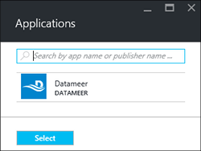

<properties
    pageTitle="Installare applicazioni Hadoop su HDInsight | Microsoft Azure"
    description="Informazioni su come installare le applicazioni di HDInsight HDInsight applicazioni."
    services="hdinsight"
    documentationCenter=""
    authors="mumian"
    manager="jhubbard"
    editor="cgronlun"
    tags="azure-portal"/>

<tags
    ms.service="hdinsight"
    ms.devlang="na"
    ms.topic="hero-article"
    ms.tgt_pltfrm="na"
    ms.workload="big-data"
    ms.date="09/14/2016"
    ms.author="jgao"/>

# Installare le applicazioni HDInsight

Un'applicazione HDInsight è un'applicazione che gli utenti possono installare in un cluster basati su Linux HDInsight. Queste applicazioni da Microsoft, fornitori di software indipendenti (ISV) o per se stessi. In questo articolo si imparerà a installare un'applicazione pubblicata. Per installare l'applicazione, vedere [installare applicazioni personalizzate HDInsight](hdinsight-apps-install-custom-applications.md). 

Attualmente è un'applicazione pubblicata:

- **Datameer**: [Datameer](http://www.datameer.com/documentation/display/DAS50/Home?ls=Partners&lsd=Microsoft&c=Partners&cd=Microsoft) consente analisti interattiva per scoprire, analizzare e visualizzare i risultati nei dati. Effettuare il pull di origini dati aggiuntivi facilmente per individuare le nuove relazioni e ottenere le risposte che necessarie rapidamente.

>[AZURE.NOTE] Datameer è attualmente supportato solo nelle cluster versione 3.2 Azure HDInsight.

Le istruzioni fornite in questo articolo utilizzano portale Azure. È anche possibile esportare il modello di gestione di risorse Azure dal portale di o ottenere una copia del modello di gestione risorse fornitori di e utilizzare PowerShell Azure e Azure CLI per distribuire il modello.  Vedere [Hadoop basati su Linux creare cluster in HDInsight utilizzare i modelli di Manager delle risorse](hdinsight-hadoop-create-linux-clusters-arm-templates.md).

## Prerequisiti

Se si desidera installare le applicazioni di HDInsight in un cluster HDInsight esistente, è necessario disporre di un cluster di HDInsight. Per creare uno, vedere [creare cluster](hdinsight-hadoop-linux-tutorial-get-started.md#create-cluster). È inoltre possibile installare le applicazioni di HDInsight quando si crea un cluster di HDInsight.

## Installare le applicazioni a cluster esistenti

La procedura seguente viene illustrato come installare le applicazioni di HDInsight a un cluster HDInsight esistente.

**Per installare un'applicazione HDInsight**

1. Accedere al [portale di Azure](https://portal.azure.com).
2. Fare clic su **Cluster HDInsight** nel menu a sinistra.  Se non è visualizzata, fare clic su **Sfoglia**e quindi fare clic su **Cluster HDInsight**.
3. Fare clic su un cluster di HDInsight.  Se non si dispone di uno, è necessario crearne uno prima.  vedere [creare cluster](hdinsight-hadoop-linux-tutorial-get-started.md#create-cluster).
4. Scegliere **applicazioni** e **l'Impostazioni** nella categoria **Generale** . E **l'Installato App** Elenca tutte le applicazioni installate. 

    

5. Fare clic su **Aggiungi** dal menu blade. 

    

    È visualizzato un elenco di applicazioni HDInsight esistenti.

    

6. Fare clic su una delle applicazioni, accettare le condizioni legali e quindi fare clic su **Seleziona**.

È possibile visualizzare lo stato dell'installazione dal portale notifiche (fare clic sull'icona della campana nella parte superiore del portale). Dopo l'applicazione è installato, verrà visualizzata l'applicazione e il App installate.

## Installare applicazioni durante la creazione di cluster

Disponibile l'opzione per installare le applicazioni di HDInsight quando si crea un cluster. Durante il processo di HDInsight applicazioni vengono installate dopo il cluster viene creato ed è in esecuzione. La procedura seguente viene illustrato come installare le applicazioni di HDInsight quando si crea un cluster.

**Per installare un'applicazione HDInsight**

1. Accedere al [portale di Azure](https://portal.azure.com).
2. Fare clic su **Nuovo**, fare clic su **dati + Analitica**e quindi fare clic su **HDInsight**.
3. Immettere **Il nome del Cluster**: questo nome deve essere univoco globale.
4. Fare clic su **sottoscrizione** per selezionare l'abbonamento Azure che verrà utilizzato per il cluster.
5. Fare clic su **Seleziona tipo di grafico**e quindi selezionare:

    - **Tipo di cluster**: se non si sa come scegliere, selezionare **Hadoop**. Si tratta del tipo di grafico più popolari.
    - **Sistema operativo**: selezionare **Linux**.
    - **Versione**: usare la versione predefinita se non si sa quale scegliere. Per ulteriori informazioni, vedere [HDInsight cluster versioni](hdinsight-component-versioning.md).
    - **Livello di cluster**: Azure HDInsight fornisce le offerte cloud di dati in due categorie: livello Standard e Premium. Per ulteriori informazioni, vedere [livelli di raggruppamento](hdinsight-hadoop-provision-linux-clusters.md#cluster-tiers).
6. Fare clic su **applicazioni**, fare clic su una delle applicazioni pubblicate e quindi fare clic su **Seleziona**.
6. Fare clic su **credenziali** e quindi immettere una password per l'utente amministratore. È inoltre necessario immettere un **Nome utente SSH** e una **PASSWORD** o **Chiave pubblica**, che verrà utilizzato per eseguire l'autenticazione utente SSH. Si consiglia di utilizzando una chiave pubblica. Fare clic su **Seleziona** nella parte inferiore per salvare la configurazione delle credenziali.
8. Fare clic su **Origine dati**, selezionare uno degli account di archiviazione esistente o creare un nuovo account di archiviazione da utilizzare come account di archiviazione predefinito per il cluster.
9. Fare clic su **Gruppo di risorse** per selezionare un gruppo di risorse esistente oppure fare clic su **Nuovo** per creare un nuovo gruppo di risorse

10. In e il **Nuovo HDInsight Cluster** , assicurarsi che **Pin per Startboard** sia selezionata e quindi fare clic su **Crea**. 

## Elenco di App installate HDInsight e proprietà

Il portale Mostra un elenco delle applicazioni di HDInsight installate per un cluster e le proprietà di ogni applicazione installata.

**Applicazione HDInsight dell'elenco e visualizzare le proprietà**

1. Accedere al [portale di Azure](https://portal.azure.com).
2. Fare clic su **Cluster HDInsight** nel menu a sinistra.  Se non è visualizzata, fare clic su **Sfoglia**e quindi fare clic su **Cluster HDInsight**.
3. Fare clic su un cluster di HDInsight.
4. Scegliere **applicazioni** e **l'Impostazioni** nella categoria **Generale** . E l'installato App Elenca tutte le applicazioni installate. 

    

5. Fare clic su uno dei programmi installati per visualizzare le proprietà. Elenchi e il proprietà:

    - Nome dell'App: nome dell'applicazione.
    - Stato: lo stato dell'applicazione. 
    - Pagina Web: L'URL dell'applicazione web che è stato distribuito di nodo del bordo eventuale. Le credenziali sono diverso da quello delle credenziali utente HTTP configurati per il cluster.
    - Endpoint HTTP: le credenziali coincide con le credenziali utente HTTP configurati per il cluster. 
    - Endpoint SSH: È possibile utilizzare [SSH](hdinsight-hadoop-linux-use-ssh-unix.md) per connettersi a nodo del bordo. Le credenziali SSH sono come le credenziali utente SSH configurati per il cluster.

6. Per eliminare un'applicazione, destro dell'applicazione e quindi scegliere **Elimina** dal menu di scelta rapida.

## Connettersi a nodo del bordo

È possibile connettersi al livello di nodo bordo utilizzando HTTP e SSH. Sono disponibili le informazioni sull'endpoint dal [portale](#list-installed-hdinsight-apps-and-properties). Per ulteriori informazioni sull'uso di SSH, vedere [Usare SSH con basati su Linux Hadoop in HDInsight da Linux, Unix o OS X](hdinsight-hadoop-linux-use-ssh-unix.md). 

Le credenziali di endpoint HTTP sono le credenziali utente HTTP configurati per cluster HDInsight. le credenziali di endpoint SSH sono le credenziali SSH configurati per il cluster HDInsight.

## Risoluzione dei problemi

Vedere [risoluzione dei problemi di installazione](hdinsight-apps-install-custom-applications.md#troubleshoot-the-installation).

## Passaggi successivi

- [Installare applicazioni personalizzate HDInsight](hdinsight-apps-install-custom-applications.md): informazioni su come distribuire un'applicazione di HDInsight non pubblicata in HDInsight.
- [Pubblicare HDInsight applicazioni](hdinsight-apps-publish-applications.md): informazioni su come pubblicare delle applicazioni HDInsight personalizzate Azure Marketplace.
- [MSDN: installare un'applicazione di HDInsight](https://msdn.microsoft.com/library/mt706515.aspx): informazioni su come definire le applicazioni di HDInsight.
- [HDInsight basati su Linux personalizzare cluster tramite Script azione](hdinsight-hadoop-customize-cluster-linux.md): informazioni su come utilizzare azione Script per installare altre applicazioni.
- [In base a creare Linux Hadoop cluster in HDInsight utilizzare i modelli di Manager delle risorse](hdinsight-hadoop-create-linux-clusters-arm-templates.md): informazioni su come modelli di Manager delle risorse per creare cluster HDInsight chiamata.
- [Utilizzare i nodi bordo vuoto HDInsight](hdinsight-apps-use-edge-node.md): informazioni su come utilizzare un nodo del bordo vuoto per l'accesso HDInsight cluster, verifica delle applicazioni HDInsight e hosting di applicazioni HDInsight.

