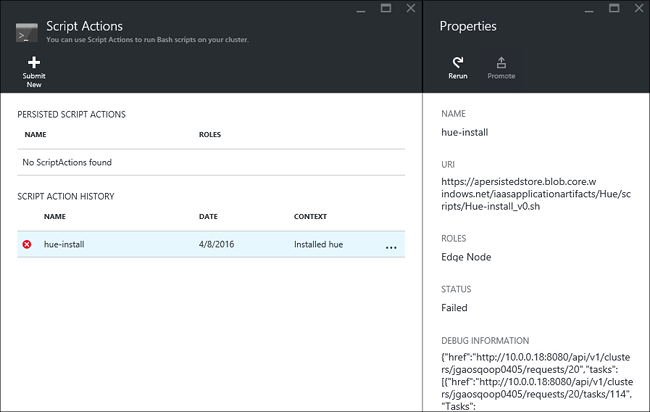

<properties
    pageTitle="Installare applicazioni Hadoop su HDInsight | Microsoft Azure"
    description="Informazioni su come installare le applicazioni di HDInsight HDInsight applicazioni."
    services="hdinsight"
    documentationCenter=""
    authors="mumian"
    manager="jhubbard"
    editor="cgronlun"
    tags="azure-portal"/>

<tags
    ms.service="hdinsight"
    ms.devlang="na"
    ms.topic="hero-article"
    ms.tgt_pltfrm="na"
    ms.workload="big-data"
    ms.date="09/14/2016"
    ms.author="jgao"/>

# Installare applicazioni HDInsight personalizzate

Un'applicazione HDInsight è un'applicazione che gli utenti possono installare in un cluster basati su Linux HDInsight.  Queste applicazioni da Microsoft, fornitori di software indipendenti (ISV) o per se stessi. In questo articolo si imparerà a installare un'applicazione di HDInsight che non è stata pubblicata al portale di Azure in HDInsight. L'applicazione che verrà installato è [tonalità](http://gethue.com/). 

Altri articoli correlati:

- [HDInsight installare applicazioni](hdinsight-apps-install-applications.md): informazioni su come installare un'applicazione di HDInsight per i cluster.
- [Pubblicare HDInsight applicazioni](hdinsight-apps-publish-applications.md): informazioni su come pubblicare delle applicazioni HDInsight personalizzate Azure Marketplace.
- [MSDN: installare un'applicazione di HDInsight](https://msdn.microsoft.com/library/mt706515.aspx): informazioni su come definire le applicazioni di HDInsight.

 
## Prerequisiti

Se si desidera installare le applicazioni di HDInsight in un cluster HDInsight esistente, è necessario disporre di un cluster di HDInsight. Per creare uno, vedere [creare cluster](hdinsight-hadoop-linux-tutorial-get-started.md#create-cluster). È inoltre possibile installare le applicazioni di HDInsight quando si crea un cluster di HDInsight.

## Installare le applicazioni HDInsight

Quando si crea un cluster o a un cluster HDInsight esistente, è possibile installare applicazioni HDInsight. Per la definizione di modelli di Manager delle risorse di Azure, vedere [MSDN: installare un'applicazione di HDInsight](https://msdn.microsoft.com/library/mt706515.aspx).

I file necessari per la distribuzione dell'applicazione (tonalità):

- [azuredeploy.JSON](https://github.com/hdinsight/Iaas-Applications/blob/master/Hue/azuredeploy.json): modello di Manager delle risorse per l'installazione dell'applicazione HDInsight. Vedere [MSDN: installare un'applicazione di HDInsight](https://msdn.microsoft.com/library/mt706515.aspx) per lo sviluppo di modello di Manager delle risorse.
- [install_v0.sh tonalità](https://github.com/hdinsight/Iaas-Applications/blob/master/Hue/scripts/Hue-install_v0.sh): azione lo Script chiamati dal modello di Manager delle risorse per la configurazione del nodo di bordo. 
- [binaries.tgz tonalità](https://hdiconfigactions.blob.core.windows.net/linuxhueconfigactionv01/hue-binaries-14-04.tgz): il file binario tonalità chiamato da hui install_v0.sh. 
- [file binari di tonalità-04.tgz di 14](https://hdiconfigactions.blob.core.windows.net/linuxhueconfigactionv01/hue-binaries-14-04.tgz): il file binario tonalità chiamato da hui install_v0.sh. 
- [webwasb tomcat.tar.gz](https://hdiconfigactions.blob.core.windows.net/linuxhueconfigactionv01/webwasb-tomcat.tar.gz): un'applicazione web di esempio (Tomcat) chiamata da hui install_v0.sh.

**Per installare tonalità a un cluster HDInsight esistente**

1. Fare clic sull'immagine seguente per accedere a Azure e aprire il modello di gestione risorse nel portale di Azure. 

    

    Questo pulsante apre un modello di gestione risorse nel portale di Azure.  Il modello di gestione risorse si trova in [https://github.com/hdinsight/Iaas-Applications/tree/master/Hue](https://github.com/hdinsight/Iaas-Applications/tree/master/Hue).  Per informazioni su come scrivere questo modello di Manager delle risorse, vedere [MSDN: installare un'applicazione di HDInsight](https://msdn.microsoft.com/library/mt706515.aspx).
    
2. Da e il **parametri** immettere quanto segue:

    - **Nome cluster**: immettere il nome del cluster in cui si desidera installare l'applicazione. Questo cluster deve essere un cluster esistente.
    
3. Fare clic su **OK** per salvare i parametri.
4. Da e il **distribuzione personalizzata** , immettere **il raggruppamento delle risorse**.  Gruppo di risorse è un contenitore che raggruppa cluster, l'account di archiviazione dipendenti e altre risorse. È necessario utilizzare lo stesso gruppo di risorse del cluster.
5. Fare clic su **note legali**e quindi fare clic su **Crea**.
6. Verificare che la casella di controllo **Aggiungi a dashboard** sia selezionata e quindi fare clic su **Crea**. È possibile visualizzare lo stato dell'installazione dal riquadro aggiunto al dashboard del portale e la notifica portale (fare clic sull'icona della campana nella parte superiore del portale).  Bastano circa 10 minuti per installare l'applicazione.

**Per installare tonalità durante la creazione di un cluster**

1. Fare clic sull'immagine seguente per accedere a Azure e aprire il modello di gestione risorse nel portale di Azure. 

    

    Questo pulsante apre un modello di gestione risorse nel portale di Azure.  Il modello di gestione risorse si trova in [https://hditutorialdata.blob.core.windows.net/hdinsightapps/create-linux-based-hadoop-cluster-in-hdinsight.json](https://hditutorialdata.blob.core.windows.net/hdinsightapps/create-linux-based-hadoop-cluster-in-hdinsight.json).  Per informazioni su come scrivere questo modello di Manager delle risorse, vedere [MSDN: installare un'applicazione di HDInsight](https://msdn.microsoft.com/library/mt706515.aspx).

2. Seguire le istruzioni per creare cluster e installare tonalità. Per ulteriori informazioni sulla creazione di cluster HDInsight, vedere [cluster basati su Linux creare Hadoop in HDInsight](hdinsight-hadoop-provision-linux-clusters.md).

Oltre al portale di Azure, è possibile usare anche [PowerShell Azure](hdinsight-hadoop-create-linux-clusters-arm-templates.md#deploy-with-powershell) e [Azure CLI](hdinsight-hadoop-create-linux-clusters-arm-templates.md#deploy-with-azure-cli) per chiamare i modelli di Manager delle risorse.

## Convalidare l'installazione

È possibile verificare lo stato dell'applicazione nel portale di Azure per convalidare l'installazione dell'applicazione. Inoltre, è inoltre possibile convalidare tutte HTTP endpoint è stata necessaria la come previsto e la pagina Web, se presente:

**Per aprire il portale di tonalità**

1. Accedere al [portale di Azure](https://portal.azure.com).
2. Fare clic su **Cluster HDInsight** nel menu a sinistra.  Se non è visualizzata, fare clic su **Sfoglia**e quindi fare clic su **Cluster HDInsight**.
3. Selezionare il cluster nel punto in cui è stato installato l'applicazione.
4. Scegliere **applicazioni** e **l'Impostazioni** nella categoria **Generale** . Risulta **tonalità** elencati in e il **App installate** .
5. Fare clic su **tonalità** nell'elenco per visualizzare un elenco delle proprietà.  
6. Fare clic sul collegamento di una pagina Web per convalidare il sito Web; Aprire l'endpoint HTTP in un browser per convalidare l'interfaccia web tonalità, aprire l'endpoint SSH tramite [PuTTY](hdinsight-hadoop-linux-use-ssh-windows.md) o altri [client SSH](hdinsight-hadoop-linux-use-ssh-unix.md).
 
## Risolvere i problemi di installazione

È possibile verificare lo stato di installazione dell'applicazione dalla notifica del portale (fare clic sull'icona della campana nella parte superiore del portale). 

Se non è riuscita installazione di un'applicazione, è possibile visualizzare i messaggi di errore e informazioni da 3 cifre di debug:

- Applicazioni HDInsight: informazioni sugli errori generali.

    Aprire il cluster dal portale e fare clic su applicazioni e l'impostazioni:

    

- Azione di script HDInsight: se il messaggio di errore delle applicazioni HDInsight indica un errore di azione script, altri dettagli sull'errore script verranno visualizzati nel riquadro azioni script.

    Fare clic su azione Script e l'impostazioni. La cronologia di azioni di script di visualizzare i messaggi di errore

    
    
- Interfaccia utente Ambari Web: Se lo script di installazione non è la causa dell'errore, utilizzare dell'interfaccia utente Web Ambari per controllare registri completi sugli script di installazione.

    Per ulteriori informazioni, vedere [risoluzione dei problemi](hdinsight-hadoop-customize-cluster-linux.md#troubleshooting).

## Rimuovere le applicazioni HDInsight

Esistono diversi modi per eliminare un'applicazione HDInsight.

### Utilizzare portale

**Per rimuovere un'applicazione tramite il portale**

1. Accedere al [portale di Azure](https://portal.azure.com).
2. Fare clic su **Cluster HDInsight** nel menu a sinistra.  Se non è visualizzata, fare clic su **Sfoglia**e quindi fare clic su **Cluster HDInsight**.
3. Selezionare il cluster nel punto in cui è stato installato l'applicazione.
4. Scegliere **applicazioni** e **l'Impostazioni** nella categoria **Generale** . Viene visualizzato un elenco di applicazione installata. Per questa esercitazione, **tonalità** elencate nella e **App installate** .
5. Destro dell'applicazione che si desidera rimuovere e quindi fare clic su **Elimina**.
6. Fare clic su **Sì** per confermare.

Dal portale, è possibile eliminare il cluster o eliminare il gruppo di risorse che contiene l'applicazione.

### Usare PowerShell Azure

Utilizzo di PowerShell di Azure, è possibile eliminare il cluster o eliminare il gruppo di risorse. Vedere [eliminare cluster tramite PowerShell Azure](hdinsight-administer-use-powershell.md#delete-clusters).

### Utilizzare CLI Azure

Usa CLI Azure, è possibile eliminare il cluster o eliminare il gruppo di risorse. Vedere [eliminare cluster tramite CLI Azure](hdinsight-administer-use-command-line.md#delete-clusters).

## Passaggi successivi

- [MSDN: installare un'applicazione di HDInsight](https://msdn.microsoft.com/library/mt706515.aspx): informazioni su come sviluppare modelli di Manager delle risorse per la distribuzione di applicazioni HDInsight.
- [HDInsight installare applicazioni](hdinsight-apps-install-applications.md): informazioni su come installare un'applicazione di HDInsight per i cluster.
- [Pubblicare HDInsight applicazioni](hdinsight-apps-publish-applications.md): informazioni su come pubblicare delle applicazioni HDInsight personalizzate Azure Marketplace.
- [HDInsight basati su Linux personalizzare cluster tramite Script azione](hdinsight-hadoop-customize-cluster-linux.md): informazioni su come utilizzare azione Script per installare altre applicazioni.
- [In base a creare Linux Hadoop cluster in HDInsight utilizzare i modelli di Manager delle risorse](hdinsight-hadoop-create-linux-clusters-arm-templates.md): informazioni su come modelli di Manager delle risorse per creare cluster HDInsight chiamata.
- [Utilizzare i nodi bordo vuoto HDInsight](hdinsight-apps-use-edge-node.md): informazioni su come utilizzare un nodo del bordo vuoto per l'accesso HDInsight cluster, verifica delle applicazioni HDInsight e hosting di applicazioni HDInsight.
