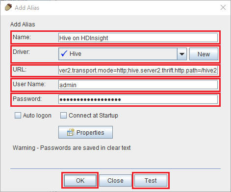

<properties
 pageTitle="Utilizzare JDBC per query Hive su Azure HDInsight"
 description="Informazioni su come utilizzare JDBC per connettersi all'Hive sul Azure HDInsight e quando in modalità remota eseguire query sui dati archiviati nel cloud."
 services="hdinsight"
 documentationCenter=""
 authors="Blackmist"
 manager="jhubbard"
 editor="cgronlun"
    tags="azure-portal"/>

<tags
 ms.service="hdinsight"
 ms.devlang="java"
 ms.topic="article"
 ms.tgt_pltfrm="na"
 ms.workload="big-data"
 ms.date="08/23/2016"
 ms.author="larryfr"/>

#Connettersi a Hive su Azure HDInsight con il driver JDBC Hive

[AZURE.INCLUDE [ODBC-JDBC-selector](../../includes/hdinsight-selector-odbc-jdbc.md)]

In questo documento verrà descritto come utilizzare JDBC da un'applicazione Java per inviare in modalità remota Hive query a un cluster di HDInsight. Si apprenderà come connettersi dal client di SQL esce e come connettersi a livello di programmazione da Java.

Per ulteriori informazioni sull'interfaccia di JDBC Hive, vedere [HiveJDBCInterface](https://cwiki.apache.org/confluence/display/Hive/HiveJDBCInterface).

##Prerequisiti

Per completare la procedura descritta in questo articolo, è necessario quanto segue:

* Hadoop cluster HDInsight. Funzionerà cluster basati su Linux o basato su Windows.

* [Esce SQL](http://squirrel-sql.sourceforge.net/). Esce è un'applicazione client JDBC.

Per creare ed eseguire l'applicazione di linguaggio di esempio presente un collegamento in questo articolo, è necessario quanto segue.

* [Linguaggio sviluppo Kit (JDK) versione 7](https://www.oracle.com/technetwork/java/javase/downloads/jdk7-downloads-1880260.html) o versioni successive.

* [Maven Apache](https://maven.apache.org). Maven è un progetto di compilazione di sistema per i progetti di linguaggio utilizzato dal progetto associato a questo articolo.

##Stringa di connessione

JDBC a un cluster di HDInsight su Azure connessioni supera 443 e del traffico tramite SSL. Il gateway pubblico i cluster occupare dietro reindirizza il traffico alla porta HiveServer2 è effettivamente in attesa. Una stringa di connessione da in modo simile al seguente:

    jdbc:hive2://CLUSTERNAME.azurehdinsight.net:443/default;ssl=true?hive.server2.transport.mode=http;hive.server2.thrift.http.path=/hive2

Sostituire __nome cluster__ con il nome del cluster HDInsight.

##Autenticazione

Per stabilire la connessione, è necessario utilizzare il nome dell'amministratore cluster HDInsight e la password per l'autenticazione al gateway cluster. Quando ci si connette dai client JDBC, ad esempio SQL esce, è necessario immettere il nome dell'amministratore e la password nelle impostazioni client.

Da un'applicazione di linguaggio, è necessario utilizzare il nome e la password quando si stabilisce una connessione. Ad esempio, il codice Java seguente apre una nuova connessione usando la stringa di connessione, nome dell'amministratore e la password:

    DriverManager.getConnection(connectionString,clusterAdmin,clusterPassword);

##Connettersi con esce SQL client

Esce SQL è un client JDBC che può essere utilizzato per eseguire in modalità remota Hive query con i cluster HDInsight. I passaggi seguenti presuppongono che sia stato già installato SQL esce e consentirà di download e configurazione dei driver per Hive.

1. Copiare i driver JDBC Hive il cluster HDInsight.

    * Per __HDInsight basati su Linux__, usare la procedura seguente per scaricare i file di vaso necessari.

        1. Creare una nuova directory contenenti i file. Ad esempio `mkdir hivedriver`.

        2. Da un prompt dei comandi, Bash, PowerShell o altre opzioni della riga, passare alla nuova directory e utilizzare i comandi seguenti per copiare i file da cluster HDInsight.

                scp USERNAME@CLUSTERNAME:/usr/hdp/current/hive-client/lib/hive-jdbc*standalone.jar .
                scp USERNAME@CLUSTERNAME:/usr/hdp/current/hadoop-client/hadoop-common.jar .
                scp USERNAME@CLUSTERNAME:/usr/hdp/current/hadoop-client/hadoop-auth.jar .

            Sostituire __nomeutente__ con il nome dell'account utente SSH per il cluster. Sostituire __nome cluster__ con il nome del cluster HDInsight.

            > [AZURE.NOTE] Negli ambienti di Windows, sarà necessario usare l'utilità PSCP invece scp. È possibile scaricarlo da [http://www.chiark.greenend.org.uk/~sgtatham/putty/download.html](http://www.chiark.greenend.org.uk/~sgtatham/putty/download.html).

    * Per __HDInsight basato su Windows__, utilizzare la procedura seguente per scaricare i file di vaso.

        1. Dal portale di Azure, selezionare il cluster HDInsight e quindi selezionare l'icona __Desktop remoto__ .

            

        2. Per connettersi al cluster e il Desktop remoto, utilizzare il pulsante __Connetti__ . Se il Desktop remoto non è attivato, usare il modulo per fornire un nome utente e password, quindi selezionare __Attiva__ per attivare Desktop remoto per il cluster.

            

            Dopo aver selezionato __Connetti__, verrà scaricato un file con estensione rdp. Utilizzare questo file per avviare il client Desktop remoto. Quando richiesto, usare il nome utente e la password che è stata immessa per l'accesso Desktop remoto.

        3. Una volta connessa, copiare i file seguenti alla sessione Desktop remoto nel computer locale. Tutto salvarli in una directory locale denominata `hivedriver`.

            * C:\apps\dist\hive-0.14.0.2.2.9.1-7\lib\hive-JDBC-0.14.0.2.2.9.1-7-standalone.jar
            * C:\apps\dist\hadoop-2.6.0.2.2.9.1-7\share\hadoop\common\hadoop-Common-2.6.0.2.2.9.1-7.jar
            * C:\apps\dist\hadoop-2.6.0.2.2.9.1-7\share\hadoop\common\lib\hadoop-AUTH-2.6.0.2.2.9.1-7.jar

            > [AZURE.NOTE] I numeri di versione inclusi nei percorsi e nomi di file possono essere diversi per il cluster.

        4. Disconnettere la sessione Desktop remoto dopo avere copiato i file.

3. Avviare l'applicazione esce SQL. Da sinistra della finestra, selezionare __driver__.

    

4. Le icone nella parte superiore della finestra di dialogo __driver__ , selezionare la __+__ icona per creare un nuovo driver.

    

5. Nella finestra di dialogo per aggiungere un Driver, aggiungere le informazioni seguenti.

    * __Nome__: Hive
    * __URL di esempio__: jdbc:hive2://localhost:443/default;ssl=true?hive.server2.transport.mode=http;hive.server2.thrift.http.path=/hive2
    * __Percorso di classe aggiuntive__: usare il pulsante Aggiungi per aggiungere i file vaso scaricato in precedenza
    * __Nome della classe__: org.apache.hive.jdbc.HiveDriver

    

    Fare clic su __OK__ per salvare le impostazioni.

6. Sul lato sinistro della finestra SQL esce, selezionare __gli alias__. Scegliere la __+__ icona per creare un nuovo alias di connessione.

    

7. Usare i valori seguenti per la finestra di dialogo __Aggiungi Alias__ .

    * __Nome__: Hive su HDInsight
    * __Driver__: utilizzare l'elenco a discesa per selezionare il driver __Hive__
    * __URL__: jdbc:hive2://CLUSTERNAME.azurehdinsight.net:443/default;ssl=true?hive.server2.transport.mode=http;hive.server2.thrift.http.path=/hive2

        Sostituire __nome cluster__ con il nome del cluster HDInsight.

    * __Nome utente__: il nome dell'account cluster accesso per il cluster HDInsight. Il valore predefinito è `admin`.
    * __Password__: la password per l'account di accesso cluster. Si tratta di una password che è specificato quando si creano cluster HDInsight.

    

    Utilizzare il pulsante __prova__ per verificare il funzionamento della connessione. Quando __connettersi: Hive su HDInsight__ viene visualizzata la finestra di dialogo, selezionare __Connetti__ per eseguire il test. Se il test ha esito positivo, verrà visualizzata una finestra di dialogo __connessione ha esito positivo__ .

    Utilizzare il pulsante __Ok__ nella parte inferiore della finestra di dialogo __Aggiungi Alias__ per salvare l'alias di connessione.

8. Nell'elenco a discesa __Connetti__ nella parte superiore esce SQL, selezionare __Hive su HDInsight__. Quando richiesto, selezionare __Connetti__.

    

9. Una volta connessa, immettere la query seguente nella finestra di dialogo query SQL e quindi selezionare l'icona di __esecuzione__ . Nell'area dei risultati deve visualizzare i risultati della query.

        select * from hivesampletable limit 10;

    

##La connessione da un esempio di applicazione Java

Un esempio dell'uso di un client di linguaggio di query Hive in HDInsight è disponibile in [https://github.com/Azure-Samples/hdinsight-java-hive-jdbc](https://github.com/Azure-Samples/hdinsight-java-hive-jdbc). Seguire le istruzioni in archivio per generare ed eseguire l'esempio.

##Risoluzione dei problemi

### Errore imprevisto durante il tentativo di aprire una connessione SQL.

__Sintomi__: quando si connette a un cluster di HDInsight della versione 3.3 o 3.4, potrebbe essere visualizzato un messaggio di errore che si è verificato un errore imprevisto. La traccia dello stack per correggere l'errore inizierà con le righe seguenti:

    java.util.concurrent.ExecutionException: java.lang.RuntimeException: java.lang.NoSuchMethodError: org.apache.commons.codec.binary.Base64.<init>(I)V
    at java.util.concurrent.FutureTas...(FutureTask.java:122)
    at java.util.concurrent.FutureTask.get(FutureTask.java:206)

__Causa__: questo errore è causato dalla non corrispondenza la versione del file commons codec.jar usato da esce e necessaria per i componenti di Hive JDBC scaricati da cluster HDInsight.

__Risoluzione__: per correggere questo errore, utilizzare la procedura seguente.

1. Scaricare il file di vaso commons codec dal cluster HDInsight.

        scp USERNAME@CLUSTERNAME:/usr/hdp/current/hive-client/lib/commons-codec*.jar ./commons-codec.jar

2. Uscire da esce e quindi passare alla cartella in cui è installato esce nel sistema. Nella directory esce sotto il `lib` directory, sostituire il codec.jar commons esistente con quello scaricato dal cluster HDInsight.

3. Riavviare esce. L'errore non dovrebbe più verificarsi quando ci si connette all'Hive sul HDInsight.

##Passaggi successivi

Ora che è stato illustrato come utilizzare JDBC per lavorare con Hive, utilizzare i collegamenti seguenti per esplorare altre modalità per lavorare con Azure HDInsight.

* [Caricare dati HDInsight](hdinsight-upload-data.md)
* [Usare Hive con HDInsight](hdinsight-use-hive.md)
* [Utilizzare maialino con HDInsight](hdinsight-use-pig.md)
* [Utilizzare processi MapReduce con HDInsight](hdinsight-use-mapreduce.md)
