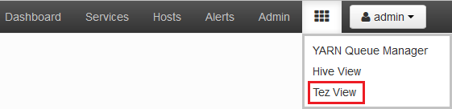

<properties
pageTitle="Uso della visualizzazione Tez Ambari con HDInsight | Azure"
description="Informazioni su come usare la visualizzazione Ambari Tez per eseguire il debug processi Tez su HDInsight."
services="hdinsight"
documentationCenter=""
authors="Blackmist"
manager="jhubbard"
editor="cgronlun"/>

<tags
ms.service="hdinsight"
ms.devlang="na"
ms.topic="article"
ms.tgt_pltfrm="na"
ms.workload="big-data"
ms.date="10/04/2016"
ms.author="larryfr"/>

# Utilizzare le visualizzazioni Ambari per eseguire il debug processi Tez su HDInsight

L'interfaccia utente Web Ambari per HDInsight contiene una visualizzazione Tez che può essere utilizzata per comprendere ed eseguire il debug processi che utilizzano Tez come il motore di esecuzione. La visualizzazione Tez consente di visualizzare il processo come un grafico di elementi collegati, analizza ogni elemento e recuperare statistiche e informazioni di registrazione.

> [AZURE.NOTE] Le informazioni contenute in questo documento sono specifiche di cluster basati su Linux HDInsight. Per informazioni sul debug processi Tez utilizzando HDInsight basato su Windows, vedere [utilizzare l'interfaccia utente Tez per eseguire il debug processi Tez su HDInsight basato su Windows](hdinsight-debug-tez-ui.md).

## Prerequisiti

* Un cluster di HDInsight basati su Linux. Per istruzioni sulla creazione di un nuovo cluster, vedere [Introduzione all'utilizzo HDInsight basati su Linux](hdinsight-hadoop-linux-tutorial-get-started.md).

* Un moderno browser che supporti HTML5.

## Informazioni sulle Tez

Tez è un framework espandibile per l'elaborazione dei dati in Hadoop che fornisce velocità maggiore rispetto all'elaborazione MapReduce tradizionale. Per i cluster basati su Linux HDInsight è il motore predefinito per Hive.

Quando il lavoro viene inviato a Tez, viene creato un indirizzati aciclici grafico (DAG) che descrive l'ordine di esecuzione delle azioni necessari affinché il processo. Singole azioni sono denominate vertici ed eseguire una parte del processo globale. L'esecuzione effettiva del lavoro descritto da un vertice è denominata un'attività e può essere distribuito in più nodi del cluster.

### Informazioni sulla visualizzazione Tez

La visualizzazione Tez fornisce informazioni sui processi che eseguono o ha già stato eseguito utilizzando Tez. Consente di visualizzare DAG generati da Tez, come viene distribuito tra cluster, contatori, ad esempio memoria utilizzata da attività e vertici e informazioni sugli errori. È possibile ottenere informazioni utili negli scenari seguenti:

* Monitoraggio lunga processi, visualizzazione dello stato di avanzamento della mappa e ridurre le attività.

* Analisi dei dati cronologici per i processi di esito positivo o negativo scoprire come elaborazione potrebbe essere migliorate o perché non è riuscito.

## Generare un DAG

La visualizzazione Tez conterrà dati solo se un processo che utilizza il motore di Tez attualmente in esecuzione o è stato eseguito in passato. Query Hive semplici possono essere risolti in genere senza utilizzare Tez, query, tuttavia più complesse che eseguire filtro, raggruppamento, ordinamento, join e così via in genere richiedono Tez.

Utilizzare la procedura seguente per eseguire una query di Hive che verrà eseguita tramite Tez.

1. In un web browser passare al https://CLUSTERNAME.azurehdinsight.net, dove __nome cluster__ è il nome del cluster HDInsight.

2. Dal menu nella parte superiore della pagina, selezionare l'icona di __visualizzazioni__ . Questo aspetto di una serie di quadrati. Nella casella di riepilogo che viene visualizzata, selezionare __Hive visualizzazione__. 

    

3. Quando l'Hive Visualizza carichi, incollare la seguente nell'Editor di Query e quindi fare clic su __Esegui__.

        select market, state, country from hivesampletable where deviceplatform='Android' group by market, country, state;
    
    Una volta completato il processo, verrà visualizzato l'output visualizzato nella sezione __Query processo risultati__ . Il risultato dovrebbe essere simile al seguente
    
        market  state       country
        en-GB   Hessen      Germany
        en-GB   Kingston    Jamaica
        
4. Selezionare la scheda __Log__ . Verranno visualizzate informazioni simile al seguente:
    
        INFO : Session is already open
        INFO :

        INFO : Status: Running (Executing on YARN cluster with App id application_1454546500517_0063)

    Salvare il valore __id App__ , come verrà utilizzato nella sezione successiva.

## Utilizzare la visualizzazione Tez

1. Dal menu nella parte superiore della pagina, selezionare l'icona di __visualizzazioni__ . Nella casella di riepilogo che viene visualizzata, selezionare __Visualizza Tez__.

    

2. Quando viene caricata la visualizzazione Tez, verrà visualizzato un elenco di DAGs attualmente in esecuzione o sia stato eseguito sul cluster. La visualizzazione predefinita include Dag Name, Id, mittente, stato, ora di inizio, data/ora fine, durata, ID applicazione e coda. Altre colonne possono essere aggiunti tramite l'icona a forma di ingranaggio a destra della pagina.

    

3. Se si dispone di un solo movimento, sia per la query che si è eseguito nella sezione precedente. Se si dispone di più voci, è possibile eseguire ricerche immettere l'ID dell'applicazione nel campo __ID applicazione__ e quindi premere INVIO.

4. Selezionare il __Nome Dag__. Verranno visualizzate informazioni di DAG, oltre che la possibilità di scaricare un file zip di file JSON che contengono informazioni la DAG.

    

5. Sopra i __Dettagli DAG__ sono diversi collegamenti che possono essere utilizzati per visualizzare le informazioni di DAG.

    * __Contatori DAG__ Visualizza informazioni contatori questo DAG.
    
    * __Visualizzazione grafica__ Visualizza una rappresentazione grafica di questo DAG.
    
    * __Tutti i vertici__ consente di visualizzare un elenco dei vertici questo DAG.
    
    * __Tutte le attività__ consente di visualizzare un elenco delle attività per tutti i vertici questo DAG.
    
    * __TaskAttempts tutti__ sono visualizzate informazioni tenta di eseguire attività per questo DAG.
    
    > [AZURE.NOTE] Se si scorre la visualizzazione delle colonne per vertici, attività e TaskAttempts, si noterà che sono disponibili collegamenti a visualizzare __contatori__ e __visualizzare e scaricare i registri__ per ogni riga.

    Se si è verificato un errore con il processo, i dettagli DAG verrà visualizzato lo stato non riuscito, con collegamenti a informazioni sull'attività non riuscito. Informazioni di diagnostica verranno visualizzate sotto i dettagli DAG.
    
    

7. Selezionare __visualizzazione grafica__. Verrà visualizzata una rappresentazione grafica del DAG. È possibile posizionare il puntatore del mouse su ogni vertice nella visualizzazione per visualizzare informazioni su di esso.

    

8. Fare clic su un vertice verrà caricato __Vertice dettagli__ per tale elemento. Fare clic sul vertice __mappa 1__ per visualizzare i dettagli per questo articolo.

    

9. Si noti che è ora possibile collegamenti nella parte superiore della pagina relative alle attività e vertici.

    > [AZURE.NOTE] Possono arrivare anche in questa pagina per tornare indietro __DAG dettagli__, selezionando __Dettagli vertice__, quindi selezionare il vertice __1 mappa__ .

    * __Vertice contatori__ consente di visualizzare informazioni del contatore per questo vertice.
    
    * __Attività__ consente di visualizzare le attività per questo vertice.
    
    * __Attività tenta__ sono visualizzate informazioni tenta di eseguire attività per questo vertice.
    
    * __Origini & sink__ vengono visualizzate origini dati e sink per questo vertice.

    > [AZURE.NOTE] Come con il menu precedente, è possibile scorrere la visualizzazione delle colonne per attività, tentativi di attività e origini Sinks__ visualizzare i collegamenti a informazioni aggiuntive per ogni elemento.

10. Selezionare __le attività__e quindi selezionare l'elemento denominato __00_000000__. Per questa attività verranno visualizzati __Dettagli attività__ . Nella schermata, è possibile visualizzare __Contatori attività__ e __Attività tentativi__.

    

## Passaggi successivi

Ora che è stato illustrato come utilizzare la visualizzazione Tez, altre informazioni [Tramite Hive su HDInsight](hdinsight-use-hive.md).

Per informazioni tecniche più dettagliate sulle Tez, vedere la [pagina Tez Hortonworks](http://hortonworks.com/hadoop/tez/).

Per ulteriori informazioni sull'utilizzo di Ambari con HDInsight, vedere [gestire HDInsight cluster tramite l'interfaccia utente Web Ambari](hdinsight-hadoop-manage-ambari.md)
