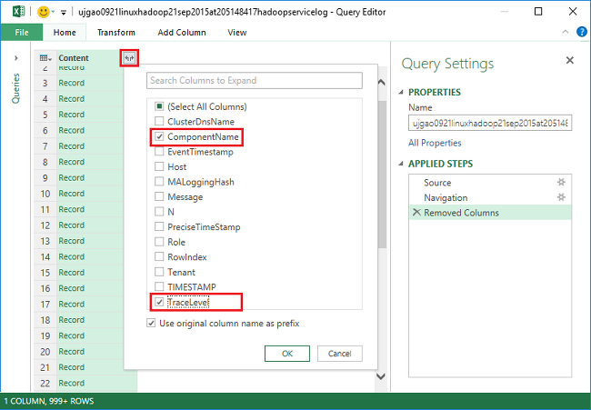
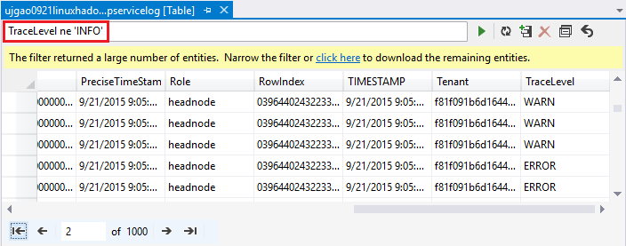

<properties
    pageTitle="Eseguire il debug Hadoop in HDInsight: i registri di visualizzare e interpretare i messaggi di errore | Microsoft Azure"
    description="Informazioni sui messaggi di errore che viene visualizzato quando si amministra HDInsight tramite PowerShell e i passaggi da che eseguire per recuperare."
    services="hdinsight"
    tags="azure-portal"
    editor="cgronlun"
    manager="jhubbard"
    authors="mumian"
    documentationCenter=""/>

<tags
    ms.service="hdinsight"
    ms.workload="big-data"
    ms.tgt_pltfrm="na"
    ms.devlang="na"
    ms.topic="article"
    ms.date="09/02/2016"
    ms.author="jgao"/>

# Analizzare i registri HDInsight

Ogni cluster Hadoop in Azure HDInsight dispone di un account di archiviazione Azure utilizzato come file system predefinito. L'account di archiviazione è definito come l'account di archiviazione predefinito. Cluster utilizza l'archivio tabelle Azure e archiviazione Blob sull'account di archiviazione predefinito per archiviare i registri.  Per verificare l'account di archiviazione predefinito per il cluster, vedere [gestire Hadoop cluster in HDInsight](hdinsight-administer-use-management-portal.md#find-the-default-storage-account). I registri conservano nell'account di archiviazione anche dopo il raggruppamento viene eliminato.

##Registri scritti in tabelle Azure

I registri scritti in tabelle Azure offrono un livello di approfondimento cosa succede con un cluster di HDInsight.

Quando si crea un cluster di HDInsight, per cluster basati su Linux in archiviazione tabella predefinita vengono automaticamente create 6 tabelle:

- hdinsightagentlog
- Registro di sistema
- daemonlog
- hadoopservicelog
- ambariserverlog
- ambariagentlog

3 tabelle vengono create per i cluster basato su Windows:

- Setuplog: Log di eventi/eccezioni durante il provisioning/la configurazione dei cluster HDInsight.
- hadoopinstalllog: Log di eventi/eccezioni durante l'installazione di Hadoop nel cluster. In questa tabella può essere utile il debug di problemi relativi ai cluster creato con parametri personalizzati.
- hadoopservicelog: Log di eventi/eccezioni registrato da tutti i servizi di Hadoop. In questa tabella può essere utile il debug di problemi relativi agli errori di processo nei cluster HDInsight.

I nomi di file tabella sono **u<ClusterName>DDMonYYYYatHHMMSSsss<TableName>**.

Nelle tabelle seguenti sono contenuti i campi seguenti:

- ClusterDnsName
- Nomecomponente
- EventTimestamp
- Host
- MALoggingHash
- Messaggio
- N
- PreciseTimeStamp
- Ruolo
- RowIndex
- Tenant
- TIMESTAMP
- TraceLevel

### Strumenti per i registri di accesso

Sono disponibili numerosi strumenti per accedere ai dati nelle tabelle:

-  Visual Studio
-  Esplora archivi Azure
-  Power Query per Excel

#### Usare Power Query per Excel

Power Query può essere installato da [www.microsoft.com/en-us/download/details.aspx?id=39379]( http://www.microsoft.com/en-us/download/details.aspx?id=39379). Visualizzare la pagina di download per i requisiti di sistema

**Usare Power Query per aprire e analizzare il registro del servizio**

1. Aprire **Microsoft Excel**.
2. Dal menu a **Power Query** fare clic su **Da Azure**e quindi fare clic su **servizio di archiviazione da Microsoft Azure tabelle**.
 
    
3. Immettere il nome dell'account di archiviazione. Può trattarsi di nome breve o il nome di dominio completo.
4. Immettere la chiave account lo spazio di archiviazione. Si deve visualizzare un elenco di tabelle:

    
5. Pulsante destro del mouse nella tabella hadoopservicelog nel riquadro di **spostamento** e selezionare **Modifica**. Risulta 4 colonne. Facoltativamente, è possibile eliminare le colonne **Chiave di partizione**, **Chiave di riga**e **Timestamp** selezionandole e scegliendo **Rimuovi colonne** tra le opzioni nella barra multifunzione.
6. Fare clic sull'icona di espansione nella colonna di contenuto per scegliere le colonne che si desidera importare il foglio di calcolo di Excel. Per questa dimostrazione, si è scelto TraceLevel e nomecomponente: me può fornire informazioni di base su cui componenti erano problemi.

    
7. Fare clic su **OK** per importare i dati.
8. Selezionare le colonne **TraceLevel**, ruolo e **nomecomponente** e quindi fare clic su **Raggruppa per** controllo della barra multifunzione.
9. Fare clic su **OK** nella finestra di dialogo Raggruppa per
10. Fare clic su** Applica e Chiudi**.
 
È ora possibile usare Excel per filtrare e ordinare in base alle esigenze. Naturalmente, da includere altre colonne (ad esempio messaggio) per drill-down dei problemi quando si verificano, ma selezionare e raggruppare le colonne descritte in precedenza fornisce un'immagine adeguata di cosa succede con i servizi di Hadoop. Lo stesso concetto può essere applicato alle tabelle setuplog e hadoopinstalllog.

#### Utilizzare Visual Studio

**Come utilizzare Visual Studio**

1. Aprire Visual Studio.
2. Dal menu **Visualizza** fare clic su **Cloud Explorer**. Oppure è sufficiente fare clic su **CTRL +\, CTRL + X**.
3. **Cloud Explorer**, selezionare **I tipi di risorse**.  L'altra opzione disponibile è **Gruppi di risorse**.
4. Espandere **Gli account di archiviazione**, l'account di archiviazione predefinito per il cluster e **tabelle**.
5. Fare doppio clic su **hadoopservicelog**.
6. Aggiungere un filtro. Per esempio:
    
        TraceLevel eq 'ERROR'

    

    Per ulteriori informazioni sulla creazione di filtri, vedere [Creare stringhe di filtro per la progettazione di tabelle](../vs-azure-tools-table-designer-construct-filter-strings.md).
 
##Log scritto a archiviazione Blob Azure

[I registri scritti in tabelle Azure](#log-written-to-azure-tables) offrono un livello di approfondimento cosa succede con un cluster di HDInsight. Tuttavia, tali tabelle non forniscono registri a livello di attività, che possono essere utili per eseguire il drill-ulteriormente problemi quando si verificano. Per fornire questo livello di dettaglio successivo, HDInsight cluster sono configurati per scrivere i registri di attività al proprio account di archiviazione Blob per qualsiasi processo che verrà inviato tramite Templeton. In pratica, significa che processi inviati con i cmdlet di Microsoft Azure PowerShell o le API di invio processo .NET, non i processi inviati tramite RDP/della riga di comando l'accesso al cluster. 

Per visualizzare i log, vedere [applicazione di Access filati accesso basati su Linux HDInsight](hdinsight-hadoop-access-yarn-app-logs-linux.md).

Per ulteriori informazioni sui registri applicazioni, vedere [gestione dei registri utente semplificata e accesso in filati](http://hortonworks.com/blog/simplifying-user-logs-management-and-access-in-yarn/).
 
 
## Visualizzare i registri di salute e processo cluster

###Interfaccia utente Hadoop di Access

Dal portale di Azure, fare clic su un nome di cluster HDInsight per aprire e il raggruppamento. Da e il grafico, fare clic su **Dashboard**.

Quando richiesto, immettere le credenziali di amministratore cluster. Nella Console di Query che si apre, fare clic su **Hadoop dell'interfaccia utente**.

###Accesso filati dell'interfaccia utente

Dal portale di Azure, fare clic su un nome di cluster HDInsight per aprire e il raggruppamento. Da e il grafico, fare clic su **Dashboard**. Quando richiesto, immettere le credenziali di amministratore cluster. Nella Console di Query che si apre, fare clic su **Filati dell'interfaccia utente**.

È possibile utilizzare l'interfaccia utente filati per eseguire le operazioni seguenti:

* È possibile **ottenere lo stato di cluster**. Nel riquadro sinistro, espandere **Cluster**e fare clic **su**. Questo presenta cluster dettagli stato come totale di memoria, Core usati, lo stato del manager delle risorse cluster, cluster versione e così via.

    

* È possibile **ottenere lo stato del nodo**. Nel riquadro sinistro, espandere **Cluster**e fare clic su **nodi**. Elenca tutti i nodi del cluster indirizzo HTTP di ogni nodo risorse assegnate a ogni nodo e così via.

* **Lo stato dei processi monitor**. Nel riquadro sinistro, espandere **Cluster**e quindi fare clic su **applicazioni** per elencare tutti i processi di cluster. Se si desidera esaminare processi in uno stato specifico (ad esempio nuovo, inviato, esecuzione e così via), fare clic sul collegamento appropriato in **applicazioni**. È possibile scegliere ulteriormente il nome del processo per ulteriori informazioni sul processo di tali inclusi output, i registri e così via.

###Accedere all'interfaccia utente HBase

Dal portale di Azure, fare clic su un nome di cluster HDInsight HBase per aprire e il raggruppamento. Da e il grafico, fare clic su **Dashboard**. Quando richiesto, immettere le credenziali di amministratore cluster. Nella Console di Query che si apre, fare clic su **HBase dell'interfaccia utente**.

## Codici di errore HDInsight

I messaggi di errore dettagliati in questa sezione vengono forniti per comprendere gli utenti di Hadoop in Azure HDInsight possibili condizioni di errore che si possono verificare durante l'amministrazione del servizio tramite PowerShell Azure e in modo sulle operazioni che è possano eseguire per risolvere l'errore.

Alcuni di questi messaggi di errore potrebbero essere visualizzati anche nel portale di Azure quando viene utilizzata per gestire i cluster HDInsight. Ma altri messaggi di errore che possono verificarsi sono presenti meno granulare a causa dei vincoli sulle correttive possibili in questo contesto. In contesti in cui l'attenuazione non è più evidente sono disponibili altri messaggi di errore. 

### AtleastOneSqlMetastoreMustBeProvided
- **Descrizione**: fornire dettagli sul database di SQL Azure per almeno uno dei componenti per usare le impostazioni personalizzate per metastores Hive e Oozie.
- **Riduzione dei rischi**: l'utente deve fornire una metastore di SQL Azure valido e riprovare.  

### AzureRegionNotSupported
- **Descrizione**: Impossibile creare cluster nell'area *nameOfYourRegion*. Utilizzare un'area HDInsight valida e riprovare a richiesta.
- **Riduzione dei rischi**: cliente deve creare l'area cluster che li supporta attualmente: Sudest asiatico, Europa ovest, Nord Europa, USA orientale o occidentale degli Stati Uniti.  

### ClusterContainerRecordNotFound
- **Descrizione**: Impossibile trovare il record cluster richieste.  
- **Riduzione dei rischi**: ripetere l'operazione.

### ClusterDnsNameInvalidReservedWord
- **Descrizione**: Cluster DNS nome *yourDnsName* non è valido. Assicurarsi che nome inizia e termina con caratteri alfanumerici e può contenere solo '-' carattere speciale  
- **Riduzione dei rischi**: assicurarsi che sia stato utilizzato un nome DNS valido per il cluster che inizia e termina con caratteri alfanumerici e non contiene speciali i caratteri eccetto il trattino "-" e quindi ripetere l'operazione.

### ClusterNameUnavailable
- **Descrizione**: nome Cluster *yourClusterName* non è disponibile. Selezionare un altro nome.  
- **Riduzione dei rischi**: l'utente deve specificare un nome cluster univoco e non disponibile e riprovare. Se l'utente stia usando il portale, l'interfaccia utente impegna a comunicare loro se è già utilizzato un nome cluster durante la procedura di creazione.

### ClusterPasswordInvalid
- **Descrizione**: Cluster password non è valida. Password deve contenere almeno 10 caratteri e deve contenere almeno un numero, maiuscola, lettera minuscola e un carattere speciale senza spazi e non deve contenere il nome utente come parte di esso.  
- **Riduzione dei rischi**: fornire una password cluster valida e ripetere l'operazione.

### ClusterUserNameInvalid
- **Descrizione**: nome utente Cluster è valido. Verificare che il nome utente non contenga spazi o caratteri speciali.  
- **Riduzione dei rischi**: specificare il nome utente cluster valida e ripetere l'operazione.

### ClusterUserNameInvalidReservedWord
- **Descrizione**: Cluster DNS nome *yourDnsClusterName* non è valido. Assicurarsi che nome inizia e termina con caratteri alfanumerici e può contenere solo '-' carattere speciale  
- **Riduzione dei rischi**: specificare un nome utente cluster DNS valido e ripetere l'operazione.

### ContainerNameMisMatchWithDnsName
- **Descrizione**: nome del contenitore in URI *yourcontainerURI* e DNS nome *yourDnsName* nel corpo della richiesta deve essere uguale.  
- **Riduzione dei rischi**: assicurarsi che il contenitore nome e il nome del DNS sono le stesse e ripetere l'operazione.

### DataNodeDefinitionNotFound
- **Descrizione**: configurazione cluster non valido. Impossibile trovare le definizioni di nodo dati dimensioni nodo.  
- **Riduzione dei rischi**: ripetere l'operazione.

### DeploymentDeletionFailure
- **Descrizione**: Impossibile eliminare di distribuzione per il Cluster  
- **Riduzione dei rischi**: ripetere l'operazione di eliminazione.

### DnsMappingNotFound
- **Descrizione**: errore di configurazione del servizio. Informazioni di mapping DNS necessarie non trovate.  
- **Riduzione dei rischi**: eliminare cluster e creare un nuovo cluster.

### DuplicateClusterContainerRequest
- **Descrizione**: duplicare tentativo di creazione di cluster contenitore. Record per *nameOfYourContainer* ma non corrispondono a ETag.
- **Riduzione dei rischi**: immettere un nome univoco per il contenitore e ripetere l'operazione di creazione.

### DuplicateClusterInHostedService
- **Descrizione**: servizio di hosting *nameOfYourHostedService* contiene già un cluster. Un servizio di hosting non può contenere più cluster  
- **Riduzione dei rischi**: ospitare il cluster in un altro servizio di hosting.

### FailureToUpdateDeploymentStatus
- **Descrizione**: il server non è in grado di aggiornare lo stato della distribuzione cluster.  
- **Riduzione dei rischi**: ripetere l'operazione. Se si verifica questo evento più volte, contattare CSS.

### HdiRestoreClusterAltered
- **Descrizione**: Cluster *yourClusterName* è stato eliminato come parte di manutenzione. Ricreare il cluster.
- **Riduzione dei rischi**: ricreare il cluster.

### HeadNodeConfigNotFound
- **Descrizione**: configurazione cluster non valido. Configurazione di nodo principale necessari non trovata dimensioni nodo.
- **Riduzione dei rischi**: ripetere l'operazione.

### HostedServiceCreationFailure
- **Descrizione**: Impossibile creare il servizio di hosting *nameOfYourHostedService*. Ripetere richiesta.  
- **Riduzione dei rischi**: ripetere la richiesta.

### HostedServiceHasProductionDeployment
- **Descrizione**: servizio di hosting *nameOfYourHostedService* ha già un ambiente di produzione. Un servizio di hosting non può contenere più distribuzioni di produzione. Ripetere la richiesta con un nome diverso cluster.
- **Riduzione dei rischi**: usare un nome diverso cluster e riprovare.

### HostedServiceNotFound
- **Descrizione**: ospitato servizio *nameOfYourHostedService* per il cluster non è stato trovato.  
- **Riduzione dei rischi**: se il cluster è in stato di errore, eliminarla e quindi riprovare.

### HostedServiceWithNoDeployment
- **Descrizione**: servizio di hosting *nameOfYourHostedService* non sono distribuzione associato.  
- **Riduzione dei rischi**: se il cluster è in stato di errore, eliminarla e quindi riprovare.

### InsufficientResourcesCores
- **Descrizione**: il SubscriptionId *yourSubscriptionId* non ha core a sinistra per creare cluster *yourClusterName*. Obbligatorio: *resourcesRequired*è disponibile: *resourcesAvailable*.  
- **Riduzione dei rischi**: liberare risorse di abbonamento o aumentare le risorse disponibili per la sottoscrizione e provare a ricreare il cluster.

### InsufficientResourcesHostedServices
- **Descrizione**: ID abbonamento *yourSubscriptionId* non dispone di quota per un nuovo HostedService creare cluster *yourClusterName*.  
- **Riduzione dei rischi**: liberare risorse di abbonamento o aumentare le risorse disponibili per la sottoscrizione e provare a ricreare il cluster.

### InternalErrorRetryRequest
- **Descrizione**: il server ha rilevato un errore interno. Ripetere richiesta.  
- **Riduzione dei rischi**: ripetere la richiesta.

### InvalidAzureStorageLocation
- **Descrizione**: posizione di archiviazione Azure *dataRegionName* non è un percorso valido. Assicurarsi che l'area geografica sia corretto e riprovare a richiesta.
- **Riduzione dei rischi**: selezionare una posizione di archiviazione che supporta HDInsight, verificare che il cluster è condivisa e ripetere l'operazione.

### InvalidNodeSizeForDataNode
- **Descrizione**: dimensione di memoria virtuale non valido per i nodi di dati. Solo dimensioni 'Grandi macchine Virtuali' sono supportata per tutti i nodi di dati.  
- **Riduzione dei rischi**: specificare la dimensione del nodo supportati per il nodo dati e ripetere l'operazione.

### InvalidNodeSizeForHeadNode
- **Descrizione**: dimensione di memoria virtuale non valido per nodo principale. Solo dimensioni 'Grandi dimensioni macchine Virtuali' sono supportata per nodo principale.  
- **Riduzione dei rischi**: specificare la dimensione del nodo supportati per il nodo principale e ripetere l'operazione

### InvalidRightsForDeploymentDeletion
- **Descrizione**: ID abbonamento *yourSubscriptionId* in uso non ha autorizzazioni sufficienti per eseguire l'operazione di eliminazione per cluster *yourClusterName*.  
- **Riduzione dei rischi**: se il cluster è in stato di errore, rilasciarla e quindi riprovare.  

### InvalidStorageAccountBlobContainerName
- **Descrizione**: archiviazione esterna account blob contenitore nome *yourContainerName* non è valido. Verificare che nome inizia con una lettera e contiene solo lettere, numeri e trattino.  
- **Riduzione dei rischi**: specificare un nome di contenitore valido dello spazio di archiviazione blob account e ripetere l'operazione.

### InvalidStorageAccountConfigurationSecretKey
- **Descrizione**: configurazione per lo spazio di archiviazione esterni account *yourStorageAccountName* deve disporre di dettagli chiave segreti da impostare.  
- **Riduzione dei rischi**: specificare una chiave segreta valida per l'account di archiviazione e ripetere l'operazione.

### InvalidVersionHeaderFormat
- **Descrizione**: versione intestazione *yourVersionHeader* formato non è valido di yyyy-mm-dd.  
- **Riduzione dei rischi**: specificare un formato valido per l'intestazione della versione e riprovare.

### MoreThanOneHeadNode
- **Descrizione**: configurazione cluster non valido. Trovare più di una configurazione di nodo principale.  
- **Riduzione dei rischi**: modificare la configurazione, pertanto è specificato che onloy un nodo principale.

### OperationTimedOutRetryRequest
- **Descrizione**: Impossibile completare l'operazione entro il tempo consentito o il numero massimo tentativi possibili. Ripetere richiesta.  
- **Riduzione dei rischi**: ripetere la richiesta.

### ParameterNullOrEmpty
- **Descrizione**: parametro *yourParameterName* non può essere null o vuoto.  
- **Riduzione dei rischi**: specificare un valore valido per il parametro.

### PreClusterCreationValidationFailure
- **Descrizione**: uno o più degli input cluster creazione richiesta non è valido. Verificare che i valori di input siano corretti e riprovare a richiesta.  
- **Riduzione dei rischi**: verificare che i valori di input siano corretti e riprovare a richiesta.

### RegionCapabilityNotAvailable
- **Descrizione**: la funzionalità di area geografica non disponibile per l'area geografica *yourRegionName* e ID abbonamento *yourSubscriptionId*.  
- **Riduzione dei rischi**: specificare un'area che supporta i cluster HDInsight. Le aree pubblicamente supportate sono: Sudest asiatico, Europa ovest, Nord Europa, USA orientale o occidentale degli Stati Uniti.

### StorageAccountNotColocated
- **Descrizione**: archiviazione account *yourStorageAccountName* trova nell'area *currentRegionName*. Deve essere uguale al area geografica cluster *yourClusterRegionName*.  
- **Riduzione dei rischi**: specificare un account di archiviazione nella stessa regione il cluster oppure se sono già in account di archiviazione dei dati, creare un nuovo cluster nella stessa regione come account di archiviazione esistente. Se il portale interfaccia utente di notifica di questo problema in anticipo.

### SubscriptionIdNotActive
- **Descrizione**: dato l'ID di abbonamento *yourSubscriptionId* non è attiva.  
- **Riduzione dei rischi**: riattivare l'abbonamento o ottenere un nuovo abbonamento valido.

### SubscriptionIdNotFound
- **Descrizione**: ID abbonamento *yourSubscriptionId* non è stato trovato.  
- **Riduzione dei rischi**: verificare che l'ID di abbonamento è valido e ripetere l'operazione.

### UnableToResolveDNS
- **Descrizione**: Impossibile risolvere DNS *yourDnsUrl*. Verificare che l'URL completo per l'endpoint blob viene fornito.  
- **Riduzione dei rischi**: fornisce un URL blob valido. L'URL deve essere completamente valido, tra cui inizia con *http://* e che terminano in *com*.

### UnableToVerifyLocationOfResource
- **Descrizione**: Impossibile verificare posizione della risorsa *yourDnsUrl*. Verificare che l'URL completo per l'endpoint blob viene fornito.  
- **Riduzione dei rischi**: fornisce un URL blob valido. L'URL deve essere completamente valido, tra cui inizia con *http://* e che terminano in *com*.

### VersionCapabilityNotAvailable
- **Descrizione**: la funzionalità di versione non disponibile per la versione *specifiedVersion* e ID abbonamento *yourSubscriptionId*.  
- **Riduzione dei rischi**: scegliere una versione è disponibile e ripetere l'operazione.

### VersionNotSupported
- **Descrizione**: versione *specifiedVersion* non è supportato.
- **Riduzione dei rischi**: scegliere una versione supportata e ripetere l'operazione.

### VersionNotSupportedInRegion
- **Descrizione**: versione *specifiedVersion* non è disponibile nelle opzioni internazionali Azure *specifiedRegion*.  
- **Riduzione dei rischi**: scegliere una versione supportata nell'area specificata e ripetere l'operazione.

### WasbAccountConfigNotFound
- **Descrizione**: configurazione cluster non valido. Configurazione dell'account WASB richiesta non viene trovata nell'account esterni.  
- **Riduzione dei rischi**: verificare che l'account esiste ed è correttamente specificato nella configurazione e ripetere l'operazione.

## Passaggi successivi

- [Utilizzare le visualizzazioni Ambari per eseguire il debug processi Tez su HDInsight](hdinsight-debug-ambari-tez-view.md)
- [Abilitare heap immagini per i servizi Hadoop su HDInsight basati su Linux](hdinsight-hadoop-collect-debug-heap-dump-linux.md)
- [Gestire i cluster HDInsight tramite l'interfaccia utente Web Ambari](hdinsight-hadoop-manage-ambari.md)
