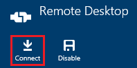
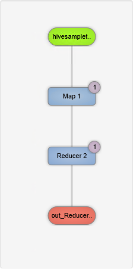

<properties
pageTitle="Utilizzo dell'interfaccia utente Tez basato su Windows HDInsight | Azure"
description="Informazioni su come utilizzare UI Tez per il debug di processi Tez su basato su Windows HDInsight HDInsight."
services="hdinsight"
documentationCenter=""
authors="Blackmist"
manager="jhubbard"
editor="cgronlun"/>

<tags
ms.service="hdinsight"
ms.devlang="na"
ms.topic="article"
ms.tgt_pltfrm="na"
ms.workload="big-data"
ms.date="10/04/2016"
ms.author="larryfr"/>

# Utilizzare UI Tez per il debug di processi Tez su HDInsight basato su Windows

UI Tez è una pagina web che può essere utilizzato per comprendere ed eseguire il debug processi che utilizzano Tez come il motore di esecuzione su cluster HDInsight basato su Windows. UI Tez consente di visualizzare il processo come un grafico di elementi collegati, analizza ogni elemento e recuperare statistiche e informazioni di registrazione.

> [AZURE.NOTE] Le informazioni contenute in questo documento sono specifiche di cluster HDInsight basato su Windows. Per informazioni sulla visualizzazione e il debug Tez su basati su Linux HDInsight, vedere [Utilizzare le visualizzazioni di Ambari per eseguire il debug processi Tez su HDInsight](hdinsight-debug-ambari-tez-view.md).

## Prerequisiti

* Un cluster basato su Windows HDInsight. Per istruzioni sulla creazione di un nuovo cluster, vedere [Introduzione all'utilizzo HDInsight basato su Windows](hdinsight-hadoop-tutorial-get-started-windows.md).

    > [AZURE.IMPORTANT] UI Tez è disponibile solo in cluster basato su Windows HDInsight creati dopo l'8 febbraio 2016.

* Un client Desktop remoto basato su Windows.

## Informazioni sulle Tez

Tez è un framework espandibile per l'elaborazione dei dati in Hadoop che fornisce velocità maggiore rispetto all'elaborazione MapReduce tradizionale. Per i cluster HDInsight basato su Windows, è un motore facoltativo che è possibile abilitare per Hive utilizzando il comando seguente come parte della query Hive:

    set hive.execution.engine=tez;

Quando il lavoro viene inviato a Tez, viene creato un indirizzati aciclici grafico (DAG) che descrive l'ordine di esecuzione delle azioni necessari affinché il processo. Singole azioni sono denominate vertici ed eseguire una parte del processo globale. L'esecuzione effettiva del lavoro descritto da un vertice è denominata un'attività e può essere distribuito in più nodi del cluster.

### La comprensione dell'interfaccia utente Tez

UI Tez è che una pagina web fornisce informazioni sui processi che eseguono o ha già stato eseguito utilizzando Tez. Consente di visualizzare DAG generati da Tez, come viene distribuito tra cluster, contatori, ad esempio memoria utilizzata da attività e vertici e informazioni sugli errori. È possibile ottenere informazioni utili negli scenari seguenti:

* Monitoraggio lunga processi, visualizzazione dello stato di avanzamento della mappa e ridurre le attività.

* Analisi dei dati cronologici per i processi di esito positivo o negativo scoprire come elaborazione potrebbe essere migliorate o perché non è riuscito.

## Generare un DAG

UI Tez conterrà dati solo se un processo che utilizza il motore di Tez attualmente in esecuzione o è stato eseguito in passato. Query Hive semplici possono essere risolti in genere senza utilizzare Tez, query, tuttavia più complesse che eseguire filtro, raggruppamento, ordinamento, join e così via in genere richiedono Tez.

Utilizzare la procedura seguente per eseguire una query di Hive che verrà eseguita tramite Tez.

1. In un web browser passare al https://CLUSTERNAME.azurehdinsight.net, dove __nome cluster__ è il nome del cluster HDInsight.

2. Dal menu nella parte superiore della pagina, selezionare __Editor Hive__. Verrà visualizzata una pagina con la query di esempio seguente.

        Select * from hivesampletable

    Cancellare la query di esempio e sostituirlo con le operazioni seguenti.

        set hive.execution.engine=tez;
        select market, state, country from hivesampletable where deviceplatform='Android' group by market, country, state;

3. Selezionare il pulsante __Invia__ . La sezione __Processo sessione__ nella parte inferiore della pagina verrà visualizzato lo stato della query. Una volta lo stato è impostato su __completata__, selezionare il collegamento __Visualizza dettagli__ per visualizzare i risultati. L' __Output processo__ dovrebbe essere simile al seguente:
        
        en-GB   Hessen      Germany
        en-GB   Kingston    Jamaica
        en-GB   Nairobi Area    Kenya

## Utilizzare l'interfaccia utente Tez

> [AZURE.NOTE] UI Tez disponibile solo dal desktop dei nodi testa cluster, pertanto è necessario utilizzare Desktop remoto per connettersi a testa nodi.

1. Dal [portale di Azure](https://portal.azure.com), selezionare il cluster HDInsight. Nella parte superiore della stessa e HDInsight, selezionare l'icona __Desktop remoto__ . Verranno visualizzati e il desktop remoto

    

2. Scegliere __Connetti__ a cui connettersi il nodo principale cluster e il Desktop remoto. Quando richiesto, usare il nome utente Desktop remoto cluster e la password per autenticare la connessione.

    

    > [AZURE.NOTE] Se non è stata attivata la connettività Desktop remoto, specificare un nome utente, la password e data di scadenza, quindi selezionare __Attiva__ per attivare Desktop remoto. Una volta è stata attivata, utilizzare i passaggi precedenti per la connessione.

3. Una volta connessa, aprire Internet Explorer sul desktop remoto, selezionare l'icona a forma di ingranaggio in alto a destra del browser e quindi selezionare __Impostazioni di visualizzazione di compatibilità__.

4. Dalla parte inferiore delle __Impostazioni di visualizzazione di compatibilità__, deselezionare la casella di controllo Esegui iscrizione __siti intranet visualizzazione nella visualizzazione compatibilità__ e __gli elenchi di compatibilità utilizzare Microsoft__e quindi selezionare __Chiudi__.

5. In Internet Explorer, passare alla http://headnodehost:8188/tezui / #/. Verrà visualizzata la UI Tez

    

    Quando viene caricato UI Tez, verrà visualizzato un elenco di DAGs attualmente in esecuzione o sia stato eseguito sul cluster. La visualizzazione predefinita include Dag Name, Id, mittente, stato, ora di inizio, data/ora fine, durata, ID applicazione e coda. Altre colonne possono essere aggiunti tramite l'icona a forma di ingranaggio a destra della pagina.

    Se si dispone di un solo movimento, sia per la query che si è eseguito nella sezione precedente. Se si dispone di più voci, è possibile eseguire una ricerca tramite l'immissione di criteri di ricerca nei campi sopra il DAGs quindi premere __INVIO__.

4. Selezionare il __Nome Dag__ per la voce DAG più recente. Verranno visualizzate informazioni di DAG, oltre che la possibilità di scaricare un file zip di file JSON che contengono informazioni la DAG.

    

5. Sopra i __Dettagli DAG__ sono diversi collegamenti che possono essere utilizzati per visualizzare le informazioni di DAG.

    * __Contatori DAG__ Visualizza informazioni contatori questo DAG.
    
    * __Visualizzazione grafica__ Visualizza una rappresentazione grafica di questo DAG.
    
    * __Tutti i vertici__ consente di visualizzare un elenco dei vertici questo DAG.
    
    * __Tutte le attività__ consente di visualizzare un elenco delle attività per tutti i vertici questo DAG.
    
    * __TaskAttempts tutti__ sono visualizzate informazioni tenta di eseguire attività per questo DAG.
    
    > [AZURE.NOTE] Se si scorre la visualizzazione delle colonne per vertici, attività e TaskAttempts, si noterà che sono disponibili collegamenti a visualizzare __contatori__ e __visualizzare e scaricare i registri__ per ogni riga.

    Se si è verificato un errore con il processo, i dettagli DAG verrà visualizzato lo stato non riuscito, con collegamenti a informazioni sull'attività non riuscito. Informazioni di diagnostica verranno visualizzate sotto i dettagli DAG.

7. Selezionare __visualizzazione grafica__. Verrà visualizzata una rappresentazione grafica del DAG. È possibile posizionare il puntatore del mouse su ogni vertice nella visualizzazione per visualizzare informazioni su di esso.

    

8. Fare clic su un vertice verrà caricato __Vertice dettagli__ per tale elemento. Fare clic sul vertice __mappa 1__ per visualizzare i dettagli per questo articolo. Selezionare __Conferma__ per confermare la struttura di spostamento.

    

9. Si noti che è ora possibile collegamenti nella parte superiore della pagina relative alle attività e vertici.

    > [AZURE.NOTE] Possono arrivare anche in questa pagina per tornare indietro __DAG dettagli__, selezionando __Dettagli vertice__, quindi selezionare il vertice __1 mappa__ .

    * __Vertice contatori__ consente di visualizzare informazioni del contatore per questo vertice.
    
    * __Attività__ consente di visualizzare le attività per questo vertice.
    
    * __Attività tenta__ sono visualizzate informazioni tenta di eseguire attività per questo vertice.
    
    * __Origini & sink__ vengono visualizzate origini dati e sink per questo vertice.

    > [AZURE.NOTE] Come con il menu precedente, è possibile scorrere la visualizzazione delle colonne per attività, tentativi di attività e origini Sinks__ visualizzare i collegamenti a informazioni aggiuntive per ogni elemento.

10. Selezionare __le attività__e quindi selezionare l'elemento denominato __00_000000__. Per questa attività verranno visualizzati __Dettagli attività__ . Nella schermata, è possibile visualizzare __Contatori attività__ e __Attività tentativi__.

    

## Passaggi successivi

Ora che è stato illustrato come utilizzare la visualizzazione Tez, altre informazioni [Tramite Hive su HDInsight](hdinsight-use-hive.md).

Per informazioni tecniche più dettagliate sulle Tez, vedere la [pagina Tez Hortonworks](http://hortonworks.com/hadoop/tez/).
