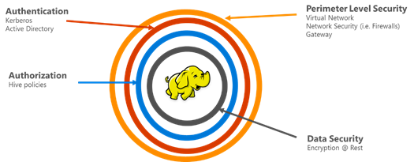

<properties
    pageTitle="Proteggere informazioni generali HDInsight | Microsoft Azure"
    description="Informazioni su..."
    services="hdinsight"
    documentationCenter=""
    authors="saurinsh"
    manager="jhubbard"
    editor="cgronlun"
    tags="azure-portal"/>

<tags
    ms.service="hdinsight"
    ms.devlang="na"
    ms.topic="hero-article"
    ms.tgt_pltfrm="na"
    ms.workload="big-data"
    ms.date="10/24/2016"
    ms.author="saurinsh"/>

# Presentare dominio HDInsight cluster (Preview)

Azure HDInsight fino a oggi è supportato solo un singolo utente locale amministratore. Questo era ideale per applicazione Team o reparti più piccoli. Come Hadoop in base a carichi di lavoro acquisite ulteriori popolarità nel settore dell'organizzazione, la necessità di funzionalità di voto enterprise come l'autenticazione, il supporto per più utenti e il controllo dell'accesso basato sui ruoli basati su active directory è diventato sempre più importante. Utilizzo dei cluster HDInsight dominio, è possibile creare un cluster di HDInsight a un dominio di Active Directory, configurare un elenco di dipendenti dall'organizzazione può eseguire l'autenticazione tramite Azure Active Directory per accedere al cluster HDInsight. Tutti gli utenti all'esterno dell'organizzazione non è possibile accedere o accedere al cluster HDInsight. L'amministratore dell'organizzazione è possibile configurare il controllo dell'accesso basato sui ruoli per la protezione Hive utilizzando [Apache cane](http://hortonworks.com/apache/ranger/), pertanto la limitazione dell'accesso ai dati a solo molto simile in base alle esigenze. Infine, l'amministratore può controllare l'accesso ai dati da dipendenti e le eventuali modifiche apportate ai criteri di controllo di accesso, pertanto per ottenere un numero elevato di governance delle risorse aziendali.

[AZURE.NOTE]> Sono disponibili solo nei cluster basati su Linux HDInsight per il carico di lavoro di Hive le nuove caratteristiche descritte in questa versione di anteprima. Altri carichi di lavoro, ad esempio HBase, vivacità, eccesso ed Kafka, verrà attivate nelle versioni future. 

## Vantaggi

Protezione aziendale contiene quattro pilastri grande – sicurezza perimetrale, autenticazione, autorizzazione e la crittografia.

.

### Protezione perimetrale

Protezione perimetrale in HDInsight viene eseguita mediante le reti virtuali e servizio Gateway. Oggi, un amministratore dell'organizzazione possa creare un cluster di HDInsight all'interno di una rete virtuale e utilizzare gruppi di sicurezza di rete (regole firewall in entrata o in uscita) per limitare l'accesso alla rete virtuale. Solo gli indirizzi IP definiti regole del firewall in ingresso saranno in grado di comunicare con i cluster HDInsight, in modo da garantire la protezione del perimetro. Un altro livello di protezione perimetrale viene eseguito mediante il servizio Gateway. Il Gateway è il servizio che si comporta come prima linea di difesa le richieste in arrivo al cluster HDInsight. Accetta la richiesta, convalida e quindi solo consente la richiesta passare ad altri nodi cluster, in modo da garantire la protezione del perimetro ad altri nodi nome e ai dati del cluster.

### Autenticazione

Con questa versione di anteprima pubblica, un amministratore dell'organizzazione può effettuare il provisioning di un cluster di HDInsight dominio, in una [rete virtuale](https://azure.microsoft.com/services/virtual-network/). I nodi di cluster HDInsight verranno aggiunti al dominio gestito dall'azienda. Questa operazione viene eseguita mediante l'utilizzo di [Servizi di dominio di Azure Active Directory](https://technet.microsoft.com/library/cc770946.aspx). Tutti i nodi del cluster fanno parte di un dominio per la gestione dell'azienda. Con questa impostazione, i dipendenti dell'organizzazione possono accedere ai nodi cluster utilizzando le credenziali di dominio. Utilizzano le credenziali di dominio per l'autenticazione con gli altri endpoint approvata quali tonalità Ambari visualizzazioni, ODBC, JDBC, PowerShell e le API REST per interagire con i cluster. L'amministratore ha il controllo completo su limitare il numero di utenti interazione con i cluster tramite i seguenti endpoint.

### Autorizzazione

Una buona norma seguita dalla maggior parte delle organizzazioni è che non tutti i dipendenti abbiano accesso a tutte le risorse dell'organizzazione. Allo stesso modo, con questa versione, l'amministratore può definire criteri di controllo di accesso basato sui ruoli per le risorse cluster. Ad esempio, l'amministratore può configurare [Cane Apache](http://hortonworks.com/apache/ranger/) per impostare i criteri di controllo accesso per Hive. Questa funzionalità garantisce che dipendenti siano in grado di accedere solo tutti i dati devono essere completato per la propria attività. L'accesso al cluster SSH anche è limitato solo all'amministratore.

### Il controllo

Oltre a proteggere le risorse cluster HDInsight da utenti non autorizzati e proteggere i dati, il controllo dell'accesso tutte le risorse cluster e i dati è necessario tenere traccia dell'accesso non autorizzato o accidentale delle risorse. Con questa versione di anteprima, l'amministratore può visualizzare e segnalare l'accesso alle risorse cluster HDInsight e dati. L'amministratore può anche visualizzare e creare rapporti di tutte le modifiche ai criteri di controllo di accesso eseguiti in endpoint cane Apache supportati. Un cluster di dominio HDInsight utilizza l'interfaccia utente familiare cane Apache cercare i log di controllo. In back-end, cane utilizza [Apache Solr]( http://hortonworks.com/apache/solr/) per l'archiviazione e i log di ricerca.

### Crittografia

Protezione dei dati è importante per la protezione dell'organizzazione di riunione e i requisiti di conformità e insieme limitazione dell'accesso ai dati da dipendenti non autorizzati, deve essere protetti tramite per proteggerlo. Entrambi gli archivi dati HDInsight cluster Azure lo spazio di archiviazione Blob e lo spazio di archiviazione di Azure dati Lake supportano trasparente lato server [la crittografia dei dati](../storage/storage-service-encryption.md) inattivi. Proteggere HDInsight cluster diretta siano compatibili con la crittografia sul lato server dei dati nella funzione resto.

## Passaggi successivi

- Per configurare un cluster di dominio HDInsight, vedere [configurare dominio HDInsight cluster](hdinsight-domain-joined-configure.md).
- Per la gestione di un cluster di dominio HDInsight, vedere [gestire dominio HDInsight cluster](hdinsight-domain-joined-manage.md).
- Per la configurazione dei criteri Hive e fase Hive query, vedere [configurare Hive criteri per i cluster dominio HDInsight](hdinsight-domain-joined-run-hive.md).
- Per eseguire query Hive utilizzando SSH nei cluster HDInsight dominio, vedere [Usare SSH con basati su Linux Hadoop in HDInsight da Linux, Unix o OS X](hdinsight-hadoop-linux-use-ssh-unix.md#connect-to-a-domain-joined-hdinsight-cluster).