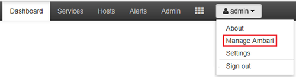
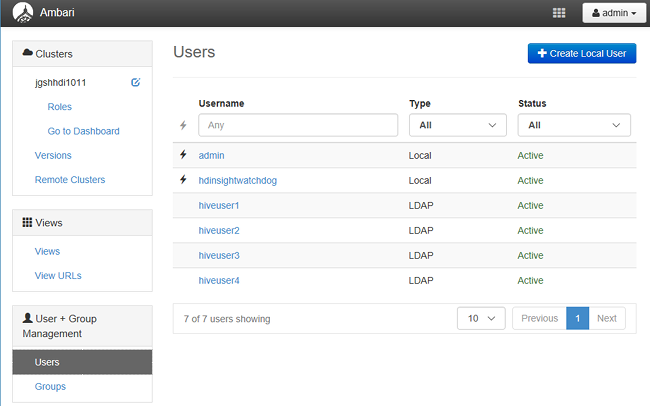
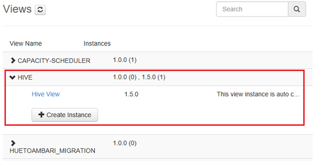

<properties
    pageTitle="Gestire i cluster di dominio HDInsight | Microsoft Azure"
    description="Informazioni su come gestire i cluster di dominio HDInsight"
    services="hdinsight"
    documentationCenter=""
    authors="saurinsh"
    manager="jhubbard"
    editor="cgronlun"
    tags=""/>

<tags
    ms.service="hdinsight"
    ms.devlang="na"
    ms.topic="article"
    ms.tgt_pltfrm="na"
    ms.workload="big-data"
    ms.date="10/25/2016"
    ms.author="saurinsh"/>

# Gestire i cluster di dominio HDInsight (Preview)

Informazioni su utenti e ruoli HDInsight dominio e su come gestire i cluster HDInsight dominio.

## Utenti del dominio HDInsight cluster

Un cluster di HDInsight che non fanno parte dominio è due account utente creati durante la creazione di cluster:

- **Amministrazione Ambari**: l'account è noto anche come *utente Hadoop* o *HTTP*. Questo account può essere utilizzato per accedere a Ambari in https://&lt;nome cluster >. azurehdinsight.net. Può inoltre essere utilizzato per eseguire query sulle viste Ambari, eseguire processi tramite strumenti esterni (ad esempio PowerShell, Templeton, Visual Studio) e l'autenticazione con il driver ODBC Hive e strumenti di Business Intelligence (ad esempio Excel, ottenere informazioni o Tableau).

- **Utente SSH**: questo account può essere utilizzata con SSH ed eseguire comandi sudo. Dispone di privilegi di radice in macchine virtuali Linux.

Un cluster di HDInsight dominio tre nuovi utenti oltre Ambari Admin e SSH utente.

- **Cane amministratore**: l'account è l'account di amministratore cane Apache locale. Non è un utente di dominio active directory. Imposta criteri e apportare altre gli amministratori di utenti o delegata (in modo che gli utenti possono gestire i criteri), è possibile utilizzare questo account. Per impostazione predefinita, il nome utente è *amministratore* e la password coincide con la password di amministratore Ambari. Dalla pagina Impostazioni del cane, è possibile aggiornare la password.

- **L'utente domain admin cluster**: l'account è un utente di dominio active directory designato dall'amministratore di cluster Hadoop inclusi Ambari e cane. È necessario specificare le credenziali dell'utente durante la creazione di cluster. L'utente dispone di privilegi seguenti:

    - Partecipare a computer per il dominio e collocarli all'interno dell'unità Organizzativa specificata durante la creazione di cluster.
    - Creazione di identità di servizio all'interno dell'unità Organizzativa specificata durante la creazione di cluster. 
    - Creare le voci DNS inverse.

    Nota che gli altri utenti di Active Directory hanno anche questi privilegi. 

    Esistono alcuni punti finali all'interno del cluster (ad esempio Templeton) che non sono gestiti cane e pertanto non sicuri. Questi punti finali sono bloccati per tutti gli utenti tranne l'utente del dominio Amministrazione cluster. 

- **Regolare**: durante la creazione di cluster, è possibile fornire più gruppi di active directory. Gli utenti in questi gruppi verranno sincronizzati con cane e Ambari. Questi utenti sono gli utenti del dominio e saranno possibile accedere a solo gestito cane gli endpoint (ad esempio Hiveserver2). Tutti i criteri di RBAC e controllo verrà applicabili a questi utenti.

## Ruoli di dominio HDInsight cluster

Dominio HDInsight disporre dei ruoli seguenti:

- Amministrazione cluster
- Operatore di cluster
- Amministratore del servizio
- Operatore del servizio
- Utente cluster

**Per visualizzare le autorizzazioni di questi ruoli**

1. Aprire l'interfaccia utente di gestione di Ambari.  Vedere [aprire l'interfaccia utente di gestione di Ambari](#open-the-ambari-management-ui).
2. Nel menu a sinistra, fare clic su **ruoli**.
3. Fare clic sul punto interrogativo blu per visualizzare le autorizzazioni:

    

## Aprire l'interfaccia utente di gestione Ambari

1. Accedere al [portale di Azure](https://portal.azure.com).
2. Aprire il cluster HDInsight in blade. Vedere [cluster di elenco e la presentazione](hdinsight-administer-use-management-portal.md#list-and-show-clusters).
3. Fare clic su **Dashboard** dal menu superiore per aprire Ambari.
4. Accedere a Ambari usando il cluster amministratore nome utente e la password.
5. Fare clic sul menu a discesa **amministratore** dall'alto a destra e quindi fare clic su **Gestisci Ambari**.

    

    L'aspetto dell'interfaccia utente:

    

## Elencare gli utenti del dominio sincronizzati da Active Directory

1. Aprire l'interfaccia utente di gestione di Ambari.  Vedere [aprire l'interfaccia utente di gestione di Ambari](#open-the-ambari-management-ui).
2. Nel menu a sinistra, fare clic su **utenti**. Visualizzati tutti gli utenti sincronizzati da Active Directory a cluster HDInsight.

    

## Elencare i gruppi di dominio sincronizzati da Active Directory

1. Aprire l'interfaccia utente di gestione di Ambari.  Vedere [aprire l'interfaccia utente di gestione di Ambari](#open-the-ambari-management-ui).
2. Nel menu a sinistra, fare clic su **gruppi**. Visualizzati tutti i gruppi sincronizzati da Active Directory a cluster HDInsight.

    

## Configurare le autorizzazioni Hive visualizzazioni

1. Aprire l'interfaccia utente di gestione di Ambari.  Vedere [aprire l'interfaccia utente di gestione di Ambari](#open-the-ambari-management-ui).
2. Nel menu a sinistra, fare clic su **visualizzazioni**.
3. Fare clic su **HIVE** per visualizzare i dettagli.

    

4. Fare clic sul collegamento **Visualizza Hive** per configurare le visualizzazioni Hive.
5. Scorrere fino alla sezione **autorizzazioni** .

    

6. Fare clic su **Aggiungi utente** o **Gruppo Aggiungi**e quindi specificare gli utenti o i gruppi che è possono utilizzare le visualizzazioni Hive. 

## Configurare gli utenti per i ruoli

 Per visualizzare un elenco di ruoli e le autorizzazioni, vedere [cluster di ruoli di dominio HDInsight](#roles-of-domain---joined-hdinsight-clusters).

1. Aprire l'interfaccia utente di gestione di Ambari.  Vedere [aprire l'interfaccia utente di gestione di Ambari](#open-the-ambari-management-ui).
2. Nel menu a sinistra, fare clic su **ruoli**.
3. Fare clic su **Aggiungi utente** o **Aggiungi gruppo** per assegnare ruoli diversi utenti e gruppi.
 
## Passaggi successivi

- Per configurare un cluster di dominio HDInsight, vedere [configurare dominio HDInsight cluster](hdinsight-domain-joined-configure.md).
- Per la configurazione dei criteri Hive e fase Hive query, vedere [configurare Hive criteri per i cluster dominio HDInsight](hdinsight-domain-joined-run-hive.md).
- Per eseguire query Hive utilizzando SSH nei cluster HDInsight dominio, vedere [Usare SSH con basati su Linux Hadoop in HDInsight da Linux, Unix o OS X](hdinsight-hadoop-linux-use-ssh-unix.md#connect-to-a-domain-joined-hdinsight-cluster).
